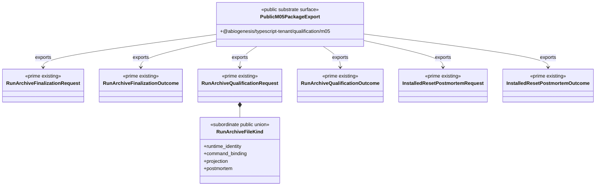

# M05 Public Sandbox Archive API Structural Carrier Diagram

**Status**: Completed
**Date**: 2026-04-27
**Derived from**: [M05_PUBLIC_SANDBOX_ARCHIVE_API_DERIVATION.md](./M05_PUBLIC_SANDBOX_ARCHIVE_API_DERIVATION.md), [M05_PUBLIC_SANDBOX_ARCHIVE_API_FIRST_SLICE_IACS.md](./M05_PUBLIC_SANDBOX_ARCHIVE_API_FIRST_SLICE_IACS.md)

## Reading Rules

- The package export is a public surface over existing `M05` prime carriers.
- `RunArchiveFileKind` is subordinate evidence vocabulary, not a new prime
  archive family.
- Downstream products own scenario semantics and acceptance interpretation.
  ABG owns the archive carrier, finalizer, qualifier, and proof shape.
