# M05 Qualification Structural Carrier Diagram

**Status**: Active
**Date**: 2026-04-24
**Derived from**: [M05_QUALIFICATION_DERIVATION.md](./M05_QUALIFICATION_DERIVATION.md), [M05_QUALIFICATION_FIRST_SLICE_IACS.md](./M05_QUALIFICATION_FIRST_SLICE_IACS.md), [T-021](../../.ai-workspace/tickets/completed/T-021-realize-typescript-m05-qualification-foundation-under-module-derived-method-trace-and-fake-lane-law.md)

## Purpose

Render the first `M05-qualification-scenarios` slice as one module-bounded
Mermaid UML carrier topology so Prime Rule, visibility, and deferred-family
discipline are inspectable before implementation starts.

## Diagram

```mermaid
classDiagram

class PublicAssetAddressingOutcome {
  <<prime>>
  <<authoritative upstream>>
}

class PublicStartOutcome {
  <<prime>>
  <<authoritative upstream>>
}

class DispatchRequest {
  <<prime>>
  <<authoritative upstream>>
}

class PublicResultAssessmentOutcome {
  <<prime>>
  <<authoritative upstream>>
}

class PublicLiveStatusProjection {
  <<prime>>
  <<authoritative upstream>>
}

class MethodTraceQualificationRequest {
  <<prime>>
  <<authoritative>>
}

class MethodTraceQualificationOutcome {
  <<prime>>
  <<authoritative>>
}

class QualificationDesignAssetRef {
  <<subordinate>>
  +path: string
  +kind: string
  +exists: boolean
  +declared: boolean
}

class QualificationProofLaneRef {
  <<subordinate>>
  +path: string
  +kind: string
  +exists: boolean
  +declared: boolean
}

class QualificationSourceAssetRef {
  <<subordinate>>
  +path: string
  +kind: string
  +exists: boolean
  +declared: boolean
}

class MethodTraceGapRef {
  <<subordinate>>
  +kind: string
  +ref: string
}

class FakeLaneQualificationRequest {
  <<prime>>
  <<authoritative>>
}

class FakeLaneQualificationOutcome {
  <<prime>>
  <<authoritative>>
}

class FakeLaneStepRef {
  <<subordinate>>
  +kind: string
  +valid: boolean
  +detail: string
}

class InstalledSandboxQualification {
  <<deferred>>
}

class LiveLaneQualification {
  <<deferred>>
}

class RunArchiveProof {
  <<deferred>>
}

MethodTraceQualificationRequest *-- QualificationDesignAssetRef
MethodTraceQualificationRequest *-- QualificationProofLaneRef
MethodTraceQualificationRequest *-- QualificationSourceAssetRef
MethodTraceQualificationOutcome *-- MethodTraceGapRef

FakeLaneQualificationRequest --> PublicAssetAddressingOutcome : consumes admitted
FakeLaneQualificationRequest --> PublicStartOutcome : consumes admitted
FakeLaneQualificationRequest --> DispatchRequest : consumes admitted
FakeLaneQualificationRequest --> PublicResultAssessmentOutcome : consumes admitted
FakeLaneQualificationRequest --> PublicLiveStatusProjection : consumes admitted
FakeLaneQualificationOutcome *-- FakeLaneStepRef

FakeLaneQualificationOutcome ..> InstalledSandboxQualification : deferred later
FakeLaneQualificationOutcome ..> LiveLaneQualification : deferred later
FakeLaneQualificationOutcome ..> RunArchiveProof : deferred later
```

## Reading Rules

- `MethodTraceQualificationRequest` / `Outcome` and
  `FakeLaneQualificationRequest` / `Outcome` are the only prime outer carriers
  in this slice.
- design/proof/source refs and fake-lane step refs stay subordinate.
- upstream `M03` and `M04` carriers remain authoritative truth and are
  consumed unchanged.
- installed sandbox, live lane, and archive proof remain deferred so the first
  slice does not silently absorb `T-022`.

## Sign-Off Claim

This qualification diagram is lawful only if the future TypeScript code:

- admits one closed method-trace request family,
- admits one closed fake-lane request family over already observed upstream
  truth,
- returns closed outcome families for both lanes, and
- keeps installed sandbox, live-lane, and archive proof deferred until a
  successor ticket opens them.
