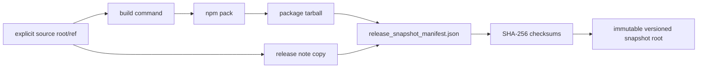

# M05 Release Snapshot Derivation

**Status**: Active
**Date**: 2026-05-22
**Purpose**: Derive the TypeScript `M05` release-snapshot slice so a
package-first ABG RC or tapped release has one immutable artifact bundle rather
than ad hoc tarballs or dry-run-only pack evidence.

## 1. Source Material

This boundary derives from:

- `specification/requirements/product/REQ-P-QUAL.md`
- `/Users/jim/src/apps/specification_methodology/specification/standards/RELEASE_METHOD.md`
- `docs/ABIOGENESIS_RC_RELEASE_NOTE.md`
- `build_tenants/abiogenesis/typescript/design/adrs/ADR-040-typescript-tenant-as-package-first-realization.md`
- `.ai-workspace/tickets/completed/T-142-create-versioned-release-snapshot-bundle-for-package-first-abg.md`

## 2. Position

Release snapshots are release-process artifacts. They are not live
constitutional truth and do not tap a final release by themselves.

The TypeScript tenant is package-first, so the first snapshot artifact is the
npm package tarball plus a manifest that binds it to source identity and release
evidence.

The snapshot manifest is the semantic center for the bundle. Release-note prose,
git tags, and pack output are evidence fields consumed by that manifest; they
are not separate artifact truth.

## 3. Boundary

This slice owns:

- reading package identity from an explicit package source root
- rejecting dirty source unless explicitly allowed for non-release use
- running the package build command
- running `npm pack` into a staging root
- copying the release note into the versioned snapshot bundle
- computing deterministic checksums
- writing one release snapshot manifest and checksum file
- refusing to overwrite an existing versioned snapshot root

This slice does not own:

- tapping a final release number
- publishing to npm or an external artifact store
- mutating release branches or tags
- changing GTL or ABG runtime law
- downstream product installation

## 4. End State

The lawful snapshot path is source root/ref to package build to tarball to
manifest to checksum. No consumer should infer release artifact identity from a
tenant-root `.tgz` or from a dry-run transcript.

## 5. First Slice Target

T-142 realizes:

- one `ReleaseSnapshotRequest` carrier
- one `ReleaseSnapshotOutcome` family
- one `createReleaseSnapshotBundle(...)` effect boundary
- one CLI/script binding
- one positive bundle proof
- negative proof for identity mismatch, dirty source, and non-empty snapshot root

## 6. Closure

The slice closes when:

- `REQ-P-QUAL-050..055` exist and trace to code/test
- `M05_RELEASE_SNAPSHOT_FIRST_SLICE_IACS.md` declares the carrier set
- focused T-142 tests pass
- `v3.8.0-rc.2` is materialized as a local versioned release snapshot from the
  tagged source identity
