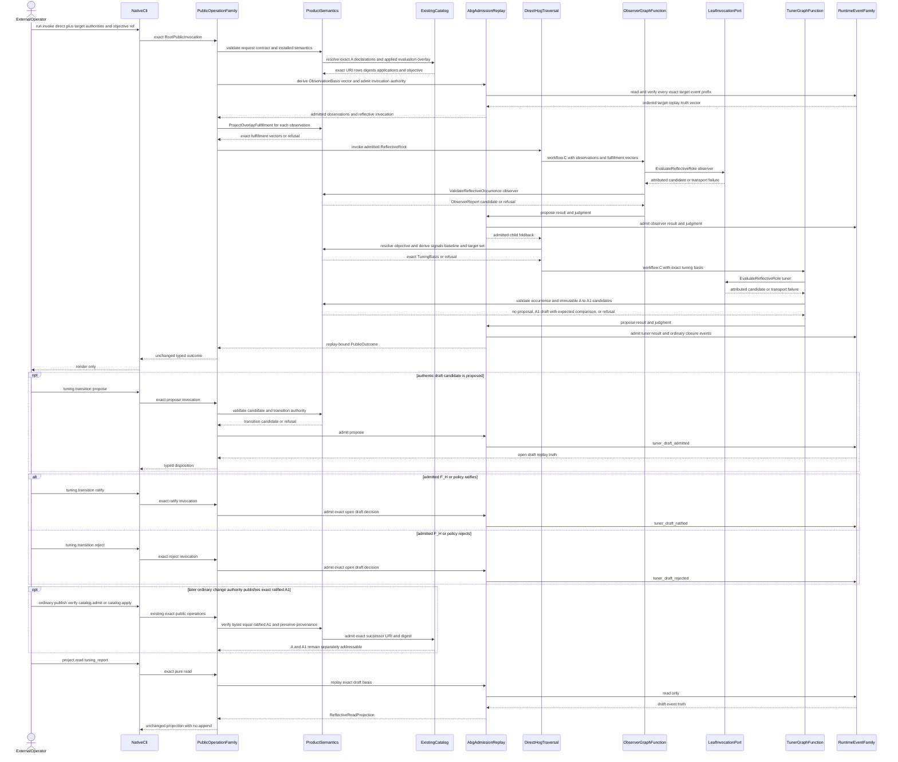
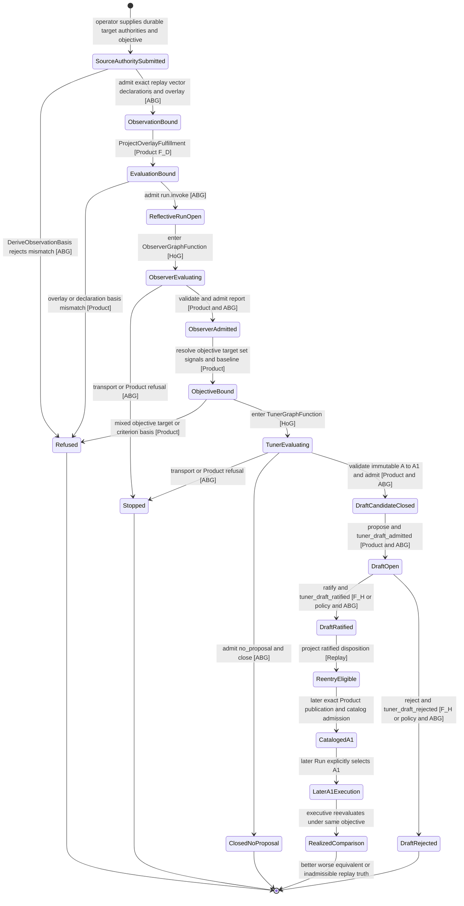

# M05 S04 Observer And Tuner Global-To-Local Design

**Status**: Candidate design; implementation held pending independent review
and direct acceptance

**Owner**: T-268 under T-270

**Product outcome**: `A5-F12`; M5 readiness for `ABG5-S04`

**Change class**: `goal_reprice` selecting design only, then
`design_reframe`

**Accepted basis**: M03 direct-GTL design; M05 Sections 1 through 12 at S03
candidate `8865ccff`; M04 public-operation definition family

**Decision rationale**:
[ADR-045](./adrs/ADR-045-global-design-constraints-survive-local-projection.md)
and
[ADR-047](./adrs/ADR-047-reflective-optimization-is-gtl-over-replay.md)

## Authority And Supersession

This file is the sole candidate S04 observer/tuner design. It supersedes only
the observer/tuner material in M05 Sections 14.3 through 14.7. The S06
portability material in Sections 14.1 and 14.2 is unchanged and remains
provisional until S06 is selected.

The following earlier designs are consumed as donor evidence, not competing
authority:

- `M03_RECURSIVE_EXECUTIVE_OBSERVER_DERIVATION.md`;
- `M03_RECURSIVE_EXECUTIVE_OBSERVER_FIRST_SLICE_IACS.md`;
- `M03_RECURSIVE_EXECUTIVE_OBSERVER_STRUCTURAL_CARRIER_DIAGRAM.md`; and
- `M03_SYSTEM_PROBE_OBSERVER_LIVENESS_DERIVATION.md`.

Their retained relation is narrow: ABG derives immutable observation truth from
events and replay. This design adds the Product-owned observer and tuner
GraphFunctions that consume that truth. It does not transfer diagnosis or
proposal meaning into ABG.

This is a design-gated boundary. No S04 implementation, public operation,
event variant, contract, schema, publication, or proof may be promoted until
independent review and direct acceptance of this exact design cut. S04
realization remains ordered after S06. The current work only removes design
ambiguity in advance.

The constitutional sources are:

- `PRODUCT.md` Observer And Tuner, `A5-F12`, and `ABG5-S04`;
- `REQ-P-SCENARIOS-011`;
- `REQ-R-ABG3-TUNER-001..014`;
- `REQ-R-ABG3-FPC-018..021`;
- `REQ-R-ABG3-FN-COMP-025`;
- `REQ-R-ABG3-PROJECTION-021..023`;
- `REQ-P-POLICY-036..037`;
- `REQ-P-CATALOG-001..009`, `-023..030`;
- `REQ-P-PUBLIC-CONTRACTS-008..009`;
- `REQ-L-GTL3-GRAPH-001..005`;
- `REQ-L-GTL3-GRAPHFUNCTION-001..005`;
- `REQ-L-GTL3-LANGUAGE-CAPABILITY-MODEL-026..031`;
- `REQ-L-GTL3-LAWS-021..022`;
- `REQ-R-ABG3-EVENTS-018`; and
- installed STDO `v2.2.0`.

## Boundary And CLI Feasibility

The answer to the design question is **yes**:

> The existing generic CLI contract can trigger observer/tuner execution over
> an existing graph when that graph has an admitted Run and durable replay
> authority.

The supported path is:

```text
immutable catalog declarations A
  + existing admitted graph Run(s)
  + durable public projection authority
  + exact applied EvaluationOverlay
  -> ABG derives exact ObservationBasis vector
  -> Product projects overlay fulfillment
  -> abg.operation.run.invoke(direct) selects published ReflectiveRoot
  -> HoG traverses declared GTL
  -> executive observer child result is admitted
  -> Product binds exact TuningObjective and TuningTargetSet
  -> tuner child consumes only that admitted basis
  -> root returns no-proposal or immutable DeclarationVersionCandidate A1
  -> tuning.transition(propose)
  -> tuning.transition(ratify | reject)
  -> later ordinary Product publication/catalog admission may register A1
  -> project.read(observer_report | observer_drafts | tuning_report)
```

`abg.cli --jsonl` already transports `run.invoke`; it needs no optimizer
semantics. Any later `tune ...` spelling is only a generated serializer for one
existing public invocation. The following are prohibited:

- a `tune` runner;
- a CLI-selected observer or tuner topology;
- a shell-owned replay reader;
- a shell retry, transition, or ratification loop; and
- a CLI-private draft state.

A declared GraphFunction without admitted replay is not tunable under this
boundary. It may be statically validated, but reflective claims require
admitted execution truth. The workspace may evolve between observations, but
the catalog declaration refs/digests and applied evaluation overlay bound to
each observation remain immutable.

The Product's canonical type term is reusable `node_type`. "Graph type" in the
S04 intake means the declared Graph/GraphFunction topology plus reusable node
types at its ports. S04 does not add a `GraphType` identity or catalog kind.
An optimized topology is a complete new immutable GraphFunction version; an
optimized reusable type is a complete new immutable `node_type` version.

## Native Constructability And Required Deltas

The selected substrate already constructs the governing relations:

- all seven GTL C constructors, including `C.edge`, `C.compose`, and
  `workflow.C`;
- nested GraphFunction calls with ABG-admitted child result and foldback;
- durable event-log reopen authority, event-prefix hashing, replay, and public
  Run projection authority;
- Product-owned installed input/result semantics;
- generic `run.invoke(direct)`, `project.read`, and the operation-definition
  family;
- one ABG event store, Event Calculus, replay, and public projection path; and
- one parser/render-only installed CLI.

Realization requires five bounded extensions of those atoms:

1. generalize the existing closed-result source-basis derivation into
   `DeriveObservationBasis`, which can bind an ordered non-empty vector of exact
   closed, stopped, held, yielded, or active replay prefixes without granting
   continuation or mutation authority;
2. bind each observation to the exact executed declaration set and applied
   evaluation overlay, then publish deterministic overlay-fulfillment,
   objective-resolution, criterion-comparison, and immutable-version validation
   relations as Product GTL semantics;
3. publish the reflective GTL declarations and Product semantics;
4. realize the already-required observer/tuning read cases,
   `tuning.transition` variants, and three runtime-event variants in their
   existing families; and
5. derive any literal `tune ...` convenience spelling from the public
   definition family as a request serializer.

The first delta is internal authority derivation, not a new public operation.
The public request already transports the durable source projection authority
and explicit target coordinates. ABG must derive and compare the complete
ObservationBasis before admitting the reflective invocation. It must not
stretch the existing closed-result basis by pretending a stopped or held Run
is closed.

None of these deltas needs a new graph language constructor, runtime, module
dependency, event family, replay fold, catalog, controller, or CLI semantic
path. If implementation cannot realize them through the accepted atoms, native
constructability is falsified and work returns to design.

## Requirement Projection

| Requirement | Design projection | Failure condition |
|---|---|---|
| `A5-F12` | one replay-grounded reflective GTL construction, attributed reports/drafts, ratified transitions | mutation or unattributed truth |
| `SCENARIOS-011` | M5 makes the reflective path runnable; M6 binds the exact pre-RC and qualification basis | S04 qualification is self-minted during M5 |
| `TUNER-001` | one executive Module publishes ReflectiveRoot, Observer, and Tuner GraphFunctions in the existing catalog | runner, kernel class, or second catalog |
| `TUNER-002` | `DeriveObservationBasis` reads only durable ABG events/replay and binds exact immutable declarations plus applied evaluation overlay | log text, process memory, second telemetry store, or declaration reload changes output |
| `TUNER-003` | execution uses `run.invoke`; reads use `project.read`; transitions use `tuning.transition`; CLI spellings serialize only | another public operation or command semantics |
| `TUNER-004` | executive evaluates evolving workspace truth against an applied overlay; a separate tuner consumes the admitted evaluation plus exact objective and emits immutable successor terms/drafts only | one judgment diagnoses and optimizes, the tuner solves workspace work, or a draft mutates live truth |
| `TUNER-005` | `TunerDraft` has open, ratified, or rejected replay state with exact actors, bases, refs, and digests | implicit or unattributed ratification |
| `TUNER-006` | anneal drafts require an admitted `EquivalenceContract` | hand-authored F_D replacement enters without equivalence |
| `TUNER-007` | equivalence binds outer contract, obligations, evidence classes, and replay comparison | interior substitution changes outer meaning silently |
| `TUNER-008` | calibration is one closed DeclarationDraft variant using the same transition path | calibration writes evaluator configuration directly |
| `TUNER-009` | lay-rail, pull-up, and abstraction are closed draft variants | crystallization changes a live declaration |
| `TUNER-010` | `DeriveTuningSignals` emits the eight minimum typed signal kinds with admitted source refs; `TuningObjective` selects and orders typed criteria | narrative label, hidden weight, or uncited metric selects a proposal |
| `TUNER-011` | promote/demote drafts bind one `CandidateFamily`, outer contract, alternatives, policy, and equivalence basis | mode switch is a private implementation flag |
| `TUNER-012` | catalog-visibility change is one immutable successor draft over exact existing hierarchical URI rows | tuner edits a catalog view or mutable alias directly |
| `TUNER-013` | module and installed proofs cover reads, transitions, draft variants, negatives, and no mutation | a green integration path substitutes for boundary proof |
| `TUNER-014` | the three tuner events declare exact Event Calculus effects before realization closes | draft state is inferred from mutable process state |
| `FPC-018` | ObservationBasis contains the declared observer observable set at one replay prefix | observer invents current state from prompt or files |
| `FPC-019` | Observer output is non-constructive; Tuner output cannot contain diagnosis/triage | downward control or mixed judgment |
| `FPC-020` | every type joint is a declared contract or GraphFunction boundary | inline worker/handler coercion |
| `FPC-021` | labels affect output only through cited typed signal/finding refs | prose authorizes admission, selection, or ratification |
| `FN-COMP-025` | observer is an `evaluate.C`/F_P role over a declared target; findings remain admitted inputs | observer becomes consequence, closure, or continuation authority |
| `PROJECTION-021..023` | ABG derives observation truth; all public reads are pure closed projections | public read evaluates, transitions, or appends |
| `POLICY-036..037` | observer and tuning reads expose exact basis/provenance; transition records authority but does not apply | read mutates or ratify rewrites effective configuration |
| `CATALOG-001..009` | A and A1 are separate immutable Product contributions under exact canonical URI/digest/provenance; public kinds remain graph_function, node_type, overlay | identity reuse, inferred content, new policy kind, or catalog presence granting use |
| `CATALOG-023..030` | objective/evaluation resolve through admitted exact views/applications; later A1 uses existing admission/application operations | prefix/latest lookup, unapplied overlay, automatic selection, or second catalog operation |
| `GRAPH-001..005` / `GRAPHFUNCTION-001..005` | graph interiors and callable GraphFunctions remain frozen values; topology change derives a complete successor GraphFunction | mutable graph patch or direct Graph invocation |
| `LANGUAGE-CAPABILITY-026..031` | reusable types use the existing non-callable node_type publication/application path and preserve obligations | GraphType peer carrier, callable type, or weakened successor type |
| `GTL-LAWS-021..022` | every A1 is complete canonical data with deterministic content identity and no ambient source | textual patch, clock/random identity, or non-round-tripping successor |
| `PUBLIC-CONTRACTS-008..009` | all public coordinates extend the one definition family with exact schemas and no defaults | local operation roster or permissive payload |
| `EVENTS-018` | `tuner_draft_admitted`, `tuner_draft_ratified`, and `tuner_draft_rejected` are variants of RuntimeEventFamily | tuner-owned event log or direct emitter |

## Product Function

The three functions are disjoint:

```text
solve:     Execute(A, Workspace[n]) -> Workspace[n+1]
evaluate:  Executive(Replay(Workspace[0..n]), EvaluationOverlay) -> admitted evaluations
optimize:  Tuner(A, admitted evaluations, TuningObjective) -> no_proposal | draft A1
```

`solve` is ordinary target GTL and may evolve workspace state. `evaluate` is
read-only over admitted replay. `optimize` authors immutable declaration terms
for future work. No one judgment may perform more than one of these functions.

```text
Resolve immutable executed declarations A and applied EvaluationOverlay
  -> DeriveObservationBasis(existing target replay vector)
  -> ProjectOverlayFulfillment
  -> ReflectiveRoot
     -> ExecutiveObserver GraphFunction
        -> ConstructReflectiveTask(observer)
        -> EvaluateReflectiveRole(observer)
        -> ValidateReflectiveOccurrence(observer)
     -> admitted ExecutiveEvaluation and foldback
     -> ResolveTuningObjective
     -> DeriveTuningBasis(objective, target declarations, evaluations)
     -> Tuner GraphFunction
        -> ConstructReflectiveTask(tuner)
        -> EvaluateReflectiveRole(tuner)
        -> ValidateReflectiveOccurrence(tuner)
        -> ValidateDeclarationVersionCandidate(A -> A1)
  -> no_proposal | DeclarationVersionCandidate A1
  -> propose
  -> ratify | reject
  -> ordinary publication and catalog admission may register A1
  -> immutable replay-derived reads
```

The target graph and the reflective Run are distinct:

- each target Run supplies immutable source truth at one exact event prefix;
- the reflective Run executes ordinary GTL and owns only its own runtime
  events;
- draft-transition events are workspace-scoped truth about the draft;
- source declaration `A` and successor candidate `A1` have distinct immutable
  refs/digests and explicit derivation lineage; and
- no path appends a target-Run event, changes target topology, or applies a
  declaration.

## Global Decisions And Local Projection

1. **An existing graph is observed through exact replay, not by reloading its
   declaration.**
   - Local: ObservationBasis binds WorkspaceBinding, Program, GraphFunction,
     materialization, Run, event prefix, result/evidence, and replay digests.
   - Falsified by: a declaration-only graph, caller summary, file scan, or
     current-process state being accepted as observation truth.

2. **The CLI is a shell over typed public operations.**
   - Local: reflective execution is `run.invoke(direct)`; reads and transitions
     use their existing operation identities.
   - Falsified by: CLI target selection, replay derivation, sequencing,
     proposal interpretation, retry, or lifecycle state.

3. **The reflective loop is a GTL free construction.**
   - Local: `ReflectiveRoot` uses `C.compose`, `C.edge`, and `workflow.C` over
     published GraphFunctions and contracts.
   - Falsified by: host-language orchestration, service method, plugin loop,
     script, or fixture ordering observer and tuner.

4. **Observer and tuner are separate judgments.**
   - Local: each role has a distinct child GraphCall, task contract, F_P
     evaluation, Product validation, result, and ABG judgment.
   - Falsified by: tuner seeing raw observer output or one prompt/result
     producing both diagnosis and optimization.

5. **ABG owns observation and runtime truth.**
   - Local: ABG derives ObservationBasis and admits results, judgments, events,
     draft transitions, replay, and closure.
   - Falsified by: Product, implementation, HoG, Public, CLI, worker, or
     fixture minting an admitted source or event.

6. **Product owns reflective meaning.**
   - Local: Product contracts define findings, halt classes, signal rows,
     proposal variants, prerequisites, and projection meaning.
   - Falsified by: ABG or implementation deciding what a signal or proposal
     means.

7. **Implementation owns only F_P effects.**
   - Local: the admitted leaf port receives one exact role task and returns one
     candidate or transport failure.
   - Falsified by: effect code selecting the target, reading the event store,
     admitting output, transitioning a draft, or applying a proposal.

8. **Observation never mutates the target.**
   - Local: source authority is read-only and every reflective event belongs to
     the reflective Run or workspace draft aggregate.
   - Falsified by: a target aggregate event, target declaration write, ticket
     edit, continuation choice, or target closure change.

9. **Signals are typed replay functions.**
   - Local: each signal row has kind, scope, value/unit, computation contract,
     ordered source refs, and digest.
   - Falsified by: uncited metrics, narrative confidence/entropy, or a mutable
     telemetry cache affecting a proposal.

10. **The tuner emits drafts or no proposal, never live terms.**
    - Local: the output union is `no_proposal | declaration_draft_candidate`;
      no effective configuration or declaration appears as an output target.
    - Falsified by: direct code/config/catalog mutation or automatic
      application.

11. **Draft lifecycle is separate from draft authorship.**
    - Local: a candidate becomes open only through `propose`; one exact open
      draft becomes ratified or rejected through admitted authority.
    - Falsified by: generation auto-ratifying, duplicate terminal decisions,
      or actor attribution standing in for capability/policy authority.

12. **Ratification is authority to re-enter, not authority to apply.**
    - Local: ratified replay truth may seed ordinary intake, ticket, and change
      classification under the affected Product owner.
    - Falsified by: ratification rewriting a live declaration or skipping the
      owning change boundary.

13. **One catalog publishes all reflective content.**
    - Local: canonical URI rows identify the Module, Program, GraphFunctions,
      contracts, policies, and optional overlays in the existing catalog.
    - Falsified by: observer/tuner registry, special hierarchy resolver,
      Product-core identifier switch, or copied publication.

14. **One event and replay family owns draft truth.**
    - Local: three new event variants use the existing event store, admission,
      Event Calculus, and replay projection.
    - Falsified by: draft ledger, sidecar state, or a tuner-specific replay
      fold.

15. **Native and serialized contracts have one meaning.**
    - Local: public schemas and vocabularies derive from the Product-owned
      native contract source.
    - Falsified by: whitespace, numeric, enum, reference, or digest domain
      disagreement.

16. **S04 readiness and S04 qualification remain distinct.**
    - Local: M5 proves the installed reflective mechanism over a bounded replay
      fixture; M6 binds the exact pre-RC, inventory, STDO, and qualification
      basis.
    - Falsified by: this design or an M5 fixture issuing the S04 qualification
      verdict.

17. **Tuning optimizes reusable declarations, not the evolving workspace.**
    - Local: ordinary GraphFunctions evolve workspace state; the executive
      evaluates that replay-projected state against an applied overlay; the
      tuner proposes successor GraphFunction, reusable `node_type`, or overlay
      declarations for future Runs. Policy changes are subordinate content of
      a complete successor overlay/Program declaration, not a new catalog kind.
    - Falsified by: tuner output writing workspace assets, choosing next work,
      continuing a target Run, or claiming to solve its gap.

18. **Every tuning episode has one explicit immutable objective.**
    - Local: `TuningObjective` binds the applied evaluation overlay, admissible
      observation scope, target declaration set, hard conservation constraints,
      and a uniquely ordered criterion vector with typed comparison laws.
    - Falsified by: hidden weights, prompt preference, implementation constants,
      unordered criteria, or an objective inferred from a proposal.

19. **Evaluation and target overlays are distinct authorities.**
    - Local: an `EvaluationOverlayApplication` remains fixed for the complete
      tuning basis. An overlay may be a target only as a separate immutable
      declaration with a different ref/digest and explicit source lineage.
    - Falsified by: a proposed overlay grading itself, changing criteria during
      evaluation, or using catalog presence as application authority.

20. **All tunable declarations are immutable versions.**
    - Local: a candidate binds complete canonical after-content `A1`, a new
      ref/digest, and exact `derivedFromRef`/`derivedFromDigest` for `A`.
      Existing Runs and replay retain `A`.
    - Falsified by: patching `A`, reusing its identity, mutable latest pointers,
      retagging prior Runs, or a draft containing only an unbound textual diff.

21. **The existing catalog URI hierarchy carries version availability.**
    - Local: source and successor use exact kind-specific URI identities under
      one family namespace; lookup remains exact, and ordinary publication,
      verification, catalog admission, and `catalog.apply` where required make
      `A1` available.
    - Falsified by: a second registry, hierarchy resolver, prefix fallback,
      mutable alias, automatic shadowing, or direct tuner catalog write.

22. **Proposed and realized improvement are different truths.**
    - Local: a draft carries attributed expected criterion deltas and a
      falsification plan. Only later execution of admitted `A1`, followed by
      executive evaluation under the same objective, can establish a realized
      comparison with `A`.
    - Falsified by: proposal generation or ratification asserting that
      optimization succeeded, or comparison across changed objectives without
      explicit rebase.

## Closed Semantic Algebra

### Observation Target

`ObservationBasis` is an immutable ABG-derived value satisfying:

```text
workspaceBinding == sourceInvocation.workspaceBinding
program == sourceInvocation.program
graphFunction == sourceGraphCall.graphFunction
materialization == sourceGraphCall.materialization
executedDeclarationSet == sourceInvocation.catalog/application basis
evaluationOverlayApplication == sourceInvocation applied overlay basis
run == replay.run
eventRefs == ordered events at eventLogDigest + eventLogByteLength
replayDigest == replay(eventRefs)
sourceResult/evidence/route/continuation refs are members of that replay
```

It also carries the observer observable set:

- replay event refs;
- gap-stop and halt-diagnosis projections;
- fold and terminal outcomes;
- retry and re-entry histories;
- progress and stagnation rows;
- per-configuration cost rows;
- reprice, operator-lifecycle, hygiene, and citability witness truth;
- constitutional-versus-projected drift facts; and
- exact span/intent lineage.

A caller transports a basis candidate plus the durable public projection
authority. ABG reopens the source event log, derives the basis again, and
requires exact equality. Missing, stale, cross-workspace, cross-Program,
cross-GraphFunction, cross-Run, truncated, extended, or digest-divergent input
refuses before reflective invocation admission.

One reflective invocation consumes an ordered non-empty
`ObservationBasisVector`. Rows are ordered by
`(workspaceLineageOrdinal, runOrdinal, eventLogByteLength, runRef)` and each
row is exact. Every row must bind:

- the same exact WorkspaceBinding, Product, Program, and declaration-family
  roots;
- the same requested `TuningObjective` coordinate, whose exact content Product
  resolves from the evaluation overlay;
- the same baseline target declaration refs/digests;
- the same evaluation-overlay declaration ref/digest and target composition;
  and
- its own exact source `catalog.apply` application identity for that overlay.

The workspace state and replay prefix may differ between rows. That difference
is the observed evolution. Cross-workspace rows are not comparable inside one
S04 tuning basis. Duplicate, reordered, mixed-objective, mixed-baseline,
mixed-overlay, or cross-workspace rows refuse.

### Immutable Declaration And Overlay Basis

`ExecutedDeclarationSet` is the canonical ordered set of immutable declaration
coordinates that shaped each target execution:

```text
Program
GraphFunction(s)
GraphVector(s)
reusable node_type declaration(s) and applications
policy declaration(s)
overlay declaration(s) and applications
contract and proof-obligation declaration(s)
```

Each coordinate carries kind, exact canonical URI ref, content digest,
publication/product provenance, catalog row identity, and application identity
when the declaration kind requires application. Catalog identity is exact. URI
path hierarchy expresses namespace and version ancestry only; no prefix,
nearest-version, or mutable-latest resolution is lawful.

`EvaluationOverlayApplication` is one existing `catalog.apply(overlay)`
relation over the exact target Program composition. It identifies the
workspace-state predicates, obligation rows, criterion-evaluator refs, and
policy/objective refs against which the executive evaluates target replay.
Catalog presence does not satisfy this relation. The exact overlay application
must be admitted and bound by the source execution.

When `TuningTargetSet` contains an overlay, that target overlay ref/digest must
differ from the EvaluationOverlay ref/digest. Both may be exact admitted
applications over the same Program, but the objective names which one governs
evaluation and which one is being varied. Equality, omission, or role reversal
refuses before scoring.

### Executive Evaluation

`ProjectOverlayFulfillment` is a Product-owned F_D relation:

```text
ProjectOverlayFulfillment(
  ObservationBasis,
  ExecutedDeclarationSet,
  EvaluationOverlayApplication
) -> OverlayFulfillmentVector | refusal
```

For every ordered overlay predicate it returns exactly one row:

```text
satisfied | unsatisfied | indeterminate
```

Each row binds predicate/evaluator ref and digest, expected value domain,
observed replay/source refs, typed actual value, disposition, and row digest.
`indeterminate` is truth about insufficient admitted evidence; it is not
success, failure, or permission for F_D to invent Product meaning. Malformed,
unapplied, cross-Program, cross-workspace, stale, or unexecutable predicate
relations refuse the evaluation basis.

The executive observer consumes the exact
`ObservationBasis + OverlayFulfillmentVector`. Its admitted
`ObserverReport` is the semantic interpretation of that fixed comparison. It
cannot alter the predicate vector, objective, target set, or source replay.

### Observer Result

The closed `HaltClassification` union is:

```text
active | held | yielded | gap_stop | blocked | failed | converged
```

The closed observer finding-kind union is:

```text
pressure_attenuated
pressure_persists
local_repair_candidate
nonlocal_reentry_candidate
reprice_candidate
block_candidate
close_candidate
rail_break
constitutional_drift
```

The closed non-constructive `ObserverDisposition` union is:

```text
report_only
typed_block
fh_input
ticket_draft
reprice_draft
escalation
drill
```

Every finding binds its exact observation basis, source refs, affected
obligation or declaration refs, evaluator attribution, contract, evidence, and
digest. A disposition is an admitted observer result, not a target-Run
transition; ordinary One Surface or F_H authority must consume it before it can
affect later work. Observer drafts are limited to:

```text
ticket | reprice | escalation | drill
```

They are non-constructive proposals. They cannot contain declaration terms,
tuning signal selections, traversal routes, events, continuations, or closure
decisions.

### Tuning Signal Vector

`DeriveTuningSignals` consumes only ABG-admitted ObserverReports,
OverlayFulfillmentVectors, and the exact ObservationBasis rows from which they
were judged. The minimum signal union is:

```text
route_variance
retry_density
repeated_path_shape
cost
closure_rate
adapter_gap_count
defect_recurrence
rail_break
```

Each `TuningSignalRow` binds:

- signal kind and scope ref;
- typed numeric, boolean, or closed-enum value plus unit;
- deterministic computation-contract ref;
- ordered admitted source event/projection refs;
- observation, fulfillment, and report refs/digests; and
- row ref/digest.

The vector is ordered by `(scopeRef, signalKind)` and contains at most one row
per observation coordinate. Empty or duplicate vectors refuse tuning-task
construction. Narrative labels never substitute for rows.

### Tuning Objective And Comparison

`TuningObjective` is an immutable Product declaration resolved from the exact
applied evaluation overlay and catalog view. It binds:

- objective ref/digest, schema version, Product/publication provenance,
  evaluation-overlay declaration, and ordered source application refs/digest;
- one exact WorkspaceBinding lineage;
- one non-empty ordered `TuningTargetSet`;
- one non-empty uniquely ordered `TuningCriterionVector`;
- the hard conservation constraints;
- baseline observation/evaluation selection policy; and
- objective invalidation and rebase policy.

The objective is typed policy content subordinate to the published evaluation
overlay/Program. It does not add a `tuning_objective` catalog kind or callable
identity.

`TuningTargetSet` contains only exact immutable catalog declarations:

```text
graph_function | node_type | overlay
```

Every target row carries the declaration kind, family URI, exact source ref and
digest, publication/catalog provenance, and application refs when required.
Every source target must be a member of every cited observation's
`ExecutedDeclarationSet`; `abstraction` may instead name a non-empty ordered
source-composition subset and derive one new GraphFunction family from it.
`Graph`, `Program`, and composition changes are represented through complete
new GraphFunction or overlay declarations. Policy changes are represented
inside the complete successor overlay/Program declaration that owns them. No
independent mutable graph, graph-type, policy, or patch carrier is introduced.

Each `TuningCriterion` carries:

- unique positive `priorityOrdinal`;
- signal or criterion-evaluator GraphFunction ref/digest;
- typed value contract and unit;
- `direction = minimize | maximize | target`;
- deterministic aggregation contract over the ordered evaluation set;
- target/threshold and tolerance when required;
- admissible missing/indeterminate disposition; and
- criterion ref/digest.

The canonical ABIogenesis objective is
`objective://abiogenesis/tuner/overlay-fulfillment@5`. Its purpose is:

> Improve the ability of future executions of the selected immutable GTL
> declarations to satisfy the applied evaluation overlay, while preserving
> contract, obligation, evidence, authority, and replay meaning; after those
> constraints, prefer less unresolved failure and lower execution effort.

Its default criterion vector is exact:

| Priority | Criterion | Direction | Deterministic aggregation |
|---:|---|---|---|
| `1` | required overlay predicate fulfillment rate | maximize | exact rational `satisfied / required` over all cited fulfillment rows |
| `2` | indeterminate required overlay predicate count | minimize | exact sum |
| `3` | defect recurrence count | minimize | exact sum by defect identity |
| `4` | unresolved adapter-gap count | minimize | exact sum by contract joint |
| `5` | rail-break count | minimize | exact sum by declared route identity |
| `6` | closure rate | maximize | exact rational `converged / eligible Runs` |
| `7` | retry density | minimize | exact rational `retry admissions / eligible C calls` |
| `8` | cost per converged Run | minimize | exact admitted cost-unit sum divided by converged Runs |

All rationals use canonical reduced integer numerator/denominator form. A zero
denominator is `indeterminate`, never zero. An indeterminate higher-priority
criterion cannot support a `better` claim. `route_variance` and
`repeated_path_shape` remain mandatory typed signals but are proposal-shape
evidence, not globally monotonic fitness: low variance/repeated shape may
support `lay_rail` or `abstraction`, while high variance may support retaining
or promoting emergent execution. Their kind-specific predicates are resolved
in the draft-prerequisite table.

Downstream Products may publish different complete objectives and evaluator
GraphFunctions through ordinary overlay/policy contributions. Such objectives
are different immutable comparison bases, not overrides inside one episode.
Neither native code nor worker prompt supplies weights, priorities,
thresholds, or defaults.

Hard constraints precede every criterion and are not tradeable:

```text
outer contract identity is preserved
declared obligation set is preserved
evidence classes are preserved
authority is not widened
replay comparison remains possible
source declaration remains immutable and addressable
```

`ScoreEvaluationSet` applies each criterion's declared deterministic evaluator
and aggregation contract to an exact ordered admitted evaluation set. The
result is a uniquely ordered `CriterionScoreVector`.

`CompareCriterionVectors(baseline, candidate)` is total:

1. any hard-constraint failure returns `inadmissible`;
2. compare criteria in ascending `priorityOrdinal`;
3. skip equivalent values under the declared tolerance;
4. the first non-equivalent value returns `better` or `worse` according to the
   declared direction; and
5. no non-equivalent value returns `equivalent`.

No score vector is comparable when objective ref/digest, target family,
criterion roster, value contract, or WorkspaceBinding differs. Such a
comparison requires an explicit objective rebase and cannot support an
improvement claim.

### Tuning Evaluation Set

`DeriveTuningBasis` constructs:

```text
TuningBasis {
  objective
  targetSet
  ordered ObservationBasisVector
  ordered OverlayFulfillmentVector refs
  ordered admitted ObserverReport refs
  TuningSignalVector
  baseline CriterionScoreVector
}
```

Every observation, fulfillment vector, report, and signal row must preserve
the same objective and baseline target-declaration identities. The tuner
receives no raw event store, mutable workspace, catalog lookup authority, or
unadmitted observer output.

### Declaration Draft

The closed `DeclarationDraftKind` union is:

```text
anneal
calibrate
lay_rail
pull_up
abstraction
promote
demote
catalog_visibility
```

Every draft candidate binds:

- candidate ref/digest and proposer attribution;
- exact TuningBasis, objective, evaluation-overlay application, observations,
  reports, signals, and policy;
- a non-empty ordered vector of complete immutable
  `DeclarationVersionCandidate` values;
- for every `A -> A1`, source kind/family URI/ref/digest and complete canonical
  successor content with a distinct canonical URI/ref/content digest;
- `A1.derivedFromRef == A.ref` and
  `A1.derivedFromDigest == A.digest`;
- baseline and expected criterion score vectors, expected comparison, and an
  exact post-publication falsification/evaluation plan;
- proposal kind and kind-specific terms;
- evidence and source signal refs; and
- no live-write, event, continuation, traversal, ticket, or closure field.

The candidate is a complete successor declaration, not a patch. Source and
successor cardinality are equal except:

- `abstraction` may derive one new GraphFunction family from a proven
  composition while retaining every source declaration;
- `catalog_visibility` derives a new immutable overlay/view declaration rather
  than changing a row in place; and
- `pull_up` or `demote` may derive a successor composition that omits an
  interior edge/candidate while the omitted source remains catalog-addressable.

`ValidateDeclarationVersionCandidate` recomputes canonical refs/digests,
requires exact target-family membership, checks kind-specific contracts,
preserves hard constraints, and validates the expected score claim as an
attributed hypothesis under the exact objective. It cannot admit a realized
improvement claim. A draft candidate must claim `expectedComparison = better`;
`worse`, `equivalent`, `inadmissible`, or incomparable terms are not an
optimization proposal and refuse candidate admission.

Kind-specific prerequisites are total:

| Draft kind | Additional required basis | Refusal condition |
|---|---|---|
| `anneal` | admitted equivalence contract over outer contract, obligations, evidence classes, and replay comparison | missing or non-equivalent interior |
| `calibrate` | evaluator contract plus retry/shape/ambiguity signal | free prompt/config edit |
| `lay_rail` | low-variance repeated path and target overlay declaration | no composition-entropy basis |
| `pull_up` | non-discriminating edge proof and preserved outer contract | obligation or evidence loss |
| `abstraction` | repeated admitted composition plus proposed GraphFunction contract | one-off path or undeclared type joint |
| `promote` | CandidateFamily, declared and emergent alternatives, visible selection policy, equivalence basis | private mode switch |
| `demote` | CandidateFamily plus admitted divergence or regression signal | uncited preference |
| `catalog_visibility` | exact current view, hierarchical URI rows, and complete successor overlay/view declaration | direct catalog mutation or mutable alias |

The tuner result is total:

```text
no qualifying admitted signal -> no_proposal
qualifying basis + valid immutable A1 terms -> declaration_draft_candidate
malformed, mixed-judgment, ungrounded, or authority-bearing output -> refusal
```

### Draft Transition

`TransitionTuningDraft(variant)` is one atomic public relation:

```text
propose(candidate, authentic source Run result)
  -> tuner_draft_admitted
  -> draft_state = open

ratify(open draft, admitted F_H actor/capability or exact visible auto-policy)
  -> tuner_draft_ratified
  -> draft_state = ratified

reject(open draft, admitted F_H actor/capability or exact visible auto-policy)
  -> tuner_draft_rejected
  -> draft_state = rejected
```

Ratified and rejected are mutually exclusive. Equivalent duplicate invocation
is idempotent; a conflicting duplicate refuses. A transition from a different
workspace, Product, draft, basis, actor/policy, event prefix, or already
terminal state refuses without append.

Event Calculus effects are:

| Event kind | Initiates | Terminates | Clips | Declips |
|---|---|---|---|---|
| `tuner_draft_admitted` | `tuner_draft_available`, `tuner_draft_open` | none | none | none |
| `tuner_draft_ratified` | `tuner_draft_ratified` | `tuner_draft_open` | none | none |
| `tuner_draft_rejected` | `tuner_draft_rejected` | `tuner_draft_open` | none | none |

### Immutable Version Registration

Ratification is not mutation and does not prove optimization:

```text
cataloged immutable A
  -> admitted tuning basis and draft
  -> ratified complete immutable A1 candidate
  -> ordinary change authority reproduces exact A1 bytes
  -> Product publication and verification
  -> existing catalog.admit
  -> existing catalog.apply when A1 is node_type or overlay
  -> later Run explicitly selects A1
  -> executive evaluates later replay under the same objective
  -> CompareCriterionVectors(A baseline, A1 realized)
```

The catalog records exact version availability under the existing URI
hierarchy. It does not replace `A`, mutate a family row, or infer "latest".
Existing ProductSet, WorkspaceBinding, catalog view, invocation, Run, event,
and replay identities continue to name `A`. A later WorkspaceBinding or
narrowed view must explicitly admit and select `A1`.

The canonical hierarchy follows the existing kind-specific URI grammar:

```text
graph-function://<publisher>/<module>/<family>@<version>
catalog://<publisher>/<module>/node-type/<family>@<version>
catalog://<publisher>/<module>/overlay/<family>@<version>
```

`familyUri` is the stable hierarchy parent; the exact version URI plus content
digest is the selectable declaration identity. A successor must use a distinct
version coordinate. Reusing one version URI for different content is an
identity conflict. The family parent is not callable/selectable and never
means latest.

If `A1` cannot be reproduced byte-for-byte from the ratified candidate, the
ordinary publication boundary refuses. If later replay is `worse`,
`equivalent`, incomparable, or violates a hard constraint, that result is
admitted evaluation truth and may ground rejection, demotion, or another draft;
history is never rewritten.

### CLI Elimination Law

For any valid ergonomic spelling `s` and definition-family serializer `E`:

```text
applyCli(s) = applyRootPublicInvocation(E(s))
```

`E` may supply only fields fixed by the selected operation definition and
explicit command arguments. It may not read the event store, load a Product,
choose a Program or GraphFunction, infer a target, add a default policy,
sequence calls, or interpret outcomes. Deleting the ergonomic spelling must
leave the JSONL public operation fully usable.

## Affected Ontology

Ontology basis `ABI5-S04-ONTOLOGY-001` is the bounded reflective slice of the
accepted Product and M03/M05 Ontology. Existing Product, catalog, Program,
GraphFunction, Run, GraphCall, C-call, event, replay, public-operation, and CLI
identities are consumed rather than redefined.

### Relationships And Cardinalities

| Relation | Cardinality and invariant | Authority |
|---|---|---|
| Product -> ReflectivePublication | exactly one canonical executive publication | Product/GTL |
| publication -> ReflectiveProgram | exactly one default Program | Product/GTL |
| Program -> ReflectiveRoot | exactly one public callable root | Product/GTL |
| ReflectiveRoot -> Observer/Tuner | exactly one child call of each, ordered observer before tuner | GTL |
| catalog declaration family -> immutable version | one or more exact URI/digest versions; no mutable current row | Product/catalog |
| source declaration A -> successor candidate A1 | zero or more candidates; each binds exact derivation lineage and distinct identity | Product meaning; ABG result admission |
| target execution -> ObservationBasis | zero or more immutable replay-prefix snapshots, each binding executed declarations and overlay application | ABG |
| ObservationBasis vector -> reflective Run | one ordered non-empty vector per admitted analysis | Product proposes; ABG admits |
| evaluation overlay -> ObservationBasis vector | one immutable declaration; exactly one source application identity per observation row | Product/catalog/ABG |
| observation -> OverlayFulfillmentVector | exactly one complete ordered vector or refusal | Product F_D |
| reflective Run -> observer result | zero or one admitted report; absence means truthful stop/failure | Product/ABG |
| observer result vector -> tuning basis | zero or one; exists only after all cited observer judgments are admitted | Product/ABG |
| TuningObjective -> tuning basis | exactly one immutable objective | Product/catalog |
| TuningTargetSet -> tuning basis | exactly one non-empty set of immutable baseline declarations | Product/catalog |
| tuning basis -> tuner result | exactly one `no_proposal` or draft candidate after successful evaluation | Product/ABG |
| draft candidate -> TunerDraft | zero or one `propose` admission | Product verifies; ABG admits |
| TunerDraft -> terminal disposition | zero while open; exactly one ratified or rejected decision | F_H/policy proposes; ABG admits |
| ratified draft -> cataloged A1 | zero or one later exact ordinary publication/admission; outside reflective Run | affected Product owner/catalog |
| cataloged A1 -> realized comparison | zero or more later replay evaluations; no claim before execution | Product executive/ABG |
| WorkspaceBinding -> reflective read | zero or more immutable reads over exact basis | Product/ABG/Public |

### Entity And Lifecycle Completeness

| Entity | Identity | Authority owner | Declare/create | Read/project | Update/transition | Delete/retire |
|---|---|---|---|---|---|---|
| `ReflectivePublication` | Product/version/publication digest | Product/GTL | package declaration | catalog view | new Product cut only | superseded by release |
| `ImmutableDeclarationVersion` | kind + family URI + exact ref/content digest + publication/catalog provenance | Product/catalog | ordinary publication/admission | catalog/project/replay | not_applicable: immutable | remains historical; visibility may change through new declaration |
| `ObservationBasis` | workspace + source invocation/Run/graph + executed declarations + overlay application + event prefix + replay digest | ABG | `DeriveObservationBasis` | executive input/public evidence | not_applicable: immutable snapshot | event-store retention policy |
| `EvaluationOverlayApplication` | overlay ref/digest + application ref/digest + target Program | Product/catalog/ABG | existing `catalog.apply` | evaluation basis/replay | not_applicable: immutable | workspace/catalog retention |
| `OverlayFulfillmentVector` | observation + overlay application + ordered predicate rows/digest | Product over ABG truth | `ProjectOverlayFulfillment` | observer input/evidence | not_applicable: immutable | source Run retention |
| `ReflectiveRun` | ordinary invocation/Run/GraphCall identities | ABG | `run.invoke` admission | status/result/replay | ordinary traversal only | ordinary Run closure/stop |
| `ObserverReport` | observer C-call result ref/digest | Product meaning; ABG admission | role evaluation then validation | observer report/drafts reads | not_applicable: immutable | source Run retention |
| `TuningObjective` | objective ref/digest + overlay declaration/source-application vector + criterion roster + target/workspace scope | Product/catalog | Product declaration and applications | tuning basis/evidence | new version only | historical catalog retention |
| `TuningBasis` | objective + target set + ordered observations/evaluations/signals + baseline score digest | Product over ABG truth | `DeriveTuningBasis` | tuner input/evidence | not_applicable: immutable | reflective Run retention |
| `DeclarationDraftCandidate` | tuner result ref/digest + complete A1 values/lineage | Product meaning; ABG result admission | role evaluation then version validation | run result/tuning evidence | `propose` may consume once | retained as source result |
| `TunerDraft` | workspace + draft ref/digest | ABG lifecycle; Product meaning | `TransitionTuningDraft(propose)` | tuning report | ratify or reject exactly once | immutable terminal retention |
| `ReflectiveReadProjection` | source + basis + projection digest | Product/ABG | pure `project.read` | public | not_applicable: cache only | cache eviction |

Findings, observer drafts, signal rows, proposal terms, equivalence rows,
policy rows, event payloads, and CLI coordinates are subordinate payloads of
these entities unless a later Promotion Test proves independent identity,
authority, lifecycle, or public pattern-match meaning.

### Authority Matrix

| Function or transition | Proposer | Evaluator | Verifier | Admitter | Executor | Projector | Retirement owner |
|---|---|---|---|---|---|---|---|
| derive observation basis | public source authority | ABG replay fold | exact event-prefix and target equality | ABG invocation basis | ABG pure projection | ABG/Public | event-store retention |
| resolve executed declarations/evaluation overlay | source invocation/application truth | Product/catalog | exact catalog row, URI, digest, application, Program equality | ABG invocation basis | Product F_D | replay/Public | catalog/workspace retention |
| project overlay fulfillment | admitted observation and overlay | Product criterion relations | complete predicate roster and typed values | ABG child input/evidence | GTL F_D leaf | replay | source Run retention |
| admit reflective invocation | developer/One Surface caller | Product input semantics | validator + exact source basis | ABG | Public fixed composition | replay/Public | Run closure |
| construct reflective role task | GTL traversal | Product | Product contract | ABG C-call basis | HoG | replay | child close/stop |
| evaluate observer/tuner role | admitted task | Product-declared F_P contract | Product occurrence validator | ABG result/judgment | implementation leaf port | replay | C-call terminal truth |
| resolve objective/targets and derive tuning basis | admitted evaluations + applied overlay | Product pure relations | objective/target/scope/criterion/baseline equality | ABG successor input/foldback | HoG/GTL F_D leaves | replay | reflective Run retention |
| validate A -> A1 candidate | tuner raw candidate | Product immutable-version relation | canonical digest, lineage, hard constraints, expected-score claim | ABG result/judgment | Product F_D | replay | source result retention |
| admit root result/closure | Product candidate | Product judgment | closure contract | ABG | HoG route proposal | replay/Public | immutable Run closure |
| propose draft | developer citing authentic tuner result | Product | source result, basis, and draft predicates | ABG | Public fixed operation | tuning report | candidate consumed once |
| ratify/reject draft | F_H actor or visible auto-policy | Product policy relation | actor/capability/policy/open-state equality | ABG | Public fixed operation | tuning report/replay | terminal draft retention |
| project reflective read | public read request | Product projection relation | ABG exact source/basis | not_applicable: no append | Public fixed read | Public | cache eviction |
| publish/register ratified A1 | affected Product owner | ordinary intake/change law | exact ratified bytes, Product publication, catalog URI/digest/provenance | existing Product/catalog admission | ordinary work path | catalog/replay | owning release/change authority |
| compare realized A1 | later admitted executions | Product objective relation | same objective/criterion/scope or explicit rebase | ABG evaluation result | executive GTL | tuning read/replay | replay retention |

Actor identity is attribution, not authority. Availability of a capability,
draft, event log, catalog row, or CLI command does not admit its use for the
current basis.

## Atomic Functions And Prime Contraction

### Function Derivation

| Discovered functionality | Entity | Atomic function or template | Higher-order composition | Effect class | Required authority | Disposition |
|---|---|---|---|---|---|---|
| exact target replay | ObservationBasis | `DeriveObservationBasis` | `run.invoke` source basis | F_D projection | ABG | atomic |
| exact declaration/application basis | ExecutedDeclarationSet | `ResolveEvaluationDeclarationBasis` | observation input admission | F_D | Product/catalog/ABG | atomic |
| overlay-relative workspace evaluation | OverlayFulfillmentVector | `ProjectOverlayFulfillment` | executive observer input | F_D | Product over ABG replay | atomic |
| observer/tuner task construction | role task | `ConstructReflectiveTask(role)` | observer/tuner `C.edge` | F_D | Product/GTL | atomic parameterized |
| observer/tuner host evaluation | role occurrence | `EvaluateReflectiveRole(role)` | admitted leaf, optional declared `C.retry` | F_P | implementation under exact port | atomic parameterized effect |
| role output validation and lineage | report/draft result | `ValidateReflectiveOccurrence(role)` | ABG result/judgment admission | F_D then admission | Product/ABG | atomic parameterized |
| objective and target resolution | TuningObjective/TargetSet | `ResolveTuningObjective` | admitted overlay/evaluation foldback | F_D | Product/catalog | atomic |
| signal and baseline derivation | TuningBasis | `DeriveTuningBasis` | child result foldback then F_D leaves | F_D | Product over ABG results | atomic |
| deterministic objective scoring | CriterionScoreVector | `ScoreEvaluationSet` | tuning-basis construction and later realized comparison | F_D | Product criterion GraphFunctions | atomic parameterized |
| total score comparison | comparison disposition | `CompareCriterionVectors` | candidate validation and later replay evaluation | F_D | Product objective | atomic |
| immutable successor validation | DeclarationVersionCandidate | `ValidateDeclarationVersionCandidate` | tuner result validation | F_D | Product | atomic parameterized by declaration kind |
| complete reflective run | ReflectiveRun | `ReflectiveRoot` | `C.compose(resolve/evaluate, workflow.C(observer), derive objective/basis, workflow.C(tuner))` | mixed declared GTL | GTL/HoG/ABG | composed |
| no-proposal or draft choice | tuner result | closed `TuningOutcome` relation | tuner consequence/result contract | F_P candidate then F_D validation | Product | derived through role atom |
| propose/ratify/reject | TunerDraft | `TransitionTuningDraft(variant)` | public operation + event admission | admitted write | Product/F_H/ABG | atomic parameterized |
| observer/tuning reads | projection | `ProjectReflectiveRead(kind)` | `project.read` | F_D read | Product over ABG truth | atomic parameterized |
| CLI command spellings | public invocation | `SerializeCliCoordinate(operation, variant)` | existing CLI transport | effect-edge serialization | Public definition family | subordinate |
| publish/register ratified A1 | immutable declaration version | existing Product publication/catalog relations | later ordinary work | outside reflective Run | affected Product owner/catalog | deferred to owning change |
| evaluate realized A1 | realized comparison | same observation/evaluation/score atoms | later ordinary reflective Run | mixed existing atoms | Product/ABG | composed after A1 execution |
| static graph analysis without replay | none | no reflective function | conformance path only | not_applicable | qualification/conformance owner | excluded from A5-F12 |
| self-conformance qualification verdict | qualification subject | existing qualification family | M6 S04 scenario | outside M5 design | T-247/M6 | deferred |
| observer/tuner runner, controller, store | none | none | none | prohibited | no authority | excluded |

### Whole-Family Prime Result

| Candidate family | Contraction relation | Retained meaning | Authority before/after | Accepted loss | Falsification |
|---|---|---|---|---|---|
| workspace evaluation paths | ad hoc graph/read checks -> `ProjectOverlayFulfillment` | exact overlay-relative state over replay | shell/worker -> Product F_D over ABG | hidden evaluators | workspace satisfaction can differ by caller |
| objective/fitness settings | weights/prompt/defaults -> immutable `TuningObjective` | typed ordered criteria, scope, target set, hard constraints | implementation/worker -> Product catalog | ambient preference | code can choose what "better" means |
| solve/evaluate/optimize loops | mixed controller -> target GTL solve + executive evaluation + tuner proposal | one causal exchange through admitted records | host/controller -> distinct Product/GTL/ABG owners | downward optimization control | tuner writes workspace work or evaluator authors A1 |
| observer/tuner constructors | two constructors -> `ConstructReflectiveTask(role)` | distinct role contracts and outputs | Product twice -> Product once | duplicate function identity | role parameter changes authority or cannot preserve contracts |
| observer/tuner effect shells | two worker paths -> `EvaluateReflectiveRole(role)` | separate judgments and attribution | implementation twice -> one admitted port family | duplicate transport logic | raw output crosses roles or semantics enter transport |
| observer/tuner validators | two occurrence validators -> `ValidateReflectiveOccurrence(role)` | role-specific closed result unions and lineage | Product twice -> Product once | duplicate admission seam | one role can accept the other's output |
| observer then tuner orchestration | CLI/service loop -> `ReflectiveRoot` GTL composition | ordered separate child judgments with admission barrier | shell/host -> GTL/HoG/ABG | imperative orchestration | tuner consumes unadmitted observer output |
| replay snapshot/store candidates | local snapshot + telemetry ledger -> `DeriveObservationBasis` over existing replay | complete exact observable set | local/controller -> ABG | second writable store | process/file state changes observation |
| report/draft/tuning reads | separate readers -> `ProjectReflectiveRead(kind)` | distinct result variants | multiple readers -> Product projection family | duplicate read authority | any read appends or evaluates |
| propose/ratify/reject commands | three operations -> `TransitionTuningDraft(variant)` | closed lifecycle transitions | three peers -> one ABG admission relation | duplicate public identity | variants have different truth stores or authority law |
| draft variants | eight peers -> one `DeclarationDraft(kind)` family | kind-specific prerequisites and terms | Product remains singular | peer lifecycle identities | a kind requires independent authority/lifecycle |
| declaration update mechanisms | patches/in-place edits -> immutable `A -> A1` derivation | complete successor content and source lineage | tuner/editor -> Product/catalog | mutable update identity | prior Run or replay changes declaration |
| version selection mechanisms | hierarchy resolver/latest alias -> exact URI/digest catalog lookup | family/version namespace and explicit selection | resolver -> existing catalog | implicit latest selection | lookup by prefix changes a Run binding |
| overlay optimization loops | target overlay self-score -> separate EvaluationOverlay and TargetOverlay | non-circular objective authority | target proposal -> fixed Product objective | self-judgment | changing proposal changes its own acceptance criteria |
| tuner events | tuner log -> three variants in RuntimeEventFamily | exact draft lifecycle truth | tuner -> ABG | second event family | replay needs a tuner-owned fold |
| CLI tune semantics | semantic commands -> elimination-equivalent serializers | ergonomic spelling | CLI -> existing public definitions | command-local defaults/control | JSONL path cannot express identical act |
| target graph copy | cloned analysis graph -> exact ObservationBasis association | existing graph identity and history | tuner -> source Product/ABG | cloned topology | observer needs to mutate or reinterpret target |

No further contraction is lawful:

- ObservationBasis, EvaluationOverlayApplication, ObserverReport,
  TuningObjective, TuningBasis, DeclarationVersionCandidate, and TunerDraft have
  distinct source, meaning, and lifecycle roles;
- Product validation cannot merge with F_P execution without merging semantic
  and effect authority;
- GTL/HoG traversal cannot merge with ABG admission without creating another
  runtime-truth owner;
- proposal generation cannot merge with ratification without removing the F_H
  boundary; and
- reads cannot merge with transitions because reads append no truth.

### Composition And Effect Laws

| Law | S04 relation |
|---|---|
| unit | `C.id` is the typed unit for compatible pure GTL composition |
| closure | every term output contract equals the next input contract or whole-Program validation refuses |
| associativity | pure F_D regrouping is extensionally associative; effectful child/admission regrouping is not applicable because event order is observable |
| order | source-basis admission, observer result admission, signal derivation, tuner result admission, and draft transition are non-commutative |
| role cardinality | one ReflectiveRoot contains exactly one observer child then one tuner child |
| result cardinality | each child admits at most one successful result; root admits one `no_proposal` or draft candidate |
| retry cardinality | retry exists only when declared by `C.retry` with a positive bound; no shell or worker retry exists |
| observation-set cardinality | one reflective invocation binds one ordered non-empty vector of exact replay prefixes under one objective and baseline declaration set |
| overlay cardinality | each observation binds one exact applied evaluation overlay; a target overlay cannot occupy that same identity |
| target cardinality | one tuning objective binds one non-empty ordered set of exact immutable declaration versions |
| criterion cardinality | priorities are unique positive ordinals; every criterion has one typed evaluator, direction, aggregation, and disposition law |
| comparison totality | equal objective/baseline vectors yield exactly `better`, `worse`, `equivalent`, or `inadmissible`; changed bases are explicitly incomparable |
| signal cardinality | one vector has unique `(observationRef, scopeRef, signalKind)` rows and cites at least one admitted source |
| draft cardinality | one candidate may be proposed once; one open draft has at most one terminal decision |
| version cardinality | every source row yields at most one successor row per candidate; source and successor refs/digests differ; source remains immutable |
| effect conservation | F_D projects; F_P returns candidates; F_H supplies disposition; ABG alone appends and closes |
| authority conservation | composition cannot widen source replay, workspace, Product, Program, actor, policy, draft, or declaration authority |
| target conservation | reflective execution may append its own Run/draft events but cannot append to or rewrite the target Run |
| declaration conservation | proposal and ratification cannot mutate, replace, hide, or rebind source declaration `A`; only ordinary catalog work may add `A1` |
| objective conservation | objective, criteria, evaluation overlay, and baseline cannot change within one comparison |
| CLI equivalence | ergonomic spelling and JSONL invocation reduce to the same public definition and outcome |

## Irreducible Architectural Carrier Set

S04 adds no peer IACS family. It projects into the accepted M03 set.

| S04 carrier | Accepted IACS family | Ontology law carried | Authority/status |
|---|---|---|---|
| executive Module, Program, ReflectiveRoot, Observer/Tuner/criterion GraphFunctions, objectives, contracts, policies, immutable successor values | `GtlDeclarationFamily` | canonical meaning, topology, comparison, and version lineage | Product-authoritative, public/versioned |
| installed Product, WorkspaceBinding, exact hierarchical URI catalog rows/view/applications | `EnvironmentBasis` | exact installed execution environment and declaration availability | Product/ABG authoritative |
| ObservationBasis vector, executed declaration/evaluation overlay basis, and reflective invocation admission | `InvocationBasis` | exact source replay, objective baseline, and new Run basis | ABG-authoritative; public fields untrusted until equality |
| reflective Run, child GraphCalls, Frames, C-calls | `TraversalAggregateFamily` | ordinary direct traversal and foldback | ABG-authoritative |
| observer/tuner tasks and raw candidates | `LeafRealizationBoundary` | exact F_P effect seam | effect-edge; never truth by itself |
| ordinary traversal plus tuner draft event variants | `RuntimeEventFamily` | sole written runtime/draft truth | ABG-authoritative |
| overlay fulfillment, replay, ObserverReport, score vectors, TuningReport, public outcomes | `ReplayProjectionFamily` | deterministic downstream evaluations and reads | Product/ABG public/downstream |
| raw and whole-Program diagnostics | `ValidationFamily` | non-lowering static law | validator-authoritative, non-executable |

Promotion Test:

- ObservationBasis, EvaluationOverlayApplication, TuningObjective, and
  TuningBasis are promoted within existing families because they cross public,
  admission, Product-meaning, and replay boundaries;
- ObserverReport, DeclarationVersionCandidate, and TunerDraft are promoted as
  public pattern-match entities, but remain projections of Product meaning and
  ABG truth rather than new IACS families;
- criterion rows, score rows, target rows, signal rows, findings, proposal
  terms, lineage rows, policy rows, event payloads, and CLI coordinates remain
  subordinate;
- generated schemas/vocabularies are subordinate projections of
  `GtlDeclarationFamily`; and
- parser, digest, retry, worker-transport, replay-query, and event-envelope
  mechanics consume existing owner-local atoms rather than creating
  S04-specific helpers.

## Module And Interface Projection

The accepted M03 dependency law remains unchanged.

| Semantic function | Meaning authority | Abstract module/interface | Output family |
|---|---|---|---|
| publish reflective declarations/topology | Product/GTL | `src/gtl` executive standard-library publication | GtlDeclarationFamily |
| `DeriveObservationBasis` | ABG | existing `src/abg` replay/source-basis projection port | InvocationBasis |
| `ResolveEvaluationDeclarationBasis` | Product/catalog plus ABG equality | existing `src/product` catalog/application semantics consumed by `src/abg` invocation admission | EnvironmentBasis/InvocationBasis |
| `ProjectOverlayFulfillment` | Product | `src/gtl` deterministic executive-evaluation GraphFunction sealed through Product verification | OverlayFulfillmentVector |
| admit/validate reflective input | installed Product | existing `src/product` ProductSemanticsProvider boundary | admitted Product input/refusal |
| `ConstructReflectiveTask(role)` | Product | `src/gtl` reflective semantics | role task variant |
| `EvaluateReflectiveRole(role)` | implementation effect only | existing admitted leaf invocation port in `src/implementation` | raw role candidate/failure |
| `ValidateReflectiveOccurrence(role)` | Product | `src/gtl` reflective semantics, sealed through existing Product verifier | report/tuner result candidate |
| `ResolveTuningObjective` | Product/catalog | `src/gtl` objective declaration plus existing Product catalog/application verifier | TuningObjective/TargetSet |
| `DeriveTuningBasis` | Product over ABG-admitted evaluations | `src/gtl` reflective semantics | TuningBasis |
| `ScoreEvaluationSet` / `CompareCriterionVectors` | Product | declared F_D criterion GraphFunctions in `src/gtl` | CriterionScoreVector/comparison |
| `ValidateDeclarationVersionCandidate` | Product | `src/gtl` immutable declaration/version semantics sealed through Product verifier | DeclarationVersionCandidate |
| direct traversal/foldback proposal | HoG | existing `src/hog` traversal port | proposals only |
| result/judgment/route/closure admission | ABG | existing `src/abg` admission ports | RuntimeEventFamily |
| `TransitionTuningDraft(variant)` | Product policy plus ABG admission | existing `src/product` public semantics and `src/abg` public admission port | three runtime event variants |
| `ProjectReflectiveRead(kind)` | Product over ABG truth | Product pure projector through existing `src/public` fixed read composition | ReplayProjectionFamily |
| `SerializeCliCoordinate` | public definition family | `src/public` CLI parser/renderer | RootPublicInvocation |
| later exact publication/catalog admission of ratified A1 | affected Product/change owner | existing Product publication and catalog operation interfaces outside reflective Run | immutable catalog version |

Interface direction remains:

```text
public -> product verification, validator, ABG public ports, HoG public invoke
hog -> GTL values, ABG admission ports, admitted leaf invocation port
implementation -> GTL role contracts and Product-owned pure renderers
abg -> GTL/product contract types
product -> GTL and validator types
gtl -> shared authority-neutral primitives only
```

There is no `src/observer`, `src/tuner`, reflective runtime, semantic CLI
module, or tuner event store.

## Three Semantic Views

### Domain

```mermaid
classDiagram
  direction LR

  class ExternalOperator {
    <<effect-edge>>
  }
  class NativeCli {
    <<downstream>>
  }
  class PublicOperationFamily {
    <<prime>>
    +runInvokeDirect
    +projectRead
    +tuningTransition
  }
  class ReflectivePublication {
    <<prime>>
    +ReflectiveProgram
    +ReflectiveRoot
    +ObserverGraphFunction
    +TunerGraphFunction
  }
  class TargetRun {
    <<prime>>
    +workspaceBinding
    +program
    +graphFunction
    +materialization
  }
  class ImmutableCatalogDeclaration {
    <<prime>>
    +kind
    +familyUri
    +exactRef
    +contentDigest
  }
  class EvaluationOverlayApplication {
    <<prime>>
    +overlayRef
    +applicationRef
    +programRef
  }
  class ObservationBasis {
    <<prime>>
    +eventPrefix
    +replayDigest
    +sourceRefs
  }
  class ObservationBasisVector {
    <<prime>>
    +orderedBasisRefs
    +objectiveRef
    +baselineTargetRefs
  }
  class OverlayFulfillmentVector {
    <<subordinate>>
    +predicateRows
  }
  class ReflectiveRun {
    <<prime>>
  }
  class ObserverTask {
    <<effect-edge>>
  }
  class ObserverReport {
    <<authoritative>>
    +haltClassification
    +observerDisposition
    +findingRefs
  }
  class TuningSignalVector {
    <<subordinate>>
    +signalRows
  }
  class TuningObjective {
    <<prime>>
    +objectiveRef
    +criterionRows
    +hardConstraints
  }
  class TuningBasis {
    <<prime>>
    +targetRows
    +baselineScores
  }
  class TunerTask {
    <<effect-edge>>
  }
  class TuningOutcome {
    <<subordinate>>
  }
  class NoProposal {
    <<subordinate>>
  }
  class DeclarationDraftCandidate {
    <<subordinate>>
    +draftKind
    +expectedScoreDelta
  }
  class DeclarationVersionCandidate {
    <<subordinate>>
    +sourceRef
    +successorRef
    +derivedFromDigest
  }
  class TunerDraft {
    <<authoritative>>
    +state
  }
  class RuntimeEventFamily {
    <<prime>>
    +draftAdmitted
    +draftRatified
    +draftRejected
  }
  class ReflectiveReadProjection {
    <<downstream>>
  }
  class RatifiedChangeReentry {
    <<deferred>>
  }
  class CatalogedSuccessorVersion {
    <<deferred>>
    +exactUri
    +contentDigest
  }

  ExternalOperator --> NativeCli : submits
  NativeCli --> PublicOperationFamily : serializes
  PublicOperationFamily --> ReflectivePublication : selects exact callable
  ImmutableCatalogDeclaration "1..*" --> TargetRun : exact executed basis
  EvaluationOverlayApplication "1" --> TargetRun : exact evaluation basis
  TargetRun "1" --> "0..*" ObservationBasis : replay snapshots
  ObservationBasisVector "1" *-- "1..*" ObservationBasis : ordered exact rows
  ObservationBasis "1" --> "1" OverlayFulfillmentVector : projects
  ObservationBasisVector "1" --> "1..*" EvaluationOverlayApplication : exact source applications
  ObservationBasisVector "1" --> "0..*" ReflectiveRun : source for
  ReflectivePublication "1" *-- "1" ObserverTask : declares
  ReflectivePublication "1" *-- "1" TunerTask : declares
  ReflectiveRun "1" *-- "0..1" ObserverReport : admits
  OverlayFulfillmentVector "1" --> "0..1" ObserverReport : interpreted by
  ObserverReport "1..*" *-- "0..1" TuningSignalVector : derives
  EvaluationOverlayApplication "1..*" --> "1" TuningObjective : resolves fixed overlay objective
  ImmutableCatalogDeclaration "1..*" --> "1" TuningBasis : targets
  ObservationBasisVector "1" --> "1" TuningBasis : evidence scope
  TuningObjective "1" --> "1" TuningBasis : governs
  TuningSignalVector "1" --> "1" TuningBasis : evidence
  TuningBasis "1" --> "0..1" TuningOutcome : evaluates
  TuningOutcome <|-- NoProposal
  TuningOutcome <|-- DeclarationDraftCandidate
  DeclarationDraftCandidate "1" *-- "1..*" DeclarationVersionCandidate : contains A1
  ImmutableCatalogDeclaration "1" --> "0..*" DeclarationVersionCandidate : A derives A1
  DeclarationDraftCandidate "1" --> "0..1" TunerDraft : propose
  TunerDraft "1" --> "1..*" RuntimeEventFamily : replay truth
  RuntimeEventFamily --> ReflectiveReadProjection : projects
  TunerDraft "0..1" --> RatifiedChangeReentry : may seed
  RatifiedChangeReentry "0..1" --> CatalogedSuccessorVersion : ordinary catalog admission
  DeclarationVersionCandidate "1" --> "0..1" CatalogedSuccessorVersion : exact bytes
```



### Interaction



### Lifecycle



The target Run is not a lifecycle state in the reflective state machine. It
remains unchanged source truth associated with ObservationBasis. `A` also
remains unchanged throughout. The `CatalogedA1` and realized-comparison states
are later ordinary catalog/execution boundaries shown to close version
lineage; they are not effects of `tuning.transition`.

## Cross-View Axiom Evaluation

| Axiom | Ontology evidence | Authority | Domain evidence | Sequence evidence | State evidence | Native enforcement | Admission/compiler enforcement | Verdict | Gap owner |
|---|---|---|---|---|---|---|---|---|---|
| every view derives from one S04 Ontology | entity, relation, lifecycle, function tables | design/F_H | all entities present | every participant maps to module/entity | every state maps to entity lifecycle | closed native unions | design review plus whole-Program validation | pass | none |
| target truth is exact replay | ObservationBasis equality law | ABG | TargetRun to ObservationBasis | ABG verifies event prefix before invoke | mismatch reaches Refused | refs/digests/ordered vectors | durable reopen and replay equality | pass | none |
| evolving workspace is judged against exact applied overlay | evaluation basis and fulfillment algebra | Product/catalog/ABG | target binds application and fulfillment vector | catalog resolution then deterministic projection | EvaluationBound precedes observer | exact predicate rows and dispositions | application/Program/source equality | pass | none |
| every tuning act has one explicit objective | objective and criterion algebra | Product/catalog | TuningObjective governs TuningBasis | objective resolution precedes tuner | ObjectiveBound is mandatory | ordered criteria/directions/aggregators | objective/catalog digest equality | pass | none |
| objective comparison is total and deterministic | score comparison relation | Product F_D | baseline/candidate vectors share objective | scoring precedes candidate admission | invalid comparison reaches refusal | closed four-way result and priority law | module mutation proofs | pass | none |
| target overlay cannot judge itself | overlay identity separation | Product/catalog | evaluation and target edges are distinct | fixed overlay resolved before proposal | objective remains bound | unequal exact refs/digests | candidate/source relation checks | pass | none |
| declarations derive immutable A to A1 versions | version relation and lifecycle | Product/catalog | A and A1 are distinct entities | candidate validation before admission; catalog later | A1 never replaces A | canonical bytes/digests/lineage | publication/catalog exact identity | pass | none |
| URI hierarchy adds no resolver authority | catalog identity law | Product/catalog | exact family/version rows | every lookup names exact URI/digest | no latest state exists | URI plus digest fields | exact equality and ambiguity refusal | pass | none |
| proposed improvement is not realized truth | draft/result distinction | Product/ABG | expected delta subordinate to draft | later execution/evaluation is separate | realized comparison follows CatalogedA1 | distinct expected/realized carriers | replay membership and objective equality | pass | none |
| declaration-only graph cannot be tuned | target cardinality | ABG | ObservationBasis requires TargetRun | no replay means no HoG call | source remains Refused | non-null source fields | source authority admission | pass | none |
| CLI is a shell | CLI elimination law | public definition family | NativeCli is downstream | one serialize/delegate path | CLI owns no state | operation-indexed request | parity and source scan | pass | none |
| reflective topology is declared GTL | function and composition tables | Product/GTL | publication owns three GraphFunctions | HoG follows workflow and compose edges | traversal states match child order | seven existing C constructors | non-lowering Program validation | pass | none |
| observer and tuner remain separate judgments | role cardinality and barrier | Product/ABG | distinct tasks/results | observer admission precedes tuner basis | ObserverAdmitted is mandatory | role-indexed contracts | child result/judgment/foldback admission | pass | none |
| raw F_P output cannot become truth | role occurrence lifecycle | Product/ABG | raw candidates are effect-edge only | Product validation then ABG admission | refusal reaches Stopped | candidate/result distinction | evidence/result/judgment admission | pass | none |
| observer has no constructive action | closed observer output union | Product | report/drafts exclude declaration terms | observer result only feeds signal derivation | no observer-to-target transition | exact enums and keys | Product result contract | pass | none |
| tuner has no diagnosis/triage output | closed tuning output union | Product | TuningOutcome excludes observer drafts | tuner receives admitted signal basis only | only no-proposal/draft paths | exact enums and keys | Product result contract | pass | none |
| signals are replay-grounded | signal vector law | Product over ABG truth | rows subordinate to evaluation/report/basis | derivation follows observer admission | no uncited transition | unique observation/scope/kind coordinates | source-ref membership checks | pass | none |
| draft generation cannot apply | draft lifecycle | Product/F_H/ABG | candidate and TunerDraft are distinct | propose follows closed Run | apply state absent; reentry deferred | no write fields | transition and module scans | pass | none |
| draft decision is singular | transition algebra | F_H/policy/ABG | one open draft, one terminal variant | exact open-state check precedes append | Open branches once | discriminated union/idempotency key | replay current-state admission | pass | none |
| annealing preserves outer meaning | draft prerequisite table | Product | EquivalenceContract subordinate basis | validation precedes result admission | invalid proposal stops | exact contract/obligation/evidence vectors | Product semantics plus admission | pass | none |
| events alone own draft state | Event Calculus table | ABG | RuntimeEventFamily authoritative | every transition appends through ABG | states derive from three events | event variants/effects | event-store ordering and replay | pass | none |
| public reads append no truth | projection relation | Product/Public | projection downstream | read-only event access | read does not transition | case-indexed result contracts | event-count mutation proof | pass | none |
| target Run is never mutated | target conservation law | ABG | no ownership edge from reflective Run to target | no target append message | target absent from lifecycle transitions | aggregate IDs remain exact | target-scope event delta proof | pass | none |
| catalog remains singular | global decisions 13 and 21 | Product/catalog | one publication and immutable version namespace in EnvironmentBasis | ordinary exact catalog resolution precedes invoke and later A1 admission | only ordinary later catalog boundary | existing URI/row contracts | catalog admission/view/application checks | pass | none |
| S04 qualification remains deferred | boundary and lifecycle tables | T-247/M6 | no qualification entity promoted | sequence ends at reflective proof | no qualification state | not_applicable in M5 API | M6 gate | pass | T-247 |
| no hidden controller or constructor | Prime and composition tables | GTL/HoG/ABG | no controller/store entity | all sequencing is declared | every transition has an owner | closed constructors/operations | source/import/mutation scans | pass | none |

## Operational Lifecycle Confirmation

| Phase | S04 answer | Owner and source truth |
|---|---|---|
| intent | reflection observes admitted truth and proposes without downward control | `INTENT.md` / F_H |
| Product/requirements | `A5-F12`, `ABG5-S04`, tuner/observer/public requirements | specification / F_H |
| design | this Ontology, Prime, IACS, module map, and three-view cut | T-268; pending independent review and direct acceptance |
| realization | later Product standard library plus generic implementation/HoG/ABG/Public paths; complete immutable A1 values only | accepted M03 module law; implementation held |
| assurance | module-owned lanes plus one installed existing-graph/overlay/objective/A-to-A1 scenario and mutations | T-268 future proof |
| package/release | reflective declarations, objective/criterion assets, and derived schemas ship in exact 5.0 package | Product publication / T-248 |
| install/deploy | ordinary ProductInstall, ProductSet, WorkspaceBinding, catalog admission | Product/ABG |
| live invocation | generic `run.invoke(direct)` over exact source vector, declaration set, overlay application, and objective; transition/read operations | public definition family + Product/ABG |
| telemetry/projection | target, overlay fulfillment, score, and draft truth derive from replay; diagnostics remain observational | Product/ABG/Replay |
| retirement | prior declarations, reports, evaluations, and drafts remain historical; visibility changes only through new immutable versions | release/change authority |
| application of ratified draft | not part of reflective Run; exact A1 bytes re-enter ordinary Product publication/catalog admission | affected Product owner/change class/catalog |

## Module-Owned Proof Definition

| Module boundary | Owned laws to prove | Required design-derived proof |
|---|---|---|
| `src/gtl` reflective semantics | closed contracts, overlay fulfillment, objective criteria/comparison, role separation, immutable A1/version lineage, signal/draft unions, proposal prerequisites, exact GTL topology | table-drive every predicate disposition, finding, halt, criterion direction, comparison result, declaration kind, proposal, no-proposal, mixed-judgment, version, and equivalence predicate; serialize/admit the complete Program |
| `src/product` verifier | exact installed provider, declaration/catalog/application/objective basis, ObservationBasis equality inputs, native/serialized parity, transition policy | reject forged provider, stale/cross-target basis, unapplied/self-evaluating overlay, hidden/mixed objective, mutable or digest-reused A1, schema-domain mismatch, missing equivalence, and implicit authority |
| `src/implementation` role effect | exact task transport and attribution only | observer/tuner role variants; malformed/unattributed output; prove zero event/replay/catalog imports and no semantic branch |
| `src/hog` traversal | declared evaluation, observer child, admitted foldback barrier, objective/basis derivation, tuner child, proposals only | reject skipped/reordered evaluation/child, unadmitted foldback, changed objective, hidden retry, and duplicate result |
| `src/abg` admission/replay | durable source-vector derivation, exact declaration/application membership, result/judgment admission, three draft events/effects, idempotency, pure projection | stale/truncated/extended/reordered/cross-workspace replay; mixed baseline/objective; duplicate/conflicting transitions; exact state replay; no target-scope append |
| `src/public` operation/CLI | fixed operation composition, exact objective/target coordinates, JSONL/ergonomic equivalence, pure reads, no controller | invoke existing graph through installed CLI; compare serialized invocations/outcomes; unknown variant/default/latest-alias refusal; zero append on reads |

The installed S04 readiness scenario must:

1. publish immutable target GraphFunction `A`, reusable node types, policy, and
   evaluation overlay through the existing hierarchical URI catalog;
2. apply the evaluation overlay and execute ordinary installed target
   GraphFunction `A` while the workspace evolves, retaining exact durable
   projection authority for a non-empty observation vector;
3. invoke ReflectiveRoot through the installed CLI and generic `run.invoke`;
4. derive complete OverlayFulfillmentVectors and an attributed ObserverReport
   from those exact replays;
5. prove a truthful halted and one injected-negative classification;
6. admit every observer child result before binding one exact objective,
   target set, signal vector, and baseline score;
7. produce one grounded complete immutable `A1` draft and one `no_proposal`
   fixture;
8. refuse hidden objectives, mixed baselines, an unapplied or self-evaluating
   overlay, mutable/incomplete successors, reused identities, and URI-prefix or
   latest-alias selection;
9. propose then ratify one draft, and propose then reject a distinct draft;
10. reproduce the ratified A1 bytes through ordinary publication, register A1
    through the existing catalog, and prove A remains exactly addressable;
11. explicitly select and execute A1, then derive a realized comparison under
    the same objective without rewriting the expected draft claim;
12. derive identical dispositions twice from replay;
13. prove all reflective reads append zero events;
14. prove target Run and source declaration A digests remain unchanged; and
15. prove absence of a tuner command controller, runner, event store, second
    catalog, hierarchy resolver, retry loop, or direct mutation.

The module lanes are authoritative for their boundaries. The installed
scenario cannot replace them. M6 later repeats the accepted behavior against
the exact pre-RC, inventory, qualification law, and STDO basis.

## Design Acceptance Predicate

Independent review determines whether:

- every constitutional observer/tuner relation has one local projection and
  falsification condition;
- the exact existing-graph replay basis is sufficient and non-forgeable;
- tuning has one explicit objective, exact evaluation overlay, immutable target
  set, total criterion comparison, and non-circular overlay relation;
- the A-to-A1 derivation and existing-catalog URI/version path preserve
  immutable source identity, replay, and explicit selection;
- observer, tuner, transition, read, and later re-entry authorities are
  singular and non-overlapping;
- the complete Product function is expressed by existing GTL, HoG, ABG,
  catalog, event, replay, public-operation, and CLI atoms;
- Prime contraction removes runner, store, command, and role duplication
  without merging distinct judgments or authorities;
- the Ontology, three views, module map, lifecycle, and axiom table form one
  satisfiable constraint network; and
- implementation can project this design without choosing Product meaning,
  topology, identity, authority, event effects, failure, lifecycle, or public
  semantics.

The worker performs no semantic self-review. Before handoff it runs mechanical
links, Mermaid rendering, Markdown, and digest checks, freezes one exact
subject, and stops. Implementation remains held until direct acceptance of the
design and later GOALS selection of S04 realization after S06.
