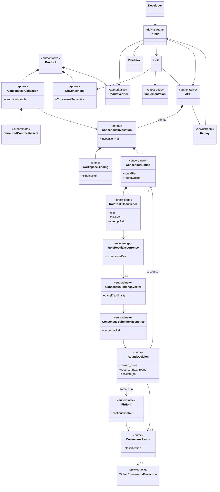
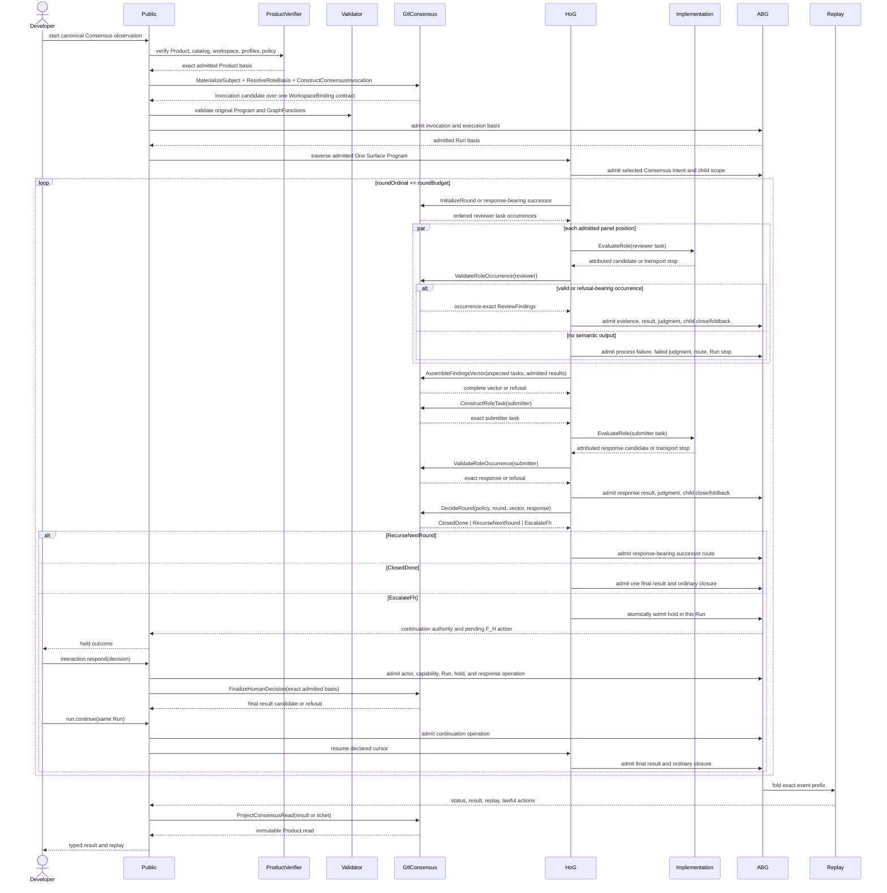
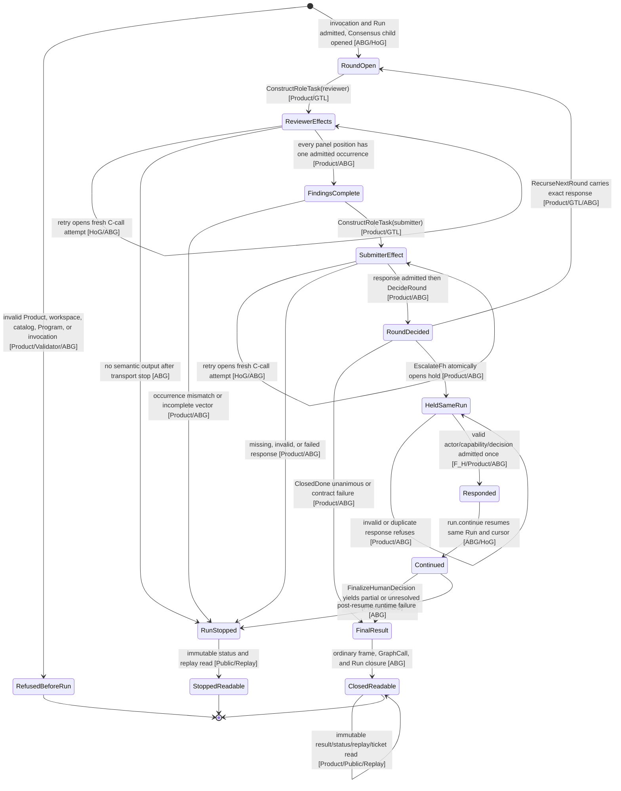

# M05 S05 Consensus Global-To-Local Design

**Status**: Accepted S05 realization basis at `283325aa`

**Owner**: T-270

**Product outcome**: `ABG5-S05`

**Accepted basis**: S03 candidate `8865ccff`; accepted M03 and M05 Sections
1 through 12

**Decision rationale**:
[ADR-045](./adrs/ADR-045-global-design-constraints-survive-local-projection.md)

## Authority And Supersession

This file is the sole accepted S05 design selected by GOALS. It supersedes M05
Section 13 in full for S05. M05 Section 13 and commits after accepted S03 remain
design-discovery evidence only; they carry no independent implementation or
closure authority.

This was a design-gated boundary. Product and requirements fix the semantic
destination, while this accepted cut resolves round outcomes, workspace
topology, F_H continuation, occurrence identity, and module placement.
Direct human acceptance is recorded in
`.ai-workspace/comments/codex/20260726T182458Z_DECISION_direct_accept_s05_design_and_resume_realization.md`.

The constitutional sources are:

- `PRODUCT.md` `A5-F08`, `A5-F10`, and `ABG5-S05`;
- `REQ-P-CONSENSUS-001..019`;
- accepted M03 direct-GTL architecture;
- accepted M05 Sections 1 through 12; and
- installed STDO `v2.2.0`.

## Requirement Projection

| Requirement | Design projection | Failure condition |
|---|---|---|
| `001` | one SYSTEM-owned canonical Consensus GraphFunction in `ConsensusPublication` | another public Consensus identity or callable |
| `002` | `ConsensusProgram` contains the executable GTL body | declaration, plugin, or service substitutes for the graph |
| `003` | downstream subject, profile, policy, and overlay rows enter only through admitted catalog contributions | core switch, copied publication, or undeclared overlay |
| `004` | native Product contracts generate one serialized schema and closed vocabulary family | native and serialized meaning diverge |
| `005` | `MaterializeSubject` and `ConstructConsensusInvocation` bind exact subject, actor, panel, policy, and workspace | mutable path or missing digest identifies the subject |
| `006` | variable non-empty panel plus exact `ReviewerOccurrenceKey` governs every admitted finding set | fixed cardinality, duplicate profile, or cross-occurrence result |
| `006A` | one subject-attributed submitter role consumes one complete findings vector | submitter mismatch or second submitter loop |
| `007` | `ConstructRulingVector` emits only the closed ruling roster | implementation invents a ruling kind |
| `008` | `DecideRound` is total over policy, round, findings, and response | another outcome or implicit budget behavior |
| `008A` | one Run exposes at most one final result from the closed classification union | boolean collapse or competing final results |
| `009` | GTL composition visibly contains reviewer fan-out, submitter, reduction, recursion, and F_H hold | host loop owns any stage |
| `010` | One Surface selects the root; HoG traverses; ABG admits runtime truth | direct public start or feature runtime |
| `011` | Product owns semantic relations, implementation owns F_P effects, ABG owns admission | F_D manufactures judgment or F_P waives validation |
| `011A` | `ValidateRoleOccurrence` and response admission refuse every cross-basis substitute before successor truth | round two opens from invalid response |
| `012` | `ProjectConsensusRead(ticket)` is immutable downstream projection | Consensus mutates ticket governance |
| `013` | one `WorkspaceBinding` contract is parameterized by existing, alternate, or temporary root application | three runtime modes or weaker temporary authority |
| `014` | reviewer/output workspace isolation is excluded unless a future selected contract declares it | implementation invents isolation |
| `015` | one same-Run hold/respond/continue path finalizes unresolved Consensus | direct support invocation or separate target Run |
| `015A` | direct human acceptance must affirm the same-Run F_H topology | delegated acceptance or prior behavior supplies affirmation |
| `016..018` | module proof plus installed qualification cover the canonical path, three outcomes, and three workspace applications | fixture, source import, or parallel adapter substitutes |
| `019` | the boundary remains one reusable Consensus construction | scheduler, watcher, ticket writer, or generic service enters |

## Product Function

```text
One Surface selects canonical Consensus
  -> admit one invocation over one workspace contract
  -> attributed reviewers evaluate exact subject and instructions
  -> admit an occurrence-exact complete findings vector
  -> exact attributed submitter responds
  -> Product decides the round
     -> close unanimous or contract-failure result
     -> recurse with the admitted response
     -> hold the same Run for F_H
  -> F_H response continues that Run when held
  -> admit exactly one final result and ordinary ABG closure
  -> replay-derived result and ticket.consensus read
```

The total public disposition is typed refusal, blocked/failed stop, unanimous
agreement, partial agreement with dissent, unresolved disagreement, or
contract failure. Consensus adds no controller, scheduler, event family,
result store, continuation family, public command, compiler, or second runtime.

## Global Decisions And Local Projection

1. **One Surface is the sole public construction path.**
   - Local: one admitted action selects the canonical Consensus GraphFunction.
   - Falsified by: direct public source start, feature selector, or result-only
     closure.

2. **Product owns semantic meaning.**
   - Local: subject, role, task, occurrence, findings, response, ruling,
     decision, result, and read relations are Product-owned F_D meaning.
   - Falsified by: implementation, HoG, ABG, Public, fixture, or worker deciding
     agreement, recursion, escalation, or closure.

3. **Implementation owns only F_P host effects.**
   - Local: reviewer and submitter effect ports receive exact Product tasks and
     return candidates.
   - Falsified by: transport selecting subject, instructions, policy, panel,
     result meaning, or runtime truth.

4. **GTL owns declared composition.**
   - Local: fan-out, submitter response, reduction, bounded recursion, F_H
     hold, and final projection are visible in the published Program.
   - Falsified by: host-language panel, round, retry, submitter, or escalation
     loop.

5. **HoG traverses and proposes; ABG admits.**
   - Local: HoG proposes result, judgment, route, child closure-or-stop, and
     foldback; ABG alone admits and appends.
   - Falsified by: a leaf or Product writing ABG truth, or HoG closing
     independently.

6. **Lineage is one product-wide relation.**
   - Local: each reachable F_P output contract has one exact disposition and
     semantic evidence derives from that attempt's admitted transport evidence.
   - Falsified by: absent/surplus lineage policy, result-created evidence, or a
     Consensus-only truth path.

7. **ABG events are authoritative; diagnostics are not.**
   - Local: round, role, result, hold, continuation, and closure truth use
     existing ABG events and replay.
   - Falsified by: logs, traces, metrics, or telemetry changing admission,
     retry, result, or closure.

8. **Retry, child closure, and foldback are shared laws.**
   - Local: each role task opens one child GraphCall/Frame; retries open C-call
     attempts inside it; close-or-stop permits at most one foldback.
   - Falsified by: retrying `workflow.C`, sibling retry children, inferred
     closure, or duplicate foldback.

9. **Replay and durable authority govern continuation and reads.**
   - Local: the Run reopens from exact event-prefix, Product, workspace,
     Program, invocation, continuation, and capability authority.
   - Falsified by: process memory, stale prefix, workspace substitution, mutable
     read, or rival result store.

10. **F_H support remains inside the same Run.**
    - Local: `escalate_fh` opens one hold; an admitted
      `accept_with_dissent | reject` response and `run.continue` finalize that
      Run.
    - Falsified by: source closure before response, direct support invocation,
      second Run, duplicate response, or competing result.

11. **Native and serialized contracts have one Product meaning.**
    - Local: generated schemas and vocabularies project the native Product
      contract source.
    - Falsified by: hand-maintained competing schemas or schema runtime
      authority.

12. **`ticket.consensus` is a read, not governance.**
    - Local: the final admitted result and replay project to exact ticket
      identity.
    - Falsified by: ticket mutation, automatic triage, or self-admitted ruling.

13. **Downstream contributions are declared catalog inputs.**
    - Local: subject bindings, reviewer/submitter profiles, policies, and
      overlays are admitted rows consumed by `ConstructConsensusInvocation`.
    - Falsified by: Product-core identifier switch, private import, or copied
      Consensus body.

14. **Workspace variation is one contract application.**
    - Local: existing, alternate, and temporary roots construct the same
      `WorkspaceBinding` and cross the same admission, event, replay, and proof
      relations.
    - Falsified by: a mode flag, temporary-workspace shortcut, or separate
      topology.

15. **Panel cardinality is open; rulings and occurrences are closed.**
    - Local: any non-empty duplicate-free panel determines fan-out cardinality;
      every result equals one expected occurrence; ruling kinds use the closed
      roster.
    - Falsified by: built-in panel count, completion-order attribution,
      cross-round reuse, or invented ruling kind.

## Closed Semantic Algebra

### Reviewer Occurrence

```text
ReviewerOccurrenceKey =
  invocationRef
  + roundRef
  + roundOrdinal
  + panelRef
  + panelPosition
  + profileRef
  + reviewerTaskRef
  + reviewerTaskDigest
  + cCallAttemptRef
```

`ValidateRoleOccurrence(reviewer)` accepts a finding set only when every key
member equals the expected admitted reviewer task occurrence. Retry creates a
new `cCallAttemptRef`; only the admitted successful attempt may occupy the
panel position. Prior attempts and prior rounds cannot satisfy the assembler.

Reviewer execution has exactly three semantic/runtime dispositions:

| Observed condition | Product candidate | ABG disposition | Vector eligibility |
|---|---|---|---|
| schema-valid attributed output, including output observed before later process failure | valid `ReviewFindings` with exact process evidence | admit result and full process truth | eligible |
| attributed output violates the declared reviewer result contract | refusal-bearing `ReviewFindings` with exact raw-output evidence | admit typed refused result and process truth | eligible |
| no valid or refusal-bearing attributed output before timeout, exit, or no-output stop | no semantic finding set | admit failed/stopped process, judgment, route, and Run truth | ineligible |

A complete findings vector exists only when each panel position has exactly one
eligible, occurrence-exact result. It preserves panel order and has cardinality
equal to the admitted panel.

### Ruling Vector

`ConstructRulingVector` is a Product F_D relation over the exact findings
vector, submitter response, and admitted disagreement-rule contract.

- the canonical rule emits one row per panel position;
- a refusal-bearing finding set emits `deferment`;
- another canonical finding set emits `decision_row`;
- an admitted downstream disagreement-rule overlay may instead select
  `draft_ticket`, `split_ticket`, or `rejected_finding`;
- every overlay remains inside the closed roster and is an admitted catalog
  input, never implementation logic; and
- row order, finding refs, rationale, and payload refs derive from the exact
  occurrence and response.

### Round Decision

```text
RoundDecision =
  | ClosedDone {
      classification: unanimous_agreement | contract_failure,
      rulings,
      finalResultBasis
    }
  | RecurseNextRound {
      responseBearingSuccessorBasis,
      rulings
    }
  | EscalateFh {
      sameRunHoldBasis,
      provisionalUnresolvedBasis,
      rulings
    }
```

`DecideRound(policy, round, completeFindings, admittedResponse)` is total:

| Predicate, evaluated in order | Decision | Required consequence |
|---|---|---|
| any finding occurrence is refusal-bearing | `ClosedDone(contract_failure)` | one contract-failure ref derives from exact refusal refs; no F_H path |
| all reviewers accept and the response acknowledges or addresses every finding | `ClosedDone(unanimous_agreement)` | one final result basis |
| material disagreement remains and `roundOrdinal < roundBudget` | `RecurseNextRound` | exactly one successor basis carrying this response |
| material disagreement remains and budget is exhausted, or escalation rule selects F_H | `EscalateFh` | one hold inside the same Run |

No predicate overlap is lawful. Contract failure has precedence, then exact
agreement, then remaining-budget recursion, then F_H. `recurse_next_round`
increments the ordinal by one; the other variants create no successor round.

### Same-Run F_H Finalization

```text
HumanDecision = accept_with_dissent | reject

FinalizeHumanDecision(
  exact open Run,
  exact unresolved hold basis,
  admitted actor/capability,
  admitted HumanDecision
) =
  | Final(partial_agreement_with_dissent)
  | Final(unresolved_disagreement)
  | RefuseAndRemainHeld
```

- `accept_with_dissent` produces one partial-agreement final result.
- `reject` produces one unresolved-disagreement final result.
- wrong actor, capability, Run, hold, decision, or invocation refuses before
  response admission and leaves the hold open.
- the admitted response consumes the hold exactly once; duplicate operation
  identity is idempotent and another response cannot be admitted.
- `run.continue` resumes the same Run and cursor, admits exactly one final
  result, exhausts append authority at ordinary closure, and leaves immutable
  read authority.
- before closure, public reads expose status, replay, and the pending F_H
  action, not a competing final `ticket.consensus` result.

## Affected Ontology

Ontology basis `ABI5-S05-ONTOLOGY-002` is the bounded S05 slice of the accepted
Product and M03/M05 Ontology. Unchanged Product, GTL, HoG, ABG, event, replay,
continuation, and public-operation identities are consumed, not redefined.

### Relationships And Cardinalities

| Relation | Cardinality and invariant | Authority |
|---|---|---|
| Product -> ConsensusPublication | exactly one canonical publication | Product/GTL declaration |
| ConsensusPublication -> ConsensusProgram | one supervised Program; no support Program | Product/GTL |
| Program -> ConsensusInvocation | zero or more admitted invocations | Product proposes; ABG admits |
| Invocation -> WorkspaceBinding | exactly one, independent of root application kind | Product/ABG |
| Invocation -> reviewer panel | one non-empty duplicate-free ordered vector | Product |
| Invocation -> submitter role | exactly one actor-equal profile | Product |
| Invocation -> rounds | one through positive policy budget | Product/GTL; ABG admits |
| Round -> reviewer occurrences | exactly panel cardinality, one admitted result per position | Product/ABG |
| Round -> findings vector | zero or one; exists only when complete | Product/ABG |
| Findings vector -> submitter task/response | exactly one task and at most one admitted response | Product/ABG |
| Round -> RoundDecision | exactly one after response admission | Product/ABG |
| Recurse decision -> successor round | exactly one, response-bearing | Product/GTL/ABG |
| Escalate decision -> F_H hold | exactly one in the same Run | Product/ABG |
| Run -> final ConsensusResult | zero while active/held; exactly one when closed | Product/ABG |
| Result -> TicketConsensusProjection | zero or one immutable downstream read | Product |

### Entity And Lifecycle Completeness

| Entity | Identity | Authority owner | Declare/create | Read/project | Update/transition | Delete/retire |
|---|---|---|---|---|---|---|
| `ConsensusPublication` | Product/version/publication digest | Product/GTL | package declaration | catalog view | new Product cut only | superseded by release |
| `ConsensusInvocation` | canonical invocation ref/digest | Product meaning; ABG admission | `ConstructConsensusInvocation` then admit | replay/public status | none; immutable | exhausted with Run |
| `WorkspaceBinding` | binding ref/digest | Product/ABG | existing workspace admission | invocation/replay | new observation snapshot only | release/workspace revocation |
| `ConsensusRound` | invocation + round ref/ordinal | Product/GTL; ABG admission | `InitializeRound` or successor basis | replay/result | `DecideRound` once | terminal decision |
| `ReviewerTaskOccurrence` | `ReviewerOccurrenceKey` | Product meaning; ABG attempt truth | `ConstructRoleTask(reviewer)` | finding/evidence replay | retry creates new attempt, not mutation | child close-or-stop |
| `ReviewFindingsOccurrence` | occurrence key + output digest | Product meaning; ABG admission | `ValidateRoleOccurrence` | vector/replay | not_applicable: immutable result | Run retention policy |
| `ConsensusFindingsVector` | application ref + ordered occurrence keys | Product/ABG | `AssembleFindingsVector` | submitter task/replay | not_applicable: immutable | round retention |
| `SubmitterTaskOccurrence` | invocation + round + task + attempt | Product meaning; ABG attempt truth | `ConstructRoleTask(submitter)` | response/evidence replay | retry creates new attempt | child close-or-stop |
| `ConsensusSubmitterResponse` | exact task + response ref/digest | Product meaning; ABG admission | `ValidateRoleOccurrence` | decision/replay | not_applicable: immutable | Run retention |
| `RoundDecision` | round + policy + vector + response digest | Product meaning; ABG admission | `DecideRound` | replay/result | one terminal transition | consumed by successor, hold, or result |
| `FhHold` | Run + Frame + continuation + unresolved basis | ABG | escalate decision admission | status/replay/lawful actions | respond once then continue | resolved at closure or explicit Run stop |
| `ConsensusResult` | Run + result ref/digest | Product meaning; ABG admission | direct decision or `FinalizeHumanDecision` | result/replay/ticket read | not_applicable: immutable final | release retention |
| `SerializedContractAssets` | Product cut + asset digests | Product publication | deterministic package generation | installed catalog | new Product cut only | superseded by release |
| `TicketConsensusProjection` | result + ticket ref/digest | Product | `ProjectConsensusRead(ticket)` | public read | not_applicable: immutable | downstream cache eviction |

Subjects, profiles, instructions, panel rows, findings, rulings, response
payloads, policy rows, and schema definitions are subordinate values of the
entities above unless the public contract Promotion Test below applies.

### Authority Matrix

| Function or transition | Proposer | Evaluator | Verifier | Admitter | Executor | Projector | Retirement owner |
|---|---|---|---|---|---|---|---|
| construct invocation | developer/catalog | Product | Product + validator | ABG | Public fixed composition | replay/Public | ABG Run closure |
| construct role task | GTL traversal | Product | Product predicates | ABG C-call basis | HoG | replay | child close-or-stop |
| reviewer/submitter effect | admitted task | Product contract | Product occurrence/lineage verifier | ABG result/judgment | implementation F_P port | replay | C-call terminal truth |
| assemble findings vector | admitted occurrences | Product | exact occurrence/cardinality predicate | ABG application completion | HoG/GTL fold | replay | round terminal truth |
| decide round/rulings | admitted vector/response | Product | closed policy and result predicates | ABG result/judgment/route | Product F_D through declared leaf | replay | successor/hold/result transition |
| open successor round | `RecurseNextRound` | Product | prior-response equality | ABG | HoG recursion | replay | successor terminal truth |
| open F_H hold | `EscalateFh` | Product | same-Run basis | ABG atomic hold batch | HoG route | public status/replay | response or Run stop |
| respond and continue | developer/F_H | Product | actor/capability/hold/decision | ABG | Public fixed operation then HoG resume | replay | hold consumed once |
| admit final result/close | Product candidate | Product | result/closure predicates | ABG | HoG route | replay/Public | immutable Run closure |
| project ticket/result | public read request | Product | ABG exact result/replay | not_applicable: no append | Product pure projection | Public | cache eviction |
| publish schemas | Product source | Product | package/manifest digest checks | release/install authority | deterministic generator | catalog | next Product cut |

Actor identity never substitutes for admitted authority. Composition carries
only the authority admitted for its exact inputs and current Run basis.

## Atomic Functions And Prime Contraction

### Function Derivation

| Discovered functionality | Entity | Atomic function or template | Higher-order composition | Effect class | Required authority | Disposition |
|---|---|---|---|---|---|---|
| exact subject bytes | Invocation | `MaterializeSubject` | invocation construction | F_D | Product | atomic |
| reviewer/submitter profiles and instructions | Invocation | `ResolveRoleBasis(role)` | invocation construction | F_D | Product/catalog | atomic parameterized |
| one admitted invocation | Invocation | `ConstructConsensusInvocation` | One Surface start | F_D then admission | Product/ABG | atomic |
| first round | Round | `InitializeRound` | GTL recursion seed | F_D | Product | atomic |
| reviewer/submitter task | role occurrence | `ConstructRoleTask(role)` | fan-out or sequential submitter child | F_D | Product/GTL | atomic parameterized |
| reviewer/submitter host execution | role occurrence | `EvaluateRole(role)` | `C.retry(workflow.C(role), bound)` | F_P | implementation under admitted port | atomic parameterized effect |
| candidate schema, lineage, attribution, occurrence | role result | `ValidateRoleOccurrence(role)` | ABG result admission | F_D then admission | Product/ABG | atomic parameterized |
| complete ordered panel output | findings vector | `AssembleFindingsVector` | `C.batch` completion fold | F_D | Product/ABG | atomic |
| rulings, outcome, successor/hold/result basis | RoundDecision | `DecideRound` | recursion or terminal route | F_D | Product/ABG | atomic total relation |
| admitted human choice | FhHold/Result | `FinalizeHumanDecision` | same-Run continuation | F_H input then F_D | F_H/Product/ABG | atomic total relation |
| result, replay, ticket read | downstream projection | `ProjectConsensusRead(kind)` | public read | F_D | Product over ABG truth | atomic parameterized |
| three workspace applications | WorkspaceBinding | `ConstructConsensusInvocation(workspaceBinding)` | same start composition | F_D | Product/ABG | derived parameter |
| downstream profile/policy overlays | catalog declarations | `ResolveRoleBasis` and invocation construction | catalog admission | F_D | contributor proposes; Product/ABG admit | derived composition |
| reviewer isolation or output workspace | deferred boundary | none | none | not_applicable | future Product re-entry | deferred by REQ-014 |
| generic scheduler/ticket writer | excluded boundary | none | none | not_applicable | no authority | excluded by REQ-019 |

### Whole-Family Prime Result

| Candidate family | Contraction relation | Retained meaning | Authority before/after | Accepted loss | Falsification |
|---|---|---|---|---|---|
| reviewer and submitter task constructors | `ConstructReviewerTask + ConstructSubmitterTask -> ConstructRoleTask(role)` | exact role-specific input/output variants | Product + Product -> Product | duplicate peer function identity | role variant changes authority or cannot carry exact vector |
| reviewer and submitter evaluators/validators | `Evaluate/ValidateReviewer + Evaluate/ValidateSubmitter -> role-parameterized effect and validation templates` | distinct contracts and actors remain typed variants | same Product/implementation/ABG path | duplicate effect seam | implementation gains semantic choice |
| reducer plus source-result projector | `ReduceRound + ProjectSourceResult -> DecideRound` | complete ruling, outcome, classification, successor/hold/result union | Product remains singular | intermediate ambiguous terminal state | any decision lacks one output variant |
| separate source/support episodes | `FinalizeSupport(target) -> FinalizeHumanDecision(same Run)` | F_H resolution and typed result | ABG remains one episode owner | direct support Program, source-result basis, target Run | source closes before F_H or second result appears |
| three workspace modes | `existing + alternate + temporary -> WorkspaceBinding application parameter` | all root applications and exact authority | Product/ABG unchanged | mode identities and shortcuts | any application crosses another topology |
| result and ticket readers | `ProjectResult + ProjectTicket -> ProjectConsensusRead(kind)` | public pattern-match variants | Product projection remains singular | duplicate read authority | ticket projection can append or differ semantically |

No further contraction is lawful:

- invocation, round, role occurrence, decision, hold, and final result have
  distinct identity or lifecycle;
- F_P evaluation cannot merge with Product validation without merging effect
  and semantic authority;
- ABG admission cannot merge with Product decision without creating a second
  runtime-truth owner; and
- projection cannot merge with admission because reads append no truth.

### Composition And Effect Laws

| Law | S05 relation |
|---|---|
| unit | `C.id` is the typed unit for pure compatible GTL composition |
| closure | every composition output matches the next declared input or refuses before transition |
| associativity | pure F_D composition is extensionally associative; regrouping effectful ABG steps is not applicable because event order is observable |
| order | role effects, response admission, decision, continuation, and closure are non-commutative |
| fan-out cardinality | reviewer tasks and eligible vector positions equal admitted panel cardinality |
| retry cardinality | each role child has the declared finite C-call attempt bound and at most one successful result |
| recursion cardinality | round ordinal starts at one, is contiguous, and never exceeds policy budget |
| response cardinality | one complete vector creates one submitter task and at most one admitted response |
| F_H cardinality | one escalate decision creates one hold, one admitted response, and one final result in the same Run |
| effect conservation | F_D appends no truth; F_P returns candidates; F_H supplies a decision; ABG alone admits events and closure |
| authority conservation | composition cannot widen catalog, actor, capability, workspace, Run, or result authority |

## Irreducible Architectural Carrier Set

S05 adds no new peer IACS family. It projects its carriers into the accepted
M03 set.

| S05 carrier | Accepted IACS family | Ontology law carried | Authority/status |
|---|---|---|---|
| publication, Program, GraphFunctions, native contracts, schemas, vocabularies | `GtlDeclarationFamily` | canonical meaning and composition | Product-authoritative, public/versioned |
| subject, profile, policy, panel, WorkspaceBinding, admitted catalog rows | `EnvironmentBasis` plus subordinate invocation inputs | exact environment and contribution basis | Product/ABG admitted |
| invocation admission and same-Run continuation basis | `InvocationBasis` | one start, one Run, admitted actor/capability | ABG-authoritative, opaque publicly |
| round, role task, vector, response, decision payloads | subordinate to `TraversalAggregateFamily` | invocation-local GTL values and foldback | Product meaning; ABG event-linked |
| reviewer/submitter effect tasks and candidates | `LeafRealizationBoundary` effect-edge variants | exact F_P contract and occurrence | task public; function private |
| Run, GraphCall, Frame, C-call, hold, and closure | `TraversalAggregateFamily` | causal runtime lifecycle | ABG-authoritative |
| ordinary runtime events | `RuntimeEventFamily` | sole append-only truth | ABG-authoritative |
| result, replay, status, lawful actions, ticket projection | `ReplayProjectionFamily` | deterministic downstream reads | public/downstream |

Promotion Test:

- invocation, role-task, role-result, decision, and result variants are
  promoted because they cross admitted, effect, persisted, or public
  pattern-match boundaries;
- subjects, profiles, instructions, panel members, policies, findings,
  rulings, and response details remain subordinate payloads inside those
  carriers even when their schema records are public;
- generated schemas and vocabularies are subordinate declaration projections,
  not replay or runtime authorities; and
- helper parser, transport, retry, and digest shapes remain module-local.

## Module And Interface Projection

The accepted M03 dependency law remains unchanged. Product-owned standard
library semantics may reside under `src/gtl`; `src/product` verifies installed
Product/catalog/projection provenance and does not implement a second Consensus
kernel.

| Semantic function | Meaning authority | Abstract module/interface | Output family |
|---|---|---|---|
| `MaterializeSubject` | Product | `src/gtl` `ConsensusSemantics` | subject materialization |
| `ResolveRoleBasis` | Product/catalog | `src/gtl` `ConsensusSemantics` | reviewer/submitter role variant |
| `ConstructConsensusInvocation` | Product | `src/gtl` `ConsensusSemantics` | invocation candidate |
| `InitializeRound` | Product | `src/gtl` `ConsensusSemantics` | round seed |
| `ConstructRoleTask` | Product/GTL | `src/gtl` `ConsensusSemantics` | role-task variant |
| `EvaluateRole` | implementation effect only | admitted `LeafExecutionPort` in `src/implementation` | raw attributed role candidate |
| `ValidateRoleOccurrence` | Product | `src/gtl` `ConsensusSemantics`, sealed by existing `src/product` installed-semantic verifier | valid/refusal role-result variant |
| `AssembleFindingsVector` | Product | `src/gtl` `ConsensusSemantics` | complete ordered vector |
| `DecideRound` | Product | `src/gtl` `ConsensusSemantics` | closed decision union |
| `FinalizeHumanDecision` | F_H decision; Product meaning | `src/gtl` `ConsensusSemantics` through existing continuation input | final result candidate or refusal |
| `ProjectConsensusRead` | Product over ABG truth | `src/gtl` pure projector exposed through `src/public` fixed read composition | result/ticket read variant |
| result, route, hold, continuation, event, closure admission | ABG | existing `src/abg` admission ports | authoritative runtime events |
| direct traversal and foldback proposal | HoG | existing `src/hog` traversal port | proposals only |

Interface direction:

```text
public -> product verification, validator, ABG public ports, HoG public invoke
hog -> GTL values, ABG admission ports, admitted LeafExecutionPort
implementation -> GTL role contracts and Product-owned pure task renderers
abg -> GTL/product contract types
product -> GTL and validator types
gtl -> shared primitives only
```

No new dependency, feature-specific port, or semantic owner is introduced.

## Three Semantic Views

### Domain



### Interaction



### Lifecycle



## Cross-View Axiom Evaluation

| Axiom | Ontology evidence | Authority | Domain evidence | Sequence evidence | State evidence | Native enforcement | Admission/compiler enforcement | Verdict | Gap owner |
|---|---|---|---|---|---|---|---|---|---|
| every view derives from one S05 Ontology | entity, relation, lifecycle, authority, and function tables | Product design | every participant/entity is present | every message names an atomic/composed relation | every transition names function/owner | typed carriers and closed unions | validator plus ABG admission | pass | none |
| one canonical public entry | publication, Program, invocation | Product/GTL/ABG | one publication and Program | One Surface precedes Consensus traversal | only admitted invocation reaches RoundOpen | canonical refs and start contract | catalog, action, invocation admission | pass | none |
| one workspace contract, three applications | WorkspaceBinding relation | Product/ABG | one binding class | same invocation constructor for each root | no mode-specific state | one binding predicate | workspace/catalog admission | pass | none |
| variable panel and exact occurrence identity | panel and occurrence relations | Product/ABG | `1..*` tasks/results | expected task key precedes admission | incomplete/mismatched vector stops | occurrence equality and unique profiles | C-call/result/application admission | pass | none |
| raw F_P output never closes truth | role occurrence lifecycle | Product/implementation/ABG | candidates are effect-edge only | validation and admission follow effect | outputless failure stops; valid/refusal result proceeds | role result predicates | ABG evidence/result/judgment admission | pass | none |
| submitter response gates every successor | vector, task, response, decision | Product/ABG | response precedes decision relation | response admission before DecideRound | only RoundDecided can recurse | exact vector/response predicates | child closure and foldback admission | pass | none |
| round algebra is total and singular | RoundDecision closed union | Product | one decision per round | one ordered DecideRound call | all decision variants shown | discriminated union and precedence table | result/judgment/route admission | pass | none |
| F_H remains same-Run and single-use | FhHold and Result cardinality | F_H/Product/ABG | hold belongs to invocation Run | respond/continue resume same cursor | no source/target episode split | decision and basis predicates | operation idempotency, continuation, closure admission | pass | none |
| ABG events alone own runtime truth | runtime aggregate relations | ABG | ABG authoritative, Replay downstream | every runtime transition crosses ABG | all active states are event-derived | event payload types | event-store admission and replay | pass | none |
| diagnostics cannot affect semantics | global decision 7 | no semantic authority | no diagnostic entity | no diagnostic decision message | no diagnostic transition | not_applicable: observational payloads | absence from admission predicates | pass | none |
| downstream contribution cannot replace core | catalog contribution relation | contributor proposes; Product/ABG admit | overlays subordinate to invocation | catalog resolution precedes construction | no overlay lifecycle authority | closed contracts and roster | catalog/Program admission | pass | none |
| public and ticket reads append no truth | Result and TicketProjection | Product/Public | projections downstream | read follows replay | self-loop only on closed/readable | pure projector | exact prefix/result verification | pass | none |
| no hidden controller or constructor | function derivation and composition laws | GTL/HoG/ABG | no controller entity | all loops/branches are declared | every transition has declared source | GTL constructors and closed functions | whole-Program validation | pass | none |

## Operational Lifecycle Confirmation

| Phase | S05 answer | Owner and source truth |
|---|---|---|
| intent | ordinary reusable Consensus, not a feature runtime | `INTENT.md` / F_H |
| Product/requirements | `A5-F08`, `A5-F10`, `ABG5-S05`, `REQ-P-CONSENSUS-001..019` | specification / F_H |
| design | this Ontology, Prime, IACS, module mapping, and three-view cut | T-270 design; pending independent review/direct acceptance |
| realization | Product standard library under `src/gtl`, F_P effects under `src/implementation`, generic HoG/ABG/Public | accepted M03 module law |
| assurance | module-owned Consensus unit lane, installed Consensus scenario, M5/M4 regressions | T-270 proof; not yet rerun for this design |
| package/release | generated native/serialized contracts in future exact 5.0 package | Product publication / T-248 |
| install/deploy | ordinary ProductInstall, ProductSet, WorkspaceBinding, catalog admission | Product/ABG install authority |
| live invocation | One Surface start, same-Run F_H response/continue, project.read | public contract + ABG events |
| telemetry/projection | replay is authoritative projection; logs/metrics observational | ABG/Replay |
| retirement | immutable prior result retained; schemas/publication superseded only by later Product cut | release authority |

## Module-Owned Proof Definition

| Module boundary | Owned laws to prove | Existing proof lane and required additions |
|---|---|---|
| `src/gtl` Consensus semantics | closed contracts, variable panel, occurrence equality, total decision/F_H unions, workspace parameter, pure reads | extend existing `test:m5:consensus-unit`; table-drive every decision predicate, both F_H decisions, all occurrence substitutions, singleton and larger panels, and three workspace bindings |
| `src/product` verifier | exact installed Product/catalog/projection provenance; no second Consensus kernel | existing S03 authority lane plus Consensus unit mutations for forged provider/catalog/overlay |
| `src/implementation` role effect | exact task/instruction transport; no semantic decision; valid-before-failure salvage | existing worker and Consensus module lanes with reviewer and submitter effect variants |
| `src/hog` traversal | declared fan-out, submitter child, retry, recursion, same-Run resume, proposals only | existing traversal module lanes plus no-direct-support and one-foldback mutations |
| `src/abg` admission/replay | exact occurrence, response, decision, hold, idempotency, continuation, one result, closure | existing S03/ABG unit lanes plus wrong Run/hold/actor/capability, duplicate response, post-resume failure, and competing-result mutations |
| `src/public` projection | fixed composition, no mode/controller, immutable reads | existing S03 unit lane plus all three workspace applications and no direct support start |

`test:m5:consensus` remains downstream installed scenario proof. It cannot
replace the module-owned lane. No new test script, ticket, event family, or
proof product is required; the existing lanes absorb the derived cases.

## Design Acceptance Predicate

Independent review determines whether:

- the requirement projection is complete and Product-consistent;
- the Ontology, Prime contraction, IACS, module mapping, three views, and
  cross-view axioms form one satisfiable constraint network;
- the round, occurrence, failure, ruling, F_H, workspace, and public-read
  algebras are total and singular; and
- implementation can project this design without choosing Product meaning,
  authority, topology, lifecycle, failure, or closure.

Direct human acceptance must separately affirm REQ-P-CONSENSUS-015A's
same-Run F_H topology. The worker performs no semantic self-review. Before
handoff it runs only mechanical checks, binds one exact subject, and stops.
