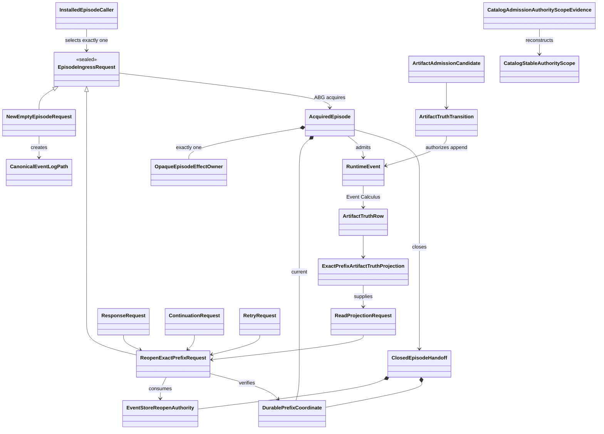
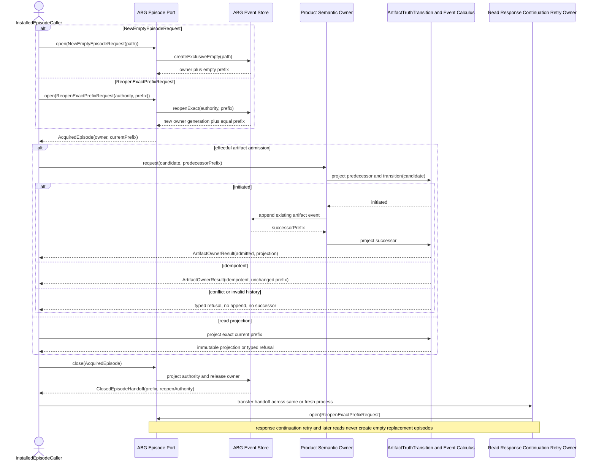
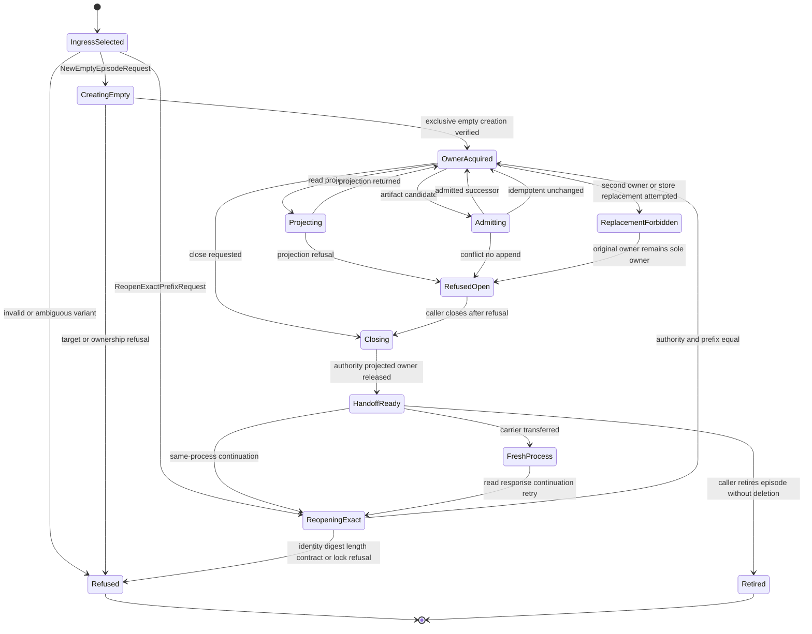

# M05 S06 Axiomatic Authority And Exact Public Construction Design

**Status:** proposed Gate 1 bounded-repair subject; not operative realization
authority until direct F_H accepts the exact reviewed commit and tree

**Scope:** ABG5-S06 corrective authority, exact 18-operation/56-key
construction map, and hard-break realization boundary

**Re-entry:** targeted `requirement_reprice` for deterministic catalog
application plus bounded `design_reframe`

**Owner:** T-281 under T-270

**Method:** STDO 2.2.2

## 1. Decision Boundary

This design consumes the accepted census without changing it:

- path:
  `.ai-workspace/comments/codex/20260731T113200Z_CENSUS_abiogenesis_5_0_s06_exact_56_key_construction.md`;
- Git blob: `efe88cac85bd3bb071d4b5dd451dfadaec893c4f`;
- SHA-256:
  `0c0339689c21154c46148f033c7472b9d55a0fd771fc34a1c41d41c52d28a0c6`.

The exact 56 census rows, their current loci, evidence hashes, deletion
effects, projection graph, PFC-F08 oracle, sentinel, and `AX-F01..F14` plus
`AX-PFC-F08` falsifier records are incorporated by row identity. This design
supplies the previously absent target source paths, runtime value bindings,
dependency closures, and singular authority relations. It does not implement
them.

After rejection of replacement `29aea26d` on its inapplicable AX-F09 Public
ingress, direct F_H authorized completion of Gate 1 inside the already
accepted Product and STDO 2.2.2. Owner-internal names, carriers, refusal codes,
module placement, and signatures are worker-owned HOW while they add no
Public operation, rival authority, controller, runtime, catalog, or Product
meaning. Section 7.3 and `D17..D18` exercise that bounded decision envelope;
they change no requirement or 18/56 member.

Product and Intent are unchanged. S03 and S05 Product and scenario outcomes
are unchanged. This design explicitly supersedes only the obsolete M03
CatalogView admission mechanism named in Section 3; it does not change the S03
narrowing or invocation meaning. S04, post-S06 Prime realization, complete M5
publication closure, M6, and M7 remain outside this subject. Donor adoption is
empty.

Cold constructability review of complete candidate `2a60c2b7`, tree
`fc19ebdf`, passed. Cold authority review found one local counterexample:
Section 7.3 selected one current retry attempt without preserving the complete
prior-attempt frontier required by `REQ-R-ABG3-PROJECTION-009..010`. This
bounded replacement adds the exact full-frontier relation and strengthens
AX-F09 to exercise two prior failures before restart. It consumes the one
repair permitted by the completion envelope and changes no Product,
requirement, Public-family, or authority structure.

## 2. Constitutional Construction

The one Public algebra is:

```text
admit common envelope
  -> select exact operation-and-definition-key contract
  -> call the selected concrete owner-local port value
  -> project the exact indexed owner outcome
```

The implementation is admissible only while all of these axioms hold:

1. `PUBLIC_FUNCTION_DEFINITION_FAMILY` is exactly 18 operations and 56 keys.
2. Every definition references the actual callable Product, ABG, Validator,
   or release owner port value. A string, interface, locator without a value,
   or Public handler is not a port.
3. Owner-local packet values are the sole source of request, result, refusal,
   non-terminal, authority, effect, and capability meaning.
4. Public performs only common admission, exact selection, direct port
   invocation, and structural outcome projection. It contains no semantic
   operation switch.
5. Product owns static PFC-F08 publication and Product meaning. ABG alone owns
   admitted runtime catalog events and runtime truth.
6. ABG-admitted events plus declared Event Calculus laws derive runtime truth.
   Replay and reads invoke those projectors; neither interprets raw events as
   a second authority.
7. Every runtime-relevant prefix is explicit. Equal immutable inputs and equal
   admitted prefixes have equal meaning after restart and interleaving.
8. SDK, CLI, Codex, schemas, catalog rows, manifests, and documentation derive
   from the same exact family.
9. The legacy family is the only reachable Public family before the atomic
   swap. The exact family is the only reachable family afterward.
10. Release owner ports are real and callable in S06, but without the later
    qualification and release basis they return the exact applicable closed
    `ReleaseSnapshotPacket` owner refusal and cannot publish success.

The first counterexample stops the increment. Tests, compatibility, donor
behavior, and implementation convenience cannot trade against an axiom.

## 3. Requirement Trace And Supersession

| Authority | Binding in this design |
|---|---|
| `REQ-P-PUBLIC-CONTRACTS-005`, `-008..010` | one exact indexed family and one invocation/outcome family |
| `REQ-P-POLICY-041..046`, `-049..064` | pure reads, thin adapters, complete Product operations, exact public path |
| corrected `REQ-P-CATALOG-008`, `-030` | deterministic eventless CatalogApplication; ABG-only runtime catalog admission |
| `REQ-R-ABG3-EVENTS-001..002`, `-018`, `-024..032` | append-only admitted events, scoped Event Calculus, durable ingress, no process truth |
| `REQ-R-ABG3-PROJECTION` and `REQ-R-ABG3-RUN` | replay/read projections consume the same Event Calculus result |
| `REQ-L-GTL3-C-ALGEBRA-013..018` | one admitted normalized Program, validation before effects, no rival plan |
| `REQ-L-GTL3-LAWS-021..022` | one code-unit canonical data identity independent of caller order |
| T-281 `CL-01..CL-11` | hard break, explicit carriers, all-port packaging, frozen reviews |

Accepted predecessor files remain immutable. If this subject is accepted, it
supersedes only these realization relations:

| Predecessor relation | Superseding relation |
|---|---|
| `M04_PUBLIC_OPERATION_DEFINITION_FAMILY_BEHAVIOR_DESIGN.md` store-local branded application exception | deterministic reconstructable Product application in Section 6 |
| `M03_M04_PUBLIC_CATALOG_INVOCATION_AUTHORITY_BEHAVIOR_DESIGN.md` application event and unkeyed artifact fluent | no application event; scoped artifact fluent only for genuinely effectful artifacts |
| `M03_DIRECT_GTL_TRAVERSAL_BEHAVIOR_DESIGN.md` `CatalogView` admitted-projection ontology, ABG-owned `narrowCatalogView`, view-admission event, catalog-view sequence admission, and ABI5-ROOT-001 R4 admission mapping | total deterministic eventless Product `CatalogOperationPort.constructView` over an ABG-admitted catalog projection plus exact allowlist; `run.invoke` revalidates the equal view against the explicit-prefix Event Calculus catalog and its invocation event records the view use |
| `M05_S05_CONSENSUS_GLOBAL_TO_LOCAL_DESIGN.md` one-shot store/context application lifecycle | equal carrier reconstruction and invocation-time revalidation |
| `M05_DIRECT_GTL_TRAVERSAL_EXPANSION_DESIGN.md` branded source-result and remembered context coordinates | ABG-backed rehydration from explicit prefix |
| `M05_S06_NATIVE_CONTRACT_CLOSURE_DESIGN.md` root-context-held verification/resolution/install relations | complete serializable carriers and explicit preimages |
| `M05_S06_PUBLIC_FUNCTION_AND_NATIVE_OCCURRENCE_CLOSURE_DESIGN.md` hybrid application ownership, Public read-contract ambiguity, implicit prefix, and older common refusal shape | Sections 4 through 9 of this design |

The accepted predecessor's exact 18/56 source map, PFC-F01..F08 staging,
closed PFC-F08 attempt/refusal relation, and PFC-F08A exact owner-coordinate
join are retained unchanged except where the table above explicitly says
otherwise.

## 4. Concrete Port Law

An owner packet and port are owner-local. No owner module imports `src/public`.
Each named `*Port` below is an exported frozen runtime value whose selected
member is a function. Type-only interfaces may describe it but cannot satisfy
the definition family.

Conceptually, each selected function has this shape:

```text
OwnerPortMember(
  exact owner-local request,
  exact owner-local authority carrier,
  prebound installed owner dependencies
)
  -> exact owner result
   | exact owner refusal
   | exact owner non-terminal
```

The installed composition root binds dependencies once. Public neither builds
an owner context nor selects an owner dependency. The exact definition stores
the already bound function value. Indexed admission extracts only the exact
owner-local request and authority carrier named by the owner packet.

Each definition is one frozen runtime value containing both its canonical
serializable intrinsic fields and `ownerPort`, the actual bound function. Its
`definitionDigest` hashes only the declared intrinsic preimage, including the
exact owner-port coordinate; host function identity is never serialized or
hashed. Family construction resolves that coordinate once, proves that the
resolved export is the same callable stored in `ownerPort`, and then freezes
the definition. PFC-F07 projects only the intrinsic fields. This is one family
with one installed binding, not a serializable catalog plus a second dispatch
registry.

The common Public path is implemented in new structural modules:

| Target source | Sole responsibility |
|---|---|
| `src/public/envelope.ts` | raw/native common-envelope admission and the closed common refusal carrier |
| `src/public/definition_family.ts` | PFC-F01/F02 exact structural join over actual owner contract and port values |
| `src/public/invocation_admission.ts` | exact definition selection and indexed contract admission |
| `src/public/invoke.ts` | call `selection.definition.ownerPort` exactly once; no operation switch |
| `src/public/outcome_projection.ts` | structural tagged projection of the indexed owner outcome |
| `src/public/project_read_contracts.ts` | derived total join over owner-local read contract and port values; authors no field or schema |
| `src/public/schema_projection.ts` | later PFC-F07 schema projection from the closed family |
| `src/public/sdk.ts` | later typed SDK projection from the closed family |
| `src/public/index.ts` | package export of the selected family and projections only |

`src/public/operations.ts`, `src/public/contracts.ts`, and
`src/public/schema.ts` are legacy files, not destinations for semantic reuse.
They are deleted in the atomic swap defined by Section 10.

## 5. Explicit Carriers And Durable Ingress

### 5.0 W1.1a boundary Ontology

This Ontology is the sole vocabulary for W1.1a. The domain, sequence, state,
lifecycle, axiom, and realization projections below may not introduce another
entity or owner by synonym.

| Entity | Kind | Exact identity/content | Owner | Lifecycle role |
|---|---|---|---|---|
| `InstalledEpisodeCaller` | actor | installed caller identity outside runtime truth | installed CLI or programmatic host | selects exactly one ingress variant and supplies its closed request |
| `CanonicalEventLogPath` | stable filesystem locator | caller-supplied canonical absolute path | caller selects; Event Store verifies | new-episode creation target only |
| `NewEmptyEpisodeRequest` | closed request | kind, schema version, `CanonicalEventLogPath` | installed ABG episode port | requests exclusive creation of a new empty episode |
| `ReopenExactPrefixRequest` | closed request | kind, schema version, `EventStoreReopenAuthority`, exact `DurablePrefixCoordinate` | installed ABG episode port | requests acquisition of one existing exact prefix |
| `EpisodeIngressRequest` | disjoint sum | `NewEmptyEpisodeRequest | ReopenExactPrefixRequest` | caller constructs; ABG validates | exhaustive episode entry |
| `OpaqueEpisodeEffectOwner` | nonserializable effect authority | one held descriptor, device/inode identity, existing append lock, owner generation | ABG Event Store | sole same-process append/project owner; never durable truth |
| `DurablePrefixCoordinate` | durable value | log ref, byte length, byte digest, device/inode, event-contract digest | ABG Event Store projects; ABG verifies | immutable truth coordinate before/after every effect |
| `EventStoreReopenAuthority` | durable handoff value | canonical path, device/inode, byte length/digest, event-contract digest, authority digest | ABG Event Store | authorizes fresh-process acquisition of the equal prefix |
| `AcquiredEpisode` | closed process carrier | ingress kind, opaque owner, current prefix | installed ABG episode port | unique open state for admission or projection |
| `ClosedEpisodeHandoff` | closed durable carrier | final prefix plus equal reopen authority | ABG Event Store | owner-free same/fresh-process handoff |
| `RuntimeEvent` | admitted durable fact | canonical event envelope, event ID, ordinal, payload digest | semantic owner proposes; ABG admits | sole write-side runtime fact |
| `ArtifactAdmissionCandidate` | proposed value | operation/definition/scope/artifact identities and digests | Product owner constructs | proposed input to artifact transition |
| `ArtifactTruthRow` | replay-held fluent value | admitted candidate plus event ref, ordinal, causation | Event Calculus | sole held artifact truth for one stable scope ref |
| `ArtifactTruthTransition` | pure law | held rows plus proposed/admitted candidate | ABG | singular admission/replay conflict and idempotence law |
| `ExactPrefixArtifactTruthProjection` | immutable read model | verified prefix, ordered held rows, projection ref/digest | ABG Event Calculus projector | only artifact-truth consumer carrier |
| `ArtifactAdmissionBasis` | owner request component | operation basis plus predecessor prefix | Product owner supplies; ABG verifies | binds admission to exact predecessor |
| `ArtifactOwnerResult` | closed result sum | admitted/idempotent value and successor projection, or typed refusal | ABG owner boundary | returns conserved successor or no successor |
| `CatalogStableAuthorityScope` | stable collision identity | workspace stable ID, owning Product ID, module ref | Product catalog owner defines; ABG verifies | global catalog collision domain |
| `CatalogAdmissionAuthorityScopeEvidence` | durable content evidence | stable members plus binding/lock/publication content identities | Product owner constructs; boundary event preserves | reconstructs stable ref and content digest |
| `ReadProjectionRequest` | consumer request | exact durable prefix plus requested projection identity | Public/Product read owner | projects without authoring truth |
| `ResponseRequest` | consumer request | prior handoff/continuation plus response input | interaction owner | reopens exact episode before response admission |
| `ContinuationRequest` | consumer request | prior handoff plus continuation authority | continuation owner | reopens exact episode before continuation |
| `RetryRequest` | consumer request | prior handoff plus retry frontier and verified preimage | ABG retry owner | reopens exact episode before retry |

Authority is exact:

```text
InstalledEpisodeCaller selects ingress
  -> ABG Episode Port acquires/releases OpaqueEpisodeEffectOwner
  -> Event Store verifies prefix and performs envelope/order/durability effects
  -> Product owner constructs semantic candidate and scope evidence
  -> ArtifactTruthTransition decides proposed/admitted truth
  -> ABG admits RuntimeEvent
  -> Event Calculus derives ArtifactTruthRow
  -> ExactPrefixArtifactTruthProjection supplies all consumers
```

The Event Store never owns artifact or catalog meaning. Product/Public/HoG
never own runtime truth. The opaque effect owner permits effects but proves no
fluent. Only admitted events plus Event Calculus produce runtime truth.

#### 5.0.1 Entity-lifecycle completeness matrix

| Entity | Declare/select | Create or reopen | Acquire/use | Success/refusal | Handoff/fresh process | Close | Retire/supersede |
|---|---|---|---|---|---|---|---|
| `InstalledEpisodeCaller` | installed entry identifies itself and selects request | calls Episode Port only | holds result, never mints owner | propagates closed ingress refusal | transfers only handoff | requests close | may retire closed episode |
| `CanonicalEventLogPath` | caller supplies | new-only path verified | bound to created owner | refusal yields no owner/prefix | preserved in prefix/authority | no path mutation | file remains durable; deletion is outside W1.1a |
| `EpisodeIngressRequest` | caller selects one variant | exact one branch | consumed once | closed refusal on mismatch | request itself is not authority after acquisition | exhausted on result | cannot be reused as replacement authority |
| `NewEmptyEpisodeRequest` | caller selects explicit path | creates only absent target | yields empty acquired episode | existing/alias/unavailable refuses | never used for fresh-process history | exhausted | cannot reopen or replace |
| `ReopenExactPrefixRequest` | caller constructs from handoff | opens only equal existing prefix | yields reopened acquired episode | any authority/prefix mismatch refuses | canonical fresh-process ingress | exhausted | cannot create or select later tail |
| `OpaqueEpisodeEffectOwner` | never caller-minted | created or reopened by ABG | continuous exclusive ownership | loss/duplicate acquisition refuses | absent from handoff; fresh process obtains a new generation | explicitly released once | cannot be superseded while open |
| `DurablePrefixCoordinate` | projected by ABG | empty on new; verified supplied on reopen | predecessor to admission/projection | successor on effect; unchanged on idempotence/refusal | serialized in handoff | remains valid immutable value | successor coordinate supersedes only currentness, never history |
| `EventStoreReopenAuthority` | projected at close | never used for new creation | consumed only by reopen branch | mismatch refuses | crosses process boundary | owner-free | later authority for successor supersedes earlier currentness |
| `AcquiredEpisode` | result of ingress | new or reopen | admits or projects under one owner | typed operation result/refusal | must close before process handoff | becomes `ClosedEpisodeHandoff` | replacement forbidden |
| `ClosedEpisodeHandoff` | projected only by close | never exists while owner remains open | input to later reopen request | close refusal produces none | sole fresh-process carrier | already owner-free | later successor handoff supersedes currentness |
| `RuntimeEvent` | semantic owner proposes | ABG admits only after transition | Event Calculus consumes | append or no append | durable prefix preserves | immutable | never overwritten; later events may change other fluents |
| `ArtifactAdmissionCandidate` | Product owner constructs | no independent lifecycle | transition consumes once | initiated/idempotent/conflict | not a handoff carrier | exhausted | cannot overwrite held row |
| `ArtifactTruthRow` | transition schema declares | first admitted event initiates | replay/projection holds | equal idempotent; conflict/duplicate refuses | deterministically reconstructed | projection carrier may be discarded | same stable scope cannot be silently replaced |
| `ArtifactTruthTransition` | design declares one pure law | instantiated by admission/replay | consumes held rows/candidate | closed result sum | same inputs equal result in fresh process | stateless | cannot be replaced by owner/store fold |
| `ExactPrefixArtifactTruthProjection` | projector contract declares | derived from exact prefix | read-only consumers use | typed projection/refusal | equal prefix produces canonical equality | discardable read model | successor projection supersedes current view only |
| `ArtifactAdmissionBasis` | Product owner constructs | binds current predecessor | ABG verifies before transition | mismatch/refusal yields no append | serialized only through owning request where declared | exhausted by owner call | successor basis must name returned prefix |
| `ArtifactOwnerResult` | ABG owner constructs | follows transition/append | consumer threads value/projection | admitted/idempotent/refused disjoint | successor may enter later handoff | no effect owner inside result | later result advances current prefix only |
| `CatalogStableAuthorityScope` | Product owner constructs | first catalog admission claims | transition keys globally by ref | equal idempotent; changed content collides | event evidence reconstructs | immutable identity | binding/lock content change is collision until governed supersession exists |
| `CatalogAdmissionAuthorityScopeEvidence` | Product owner constructs | preserved in catalog boundary event | ABG validates/replay reconstructs | mismatch refuses before append | durable event crosses process | immutable | later unequal evidence conflicts in same stable scope |
| `ReadProjectionRequest` | read owner constructs | current or reopen exact | projects without append | projection/refusal | may close to equal handoff | owner closes | later read chooses explicit handoff |
| `ResponseRequest` | interaction owner constructs | reopen exact | may admit response event | result/refusal | successor handoff | owner closes | next continuation uses successor |
| `ContinuationRequest` | continuation owner constructs | reopen exact | may admit continuation events | result/refusal | successor handoff | owner closes | next continuation uses successor |
| `RetryRequest` | retry owner constructs | reopen exact | may admit retry events | result/refusal | successor handoff | owner closes | later retry uses successor frontier |

No lifecycle cell is supplied by object reachability, a module singleton,
current process memory, default path, current store tail, or compatibility
fallback.

#### 5.0.2 Domain view



#### 5.0.3 Sequence view



#### 5.0.4 State view



`RefusedOpen` retains the original acquired owner solely so it can close; it
does not admit or project after refusal. `ReplacementForbidden` never changes
the owner, prefix, or durable file.

### 5.1 Verification and resolution

`ProductVerificationPort.verify` is deterministic and eventless. It returns a
complete canonical `VerifiedProductCarrier` containing the selected target
member, all verified Product/descriptor/contribution/artifact identities and
digests, native-contract evidence, pending external selectors where lawful,
disposition, issues, and provenance. Canonical serialization and JSON
round-trip preserve its ref, digest, and value.

`ProductEnvironmentPort.resolve` accepts the complete verified carrier for
every candidate Product plus the exact declared dependency and compatibility
inputs. It re-reads or revalidates the identified Product bytes and returns a
complete canonical `ResolvedProductLock`. It never accepts a prior invocation
reference as a substitute and never looks up a verification result in memory.

These carriers prove internal content and deterministic evaluation, not ABG
runtime admission. Later effectful owners revalidate the complete carrier and
admit their own artifact/runtime truth where required.

### 5.2 Durable prefix

Every effectful owner request carries one closed `DurablePrefixCoordinate`:

```text
{
  eventLogRef,
  prefixLength,
  prefixDigest,
  storeIdentity
}
```

ABG verifies all four fields before use. The coordinate identifies an exact
append-only prefix; a retained context, latest log, environment variable,
module singleton, or remembered reopen authority cannot supply it. An owner
may append only through the store selected by that verified coordinate and
returns the successor coordinate explicitly.

#### 5.2.1 Installed episode ingress

The installed ABG owner exports one owner-internal callable:

```text
InstalledAbgEpisodePort.open(
  request: EpisodeIngressRequest
) -> AcquiredEpisode
   | EpisodeIngressRefusal
```

It is an installed `./abg` owner callable, not a Public operation, Product
operation, graph function, event, or projection. It is the only route to an
effect owner. The request is the closed disjoint lifecycle sum:

```text
EpisodeIngressRequest =
  | NewEmptyEpisodeRequest
  | ReopenExactPrefixRequest
```

Unknown, mixed, or surplus variants refuse. New creation and reopen are never
fallbacks for one another.

The request is closed:

```text
NewEmptyEpisodeRequest = {
  kind: "new_empty_episode_request",
  schemaVersion: "5.0.0",
  eventLogPath: string
}
```

`eventLogPath` is supplied by the installed owner caller. It must be an
absolute, normalized, canonical filesystem path. Its parent must already
exist, be a readable and writable directory, and resolve byte-for-byte to the
requested parent path. No path component may be a symbolic link or another
filesystem alias. The target must not exist in any form before the call.

The new branch returns the common acquired result:

```text
AcquiredEpisode = {
  kind: "acquired_abg_episode",
  schemaVersion: "5.0.0",
  disposition: "acquired",
  ingress: "new_empty" | "reopen_exact",
  owner: OpaqueEpisodeEffectOwner,
  currentPrefix: DurablePrefixCoordinate
}
```

`owner` is the existing nonserializable, process-local ABG append owner. It is
effect authority, not durable truth. `currentPrefix` is the complete
serializable durable truth carrier and is exactly:

```text
currentPrefix.eventLogRef                        = eventLogPath
currentPrefix.prefixLength                      = 0
currentPrefix.prefixDigest                      = sha256(empty bytes)
currentPrefix.storeIdentity.device              = created file device
currentPrefix.storeIdentity.inode               = created file inode
currentPrefix.storeIdentity.eventContractDigest = ROOT_EVENT_CONTRACT_DIGEST
```

Before returning, ABG verifies the target through both its owned descriptor and
canonical path: both identify the same newly created regular file, its byte
length is zero, its digest is the empty-byte digest, the event-contract digest
is current, and exclusive append ownership remains held. The result exposes no
event array, mutable admission answer, ambient path source, or alternate prefix.

The refusal is closed:

```text
EpisodeIngressRefusal = {
  kind: "abg_episode_ingress_refusal",
  schemaVersion: "5.0.0",
  disposition: "refused",
  code:
    | "invalid_request"
    | "event_log_path_not_absolute"
    | "event_log_path_not_canonical"
    | "parent_unavailable"
    | "parent_not_directory"
    | "parent_alias_or_symlink"
    | "target_exists"
    | "target_alias_or_symlink"
    | "target_not_regular_file"
    | "target_unavailable"
    | "exclusive_creation_failed"
    | "exclusive_ownership_failed"
    | "reopen_authority_invalid"
    | "reopen_authority_mismatch"
    | "reopen_prefix_mismatch"
    | "reopen_contract_mismatch"
    | "reopen_sink_unavailable",
  eventLogPath: string | null,
  message: string
}
```

Validation precedence is request shape, absolute path, canonical path, parent
availability/type/alias, target nonexistence, exclusive creation, created-target
identity/type, then exclusive ownership. Any pre-existing regular file,
directory, socket, device, FIFO, hard-link alias, or symbolic link refuses; it
is never opened, truncated, reused, or adopted. A target replaced or aliased
during creation refuses. Unavailable parent/target inspection or ownership
also refuses closed.

The callable uses one narrowly hardened Event Store creation primitive. That
primitive opens the target once with `O_CREAT | O_EXCL | O_RDWR`, retains that
descriptor, and records its initial device and inode. It requires descriptor
and path to name the same regular file with link count one, acquires the
existing append lock for that identity, then repeats the identity, regular-file,
link-count, empty-length, and path-equality checks before returning. It never
closes and reopens the target between creation and ownership.

On creation failure it closes its descriptor and releases any acquired existing
append lock. It unlinks the target only if a fresh non-following path identity
check proves that the path still names the exact device and inode created by
this call; otherwise it leaves the path untouched and refuses. This
identity-guarded cleanup replaces the current unconditional creation-failure
unlink only for this primitive. It adds no retry, alternate path, rename,
trash, suffix recovery, append recovery, or general cleanup law. A refusal
returns no owner and no prefix.

The reopen branch is exact:

```text
ReopenExactPrefixRequest = {
  kind: "reopen_exact_prefix_request",
  schemaVersion: "5.0.0",
  reopenAuthority: EventStoreReopenAuthority,
  prefix: DurablePrefixCoordinate
}
```

ABG validates both carriers independently, requires their path, device, inode,
byte length, byte digest, and event-contract digest to be equal, acquires the
existing exclusive append lock for that file identity, rereads and validates
exactly the named byte prefix, and returns `AcquiredEpisode` with
`ingress: "reopen_exact"` and `currentPrefix` byte-equal to the request prefix.
It never truncates, creates, appends, selects a later prefix, or falls back to
new creation. Reopen refusal returns no owner.

Closing is the inverse owner boundary:

```text
InstalledAbgEpisodePort.close(
  episode: AcquiredEpisode
) -> ClosedEpisodeHandoff
   | EpisodeCloseRefusal

ClosedEpisodeHandoff = {
  kind: "closed_abg_episode_handoff",
  schemaVersion: "5.0.0",
  prefix: DurablePrefixCoordinate,
  reopenAuthority: EventStoreReopenAuthority
}
```

Close verifies current file identity and bytes, projects equal prefix and
authority carriers, then releases the one effect owner. It is single-use. A
failed close poisons/releases the process owner according to existing Event
Store closure law and returns a typed refusal; it never publishes a handoff it
could not verify. A fresh process receives only `ClosedEpisodeHandoff`, builds
`ReopenExactPrefixRequest`, and acquires a new owner generation. It never
receives or serializes the old opaque owner.

The exact production call site is `public/cli.ts` before
`createRootOperationContext`. The installed CLI transport becomes:

```text
abg.cli --episode <absolute-episode-ingress-file> --jsonl <request-file>
```

`--episode` is required exactly once. The named file contains exactly one
canonical JSON encoding of `EpisodeIngressRequest`; the CLI neither supplies
nor rewrites a variant. For a new episode, the caller places its explicit path
in `NewEmptyEpisodeRequest.eventLogPath`. For response, continuation, retry,
or fresh-process read, the caller places the prior handoff's authority and
prefix in `ReopenExactPrefixRequest`. The CLI calls
`InstalledAbgEpisodePort.open` directly, then calls the existing context
constructor with this closed injection carrier:

```text
RootOperationContextCreationRequest = {
  kind: "root_operation_context_creation_request",
  schemaVersion: "5.0.0",
  episode: AcquiredEpisode
}
```

`public/operations.ts::createRootOperationContext(request)` accepts that
already-acquired episode; it does not accept a path, authority, prefix, or
variant and does not call the episode port. Programmatic installed callers use
the same sequence: construct exactly one ingress request, call installed
`./abg`, then inject its result through
`RootOperationContextCreationRequest.episode`. The zero-argument context
constructor is deleted; there is no fallback.

For a new setup episode, the caller passes `episode.owner` as the already-
existing ABG store owner argument and `episode.currentPrefix` as
`ArtifactAdmissionBasis.predecessorPrefix` to `admitProductInstall`. The
returned install successor becomes the predecessor
for `admitWorkspaceBinding`; the binding successor becomes the predecessor for
`CatalogOperationPort.admit`; every later owner continues the already accepted
successor chain. For reopened response, continuation, retry, and read, the
reopened current prefix enters that owner directly; setup producers are not
replayed as new effects. The installed execution setup injects the returned
owner and coordinate into its existing operation context, but that context does not
select, default, normalize, derive, or persist the path independently.

The new path cannot come from `RootOperationContext`, the JSONL Public
invocation file, an environment variable,
current working directory, install target, workspace roots, a temporary path,
package root, process ID, clock, or implicit convention. No Public request or
operation is added. The owner caller that creates the installed execution
episode must supply the exact absolute path directly to this installed ABG
callable. Reopen cannot receive a path without its exact authority and prefix.

All accepted CP-F01..CP-F03 relations and the Section 5.7 preservation boundary
remain unchanged. In particular, episode ingress admits no event or runtime truth
and authorizes no append lease, batch/frame change, reconciliation law,
runtime-catalog projection, catalog view/application migration, new event kind,
proof-oracle change, or additional producer.

#### 5.2.2 Owner continuity and bypass deletion

One `AcquiredEpisode` owns one Event Store instance and one append lock from
successful ingress until `InstalledAbgEpisodePort.close`. Admission,
projection, response, continuation, and retry receive that same owner plus its
current prefix. A successor prefix updates `AcquiredEpisode.currentPrefix`
only through a successful owner result. No operation may replace `owner`, swap
its store, reopen over it, or attach another path while it remains open.

An operation that needs another process or another existing prefix first
closes the current episode and transfers `ClosedEpisodeHandoff`. New-empty
creation is never used as a disposable prelude to reopen. Read-only projection
may acquire an existing prefix, project, and close without append, but still
uses the same lifecycle and exclusive owner boundary.

The hard break deletes or internalizes every bypass in the same realization
cut:

- zero-argument `createRootOperationContext()` and every zero-argument caller;
- public/external `new AbgEventStore()` construction;
- `AbgEventStore.configureDurableLog` as a reachable create/adopt path;
- `event_log.persistEventLog` creation/configuration behavior;
- `applyRunInvoke` late durable-log configuration;
- context store replacement in continuation, gap, run-projection, response,
  and retry paths; and
- any overload accepting a raw path, raw store, current event tail, or absent
  episode request.

`persistEventLog` may verify/read the already-owned exact sink only. A later
run request may require its declared event-log path to equal the episode path,
but cannot configure or replace it. Reopen functions consume
`RootOperationContextCreationRequest.episode` already acquired from the reopen
variant; they never create/discard a new-empty owner or acquire a second one.

No compatibility alias, deprecated overload, test-only constructor, raw writer
export, environment fallback, or implicit in-memory episode survives.

Parsing a continuation, run projection, application, or source-result carrier
yields an unverified candidate. Only its owner can rehydrate an admitted basis
by joining it to the exact durable prefix and Event Calculus result. Public
constructors cannot mint admission or provenance.

### 5.3 Setup artifacts

Workspace creation/opening, installation, binding, catalog admission, and
materialization produce complete immutable artifacts. When an artifact will be
used as runtime prerequisite and has no more specific owning runtime event,
the owner admits exactly one `public_operation_artifact_admitted` event before
returning success. The event's fluent key is:

```text
(
  operationId,
  definitionKey,
  definitionDigest,
  authorityScopeRef,
  authorityScopeDigest
)
```

Different keys/scopes coexist. Reuse of the same scope reference with a
different scope digest, definition digest, artifact reference, or artifact
digest refuses before append. No Public layer emits this event.

### 5.4 CP-F01 exact-prefix artifact truth and threading

ABG owns one closed immutable projection:

```text
ExactPrefixArtifactTruthProjection = {
  kind: "exact_prefix_artifact_truth_projection",
  schemaVersion: "5.0.0",
  prefix: DurablePrefixCoordinate,
  prefixEventCount,
  lastAdmissionOrdinal,
  rows: readonly ArtifactTruthRow[],
  projectionRef,
  projectionDigest
}

ArtifactTruthRow = {
  operationId,
  definitionKey,
  definitionDigest,
  authorityScopeRef,
  authorityScopeDigest,
  artifactRef,
  artifactDigest,
  admissionEventRef,
  admissionOrdinal,
  causationEventRefs
}

ExactPrefixArtifactTruthProjectionRefusal = {
  kind: "exact_prefix_artifact_truth_projection_refusal",
  schemaVersion: "5.0.0",
  disposition: "refused",
  code:
    | "file_identity_mismatch"
    | "prefix_length_mismatch"
    | "prefix_digest_mismatch"
    | "event_contract_digest_mismatch"
    | "event_envelope_invalid"
    | "admission_ordinal_invalid"
    | "artifact_truth_history_conflict"
    | "duplicate_artifact_admission",
  prefix: DurablePrefixCoordinate,
  eventRefs: readonly string[],
  authorityScopeRef: string | null,
  conflictingFields: readonly ArtifactTruthConflictField[]
}
```

`rows` are code-unit sorted by `authorityScopeRef`. `projectionDigest` is the
canonical digest of every preceding projection field except `projectionRef`;
`projectionRef` is
`artifact-truth-projection://abiogenesis/<projectionDigest>`.
Refusal event refs are unique and code-unit sorted. Scope and conflicting
fields are populated only for an artifact-history conflict.

The existing `EventStoreReopenAuthority` maps to the prefix without a second
durable coordinate:

```text
eventLogRef                        = eventLogPath
prefixLength                      = durableByteLength
prefixDigest                      = eventLogDigest
storeIdentity.device              = device
storeIdentity.inode               = inode
storeIdentity.eventContractDigest = eventContractDigest
```

The total ABG projector is:

```text
projectExactPrefixArtifactTruth(prefix: DurablePrefixCoordinate)
  -> ExactPrefixArtifactTruthProjection
   | ExactPrefixArtifactTruthProjectionRefusal
```

It verifies the exact prefix and applies Section 5.6 to admitted artifact
events in admission-ordinal order. It does not throw for a declared refusal.
A mutable store, `readAll()` result, current global tail, event array, retained
context, or remembered reopen object is not the projection.

`ArtifactAdmissionBasis` adds exactly one field:

```text
predecessorPrefix: DurablePrefixCoordinate
```

The three current artifact-owner requests—`admitProductInstall`,
`admitWorkspaceBinding`, and `CatalogOperationPort.admit`—carry that basis
unchanged to ABG. ABG projects the exact predecessor and applies the same
Section 5.6 transition to the proposed artifact before the existing
single-event `public_operation_artifact_admitted` append path:

```text
initiated  -> append the existing artifact event once
idempotent -> return the held admissionEventRef; append no artifact event
refused    -> return ArtifactTruthConflictRefusal; append no artifact event
```

Prefix-projection refusal propagates through the same owner result and permits
no append. Immediately before the existing append, the event-store ingress
must verify that the selected store still equals `predecessorPrefix`; mismatch
uses the existing prefix refusal and appends nothing. This is a precondition
on the existing synchronous single-event append, not a new lease, transaction,
batch, recovery, or durability protocol. The selected durable store already
holds its existing exclusive append ownership from open/reopen through this
synchronous projection-transition-append sequence; CP-F01 adds no second
ownership mechanism.

The only result threading added to those three owners is:

```text
ArtifactOwnerResult<Value, Refusal> =
  | {
      kind: "artifact_owner_result",
      schemaVersion: "5.0.0",
      disposition: "admitted" | "idempotent",
      value: Value,
      admissionEventRef,
      successorPrefix: DurablePrefixCoordinate,
      artifactTruth: ExactPrefixArtifactTruthProjection
    }
  | {
      kind: "artifact_owner_refusal",
      schemaVersion: "5.0.0",
      disposition: "refused",
      refusal:
        | Refusal
        | ArtifactTruthConflictRefusal
        | ExactPrefixArtifactTruthProjectionRefusal
    }
```

On initiated admission, `successorPrefix` is the existing owner operation's
final durable prefix and `artifactTruth` is projected from it before return.
On idempotence, the predecessor is unchanged, becomes the successor, and its
existing projection is returned. Refusal claims no successor. The domain
`value` remains the owner's existing value constructed under its current
contract; this wrapper does not alter its content identity. No other producer
or result contract changes.

For catalog idempotence only, the preserved catalog admission relation selects
the already-admitted catalog caused by the held artifact event and joins its
existing `registry_entry_admitted` events. The candidate catalog identity,
digest, complete handle/row-digest set, and dispositions must be exactly equal.
The owner returns the equal `AdmittedCatalog` with the original catalog and row
admission refs, unchanged predecessor/successor, and no append. Missing,
duplicate, unequal, or non-admitted preserved rows return exactly:

```text
CatalogIdempotenceHistoryRefusal = {
  kind: "catalog_idempotence_history_refusal",
  schemaVersion: "5.0.0",
  disposition: "refused",
  code: "catalog_idempotence_history_mismatch",
  catalogAdmissionEventRef,
  issues: readonly {
    handle,
    code:
      | "registry_row_missing"
      | "registry_row_duplicate"
      | "registry_row_extra"
      | "registry_row_digest_mismatch"
      | "registry_row_not_admitted",
    eventRefs: readonly string[]
  }[]
}
```

Issues are non-empty, unique, and code-unit sorted by handle then code; event refs are
unique and code-unit sorted. This refusal is included only in the
`CatalogOperationPort.admit` instantiation's `Refusal` parameter. It does not
reinterpret `candidate_not_constructed`, `candidate_digest_mismatch`, or
`scope_mismatch`. This is an idempotence lookup within the current catalog
admission relation; it does not define a new runtime catalog projection,
sequence, event, or durability mechanism.

`hasAdmittedProductInstall` becomes exactly:

```text
hasAdmittedProductInstall(
  projection: ExactPrefixArtifactTruthProjection,
  install: ProductInstall
) -> boolean
```

It has no store overload or fallback. Its 18 callers receive the projection as
follows:

| Caller class | Ownership/threading disposition |
|---|---|
| `abg/catalog_admission.ts` | receives it beside the install from the artifact-owner result |
| `abg/continuation.ts` | projects the continuation's explicit durable prefix |
| `hog/leaf_invocation_port.ts` constructor and `invoke` | receives the immutable projection through install-bound HoG authority |
| eight `public/operations.ts` callers | the owning Product operation projects its explicit prefix; Public only passes the carrier |
| `test_env/falsifiers/contract-lanes.mjs` | installed-owner setup supplies it |
| two `runtime-f06-worker.mjs` callers | the fresh worker projects its persisted prefix |
| `runtime-f08.mjs` | the installed runtime basis supplies it |
| `runtime-f09-worker.mjs` | retry rehydration projects its verified retry prefix |
| `test_env/support/root-installed-environment.mjs` | setup exposes the ABG projection |

Those rows account for all 18 callers. Projection refusal follows each
caller's existing typed owner-refusal path; no caller answers admission without
a successful projection.

#### 5.4.1 Producer/consumer lifecycle coverage

| Path | Producer | Required ingress | Consumed carrier | Output and next lifecycle |
|---|---|---|---|---|
| product install admission | `ProductEnvironmentPort` plus ABG artifact owner | `new_empty` for first setup, otherwise current acquired episode | empty/current predecessor plus install candidate | admitted/idempotent install result, successor projection |
| workspace binding admission | Product workspace owner plus ABG artifact owner | same acquired setup episode | install successor plus binding candidate | binding successor projection |
| catalog admission | `CatalogOperationPort.admit` plus ABG artifact owner | same acquired setup episode | binding successor, catalog candidate, stable scope evidence | operation-final successor after preserved registry rows |
| artifact read projection | ABG projector | `reopen_exact` for a closed/fresh-process episode; current owner for same-process read | exact prefix | immutable projection; unchanged prefix; close/handoff |
| Product semantic read | catalog/Product read owner | same as artifact read | projection plus install/catalog carrier | deterministic read or typed refusal; no event |
| public run projection/read | `applyRunProjectionRead`, `applyProjectRead` | `reopen_exact` from run projection handoff | exact run/artifact prefix | read outcome then close to equal handoff |
| interaction response | `applyInteractionRespond` | `reopen_exact` from continuation handoff | response request plus exact projection | admitted response successor then close/handoff |
| continuation | `applyRunContinue`, continuation owner | `reopen_exact` from continuation authority/handoff | continuation request plus exact projection | continuation successor or typed refusal then close |
| retry | installed AX-F09 ABG retry projector and HoG resume | `reopen_exact` from retry handoff | retry request, durable frontier, verified executable preimage | retry successor or refusal then close |
| HoG invocation consumer | `constructAdmittedLeafInvocationPort` constructor/invoke | current acquired or reopened episode selected by its owner | immutable install/artifact projection | invoke admission successor; HoG never opens store |
| fresh-process falsifier/support consumers | F06/F08/F09 workers and installed support | `reopen_exact`; never `new_empty` replacement | serialized handoff | canonical equal projection or typed refusal |

The 18-reader census in Section 5.4 is the install-admission subprojection of
this table. Every consumer is reached through either the current acquired
episode or `ReopenExactPrefixRequest`; no response, continuation, retry, read,
or fresh-process branch creates an empty episode as a substitute for history.

### 5.5 CP-F02 catalog authority scope

Catalog admission has a scope distinct from workspace binding and artifact
identity. Its stable ref preimage is:

```text
{
  kind: "catalog_admission_authority_scope_ref",
  schemaVersion: "5.0.0",
  workspaceId,
  owningProductId,
  moduleRef
}
```

Its scope-digest preimage is:

```text
{
  kind: "catalog_admission_authority_scope",
  schemaVersion: "5.0.0",
  workspaceId,
  workspaceBindingId,
  workspaceBindingDigest,
  owningProductId,
  lockId,
  lockDigest,
  moduleRef,
  publicationDigest
}
```

`authorityScopeRef` is the canonical digest-derived reference of the first;
`authorityScopeDigest` is the canonical digest of the second. The event carries
only the evidence required to reproduce both:

```text
CatalogAdmissionAuthorityScopeEvidence = {
  kind: "catalog_admission_authority_scope_evidence",
  schemaVersion: "5.0.0",
  workspaceId,
  workspaceBindingId,
  workspaceBindingDigest,
  owningProductId,
  lockId,
  lockDigest,
  moduleRef,
  publicationDigest
}
```

Every preimage/evidence member is classified before use:

| Member | Classification | Scope decision |
|---|---|---|
| `kind`, `schemaVersion` | stable identity discriminator | included in both canonical preimages |
| `workspaceId` | stable identity | included in stable ref and content digest |
| `owningProductId` | stable identity | included in stable ref and content digest |
| `moduleRef` | stable identity | included in stable ref and content digest |
| `workspaceBindingId` | content-derived identity | excluded from stable ref; included in content digest/evidence |
| `workspaceBindingDigest` | content-derived | excluded from stable ref; included in content digest/evidence |
| `lockId` | content-derived identity | excluded from stable ref; included in content digest/evidence |
| `lockDigest` | content-derived | excluded from stable ref; included in content digest/evidence |
| `publicationDigest` | content-derived | excluded from stable ref; included in content digest/evidence |

No observation-derived or episode-local member participates in either catalog
preimage. Invocation ref, event ref, admission ordinal, process owner, prefix,
current time, current store tail, and retry/continuation identity are therefore
forbidden catalog-scope inputs.

`workspaceBindingId` and `lockId` are immutable content identities, not stable
collision identities. A changed binding or lock under the same `workspaceId`,
`owningProductId`, and `moduleRef` retains the same `authorityScopeRef` and
changes `authorityScopeDigest`; it is a same-scope conflict before append.
W1.1a defines no catalog supersession transition. Such content becomes lawful
only under a later explicitly governed supersession design, or under a truly
different stable workspace, owning Product, or module locus. It cannot escape
collision by minting a new binding or lock digest.

The Product owner verifies these fields against the existing binding, lock,
and candidate. ABG derives both scope identities before admission; replay
derives them from the event evidence alone. `workspaceId` is the stable owning
environment identity; `workspaceBindingId` remains the exact admitted binding
content identity and cause. `candidateId` remains the catalog
artifact ref. Neither is the catalog authority scope. The evidence embeds no
candidate, rows, module bytes, validation carriers, or runtime-catalog view.
The existing `public_operation_artifact_admitted` payload contract and its
validator/types gain exactly one additive, catalog-operation-only
`catalogAdmissionAuthorityScopeEvidence` field containing this closed value.
It is required for `abg.operation.catalog.admit` and forbidden for other
operation variants. This is no new event kind and no general metadata bag.

### 5.6 CP-F03 single artifact-truth transition

```text
ArtifactTruthConflictField =
  | "operationId"
  | "definitionKey"
  | "definitionDigest"
  | "authorityScopeDigest"
  | "artifactRef"
  | "artifactDigest"

ArtifactTruthConflictRefusal = {
  kind: "artifact_truth_conflict_refusal",
  schemaVersion: "5.0.0",
  disposition: "refused",
  code: "artifact_truth_conflict",
  authorityScopeRef,
  conflictingFields: readonly ArtifactTruthConflictField[],
  heldArtifactRef,
  heldArtifactDigest,
  candidateArtifactRef,
  candidateArtifactDigest
}

ArtifactTruthTransitionInput = {
  held: readonly ArtifactTruthRow[],
  candidate: {
    operationId,
    definitionKey,
    definitionDigest,
    authorityScopeRef,
    authorityScopeDigest,
    artifactRef,
    artifactDigest,
    causationEventRefs,
    admission:
      | { kind: "proposed" }
      | { kind: "admitted", admissionEventRef, admissionOrdinal }
  }
}

ArtifactTruthTransitionResult =
  | { disposition: "initiated", candidate }
  | { disposition: "idempotent", held: ArtifactTruthRow }
  | {
      disposition: "refused",
      code: "artifact_truth_conflict",
      authorityScopeRef,
      conflictingFields: readonly ArtifactTruthConflictField[],
      held: ArtifactTruthRow,
      candidate
    }
  | {
      disposition: "invalid_history",
      code: "duplicate_artifact_admission",
      authorityScopeRef,
      heldAdmissionEventRef,
      duplicateAdmissionEventRef
    }
```

The pure store-free transition selects held truth solely by global
`authorityScopeRef`. No row initiates. Exact proposed equality is idempotent.
An equal admitted candidate with the same event ref and ordinal is replay-stable
idempotence; a distinct admitted event for the same semantic identity is
duplicate history. Unequal fields in `ArtifactTruthConflictField` refuse;
the returned list is unique, non-empty, and code-unit sorted. Prefix-envelope
and admission-ordinal validity precede the transition.

The dependency direction is exact:

```text
ArtifactTruthTransition (pure, store-free)
  -> artifact Event Calculus axiom
  -> owner predecessor check | exact-prefix projection | replay validation
```

`event_store.ts` remains envelope/order/stamping/durability only. It receives
the predecessor-coordinate precondition but imports no artifact transition and
performs no artifact collision scan. Owner admission, projection, replay,
historical validation, validators, and tests call the same transition; none
implements another artifact fold.

### 5.7 CP-F01..03 preservation boundary

This W1.1a design changes only the disjoint episode ingress/owner/handoff
lifecycle and required bypass deletions in Sections 5.0 and 5.2, the exact
artifact projection and its 18 reader threads, predecessor/successor threading
for the three current artifact owners, minimal catalog scope evidence, and the
single pure transition. It preserves the current single-event append implementation,
event batching/durability semantics, event-kind census, catalog admission
sequencing, catalog runtime projection, catalog view/application code and
design, proof oracles, packaging, all other producers, and all other
owner/Public contracts. The CLI/context transport change is lifecycle ingress,
not a Public operation or semantic expansion. It adds no lease, batch frame, atomic catalog batch,
fsync reconciliation, indeterminate result, full candidate embedding, or new
event kind. Existing schemas remain unchanged except for the one closed
catalog-evidence field/variant explicitly authorized in Section 5.5. Any
concern outside these relations is deferred rather than solved here.

### 5.8 AX-W1A-01..11 cross-view evaluation

Evidence addresses below are normative locations in this design. A `pass`
means the same Section 5.0 Ontology entity and owner is present in every
applicable domain, sequence, state, native, and admission projection. `NA`
cannot hide a lifecycle gap.

| Axiom | Ontology/domain evidence | Sequence/state evidence | Native enforcement | Admission enforcement | Verdict | Gap owner |
|---|---|---|---|---|---|---|
| `AX-W1A-01 Event Calculus sole runtime truth` | 5.0 authority chain; 5.0.2 event/row/projection; 5.6 transition | 5.0.3 transition then append/EC; 5.0.4 admitting/projecting | 5.6 pure transition and Event Store exclusion | 5.4/5.6 boundary event then EC projection | `pass` | none |
| `AX-W1A-02 exact durable-prefix conservation` | 5.0 coordinate/acquired episode/result; 5.0.1 lifecycle | 5.0.3 predecessor/successor/refusal; 5.0.4 both ingress branches | 5.2.1 exact create/reopen/close | 5.4 prefix verification and pre-append equality | `pass` | none |
| `AX-W1A-03 complete episode lifecycle` | 5.0.1 covers select through retire | 5.0.4 covers create, reopen, use, handoff, close, retire | 5.2.1 episode open/close | 5.4.1 owner lifecycle routing | `pass` | none |
| `AX-W1A-04 new versus existing-prefix disjointness` | 5.0/5.2.1 sealed ingress sum | 5.0.3 `alt` branches; 5.0.4 disjoint states | 5.2.1 mixed/unknown refusal | 5.4.1 response/continue/retry/read require reopen | `pass` | none |
| `AX-W1A-05 owner continuity and replacement prohibition` | 5.0 opaque owner/acquired episode/handoff | 5.0.4 replacement-forbidden and close/handoff | 5.2.2 continuity and bypass deletion | 5.4/5.4.1 same owner and current prefix | `pass` | none |
| `AX-W1A-06 stable catalog collision identity` | 5.5 member classification and preimages | 5.0.3 catalog admission through transition; 5.0.4 refusal | 5.5 canonical construction/evidence validation | 5.5 changed binding/lock is same-scope pre-append conflict | `pass` | none |
| `AX-W1A-07 refusal before artifact append` | 5.0 candidate/row/transition/refusal; 5.6 result | 5.0.3 refusal precedes Store append; 5.0.4 no-append refusal | 5.6 transition sum | 5.4 predecessor projection and ingress precondition | `pass` | none |
| `AX-W1A-08 fresh-process reconstruction equality` | 5.0 handoff/reopen/projection | 5.0.3 close-transfer-reopen; 5.0.4 FreshProcess | 5.2.1 close/reopen inverse | 5.4/5.6 same transition and projection | `pass` | none |
| `AX-W1A-09 producer/consumer lifecycle closure` | 5.0 owners/requests; 5.4 18 readers | 5.4.1 admission/read/response/continue/retry coverage | 5.2.1/5.4 closed ingress/results | 5.4.1 every consumer uses current or reopened exact prefix | `pass` | none |
| `AX-W1A-10 alternate creation/reopen bypass closure` | 5.0/5.2.1 singular Episode Port | 5.0.4 no bypass state and replacement forbidden | 5.2.2 deletion list | 5.2.2 zero-arg/configure/raw-store alternatives removed | `pass` | none |
| `AX-W1A-11 scope and feature conservation` | 5.0 W1.1a-only entities; 5.7 boundary | 5.0.2-5.0.4 use only Ontology entities | 5.7 prohibited additions | 5.4.1 bounded consumers; no new Public operation/event | `pass` | none |

No applicable axiom remains failed or unowned. No row is `NA`: every axiom
has both a native carrier/law consequence and an admission/lifecycle
consequence inside W1.1a. This evaluation does not accept implementation,
tests, A5-F10, Wave 1, or the enclosing migration.

## 6. Catalog Authority

Three non-substitutable relations exist:

1. PFC-F08 is Product-owned static publication. It binds the exact attempt to
   the extant `PublicContractCatalog`, replaces exactly the three common plus
   18 operation identities, preserves retained rows byte-for-byte, emits the
   exact 44-row diagnostic, and emits no runtime event.
2. `CatalogOperationPort.admit` is the sole runtime Product-catalog admission
   path. It asks ABG to admit catalog events; the Event Calculus projects the
   admitted runtime catalog.
3. `CatalogOperationPort.constructView` and `.apply` are total deterministic
   Product constructions. They emit no event and change no runtime truth.

The CatalogView equation is exact:

```text
constructCatalogView(
  admitted immutable runtime-catalog projection at an explicit prefix,
  exact allowlist
) -> canonical CatalogView
```

Anyone with equal inputs may reconstruct the equal view. No originating
object, context, constructor brand, capability, retained process, or view
admission event is part of validity. `RunInvocationPort` rehydrates the
runtime catalog at the explicit prefix and revalidates the complete equal view
before admitting invocation use. The invocation event records the exact view
ref and digest; it does not retroactively turn view construction into an
admission.

The CatalogApplication equation is exact:

```text
constructCatalogApplication(
  admitted immutable install,
  deterministic CatalogView,
  exact declaration,
  explicit DurablePrefixCoordinate
) -> canonical CatalogApplication
```

Anyone with equal inputs may reconstruct the equal carrier. No originating
object, store, context, brand, capability, actor, or prior constructor call is
part of validity. `RunInvocationPort` rehydrates the install and runtime
catalog at the explicit prefix, reconstructs and compares the view and
application, validates the declaration, and records the exact application ref
and digest in the owning invocation event. Application itself remains
eventless.

The retained PFC-F08 refusal classes are exactly:

```text
forbidden_operation_identity
duplicate_contract_identity
missing_projected_identity
unexpected_projected_identity
retained_row_changed
owning_product_mismatch
unresolved_locator
content_digest_mismatch
```

Each refusal contains the exact attempt, one class, unique non-empty JSON
pointer paths, no catalog, no diagnostic, and no event.

## 7. Event Calculus, Replay, Identity, And Retry

### 7.1 Singular runtime truth

For an exact verified prefix `P`:

```text
deriveRuntimeTruth(P.events, declared Event Calculus laws) -> RuntimeTruth(P)
replay(P) = projectReplay(RuntimeTruth(P))
project.read(P, key) = ownerProjector[key](RuntimeTruth(P))
```

Replay and reads do not fold raw events independently. Disposable indexes are
lawful only when their result is proven equal to the owning Event Calculus
projector and their deletion changes no answer.

Every current/latest query first filters by the exact declared scope and then
selects by store-assigned admission ordinal. An event for another run,
workspace, binding, graph call, continuation, or artifact scope cannot change
the result. Ordinal collisions or an unorderable applicable set fail closed.

### 7.2 Invocation identity

Effectful invocation uniqueness is a projection of admitted
`public_operation_admitted` or owning admission events over the exact store
and invocation ref/digest. The identity is not claimed until the owning event
append succeeds. Raw-parse, indexed-admission, prerequisite, target, and owner
refusals before admission do not consume it. A retry after restart receives the
same durable duplicate result as a retry in the originating process.

Definitions marked pure read are explicitly repeatable and emit no invocation
event. Repeatability is metadata in the owner packet, not a Set bypass.

### 7.3 Retry input

The existing retry event family is extended in place, not replaced. Each
`retry_attempt_opened` event preserves the complete admitted source cursor and
canonical `inputValue` in the attempt-digest preimage beside the exact input
contract coordinate, input ref, and input digest. Attempt admission proves
that the cursor is admitted, the input coordinate is the cursor's coordinate,
the input contract is the exact enclosing declared `C.retry` carrier, and
`sha256Canonical(inputValue) = inputDigest`. The admitted attempt is therefore
the verified executable-input preimage; no test memory, executor Map, content
store, or retained object is required.

The Event Calculus retry effects are exact keyed effects:

```text
retry_attempt_opened(attemptRef)
  -> Initiates retry_attempt_active(attemptRef)

retry_progress_recorded(progressRef, attemptRef)
  -> Terminates retry_attempt_active(attemptRef)
  -> Initiates retry_progress_available(progressRef)

traversal_route_admitted(routeKind = retry, progressRef)
  -> Terminates retry_progress_available(progressRef)
```

All three fluents are scoped by the event's run, graph call, frame, and retry
boundary. They are not unkeyed strings, and a global latest event cannot
initiate, terminate, or select another scope's retry truth.

The held progress fluent selects the current retry point; it is not the whole
retry frontier. ABG also projects one canonical full-attempt carrier over every
admitted attempt from `1` through the selected progress attempt:

```text
RetryFrontierSource = {
  eventRef,
  admissionOrdinal,
  payloadDigest,
  eventKind:
    "retry_attempt_opened"
    | "c_call_opened"
    | "c_call_fibre_selected"
    | "c_call_evidenced"
    | "c_call_result_admitted"
    | "c_call_judged"
    | "retry_progress_recorded",
  ownerSurface: "abg_retry" | "abg_c_call"
}

RetryAttemptFrontierRow = {
  kind: "retry_attempt_frontier_row",
  schemaVersion: "5.0.0",
  rowRef,
  rowDigest,
  retryBoundaryRef,
  attempt,
  retryPath,
  attemptRef,
  attemptDigest,
  cCallRef,
  cCallDigest,
  progressRef,
  progressDigest,
  reasonClass: RetryableRuntimeFailureClass,
  failureSignalRef,
  inputContractRef,
  inputRef,
  inputDigest,
  sources: {
    attempt,
    cCallOpened,
    fibreSelected,
    evidence: RetryFrontierSource | null,
    result,
    judgment,
    progress
  }
}

RetryAttemptFrontier = {
  kind: "retry_attempt_frontier",
  schemaVersion: "5.0.0",
  isFullFrontier: true,
  frontierRef,
  frontierDigest,
  retryBoundaryRef,
  runId,
  graphCallId,
  frameId,
  rows: readonly RetryAttemptFrontierRow[],
  attemptCoverage: readonly number[],
  reasonClasses: readonly RetryableRuntimeFailureClass[],
  ownerSurfaces: readonly ("abg_retry" | "abg_c_call")[],
  sourceEventKinds: readonly RetryFrontierSource["eventKind"][]
}
```

Rows are ordered by attempt ordinal and cover exactly
`[1..selectedProgress.attempt]`; zero, duplicate, or missing attempt relations
refuse. Each row joins exactly one attempt event, opened C call and fibre,
optional admitted evidence, result, retry judgment, and progress event. Its
reason class comes from the admitted result/progress relation, not prose. Its
owner surfaces and source event kinds come from the closed source slots above,
not caller labels. Row and frontier digests cover every field except their own
ref/digest pair; refs derive from the corresponding digest. The three summary
arrays are code-unit-sorted unique projections of the rows. A structural
`assertFullRetryAttemptFrontier` rederives row identities, source-slot kinds and
owners, reason-class coverage, exact ordinal coverage, summaries, and frontier
identity. `isFullFrontier: true` without those equalities is a refusal.

The installed ABG owner-internal export is
`@abiogenesis/typescript-tenant/abg::projectExecutableRetryInput`, implemented
at `src/abg/retry.ts`. It accepts the ABG-verified reopening of one explicit
`DurablePrefixCoordinate`, the immutable declared Program, GraphFunction, and
Graph, and exactly one selector:

```text
ProjectExecutableRetryInputRequest = {
  prefix: DurablePrefixCoordinate,
  reopenedStore: ReopenedEventStoreContext,
  selector: RetryFrontierSelector,
  program: Readonly<GtlProgram>,
  graphFunction: Readonly<GraphFunction>,
  graph: Readonly<GtlGraph>
}

RetryFrontierSelector = {
  kind: "retry_frontier_selector",
  schemaVersion: "5.0.0",
  runId,
  graphCallId,
  frameId,
  retryBoundaryRef,
  retryProgressRef
}
```

The projector scopes the Event Calculus result first, requires exactly one
matching held `retry_progress_available` fluent, constructs and structurally
asserts the complete `RetryAttemptFrontier` through that progress attempt, and
then selects its final row. Every prior row is joined through exact refs and
causal edges to its attempt, rejected C call, result, judgment, and progress;
the selected row is additionally joined to the source cursor, ExecutionBasis,
opened traversal scope, and declared `C.retry` context. It never selects a
global latest row or substitutes `completedAttempts` for the full frontier. It
returns either one canonical `ExecutableRetryInput` or one closed
owner-internal refusal. The success carrier is exactly:

```text
ExecutableRetryInput = {
  kind: "executable_retry_input",
  schemaVersion: "5.0.0",
  disposition: "projected",
  projectionRef,
  projectionDigest,
  durablePrefixDigest,
  lastAdmissionOrdinal,
  selector,
  executionBasisRef,
  executionBasisDigest,
  traversalScopeRef,
  traversalScopeDigest,
  programRef,
  programDigest,
  graphFunctionRef,
  graphFunctionDigest,
  graphRef,
  graphDigest,
  retryFrontier,
  selectedFrontierRowRef,
  progressEventRef,
  progress,
  sourceAttemptEventRef,
  sourceAttempt,
  sourceCursor,
  cCall,
  inputContractRef,
  inputRef,
  inputDigest,
  inputValue,
  nextAttempt,
  nextRetryPath
}
```

`projectionDigest` covers the complete carrier body except `projectionRef`
and `projectionDigest`; `projectionRef` is derived from that digest.
`retryFrontier` is the asserted full carrier above;
`selectedFrontierRowRef` is exactly its final row. `sourceAttempt`, `progress`,
`sourceCursor`, and `cCall` are rehydrated from that row's cited events and are
object-equal to its selected facts. Their authority is the verified event
relation, not a `WeakSet` brand. `nextAttempt` is exactly the selected row's
attempt plus one, remains inside the declared budget, and `nextRetryPath`
replaces only the selected boundary's final attempt ordinal.

The ABG projection refusal codes are exactly:

```text
prefix_mismatch
basis_mismatch
frontier_absent
frontier_ambiguous
frontier_stale
frontier_lineage_mismatch
retry_declaration_mismatch
preimage_absent
preimage_digest_mismatch
preimage_contract_mismatch
retry_not_permitted
```

Every refusal has exactly `kind: "executable_retry_input_refusal"`,
`schemaVersion: "5.0.0"`, `disposition: "refused"`, one code, a non-empty
message, the complete selector, the supplied prefix digest when structurally
available, and the exact cited source event refs. It contains no executable
input value or next-attempt carrier.

The projector emits no event. These are owner-internal retry-projection
refusals; they neither extend the five common Public refusal codes nor the six
`OutcomeProjectionRefusal` classes.

The installed HoG owner-internal export is
`@abiogenesis/typescript-tenant/hog::resumeProjectedRetry`, implemented at
`src/hog/graph_execute.ts`. Its request contains the same verified reopened
prefix, the `ExecutableRetryInput`, and the ordinary immutable
`ExecuteGraphTraversalInput` dependencies except `store`, `input`,
`inputDigest`, and generic `resume`. It fresh-projects and compares the complete
ABG carrier, including the asserted frontier ref/digest and every row, before
effects, derives the one retry step, and transactionally admits the retry route
plus fresh attempt before the next leaf effect. It then
continues ordinary direct HoG traversal. Its success carrier preserves the
projection ref/digest, route ref/digest, next cursor, fresh attempt ref/digest,
next attempt, ordinary `ExecutableTraversalCompletion`, and explicit successor
prefix.

```text
ResumeProjectedRetryRequest = {
  prefix: DurablePrefixCoordinate,
  reopenedStore: ReopenedEventStoreContext,
  retry: ExecutableRetryInput,
  runtime: Omit<
    ExecuteGraphTraversalInput,
    "store" | "input" | "inputDigest" | "resume"
  >
}

ProjectedRetryResumeSuccess = {
  kind: "projected_retry_resume",
  schemaVersion: "5.0.0",
  disposition: "resumed",
  executableRetryInputRef,
  executableRetryInputDigest,
  routeRef,
  routeDigest,
  nextCursor,
  retryAttemptRef,
  retryAttemptDigest,
  nextAttempt,
  completion,
  successorPrefix
}
```

The HoG refusal codes are exactly:

```text
projection_mismatch
prefix_mismatch
runtime_basis_mismatch
retry_step_refused
retry_route_refused
retry_attempt_refused
```

Every refusal has exactly `kind: "projected_retry_resume_refusal"`,
`schemaVersion: "5.0.0"`, `disposition: "refused"`, one code, a non-empty
message, the executable-retry-input ref/digest when structurally available,
and its exact lower typed cause. All pure checks precede effects. Route and
attempt admission are one ABG event transaction, so both are durable before
the next effect or neither is admitted. The uninterrupted executor uses this
same projector/resume suffix after retry progress; there is no map-driven
continuation, generic cursor bypass, or second retry path.

Continuation, source-result, closure, cursor, causation, and run projection
bases are rehydrated through the same scoped truth. Current
`PublicContinuationAuthority` and `PublicRunProjectionAuthority` constructor
semantics are replaced by unverified coordinate parsing plus ABG-backed basis
rehydration; a self-consistent caller value is never admitted merely because
its digest matches itself.

## 8. One Normalized Program Before Effects

Validator raw admission produces one canonical normalized Program. Validator
and HoG consume the same frozen value and digest. Neither rebuilds a node Map,
accepts caller GraphFunction order as identity, or selects a first duplicate.

The pre-effect topology predicate requires:

- unique node identity;
- a non-empty exact start set and non-empty exact terminal set;
- every start and terminal names a declared node;
- terminal nodes have outdegree zero;
- every non-terminal has exactly the outdegree required by its declared term;
- every edge endpoint is declared;
- every executable node and every terminal is reachable from a start;
- all finite terms satisfy declared boundedness; and
- a cycle exists only where a declared recursion constructor and its governed
  bound/foldback law authorize that exact cycle.

Failure produces the stable Validator diagnostic before a runtime event,
archive write, worker/plugin call, or leaf effect. HoG accepts only the
successful `AdmittedNormalizedProgram` and refuses a different digest.

Identity-bearing semantic sets use one explicit Unicode code-unit comparator.
Canonicalization sorts by canonical semantic identity and canonical member
bytes, preserves duplicates until duplicate rejection, and never uses
`localeCompare`, caller order, filesystem order, or object iteration order.
Permuting equal semantic membership preserves ProgramValidation,
GraphValidation, ExecutionBasis, invocation, and replay identities.

## 9. Common Refusal And Outcome Projection

The common admitted-envelope refusal code is exactly one of:

```text
duplicate_invocation
invalid_request
missing_prerequisite
owner_refusal
target_mismatch
```

The mapping is structural:

| Phase | Common code | Preserved detail |
|---|---|---|
| common envelope or selected owner request fails its closed schema/relation | `invalid_request` | exact issue identities and paths |
| operation/key/family/catalog coordinate or selected definition digest does not match | `target_mismatch` | exact expected and actual coordinates |
| a required admitted artifact, prefix, scope, or rehydrated basis is absent | `missing_prerequisite` | exact missing coordinate |
| the exact effectful invocation identity is already admitted | `duplicate_invocation` | exact prior event and invocation coordinates |
| selected owner port returns its typed refusal | `owner_refusal` | exact nested owner refusal value, type, code, and evidence |

Unreadable bytes and readable wrong-digest bytes therefore remain distinct
nested Product refusals under `owner_refusal`; they cannot collapse to prose.
Unknown extra common codes, free strings, `JsonValue`, and owner-refusal
flattening are invalid projections. SDK, CLI, Codex, schemas, and replay expose
the same outer code and nested value.

Outcome projection failure is a distinct structural adapter disposition. It
is not owner truth, cannot be nested under `owner_refusal`, and is not a sixth
common refusal code. `projectPublicOutcome` returns this exact indexed member
when the selected owner callable returns a value that cannot lawfully occupy
its indexed result, refusal, or non-terminal slot:

```text
OutcomeProjectionRefusal<K> = {
  outcomeKind: "projection_refusal"
  payloadContract: ProjectionRefusalContractCoordinate
  value: {
    failureClass:
      "malformed_owner_output"
      | "cross_definition"
      | "wrong_contract"
      | "digest_mismatch"
      | "unexpected_nonterminal"
      | "relation_mismatch"
    issuePaths: Unique<JsonPointer>
    candidateDigest
    evidenceRefs: Unique<Ref<Evidence>>
  }
}
```

This member appears in the common outcome native symbol and schema and in
every indexed operation row. Its adapter exit class is exactly
`adapterFailure = 70`. Result, common `owner_refusal`, and non-terminal exits
are `0`, `1`, and `3`; pre-index common-envelope, family-lookup, and indexed
admission refusals exit `2`. A projection refusal contains no owner result or
refusal truth and does not append a runtime event.

## 10. Exact Source And Dependency Construction Map

### 10.1 Installed coordinate

All 56 Public definitions are loaded from package
`@abiogenesis/typescript-tenant`, export `./public`, runtime value
`PUBLIC_FUNCTION_DEFINITION_FAMILY`, member path
`[operationId][definitionKey].ownerPort`. `PUBLIC_OPERATION_SCHEMAS` is the
later generated schema projection. No second Public family, package export,
or private source import is required by a consumer or the all-port probe.

The existing installed `./abg` and `./hog` exports also carry the
owner-internal retry projector and resume relations in `D17` and `D18`. They
are dependencies of ordinary HoG execution, not Public definitions, Public
operations, catalog rows, alternate invocation paths, or members of the
18/56 all-port probe.

The package must include the compiled transitive closure of every row below,
even when the Gate 2 sentinel does not execute that row.

### 10.2 Closure ledger

| ID | Target source and runtime exports | Complete source dependency closure |
|---|---|---|
| `D00` | `public/definition_family.ts`: `PUBLIC_FUNCTION_DEFINITION_FAMILY`; `public/invoke.ts`: exact four-step invocation | `public/envelope.ts`, `public/invocation_admission.ts`, `public/outcome_projection.ts`, `public/project_read_contracts.ts`, and `D01..D15`; no legacy Public file |
| `D01` | `product/workspace_operations.ts`: `WORKSPACE_OPERATION_CONTRACTS`, `WorkspaceOperationPort` | new workspace filesystem construction, `product/exact_match.ts`, ABG environment/artifact admission, event store/calculus, shared canonical JSON/digests/references |
| `D02` | `product/project_read_ports.ts`: `PRODUCT_PROJECT_READ_CONTRACTS`, `CatalogProjectionPort`, `WorkspaceProjectionPort`, `InstallProjectionPort`, `ReleaseProjectionPort`, `ConsensusProjectionPort` | `product/catalog.ts`, `product/environment.ts`, `product/install_product.ts`, `product/publication.ts`, `product/semantics.ts`, `gtl/consensus.ts`, and shared canonical JSON/digests/references |
| `D03` | `abg/project_read_ports.ts`: `ABG_PROJECT_READ_CONTRACTS` and all ABG projection port values | `abg/event_calculus.ts`, `abg/replay.ts`, `abg/continuation.ts`, `abg/c_call.ts`, `abg/closure.ts`, `abg/traversal_cursor.ts`, and shared canonical JSON/digests/references; all run/graph-call/result/assessment/witness/workspace/interaction projector equations live in this target module rather than unnamed helpers |
| `D04` | `product/verification_operation.ts`: `PRODUCT_VERIFICATION_CONTRACTS`, `ProductVerificationPort` | `product/verify_product.ts`, `product/installed_module.ts`, `product/publication.ts`, native-contract verification, shared canonical JSON/digests/references |
| `D05` | `product/environment_operations.ts`: `PRODUCT_ENVIRONMENT_CONTRACTS`, `ProductEnvironmentPort` | `product/environment.ts`, `product/exact_match.ts`, `D04` carrier contracts, ABG environment/artifact admission, event store/calculus, shared canonical JSON/digests/references |
| `D06` | `product/install_operation.ts`: `PRODUCT_INSTALL_CONTRACTS`, `ProductInstallPort` | `product/install_product.ts`, `D04`, `D05`, ABG environment/artifact admission, event store/calculus, shared canonical JSON/digests/references |
| `D07` | `product/catalog_operations.ts`: `CATALOG_OPERATION_CONTRACTS`, `CatalogOperationPort` | `product/catalog.ts`, `D05`, `D06`, ABG catalog/artifact admission, event store/calculus, shared canonical JSON/digests/references |
| `D08` | `product/run_invocation_operation.ts`: `RUN_OPERATION_CONTRACTS.invoke`, `RunInvocationPort` | Product invocation/catalog/application, `D07`, `D13`, HoG direct execute, `D17`, `D18`, ABG invocation admission/event store/calculus/replay/closure, shared canonical JSON/digests/references |
| `D09` | `product/run_continuation_operation.ts`: `RUN_OPERATION_CONTRACTS.continue`, `RunContinuationPort` | Product continuation meaning, `D08`, ABG continuation/event store/calculus/replay/closure, ordinary HoG direct execute, shared canonical JSON/digests/references; it never treats C.retry as a Public continuation ingress |
| `D10` | `product/interaction_response_operation.ts`: `INTERACTION_OPERATION_CONTRACTS`, `InteractionResponsePort` | Product response evaluation, ABG continuation/event admission/calculus/replay, shared canonical JSON/digests/references |
| `D11` | `product/result_assessment_operation.ts`: `RESULT_OPERATION_CONTRACTS`, `ResultAssessmentPort` | Product result/assessment contracts, ABG result/event admission/calculus/replay, shared canonical JSON/digests/references |
| `D12` | `abg/witness_admission_operation.ts`: `WITNESS_OPERATION_CONTRACTS`, `WitnessAdmissionPort` | ABG witness/event store/calculus/replay and shared canonical JSON/digests/references |
| `D13` | `validator/conformance_operation.ts`: `CONFORMANCE_OPERATION_CONTRACTS`, `ConformancePort` | Validator raw admission, validation, graph, C algebra, implementation resolution, GTL contract/declaration types, shared canonical JSON/digests/references |
| `D14` | `product/materialization_operations.ts`: `MATERIALIZATION_OPERATION_CONTRACTS`, `ProductMaterializationPort` | Product filesystem/configuration construction, ABG artifact admission/event store/calculus, shared canonical JSON/digests/references |
| `D15` | `product/release_snapshot_operations.ts`: `RELEASE_OPERATION_CONTRACTS`, `ReleaseSnapshotPort` | closed release request/refusal contracts and shared canonical JSON/digests/references; no M6/M7 success authority |
| `D16` | `product/publication.ts`: `PUBLIC_CATALOG_BINDING_CONTRACTS`, `bindS06PublicFunctionCatalog` | extant Product publication/catalog carriers and shared canonical JSON/digests/references; consumes an explicit PFC-F07 proposal input and never imports Public runtime modules |
| `D17` | `abg/retry.ts`: `projectExecutableRetryInput`, `ExecutableRetryInput`, `RetryFrontierSelector`, `RetryAttemptFrontier`, `RetryAttemptFrontierRow`, exact structural full-frontier assertion, and exact projection refusal | `abg/event_store.ts`, `abg/event_calculus.ts`, replay, execution-basis/scope/cursor/C-call/result/judgment/progress rehydration, GTL retry source-path resolution, and shared canonical JSON/digests/references; installed through existing `./abg`, with no HoG or Public import |
| `D18` | `hog/graph_execute.ts`: `resumeProjectedRetry`, exact resume success/refusal | `D17`, `hog/execute.ts`, traversal and route construction, ABG route/attempt transaction, ordinary direct graph execution, admitted implementation/interaction sets, and shared canonical JSON/digests/references; installed through existing `./hog`, with no Product or Public semantic branch |

This ledger is prospective package closure, not a claim that the files or
values already exist. Each `Dxx` closure is the complete transitive import
fixed point rooted at the exact files in its row. The package includes the
whole compiled `dist` graph and generated family assets; it has no
sentinel-specific file allowlist. Gate 2 records that fixed point and proves it
by loading every selected function from the packed `./public` export after
removing source-tree resolution. It separately loads the `D17` and `D18`
owner-internal exports from the same installed tarball.

### 10.3 Exact non-read definitions

Each row joins to the same-numbered accepted census rows for current
file/export/blob, slots, effect, and deletion impact.

| Census rows | Operation / exact keys | Owner contract -> callable value | Target / closure | Runtime disposition |
|---:|---|---|---|---|
| 1-2 | `workspace.create / clean, imported` | `WORKSPACE_OPERATION_CONTRACTS.create[key]` -> `WorkspaceOperationPort.create` | `product/workspace_operations.ts` / `D01` | filesystem plus owner-admitted artifact event |
| 3 | `workspace.open / open` | `WORKSPACE_OPERATION_CONTRACTS.open.open` -> `WorkspaceOperationPort.open` | `product/workspace_operations.ts` / `D01` | exact workspace rehydration; artifact admission only when producing a new admitted prerequisite |
| 28 | `product.verify / verify` | `PRODUCT_VERIFICATION_CONTRACTS.verify` -> `ProductVerificationPort.verify` | `product/verification_operation.ts` / `D04` | deterministic eventless complete carrier |
| 29 | `product.resolve / resolve` | `PRODUCT_ENVIRONMENT_CONTRACTS.resolve` -> `ProductEnvironmentPort.resolve` | `product/environment_operations.ts` / `D05` | deterministic eventless complete lock |
| 30 | `product.install / install` | `PRODUCT_INSTALL_CONTRACTS.install` -> `ProductInstallPort.install` | `product/install_operation.ts` / `D06` | filesystem plus admitted artifact truth |
| 31 | `workspace.bind / bind` | `PRODUCT_ENVIRONMENT_CONTRACTS.bind` -> `ProductEnvironmentPort.bindWorkspace` | `product/environment_operations.ts` / `D05` | immutable binding plus admitted artifact truth |
| 32 | `catalog.admit / admit` | `CATALOG_OPERATION_CONTRACTS.admit` -> `CatalogOperationPort.admit` | `product/catalog_operations.ts` / `D07` | ABG runtime catalog events and Event Calculus |
| 33 | `catalog.view / allowlist` | `CATALOG_OPERATION_CONTRACTS.view.allowlist` -> `CatalogOperationPort.constructView` | `product/catalog_operations.ts` / `D07` | deterministic eventless narrowing |
| 34-35 | `catalog.apply / node_type, overlay` | `CATALOG_OPERATION_CONTRACTS.apply[key]` -> `CatalogOperationPort.apply` | `product/catalog_operations.ts` / `D07` | deterministic eventless construction |
| 36-37 | `run.invoke / invoke, start` | `RUN_OPERATION_CONTRACTS.invoke[key]` -> `RunInvocationPort[key]` | `product/run_invocation_operation.ts` / `D08` | ABG invocation/traversal events; exact application use when present |
| 38-39 | `run.continue / current_intent, selected_action` | `RUN_OPERATION_CONTRACTS.continue[key]` -> `RunContinuationPort[key]` | `product/run_continuation_operation.ts` / `D09` | ABG continuation/traversal events |
| 40-44 | `interaction.respond / select, approve, reject, assess, answer_escalation` | `INTERACTION_OPERATION_CONTRACTS.respond[key]` -> `InteractionResponsePort.respond` | `product/interaction_response_operation.ts` / `D10` | actor-attributed response event |
| 45 | `result.assess / assess` | `RESULT_OPERATION_CONTRACTS.assess` -> `ResultAssessmentPort.assess` | `product/result_assessment_operation.ts` / `D11` | assessment event or exact non-close |
| 46-51 | `witness.admit / reprice, attest, hygiene-stamp, intake, run-resumed, run-stopped` | `WITNESS_OPERATION_CONTRACTS.admit[key]` -> `WitnessAdmissionPort.admit` | `abg/witness_admission_operation.ts` / `D12` | exact witnessed ABG event |
| 52 | `conformance.evaluate / gtl_program` | `CONFORMANCE_OPERATION_CONTRACTS.evaluate.gtl_program` -> `ConformancePort.evaluateGtlProgram` | `validator/conformance_operation.ts` / `D13` | deterministic eventless whole-Program evaluation |
| 53-54 | `product.materialize / context_bootstrap, configuration` | `MATERIALIZATION_OPERATION_CONTRACTS[key]` -> `ProductMaterializationPort[key]` | `product/materialization_operations.ts` / `D14` | filesystem plus admitted artifact truth |
| 55-56 | `release.snapshot / published_rc, tapped_release` | `RELEASE_OPERATION_CONTRACTS.snapshot[key]` -> `ReleaseSnapshotPort[key]` | `product/release_snapshot_operations.ts` / `D15` | callable exact owner refusal; no success/event before later authority |

### 10.4 Exact project.read definitions

`src/public/project_read_contracts.ts` exports the accepted
`PROJECT_READ_CONTRACTS` and `PROJECT_READ_OWNER_PORTS` names as frozen exact
joins. For every key, `PROJECT_READ_CONTRACTS[key]` is object-identical to the
listed owner-local contract member and `PROJECT_READ_OWNER_PORTS[key].project`
is object-identical to the listed owner callable. Public creates no schema,
result, default, wrapper callable, or semantic branch.

| Census row | Key | Exact owner-local contract member | Actual owner callable | Target / closure |
|---:|---|---|---|---|
| 4 | `catalog_list` | `PRODUCT_PROJECT_READ_CONTRACTS.catalog_list` | `Product.CatalogProjectionPort.list` | `product/project_read_ports.ts` / `D02` |
| 5 | `catalog_describe` | `PRODUCT_PROJECT_READ_CONTRACTS.catalog_describe` | `Product.CatalogProjectionPort.describe` | `product/project_read_ports.ts` / `D02` |
| 6 | `workspace_status` | `PRODUCT_PROJECT_READ_CONTRACTS.workspace_status` | `Product.WorkspaceProjectionPort.status` | `product/project_read_ports.ts` / `D02` |
| 7 | `run_status` | `ABG_PROJECT_READ_CONTRACTS.run_status` | `ABG.RunProjectionPort.run_status` | `abg/project_read_ports.ts` / `D03` |
| 8 | `graph_call_status` | `ABG_PROJECT_READ_CONTRACTS.graph_call_status` | `ABG.GraphCallProjectionPort.graph_call_status` | `abg/project_read_ports.ts` / `D03` |
| 9 | `run_result` | `ABG_PROJECT_READ_CONTRACTS.run_result` | `ABG.RunProjectionPort.run_result` | `abg/project_read_ports.ts` / `D03` |
| 10 | `graph_call_result` | `ABG_PROJECT_READ_CONTRACTS.graph_call_result` | `ABG.GraphCallProjectionPort.graph_call_result` | `abg/project_read_ports.ts` / `D03` |
| 11 | `run_evidence` | `ABG_PROJECT_READ_CONTRACTS.run_evidence` | `ABG.RunProjectionPort.run_evidence` | `abg/project_read_ports.ts` / `D03` |
| 12 | `graph_call_evidence` | `ABG_PROJECT_READ_CONTRACTS.graph_call_evidence` | `ABG.GraphCallProjectionPort.graph_call_evidence` | `abg/project_read_ports.ts` / `D03` |
| 13 | `result_evidence` | `ABG_PROJECT_READ_CONTRACTS.result_evidence` | `ABG.ResultProjectionPort.evidence` | `abg/project_read_ports.ts` / `D03` |
| 14 | `assessment_evidence` | `ABG_PROJECT_READ_CONTRACTS.assessment_evidence` | `ABG.AssessmentProjectionPort.evidence` | `abg/project_read_ports.ts` / `D03` |
| 15 | `witness_evidence` | `ABG_PROJECT_READ_CONTRACTS.witness_evidence` | `ABG.WitnessProjectionPort.evidence` | `abg/project_read_ports.ts` / `D03` |
| 16 | `install_evidence` | `PRODUCT_PROJECT_READ_CONTRACTS.install_evidence` | `Product.InstallProjectionPort.evidence` | `product/project_read_ports.ts` / `D02` |
| 17 | `release_evidence` | `PRODUCT_PROJECT_READ_CONTRACTS.release_evidence` | `Product.ReleaseProjectionPort.evidence` | `product/project_read_ports.ts` / `D02` |
| 18 | `workspace_replay` | `ABG_PROJECT_READ_CONTRACTS.workspace_replay` | `ABG.WorkspaceProjectionPort.workspace_replay` | `abg/project_read_ports.ts` / `D03` |
| 19 | `run_replay` | `ABG_PROJECT_READ_CONTRACTS.run_replay` | `ABG.RunProjectionPort.run_replay` | `abg/project_read_ports.ts` / `D03` |
| 20 | `graph_call_replay` | `ABG_PROJECT_READ_CONTRACTS.graph_call_replay` | `ABG.GraphCallProjectionPort.graph_call_replay` | `abg/project_read_ports.ts` / `D03` |
| 21 | `interaction_replay` | `ABG_PROJECT_READ_CONTRACTS.interaction_replay` | `ABG.InteractionProjectionPort.replay` | `abg/project_read_ports.ts` / `D03` |
| 22 | `continuation_replay` | `ABG_PROJECT_READ_CONTRACTS.continuation_replay` | `ABG.ContinuationProjectionPort.replay` | `abg/project_read_ports.ts` / `D03` |
| 23 | `c_call_replay` | `ABG_PROJECT_READ_CONTRACTS.c_call_replay` | `ABG.CCallProjectionPort.replay` | `abg/project_read_ports.ts` / `D03` |
| 24 | `workspace_gaps` | `ABG_PROJECT_READ_CONTRACTS.workspace_gaps` | `ABG.WorkspaceProjectionPort.workspace_gaps` | `abg/project_read_ports.ts` / `D03` |
| 25 | `run_gaps` | `ABG_PROJECT_READ_CONTRACTS.run_gaps` | `ABG.RunProjectionPort.run_gaps` | `abg/project_read_ports.ts` / `D03` |
| 26 | `run_lawful_actions` | `ABG_PROJECT_READ_CONTRACTS.run_lawful_actions` | `ABG.RunProjectionPort.run_lawful_actions` | `abg/project_read_ports.ts` / `D03` |
| 27 | `ticket_consensus` | `PRODUCT_PROJECT_READ_CONTRACTS.ticket_consensus` | `Product.ConsensusProjectionPort.ticketConsensus` | `product/project_read_ports.ts` / `D02` |

All 24 are pure, explicitly repeatable, and eventless. ABG-owned rows consume
only `RuntimeTruth(P)` from the Event Calculus. Product-owned rows consume
complete immutable Product inputs or the same ABG projection where their
Product equation explicitly joins runtime truth.

## 11. Atomic Hard Break And Generated Projections

Construction happens behind an unreachable internal module. No package export,
SDK member, CLI grammar, Codex path, schema, catalog row, or manifest row may
name it before the swap.

The atomic swap in one Gate 2 cut:

1. makes `PUBLIC_FUNCTION_DEFINITION_FAMILY` the sole `./public` family;
2. rewires the SDK to the exact family;
3. derives CLI and Codex grammar from the SDK/family;
4. derives schemas and PFC-F07 proposals from the family;
5. uses Product PFC-F08 to bind the static manifest catalog;
6. deletes every file and test in the census deletion manifest; and
7. proves all forbidden names and new-to-old translations unreachable.

There is no adapter, alias, dual export, conversion, `legacyRequest`,
`indexedRequest ?? legacyRequest`, semantic fallback, or transitional schema.
The current legacy scenario meaning is rewritten against exact owner contracts;
tests whose only meaning is legacy carrier behavior are deleted.

The required projection graph is exactly the census Section "Required graph".
Generator idempotence and exact-set equality replace line review of generated
files.

## 12. Bounded Pre-S06 Recurrence Disposition

This gate selects no post-S06 Prime work. It disposes only the four recurrence
families S06 must exercise:

| Family | Disposition | Constraint |
|---|---|---|
| exact catalog coordinate lookup | consume `product/exact_match.ts::resolveExactMatch` | Product-local exact zero/one/many atom; no Public fallback or new identity family |
| verified installed-module loading | retain `product/installed_module.ts::loadVerifiedInstalledModule` | remains Product-local because it binds `ProductInstall`; no generic loader or ambient import |
| Product dependency topology | extend `product/environment.ts::constructResolvedProductLock` behind `ProductEnvironmentPort.resolve` | consumes explicit verified carriers; no resolver registry, global selection, or second lock type |
| GTL declaration/publication construction | consume `GTL_DECLARATION_CONSTRUCTORS` and existing Hello/Consensus/fan-out/recursion publication constructors | no new generic builder, compiler plan, discovery service, or Public construction meaning |

These dispositions are implementation constraints inside S06. The distinct
post-S06 Prime entropy-reduction milestone remains blocked.

## 13. Falsifiers And Gate 2 Sentinel

The accepted census's `AX-F01..F14` and `AX-PFC-F08` records are the immutable
base falsifier specifications for this design. This section binds their target
callables to Sections 10.2 through 10.4 and makes the `AX-F08` and `AX-F09`
records decision-complete. These completions do not change either mutation or
green oracle.

For `AX-F03` and `AX-PFC-F08`, absence of the target export is the expected
baseline red signature. Increment 0A may record that absence but may not build
a test-side reference implementation or change the final per-mutation oracle.
`AX-F07` remains a preservation probe unless its exact second-process consumer
demonstrates brand-only failure.

### 13.1 `AX-F08` decision completion

Each row is an independent paired fixture. The control store contains the
exact valid run-R prefix. The interleaved store contains the same prefix plus
one valid event for disjoint run S immediately before the target call. Before
the call, the fixture proves that `replay(store, { runId: R })` and every
run-R input ref, digest, scope, and admission basis equal the control. The S
event is the only mutation.

| Fixture | Exact current ingress | Frozen current baseline signature after S |
|---|---|---|
| initial cursor | `src/abg/traversal_cursor.ts::admitInitialTraversalCursor` | `traversal_cursor_admission_refusal`, code `scope_mismatch`, message `initial cursor must immediately extend the opened frame truth`; no R cursor event appended |
| continuation reconstruction | `src/abg/continuation.ts::rehydrateFhContinuation` | returns `null` because the admitted `run.continue` operation ordinal is not the global tail |
| F_H response | `src/abg/continuation.ts::admitFhInteractionResponse` | throws `TypeError("F_H response requires one exact open continuation and admitted response operation")`; no R response event appended |
| F_H resume | `src/abg/continuation.ts::admitFhInteractionResume` | throws `TypeError("F_H resume requires one exact responded continuation and successor cursor")`; no R resume event appended |
| normal closure | `src/abg/closure.ts::admitClosure` with otherwise valid R terminal route | throws `TypeError("runtime event causation cannot cross a run scope")` while attempting the erroneous refusal; no R closure or failure event appended |
| interaction closure | `src/abg/closure.ts::admitInteractionClosure` with otherwise valid R response/resume/terminal route | throws `TypeError("runtime event causation cannot cross a run scope")` while attempting the erroneous refusal; no R closure or failure event appended |
| child closure | `src/abg/closure.ts::admitChildClosure` with otherwise valid R child terminal route | `child_closure_admission_refusal`, code `replay_mismatch`, message `child closure basis is not current replay truth`; no R child-closure event appended |
| refusal causation | `src/abg/closure.ts::admitClosure` with one predeclared R-local `runtime_basis_mismatch` mutation in both paired stores | control returns `closure_admission_refusal` with one R-scoped failure event; interleaved call throws `TypeError("runtime event causation cannot cross a run scope")` and appends no failure event because `refuseClosure` selects S as cause |

The target oracle for every row is exact control/interleaved equality for the
run-R typed disposition, emitted run-R event bodies and refs, and run-R replay.
No returned or emitted causal reference may name S. A prerequisite failure,
invalid envelope, or unequal run-R replay is fixture failure and cannot count
as the baseline signature.

### 13.2 `AX-F09` decision completion

The current behavior ingress is
`src/hog/graph_execute.ts::executeGraphTraversal`. Its current retry suffix
selects an executable value from the process-local
`Map<string, RetainedRetryInput>` and proceeds from progress to route and next
attempt without a durable owner boundary.

The target installed owner-internal coordinates are exactly:

- package `@abiogenesis/typescript-tenant`, export `./abg`, callable
  `projectExecutableRetryInput` from `src/abg/retry.ts` (`D17`); and
- the same package, export `./hog`, callable `resumeProjectedRetry` from
  `src/hog/graph_execute.ts` (`D18`).

Neither coordinate is a Public definition, Public operation, Product owner
port, catalog row, or continuation. In particular,
`run.continue/current_intent` has no role in this relation. Ordinary same-
process HoG execution and post-restart execution use this same two-call suffix.

The fixture source is the exact `C.retry` Program and installed worker from
`test_env/tests/m5-installed-retry.test.mjs`, extended to a declared budget of
three and one deterministic sequence: attempt one produces `no_output`,
attempt two produces `contract_failure`, and attempt three succeeds. Event
time and correlation inputs are deterministic. P1 creates a nonce-bearing
contract-valid input unknown to the parent and P2, then uses only installed
production owner APIs to construct two authentic failed attempts:

```text
admitted Program, Graph, ExecutionBasis, scope, cursor, retry route and attempt 1
  -> open C call
  -> installed no-output result and exact rejection
  -> completeRejectedCCall(..., "retry")
  -> admitRetryProgress for attempt 1
  -> deriveRetryTraversalStep
  -> proposeRetryRoute
  -> admitRoute + applyRoute + admitRetryAttempt for attempt 2
  -> installed malformed result and exact contract rejection
  -> completeRejectedCCall(..., "retry")
  -> admitRetryProgress for attempt 2
  -> project exact successor DurablePrefixCoordinate and close
  -> process exit
```

The target `admitRetryAttempt` relation writes the canonical input value and
source cursor into each attempt event before that attempt's leaf effect.
Returning from the second `admitRetryProgress` is the deterministic frontier
boundary: its append is durable before the function returns. P1 asserts that
the attempt-two progress event is the durable tail and that no attempt-three
route, attempt, C call, or effect exists, projects the reopen coordinate,
closes cleanly, writes the following handoff, and exits:

```text
{
  prefix: DurablePrefixCoordinate,
  retry: {
    runId,
    graphCallId,
    frameId,
    retryBoundaryRef,
    retryProgressRef
  }
}
```

No input value, Program, Graph, cursor, C call, admission object, JavaScript
capability, environment field, shared module, sleep, poll, or test hook crosses
the process boundary. P2 starts only after P1 exits. It imports the installed
`./abg` and `./hog` exports by package specifier, verifies and reopens the exact
prefix, independently loads the immutable declared Program, GraphFunction,
Graph, contracts, and execution dependencies from their installed refs, calls
`projectExecutableRetryInput`, and passes only that result to
`resumeProjectedRetry`.

The frozen current baseline is exact. P1 can produce a valid two-row durable
progress history through the current installed owner admissions, but the cited
`retry_attempt_opened` payloads have no executable input value, current
`RetryProgressAdmission` preserves only numeric completed-attempt coverage,
and the two target exports are absent. P2 can verify the selected frontier refs
and digest but cannot reconstruct either the full frontier or the executable
input and cannot resume. No lawful current installed post-restart ingress
reaches `retry-input-basis-absent`, so that diagnostic is not the baseline
signature. Increment 0A records the missing attempt-preimage field, missing
full-frontier carrier, and missing exports without implementing a projector,
copying the input, or constructing raw event JSON in the test.

The retained-process control lane reopens the same durable frontier without
exiting and invokes the same `D17 -> D18` suffix. The restarted lane's target
oracle is exact canonical equality with that control for:

- the complete `ExecutableRetryInput`, including prefix, scope, basis, the
  structurally asserted `RetryAttemptFrontier`, selected progress, attempt,
  cursor, C call, input contract/ref/digest/value, projection ref/digest, next
  attempt `3`, and retry path `[3]`;
- full-frontier rows exactly `[1, 2]`, with distinct admitted `no_output` and
  `contract_failure` reason classes, exact `abg_retry` and `abg_c_call` owner
  surfaces, every required source-event kind/ref/digest/ordinal, complete
  attempt coverage `[1, 2]`, and equal row/frontier identities after restart;
- retry-route ref/digest, next-cursor ref/digest, fresh-attempt ref/digest, and
  the canonical input observed by effect three;
- exactly one consumed current progress fluent, attempts `[1, 2, 3]`, progress
  rows `[1, 2]`, and exactly three total leaf effects; and
- final completion plus run-scoped Event Calculus and replay projection.

Before P1 exit, attempts and effects are exactly `[1, 2]`, progress attempts
are exactly `[1, 2]`, both attempt preimages hash to their recorded input
digests, and the second progress event is the sole held current retry fluent.
Prefix reopen failure, declaration mismatch, failure before admitted progress,
missing/duplicate prior-attempt coverage, P2 possession of the nonce input, or
an invalid owner admission is fixture failure and cannot satisfy `AX-F09`. A
timeout is only a hang failure. A latest-only dossier fails even if it can
resume attempt three. No Public invocation, continuation carrier, hard kill,
raw-event fixture, local Map, caller-selected latest event, or test-only pause
participates.

The Gate 2 sentinel remains ten invocations across nine operation identities:

```text
product.verify(verify)
  -> product.resolve(resolve)
  -> product.install(install)
  -> workspace.bind(bind)
  -> catalog.admit(admit)
  -> catalog.view(allowlist)
  -> catalog.apply(node_type)
  -> run.invoke(invoke)
  -> project.read(run_result)
  -> project.read(run_replay)
```

It crosses fresh processes using only serialized complete carriers and explicit
durable-prefix coordinates. The two reads agree because both consume the same
scoped Event Calculus result. The installed tarball must nevertheless contain
and mechanically load/resolve all 56 port closures.

## 14. Construction Order After Direct Gate 1 Acceptance

This section is sequencing only; it grants no current implementation authority.

1. Freeze the accepted falsifier baseline against unchanged production.
2. Construct the normalized Program and pre-effect topology boundary.
3. Construct scoped Event Calculus projections, explicit durable ingress,
   retry input reconstruction, and event-derived identity.
4. Construct complete verification/resolution carriers and owner-backed setup
   rehydration.
5. Construct deterministic catalog view/application and static PFC-F08.
6. Build every owner-local packet and actual port value in `D01..D15`, keeping
   `D00` unreachable.
7. Mechanically prove all 56 internal port values and dependency closures.
8. Perform the atomic family/export/deletion swap.
9. Pack the entire closure, probe all 56 ports, run the fresh-process sentinel,
   bind every falsifier baseline to its green result, and freeze Gate 2.

After each vertical operation, scan for the complete forbidden legacy set. A
compatibility facade, second authority path, Public semantic switch, rival
catalog, or process-local runtime dependency stops the cut rather than
creating a forward repair campaign.

## 15. Gate 1 Review Contract

The constructability reviewer attempts to disprove:

- exact 18/56 arithmetic and row joins;
- presence of a target source, actual runtime value, installed coordinate, and
  complete closure for every row;
- absence of owner-to-Public dependencies and package cycles;
- falsifier ingress/oracle/masking constructability; and
- all-56 package closure rather than sentinel-only packaging.

The authority reviewer attempts to find a Product, ticket, requirement,
accepted-design, or STDO counterexample to:

- singular Public and catalog authority;
- Event Calculus ownership of runtime truth;
- explicit carriers and prefix;
- deterministic CatalogApplication;
- normalized pre-effect Program law;
- exact common and PFC refusal relations;
- hard-break reachability; and
- milestone boundaries.

Both reviewers inspect the same frozen commit and tree. They do not edit this
subject or author replacement features. Findings must cite one accepted
Product, ticket, requirement, design, or STDO invariant. Local
counterexamples are consolidated once and permit at most one bounded repair;
the reviewers then inspect only the repaired relations. The worker escalates
before repair only if completion would change Product meaning, requirements,
the 18/56 family, or choose between materially different lawful authority
architectures. A hard counterexample after that one repair returns once to
direct F_H with its alternatives and consequences.

Absence of a counterexample returns the unchanged exact candidate to direct
F_H for the Gate 1 acceptance decision. It does not itself authorize
implementation; direct F_H acceptance unlocks only Increment 0A.

For this bounded replacement, the one repair allowance is consumed. Delta
review is limited to the Section 7.3 full-frontier carrier/projection,
`D17` closure, the strengthened AX-F09 fixture/oracle, and mechanical tracking
of that repair. No second repair follows a new hard counterexample.
