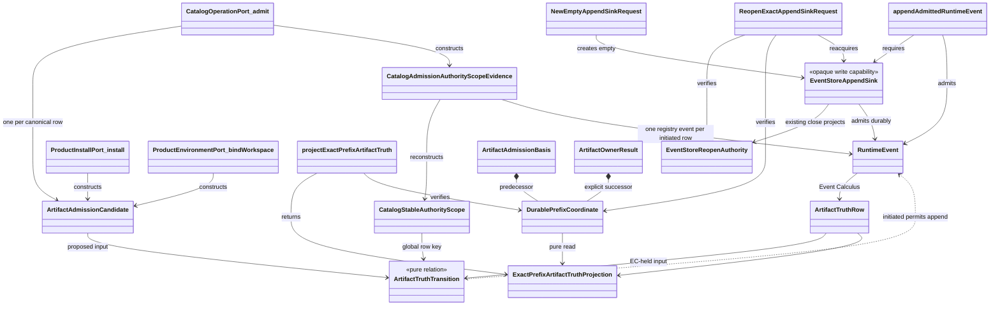

# M05 S06 Axiomatic Authority And Exact Public Construction Design

**Status:** proposed Gate 1 bounded-repair subject; not operative realization
authority until direct F_H accepts the exact reviewed commit and tree

**Scope:** ABG5-S06 corrective authority, exact 18-operation/56-key
construction map, and hard-break realization boundary

**Re-entry:** targeted `requirement_reprice` for deterministic catalog
application plus bounded `design_reframe`

**Owner:** T-281 under T-270

**Method:** STDO 2.2.2

## 1. Decision Boundary

This design consumes the accepted census without changing it:

- path:
  `.ai-workspace/comments/codex/20260731T113200Z_CENSUS_abiogenesis_5_0_s06_exact_56_key_construction.md`;
- Git blob: `efe88cac85bd3bb071d4b5dd451dfadaec893c4f`;
- SHA-256:
  `0c0339689c21154c46148f033c7472b9d55a0fd771fc34a1c41d41c52d28a0c6`.

The exact 56 census rows, their current loci, evidence hashes, deletion
effects, projection graph, PFC-F08 oracle, sentinel, and `AX-F01..F14` plus
`AX-PFC-F08` falsifier records are incorporated by row identity. This design
supplies the previously absent target source paths, runtime value bindings,
dependency closures, and singular authority relations. It does not implement
them.

After rejection of replacement `29aea26d` on its inapplicable AX-F09 Public
ingress, direct F_H authorized completion of Gate 1 inside the already
accepted Product and STDO 2.2.2. Owner-internal names, carriers, refusal codes,
module placement, and signatures are worker-owned HOW while they add no
Public operation, rival authority, controller, runtime, catalog, or Product
meaning. Section 7.3 and `D17..D18` exercise that bounded decision envelope;
they change no requirement or 18/56 member.

Product and Intent are unchanged. S03 and S05 Product and scenario outcomes
are unchanged. This design explicitly supersedes only the obsolete M03
CatalogView admission mechanism named in Section 3; it does not change the S03
narrowing or invocation meaning. S04, post-S06 Prime realization, complete M5
publication closure, M6, and M7 remain outside this subject. Donor adoption is
empty.

Cold constructability review of complete candidate `2a60c2b7`, tree
`fc19ebdf`, passed. Cold authority review found one local counterexample:
Section 7.3 selected one current retry attempt without preserving the complete
prior-attempt frontier required by `REQ-R-ABG3-PROJECTION-009..010`. This
bounded replacement adds the exact full-frontier relation and strengthens
AX-F09 to exercise two prior failures before restart. It consumes the one
repair permitted by the completion envelope and changes no Product,
requirement, Public-family, or authority structure.

## 2. Constitutional Construction

The one Public algebra is:

```text
admit common envelope
  -> select exact operation-and-definition-key contract
  -> call the selected concrete owner-local port value
  -> project the exact indexed owner outcome
```

The implementation is admissible only while all of these axioms hold:

1. `PUBLIC_FUNCTION_DEFINITION_FAMILY` is exactly 18 operations and 56 keys.
2. Every definition references the actual callable Product, ABG, Validator,
   or release owner port value. A string, interface, locator without a value,
   or Public handler is not a port.
3. Owner-local packet values are the sole source of request, result, refusal,
   non-terminal, authority, effect, and capability meaning.
4. Public performs only common admission, exact selection, direct port
   invocation, and structural outcome projection. It contains no semantic
   operation switch.
5. Product owns static PFC-F08 publication and Product meaning. ABG alone owns
   admitted runtime catalog events and runtime truth.
6. ABG-admitted events plus declared Event Calculus laws derive runtime truth.
   Replay and reads invoke those projectors; neither interprets raw events as
   a second authority.
7. Every runtime-relevant prefix is explicit. Equal immutable inputs and equal
   admitted prefixes have equal meaning after restart and interleaving.
8. SDK, CLI, Codex, schemas, catalog rows, manifests, and documentation derive
   from the same exact family.
9. The legacy family is the only reachable Public family before the atomic
   swap. The exact family is the only reachable family afterward.
10. Release owner ports are real and callable in S06, but without the later
    qualification and release basis they return the exact applicable closed
    `ReleaseSnapshotPacket` owner refusal and cannot publish success.

The first counterexample stops the increment. Tests, compatibility, donor
behavior, and implementation convenience cannot trade against an axiom.

## 3. Requirement Trace And Supersession

| Authority | Binding in this design |
|---|---|
| `REQ-P-PUBLIC-CONTRACTS-005`, `-008..010` | one exact indexed family and one invocation/outcome family |
| `REQ-P-POLICY-041..046`, `-049..064` | pure reads, thin adapters, complete Product operations, exact public path |
| corrected `REQ-P-CATALOG-008`, `-030` | deterministic eventless CatalogApplication; ABG-only runtime catalog admission |
| `REQ-R-ABG3-EVENTS-001..002`, `-018`, `-024..032` | append-only admitted events, scoped Event Calculus, durable ingress, no process truth |
| `REQ-R-ABG3-PROJECTION` and `REQ-R-ABG3-RUN` | replay/read projections consume the same Event Calculus result |
| `REQ-L-GTL3-C-ALGEBRA-013..018` | one admitted normalized Program, validation before effects, no rival plan |
| `REQ-L-GTL3-LAWS-021..022` | one code-unit canonical data identity independent of caller order |
| T-281 `CL-01..CL-11` | hard break, explicit carriers, all-port packaging, frozen reviews |

Accepted predecessor files remain immutable. If this subject is accepted, it
supersedes only these realization relations:

| Predecessor relation | Superseding relation |
|---|---|
| `M04_PUBLIC_OPERATION_DEFINITION_FAMILY_BEHAVIOR_DESIGN.md` store-local branded application exception | deterministic reconstructable Product application in Section 6 |
| `M03_M04_PUBLIC_CATALOG_INVOCATION_AUTHORITY_BEHAVIOR_DESIGN.md` application event and unkeyed artifact fluent | no application event; scoped artifact fluent only for genuinely effectful artifacts |
| `M03_DIRECT_GTL_TRAVERSAL_BEHAVIOR_DESIGN.md` `CatalogView` admitted-projection ontology, ABG-owned `narrowCatalogView`, view-admission event, catalog-view sequence admission, and ABI5-ROOT-001 R4 admission mapping | total deterministic eventless Product `CatalogOperationPort.constructView` over an ABG-admitted catalog projection plus exact allowlist; `run.invoke` revalidates the equal view against the explicit-prefix Event Calculus catalog and its invocation event records the view use |
| `M05_S05_CONSENSUS_GLOBAL_TO_LOCAL_DESIGN.md` one-shot store/context application lifecycle | equal carrier reconstruction and invocation-time revalidation |
| `M05_DIRECT_GTL_TRAVERSAL_EXPANSION_DESIGN.md` branded source-result and remembered context coordinates | ABG-backed rehydration from explicit prefix |
| `M05_S06_NATIVE_CONTRACT_CLOSURE_DESIGN.md` root-context-held verification/resolution/install relations | complete serializable carriers and explicit preimages |
| `M05_S06_PUBLIC_FUNCTION_AND_NATIVE_OCCURRENCE_CLOSURE_DESIGN.md` hybrid application ownership, Public read-contract ambiguity, implicit prefix, and older common refusal shape | Sections 4 through 9 of this design |

The accepted predecessor's exact 18/56 source map, PFC-F01..F08 staging,
closed PFC-F08 attempt/refusal relation, and PFC-F08A exact owner-coordinate
join are retained unchanged except where the table above explicitly says
otherwise.

## 4. Concrete Port Law

An owner packet and port are owner-local. No owner module imports `src/public`.
Each named `*Port` below is an exported frozen runtime value whose selected
member is a function. Type-only interfaces may describe it but cannot satisfy
the definition family.

Conceptually, each selected function has this shape:

```text
OwnerPortMember(
  exact owner-local request,
  exact owner-local authority carrier,
  prebound installed owner dependencies
)
  -> exact owner result
   | exact owner refusal
   | exact owner non-terminal
```

The installed composition root binds dependencies once. Public neither builds
an owner context nor selects an owner dependency. The exact definition stores
the already bound function value. Indexed admission extracts only the exact
owner-local request and authority carrier named by the owner packet.

Each definition is one frozen runtime value containing both its canonical
serializable intrinsic fields and `ownerPort`, the actual bound function. Its
`definitionDigest` hashes only the declared intrinsic preimage, including the
exact owner-port coordinate; host function identity is never serialized or
hashed. Family construction resolves that coordinate once, proves that the
resolved export is the same callable stored in `ownerPort`, and then freezes
the definition. PFC-F07 projects only the intrinsic fields. This is one family
with one installed binding, not a serializable catalog plus a second dispatch
registry.

The common Public path is implemented in new structural modules:

| Target source | Sole responsibility |
|---|---|
| `src/public/envelope.ts` | raw/native common-envelope admission and the closed common refusal carrier |
| `src/public/definition_family.ts` | PFC-F01/F02 exact structural join over actual owner contract and port values |
| `src/public/invocation_admission.ts` | exact definition selection and indexed contract admission |
| `src/public/invoke.ts` | call `selection.definition.ownerPort` exactly once; no operation switch |
| `src/public/outcome_projection.ts` | structural tagged projection of the indexed owner outcome |
| `src/public/project_read_contracts.ts` | derived total join over owner-local read contract and port values; authors no field or schema |
| `src/public/schema_projection.ts` | later PFC-F07 schema projection from the closed family |
| `src/public/sdk.ts` | later typed SDK projection from the closed family |
| `src/public/index.ts` | package export of the selected family and projections only |

`src/public/operations.ts`, `src/public/contracts.ts`, and
`src/public/schema.ts` are legacy files, not destinations for semantic reuse.
They are deleted in the atomic swap defined by Section 10.

## 5. Explicit Carriers And Durable Ingress

### 5.0 W1.1a ontology and authority split

W1.1a introduces no episode, controller, router, generation, or semantic
owner. It closes one artifact-truth relation by separating durable read
authority from narrow write capability while retaining the existing concrete
Product, ABG, and HoG owner ports.

| Entity | Kind | Owner | Identity/content | Authority and lifecycle |
|---|---|---|---|---|
| `DurablePrefixCoordinate` | durable truth coordinate | ABG Event Store projects; Event Calculus verifies | event-log ref, byte length/digest, device/inode, event-contract digest | names one immutable prefix; independently serializable and fresh-process readable; append returns another coordinate |
| `EventStoreReopenAuthority` | durable write-reacquisition evidence | ABG Event Store | existing canonical path, device/inode, byte length/digest, contract digest, authority digest | projected by existing close behavior; permits exact append-sink reacquisition but is not required for read projection |
| `EventStoreAppendSink` | opaque non-durable write capability | ABG Event Store | held descriptor, exact file identity, exclusive append lock | guards envelope/order/durability effects only; never supplies semantic truth or read authority; released by existing close behavior |
| `NewEmptyAppendSinkRequest` | closed acquisition input | concrete installed setup owner | canonical absent event-log path | exclusively creates one empty durable sink and zero prefix; cannot reopen |
| `ReopenExactAppendSinkRequest` | closed acquisition input | concrete effectful owner/caller | `EventStoreReopenAuthority` plus equal `DurablePrefixCoordinate` | reacquires append capability for exactly that prefix; cannot create or select a later tail |
| `ProductInstallPort.install` | existing concrete callable owner | Product install | exact install request/result contract | directly constructs and admits install artifact candidate; no dispatcher |
| `ProductEnvironmentPort.bindWorkspace` | existing concrete callable owner | Product environment | exact workspace-binding request/result contract | directly constructs and admits binding artifact candidate; no dispatcher |
| `CatalogOperationPort.admit` | existing concrete callable owner | Product catalog | exact catalog-admission request/result contract | directly constructs and admits canonical catalog-row candidates; no dispatcher |
| `projectExactPrefixArtifactTruth` | pure Event Calculus callable | ABG Event Calculus projector | explicit coordinate to immutable projection/refusal | sole artifact read/projection relation; eventless and owner-free |
| `appendAdmittedRuntimeEvent` | narrow effect callable | ABG Event Store | append sink, expected predecessor, initiated event | compares coordinate and admits one event; owns no semantic decision |
| `ArtifactAdmissionCandidate` | proposed semantic value | `ProductInstallPort.install`, `ProductEnvironmentPort.bindWorkspace`, or `CatalogOperationPort.admit` | operation, definition, stable scope, artifact, digest, and causation fields | exists before runtime admission; not runtime truth |
| `ArtifactTruthTransition` | pure store-free relation | shared definition | Event-Calculus-held rows plus proposed/admitted candidate | `ProductInstallPort.install`, `ProductEnvironmentPort.bindWorkspace`, or authorized `CatalogOperationPort.admit` invokes proposed branch; Event Calculus invokes admitted branch; has no effect capability |
| `RuntimeEvent` | admitted durable fact | ABG event admission | existing canonical envelope and payload | only an `initiated` decision reaches Event Store; immutable after append |
| `ArtifactTruthRow` | held fluent | Event Calculus | admitted candidate plus event ref and ordinal | derived only from admitted durable events; never read from sink memory |
| `ExactPrefixArtifactTruthProjection` | immutable read carrier | Event Calculus projector | verified coordinate, ordered held rows, projection ref/digest | pure eventless reconstruction from exact durable bytes; no append sink or reopen authority |
| `ArtifactAdmissionBasis` | owner request component | each of `ProductInstallPort.install`, `ProductEnvironmentPort.bindWorkspace`, and `CatalogOperationPort.admit` supplies; ABG verifies | exact predecessor `DurablePrefixCoordinate` | binds one proposed admission to the durable prefix evaluated by Event Calculus |
| `ArtifactOwnerResult` | owner result extension | those same three named boundaries | admitted/idempotent/semantic-refusal result with explicit successor, or coordinate refusal with no claimed successor | admitted returns appended successor; idempotent/semantic refusal returns verified predecessor unchanged; stale/unverified coordinate returns no successor |
| `CatalogStableAuthorityScope` | canonical catalog-row collision identity | Product contribution law plus stable workspace authority | `workspaceId + kind + handle`, where kind is the existing contribution kind | same locus equal content is idempotent; unequal required content conflicts; distinct locus coexists |
| `CatalogAdmissionAuthorityScopeEvidence` | closed per-row candidate/event evidence | `CatalogOperationPort.admit` constructs; one `registry_entry_admitted` event carries each initiated row | canonical row scope ref/digest plus exact Product/binding/lock/publication/row comparison content | complete candidate set is preflighted; each successfully appended row becomes truth individually |

Authority is singular:

```text
read:
  DurablePrefixCoordinate
    -> verify exact durable bytes
    -> Event Calculus over admitted RuntimeEvents
    -> ExactPrefixArtifactTruthProjection

write:
  ProductInstallPort.install
    | ProductEnvironmentPort.bindWorkspace
    | CatalogOperationPort.admit
    constructs ArtifactAdmissionCandidate
    + predecessor DurablePrefixCoordinate
    + already-held EventStoreAppendSink
    -> pure ArtifactTruthTransition over Event Calculus projection
    -> initiated only -> Event Store compare-and-append
    -> successor DurablePrefixCoordinate
    -> Event Calculus projects admitted-event successor
```

`EventStoreAppendSink` is not a runtime-truth carrier. Its process-local state
may retain only descriptor, lock, byte-count, and next-envelope mechanics
needed to guard an append. `readAll`, a cached event array, a retained context,
or sink identity cannot answer an artifact, catalog, run, continuation, retry,
or closure question.

#### 5.0.1 Lifecycle completeness matrix

| Entity | Declare/create | Acquire or reconstruct | Use/transition | Refusal | Handoff/fresh process | Close/retire |
|---|---|---|---|---|---|---|
| `DurablePrefixCoordinate` | zero coordinate from exclusive new-empty creation; successor from append | read requires only coordinate; write reacquisition verifies coordinate against reopen authority | immutable predecessor; append returns distinct successor; no in-place currentness | mismatch refuses before append/read result | serializable coordinate alone crosses to fresh-process reads; pairs with reopen authority only for later writes | never deleted by W1.1a; later coordinates supersede only current caller position |
| `EventStoreReopenAuthority` | existing `projectReopenAuthorityAndClose` derives it from verified held sink | existing `reopenEventStore` consumes it only for writes | no semantic transition | mismatch refuses sink acquisition | serializable write handoff | retired as current write basis when a later sink closes with successor authority |
| `EventStoreAppendSink` | `createNewEmptyAppendSink` or existing exact reopen acquires it | exclusive descriptor/lock only | compare current durable coordinate, append admitted event, return successor | stale predecessor refuses without append | never serialized or used for read | existing close projects authority and releases; no retry/recovery protocol added |
| `NewEmptyAppendSinkRequest` | concrete setup caller constructs | new-only acquisition | exhausted on result | existing/alias/noncanonical target refuses | never used to recover history | request discarded |
| `ReopenExactAppendSinkRequest` | concrete effect caller constructs | existing-prefix-only acquisition | exhausted on result | authority/coordinate/file mismatch refuses | canonical fresh-process write reacquisition | request discarded |
| `ProductInstallPort.install` | accepted Product family declares | existing direct call | project, construct install candidate, decide, optionally append | typed Product/coordinate refusal | caller may reuse durable result in fresh process | call returns; no retained controller state |
| `ProductEnvironmentPort.bindWorkspace` | accepted Product family declares | existing direct call | project, construct binding candidate, decide, optionally append | typed Product/coordinate refusal | caller may reuse durable result in fresh process | call returns; no retained controller state |
| `CatalogOperationPort.admit` | accepted Product family declares | existing direct call | project, construct row candidates, decide all, admit row events | semantic conflict refuses before append; existing ABG append-failure law governs and cannot return whole-catalog success beyond the durable prefix | later ordinary invocation reconstructs equal held rows under REQ-P-CATALOG-017 | call returns; no retained controller/retry state |
| `projectExactPrefixArtifactTruth` | Section 5.4 declares | no effect acquisition | verify bytes and apply EC | typed coordinate/history refusal | equal prefix reconstructs equal result | closes read descriptor on return |
| `appendAdmittedRuntimeEvent` | existing Event Store admission seam narrows | requires held append sink | compare, stamp, append, project successor | stale/unverifiable predecessor refuses without successor | successor coordinate is durable | sink remains under existing context until existing close |
| `ArtifactAdmissionCandidate` | selected named port constructs | no acquisition | pure transition consumes value | invalid/conflict returns typed owner refusal | may be reconstructed from caller inputs, but is not a handoff | discarded after decision |
| `ArtifactTruthTransition` | one declared pure function | none | proposed branch decides; admitted branch advances EC held state | total typed refusal/invalid-history result | equal inputs produce equal result in fresh process | stateless |
| `RuntimeEvent` | Event Store admits initiated candidate only | Event Calculus reads durable bytes | immutable input to EC successor | append failure creates no event | coordinate-preserved bytes reconstruct identically | history retained |
| `ArtifactTruthRow` | EC creates from admitted event | EC reconstructs from exact prefix | equal candidate idempotent; unequal same-scope candidate conflicts | invalid duplicate history refuses projection | canonical equality from equal bytes | projection discard only; history retained |
| `ExactPrefixArtifactTruthProjection` | pure projector declares closed carrier | direct coordinate read, no sink acquisition | read-only consumer input | typed exact-prefix/history refusal | fresh process reproduces canonical equal carrier | discardable read model |
| `ArtifactAdmissionBasis` | selected named port binds predecessor | no separate acquisition | verified before transition and immediately before initiated append | stale/mismatch refuses | durable value may cross process with owning request | exhausted by that named port call |
| `ArtifactOwnerResult` | selected named port returns it | none | caller threads explicit successor to the next named port only when non-null | idempotent/semantic refusal returns unchanged verified predecessor; prefix or stale-preappend refusal returns no successor | non-null successor may be serialized for read or paired with close authority for later write | result discarded after threading or refusal stops the write chain |
| `CatalogStableAuthorityScope` | contribution row declares handle/kind under workspace | EC reconstructs from its admitted `registry_entry_admitted` event | exact equal row idempotent; initiated distinct row coexists | unequal same workspace/kind/handle refuses before append | durable row-event evidence reconstructs in fresh process | immutable initial-admission locus; no supersession transition |
| `CatalogAdmissionAuthorityScopeEvidence` | catalog port constructs from verified carriers | no effect acquisition | sorted row preflight; each initiated row enters its own registry event | malformed/duplicate/unequal evidence refuses before append; append failure leaves prior durable rows truthful | each registry event reconstructs one equal held row | candidate discarded; individually admitted evidence retained in history |

#### 5.0.2 Domain view



#### 5.0.3 Sequence views

```mermaid
sequenceDiagram
  participant Install as ProductInstallPort.install
  participant Bind as ProductEnvironmentPort.bindWorkspace
  participant EC as Event Calculus Projector
  participant Law as ArtifactTruthTransition
  participant Store as appendAdmittedRuntimeEvent

  Note over Install,Bind: exactly one concrete port follows the relation; no generic dispatcher exists
  alt ProductInstallPort.install
    Install->>EC: projectExactPrefixArtifactTruth(predecessor)
    EC-->>Install: held projection or typed refusal
    Install->>Law: evaluate(held rows, install candidate)
  else ProductEnvironmentPort.bindWorkspace
    Bind->>EC: projectExactPrefixArtifactTruth(predecessor)
    EC-->>Bind: held projection or typed refusal
    Bind->>Law: evaluate(held rows, binding candidate)
  end
  alt initiated
    Law-->>Store: initiated event, sink, expected predecessor
    Store->>Store: compare exact durable coordinate immediately before append
    alt stale or unverifiable predecessor
      alt install selected
        Store-->>Install: coordinate refusal; no successor
      else binding selected
        Store-->>Bind: coordinate refusal; no successor
      end
    else exact predecessor
      Store->>EC: admitted event plus successor coordinate
      alt install selected
        EC-->>Install: admitted-event successor projection and coordinate
      else binding selected
        EC-->>Bind: admitted-event successor projection and coordinate
      end
    end
  else idempotent
    alt install selected
      Law-->>Install: held row plus unchanged predecessor
    else binding selected
      Law-->>Bind: held row plus unchanged predecessor
    end
    Note over Install,Store: no append
  else refused
    alt install selected
      Law-->>Install: typed conflict plus unchanged predecessor
    else binding selected
      Law-->>Bind: typed conflict plus unchanged predecessor
    end
    Note over Install,Store: no append
  end
```

```mermaid
sequenceDiagram
  participant Catalog as CatalogOperationPort.admit
  participant EC as Event Calculus Projector
  participant Law as ArtifactTruthTransition
  participant Store as appendAdmittedRuntimeEvent

  Catalog->>EC: project exact predecessor
  EC-->>Catalog: held registry-row truth or typed refusal
  Catalog->>Catalog: construct and sort complete row evidence
  Catalog->>Law: preflight every row before any append
  alt any conflict or invalid history
    Law-->>Catalog: typed refusal; unchanged predecessor; no append
  else rows preflighted
    loop each row selected for admission
      Catalog->>Store: registry_entry_admitted(row evidence, current predecessor)
      alt append succeeds
        Store->>EC: durable row event plus successor
        EC-->>Catalog: one newly held row; advance exact predecessor
      else append fails
        Store-->>Catalog: typed append refusal
        Catalog-->>Catalog: existing append-failure disposition; no whole-catalog success
      end
    end
    Catalog->>EC: verify complete candidate row set is held
    EC-->>Catalog: derived AdmittedCatalog with row event refs
  end
```

```mermaid
sequenceDiagram
  participant Prefix as DurablePrefixCoordinate
  participant EC as Event Calculus Projector

  Note over EC: exact consumers are the 18-reader census in Section 5.4
  EC->>Prefix: read and verify exact durable bytes
  Prefix-->>EC: admitted RuntimeEvents or typed prefix refusal
  EC-->>EC: immutable projection or typed history refusal
  Note over Prefix,EC: eventless; no append sink, lock, reopen authority, or process cache
```

#### 5.0.4 State view

```mermaid
stateDiagram-v2
  [*] --> PrefixAvailable : new-empty zero prefix or durable coordinate received
  PrefixAvailable --> PureProjection : read exact durable bytes
  PureProjection --> PrefixAvailable : projection or typed refusal; no event
  PrefixAvailable --> SinkAcquired : new-empty or exact reopen for write
  SinkAcquired --> Deciding : install or bind port applies pure transition
  SinkAcquired --> CatalogRowPreflight : catalog port sorts and evaluates every canonical row
  Deciding --> PrefixUnchanged : idempotent or refused
  Deciding --> PreappendCheck : initiated only
  CatalogRowPreflight --> PrefixUnchanged : all idempotent; no append
  CatalogRowPreflight --> CatalogConflictRefused : unequal same workspace kind handle
  CatalogConflictRefused --> PrefixUnchanged : typed refusal; no append
  CatalogRowPreflight --> CatalogAppending : rows selected after all rows pass
  CatalogAppending --> CatalogAppending : one row admitted; advance exact prefix
  CatalogAppending --> CatalogComplete : all candidate rows held
  CatalogAppending --> CatalogAppendStopped : row append fails; no whole-catalog success
  CatalogAppendStopped --> WriteHandoff : existing ABG failure law; actual durable prefix governs
  CatalogComplete --> SuccessorAvailable : derive catalog from complete held row set
  PreappendCheck --> WriteRefusedNoSuccessor : stale coordinate refusal; no append
  PreappendCheck --> SuccessorAvailable : admitted append returns successor
  PrefixUnchanged --> SinkAcquired : caller threads unchanged predecessor
  SuccessorAvailable --> SinkAcquired : caller threads successor
  SinkAcquired --> WriteHandoff : existing close projects reopen authority and releases
  WriteHandoff --> SinkAcquired : existing exact reopen for later write
  WriteHandoff --> PureProjection : coordinate-only fresh-process read
  WriteRefusedNoSuccessor --> WriteHandoff : close held sink; caller may not select a later coordinate
```

The state machine contains no episode currentness, object-consumption state,
semantic dispatch, poison state, retry-close state, recovery protocol, lease,
or batch. Concrete Product, ABG, and HoG owner ports remain direct call sites.

### 5.1 Verification and resolution

`ProductVerificationPort.verify` is deterministic and eventless. It returns a
complete canonical `VerifiedProductCarrier` containing the selected target
member, all verified Product/descriptor/contribution/artifact identities and
digests, native-contract evidence, pending external selectors where lawful,
disposition, issues, and provenance. Canonical serialization and JSON
round-trip preserve its ref, digest, and value.

`ProductEnvironmentPort.resolve` accepts the complete verified carrier for
every candidate Product plus the exact declared dependency and compatibility
inputs. It re-reads or revalidates the identified Product bytes and returns a
complete canonical `ResolvedProductLock`. It never accepts a prior invocation
reference as a substitute and never looks up a verification result in memory.

These carriers prove internal content and deterministic evaluation, not ABG
runtime admission. Later effectful owners revalidate the complete carrier and
admit their own artifact/runtime truth where required.

### 5.2 Durable prefix

Every effectful owner request carries one closed `DurablePrefixCoordinate`:

```text
{
  eventLogRef,
  prefixLength,
  prefixDigest,
  storeIdentity
}
```

ABG verifies all four fields before use. The coordinate identifies an exact
append-only prefix; a retained context, latest log, environment variable,
module singleton, or remembered reopen authority cannot supply it. An owner
may append only through the store selected by that verified coordinate and
returns the successor coordinate explicitly.

#### 5.2.1 Disjoint Event Store write acquisition and bypass deletion

W1.1a retains the existing Event Store write lifecycle and hardens only its
acquisition boundary. These are two disjoint ABG-internal functions, not a new
semantic port or lifecycle family:

    createNewEmptyAppendSink(
      request: NewEmptyAppendSinkRequest
    ) -> {
      sink: EventStoreAppendSink,
      prefix: DurablePrefixCoordinate
    } | EventStoreAcquisitionRefusal

    reopenExactAppendSink(
      request: ReopenExactAppendSinkRequest
    ) -> {
      sink: EventStoreAppendSink,
      prefix: DurablePrefixCoordinate
    } | EventStoreAcquisitionRefusal

    NewEmptyAppendSinkRequest = {
      kind: "new_empty_append_sink_request",
      schemaVersion: "5.0.0",
      eventLogPath: string
    }

    ReopenExactAppendSinkRequest = {
      kind: "reopen_exact_append_sink_request",
      schemaVersion: "5.0.0",
      reopenAuthority: EventStoreReopenAuthority,
      prefix: DurablePrefixCoordinate
    }

createNewEmptyAppendSink is used only by the existing installed setup owner
before its first effectful operation. It performs the already specified
exclusive, canonical, alias-safe creation checks and returns the existing
opaque Event Store append sink plus the zero prefix. It cannot accept a reopen
authority or existing target.

reopenExactAppendSink is the hardened form of existing reopenEventStore. It
independently validates the closed reopen authority and coordinate, requires
equality of path, device, inode, byte length, byte digest, and event-contract
digest, acquires the existing descriptor and exclusive append lock, verifies
exactly those durable bytes, and returns the sink plus the equal supplied
prefix. It cannot create, truncate, select a later prefix, or fall back to
new-empty creation.

The existing AbgEventStore.projectReopenAuthorityAndClose behavior remains the
write handoff: it verifies the held sink, projects the authority for its
current explicit coordinate, releases the descriptor/lock, and returns no
semantic result. W1.1a adds no close result algebra, poison state, retry-close,
recovery, lease, batch, or ambiguous-owner protocol. Existing close failure
remains an exception at the effect boundary and cannot produce a handoff.

The append surface is narrowed to:

    appendAdmittedRuntimeEvent(
      sink: EventStoreAppendSink,
      expectedPredecessor: DurablePrefixCoordinate,
      initiatedEvent: RuntimeEventCandidate
    ) -> {
      event: RuntimeEvent,
      successorPrefix: DurablePrefixCoordinate
    } | EventStoreAppendRefusal

Immediately before append, Event Store verifies that the held descriptor,
device/inode, durable byte length/digest, and event-contract digest equal
expectedPredecessor. A mismatch returns the existing typed prefix refusal and
appends nothing. Event Store then owns only envelope validation, admission
ordinal stamping, durable append, and successor-coordinate projection. It does
not import ArtifactTruthTransition, select an artifact disposition, query
catalog/run truth, or expose its cached events as read authority.

Each request to `ProductInstallPort.install`,
`ProductEnvironmentPort.bindWorkspace`, or
`CatalogOperationPort.admit` carries:

    {
      ...existingOwnerRequest,
      artifactAdmissionBasis: {
        predecessorPrefix: DurablePrefixCoordinate
      },
      appendSink: EventStoreAppendSink
    }

The sink is already held by that operation's existing root context. The request
does not transfer semantic ownership to Event Store. The selected named port
remains directly invoked, constructs its candidate, calls the pure projector
and transition, and calls appendAdmittedRuntimeEvent only for initiated.
`ProductInstallPort.install`, `ProductEnvironmentPort.bindWorkspace`, and
`CatalogOperationPort.admit` remain three different callables. Response,
continuation, retry, the Section 5.4 read consumers, and HoG retain their exact
existing direct ports. No generic dispatch method or cross-owner router is
added.

The hard break in the same realization cut:

- makes bare new AbgEventStore() and configureDurableLog unreachable outside
  src/abg/event_store.ts;
- replaces event_log.persistEventLog create/configure behavior with
  verification of an already-held sink only;
- deletes the zero-argument createRootOperationContext path;
- removes applyRunInvoke late durable-log configuration;
- removes context store replacement and new-empty fallback from continuation,
  response, retry, gap, and run-projection paths;
- removes readAll, readScope, mutable store, retained context, and reopened
  store as inputs to replay, Event Calculus, or Public/Product read decisions;
  and
- leaves no raw-path, absent-sink, default-log, environment, working-directory,
  test-only, or compatibility acquisition path.

The existing operation context may retain EventStoreAppendSink only while it
owns effects. It also threads the explicit current coordinate returned by each
named port result. That coordinate is caller-visible durable truth; context
or sink-local current state is not. A later concrete write supplies the
previous result's coordinate, and a stale coordinate fails at the Event Store
comparison immediately before append.

Read owners never call either acquisition function. They call
projectExactPrefixArtifactTruth(prefix) directly. That projector opens the file
read-only, reads no bytes beyond prefixLength, verifies file identity, prefix
digest, and event-contract digest, closes its read descriptor, and applies
Event Calculus to the admitted events. It acquires no append lock, retains no
process object, emits no event, and works from the same coordinate in a fresh
process.


Parsing a continuation, run projection, application, or source-result carrier
yields an unverified candidate. Only its owner can rehydrate an admitted basis
by joining it to the exact durable prefix and Event Calculus result. Public
constructors cannot mint admission or provenance.

### 5.3 Setup artifacts

Workspace creation/opening, installation, binding, catalog admission, and
materialization produce complete immutable artifacts. When an artifact will be
used as runtime prerequisite and has no more specific owning runtime event,
the owner admits exactly one `public_operation_artifact_admitted` event before
returning success. The event's fluent key is:

```text
(
  operationId,
  definitionKey,
  definitionDigest,
  authorityScopeRef,
  authorityScopeDigest
)
```

Different keys/scopes coexist. Reuse of the same scope reference with a
different scope digest, definition digest, artifact reference, or artifact
digest refuses before append. No Public layer emits this event.

Catalog admission has the more-specific existing `registry_entry_admitted`
owning event. Section 5.5 therefore prohibits the generic artifact boundary
for catalog rows and exact-contract-rewrites each admitted registry row to
carry its own closed workspace/kind/handle authority evidence. No aggregate
catalog event owns row truth.

### 5.4 CP-F01 exact-prefix artifact truth and threading

ABG owns one closed immutable projection:

```text
ExactPrefixArtifactTruthProjection = {
  kind: "exact_prefix_artifact_truth_projection",
  schemaVersion: "5.0.0",
  prefix: DurablePrefixCoordinate,
  prefixEventCount,
  lastAdmissionOrdinal,
  rows: readonly ArtifactTruthRow[],
  projectionRef,
  projectionDigest
}

ArtifactTruthRow = {
  operationId,
  definitionKey,
  definitionDigest,
  authorityScopeRef,
  authorityScopeDigest,
  artifactRef,
  artifactDigest,
  admissionEventRef,
  admissionOrdinal,
  causationEventRefs
}

ExactPrefixArtifactTruthProjectionRefusal = {
  kind: "exact_prefix_artifact_truth_projection_refusal",
  schemaVersion: "5.0.0",
  disposition: "refused",
  code:
    | "file_identity_mismatch"
    | "prefix_length_mismatch"
    | "prefix_digest_mismatch"
    | "event_contract_digest_mismatch"
    | "event_envelope_invalid"
    | "admission_ordinal_invalid"
    | "artifact_truth_history_conflict"
    | "duplicate_artifact_admission",
  prefix: DurablePrefixCoordinate,
  eventRefs: readonly string[],
  authorityScopeRef: string | null,
  conflictingFields: readonly ArtifactTruthConflictField[]
}
```

`rows` are code-unit sorted by `authorityScopeRef`. `projectionDigest` is the
canonical digest of every preceding projection field except `projectionRef`;
`projectionRef` is
`artifact-truth-projection://abiogenesis/<projectionDigest>`.
Refusal event refs are unique and code-unit sorted. Scope and conflicting
fields are populated only for an artifact-history conflict.

The existing `EventStoreReopenAuthority` maps to the prefix without a second
durable coordinate:

```text
eventLogRef                        = eventLogPath
prefixLength                      = durableByteLength
prefixDigest                      = eventLogDigest
storeIdentity.device              = device
storeIdentity.inode               = inode
storeIdentity.eventContractDigest = eventContractDigest
```

The total ABG projector is:

```text
projectExactPrefixArtifactTruth(prefix: DurablePrefixCoordinate)
  -> ExactPrefixArtifactTruthProjection
   | ExactPrefixArtifactTruthProjectionRefusal
```

It opens the named durable file read-only, verifies exactly the bytes named by
the coordinate, closes the descriptor, and applies Section 5.6 to admitted
artifact events in admission-ordinal order. It does not acquire an append
lock, call `reopenEventStore`, retain a process object, emit an event, or throw
for a declared refusal. A mutable store, `readAll()` result, current global
tail, event array, retained context, or remembered reopen object is not the
projection.

`ArtifactAdmissionBasis` adds exactly one field:

```text
predecessorPrefix: DurablePrefixCoordinate
```

The three current artifact-owner requests—`ProductInstallPort.install`,
`ProductEnvironmentPort.bindWorkspace`, and `CatalogOperationPort.admit`—carry
that basis plus the already-held `EventStoreAppendSink` unchanged to ABG. Each
named port remains directly invoked. It projects the exact predecessor and
applies the same Section 5.6 transition to the proposed artifact. Install and
binding use the existing single-event `public_operation_artifact_admitted`
append path:

```text
initiated  -> append the existing artifact event once
idempotent -> return the held admissionEventRef; append no artifact event
refused    -> return ArtifactTruthConflictRefusal; append no artifact event
```

Catalog instead uses the row-owning event relation in Section 5.5; it never
enters this generic artifact-event path.

Prefix-projection refusal propagates through the coordinate-refusal branch
with no claimed successor and permits no append. Immediately before an
initiated append, Event Store must verify that the supplied append sink's
durable coordinate still equals `predecessorPrefix`; mismatch uses the
existing prefix refusal and appends nothing. This is a precondition
on the existing synchronous single-event append, not a new lease, transaction,
batch, recovery, or durability protocol. The selected durable store already
holds its existing exclusive append ownership from open/reopen through this
synchronous projection-transition-append sequence; CP-F01 adds no second
ownership mechanism. Event Store never calls the transition and never decides
initiated, idempotent, or refused.

The install and binding result threading is:

```text
ArtifactOwnerResult<Value, Refusal> =
  | {
      kind: "artifact_owner_result",
      schemaVersion: "5.0.0",
      disposition: "admitted",
      value: Value,
      admissionEventRef,
      successorPrefix: DurablePrefixCoordinate,
      artifactTruth: ExactPrefixArtifactTruthProjection
    }
  | {
      kind: "artifact_owner_result",
      schemaVersion: "5.0.0",
      disposition: "idempotent",
      value: Value,
      admissionEventRef,
      successorPrefix: DurablePrefixCoordinate,
      artifactTruth: ExactPrefixArtifactTruthProjection
    }
  | {
      kind: "artifact_owner_refusal",
      schemaVersion: "5.0.0",
      disposition: "refused",
      successorPrefix: DurablePrefixCoordinate,
      refusal:
        | Refusal
        | ArtifactTruthConflictRefusal
    }
  | {
      kind: "artifact_owner_coordinate_refusal",
      schemaVersion: "5.0.0",
      disposition: "refused",
      successorPrefix: null,
      suppliedPredecessor: DurablePrefixCoordinate,
      refusal:
        | ExactPrefixArtifactTruthProjectionRefusal
        | EventStoreAppendRefusal
    }
```

On initiated admission, `successorPrefix` is the existing owner operation's
final durable prefix and `artifactTruth` is projected from it before return.
On idempotence, the predecessor is unchanged, becomes the successor, and its
existing held projection is returned; it is not a newly admitted successor
projection. On semantic transition refusal, projection already verified the
predecessor and the result returns that unchanged coordinate with no new
projection or event. On exact-prefix or stale-preappend refusal, the owner
cannot assert current durable coordinates and returns `successorPrefix: null`;
the caller stops the write chain and cannot select the store's later tail.
The domain
`value` remains the owner's existing value constructed under its current
contract; this wrapper does not alter its content identity. The catalog
instantiation does not carry the singular aggregate `admissionEventRef` shown
above. Its admitted/idempotent value is the existing `AdmittedCatalog`, exact-
contract-rewritten as Section 5.5 requires so its row dispositions carry the
owning registry event refs. No other producer or result contract changes.

For catalog idempotence, the preserved catalog admission relation selects the
exact held `registry_entry_admitted` event for each candidate row. Once the
complete candidate kind/handle/row-digest set is held, Event Calculus derives
the equal `AdmittedCatalog` from those rows. The aggregate carrier has no
singular aggregate `admissionEventRef`; each `CatalogRowDisposition` retains
its exact row `admissionEventRef`. The owner returns that derived catalog with
unchanged predecessor/successor and no append. Duplicate, unequal, extra, or
non-admitted preserved rows return exactly:

```text
CatalogIdempotenceHistoryRefusal = {
  kind: "catalog_idempotence_history_refusal",
  schemaVersion: "5.0.0",
  disposition: "refused",
  code: "catalog_idempotence_history_mismatch",
  issues: readonly {
    kind: "graph_function" | "node_type" | "overlay",
    handle,
    code:
      | "registry_row_duplicate"
      | "registry_row_extra"
      | "registry_row_digest_mismatch"
      | "registry_row_not_admitted",
    eventRefs: readonly string[]
  }[]
}
```

Issues are non-empty, unique by kind/handle/code, and code-unit sorted by kind,
handle, then code; event refs are
unique and code-unit sorted. This refusal is included only in the
`CatalogOperationPort.admit` instantiation's `Refusal` parameter. It does not
reinterpret `candidate_not_constructed`, `candidate_digest_mismatch`, or
`scope_mismatch`. This is an idempotence lookup within the current catalog
admission relation; it does not define a new runtime catalog projection,
sequence, event, or durability mechanism. An absent equal row is not this
history refusal: Section 5.5 treats it as a missing row that an ordinary later
invocation may admit.

`hasAdmittedProductInstall` becomes exactly:

```text
hasAdmittedProductInstall(
  projection: ExactPrefixArtifactTruthProjection,
  install: ProductInstall
) -> boolean
```

It has no store overload or fallback. Its 18 callers receive the projection as
follows:

| Caller class | Ownership/threading disposition |
|---|---|
| `abg/catalog_admission.ts` | receives it beside the install from the artifact-owner result |
| `abg/continuation.ts` | projects the continuation's explicit durable prefix |
| `hog/leaf_invocation_port.ts` constructor and `invoke` | receives the immutable projection through install-bound HoG authority |
| eight `public/operations.ts` callers | the owning Product operation projects its explicit prefix; Public only passes the carrier |
| `test_env/falsifiers/contract-lanes.mjs` | installed-owner setup supplies it |
| two `runtime-f06-worker.mjs` callers | the fresh worker projects its persisted prefix |
| `runtime-f08.mjs` | the installed runtime basis supplies it |
| `runtime-f09-worker.mjs` | retry rehydration projects its verified retry prefix |
| `test_env/support/root-installed-environment.mjs` | setup exposes the ABG projection |

Those rows account for all 18 callers. Projection refusal follows each
caller's existing typed owner-refusal path; no caller answers admission without
a successful projection.

### 5.5 CP-F02 canonical catalog-row authority scope

Accepted Product authority already selects the stable collision locus.
REQ-P-INSTALL-008 and REQ-P-INSTALL-049 supply the stable workspace identity.
REQ-P-CATALOG-005 supplies canonical contribution handle and kind.
REQ-P-CATALOG-016 and REQ-P-CATALOG-017 define conflict and exact
idempotence for that canonical row identity.

The live carrier equation is exact:

- WorkspaceBinding.workspaceId is the stable workspace identity
  (product/environment.ts:88-101,113-130).
- CatalogContribution and ProductContributionManifestRow carry handle, kind,
  declarationOrContractRef, and owningProductId
  (gtl/contracts.ts:458-466; product/contracts.ts:20-31).
- CatalogRowCandidate carries those fields plus moduleRef, membership,
  readiness, compatibility, provenance, and rowDigest
  (product/catalog.ts:27-45).
- constructCatalogAdmissionCandidate proves the publication against the bound
  lock and manifest, matches declared rows by handle, and constructs rowDigest
  over the complete row body (product/catalog.ts:285-360,418-449).
- publication validation rejects duplicate contribution handles and validates
  kind-specific declaration/contract membership
  (validator/validation.ts:430-520).
- current catalog admission incorrectly compares the artifact basis to the
  aggregate workspaceBindingId/workspaceBindingDigest and admits a generic
  catalog artifact boundary (abg/catalog_admission.ts:188-210); CP-F02 deletes
  that aggregate event from catalog admission.
- existing registry_entry_admitted events already carry handle and rowDigest
  for every admitted row (abg/catalog_admission.ts:213-244); they become the
  direct owners of catalog-row artifact truth.

The stable preimage is therefore exactly:

    CatalogContributionAuthorityScopeRefPreimage = {
      workspaceId,
      kind,
      handle
    }

where kind and handle are exactly CatalogRowCandidate.kind and
CatalogRowCandidate.handle. No carrier discriminator or schema version enters
the canonical catalog identity. authorityScopeRef is the canonical
digest-derived reference of that preimage. Kind is part of the identity because
REQ-P-CATALOG-005 names both handle and contribution kind, and the public
catalog law distinguishes graph_function, node_type, and overlay. A different
workspaceId, kind, or handle is a distinct lawful row, not
supersession.

The exact comparison preimage is:

    CatalogContributionAuthorityScopeDigestPreimage = {
      kind: "catalog_contribution_authority_scope",
      schemaVersion: "5.0.0",

      workspaceId,
      authorityBasisId,
      authorityBasisDigest,
      workspaceBindingId,
      workspaceBindingDigest,

      publisherNamespace,
      owningProductId,
      packageVersion,
      descriptorRef,
      contributionManifestRef,
      contributionManifestDigest,
      artifactDigest,
      productContentDigest,
      manifestDigest,
      productManifestDigest,

      lockId,
      lockDigest,

      moduleRef,
      publicationDigest,
      publicationValidationRef,
      programValidationRefs,

      row: {
        handle,
        kind,
        declarationOrContractRef,
        owningProductId,
        moduleRef,
        rowDigest,
        programMembershipRefs,
        readinessPrerequisiteRefs,
        readiness,
        eligibility,
        callability,
        sessionVisibility,
        compatibilityDisposition,
        compatibilityRefs,
        provenanceRefs
      }
    }

authorityScopeDigest is the canonical digest of this preimage. Every field is
already present in WorkspaceBinding, ResolvedProductLockRow,
ModulePublication, CatalogAdmissionCandidate, or CatalogRowCandidate. No new
identity class or publisher-authored field is introduced.

The comparison members are deliberately not stable-ref members:

- authorityBasis, binding, and lock fields prove the exact admitted workspace
  content under the stable workspaceId;
- publisher, Product/version, descriptor, contribution manifest, artifact,
  product-content, and manifest fields prove REQ-P-CATALOG-014..017 Product
  identity and bytes;
- moduleRef, publicationDigest, publicationValidationRef, and
  programValidationRefs prove the exact publication and its validation;
- declaration/contract, rowDigest, membership, readiness, compatibility, and
  provenance prove the exact contribution row.

CatalogAdmissionCandidate.candidateId and candidateDigest are excluded from the
row comparison. They digest the aggregate catalog candidate, so including them
would make an unrelated distinct handle change collide with an unchanged row.

The Product candidate carries a closed, code-unit-sorted row evidence array:

    CatalogAdmissionAuthorityScopeEvidence = {
      kind: "catalog_admission_authority_scope_evidence",
      schemaVersion: "5.0.0",
      rows: readonly CatalogContributionAuthorityScopeEvidence[]
    }

    CatalogContributionAuthorityScopeEvidence = {
      ...CatalogContributionAuthorityScopeDigestPreimage,
      authorityScopeRef,
      authorityScopeDigest
    }

Rows are unique and sorted by row.kind then row.handle. Before any catalog
row append, CatalogOperationPort.admit constructs one proposed
ArtifactAdmissionCandidate per evidence row with:

    authorityScopeRef    = evidence.authorityScopeRef
    authorityScopeDigest = evidence.authorityScopeDigest
    artifactRef          = evidence.row.handle
    artifactDigest       = evidence.row.rowDigest

It projects held Event Calculus truth at the explicit predecessor and applies
the one Section 5.6 ArtifactTruthTransition to every proposed row in sorted
order before the first append:

- any refused row returns typed ArtifactTruthConflictRefusal and appends
  nothing;
- all idempotent rows select the preserved exact registry-row history and
  append nothing;
- each initiated row permits exactly one existing `registry_entry_admitted`
  append carrying that row's complete
  `CatalogContributionAuthorityScopeEvidence`; Event Calculus applies the same
  admitted transition only after that event is durable;
- a mixture of idempotent and initiated distinct rows is lawful only when every
  idempotent row joins its exact admitted registry event and every initiated row
  is a previously unclaimed workspace/kind/handle locus.

The existing `registry_entry_admitted` catalog payload is
exact-contract-rewritten by adding one required closed field:

    catalogContributionAuthorityScopeEvidence:
      CatalogContributionAuthorityScopeEvidence

The evidence row must equal the event's existing handle, kind, and rowDigest
and the verified candidate row. It is required on catalog registry admission
and forbidden on every other event variant. Event Calculus combines the
registry event's common operation/definition/causation fields with that one
evidence value to form the admitted Section 5.6 candidate and derive exactly
one held ArtifactTruthRow. Idempotent rows never re-enter Event Calculus as a
new admitted fact.

The generic `public_operation_artifact_admitted` event is prohibited for
catalog admission because `registry_entry_admitted` is the more-specific
owning event. The existing aggregate admission call at
`abg/catalog_admission.ts:188-210` is deleted. The registry events' causation
uses the exact verified install, workspace binding, lock, publication, and
`ArtifactAdmissionBasis.causationEventRefs`; it does not point to an invented
aggregate catalog event. This is no new event kind, metadata bag, catalog view,
batch, transaction, lease, recovery, or supersession protocol.

The existing ABG append-failure law governs every registry-row append. A
failure cannot retract a previously durable row, authorize an undurable row,
or return whole-catalog success beyond the actual durable successor prefix.
Only when every candidate row is held exactly may Event Calculus derive and
return the complete `AdmittedCatalog`. That aggregate removes its singular
`admissionEventRef`; each `CatalogRowDisposition.admissionEventRef` identifies
the exact owning registry event. REQ-P-CATALOG-017 permits an ordinary later
invocation to observe equal held rows idempotently; this design adds no retry,
continuation, transaction, or recovery contract. Exact append-error mapping,
loop mechanics, and failure-injection cases belong to the coding plan and
tests.

The comparison law is total:

- same authorityScopeRef plus exact equal authorityScopeDigest and row evidence
  is idempotent;
- same authorityScopeRef plus any unequal required identity/content field is a
  typed conflict before append;
- distinct workspaceId, kind, or handle is a distinct row and may
  coexist;
- catalog order, install order, module order, and aggregate candidate identity
  cannot shadow or merge rows.

No update, retirement, or supersession law is needed: this is initial
workspace-local row admission and conflict law already required by
REQ-P-CATALOG-016..017.


### 5.6 CP-F03 single artifact-truth transition

```text
ArtifactTruthConflictField =
  | "operationId"
  | "definitionKey"
  | "definitionDigest"
  | "authorityScopeDigest"
  | "artifactRef"
  | "artifactDigest"

ArtifactTruthConflictRefusal = {
  kind: "artifact_truth_conflict_refusal",
  schemaVersion: "5.0.0",
  disposition: "refused",
  code: "artifact_truth_conflict",
  authorityScopeRef,
  conflictingFields: readonly ArtifactTruthConflictField[],
  heldArtifactRef,
  heldArtifactDigest,
  candidateArtifactRef,
  candidateArtifactDigest
}

ArtifactTruthTransitionInput = {
  held: readonly ArtifactTruthRow[],
  candidate: {
    operationId,
    definitionKey,
    definitionDigest,
    authorityScopeRef,
    authorityScopeDigest,
    artifactRef,
    artifactDigest,
    causationEventRefs,
    admission:
      | { kind: "proposed" }
      | { kind: "admitted", admissionEventRef, admissionOrdinal }
  }
}

ArtifactTruthTransitionResult =
  | { disposition: "initiated", candidate }
  | { disposition: "idempotent", held: ArtifactTruthRow }
  | {
      disposition: "refused",
      code: "artifact_truth_conflict",
      authorityScopeRef,
      conflictingFields: readonly ArtifactTruthConflictField[],
      held: ArtifactTruthRow,
      candidate
    }
  | {
      disposition: "invalid_history",
      code: "duplicate_artifact_admission",
      authorityScopeRef,
      heldAdmissionEventRef,
      duplicateAdmissionEventRef
    }
```

The pure store-free transition selects held truth solely by global
`authorityScopeRef`. No row initiates. Exact proposed equality is idempotent.
An equal admitted candidate with the same event ref and ordinal is replay-stable
idempotence; a distinct admitted event for the same semantic identity is
duplicate history. Unequal fields in `ArtifactTruthConflictField` refuse;
the returned list is unique, non-empty, and code-unit sorted. Prefix-envelope
and admission-ordinal validity precede the transition.

The dependency direction is exact:

```text
write:
  explicit predecessor
    -> Event Calculus held projection
    -> ProductInstallPort.install candidate
       | ProductEnvironmentPort.bindWorkspace candidate
       | CatalogOperationPort.admit candidate
    -> ArtifactTruthTransition proposed branch
    -> initiated only -> Event Store append ingress

read/replay:
  admitted durable public_operation_artifact_admitted events for install/binding
    | admitted durable registry_entry_admitted events for catalog rows
    -> Event Calculus invokes ArtifactTruthTransition admitted branch
    -> held ArtifactTruthRows
    -> exact-prefix projection
```

`event_store.ts` remains envelope/order/stamping/durability only. It receives
the predecessor-coordinate precondition but imports no artifact transition and
performs no artifact collision scan. The selected one of
`ProductInstallPort.install`, `ProductEnvironmentPort.bindWorkspace`, or
authorized `CatalogOperationPort.admit` invokes the proposed branch to decide
whether its owning append may be attempted. Event Calculus invokes the admitted
branch only after consuming the corresponding admitted durable event: the
generic artifact event for install/binding, or the exact registry-row event for
a catalog row.
Projection, replay, and historical validation obtain rows through Event
Calculus rather than folding raw store arrays. Both paths share this one pure
law without sharing authority. Idempotence and refusal reach neither Event
Store append nor Event Calculus as a new fact.

### 5.7 CP-F01..03 preservation boundary

This amendment changes only the read/write authority split, disjoint new-empty
and exact-reopen write acquisition, bypass deletion, exact artifact projection
and its 18 reader threads, explicit predecessor/successor threading for the
current artifact owners, canonical catalog-row scope evidence, catalog row
append sequencing, and the single pure transition. It preserves synchronous
single-event append durability, the event-kind census, catalog runtime
projection, catalog view/application code and design, proof oracles,
packaging, all other producers, and all other owner/Public contracts and direct
named owner invocation. The aggregate generic artifact event is deleted from
catalog admission; the existing registry event variant is exact-contract-
rewritten to carry its owning row evidence. It adds no
semantic owner, controller, router, episode family, lease, batch frame, atomic catalog batch,
fsync reconciliation, indeterminate result, full candidate embedding, or new
event kind, poison state, retry-close, or recovery protocol. Existing schemas
remain unchanged except for the existing registry event and catalog result
contract rewrites in Section 5.5. Any concern outside these relations is
deferred rather than solved here.

### 5.8 AX-W1A-01..11 cross-view evaluation

| Axiom | Ontology/domain | Sequence/state | Native enforcement | Admission enforcement | Verdict | Gap owner |
|---|---|---|---|---|---|---|
| `AX-W1A-01 Event Calculus sole runtime truth` | 5.0 separates candidate, transition, event, row, and projection | each catalog row becomes truth only after its registry event; aggregate derives only from complete held rows | 5.2.1 sink cannot answer reads; 5.6 one pure law | only each actually admitted owning event enters EC | `pass` | none |
| `AX-W1A-02 exact durable-prefix conservation` | coordinate is independent of sink and result | catalog append failure cannot claim truth or success beyond the actual durable prefix | 5.2.1 append signature; 5.4 result threading | stale predecessor refuses before its append; no undurable row is claimed | `pass` | none |
| `AX-W1A-03 complete episode lifecycle` | no new episode entity; 5.0.1 covers existing sink and coordinate create/reopen/use/handoff/close | 5.0.4 covers existing write acquisition and handoff plus independent read | existing create/reopen/project-close functions only | no semantic lifecycle event invented | `pass` | none; satisfied by existing Event Store resource lifecycle, not a second runtime |
| `AX-W1A-04 new versus existing-prefix disjointness` | distinct request entities | state has distinct new-empty and exact-reopen entrances | 5.2.1 closed disjoint functions with no fallback | neither acquisition admits truth | `pass` | none |
| `AX-W1A-05 owner continuity and replacement prohibition` | one narrow append sink, never read authority | sink held through compare/append/close | configure/create/store replacement bypasses deleted | Event Store guards append only | `pass` | none |
| `AX-W1A-06 stable catalog collision identity` | 5.0/5.5 exact `workspaceId + kind + handle` locus | catalog branch preflights every sorted row before append; each registry event carries one closed row evidence value | existing WorkspaceBinding, CatalogRowCandidate, lock/publication carriers | equal same-locus content idempotent; any unequal required content conflicts before first append; distinct locus coexists | `pass` | none |
| `AX-W1A-07 refusal before artifact append` | pure transition distinct from sink/event | semantic conflicts bypass every append; append failure preserves only actually durable rows | 5.6 proposed branch precedes append ingress | initiated row only reaches Event Store; failed row never enters EC | `pass` | none |
| `AX-W1A-08 fresh-process reconstruction equality` | coordinate-owned projection needs no sink | separate pure-read sequence | read-only exact-byte projector | EC consumes same admitted prefix in fresh process | `pass` | none |
| `AX-W1A-09 producer/consumer lifecycle closure` | three named producers and 18 readers remain concrete | catalog invocation reconstructs held row truth; pure read path closes | all three owner requests/results thread exact predecessor/successor; readers take projection only | complete catalog success exists only after every row event is durable | `pass` | none |
| `AX-W1A-10 alternate creation/reopen bypass closure` | only two disjoint write-acquisition inputs | no replacement/default state | 5.2.1 deletion list removes configure/raw/store paths | reads never acquire sink; writes cannot bypass predecessor compare | `pass` | none |
| `AX-W1A-11 scope and feature conservation` | only W1.1a carriers and existing owners | no new semantic sequence | 5.7 prohibits controller/protocol/schema growth | no Public operation or event kind added | `pass` | none |

All eleven rows now have candidate pass evidence across ontology, lifecycle,
domain, sequence, state, native, and admission views. These are construction
claims for independent review, not self-approval or implementation authority.

## 6. Catalog Authority

Three non-substitutable relations exist:

1. PFC-F08 is Product-owned static publication. It binds the exact attempt to
   the extant `PublicContractCatalog`, replaces exactly the three common plus
   18 operation identities, preserves retained rows byte-for-byte, emits the
   exact 44-row diagnostic, and emits no runtime event.
2. `CatalogOperationPort.admit` is the sole runtime Product-catalog admission
   path. It asks ABG to admit catalog events; the Event Calculus projects the
   admitted runtime catalog.
3. `CatalogOperationPort.constructView` and `.apply` are total deterministic
   Product constructions. They emit no event and change no runtime truth.

The CatalogView equation is exact:

```text
constructCatalogView(
  admitted immutable runtime-catalog projection at an explicit prefix,
  exact allowlist
) -> canonical CatalogView
```

Anyone with equal inputs may reconstruct the equal view. No originating
object, context, constructor brand, capability, retained process, or view
admission event is part of validity. `RunInvocationPort` rehydrates the
runtime catalog at the explicit prefix and revalidates the complete equal view
before admitting invocation use. The invocation event records the exact view
ref and digest; it does not retroactively turn view construction into an
admission.

The CatalogApplication equation is exact:

```text
constructCatalogApplication(
  admitted immutable install,
  deterministic CatalogView,
  exact declaration,
  explicit DurablePrefixCoordinate
) -> canonical CatalogApplication
```

Anyone with equal inputs may reconstruct the equal carrier. No originating
object, store, context, brand, capability, actor, or prior constructor call is
part of validity. `RunInvocationPort` rehydrates the install and runtime
catalog at the explicit prefix, reconstructs and compares the view and
application, validates the declaration, and records the exact application ref
and digest in the owning invocation event. Application itself remains
eventless.

The retained PFC-F08 refusal classes are exactly:

```text
forbidden_operation_identity
duplicate_contract_identity
missing_projected_identity
unexpected_projected_identity
retained_row_changed
owning_product_mismatch
unresolved_locator
content_digest_mismatch
```

Each refusal contains the exact attempt, one class, unique non-empty JSON
pointer paths, no catalog, no diagnostic, and no event.

## 7. Event Calculus, Replay, Identity, And Retry

### 7.1 Singular runtime truth

For an exact verified prefix `P`:

```text
deriveRuntimeTruth(P.events, declared Event Calculus laws) -> RuntimeTruth(P)
replay(P) = projectReplay(RuntimeTruth(P))
project.read(P, key) = ownerProjector[key](RuntimeTruth(P))
```

Replay and reads do not fold raw events independently. Disposable indexes are
lawful only when their result is proven equal to the owning Event Calculus
projector and their deletion changes no answer.

Every current/latest query first filters by the exact declared scope and then
selects by store-assigned admission ordinal. An event for another run,
workspace, binding, graph call, continuation, or artifact scope cannot change
the result. Ordinal collisions or an unorderable applicable set fail closed.

### 7.2 Invocation identity

Effectful invocation uniqueness is a projection of admitted
`public_operation_admitted` or owning admission events over the exact store
and invocation ref/digest. The identity is not claimed until the owning event
append succeeds. Raw-parse, indexed-admission, prerequisite, target, and owner
refusals before admission do not consume it. A retry after restart receives the
same durable duplicate result as a retry in the originating process.

Definitions marked pure read are explicitly repeatable and emit no invocation
event. Repeatability is metadata in the owner packet, not a Set bypass.

### 7.3 Retry input

The existing retry event family is extended in place, not replaced. Each
`retry_attempt_opened` event preserves the complete admitted source cursor and
canonical `inputValue` in the attempt-digest preimage beside the exact input
contract coordinate, input ref, and input digest. Attempt admission proves
that the cursor is admitted, the input coordinate is the cursor's coordinate,
the input contract is the exact enclosing declared `C.retry` carrier, and
`sha256Canonical(inputValue) = inputDigest`. The admitted attempt is therefore
the verified executable-input preimage; no test memory, executor Map, content
store, or retained object is required.

The Event Calculus retry effects are exact keyed effects:

```text
retry_attempt_opened(attemptRef)
  -> Initiates retry_attempt_active(attemptRef)

retry_progress_recorded(progressRef, attemptRef)
  -> Terminates retry_attempt_active(attemptRef)
  -> Initiates retry_progress_available(progressRef)

traversal_route_admitted(routeKind = retry, progressRef)
  -> Terminates retry_progress_available(progressRef)
```

All three fluents are scoped by the event's run, graph call, frame, and retry
boundary. They are not unkeyed strings, and a global latest event cannot
initiate, terminate, or select another scope's retry truth.

The held progress fluent selects the current retry point; it is not the whole
retry frontier. ABG also projects one canonical full-attempt carrier over every
admitted attempt from `1` through the selected progress attempt:

```text
RetryFrontierSource = {
  eventRef,
  admissionOrdinal,
  payloadDigest,
  eventKind:
    "retry_attempt_opened"
    | "c_call_opened"
    | "c_call_fibre_selected"
    | "c_call_evidenced"
    | "c_call_result_admitted"
    | "c_call_judged"
    | "retry_progress_recorded",
  ownerSurface: "abg_retry" | "abg_c_call"
}

RetryAttemptFrontierRow = {
  kind: "retry_attempt_frontier_row",
  schemaVersion: "5.0.0",
  rowRef,
  rowDigest,
  retryBoundaryRef,
  attempt,
  retryPath,
  attemptRef,
  attemptDigest,
  cCallRef,
  cCallDigest,
  progressRef,
  progressDigest,
  reasonClass: RetryableRuntimeFailureClass,
  failureSignalRef,
  inputContractRef,
  inputRef,
  inputDigest,
  sources: {
    attempt,
    cCallOpened,
    fibreSelected,
    evidence: RetryFrontierSource | null,
    result,
    judgment,
    progress
  }
}

RetryAttemptFrontier = {
  kind: "retry_attempt_frontier",
  schemaVersion: "5.0.0",
  isFullFrontier: true,
  frontierRef,
  frontierDigest,
  retryBoundaryRef,
  runId,
  graphCallId,
  frameId,
  rows: readonly RetryAttemptFrontierRow[],
  attemptCoverage: readonly number[],
  reasonClasses: readonly RetryableRuntimeFailureClass[],
  ownerSurfaces: readonly ("abg_retry" | "abg_c_call")[],
  sourceEventKinds: readonly RetryFrontierSource["eventKind"][]
}
```

Rows are ordered by attempt ordinal and cover exactly
`[1..selectedProgress.attempt]`; zero, duplicate, or missing attempt relations
refuse. Each row joins exactly one attempt event, opened C call and fibre,
optional admitted evidence, result, retry judgment, and progress event. Its
reason class comes from the admitted result/progress relation, not prose. Its
owner surfaces and source event kinds come from the closed source slots above,
not caller labels. Row and frontier digests cover every field except their own
ref/digest pair; refs derive from the corresponding digest. The three summary
arrays are code-unit-sorted unique projections of the rows. A structural
`assertFullRetryAttemptFrontier` rederives row identities, source-slot kinds and
owners, reason-class coverage, exact ordinal coverage, summaries, and frontier
identity. `isFullFrontier: true` without those equalities is a refusal.

The installed ABG owner-internal export is
`@abiogenesis/typescript-tenant/abg::projectExecutableRetryInput`, implemented
at `src/abg/retry.ts`. It accepts the ABG-verified reopening of one explicit
`DurablePrefixCoordinate`, the immutable declared Program, GraphFunction, and
Graph, and exactly one selector:

```text
ProjectExecutableRetryInputRequest = {
  prefix: DurablePrefixCoordinate,
  reopenedStore: ReopenedEventStoreContext,
  selector: RetryFrontierSelector,
  program: Readonly<GtlProgram>,
  graphFunction: Readonly<GraphFunction>,
  graph: Readonly<GtlGraph>
}

RetryFrontierSelector = {
  kind: "retry_frontier_selector",
  schemaVersion: "5.0.0",
  runId,
  graphCallId,
  frameId,
  retryBoundaryRef,
  retryProgressRef
}
```

The projector scopes the Event Calculus result first, requires exactly one
matching held `retry_progress_available` fluent, constructs and structurally
asserts the complete `RetryAttemptFrontier` through that progress attempt, and
then selects its final row. Every prior row is joined through exact refs and
causal edges to its attempt, rejected C call, result, judgment, and progress;
the selected row is additionally joined to the source cursor, ExecutionBasis,
opened traversal scope, and declared `C.retry` context. It never selects a
global latest row or substitutes `completedAttempts` for the full frontier. It
returns either one canonical `ExecutableRetryInput` or one closed
owner-internal refusal. The success carrier is exactly:

```text
ExecutableRetryInput = {
  kind: "executable_retry_input",
  schemaVersion: "5.0.0",
  disposition: "projected",
  projectionRef,
  projectionDigest,
  durablePrefixDigest,
  lastAdmissionOrdinal,
  selector,
  executionBasisRef,
  executionBasisDigest,
  traversalScopeRef,
  traversalScopeDigest,
  programRef,
  programDigest,
  graphFunctionRef,
  graphFunctionDigest,
  graphRef,
  graphDigest,
  retryFrontier,
  selectedFrontierRowRef,
  progressEventRef,
  progress,
  sourceAttemptEventRef,
  sourceAttempt,
  sourceCursor,
  cCall,
  inputContractRef,
  inputRef,
  inputDigest,
  inputValue,
  nextAttempt,
  nextRetryPath
}
```

`projectionDigest` covers the complete carrier body except `projectionRef`
and `projectionDigest`; `projectionRef` is derived from that digest.
`retryFrontier` is the asserted full carrier above;
`selectedFrontierRowRef` is exactly its final row. `sourceAttempt`, `progress`,
`sourceCursor`, and `cCall` are rehydrated from that row's cited events and are
object-equal to its selected facts. Their authority is the verified event
relation, not a `WeakSet` brand. `nextAttempt` is exactly the selected row's
attempt plus one, remains inside the declared budget, and `nextRetryPath`
replaces only the selected boundary's final attempt ordinal.

The ABG projection refusal codes are exactly:

```text
prefix_mismatch
basis_mismatch
frontier_absent
frontier_ambiguous
frontier_stale
frontier_lineage_mismatch
retry_declaration_mismatch
preimage_absent
preimage_digest_mismatch
preimage_contract_mismatch
retry_not_permitted
```

Every refusal has exactly `kind: "executable_retry_input_refusal"`,
`schemaVersion: "5.0.0"`, `disposition: "refused"`, one code, a non-empty
message, the complete selector, the supplied prefix digest when structurally
available, and the exact cited source event refs. It contains no executable
input value or next-attempt carrier.

The projector emits no event. These are owner-internal retry-projection
refusals; they neither extend the five common Public refusal codes nor the six
`OutcomeProjectionRefusal` classes.

The installed HoG owner-internal export is
`@abiogenesis/typescript-tenant/hog::resumeProjectedRetry`, implemented at
`src/hog/graph_execute.ts`. Its request contains the same verified reopened
prefix, the `ExecutableRetryInput`, and the ordinary immutable
`ExecuteGraphTraversalInput` dependencies except `store`, `input`,
`inputDigest`, and generic `resume`. It fresh-projects and compares the complete
ABG carrier, including the asserted frontier ref/digest and every row, before
effects, derives the one retry step, and transactionally admits the retry route
plus fresh attempt before the next leaf effect. It then
continues ordinary direct HoG traversal. Its success carrier preserves the
projection ref/digest, route ref/digest, next cursor, fresh attempt ref/digest,
next attempt, ordinary `ExecutableTraversalCompletion`, and explicit successor
prefix.

```text
ResumeProjectedRetryRequest = {
  prefix: DurablePrefixCoordinate,
  reopenedStore: ReopenedEventStoreContext,
  retry: ExecutableRetryInput,
  runtime: Omit<
    ExecuteGraphTraversalInput,
    "store" | "input" | "inputDigest" | "resume"
  >
}

ProjectedRetryResumeSuccess = {
  kind: "projected_retry_resume",
  schemaVersion: "5.0.0",
  disposition: "resumed",
  executableRetryInputRef,
  executableRetryInputDigest,
  routeRef,
  routeDigest,
  nextCursor,
  retryAttemptRef,
  retryAttemptDigest,
  nextAttempt,
  completion,
  successorPrefix
}
```

The HoG refusal codes are exactly:

```text
projection_mismatch
prefix_mismatch
runtime_basis_mismatch
retry_step_refused
retry_route_refused
retry_attempt_refused
```

Every refusal has exactly `kind: "projected_retry_resume_refusal"`,
`schemaVersion: "5.0.0"`, `disposition: "refused"`, one code, a non-empty
message, the executable-retry-input ref/digest when structurally available,
and its exact lower typed cause. All pure checks precede effects. Route and
attempt admission are one ABG event transaction, so both are durable before
the next effect or neither is admitted. The uninterrupted executor uses this
same projector/resume suffix after retry progress; there is no map-driven
continuation, generic cursor bypass, or second retry path.

Continuation, source-result, closure, cursor, causation, and run projection
bases are rehydrated through the same scoped truth. Current
`PublicContinuationAuthority` and `PublicRunProjectionAuthority` constructor
semantics are replaced by unverified coordinate parsing plus ABG-backed basis
rehydration; a self-consistent caller value is never admitted merely because
its digest matches itself.

## 8. One Normalized Program Before Effects

Validator raw admission produces one canonical normalized Program. Validator
and HoG consume the same frozen value and digest. Neither rebuilds a node Map,
accepts caller GraphFunction order as identity, or selects a first duplicate.

The pre-effect topology predicate requires:

- unique node identity;
- a non-empty exact start set and non-empty exact terminal set;
- every start and terminal names a declared node;
- terminal nodes have outdegree zero;
- every non-terminal has exactly the outdegree required by its declared term;
- every edge endpoint is declared;
- every executable node and every terminal is reachable from a start;
- all finite terms satisfy declared boundedness; and
- a cycle exists only where a declared recursion constructor and its governed
  bound/foldback law authorize that exact cycle.

Failure produces the stable Validator diagnostic before a runtime event,
archive write, worker/plugin call, or leaf effect. HoG accepts only the
successful `AdmittedNormalizedProgram` and refuses a different digest.

Identity-bearing semantic sets use one explicit Unicode code-unit comparator.
Canonicalization sorts by canonical semantic identity and canonical member
bytes, preserves duplicates until duplicate rejection, and never uses
`localeCompare`, caller order, filesystem order, or object iteration order.
Permuting equal semantic membership preserves ProgramValidation,
GraphValidation, ExecutionBasis, invocation, and replay identities.

## 9. Common Refusal And Outcome Projection

The common admitted-envelope refusal code is exactly one of:

```text
duplicate_invocation
invalid_request
missing_prerequisite
owner_refusal
target_mismatch
```

The mapping is structural:

| Phase | Common code | Preserved detail |
|---|---|---|
| common envelope or selected owner request fails its closed schema/relation | `invalid_request` | exact issue identities and paths |
| operation/key/family/catalog coordinate or selected definition digest does not match | `target_mismatch` | exact expected and actual coordinates |
| a required admitted artifact, prefix, scope, or rehydrated basis is absent | `missing_prerequisite` | exact missing coordinate |
| the exact effectful invocation identity is already admitted | `duplicate_invocation` | exact prior event and invocation coordinates |
| selected owner port returns its typed refusal | `owner_refusal` | exact nested owner refusal value, type, code, and evidence |

Unreadable bytes and readable wrong-digest bytes therefore remain distinct
nested Product refusals under `owner_refusal`; they cannot collapse to prose.
Unknown extra common codes, free strings, `JsonValue`, and owner-refusal
flattening are invalid projections. SDK, CLI, Codex, schemas, and replay expose
the same outer code and nested value.

Outcome projection failure is a distinct structural adapter disposition. It
is not owner truth, cannot be nested under `owner_refusal`, and is not a sixth
common refusal code. `projectPublicOutcome` returns this exact indexed member
when the selected owner callable returns a value that cannot lawfully occupy
its indexed result, refusal, or non-terminal slot:

```text
OutcomeProjectionRefusal<K> = {
  outcomeKind: "projection_refusal"
  payloadContract: ProjectionRefusalContractCoordinate
  value: {
    failureClass:
      "malformed_owner_output"
      | "cross_definition"
      | "wrong_contract"
      | "digest_mismatch"
      | "unexpected_nonterminal"
      | "relation_mismatch"
    issuePaths: Unique<JsonPointer>
    candidateDigest
    evidenceRefs: Unique<Ref<Evidence>>
  }
}
```

This member appears in the common outcome native symbol and schema and in
every indexed operation row. Its adapter exit class is exactly
`adapterFailure = 70`. Result, common `owner_refusal`, and non-terminal exits
are `0`, `1`, and `3`; pre-index common-envelope, family-lookup, and indexed
admission refusals exit `2`. A projection refusal contains no owner result or
refusal truth and does not append a runtime event.

## 10. Exact Source And Dependency Construction Map

### 10.1 Installed coordinate

All 56 Public definitions are loaded from package
`@abiogenesis/typescript-tenant`, export `./public`, runtime value
`PUBLIC_FUNCTION_DEFINITION_FAMILY`, member path
`[operationId][definitionKey].ownerPort`. `PUBLIC_OPERATION_SCHEMAS` is the
later generated schema projection. No second Public family, package export,
or private source import is required by a consumer or the all-port probe.

The existing installed `./abg` and `./hog` exports also carry the
owner-internal retry projector and resume relations in `D17` and `D18`. They
are dependencies of ordinary HoG execution, not Public definitions, Public
operations, catalog rows, alternate invocation paths, or members of the
18/56 all-port probe.

The package must include the compiled transitive closure of every row below,
even when the Gate 2 sentinel does not execute that row.

### 10.2 Closure ledger

| ID | Target source and runtime exports | Complete source dependency closure |
|---|---|---|
| `D00` | `public/definition_family.ts`: `PUBLIC_FUNCTION_DEFINITION_FAMILY`; `public/invoke.ts`: exact four-step invocation | `public/envelope.ts`, `public/invocation_admission.ts`, `public/outcome_projection.ts`, `public/project_read_contracts.ts`, and `D01..D15`; no legacy Public file |
| `D01` | `product/workspace_operations.ts`: `WORKSPACE_OPERATION_CONTRACTS`, `WorkspaceOperationPort` | new workspace filesystem construction, `product/exact_match.ts`, ABG environment/artifact admission, event store/calculus, shared canonical JSON/digests/references |
| `D02` | `product/project_read_ports.ts`: `PRODUCT_PROJECT_READ_CONTRACTS`, `CatalogProjectionPort`, `WorkspaceProjectionPort`, `InstallProjectionPort`, `ReleaseProjectionPort`, `ConsensusProjectionPort` | `product/catalog.ts`, `product/environment.ts`, `product/install_product.ts`, `product/publication.ts`, `product/semantics.ts`, `gtl/consensus.ts`, and shared canonical JSON/digests/references |
| `D03` | `abg/project_read_ports.ts`: `ABG_PROJECT_READ_CONTRACTS` and all ABG projection port values | `abg/event_calculus.ts`, `abg/replay.ts`, `abg/continuation.ts`, `abg/c_call.ts`, `abg/closure.ts`, `abg/traversal_cursor.ts`, and shared canonical JSON/digests/references; all run/graph-call/result/assessment/witness/workspace/interaction projector equations live in this target module rather than unnamed helpers |
| `D04` | `product/verification_operation.ts`: `PRODUCT_VERIFICATION_CONTRACTS`, `ProductVerificationPort` | `product/verify_product.ts`, `product/installed_module.ts`, `product/publication.ts`, native-contract verification, shared canonical JSON/digests/references |
| `D05` | `product/environment_operations.ts`: `PRODUCT_ENVIRONMENT_CONTRACTS`, `ProductEnvironmentPort` | `product/environment.ts`, `product/exact_match.ts`, `D04` carrier contracts, ABG environment/artifact admission, event store/calculus, shared canonical JSON/digests/references |
| `D06` | `product/install_operation.ts`: `PRODUCT_INSTALL_CONTRACTS`, `ProductInstallPort` | `product/install_product.ts`, `D04`, `D05`, ABG environment/artifact admission, event store/calculus, shared canonical JSON/digests/references |
| `D07` | `product/catalog_operations.ts`: `CATALOG_OPERATION_CONTRACTS`, `CatalogOperationPort` | `product/catalog.ts`, `D05`, `D06`, ABG catalog/artifact admission, event store/calculus, shared canonical JSON/digests/references |
| `D08` | `product/run_invocation_operation.ts`: `RUN_OPERATION_CONTRACTS.invoke`, `RunInvocationPort` | Product invocation/catalog/application, `D07`, `D13`, HoG direct execute, `D17`, `D18`, ABG invocation admission/event store/calculus/replay/closure, shared canonical JSON/digests/references |
| `D09` | `product/run_continuation_operation.ts`: `RUN_OPERATION_CONTRACTS.continue`, `RunContinuationPort` | Product continuation meaning, `D08`, ABG continuation/event store/calculus/replay/closure, ordinary HoG direct execute, shared canonical JSON/digests/references; it never treats C.retry as a Public continuation ingress |
| `D10` | `product/interaction_response_operation.ts`: `INTERACTION_OPERATION_CONTRACTS`, `InteractionResponsePort` | Product response evaluation, ABG continuation/event admission/calculus/replay, shared canonical JSON/digests/references |
| `D11` | `product/result_assessment_operation.ts`: `RESULT_OPERATION_CONTRACTS`, `ResultAssessmentPort` | Product result/assessment contracts, ABG result/event admission/calculus/replay, shared canonical JSON/digests/references |
| `D12` | `abg/witness_admission_operation.ts`: `WITNESS_OPERATION_CONTRACTS`, `WitnessAdmissionPort` | ABG witness/event store/calculus/replay and shared canonical JSON/digests/references |
| `D13` | `validator/conformance_operation.ts`: `CONFORMANCE_OPERATION_CONTRACTS`, `ConformancePort` | Validator raw admission, validation, graph, C algebra, implementation resolution, GTL contract/declaration types, shared canonical JSON/digests/references |
| `D14` | `product/materialization_operations.ts`: `MATERIALIZATION_OPERATION_CONTRACTS`, `ProductMaterializationPort` | Product filesystem/configuration construction, ABG artifact admission/event store/calculus, shared canonical JSON/digests/references |
| `D15` | `product/release_snapshot_operations.ts`: `RELEASE_OPERATION_CONTRACTS`, `ReleaseSnapshotPort` | closed release request/refusal contracts and shared canonical JSON/digests/references; no M6/M7 success authority |
| `D16` | `product/publication.ts`: `PUBLIC_CATALOG_BINDING_CONTRACTS`, `bindS06PublicFunctionCatalog` | extant Product publication/catalog carriers and shared canonical JSON/digests/references; consumes an explicit PFC-F07 proposal input and never imports Public runtime modules |
| `D17` | `abg/retry.ts`: `projectExecutableRetryInput`, `ExecutableRetryInput`, `RetryFrontierSelector`, `RetryAttemptFrontier`, `RetryAttemptFrontierRow`, exact structural full-frontier assertion, and exact projection refusal | `abg/event_store.ts`, `abg/event_calculus.ts`, replay, execution-basis/scope/cursor/C-call/result/judgment/progress rehydration, GTL retry source-path resolution, and shared canonical JSON/digests/references; installed through existing `./abg`, with no HoG or Public import |
| `D18` | `hog/graph_execute.ts`: `resumeProjectedRetry`, exact resume success/refusal | `D17`, `hog/execute.ts`, traversal and route construction, ABG route/attempt transaction, ordinary direct graph execution, admitted implementation/interaction sets, and shared canonical JSON/digests/references; installed through existing `./hog`, with no Product or Public semantic branch |

This ledger is prospective package closure, not a claim that the files or
values already exist. Each `Dxx` closure is the complete transitive import
fixed point rooted at the exact files in its row. The package includes the
whole compiled `dist` graph and generated family assets; it has no
sentinel-specific file allowlist. Gate 2 records that fixed point and proves it
by loading every selected function from the packed `./public` export after
removing source-tree resolution. It separately loads the `D17` and `D18`
owner-internal exports from the same installed tarball.

### 10.3 Exact non-read definitions

Each row joins to the same-numbered accepted census rows for current
file/export/blob, slots, effect, and deletion impact.

| Census rows | Operation / exact keys | Owner contract -> callable value | Target / closure | Runtime disposition |
|---:|---|---|---|---|
| 1-2 | `workspace.create / clean, imported` | `WORKSPACE_OPERATION_CONTRACTS.create[key]` -> `WorkspaceOperationPort.create` | `product/workspace_operations.ts` / `D01` | filesystem plus owner-admitted artifact event |
| 3 | `workspace.open / open` | `WORKSPACE_OPERATION_CONTRACTS.open.open` -> `WorkspaceOperationPort.open` | `product/workspace_operations.ts` / `D01` | exact workspace rehydration; artifact admission only when producing a new admitted prerequisite |
| 28 | `product.verify / verify` | `PRODUCT_VERIFICATION_CONTRACTS.verify` -> `ProductVerificationPort.verify` | `product/verification_operation.ts` / `D04` | deterministic eventless complete carrier |
| 29 | `product.resolve / resolve` | `PRODUCT_ENVIRONMENT_CONTRACTS.resolve` -> `ProductEnvironmentPort.resolve` | `product/environment_operations.ts` / `D05` | deterministic eventless complete lock |
| 30 | `product.install / install` | `PRODUCT_INSTALL_CONTRACTS.install` -> `ProductInstallPort.install` | `product/install_operation.ts` / `D06` | filesystem plus admitted artifact truth |
| 31 | `workspace.bind / bind` | `PRODUCT_ENVIRONMENT_CONTRACTS.bind` -> `ProductEnvironmentPort.bindWorkspace` | `product/environment_operations.ts` / `D05` | immutable binding plus admitted artifact truth |
| 32 | `catalog.admit / admit` | `CATALOG_OPERATION_CONTRACTS.admit` -> `CatalogOperationPort.admit` | `product/catalog_operations.ts` / `D07` | ABG runtime catalog events and Event Calculus |
| 33 | `catalog.view / allowlist` | `CATALOG_OPERATION_CONTRACTS.view.allowlist` -> `CatalogOperationPort.constructView` | `product/catalog_operations.ts` / `D07` | deterministic eventless narrowing |
| 34-35 | `catalog.apply / node_type, overlay` | `CATALOG_OPERATION_CONTRACTS.apply[key]` -> `CatalogOperationPort.apply` | `product/catalog_operations.ts` / `D07` | deterministic eventless construction |
| 36-37 | `run.invoke / invoke, start` | `RUN_OPERATION_CONTRACTS.invoke[key]` -> `RunInvocationPort[key]` | `product/run_invocation_operation.ts` / `D08` | ABG invocation/traversal events; exact application use when present |
| 38-39 | `run.continue / current_intent, selected_action` | `RUN_OPERATION_CONTRACTS.continue[key]` -> `RunContinuationPort[key]` | `product/run_continuation_operation.ts` / `D09` | ABG continuation/traversal events |
| 40-44 | `interaction.respond / select, approve, reject, assess, answer_escalation` | `INTERACTION_OPERATION_CONTRACTS.respond[key]` -> `InteractionResponsePort.respond` | `product/interaction_response_operation.ts` / `D10` | actor-attributed response event |
| 45 | `result.assess / assess` | `RESULT_OPERATION_CONTRACTS.assess` -> `ResultAssessmentPort.assess` | `product/result_assessment_operation.ts` / `D11` | assessment event or exact non-close |
| 46-51 | `witness.admit / reprice, attest, hygiene-stamp, intake, run-resumed, run-stopped` | `WITNESS_OPERATION_CONTRACTS.admit[key]` -> `WitnessAdmissionPort.admit` | `abg/witness_admission_operation.ts` / `D12` | exact witnessed ABG event |
| 52 | `conformance.evaluate / gtl_program` | `CONFORMANCE_OPERATION_CONTRACTS.evaluate.gtl_program` -> `ConformancePort.evaluateGtlProgram` | `validator/conformance_operation.ts` / `D13` | deterministic eventless whole-Program evaluation |
| 53-54 | `product.materialize / context_bootstrap, configuration` | `MATERIALIZATION_OPERATION_CONTRACTS[key]` -> `ProductMaterializationPort[key]` | `product/materialization_operations.ts` / `D14` | filesystem plus admitted artifact truth |
| 55-56 | `release.snapshot / published_rc, tapped_release` | `RELEASE_OPERATION_CONTRACTS.snapshot[key]` -> `ReleaseSnapshotPort[key]` | `product/release_snapshot_operations.ts` / `D15` | callable exact owner refusal; no success/event before later authority |

### 10.4 Exact project.read definitions

`src/public/project_read_contracts.ts` exports the accepted
`PROJECT_READ_CONTRACTS` and `PROJECT_READ_OWNER_PORTS` names as frozen exact
joins. For every key, `PROJECT_READ_CONTRACTS[key]` is object-identical to the
listed owner-local contract member and `PROJECT_READ_OWNER_PORTS[key].project`
is object-identical to the listed owner callable. Public creates no schema,
result, default, wrapper callable, or semantic branch.

| Census row | Key | Exact owner-local contract member | Actual owner callable | Target / closure |
|---:|---|---|---|---|
| 4 | `catalog_list` | `PRODUCT_PROJECT_READ_CONTRACTS.catalog_list` | `Product.CatalogProjectionPort.list` | `product/project_read_ports.ts` / `D02` |
| 5 | `catalog_describe` | `PRODUCT_PROJECT_READ_CONTRACTS.catalog_describe` | `Product.CatalogProjectionPort.describe` | `product/project_read_ports.ts` / `D02` |
| 6 | `workspace_status` | `PRODUCT_PROJECT_READ_CONTRACTS.workspace_status` | `Product.WorkspaceProjectionPort.status` | `product/project_read_ports.ts` / `D02` |
| 7 | `run_status` | `ABG_PROJECT_READ_CONTRACTS.run_status` | `ABG.RunProjectionPort.run_status` | `abg/project_read_ports.ts` / `D03` |
| 8 | `graph_call_status` | `ABG_PROJECT_READ_CONTRACTS.graph_call_status` | `ABG.GraphCallProjectionPort.graph_call_status` | `abg/project_read_ports.ts` / `D03` |
| 9 | `run_result` | `ABG_PROJECT_READ_CONTRACTS.run_result` | `ABG.RunProjectionPort.run_result` | `abg/project_read_ports.ts` / `D03` |
| 10 | `graph_call_result` | `ABG_PROJECT_READ_CONTRACTS.graph_call_result` | `ABG.GraphCallProjectionPort.graph_call_result` | `abg/project_read_ports.ts` / `D03` |
| 11 | `run_evidence` | `ABG_PROJECT_READ_CONTRACTS.run_evidence` | `ABG.RunProjectionPort.run_evidence` | `abg/project_read_ports.ts` / `D03` |
| 12 | `graph_call_evidence` | `ABG_PROJECT_READ_CONTRACTS.graph_call_evidence` | `ABG.GraphCallProjectionPort.graph_call_evidence` | `abg/project_read_ports.ts` / `D03` |
| 13 | `result_evidence` | `ABG_PROJECT_READ_CONTRACTS.result_evidence` | `ABG.ResultProjectionPort.evidence` | `abg/project_read_ports.ts` / `D03` |
| 14 | `assessment_evidence` | `ABG_PROJECT_READ_CONTRACTS.assessment_evidence` | `ABG.AssessmentProjectionPort.evidence` | `abg/project_read_ports.ts` / `D03` |
| 15 | `witness_evidence` | `ABG_PROJECT_READ_CONTRACTS.witness_evidence` | `ABG.WitnessProjectionPort.evidence` | `abg/project_read_ports.ts` / `D03` |
| 16 | `install_evidence` | `PRODUCT_PROJECT_READ_CONTRACTS.install_evidence` | `Product.InstallProjectionPort.evidence` | `product/project_read_ports.ts` / `D02` |
| 17 | `release_evidence` | `PRODUCT_PROJECT_READ_CONTRACTS.release_evidence` | `Product.ReleaseProjectionPort.evidence` | `product/project_read_ports.ts` / `D02` |
| 18 | `workspace_replay` | `ABG_PROJECT_READ_CONTRACTS.workspace_replay` | `ABG.WorkspaceProjectionPort.workspace_replay` | `abg/project_read_ports.ts` / `D03` |
| 19 | `run_replay` | `ABG_PROJECT_READ_CONTRACTS.run_replay` | `ABG.RunProjectionPort.run_replay` | `abg/project_read_ports.ts` / `D03` |
| 20 | `graph_call_replay` | `ABG_PROJECT_READ_CONTRACTS.graph_call_replay` | `ABG.GraphCallProjectionPort.graph_call_replay` | `abg/project_read_ports.ts` / `D03` |
| 21 | `interaction_replay` | `ABG_PROJECT_READ_CONTRACTS.interaction_replay` | `ABG.InteractionProjectionPort.replay` | `abg/project_read_ports.ts` / `D03` |
| 22 | `continuation_replay` | `ABG_PROJECT_READ_CONTRACTS.continuation_replay` | `ABG.ContinuationProjectionPort.replay` | `abg/project_read_ports.ts` / `D03` |
| 23 | `c_call_replay` | `ABG_PROJECT_READ_CONTRACTS.c_call_replay` | `ABG.CCallProjectionPort.replay` | `abg/project_read_ports.ts` / `D03` |
| 24 | `workspace_gaps` | `ABG_PROJECT_READ_CONTRACTS.workspace_gaps` | `ABG.WorkspaceProjectionPort.workspace_gaps` | `abg/project_read_ports.ts` / `D03` |
| 25 | `run_gaps` | `ABG_PROJECT_READ_CONTRACTS.run_gaps` | `ABG.RunProjectionPort.run_gaps` | `abg/project_read_ports.ts` / `D03` |
| 26 | `run_lawful_actions` | `ABG_PROJECT_READ_CONTRACTS.run_lawful_actions` | `ABG.RunProjectionPort.run_lawful_actions` | `abg/project_read_ports.ts` / `D03` |
| 27 | `ticket_consensus` | `PRODUCT_PROJECT_READ_CONTRACTS.ticket_consensus` | `Product.ConsensusProjectionPort.ticketConsensus` | `product/project_read_ports.ts` / `D02` |

All 24 are pure, explicitly repeatable, and eventless. ABG-owned rows consume
only `RuntimeTruth(P)` from the Event Calculus. Product-owned rows consume
complete immutable Product inputs or the same ABG projection where their
Product equation explicitly joins runtime truth.

## 11. Atomic Hard Break And Generated Projections

Construction happens behind an unreachable internal module. No package export,
SDK member, CLI grammar, Codex path, schema, catalog row, or manifest row may
name it before the swap.

The atomic swap in one Gate 2 cut:

1. makes `PUBLIC_FUNCTION_DEFINITION_FAMILY` the sole `./public` family;
2. rewires the SDK to the exact family;
3. derives CLI and Codex grammar from the SDK/family;
4. derives schemas and PFC-F07 proposals from the family;
5. uses Product PFC-F08 to bind the static manifest catalog;
6. deletes every file and test in the census deletion manifest; and
7. proves all forbidden names and new-to-old translations unreachable.

There is no adapter, alias, dual export, conversion, `legacyRequest`,
`indexedRequest ?? legacyRequest`, semantic fallback, or transitional schema.
The current legacy scenario meaning is rewritten against exact owner contracts;
tests whose only meaning is legacy carrier behavior are deleted.

The required projection graph is exactly the census Section "Required graph".
Generator idempotence and exact-set equality replace line review of generated
files.

## 12. Bounded Pre-S06 Recurrence Disposition

This gate selects no post-S06 Prime work. It disposes only the four recurrence
families S06 must exercise:

| Family | Disposition | Constraint |
|---|---|---|
| exact catalog coordinate lookup | consume `product/exact_match.ts::resolveExactMatch` | Product-local exact zero/one/many atom; no Public fallback or new identity family |
| verified installed-module loading | retain `product/installed_module.ts::loadVerifiedInstalledModule` | remains Product-local because it binds `ProductInstall`; no generic loader or ambient import |
| Product dependency topology | extend `product/environment.ts::constructResolvedProductLock` behind `ProductEnvironmentPort.resolve` | consumes explicit verified carriers; no resolver registry, global selection, or second lock type |
| GTL declaration/publication construction | consume `GTL_DECLARATION_CONSTRUCTORS` and existing Hello/Consensus/fan-out/recursion publication constructors | no new generic builder, compiler plan, discovery service, or Public construction meaning |

These dispositions are implementation constraints inside S06. The distinct
post-S06 Prime entropy-reduction milestone remains blocked.

## 13. Falsifiers And Gate 2 Sentinel

The accepted census's `AX-F01..F14` and `AX-PFC-F08` records are the immutable
base falsifier specifications for this design. This section binds their target
callables to Sections 10.2 through 10.4 and makes the `AX-F08` and `AX-F09`
records decision-complete. These completions do not change either mutation or
green oracle.

For `AX-F03` and `AX-PFC-F08`, absence of the target export is the expected
baseline red signature. Increment 0A may record that absence but may not build
a test-side reference implementation or change the final per-mutation oracle.
`AX-F07` remains a preservation probe unless its exact second-process consumer
demonstrates brand-only failure.

### 13.1 `AX-F08` decision completion

Each row is an independent paired fixture. The control store contains the
exact valid run-R prefix. The interleaved store contains the same prefix plus
one valid event for disjoint run S immediately before the target call. Before
the call, the fixture proves that `replay(store, { runId: R })` and every
run-R input ref, digest, scope, and admission basis equal the control. The S
event is the only mutation.

| Fixture | Exact current ingress | Frozen current baseline signature after S |
|---|---|---|
| initial cursor | `src/abg/traversal_cursor.ts::admitInitialTraversalCursor` | `traversal_cursor_admission_refusal`, code `scope_mismatch`, message `initial cursor must immediately extend the opened frame truth`; no R cursor event appended |
| continuation reconstruction | `src/abg/continuation.ts::rehydrateFhContinuation` | returns `null` because the admitted `run.continue` operation ordinal is not the global tail |
| F_H response | `src/abg/continuation.ts::admitFhInteractionResponse` | throws `TypeError("F_H response requires one exact open continuation and admitted response operation")`; no R response event appended |
| F_H resume | `src/abg/continuation.ts::admitFhInteractionResume` | throws `TypeError("F_H resume requires one exact responded continuation and successor cursor")`; no R resume event appended |
| normal closure | `src/abg/closure.ts::admitClosure` with otherwise valid R terminal route | throws `TypeError("runtime event causation cannot cross a run scope")` while attempting the erroneous refusal; no R closure or failure event appended |
| interaction closure | `src/abg/closure.ts::admitInteractionClosure` with otherwise valid R response/resume/terminal route | throws `TypeError("runtime event causation cannot cross a run scope")` while attempting the erroneous refusal; no R closure or failure event appended |
| child closure | `src/abg/closure.ts::admitChildClosure` with otherwise valid R child terminal route | `child_closure_admission_refusal`, code `replay_mismatch`, message `child closure basis is not current replay truth`; no R child-closure event appended |
| refusal causation | `src/abg/closure.ts::admitClosure` with one predeclared R-local `runtime_basis_mismatch` mutation in both paired stores | control returns `closure_admission_refusal` with one R-scoped failure event; interleaved call throws `TypeError("runtime event causation cannot cross a run scope")` and appends no failure event because `refuseClosure` selects S as cause |

The target oracle for every row is exact control/interleaved equality for the
run-R typed disposition, emitted run-R event bodies and refs, and run-R replay.
No returned or emitted causal reference may name S. A prerequisite failure,
invalid envelope, or unequal run-R replay is fixture failure and cannot count
as the baseline signature.

### 13.2 `AX-F09` decision completion

The current behavior ingress is
`src/hog/graph_execute.ts::executeGraphTraversal`. Its current retry suffix
selects an executable value from the process-local
`Map<string, RetainedRetryInput>` and proceeds from progress to route and next
attempt without a durable owner boundary.

The target installed owner-internal coordinates are exactly:

- package `@abiogenesis/typescript-tenant`, export `./abg`, callable
  `projectExecutableRetryInput` from `src/abg/retry.ts` (`D17`); and
- the same package, export `./hog`, callable `resumeProjectedRetry` from
  `src/hog/graph_execute.ts` (`D18`).

Neither coordinate is a Public definition, Public operation, Product owner
port, catalog row, or continuation. In particular,
`run.continue/current_intent` has no role in this relation. Ordinary same-
process HoG execution and post-restart execution use this same two-call suffix.

The fixture source is the exact `C.retry` Program and installed worker from
`test_env/tests/m5-installed-retry.test.mjs`, extended to a declared budget of
three and one deterministic sequence: attempt one produces `no_output`,
attempt two produces `contract_failure`, and attempt three succeeds. Event
time and correlation inputs are deterministic. P1 creates a nonce-bearing
contract-valid input unknown to the parent and P2, then uses only installed
production owner APIs to construct two authentic failed attempts:

```text
admitted Program, Graph, ExecutionBasis, scope, cursor, retry route and attempt 1
  -> open C call
  -> installed no-output result and exact rejection
  -> completeRejectedCCall(..., "retry")
  -> admitRetryProgress for attempt 1
  -> deriveRetryTraversalStep
  -> proposeRetryRoute
  -> admitRoute + applyRoute + admitRetryAttempt for attempt 2
  -> installed malformed result and exact contract rejection
  -> completeRejectedCCall(..., "retry")
  -> admitRetryProgress for attempt 2
  -> project exact successor DurablePrefixCoordinate and close
  -> process exit
```

The target `admitRetryAttempt` relation writes the canonical input value and
source cursor into each attempt event before that attempt's leaf effect.
Returning from the second `admitRetryProgress` is the deterministic frontier
boundary: its append is durable before the function returns. P1 asserts that
the attempt-two progress event is the durable tail and that no attempt-three
route, attempt, C call, or effect exists, projects the reopen coordinate,
closes cleanly, writes the following handoff, and exits:

```text
{
  prefix: DurablePrefixCoordinate,
  retry: {
    runId,
    graphCallId,
    frameId,
    retryBoundaryRef,
    retryProgressRef
  }
}
```

No input value, Program, Graph, cursor, C call, admission object, JavaScript
capability, environment field, shared module, sleep, poll, or test hook crosses
the process boundary. P2 starts only after P1 exits. It imports the installed
`./abg` and `./hog` exports by package specifier, verifies and reopens the exact
prefix, independently loads the immutable declared Program, GraphFunction,
Graph, contracts, and execution dependencies from their installed refs, calls
`projectExecutableRetryInput`, and passes only that result to
`resumeProjectedRetry`.

The frozen current baseline is exact. P1 can produce a valid two-row durable
progress history through the current installed owner admissions, but the cited
`retry_attempt_opened` payloads have no executable input value, current
`RetryProgressAdmission` preserves only numeric completed-attempt coverage,
and the two target exports are absent. P2 can verify the selected frontier refs
and digest but cannot reconstruct either the full frontier or the executable
input and cannot resume. No lawful current installed post-restart ingress
reaches `retry-input-basis-absent`, so that diagnostic is not the baseline
signature. Increment 0A records the missing attempt-preimage field, missing
full-frontier carrier, and missing exports without implementing a projector,
copying the input, or constructing raw event JSON in the test.

The retained-process control lane reopens the same durable frontier without
exiting and invokes the same `D17 -> D18` suffix. The restarted lane's target
oracle is exact canonical equality with that control for:

- the complete `ExecutableRetryInput`, including prefix, scope, basis, the
  structurally asserted `RetryAttemptFrontier`, selected progress, attempt,
  cursor, C call, input contract/ref/digest/value, projection ref/digest, next
  attempt `3`, and retry path `[3]`;
- full-frontier rows exactly `[1, 2]`, with distinct admitted `no_output` and
  `contract_failure` reason classes, exact `abg_retry` and `abg_c_call` owner
  surfaces, every required source-event kind/ref/digest/ordinal, complete
  attempt coverage `[1, 2]`, and equal row/frontier identities after restart;
- retry-route ref/digest, next-cursor ref/digest, fresh-attempt ref/digest, and
  the canonical input observed by effect three;
- exactly one consumed current progress fluent, attempts `[1, 2, 3]`, progress
  rows `[1, 2]`, and exactly three total leaf effects; and
- final completion plus run-scoped Event Calculus and replay projection.

Before P1 exit, attempts and effects are exactly `[1, 2]`, progress attempts
are exactly `[1, 2]`, both attempt preimages hash to their recorded input
digests, and the second progress event is the sole held current retry fluent.
Prefix reopen failure, declaration mismatch, failure before admitted progress,
missing/duplicate prior-attempt coverage, P2 possession of the nonce input, or
an invalid owner admission is fixture failure and cannot satisfy `AX-F09`. A
timeout is only a hang failure. A latest-only dossier fails even if it can
resume attempt three. No Public invocation, continuation carrier, hard kill,
raw-event fixture, local Map, caller-selected latest event, or test-only pause
participates.

The Gate 2 sentinel remains ten invocations across nine operation identities:

```text
product.verify(verify)
  -> product.resolve(resolve)
  -> product.install(install)
  -> workspace.bind(bind)
  -> catalog.admit(admit)
  -> catalog.view(allowlist)
  -> catalog.apply(node_type)
  -> run.invoke(invoke)
  -> project.read(run_result)
  -> project.read(run_replay)
```

It crosses fresh processes using only serialized complete carriers and explicit
durable-prefix coordinates. The two reads agree because both consume the same
scoped Event Calculus result. The installed tarball must nevertheless contain
and mechanically load/resolve all 56 port closures.

## 14. Construction Order After Direct Gate 1 Acceptance

This section is sequencing only; it grants no current implementation authority.

1. Freeze the accepted falsifier baseline against unchanged production.
2. Construct the normalized Program and pre-effect topology boundary.
3. Construct scoped Event Calculus projections, explicit durable ingress,
   retry input reconstruction, and event-derived identity.
4. Construct complete verification/resolution carriers and owner-backed setup
   rehydration.
5. Construct deterministic catalog view/application and static PFC-F08.
6. Build every owner-local packet and actual port value in `D01..D15`, keeping
   `D00` unreachable.
7. Mechanically prove all 56 internal port values and dependency closures.
8. Perform the atomic family/export/deletion swap.
9. Pack the entire closure, probe all 56 ports, run the fresh-process sentinel,
   bind every falsifier baseline to its green result, and freeze Gate 2.

After each vertical operation, scan for the complete forbidden legacy set. A
compatibility facade, second authority path, Public semantic switch, rival
catalog, or process-local runtime dependency stops the cut rather than
creating a forward repair campaign.

## 15. Gate 1 Review Contract

The constructability reviewer attempts to disprove:

- exact 18/56 arithmetic and row joins;
- presence of a target source, actual runtime value, installed coordinate, and
  complete closure for every row;
- absence of owner-to-Public dependencies and package cycles;
- falsifier ingress/oracle/masking constructability; and
- all-56 package closure rather than sentinel-only packaging.

The authority reviewer attempts to find a Product, ticket, requirement,
accepted-design, or STDO counterexample to:

- singular Public and catalog authority;
- Event Calculus ownership of runtime truth;
- explicit carriers and prefix;
- deterministic CatalogApplication;
- normalized pre-effect Program law;
- exact common and PFC refusal relations;
- hard-break reachability; and
- milestone boundaries.

Both reviewers inspect the same frozen commit and tree. They do not edit this
subject or author replacement features. Findings must cite one accepted
Product, ticket, requirement, design, or STDO invariant. Local
counterexamples are consolidated once and permit at most one bounded repair;
the reviewers then inspect only the repaired relations. The worker escalates
before repair only if completion would change Product meaning, requirements,
the 18/56 family, or choose between materially different lawful authority
architectures. A hard counterexample after that one repair returns once to
direct F_H with its alternatives and consequences.

Absence of a counterexample returns the unchanged exact candidate to direct
F_H for the Gate 1 acceptance decision. It does not itself authorize
implementation; direct F_H acceptance unlocks only Increment 0A.

For this bounded replacement, the one repair allowance is consumed. Delta
review is limited to the Section 7.3 full-frontier carrier/projection,
`D17` closure, the strengthened AX-F09 fixture/oracle, and mechanical tracking
of that repair. No second repair follows a new hard counterexample.
