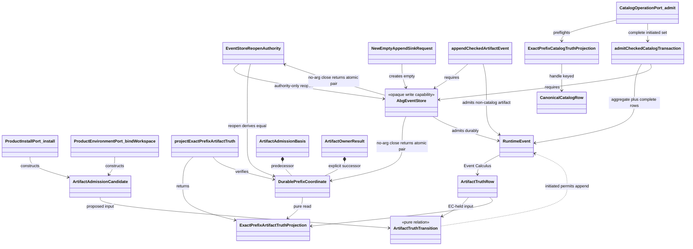

# M05 S06 Axiomatic Authority And Exact Public Construction Design

**Status:** proposed Gate 1 bounded-repair subject; not operative realization
authority until direct F_H accepts the exact reviewed commit and tree

**Scope:** ABG5-S06 corrective authority, exact 18-operation/56-key
construction map, and hard-break realization boundary

**Re-entry:** targeted `requirement_reprice` for deterministic catalog
application plus bounded `design_reframe`

**Owner:** T-281 under T-270

**Method:** STDO 2.2.2

## 1. Decision Boundary

This design consumes the accepted census without changing it:

- path:
  `.ai-workspace/comments/codex/20260731T113200Z_CENSUS_abiogenesis_5_0_s06_exact_56_key_construction.md`;
- Git blob: `efe88cac85bd3bb071d4b5dd451dfadaec893c4f`;
- SHA-256:
  `0c0339689c21154c46148f033c7472b9d55a0fd771fc34a1c41d41c52d28a0c6`.

The exact 56 census rows, their current loci, evidence hashes, deletion
effects, projection graph, PFC-F08 oracle, sentinel, and `AX-F01..F14` plus
`AX-PFC-F08` falsifier records are incorporated by row identity. This design
supplies the previously absent target source paths, runtime value bindings,
dependency closures, and singular authority relations. It does not implement
them.

After rejection of replacement `29aea26d` on its inapplicable AX-F09 Public
ingress, direct F_H authorized completion of Gate 1 inside the already
accepted Product and STDO 2.2.2. Owner-internal names, carriers, refusal codes,
module placement, and signatures are worker-owned HOW while they add no
Public operation, rival authority, controller, runtime, catalog, or Product
meaning. Section 7.3 and `D17..D18` exercise that bounded decision envelope;
they change no requirement or 18/56 member.

Product and Intent are unchanged. S03 and S05 Product and scenario outcomes
are unchanged. This design explicitly supersedes only the obsolete M03
CatalogView admission mechanism named in Section 3; it does not change the S03
narrowing or invocation meaning. S04, post-S06 Prime realization, complete M5
publication closure, M6, and M7 remain outside this subject. Donor adoption is
empty.

Cold constructability review of complete candidate `2a60c2b7`, tree
`fc19ebdf`, passed. Cold authority review found one local counterexample:
Section 7.3 selected one current retry attempt without preserving the complete
prior-attempt frontier required by `REQ-R-ABG3-PROJECTION-009..010`. This
bounded replacement adds the exact full-frontier relation and strengthens
AX-F09 to exercise two prior failures before restart. It consumes the one
repair permitted by the completion envelope and changes no Product,
requirement, Public-family, or authority structure.

The current W1.1a construction re-enters from accepted cut `8c04012a` and the
subsequent read-only code/authority audit. Descendant commits `37b21361` and
`69c7d5dd` remain rejected ancestry evidence only; their row identity,
per-row append, and aggregate-event deletion semantics are not inherited.

## 2. Constitutional Construction

The one Public algebra is:

```text
admit common envelope
  -> select exact operation-and-definition-key contract
  -> call the selected concrete owner-local port value
  -> project the exact indexed owner outcome
```

The implementation is admissible only while all of these axioms hold:

1. `PUBLIC_FUNCTION_DEFINITION_FAMILY` is exactly 18 operations and 56 keys.
2. Every definition references the actual callable Product, ABG, Validator,
   or release owner port value. A string, interface, locator without a value,
   or Public handler is not a port.
3. Owner-local packet values are the sole source of request, result, refusal,
   non-terminal, authority, effect, and capability meaning.
4. Public performs only common admission, exact selection, direct port
   invocation, and structural outcome projection. It contains no semantic
   operation switch.
5. Product owns static PFC-F08 publication and Product meaning. ABG alone owns
   admitted runtime catalog events and runtime truth.
6. ABG-admitted events plus declared Event Calculus laws derive runtime truth.
   Replay and reads invoke those projectors; neither interprets raw events as
   a second authority.
7. Every runtime-relevant prefix is explicit. Equal immutable inputs and equal
   admitted prefixes have equal meaning after restart and interleaving.
8. SDK, CLI, Codex, schemas, catalog rows, manifests, and documentation derive
   from the same exact family.
9. The legacy family is the only reachable Public family before the atomic
   swap. The exact family is the only reachable family afterward.
10. Release owner ports are real and callable in S06, but without the later
    qualification and release basis they return the exact applicable closed
    `ReleaseSnapshotPacket` owner refusal and cannot publish success.

The first counterexample stops the increment. Tests, compatibility, donor
behavior, and implementation convenience cannot trade against an axiom.

## 3. Requirement Trace And Supersession

| Authority | Binding in this design |
|---|---|
| `REQ-P-PUBLIC-CONTRACTS-005`, `-008..010` | one exact indexed family and one invocation/outcome family |
| `REQ-P-POLICY-041..046`, `-049..064` | pure reads, thin adapters, complete Product operations, exact public path |
| corrected `REQ-P-CATALOG-008`, `-030` | deterministic eventless CatalogApplication; ABG-only runtime catalog admission |
| `REQ-R-ABG3-EVENTS-001..002`, `-018`, `-024..032` | append-only admitted events, scoped Event Calculus, durable ingress, no process truth |
| `REQ-R-ABG3-PROJECTION` and `REQ-R-ABG3-RUN` | replay/read projections consume the same Event Calculus result |
| `REQ-L-GTL3-C-ALGEBRA-013..018` | one admitted normalized Program, validation before effects, no rival plan |
| `REQ-L-GTL3-LAWS-021..022` | one code-unit canonical data identity independent of caller order |
| T-281 `CL-01..CL-11` | hard break, explicit carriers, all-port packaging, frozen reviews |

Accepted predecessor files remain immutable. If this subject is accepted, it
supersedes only these realization relations:

| Predecessor relation | Superseding relation |
|---|---|
| `M04_PUBLIC_OPERATION_DEFINITION_FAMILY_BEHAVIOR_DESIGN.md` store-local branded application exception | deterministic reconstructable Product application in Section 6 |
| `M03_M04_PUBLIC_CATALOG_INVOCATION_AUTHORITY_BEHAVIOR_DESIGN.md` application event and unkeyed artifact fluent | no application event; scoped artifact fluent only for genuinely effectful artifacts |
| `M03_DIRECT_GTL_TRAVERSAL_BEHAVIOR_DESIGN.md` `CatalogView` admitted-projection ontology, ABG-owned `narrowCatalogView`, view-admission event, catalog-view sequence admission, and ABI5-ROOT-001 R4 admission mapping | total deterministic eventless Product `CatalogOperationPort.constructView` over an ABG-admitted catalog projection plus exact allowlist; `run.invoke` revalidates the equal view against the explicit-prefix Event Calculus catalog and its invocation event records the view use |
| `M05_S05_CONSENSUS_GLOBAL_TO_LOCAL_DESIGN.md` one-shot store/context application lifecycle | equal carrier reconstruction and invocation-time revalidation |
| `M05_DIRECT_GTL_TRAVERSAL_EXPANSION_DESIGN.md` branded source-result and remembered context coordinates | ABG-backed rehydration from explicit prefix |
| `M05_S06_NATIVE_CONTRACT_CLOSURE_DESIGN.md` root-context-held verification/resolution/install relations | complete serializable carriers and explicit preimages |
| `M05_S06_PUBLIC_FUNCTION_AND_NATIVE_OCCURRENCE_CLOSURE_DESIGN.md` hybrid application ownership, Public read-contract ambiguity, implicit prefix, and older common refusal shape | Sections 4 through 9 of this design |

The accepted predecessor's exact 18/56 source map, PFC-F01..F08 staging,
closed PFC-F08 attempt/refusal relation, and PFC-F08A exact owner-coordinate
join are retained unchanged except where the table above explicitly says
otherwise.

## 4. Concrete Port Law

An owner packet and port are owner-local. No owner module imports `src/public`.
Each named `*Port` below is an exported frozen runtime value whose selected
member is a function. Type-only interfaces may describe it but cannot satisfy
the definition family.

Conceptually, each selected function has this shape:

```text
OwnerPortMember(
  exact owner-local request,
  exact owner-local authority carrier,
  prebound installed owner dependencies
)
  -> exact owner result
   | exact owner refusal
   | exact owner non-terminal
```

The installed composition root binds dependencies once. Public neither builds
an owner context nor selects an owner dependency. The exact definition stores
the already bound function value. Indexed admission extracts only the exact
owner-local request and authority carrier named by the owner packet.

Each definition is one frozen runtime value containing both its canonical
serializable intrinsic fields and `ownerPort`, the actual bound function. Its
`definitionDigest` hashes only the declared intrinsic preimage, including the
exact owner-port coordinate; host function identity is never serialized or
hashed. Family construction resolves that coordinate once, proves that the
resolved export is the same callable stored in `ownerPort`, and then freezes
the definition. PFC-F07 projects only the intrinsic fields. This is one family
with one installed binding, not a serializable catalog plus a second dispatch
registry.

The common Public path is implemented in new structural modules:

| Target source | Sole responsibility |
|---|---|
| `src/public/envelope.ts` | raw/native common-envelope admission and the closed common refusal carrier |
| `src/public/definition_family.ts` | PFC-F01/F02 exact structural join over actual owner contract and port values |
| `src/public/invocation_admission.ts` | exact definition selection and indexed contract admission |
| `src/public/invoke.ts` | call `selection.definition.ownerPort` exactly once; no operation switch |
| `src/public/outcome_projection.ts` | structural tagged projection of the indexed owner outcome |
| `src/public/project_read_contracts.ts` | derived total join over owner-local read contract and port values; authors no field or schema |
| `src/public/schema_projection.ts` | later PFC-F07 schema projection from the closed family |
| `src/public/sdk.ts` | later typed SDK projection from the closed family |
| `src/public/index.ts` | package export of the selected family and projections only |

`src/public/operations.ts`, `src/public/contracts.ts`, and
`src/public/schema.ts` are legacy files, not destinations for semantic reuse.
They are deleted in the atomic swap defined by Section 10.

## 5. Explicit Carriers And Durable Ingress

### 5.0 W1.1a ontology and authority split

W1.1a introduces no episode, controller, router, generation, or semantic
owner. It closes one artifact-truth relation by separating durable read
authority from narrow write capability while retaining the existing concrete
Product, ABG, and HoG owner ports.

#### 5.0.0 Module contracts

| Module | Owner and closed input -> output | Refusal and independently testable law | Forbidden dependencies |
|---|---|---|---|
| M1 Product Catalog Candidate | Product; verified binding + lock + publication/manifests/validations -> complete immutable `CatalogAdmissionCandidate` | existing typed Product validation refusal; equal inputs yield equal complete candidate, aggregate identity is candidate digest, row identity is handle | events, Event Store, Event Calculus, context, append capability |
| M2 Catalog Transition | ABG semantic law; candidate + M5 held projection -> initiated, idempotent, conflict, or invalid-history | total typed disposition; permutation of equal handle-keyed inputs cannot change it | I/O, store object, process context, event stamping |
| M3 Catalog Admission Owner | concrete `CatalogOperationPort.admit`; M1 result + M2 result + M4 capability -> existing catalog result/refusal | only initiated invokes M4 once with the exact aggregate+row set; every other disposition is effectless | generic controller/router, raw append, independent identity or truth fold |
| M4 Event Store Durability | Event Store; supplied event set + expected predecessor + held sink -> stamped/ordered atomic durable append + one successor | existing coordinate/transaction refusal; either the complete supplied set is durable at one successor or none is admitted | catalog interpretation, Product validation, Event Calculus decisions |
| M5 Catalog Event Calculus | ABG Event Calculus; exact prefix + admitted aggregate/registry events -> immutable `ExactPrefixCatalogTruthProjection` or typed refusal | equal prefixes yield equal projections; partial/mixed/duplicate handle history refuses | store object, raw consumer scan, process state, append capability |
| M6 Catalog Consumers | existing Product/Public/HoG adapters; M5 projection + consumer request -> existing read/invocation result/refusal | replacing process/store identity while preserving projection cannot change the answer | authoring catalog truth, `readAll`, independent digest/fold, WeakMap authority |
| M7 Durable Context Lifecycle | ABG infrastructure; explicit new-empty acquisition -> store+zero prefix; no-argument close -> one atomic `{ prefix, reopenAuthority }`; authority-only reopen -> existing store+equal prefix | new/reopen domains are disjoint; close derives both values from one verified byte snapshot under the held descriptor and lock; reopen neither accepts nor selects another prefix | catalog identity, row comparison, catalog projection semantics |

Composition is one direction:

```text
M1 candidate -> M2(candidate, M5(prefix))
  initiated -> M3 constructs exact event set -> M4 checked atomic append
            -> successor prefix -> M5 typed projection -> M6 consumers
  idempotent/conflict/invalid_history -> no M4 effect

M7 supplies and closes only the sink/coordinate used by M3/M4.
```

A defect in M7 cannot redefine M1-M6. A catalog identity/projection defect
cannot redefine M7. Each module is reviewed and implemented independently,
then the carrier composition is proven without shared mutable semantic state or
a supermodule. Local callable wiring, ordering, and error text stay in the
owning module's coding-plan row; runtime race and failure claims stay in its
falsifier row.

#### 5.0.0a Global composition and authority-seam ledger

| Semantic fact | Sole author | Sole admission seam and durable events | Sole EC/projection and consumer contract | Prohibited competitor -> deletion/internalization |
|---|---|---|---|---|
| Product catalog candidate truth | M1 Product | none; candidate is proposed immutable Product value | M2 consumes the complete candidate | inferred rows/store-derived candidate -> retain only Product constructor/validation |
| admitted catalog aggregate truth | M3 from M1+M2 initiated decision | M3 owner-internal checked catalog transaction; one catalog `public_operation_artifact_admitted` boundary | M5 joins exact boundary/candidate; M6 consumes `ExactPrefixCatalogTruthProjection` | raw artifact append, registry-only aggregate inference -> affected-kind raw ingress rejects |
| admitted handle-keyed row truth | M3 constructs exact M1 rows | same checked transaction; complete caused `registry_entry_admitted` set | M5 handle dictionary transition/fold; M6 consumes immutable rows | kind/workspace row keys, raw row scan, partial resume -> delete scans and reject partial/mixed history |
| install/binding artifact truth | Product install/environment owner | `appendCheckedArtifactEvent`; one non-catalog `public_operation_artifact_admitted` | artifact Event Calculus -> `ExactPrefixArtifactTruthProjection` | raw single/batch/transaction artifact append -> affected-kind rejection |
| durable-prefix coordinate | M4 append or M7 new-empty/close/reopen lifecycle | existing durable append/new creation; no new event | exact-coordinate projectors, expected-prefix transaction results, and M7 close/reopen contracts | sink-local latest/default path -> internalize configure/bare construction; no caller-supplied close prefix or reopen-coordinate overload |
| append capability | M7 only | disjoint new-empty/authority-only reopen acquisition; no semantic event | consumed only by M3/M4 effect contracts | Public/read authority/context replacement/second sink abstraction -> delete zero-argument and replacement paths; `AbgEventStore` remains the sole sink |
| catalog read/invocation truth | M5 projection; M6 only interprets request meaning | no read event; invocation records only its owning use | `ExactPrefixCatalogTruthProjection` -> existing Product/Public/HoG read/invocation result | `readAll`/second fold/WeakMap/object brand -> migrate 5.5.1 classes |

Any row with two authors, two folds, an affected-kind alternate ingress,
generic artifact/catalog overlap, raw-scan fallback, or WeakMap truth is a
design rejection rather than a local implementation choice.

#### 5.0.0b Shared immutable dictionary law

M2 and M5 reuse one internal pure event-sourced dictionary law:

```text
ImmutableAuthorityDictionaryTransition<K, V>(held, proposedOrAdmitted) ->
  absent key       => initiated
  equal key/value  => idempotent
  equal key/unequal value => conflict
  duplicate admitted key or invalid event relation => invalid_history
```

The dictionary knows only canonical key/value equality and deterministic fold.
A typed domain adapter supplies its governed URI namespace, local key, complete
typed value, and existing domain event mapping. Catalog supplies its enclosing
catalog authority namespace, local key `handle`, complete
`CatalogRowCandidate` value, aggregate boundary, and registry-row events.
Install/binding supply their existing artifact authority-scope URI and artifact
events. The namespace is a routing/enclosure coordinate, not an additional
catalog-row identity member.

The fold direction is exact:

```text
typed domain event
  -> typed domain adapter validates existing payload
  -> shared immutable dictionary transition
  -> typed domain projection
```

There is no public generic store, namespace registry authority, generic
metadata bag, new event kind, or generic semantic owner. M1 remains sole author
of catalog meaning; install/environment owners remain sole authors of their
artifact meaning; M4 remains semantic-blind durability.

The affected implementation roles remain distinct:

| Role | One lawful primitive in W1.1a | Affected existing implementation disposition |
|---|---|---|
| Event Store log: ordered durable source facts | existing envelope/ordinal and `appendDurablyBatch` law behind M4 | retain `event_store.ts:2023-2095` durability internals; narrow affected-kind reachability and internalize installed transaction/configure surfaces |
| immutable dictionary fold: pure keyed EC algebra | the one transition above, typed by each domain adapter | replace unscoped boolean effects at `event_calculus.ts:11-23` and duplicate raw folds; do not create another map/store authority |
| catalog registry: typed handle-keyed projection/query | M5 `ExactPrefixCatalogTruthProjection` over retained aggregate/registry events | retain producer/carriers at `catalog_admission.ts:175-258`; migrate/delete raw truth scans at `:399-545` |
| ordered ledger/history projection | Event Calculus consumes store-assigned admission order and produces typed history/projection | retain event ordinal history; delete consumer-side raw event ordering/folding and process-local application authority at `catalog_admission.ts:25-60` |

The log records source facts; the dictionary folds keyed truth; the registry is
a typed projection/query; an order-sensitive ledger is a history projection.
Registry and ledger surfaces never independently author truth. This census is
bounded to catalog/artifact paths and does not authorize a codebase-wide
framework rewrite.

| Entity | Kind | Owner | Identity/content | Authority and lifecycle |
|---|---|---|---|---|
| `DurablePrefixCoordinate` | durable truth coordinate | ABG Event Store projects; Event Calculus verifies | closed kind/version, canonical local file URL, byte length/digest, device/inode, event-contract digest, coordinate digest | names one immutable prefix; independently serializable and fresh-process readable; a verified transaction commit, no-argument close, or verified reopen may return an equal or successor coordinate |
| `EventStoreReopenAuthority` | durable write-reacquisition evidence | ABG Event Store | existing canonical path, device/inode, byte length/digest, contract digest, authority digest | projected atomically with a coordinate by no-argument close from the same verified bytes; authority-only reopen returns the mechanically equal coordinate; authority is not required for read projection |
| `AbgEventStore` | sole opaque non-durable write capability | ABG Event Store | held descriptor, exact file identity, exclusive append lock, ordered in-memory admission state | guards envelope/order/durability effects only; never supplies semantic truth or read authority; released by existing close behavior; no second sink type is introduced |
| `NewEmptyAppendSinkRequest` | closed acquisition input | concrete installed setup owner | canonical absent event-log path | exclusively creates one empty durable sink and zero prefix; cannot reopen |
| `ProductInstallPort.install` | existing concrete callable owner | Product install | exact install request/result contract | directly constructs and admits install artifact candidate; no dispatcher |
| `ProductEnvironmentPort.bindWorkspace` | existing concrete callable owner | Product environment | exact workspace-binding request/result contract | directly constructs and admits binding artifact candidate; no dispatcher |
| `CatalogOperationPort.admit` | existing concrete callable owner | Product catalog | exact catalog-admission request/result contract | directly constructs and admits canonical catalog-row candidates; no dispatcher |
| `projectExactPrefixArtifactTruth` | pure Event Calculus callable | ABG Event Calculus projector | explicit coordinate to immutable projection/refusal | sole artifact read/projection relation; eventless and owner-free |
| `appendCheckedArtifactEvent` | owner-internal single-event effect callable | ABG Event Store | `AbgEventStore`, expected predecessor, initiated non-catalog artifact event | compares coordinate and admits one install/binding artifact event; raw ingress rejects that kind |
| `admitCheckedCatalogTransaction` | owner-internal existing-transaction specialization | ABG catalog admission | `AbgEventStore`, expected predecessor, one aggregate boundary plus its complete registry-row set | preflights typed catalog truth, verifies predecessor, and delegates one atomic durable batch to existing Event Store transaction law |
| `ArtifactAdmissionCandidate` | proposed non-catalog artifact value | `ProductInstallPort.install` or `ProductEnvironmentPort.bindWorkspace` | operation, definition, stable scope, artifact, digest, and causation fields | exists before runtime admission; not runtime truth |
| `ArtifactTruthTransition` | pure store-free non-catalog artifact relation | shared definition | Event-Calculus-held rows plus proposed/admitted candidate | install/binding invokes proposed branch; Event Calculus invokes admitted branch; catalog uses M2/M5 instead |
| `RuntimeEvent` | admitted durable fact | ABG event admission | existing canonical envelope and payload | only an `initiated` decision reaches Event Store; immutable after append |
| `ArtifactTruthRow` | held fluent | Event Calculus | admitted candidate plus event ref and ordinal | derived only from admitted durable events; never read from sink memory |
| `ExactPrefixArtifactTruthProjection` | immutable read carrier | Event Calculus projector | verified coordinate, ordered held rows, projection ref/digest | pure eventless reconstruction from exact durable bytes; no append sink or reopen authority |
| `ArtifactAdmissionBasis` | owner request component | each of `ProductInstallPort.install`, `ProductEnvironmentPort.bindWorkspace`, and `CatalogOperationPort.admit` supplies; ABG verifies | exact predecessor `DurablePrefixCoordinate` | binds one proposed admission to the durable prefix evaluated by Event Calculus |
| `ArtifactOwnerResult` | owner result extension | those same three named boundaries | admitted/idempotent/semantic-refusal result with explicit successor, or coordinate refusal with no claimed successor | admitted returns appended successor; idempotent/semantic refusal returns verified predecessor unchanged; stale/unverified coordinate returns no successor |
| canonical catalog row | Product-declared semantic row | Product defines; ABG admits/projects | `handle` only; `kind` and every other row field are content | equality/conflict is evaluated inside the enclosing workspace catalog projection; duplicate handles are invalid |
| `ExactPrefixCatalogTruthProjection` | immutable typed catalog read carrier | ABG Event Calculus | explicit prefix, enclosing workspace binding/catalog identity, aggregate candidate, handle-keyed rows, projection ref/digest | derives only from one admitted aggregate boundary and its exact complete caused registry-row set; partial or mixed history refuses |

Authority is singular:

```text
read:
  DurablePrefixCoordinate
    -> verify exact durable bytes
    -> Event Calculus over admitted RuntimeEvents
    -> ExactPrefixArtifactTruthProjection

write:
  ProductInstallPort.install
    | ProductEnvironmentPort.bindWorkspace
    constructs ArtifactAdmissionCandidate
    + predecessor DurablePrefixCoordinate
    + already-held AbgEventStore
    -> pure owner transition over Event Calculus projection
    -> initiated only -> checked single artifact ingress
       | checked atomic catalog transaction
    -> successor DurablePrefixCoordinate
    -> Event Calculus projects admitted-event successor

catalog write:
  M1 candidate + M5 projection -> M2 decision
    -> initiated only -> M3 exact event set -> M4 atomic checked transaction
    -> successor DurablePrefixCoordinate -> M5 projection
```

`AbgEventStore` is the sole sink and is not a runtime-truth carrier. Its process-local state
may retain only descriptor, lock, byte-count, and next-envelope mechanics
needed to guard an append. `readAll`, a cached event array, a retained context,
or sink identity cannot answer an artifact, catalog, run, continuation, retry,
or closure question.

#### 5.0.1 Lifecycle completeness matrix

| Entity | Declare/create | Acquire or reconstruct | Use/transition | Refusal | Handoff/fresh process | Close/retire |
|---|---|---|---|---|
| `DurablePrefixCoordinate` | zero coordinate from exclusive new-empty creation; successor constructed from verified committed bytes inside the durable append rollback boundary | read requires only coordinate; authority-only reopen reconstructs and returns its equal coordinate | immutable predecessor; a configured durable non-empty expected-prefix transaction returns a distinct successor, while an empty or in-memory transaction returns `null`; no in-place currentness | closed-shape, self-digest, file-URL, identity, contract, length, or byte mismatch refuses before append/read result | serializable coordinate alone crosses to fresh-process reads; close pairs it with reopen authority for later writes | never deleted by W1.1a; later coordinates supersede only current caller position |
| `EventStoreReopenAuthority` | no-argument `projectReopenAuthorityAndClose()` derives it and the coordinate from one verified byte snapshot under the held descriptor and lock | existing authority-only `reopenEventStore(authority)` consumes it only for writes and returns the existing store plus equal coordinate | no semantic transition | close failure returns no pair; reopen authority/file mismatch returns the existing typed refusal | serializable write handoff; P1 checks its paired prefix equals the selected retry-transaction successor and P2 checks reopened prefix equals the handoff/D17 prefix | retired as current write basis when a later store closes and returns another atomic pair |
| `AbgEventStore` | new-empty creation or existing authority-only reopen acquires the sole sink | exclusive descriptor/lock plus ordered admission state | guards ordered durable internal admissions; expected-prefix transactions return coordinates only from rollback-protected durable commits | stale named predecessor refuses without append; any internal admission or successor-construction failure aborts the transaction | never serialized or used for read authority | no-argument close projects the atomic pair and releases; no retry/recovery protocol added |
| `NewEmptyAppendSinkRequest` | concrete setup caller constructs | new-only acquisition | exhausted on result | existing/alias/noncanonical target refuses | never used to recover history | request discarded |
| `ProductInstallPort.install` | accepted Product family declares | existing direct call | project, construct install candidate, decide, optionally append | typed Product/coordinate refusal | caller may reuse durable result in fresh process | call returns; no retained controller state |
| `ProductEnvironmentPort.bindWorkspace` | accepted Product family declares | existing direct call | project, construct binding candidate, decide, optionally append | typed Product/coordinate refusal | caller may reuse durable result in fresh process | call returns; no retained controller state |
| `CatalogOperationPort.admit` | accepted Product family declares | existing direct call | project typed catalog truth; preflight complete aggregate plus handle-keyed row set; optionally admit one atomic existing transaction | unequal candidate, duplicate handle, or partial/mixed aggregate-row history refuses before effects | equal complete candidate and row set is idempotent in a fresh process | call returns; no retained controller/resume state |
| `projectExactPrefixArtifactTruth` | Section 5.4 declares | no effect acquisition | verify bytes and apply EC | typed coordinate/history refusal | equal prefix reconstructs equal result | closes read descriptor on return |
| `appendCheckedArtifactEvent` | existing single ingress narrows for affected kind | requires held `AbgEventStore` | compare, stamp, append, project successor | stale/unverifiable predecessor refuses without successor | successor coordinate is durable | store remains held until no-argument atomic close |
| `admitCheckedCatalogTransaction` | existing transaction law specialized at catalog owner | requires held `AbgEventStore` and complete preflighted event set | compare once, atomically admit boundary plus complete caused rows, return one successor | existing transaction refusal/rollback behavior; no partial catalog state | equal durable batch reconstructs equal catalog projection | store remains held until no-argument atomic close |
| `ArtifactAdmissionCandidate` | selected named port constructs | no acquisition | pure transition consumes value | invalid/conflict returns typed owner refusal | may be reconstructed from caller inputs, but is not a handoff | discarded after decision |
| `ArtifactTruthTransition` | one declared pure function | none | proposed branch decides; admitted branch advances EC held state | total typed refusal/invalid-history result | equal inputs produce equal result in fresh process | stateless |
| `RuntimeEvent` | Event Store admits initiated candidate only | Event Calculus reads durable bytes | immutable input to EC successor | append failure creates no event | coordinate-preserved bytes reconstruct identically | history retained |
| `ArtifactTruthRow` | EC creates from admitted event | EC reconstructs from exact prefix | equal candidate idempotent; unequal same-scope candidate conflicts | invalid duplicate history refuses projection | canonical equality from equal bytes | projection discard only; history retained |
| `ExactPrefixArtifactTruthProjection` | pure projector declares closed carrier | direct coordinate read, no sink acquisition | read-only consumer input | typed exact-prefix/history refusal | fresh process reproduces canonical equal carrier | discardable read model |
| `ArtifactAdmissionBasis` | selected named port binds predecessor | no separate acquisition | verified before transition and immediately before initiated append | stale/mismatch refuses | durable value may cross process with owning request | exhausted by that named port call |
| `ArtifactOwnerResult` | selected named port returns it | none | caller threads explicit successor to the next named port only when non-null | idempotent/semantic refusal returns unchanged verified predecessor; prefix or stale-preappend refusal returns no successor | non-null successor may be serialized for read or paired with close authority for later write | result discarded after threading or refusal stops the write chain |
| canonical catalog row | contribution declares one handle and complete content | EC reconstructs within enclosing aggregate catalog | exact handle/content equality idempotent; a new handle may coexist | duplicate handle, unequal same-handle content, or mixed aggregate refuses | durable registry event reconstructs equal row in fresh process | immutable initial-admission row; no supersession transition |
| `ExactPrefixCatalogTruthProjection` | Event Calculus declares | exact coordinate plus admitted event history | exposes aggregate identity and handle-keyed immutable rows | missing/extra/duplicate/mixed caused row set is typed projection refusal | equal prefix produces equal projection | discardable read model; events retained |

#### 5.0.2 Domain view



#### 5.0.3 Sequence views

```mermaid
sequenceDiagram
  participant Install as ProductInstallPort.install
  participant Bind as ProductEnvironmentPort.bindWorkspace
  participant EC as Event Calculus Projector
  participant Law as ArtifactTruthTransition
  participant Store as appendCheckedArtifactEvent

  Note over Install,Bind: exactly one concrete port follows the relation; no generic dispatcher exists
  alt ProductInstallPort.install
    Install->>EC: projectExactPrefixArtifactTruth(predecessor)
    EC-->>Install: held projection or typed refusal
    Install->>Law: evaluate(held rows, install candidate)
  else ProductEnvironmentPort.bindWorkspace
    Bind->>EC: projectExactPrefixArtifactTruth(predecessor)
    EC-->>Bind: held projection or typed refusal
    Bind->>Law: evaluate(held rows, binding candidate)
  end
  alt initiated
    Law-->>Store: initiated event, sink, expected predecessor
    Store->>Store: compare exact durable coordinate immediately before append
    alt stale or unverifiable predecessor
      alt install selected
        Store-->>Install: coordinate refusal; no successor
      else binding selected
        Store-->>Bind: coordinate refusal; no successor
      end
    else exact predecessor
      Store->>EC: admitted event plus successor coordinate
      alt install selected
        EC-->>Install: admitted-event successor projection and coordinate
      else binding selected
        EC-->>Bind: admitted-event successor projection and coordinate
      end
    end
  else idempotent
    alt install selected
      Law-->>Install: held row plus unchanged predecessor
    else binding selected
      Law-->>Bind: held row plus unchanged predecessor
    end
    Note over Install,Store: no append
  else refused
    alt install selected
      Law-->>Install: typed conflict plus unchanged predecessor
    else binding selected
      Law-->>Bind: typed conflict plus unchanged predecessor
    end
    Note over Install,Store: no append
  end
```

```mermaid
sequenceDiagram
  participant Catalog as CatalogOperationPort.admit
  participant EC as Event Calculus Projector
  participant Tx as admitCheckedCatalogTransaction
  participant Store as existing Event Store transaction

  Catalog->>EC: project exact predecessor
  EC-->>Catalog: typed aggregate and handle-keyed rows or typed history refusal
  Catalog->>Catalog: preflight complete candidate and complete row set
  alt equal complete candidate and rows
    Catalog-->>Catalog: idempotent; no event
  else conflict, duplicate handle, partial, or mixed history
    Catalog-->>Catalog: typed refusal; no event
  else no held candidate
    Catalog->>Tx: boundary plus every exact caused registry row, expected predecessor
    Tx->>Store: verify predecessor then existing atomic durable batch
    Store-->>Tx: one successor or existing transaction refusal
    Tx-->>Catalog: complete admitted result or refusal; never partial rows
    Catalog->>EC: project successor
    EC-->>Catalog: complete admitted catalog projection
  end
```

```mermaid
sequenceDiagram
  participant Prefix as DurablePrefixCoordinate
  participant EC as Event Calculus Projector

  Note over EC: exact consumers are the 18-reader census in Section 5.4
  EC->>Prefix: read and verify exact durable bytes
  Prefix-->>EC: admitted RuntimeEvents or typed prefix refusal
  EC-->>EC: immutable projection or typed history refusal
  Note over Prefix,EC: eventless; no append sink, lock, reopen authority, or process cache
```

#### 5.0.4 State view

```mermaid
stateDiagram-v2
  [*] --> PrefixAvailable : new-empty zero prefix or durable coordinate received
  PrefixAvailable --> PureProjection : read exact durable bytes
  PureProjection --> PrefixAvailable : projection or typed refusal; no event
  PrefixAvailable --> SinkAcquired : new-empty or authority-only reopen for write
  SinkAcquired --> Deciding : install or bind port applies pure transition
  SinkAcquired --> CatalogPreflight : project aggregate plus handle-keyed row truth
  Deciding --> PrefixUnchanged : idempotent or refused
  Deciding --> PreappendCheck : initiated only
  CatalogPreflight --> PrefixUnchanged : exact complete candidate and rows idempotent
  CatalogPreflight --> CatalogConflictRefused : unequal duplicate partial or mixed history
  CatalogConflictRefused --> PrefixUnchanged : typed refusal; no append
  CatalogPreflight --> CatalogAtomicAppend : no held candidate
  CatalogAtomicAppend --> WriteRefusedNoSuccessor : existing transaction refuses; no partial history
  CatalogAtomicAppend --> SuccessorAvailable : boundary plus complete row set durably admitted
  PreappendCheck --> WriteRefusedNoSuccessor : stale coordinate refusal; no append
  PreappendCheck --> SuccessorAvailable : admitted append returns successor
  PrefixUnchanged --> SinkAcquired : caller threads unchanged predecessor
  SuccessorAvailable --> SinkAcquired : caller threads successor
  SinkAcquired --> WriteHandoff : no-arg close returns prefix plus authority and releases
  WriteHandoff --> SinkAcquired : authority-only reopen returns equal prefix for later write
  WriteHandoff --> PureProjection : coordinate-only fresh-process read
  WriteRefusedNoSuccessor --> WriteHandoff : no-arg close held sink; returned pair names verified bytes only
```



The state machine contains no episode currentness, object-consumption state,
semantic dispatch, poison state, retry-close state, recovery protocol, lease,
or batch. Concrete Product, ABG, and HoG owner ports remain direct call sites.

### 5.1 Verification and resolution

`ProductVerificationPort.verify` is deterministic and eventless. It returns a
complete canonical `VerifiedProductCarrier` containing the selected target
member, all verified Product/descriptor/contribution/artifact identities and
digests, native-contract evidence, pending external selectors where lawful,
disposition, issues, and provenance. Canonical serialization and JSON
round-trip preserve its ref, digest, and value.

`ProductEnvironmentPort.resolve` accepts the complete verified carrier for
every candidate Product plus the exact declared dependency and compatibility
inputs. It re-reads or revalidates the identified Product bytes and returns a
complete canonical `ResolvedProductLock`. It never accepts a prior invocation
reference as a substitute and never looks up a verification result in memory.

These carriers prove internal content and deterministic evaluation, not ABG
runtime admission. Later effectful owners revalidate the complete carrier and
admit their own artifact/runtime truth where required.

### 5.2 Durable prefix

One closed, self-digesting `DurablePrefixCoordinate` is explicit at each
artifact pure-read, write-reacquisition, checked-transaction, and named
enclosing boundary fixed by this design:

```text
DurablePrefixCoordinate = {
  kind: "durable_prefix_coordinate",
  schemaVersion: "5.0.0",
  eventLogRef: string,
  prefixLength: number,
  prefixDigest: Sha256Digest,
  storeIdentity: {
    device: number,
    inode: number,
    eventContractDigest: Sha256Digest
  },
  coordinateDigest: Sha256Digest
}
```

`eventLogRef` is exactly the canonical local `file:` URL produced from the
canonical absolute event-log path. It is not a catalog ref, registry key,
ambient path, or lookup token. `prefixLength` is a non-negative safe integer;
device and inode are non-negative safe integers; both digest fields have the
closed SHA-256 shape. `coordinateDigest` is the canonical digest of every
preceding coordinate field and excludes only itself.

Event Store owns one `validateDurablePrefixCoordinate` relation. It rejects
extra or missing keys at both levels, wrong nominal constants, a noncanonical
or non-local file URL, invalid numbers or digests, and a mismatched
`coordinateDigest`. Every coordinate consumer invokes that same nominal
validator. Physical verification then follows one of two closed modes:

- a pure historical read requires the same stable device/inode before and
  after reading, `fileSize >= prefixLength`, the selected event contract, and
  `prefixDigest` equal to the hash of exactly the first `prefixLength` bytes;
  a later suffix is permitted and is not read or projected; and
- a held-store append/close check or authority-only reopen requires the same
  descriptor/path device/inode, the selected event contract, and exact-tail
  equality `fileSize === prefixLength`, then hashes all named bytes.

A structurally self-consistent raw object is not authoritative without the
applicable physical check. The coordinate identifies one exact append-only
prefix; a retained context, latest log, environment variable, module
singleton, or remembered reopen authority cannot supply it.

This law does not expose a prefix parameter or result on every internal ABG
admission callable. Internal admissions within one named transaction or
enclosing operation use the one already-held `AbgEventStore`, remain subject to
ordered durable append-before-next-effect, and do not independently author
semantic currentness. `appendDurablyBatch` constructs and validates a
non-empty commit's successor only after write, `fsync`, length check, and byte
check, but still inside the same rollback-protected `try`. A successor
construction or validation failure therefore follows the existing truncate,
`fsync`, in-memory rollback path and cannot leave durable appended bytes while
returning refusal or no coordinate. Event Calculus over the exact committed
prefix, not the store or projection mechanic, proves semantic meaning. There
is no generic installed `projectCurrentPrefix`, optional prefix overload,
wrapper, second sink, or second write path.

The existing expected-prefix transaction keeps its mechanical input and is
narrowed only in its result:

```text
admitRuntimeEventTransactionAtExpectedPrefix(
  store: AbgEventStore,
  expectedPrefixDigest: Sha256Digest,
  action
) -> {
  value,
  successorPrefix: DurablePrefixCoordinate | null
}
```

It compares `expectedPrefixDigest` with the canonical digest of the immutable
in-memory event snapshot immediately before the action. It does not accept or
verify a `DurablePrefixCoordinate`, file identity, descriptor, or physical
tail. A configured durable non-empty batch returns the coordinate built by
`appendDurablyBatch`; an empty batch or an unconfigured/in-memory store returns
`successorPrefix: null`.

The generic transaction treats `action` as arbitrary `T`: it rolls back only
when the action throws and does not infer typed refusal from a returned value.
An owning transaction that invokes nested typed admission callables must
therefore convert each inner refusal into its own private thrown abort and map
that abort back to the outer typed refusal only after rollback.

The two current expected-prefix consumers remain exactly
`abg/fan_out.ts::admitFanOutCompletion` and
`abg/retry.ts::admitRetryRuntimeFailureTransition`. Fan-out retains its
mechanical digest input and unwraps `.value`; it does not consume a coordinate.
The selected durable retry-failure boundary unwraps `.value` and requires the
non-null successor returned by its non-empty durable commit. No other caller is
migrated to this helper.

#### 5.2.1 Disjoint Event Store write acquisition and bypass deletion

W1.1a retains one existing Event Store write lifecycle. New-empty acquisition
and authority-only reopen remain disjoint; no new sink or reopen API is added:

    createNewEmptyAppendSink(
      request: NewEmptyAppendSinkRequest
    ) -> {
      store: AbgEventStore,
      prefix: DurablePrefixCoordinate
    } | EventStoreAcquisitionRefusal

    reopenEventStore(
      authority: EventStoreReopenAuthority
    ) -> {
      ...existingReopenedEventStoreContext,
      store: AbgEventStore,
      prefix: DurablePrefixCoordinate
    } | EventStoreReopenRefusal

    NewEmptyAppendSinkRequest = {
      kind: "new_empty_append_sink_request",
      schemaVersion: "5.0.0",
      eventLogPath: string
    }

createNewEmptyAppendSink is used only by the existing installed setup owner
before its first effectful operation. It performs the already specified
exclusive, canonical, alias-safe creation checks and returns the existing
`AbgEventStore` plus the zero prefix. It cannot accept a reopen
authority or existing target.

The existing authority-only `reopenEventStore` validates the closed reopen
authority, acquires the existing descriptor and exclusive append lock,
verifies its canonical path, device, inode, event-contract digest, exact-tail
`fileSize === durableByteLength`, and digest of all named bytes, validates
admitted history, and returns the existing context/store plus the coordinate
mechanically derived from those same verified bytes. It accepts no coordinate
argument or overload and cannot create, truncate, select a later prefix, or
fall back to new-empty creation.

The existing no-argument close boundary is narrowed in place:

    projectReopenAuthorityAndClose() -> {
      prefix: DurablePrefixCoordinate,
      reopenAuthority: EventStoreReopenAuthority
    }

While the existing append lock remains held, it verifies descriptor/path
identity, reads exactly the held durable length, verifies the bytes and event
contract, and derives both values from that single snapshot. It returns no
partial handoff: the pair is constructed and frozen before descriptor/lock
release, and a failure returns neither member. The prefix maps to the authority
fields mechanically and neither value semantically selects a current tail.
This is the one existing close/reopen lifecycle, not a second API, close-result
protocol, poison state, retry-close, recovery, lease, or controller.

The affected single-artifact append surface is narrowed to:

    appendCheckedArtifactEvent(
      store: AbgEventStore,
      expectedPredecessor: DurablePrefixCoordinate,
      initiatedEvent:
        public_operation_artifact_admitted for product.install or workspace.bind
    ) -> {
      event: RuntimeEvent,
      successorPrefix: DurablePrefixCoordinate
    } | EventStoreAppendRefusal

Immediately before append, Event Store verifies that the held descriptor,
device/inode, durable byte length/digest, and event-contract digest equal
expectedPredecessor. A mismatch returns the existing typed prefix refusal and
appends nothing. Event Store then owns only envelope validation, admission
ordinal stamping, durable append, and successor-coordinate projection. It does
not import ArtifactTruthTransition, select an artifact disposition, query
catalog/run truth, or expose its cached events as read authority.

Each request to `ProductInstallPort.install`,
`ProductEnvironmentPort.bindWorkspace`, or
`CatalogOperationPort.admit` carries:

    {
      ...existingOwnerRequest,
      artifactAdmissionBasis: {
        predecessorPrefix: DurablePrefixCoordinate
      },
      store: AbgEventStore
    }

The sink is already held by that operation's existing root context. The request
does not transfer semantic ownership to Event Store. The selected named port
remains directly invoked, constructs its candidate, and evaluates the typed
Event Calculus projection before effects. Install and binding call
`appendCheckedArtifactEvent` only for initiated. Catalog calls the checked
existing transaction specified in Section 5.5 only for an initiated complete
catalog.
`ProductInstallPort.install`, `ProductEnvironmentPort.bindWorkspace`, and
`CatalogOperationPort.admit` remain three different callables. Response,
continuation, retry, the Section 5.4 read consumers, and HoG retain their exact
existing direct ports. No generic dispatch method or cross-owner router is
added.

The hard break in the same realization cut:

- makes bare new AbgEventStore() and configureDurableLog unreachable outside
  src/abg/event_store.ts;
- replaces event_log.persistEventLog create/configure behavior with
  verification of an already-held sink only;
- deletes the zero-argument createRootOperationContext path;
- removes applyRunInvoke late durable-log configuration;
- removes context store replacement and new-empty fallback from continuation,
  response, retry, gap, and run-projection paths;
- removes readAll, readScope, mutable store, retained context, and reopened
  store as inputs to replay, Event Calculus, or Public/Product read decisions;
  and
- leaves no raw-path, absent-sink, default-log, environment, working-directory,
  test-only, or compatibility acquisition path.

#### 5.2.2 Root-context caller migration ledger

The live definition at `public/operations.ts:59-67,128-142` creates an ambient
store and process-local `RootOperationState`. Its 32 callers migrate by durable
need, without a replacement context/controller family:

| Caller class | Exact live addresses | Required durable input | Required output | Append capability |
|---|---|---|---|---|
| CLI transport | `public/cli.ts:41` | explicit new-empty target for an effectful transcript, or reopen authority selected by an effectful re-entry request; coordinate only for a pure-read transcript | atomic final `{ prefix, reopenAuthority }` only when effects were owned | conditional on selected concrete operations |
| shared programmatic/test transport | `test_env/support/root-cli-environment.mjs:375`; `falsifiers/contract-lanes.mjs:1587`; `falsifiers/runtime-f08.mjs:645` | same explicit new/authority-only-reopen/read input as the transcript under test | atomic final handoff for writes; projection only for reads | conditional, never ambient |
| new-write installed setup | `m5-installed-portability.test.mjs:380,415,708,749,823,873,912,1172,1216,1286,1466`; `m5-installed-external-product.test.mjs:346,488,520,771,1322,1776,1820,2780,2887,3238` | explicit non-existing durable target and zero prefix from the installed setup owner | successor coordinate; coordinate-verified reopen authority on handoff | yes while executing effectful setup/run operations |
| generic fresh programmatic invocation | `m5-installed-external-product.test.mjs:30` | coordinate only for pure read; otherwise explicit new target or reopen authority selected by the invoked owner | matching read projection or write successor/handoff | only for an effectful selected operation |
| pure read | `m5-installed-external-product.test.mjs:1455` | exact `DurablePrefixCoordinate` from the supplied public authority | immutable typed EC projection | no |
| response | `m5-installed-external-product.test.mjs:1596` | continuation reopen authority; authority-only reopen must return the serialized equal prefix before the response write | successor coordinate and atomic close handoff, or typed refusal | yes because response is effectful even when an equal duplicate becomes idempotent |
| continuation | `m5-installed-external-product.test.mjs:2611` | continuation/run reopen authority; authority-only reopen must return the serialized equal prefix before the continuation write | successor coordinate and atomic close handoff, or typed refusal | yes for effectful continue; no generic reopen fallback |
| fresh-process falsifier setup/reopen/retry | `falsifiers/installed-worker.mjs:186,255,319` | explicit new target at `:186`; authority-only reopen at `:255`; request-selected new/reopen input at `:319` | reopened context includes the mechanically equal prefix; exact successor/handoff for writes or typed projection for read-only phase | only in effectful phase; retry uses its existing direct owner port |

No caller may derive a path or prefix from process counters, clocks, CWD,
workspace defaults, retained objects, or a zero-argument constructor. The
coding plan owns the individual signature edits; this ledger owns their
durable input/output class.

#### 5.2.3 Affected-kind ingress closure

The live Event Store surfaces are raw single, raw batch, source-internal CAS
batch `compareAndAppendExpectedPrefix`, generic transaction, and
expected-prefix transaction. The CAS-batch consumers are exactly
`abg/closure.ts:467,676`, `abg/continuation.ts:76`, and
`abg/retry.ts:1523,2391`. The expected-prefix transaction consumers are
exactly `abg/fan_out.ts` and `abg/retry.ts`. The generic transaction has two
direct cross-module consumers, `hog/execute.ts` and `hog/retry_exit.ts`, plus
the same-module delegation from the expected-prefix helper in
`abg/event_store.ts`. This census is the migration boundary; the correction
does not move a caller between these ingresses or add another consumer.

| Surface | Affected-kind disposition | Unaffected-kind disposition |
|---|---|---|
| raw single `admitRuntimeEvent` | reject `public_operation_artifact_admitted` and `registry_entry_admitted`; those kinds are reachable only through their owner-internal checked ingress | retain existing envelope/ordinal/durable behavior |
| raw batch `admitRuntimeEventBatch` | reject either affected kind anywhere in the batch | retain for existing C-call, traversal, closure, actor/process, and other runtime families |
| source-internal CAS batch `compareAndAppendExpectedPrefix` | inherits raw-batch rejection for either affected kind | remain internal and uninstalled; preserve the mechanical digest comparison and unchanged behavior for its exact closure, continuation, and retry consumers |
| generic transaction helper | raw/installed form rejects affected kinds; remove it from installed `./abg` because no accepted installed consumer exists | retain unchanged source-internal transaction law for direct consumers `hog/execute.ts` and `hog/retry_exit.ts` plus same-module expected-prefix-helper delegation |
| expected-prefix transaction helper | affected kinds remain unreachable through its two current consumers | retain `expectedPrefixDigest`; extend only the result; fan-out unwraps `.value`, retry failure also consumes its non-null durable successor |
| `appendCheckedArtifactEvent` | sole owner-internal ingress for non-catalog install/binding artifact events; requires expected predecessor | not applicable |
| `admitCheckedCatalogTransaction` | sole owner-internal ingress for one catalog aggregate artifact boundary plus its complete `registry_entry_admitted` set; requires expected predecessor | not applicable |
| `configureDurableLog` and bare `AbgEventStore` creation | internalize; neither is an installed creation/reopen authority | existing store internals remain implementation detail |

This closure does not migrate every runtime event to predecessor coordinates.
It narrows only the affected artifact/catalog kinds whose owner law W1.1a
changes. Callable wiring and exact error text belong to the coding plan;
direct-ingress and mixed-batch counterexamples belong to tests.

The existing operation context may retain `AbgEventStore` only while it
owns effects. It also threads the explicit current coordinate returned by each
named port result. That coordinate is caller-visible durable truth; context
or sink-local current state is not. A later concrete write supplies the
previous result's coordinate, and a stale coordinate fails at the Event Store
comparison immediately before append.

Read owners call neither new-empty acquisition nor authority-only reopen. They
call projectExactPrefixArtifactTruth(prefix) directly. That projector opens the
file read-only, requires stable matching device/inode and
`fileSize >= prefixLength`, reads no bytes beyond `prefixLength`, verifies the
first-N digest and event-contract digest, closes its read descriptor, and
applies Event Calculus only to those admitted events. It acquires no append
lock, retains no process object, emits no event, and continues to reproduce a
historical prefix after a later suffix is appended to the same file.


Parsing a continuation, run projection, application, or source-result carrier
yields an unverified candidate. Only its owner can rehydrate an admitted basis
by joining it to the exact durable prefix and Event Calculus result. Public
constructors cannot mint admission or provenance.

### 5.3 Setup artifacts

Workspace creation/opening, installation, binding, catalog admission, and
materialization produce complete immutable artifacts. When an artifact will be
used as runtime prerequisite and has no more specific owning runtime event,
the owner admits exactly one `public_operation_artifact_admitted` event before
returning success. The event's fluent key is:

```text
(
  operationId,
  definitionKey,
  definitionDigest,
  authorityScopeRef,
  authorityScopeDigest
)
```

Different keys/scopes coexist. Reuse of the same scope reference with a
different scope digest, definition digest, artifact reference, or artifact
digest refuses before append. No Public layer emits this event.

Catalog admission retains one generic artifact boundary as the admitted
aggregate candidate/provenance fact because downstream catalog admission joins
it. Each existing `registry_entry_admitted` event remains the more-specific
row semantic fact. Section 5.5 admits those facts only as one checked atomic
transaction; neither event can independently claim the complete catalog.

### 5.4 CP-F01 exact-prefix artifact truth and threading

ABG owns one closed immutable projection:

```text
ExactPrefixArtifactTruthProjection = {
  kind: "exact_prefix_artifact_truth_projection",
  schemaVersion: "5.0.0",
  prefix: DurablePrefixCoordinate,
  prefixEventCount,
  lastAdmissionOrdinal,
  rows: readonly ArtifactTruthRow[],
  projectionRef,
  projectionDigest
}

ArtifactTruthRow = {
  operationId,
  definitionKey,
  definitionDigest,
  authorityScopeRef,
  authorityScopeDigest,
  artifactRef,
  artifactDigest,
  admissionEventRef,
  admissionOrdinal,
  causationEventRefs
}

ExactPrefixArtifactTruthProjectionRefusal = {
  kind: "exact_prefix_artifact_truth_projection_refusal",
  schemaVersion: "5.0.0",
  disposition: "refused",
  code:
    | "file_identity_mismatch"
    | "prefix_length_mismatch"
    | "prefix_digest_mismatch"
    | "event_contract_digest_mismatch"
    | "event_envelope_invalid"
    | "admission_ordinal_invalid"
    | "artifact_truth_history_conflict"
    | "duplicate_artifact_admission",
  prefix: DurablePrefixCoordinate,
  eventRefs: readonly string[],
  authorityScopeRef: string | null,
  conflictingFields: readonly ArtifactTruthConflictField[]
}
```

`rows` are code-unit sorted by `authorityScopeRef`. `projectionDigest` is the
canonical digest of every preceding projection field except `projectionRef`;
`projectionRef` is
`artifact-truth-projection://abiogenesis/<projectionDigest>`.
Refusal event refs are unique and code-unit sorted. Scope and conflicting
fields are populated only for an artifact-history conflict. On this pure-read
surface, `prefix_length_mismatch` means the file is shorter than
`prefixLength`; a stable same-file suffix beyond that length is lawful and is
not part of the projection.

The no-argument close and authority-only reopen both map the existing
`EventStoreReopenAuthority` to the one coordinate without a second durable
identity:

```text
kind                               = "durable_prefix_coordinate"
schemaVersion                      = "5.0.0"
eventLogRef                        = pathToFileURL(eventLogPath).href
prefixLength                      = durableByteLength
prefixDigest                      = eventLogDigest
storeIdentity.device              = device
storeIdentity.inode               = inode
storeIdentity.eventContractDigest = eventContractDigest
coordinateDigest                  = sha256Canonical(all preceding fields)
```

The total ABG projector is:

```text
projectExactPrefixArtifactTruth(prefix: DurablePrefixCoordinate)
  -> ExactPrefixArtifactTruthProjection
   | ExactPrefixArtifactTruthProjectionRefusal
```

It opens the named durable file read-only, verifies exactly the bytes named by
the coordinate, closes the descriptor, and applies Section 5.6 to admitted
artifact events in admission-ordinal order. It does not acquire an append
lock, call `reopenEventStore`, retain a process object, emit an event, or throw
for a declared refusal. A mutable store, `readAll()` result, current global
tail, event array, retained context, or remembered reopen object is not the
projection.

`ArtifactAdmissionBasis` adds exactly one field:

```text
predecessorPrefix: DurablePrefixCoordinate
```

`ProductInstallPort.install` and `ProductEnvironmentPort.bindWorkspace` carry
that basis plus the already-held `AbgEventStore` unchanged to ABG. Each
remains directly invoked, projects the exact predecessor, and applies the same
Section 5.6 transition. They use the existing single-event
`public_operation_artifact_admitted` path through
`appendCheckedArtifactEvent`:

```text
initiated  -> append the existing artifact event once
idempotent -> return the held admissionEventRef; append no artifact event
refused    -> return ArtifactTruthConflictRefusal; append no artifact event
```

Catalog carries the same predecessor/sink infrastructure but uses M1-M5 in
Section 5.5: its aggregate artifact boundary and complete row set enter only
the checked atomic catalog transaction.

Prefix-projection refusal propagates through the coordinate-refusal branch
with no claimed successor and permits no append. Immediately before an
initiated append, Event Store must verify that the supplied `AbgEventStore`'s
durable coordinate still equals `predecessorPrefix`; mismatch uses the
existing prefix refusal and appends nothing. This is a precondition
on the existing synchronous single-event append, not a new lease, transaction,
batch, recovery, or durability protocol. The selected durable store already
holds its existing exclusive append ownership from open/reopen through this
synchronous projection-transition-append sequence; CP-F01 adds no second
ownership mechanism. Event Store never calls the transition and never decides
initiated, idempotent, or refused.

The install and binding result threading is:

```text
ArtifactOwnerResult<Value, Refusal> =
  | {
      kind: "artifact_owner_result",
      schemaVersion: "5.0.0",
      disposition: "admitted",
      value: Value,
      admissionEventRef,
      successorPrefix: DurablePrefixCoordinate,
      artifactTruth: ExactPrefixArtifactTruthProjection
    }
  | {
      kind: "artifact_owner_result",
      schemaVersion: "5.0.0",
      disposition: "idempotent",
      value: Value,
      admissionEventRef,
      successorPrefix: DurablePrefixCoordinate,
      artifactTruth: ExactPrefixArtifactTruthProjection
    }
  | {
      kind: "artifact_owner_refusal",
      schemaVersion: "5.0.0",
      disposition: "refused",
      successorPrefix: DurablePrefixCoordinate,
      refusal:
        | Refusal
        | ArtifactTruthConflictRefusal
    }
  | {
      kind: "artifact_owner_coordinate_refusal",
      schemaVersion: "5.0.0",
      disposition: "refused",
      successorPrefix: null,
      suppliedPredecessor: DurablePrefixCoordinate,
      refusal:
        | ExactPrefixArtifactTruthProjectionRefusal
        | EventStoreAppendRefusal
    }
```

On initiated admission, `successorPrefix` is the existing owner operation's
final durable prefix and `artifactTruth` is projected from it before return.
On idempotence, the predecessor is unchanged, becomes the successor, and its
existing held projection is returned; it is not a newly admitted successor
projection. On semantic transition refusal, projection already verified the
predecessor and the result returns that unchanged coordinate with no new
projection or event. On exact-prefix or stale-preappend refusal, the owner
cannot assert current durable coordinates and returns `successorPrefix: null`;
the caller stops the write chain and cannot select the store's later tail.
The domain
`value` remains the owner's existing value constructed under its current
contract; this wrapper does not alter its content identity. Catalog retains its
existing aggregate `admissionEventRef` plus every row disposition's registry
event ref; M2/M5 validate the complete relation. No other producer or result
contract changes.

For catalog idempotence, M5 selects one aggregate boundary and its exact
complete caused registry-row set; M2 compares the aggregate candidate and row
dictionary by handle. Exact equality returns the existing `AdmittedCatalog`
with unchanged predecessor/successor and no append. Missing, duplicate,
unequal, extra, differently caused, or non-admitted history returns exactly:

```text
CatalogIdempotenceHistoryRefusal = {
  kind: "catalog_idempotence_history_refusal",
  schemaVersion: "5.0.0",
  disposition: "refused",
  code: "catalog_idempotence_history_mismatch",
  catalogAdmissionEventRef,
  issues: readonly {
    handle,
    code:
      | "aggregate_candidate_mismatch"
      | "registry_row_missing"
      | "registry_row_duplicate"
      | "registry_row_extra"
      | "registry_row_digest_mismatch"
      | "registry_row_causation_mismatch"
      | "registry_row_not_admitted",
    eventRefs: readonly string[]
  }[]
}
```

Issues are non-empty, unique by handle/code, and code-unit sorted by handle
then code; event refs are
unique and code-unit sorted. This refusal is included only in the
`CatalogOperationPort.admit` instantiation's `Refusal` parameter. It does not
reinterpret `candidate_not_constructed`, `candidate_digest_mismatch`, or
`scope_mismatch`. This is an idempotence lookup within the current catalog
admission relation; it does not define a new runtime catalog projection,
sequence, event, or durability mechanism. Partial history is invalid and is
never resumed.

`hasAdmittedProductInstall` becomes exactly:

```text
hasAdmittedProductInstall(
  projection: ExactPrefixArtifactTruthProjection,
  install: ProductInstall
) -> boolean
```

It has no store overload or fallback. Its 18 callers receive the projection as
follows:

| Caller class | Ownership/threading disposition |
|---|---|
| `abg/catalog_admission.ts` | receives it beside the install from the artifact-owner result |
| `abg/continuation.ts` | projects the continuation's explicit durable prefix |
| `hog/leaf_invocation_port.ts` constructor and `invoke` | receives the immutable projection through install-bound HoG authority |
| eight `public/operations.ts` callers | the owning Product operation projects its explicit prefix; Public only passes the carrier |
| `test_env/falsifiers/contract-lanes.mjs` | installed-owner setup supplies it |
| two `runtime-f06-worker.mjs` callers | the fresh worker projects its persisted prefix |
| `runtime-f08.mjs` | the installed runtime basis supplies it |
| `runtime-f09-worker.mjs` | retry rehydration projects its verified retry prefix |
| `test_env/support/root-installed-environment.mjs` | setup exposes the ABG projection |

Those rows account for all 18 callers. Projection refusal follows each
caller's existing typed owner-refusal path; no caller answers admission without
a successful projection.

### 5.5 CP-F02 atomic handle-keyed catalog truth

REQ-P-CATALOG-005 names `handle` as the canonical row identity and `kind` as
required row content. REQ-P-CATALOG-016 and REQ-P-CATALOG-017 therefore compare
owning Product, declaration/contract, and complete content at the same handle.
Workspace binding and catalog identity enclose the projected catalog in which
that handle map is evaluated; neither joins the row key.

The live carrier equation is exact:

- CatalogContribution and ProductContributionManifestRow carry handle, kind,
  declarationOrContractRef, and owningProductId
  (gtl/contracts.ts:458-466; product/contracts.ts:20-31).
- CatalogRowCandidate carries those fields plus moduleRef, membership,
  readiness, compatibility, provenance, and rowDigest
  (product/catalog.ts:27-45).
- constructCatalogAdmissionCandidate proves the publication against the bound
  lock and manifest, matches declared rows by handle, and constructs rowDigest
  over the complete row body (product/catalog.ts:285-360,418-449).
- publication validation rejects duplicate contribution handles and validates
  kind-specific declaration/contract membership
  (validator/validation.ts:430-520).
- catalog view allowlists and application lookup resolve by handle only
  (product/catalog.ts:480-500; public/operations.ts:1010-1024), and invocation
  checks kind/callability only after selection
  (public/operations.ts:1404-1443; abg/invocation_admission.ts:658-674).
- current catalog admission produces the aggregate boundary at
  `abg/catalog_admission.ts:188-210`, then the exact caused registry rows at
  `:213-244`; both are retained and moved behind one checked transaction.

The retained aggregate artifact boundary uses the accepted catalog authority
scope, not a row identity:

```text
scope ref preimage = {
  workspaceBindingId,
  owningProductId,
  lockId,
  moduleRef
}

scope comparison evidence = {
  workspaceBindingId,
  workspaceBindingDigest,
  owningProductId,
  lockId,
  lockDigest,
  moduleRef,
  publicationDigest
}
```

This selects the applicable workspace catalog aggregate for M2/M5. It does not
alter the candidate-derived catalog identity or the handle-only row key.

The semantic identity equations remain the existing Product equations:

```text
complete CatalogAdmissionCandidate body
  -> candidateDigest
  -> candidateId = catalog-candidate://abiogenesis/<candidateDigest>
  -> catalogId   = catalog://abiogenesis/<candidateDigest>
  -> catalogDigest = candidateDigest

canonical row identity inside that catalog = row.handle
```

M2 is the smallest handle-keyed dictionary relation:

```text
decideCatalogTransition(
  held: ExactPrefixCatalogTruthProjection | null,
  candidate: CatalogAdmissionCandidate
) ->
  | { disposition: "initiated", candidate }
  | { disposition: "idempotent", catalog: AdmittedCatalog }
  | { disposition: "conflict", handle: string | null, conflictingFields }
  | { disposition: "invalid_history", eventRefs, issues }
```

It compares aggregate candidate identity/content first, then maps the complete
candidate rows by `handle`. Equal dictionaries are idempotent; unequal content
at an equal handle conflicts; duplicate handles or a non-complete/mixed held
relation are invalid history. It performs no sorting policy beyond canonical
comparison, I/O, context access, event construction, or lifecycle work. M5
uses the same handle-keyed equality law while folding admitted events; it does
not call M3 or M4.

The candidate body already includes the exact workspace binding, lock,
publication, validations, and complete rows (`product/catalog.ts:46-61,
455-475`). Those values are aggregate semantic content/evidence, not extra row
identity members. `kind`, owner, declaration/contract, module, row digest,
readiness, eligibility, callability, visibility, compatibility, provenance,
and prerequisites are compared content at the handle.

ABG exposes one immutable typed read carrier:

```text
ExactPrefixCatalogTruthProjection = {
  kind: "exact_prefix_catalog_truth_projection",
  schemaVersion: "5.0.0",
  prefix: DurablePrefixCoordinate,
  workspaceBindingId,
  workspaceBindingDigest,
  catalogId,
  catalogDigest,
  admissionCandidateRef,
  aggregateAdmissionEventRef,
  rowsByHandle: readonly CatalogRowDisposition[],
  projectionRef,
  projectionDigest
}
```

`rowsByHandle` is unique and code-unit sorted by `handle`. Event Calculus
constructs it only by joining one admitted catalog
`public_operation_artifact_admitted` aggregate event to the complete set of
`registry_entry_admitted` events caused by it. It verifies the aggregate
candidate identity/digest and rederives every row against the complete
candidate body. A missing, extra, duplicate-handle, differently caused,
unequal-content, or mixed-candidate row set is typed `invalid_history`; it is
never a resumable catalog.

The existing registry payload is exact-contract-rewritten only to preserve the
complete already-existing row semantics needed by that projector:

```text
registry_entry_admitted {
  aggregateId: workspaceBindingId,
  parentAggregateId: catalogId,
  basisId: candidateId,
  causationEventRefs: [...existing causes, aggregateAdmissionEventRef],
  payload: {
    catalogId,
    candidateId,
    handle,
    kind,
    declarationOrContractRef,
    owningProductId,
    moduleRef,
    programMembershipRefs,
    readinessPrerequisiteRefs,
    readiness,
    eligibility,
    callability,
    sessionVisibility,
    compatibilityDisposition,
    compatibilityRefs,
    provenanceRefs,
    rowDigest,
    workspaceBindingId,
    workspaceBindingDigest,
    lockId,
    lockDigest,
    publicationDigest,
    publicationValidationRef,
    programValidationRefs
  }
}
```

Every field comes from existing `WorkspaceBinding`, `ResolvedProductLock`,
`CatalogAdmissionCandidate`, `ModulePublication`, validation carriers, or
`CatalogRowCandidate`; no metadata bag or new identity is introduced.

Before effects, `CatalogOperationPort.admit` projects the exact prefix and
evaluates the complete candidate:

- no held candidate at the applicable enclosing workspace catalog scope is
  `initiated`;
- an exact equal aggregate candidate plus the exact complete handle-keyed row
  set is `idempotent` and emits nothing;
- a same-scope unequal aggregate, duplicate handle, or partial/mixed
  aggregate-row history is typed conflict/`invalid_history` and emits nothing.

Only `initiated` reaches `admitCheckedCatalogTransaction`. It supplies the
retained aggregate boundary plus every exact caused registry event to the
existing `admitRuntimeEventTransaction`/`appendDurablyBatch` law. The checked
boundary verifies `expectedPredecessor` immediately before the durable batch
and returns one successor coordinate. Existing transaction rollback/poison
behavior remains Event Store law. This design adds no partial resume, batch
protocol, recovery, or second fold.

#### 5.5.1 M6 consumer migration boundary

The following live reader classes migrate to
`ExactPrefixCatalogTruthProjection` without changing their Product meaning:

- raw catalog/catalog-view/Product-semantics/application scans and the
  process-local catalog-application scope in
  `abg/catalog_admission.ts:25-60,399-545`;
- invocation admission checks at `abg/invocation_admission.ts:622-632`;
- continuation catalog checks at `abg/continuation.ts:883`;
- Public continuation/gap/run-projection checks at
  `public/operations.ts:2300-2307,2448-2453,2533`; and
- the process-local `RootOperationState` lookup path used by catalog view,
  application, and invocation at `public/operations.ts:64-80,922-953,
  985-1085,1404-1443`.

M6 receives an immutable M5 projection plus its existing request/carriers. It
does not receive `AbgEventStore`, call `readAll`/`readScope`, independently
rehash event history, or use WeakMap/object origin as authority. Exact edits are
coding-plan work; fresh-process and equal-prefix consumer equality are tests.


### 5.6 CP-F03 single artifact-truth transition

```text
ArtifactTruthConflictField =
  | "operationId"
  | "definitionKey"
  | "definitionDigest"
  | "authorityScopeDigest"
  | "artifactRef"
  | "artifactDigest"

ArtifactTruthConflictRefusal = {
  kind: "artifact_truth_conflict_refusal",
  schemaVersion: "5.0.0",
  disposition: "refused",
  code: "artifact_truth_conflict",
  authorityScopeRef,
  conflictingFields: readonly ArtifactTruthConflictField[],
  heldArtifactRef,
  heldArtifactDigest,
  candidateArtifactRef,
  candidateArtifactDigest
}

ArtifactTruthTransitionInput = {
  held: readonly ArtifactTruthRow[],
  candidate: {
    operationId,
    definitionKey,
    definitionDigest,
    authorityScopeRef,
    authorityScopeDigest,
    artifactRef,
    artifactDigest,
    causationEventRefs,
    admission:
      | { kind: "proposed" }
      | { kind: "admitted", admissionEventRef, admissionOrdinal }
  }
}

ArtifactTruthTransitionResult =
  | { disposition: "initiated", candidate }
  | { disposition: "idempotent", held: ArtifactTruthRow }
  | {
      disposition: "refused",
      code: "artifact_truth_conflict",
      authorityScopeRef,
      conflictingFields: readonly ArtifactTruthConflictField[],
      held: ArtifactTruthRow,
      candidate
    }
  | {
      disposition: "invalid_history",
      code: "duplicate_artifact_admission",
      authorityScopeRef,
      heldAdmissionEventRef,
      duplicateAdmissionEventRef
    }
```

The pure store-free transition selects held truth solely by global
`authorityScopeRef`. No row initiates. Exact proposed equality is idempotent.
An equal admitted candidate with the same event ref and ordinal is replay-stable
idempotence; a distinct admitted event for the same semantic identity is
duplicate history. Unequal fields in `ArtifactTruthConflictField` refuse;
the returned list is unique, non-empty, and code-unit sorted. Prefix-envelope
and admission-ordinal validity precede the transition.

The dependency direction is exact:

```text
write:
  explicit predecessor
    -> Event Calculus held projection
    -> ProductInstallPort.install candidate
       | ProductEnvironmentPort.bindWorkspace candidate
    -> ArtifactTruthTransition proposed branch
    -> initiated only -> appendCheckedArtifactEvent

read/replay:
  admitted durable public_operation_artifact_admitted events for install/binding
    -> Event Calculus invokes ArtifactTruthTransition admitted branch
    -> held ArtifactTruthRows
    -> exact-prefix projection

catalog:
  aggregate public_operation_artifact_admitted
    + complete caused registry_entry_admitted set
    -> M5 catalog Event Calculus
    -> ExactPrefixCatalogTruthProjection
```

`event_store.ts` remains envelope/order/stamping/durability only. It receives
the predecessor-coordinate precondition but imports no artifact transition and
performs no artifact collision scan. Product install or workspace binding
invokes the proposed branch to decide whether its owning append may be
attempted. Event Calculus invokes the admitted
branch only after consuming the corresponding admitted durable event. Catalog
aggregate/row truth uses M2/M5 rather than overloading this generic artifact
transition.
Projection, replay, and historical validation obtain rows through Event
Calculus rather than folding raw store arrays. Both paths share this one pure
law without sharing authority. Idempotence and refusal reach neither Event
Store append nor Event Calculus as a new fact.

### 5.7 CP-F01..03 preservation boundary

This amendment changes only the read/write authority split, disjoint new-empty
and authority-only reopen write acquisition, bypass deletion, exact artifact projection
and its 18 reader threads, explicit predecessor/successor threading for the
current artifact owners, handle-keyed catalog truth, checked catalog
transaction, typed catalog projection/consumer direction, and the single pure
artifact transition. It preserves the event-kind census, existing Event Store
transaction and durable-batch law, aggregate catalog boundary, catalog
view/application Product meaning, proof oracles, packaging, all other
producers, and all Public operation identities. The registry event variant is
exact-contract-rewritten only with existing-carrier row evidence. It adds no
semantic owner, controller, router, episode family, lease, new batch protocol,
fsync reconciliation, indeterminate result, new identity, generic metadata,
new event kind, poison state, retry-close, or recovery protocol. Any concern
outside M1-M7 is deferred rather than solved here.

### 5.8 AX-W1A-01..11 cross-view evaluation

| Axiom | Target-design evidence | Construction/deletion map | Module owner | Verdict and current-code gap |
|---|---|---|---|---|
| `AX-W1A-01 Event Calculus sole runtime truth` | M5 alone derives typed aggregate/rows; M6 consumes projection | replace unscoped EC booleans, raw scans, and WeakMap authority at 5.5.1 | M5/M6 | target `pass`; code `fail` at `event_calculus.ts:11-23`, `replay.ts:107-145,475-489`, and named consumers |
| `AX-W1A-02 exact durable-prefix conservation` | M4 keeps the mechanical snapshot check and constructs configured non-empty durable successors inside rollback; M7 close/reopen derive equal coordinates from verified bytes | extend checked transaction result plus atomic close/reopen result shapes | M4/M7 | target `pass`; code `fail` until coordinates are closed/self-digesting, configured non-empty transactions return successors while empty/in-memory returns `null`, close returns the atomic pair, and reopen returns the equal prefix |
| `AX-W1A-03 complete lifecycle` | M7 owns new/reopen/use/handoff/close only; no episode | 5.2.1 lifecycle plus 5.2.2 caller classes | M7 | target `pass`; code `fail` while zero-argument context and mutable pending authority remain |
| `AX-W1A-04 new versus existing-prefix disjointness` | M7 has disjoint new-empty acquisition and authority-only reopen | internalize bare construction/configure fallback | M7 | target `pass`; code `fail` while `configureDurableLog` remains reachable |
| `AX-W1A-05 owner continuity and replacement prohibition` | M7 sink is effect capability only; M5 read is coordinate-only | delete context.store replacement/read authority | M7/M5 | target `pass`; code `fail` at `public/operations.ts:128-166,2273-2556` |
| `AX-W1A-06 stable catalog collision identity` | M1 row key is exactly handle; M2 compares complete same-handle content inside enclosing catalog | Product validation/lookup evidence plus M2 total disposition | M1/M2 | target `pass`; code `fail` until typed conflict/idempotence projection replaces current scans |
| `AX-W1A-07 refusal before artifact append` | M2 preflights complete catalog; only initiated reaches M3/M4 once | checked catalog transaction and affected-kind raw-ingress rejection | M2/M3/M4 | target `pass`; code `fail` while raw single/batch/transaction can admit affected kinds |
| `AX-W1A-08 fresh-process reconstruction equality` | M5 projection depends only on exact prefix/events; M6 ignores process identity | typed projector plus raw/WeakMap deletion map | M5/M6 | target `pass`; code `fail` while catalog application scope and RootOperationState remain process-local |
| `AX-W1A-09 producer/consumer lifecycle closure` | M1-M6 composition closes candidate, decision, atomic admission, projection, consumption | module contracts and 5.5.1 migration classes | M1-M6 | target `pass`; code `fail` until every named consumer takes M5 projection |
| `AX-W1A-10 alternate bypass closure` | only owner-internal affected-kind ingresses and M7 acquisitions are reachable | 5.2.3 retain/narrow/delete table | M3/M4/M7 | target `pass`; code `fail` while raw affected-kind ingress, installed transaction, and configure remain reachable |
| `AX-W1A-11 scope and feature conservation` | M1-M7 reuse existing Product carriers, events, transaction, and ports | 5.7 prohibits new identity/event/protocol/Public operation | all modules | target `pass`; implementation not yet authorized or conformant |

All eleven target relations have a closed module owner and construction map;
none is a claim that current code conforms. The current-code failures remain
the coding-plan/test entry conditions. These are construction claims for
independent review, not self-approval or implementation authority.

## 6. Catalog Authority

Three non-substitutable relations exist:

1. PFC-F08 is Product-owned static publication. It binds the exact attempt to
   the extant `PublicContractCatalog`, replaces exactly the three common plus
   18 operation identities, preserves retained rows byte-for-byte, emits the
   exact 44-row diagnostic, and emits no runtime event.
2. `CatalogOperationPort.admit` is the sole runtime Product-catalog admission
   path. It asks ABG to admit catalog events; the Event Calculus projects the
   admitted runtime catalog.
3. `CatalogOperationPort.constructView` and `.apply` are total deterministic
   Product constructions. They emit no event and change no runtime truth.

The CatalogView equation is exact:

```text
constructCatalogView(
  admitted immutable runtime-catalog projection at an explicit prefix,
  exact allowlist
) -> canonical CatalogView
```

Anyone with equal inputs may reconstruct the equal view. No originating
object, context, constructor brand, capability, retained process, or view
admission event is part of validity. `RunInvocationPort` rehydrates the
runtime catalog at the explicit prefix and revalidates the complete equal view
before admitting invocation use. The invocation event records the exact view
ref and digest; it does not retroactively turn view construction into an
admission.

The CatalogApplication equation is exact:

```text
constructCatalogApplication(
  admitted immutable install,
  deterministic CatalogView,
  exact declaration,
  explicit DurablePrefixCoordinate
) -> canonical CatalogApplication
```

Anyone with equal inputs may reconstruct the equal carrier. No originating
object, store, context, brand, capability, actor, or prior constructor call is
part of validity. `RunInvocationPort` rehydrates the install and runtime
catalog at the explicit prefix, reconstructs and compares the view and
application, validates the declaration, and records the exact application ref
and digest in the owning invocation event. Application itself remains
eventless.

The retained PFC-F08 refusal classes are exactly:

```text
forbidden_operation_identity
duplicate_contract_identity
missing_projected_identity
unexpected_projected_identity
retained_row_changed
owning_product_mismatch
unresolved_locator
content_digest_mismatch
```

Each refusal contains the exact attempt, one class, unique non-empty JSON
pointer paths, no catalog, no diagnostic, and no event.

## 7. Event Calculus, Replay, Identity, And Retry

### 7.1 Singular runtime truth

For an exact verified prefix `P`:

```text
deriveRuntimeTruth(P.events, declared Event Calculus laws) -> RuntimeTruth(P)
replay(P) = projectReplay(RuntimeTruth(P))
project.read(P, key) = ownerProjector[key](RuntimeTruth(P))
```

Replay and reads do not fold raw events independently. Disposable indexes are
lawful only when their result is proven equal to the owning Event Calculus
projector and their deletion changes no answer.

Every current/latest query first filters by the exact declared scope and then
selects by store-assigned admission ordinal. An event for another run,
workspace, binding, graph call, continuation, or artifact scope cannot change
the result. Ordinal collisions or an unorderable applicable set fail closed.

### 7.2 Invocation identity

Effectful invocation uniqueness is a projection of admitted
`public_operation_admitted` or owning admission events over the exact store
and invocation ref/digest. The identity is not claimed until the owning event
append succeeds. Raw-parse, indexed-admission, prerequisite, target, and owner
refusals before admission do not consume it. A retry after restart receives the
same durable duplicate result as a retry in the originating process.

Definitions marked pure read are explicitly repeatable and emit no invocation
event. Repeatability is metadata in the owner packet, not a Set bypass.

### 7.3 Retry input

The existing retry event family is extended in place, not replaced. Each
`retry_attempt_opened` event preserves canonical `inputValue` in the
attempt-digest preimage beside the exact input contract coordinate, input ref,
and input digest, and binds the exact source cursor through its cited retry
route. Attempt admission proves
that the cursor is admitted, the input coordinate is the cursor's coordinate,
the input contract is the exact enclosing declared `C.retry` carrier, and
`sha256Canonical(inputValue) = inputDigest`. The admitted attempt is therefore
the verified executable-input preimage; no test memory, executor Map, content
store, or retained object is required.

The Event Calculus retry effects are exact keyed effects:

```text
retry_attempt_opened(attemptRef)
  -> Initiates retry_attempt_active(attemptRef)

retry_progress_recorded(progressRef, attemptRef)
  -> Terminates retry_attempt_active(attemptRef)
  -> Initiates retry_progress_available(progressRef)

traversal_route_admitted(routeKind = retry, progressRef)
  -> Terminates retry_progress_available(progressRef)
```

All three fluents are scoped by the event's run, graph call, frame, and retry
boundary. They are not unkeyed strings, and a global latest event cannot
initiate, terminate, or select another scope's retry truth.

The held progress fluent selects the current retry point; it is not the whole
retry frontier. ABG also projects one canonical full-attempt carrier over every
admitted attempt from `1` through the selected progress attempt:

```text
RetryFrontierSource = {
  eventRef,
  admissionOrdinal,
  payloadDigest,
  eventKind:
    "retry_attempt_opened"
    | "c_call_opened"
    | "c_call_fibre_selected"
    | "c_call_evidenced"
    | "c_call_result_admitted"
    | "c_call_judged"
    | "retry_progress_recorded",
  ownerSurface: "abg_retry" | "abg_c_call"
}

RetryAttemptFrontierRow = {
  kind: "retry_attempt_frontier_row",
  schemaVersion: "5.0.0",
  rowRef,
  rowDigest,
  retryBoundaryRef,
  attempt,
  retryPath,
  attemptRef,
  attemptDigest,
  cCallRef,
  cCallDigest,
  progressRef,
  progressDigest,
  reasonClass: RetryableRuntimeFailureClass,
  failureSignalRef,
  inputContractRef,
  inputRef,
  inputDigest,
  sources: {
    attempt,
    cCallOpened,
    fibreSelected,
    evidence: RetryFrontierSource | null,
    result,
    judgment,
    progress
  }
}

RetryAttemptFrontier = {
  kind: "retry_attempt_frontier",
  schemaVersion: "5.0.0",
  isFullFrontier: true,
  frontierRef,
  frontierDigest,
  retryBoundaryRef,
  runId,
  graphCallId,
  frameId,
  rows: readonly RetryAttemptFrontierRow[],
  attemptCoverage: readonly number[],
  reasonClasses: readonly RetryableRuntimeFailureClass[],
  ownerSurfaces: readonly ("abg_retry" | "abg_c_call")[],
  sourceEventKinds: readonly RetryFrontierSource["eventKind"][]
}
```

Rows are ordered by attempt ordinal and cover exactly
`[1..selectedProgress.attempt]`; zero, duplicate, or missing attempt relations
refuse. Each row joins exactly one attempt event, opened C call and fibre,
optional admitted evidence, result, retry judgment, and progress event. Its
reason class comes from the admitted result/progress relation, not prose. Its
owner surfaces and source event kinds come from the closed source slots above,
not caller labels. Row and frontier digests cover every field except their own
ref/digest pair; refs derive from the corresponding digest. Retry attempts may
repeat the same admitted `reasonClass`; ordinal coverage and lineage, not
reason-class uniqueness, distinguish rows. The three summary arrays are
code-unit-sorted unique projections of the rows, so repeated row values appear
once in a summary without collapsing any row. A structural
`assertFullRetryAttemptFrontier` rederives row identities, source-slot kinds and
owners, reason-class coverage, exact ordinal coverage, summaries, and frontier
identity. `isFullFrontier: true` without those equalities is a refusal.

The installed ABG owner-internal export is
`@abiogenesis/typescript-tenant/abg::projectExecutableRetryInput`, implemented
at `src/abg/retry.ts`. It accepts one explicit `DurablePrefixCoordinate`, the
immutable declared Program, GraphFunction, and Graph, and exactly one selector.
It uses the Section 5.2 pure exact-prefix read and does not acquire or require
an `AbgEventStore`:

```text
ProjectExecutableRetryInputRequest = {
  prefix: DurablePrefixCoordinate,
  selector: RetryFrontierSelector,
  program: Readonly<GtlProgram>,
  graphFunction: Readonly<GraphFunction>,
  graph: Readonly<GtlGraph>
}

RetryFrontierSelector = {
  kind: "retry_frontier_selector",
  schemaVersion: "5.0.0",
  runId,
  graphCallId,
  frameId,
  retryBoundaryRef,
  retryProgressRef
}
```

The projector scopes the Event Calculus result first, requires exactly one
matching held `retry_progress_available` fluent, constructs and structurally
asserts the complete `RetryAttemptFrontier` through that progress attempt, and
then selects its final row. Every prior row is joined through exact refs and
causal edges to its attempt, rejected C call, result, judgment, and progress;
the selected row is additionally joined to the source cursor, ExecutionBasis,
opened traversal scope, and declared `C.retry` context. It never selects a
global latest row or substitutes `completedAttempts` for the full frontier. It
returns either one canonical `ExecutableRetryInput` or one closed
owner-internal refusal. The success carrier is exactly:

```text
ExecutableRetryInput = {
  kind: "executable_retry_input",
  schemaVersion: "5.0.0",
  disposition: "projected",
  projectionRef,
  projectionDigest,
  durablePrefixDigest,
  lastAdmissionOrdinal,
  selector,
  executionBasisRef,
  executionBasisDigest,
  traversalScopeRef,
  traversalScopeDigest,
  programRef,
  programDigest,
  graphFunctionRef,
  graphFunctionDigest,
  graphRef,
  graphDigest,
  retryFrontier,
  selectedFrontierRowRef,
  progressEventRef,
  progress,
  sourceAttemptEventRef,
  sourceAttempt,
  sourceCursor,
  cCall,
  inputContractRef,
  inputRef,
  inputDigest,
  inputValue,
  nextAttempt,
  nextRetryPath
}
```

`projectionDigest` covers the complete carrier body except `projectionRef`
and `projectionDigest`; `projectionRef` is derived from that digest.
`durablePrefixDigest` is exactly the semantic byte digest
`prefix.prefixDigest`; it is not `coordinateDigest` and cannot be self-supplied
independently. Byte-identical admitted prefixes on distinct files therefore
produce equal D17 semantic projection identities even though their
`eventLogRef`, device, inode, reopen authority, and `coordinateDigest` differ.
This conditional identity law does not assert that independent runtime
executions produce byte-identical prefixes.
D18 separately receives and physically validates its complete predecessor
coordinate.
`retryFrontier` is the asserted full carrier above;
`selectedFrontierRowRef` is exactly its final row. `sourceAttempt`, `progress`,
`sourceCursor`, and `cCall` are rehydrated from that row's cited events and are
object-equal to its selected facts. Their authority is the verified event
relation, not a `WeakSet` brand. `nextAttempt` is exactly the selected row's
attempt plus one, remains inside the declared budget, and `nextRetryPath`
replaces only the selected boundary's final attempt ordinal.

The ABG projection refusal codes are exactly:

```text
prefix_mismatch
basis_mismatch
frontier_absent
frontier_ambiguous
frontier_stale
frontier_lineage_mismatch
retry_declaration_mismatch
preimage_absent
preimage_digest_mismatch
preimage_contract_mismatch
retry_not_permitted
```

Every refusal has exactly `kind: "executable_retry_input_refusal"`,
`schemaVersion: "5.0.0"`, `disposition: "refused"`, one code, a non-empty
message, the complete selector, the supplied prefix digest when structurally
available—exactly `prefix.prefixDigest`, never `coordinateDigest`—and the exact
cited source event refs. It contains no executable
input value or next-attempt carrier.

The projector emits no event. These are owner-internal retry-projection
refusals; they neither extend the five common Public refusal codes nor the six
`OutcomeProjectionRefusal` classes.

The installed HoG owner-internal export is
`@abiogenesis/typescript-tenant/hog::resumeProjectedRetry`, implemented at
`src/hog/graph_execute.ts`. D18 owns only atomic retry re-entry. Its request
contains the sole held `AbgEventStore`, the exact predecessor prefix, the
`ExecutableRetryInput`, and only the immutable HoG scope, graph, validation,
and clock fields required to construct and admit that one re-entry. It accepts
no leaf port, generic cursor resume, retained retry input, completion, Public
carrier, or catalog lookup.

Before effects D18 calls D17 again with the predecessor and immutable declared
Program/GraphFunction/Graph, structurally asserts the returned full frontier,
and requires canonical equality with the supplied `ExecutableRetryInput`. It
preflights the retry step, route candidate, exact applied cursor, attempt
candidate, declared input contract, input ref/digest/value, and next attempt.
A runtime-basis, D17 projection, frontier-row, or declared-preimage mismatch
refuses before the transaction.

After all pure preflight, D18 validates the supplied predecessor against the
held store in exact-tail mode: descriptor/path identity and contract match,
`fileSize === predecessorPrefix.prefixLength`, and the complete named-byte
digest matches. It then captures the mechanical immutable in-memory event
snapshot digest as `expectedPrefixDigest = store.digest()`; this value is not
`predecessorPrefix.prefixDigest` or any coordinate digest. D18 synchronously enters
`admitRuntimeEventTransactionAtExpectedPrefix(store,
expectedPrefixDigest, action)`. There is no `await`, callback, message turn,
or other interleaving point between the physical check and transaction entry.

Inside `action`, D18 admits the retry route, applies and verifies its exact
target cursor, and admits the fresh retry attempt. After each typed inner call,
D18 converts a refusal into a private thrown retry-reentry abort; the generic
transaction does not inspect or infer refusal from arbitrary `T`. The private
abort rolls back every in-memory event and durable byte in the suffix and is
mapped to the matching D18 typed refusal only outside the transaction.
`appendDurablyBatch` constructs the transaction successor inside its
rollback-protected `try`; D18 requires the returned successor to be non-null
and cannot return a route, attempt, or successor from a partial or in-memory
commit.

```text
ResumeProjectedRetryRequest = {
  predecessorPrefix: DurablePrefixCoordinate,
  store: AbgEventStore,
  retry: ExecutableRetryInput,
  runtime: Pick<
    ExecuteGraphTraversalCommonInput,
    | "executionBasis"
    | "openedTraversalScope"
    | "program"
    | "graphFunction"
    | "graph"
    | "graphValidation"
    | "eventTime"
    | "correlationId"
  >
}

ProjectedRetryResumeSuccess = {
  kind: "projected_retry_resume",
  schemaVersion: "5.0.0",
  disposition: "resumed",
  executableRetryInputRef,
  executableRetryInputDigest,
  retryFrontierRef,
  retryFrontierDigest,
  selectedFrontierRowRef,
  progressEventRef,
  routeAdmissionEventRef,
  routeRef,
  routeDigest,
  nextCursor,
  retryAttemptAdmissionEventRef,
  retryAttemptRef,
  retryAttemptDigest,
  nextAttempt,
  inputContractRef,
  inputRef,
  inputDigest,
  inputValue,
  successorPrefix
}
```

`successorPrefix` is exactly the non-null successor returned by the atomic
route/attempt transaction, not a later completion coordinate. Every identity
and value in the success carrier is copied from or rederived against the fresh
D17 result and admitted transaction events; none comes from caller memory.

The HoG refusal codes are exactly:

```text
projection_mismatch
prefix_mismatch
runtime_basis_mismatch
retry_step_refused
retry_route_refused
retry_attempt_refused
```

`retry_step_refused` covers either retry-step derivation or exact route-to-
cursor application refusal; the lower typed cause preserves the distinction.

Every refusal has exactly `kind: "projected_retry_resume_refusal"`,
`schemaVersion: "5.0.0"`, `disposition: "refused"`, one code, a non-empty
message, the executable-retry-input ref/digest when structurally available,
and its exact lower typed cause. All pure checks precede effects. D18 performs
the physical predecessor check immediately before transaction entry; the
transaction independently checks only its mechanical in-memory snapshot
digest. Private thrown aborts ensure route and attempt are both durable before
the next effect or neither is admitted, and the transaction commit
mechanically returns its committed coordinate without making that coordinate
semantic currentness.

Existing installed `executeGraphTraversal` remains the only ordinary-HoG
ingress and sole owner of eventual `ExecutableTraversalCompletion`. D18 owns
no leaf effect and returns only `ProjectedRetryResumeSuccess`; no third retry
callable is added. Its input closes as an exact XOR over the existing common
HoG dependencies:

```text
ExecuteGraphTraversalCommonInput = {
  store: AbgEventStore,
  executionBasis: ExecutionBasis,
  openedTraversalScope: OpenedTraversalScope,
  program: Readonly<GtlProgram>,
  graphFunction: Readonly<GraphFunction>,
  graph: Readonly<GtlGraph>,
  graphValidation: GraphValidation,
  implementationSet: AdmittedImplementationSet,
  interactionSet: AdmittedInteractionSet,
  continuationProductBasis?: ContinuationProductBasis,
  leafPort: LeafInvocationPort,
  childTraversalPreparationPort?: ChildTraversalPreparationPort,
  closureContract: Readonly<ClosureContract>,
  actorRuntimeBinding: ActorRuntimeBinding,
  deferFailedRunStop?: boolean,
  eventTime: string,
  correlationId: string,
  terminalMode?: "close_run" | "return_to_parent"
}

InitialOrNonRetryResumeEntry = {
  input: Readonly<Record<string, JsonValue>>,
  inputDigest: Sha256Digest,
  resume?: {
    cursor: TraversalCursor,
    input: Readonly<Record<string, JsonValue>>,
    inputDigest: Sha256Digest
  },
  projectedRetryResume?: never
}

ProjectedRetryResumeEntry = {
  projectedRetryResume: ProjectedRetryResumeSuccess,
  input?: never,
  inputDigest?: never,
  resume?: never
}

ExecuteGraphTraversalInput = ExecuteGraphTraversalCommonInput &
  (InitialOrNonRetryResumeEntry | ProjectedRetryResumeEntry)
```

The initial/non-retry branch preserves the existing input and optional raw
resume law. Its raw `resume.cursor.retryPath` must remain empty; a caller cannot
use it to author retry cursor or input truth. The projected branch accepts no
raw `input`, `inputDigest`, or `resume` field.

Inside the existing `executeGraphTraversal` body, the projected branch first
validates the closed D18 carrier and every ref/digest/value relation. Immediately
before entering traversal, it verifies `projectedRetryResume.successorPrefix`
is the held store's exact physical tail. Without `await` or interleaving, it
pure-reprojects from that successor the admitted retry route, route-applied
cursor, active retry attempt, attempt input contract/ref/digest/value, and the
scoped Event Calculus `retry_attempt_active` truth. Every value must equal the
D18 carrier. Any structural, physical, or projected mismatch rejects the call
eventlessly before leaf resolution.

After equality, the branch calls the existing `traverseFromCursor` relation
with the verified runtime `program`, `graph`, `graphValidation`,
`executionBasis`, and `openedTraversalScope`, plus
`projectedRetryResume.nextCursor`. It requires the exact non-refusal stop for
that cursor: the returned stop cursor is canonically equal to `nextCursor`, its
input ref/digest equal the carrier, its executable input contract equals
`projectedRetryResume.inputContractRef`, and the carrier input value hashes to
that digest. Only then does it set `currentInput` to
`projectedRetryResume.inputValue` and join the same existing traversal loop at
the point immediately before leaf resolution. No new stop-derivation helper is
introduced. The complete existing implementation set, interaction set, leaf
port, closure contract, actor binding, child-preparation port, and other common
dependencies remain on `executeGraphTraversal` and are not transferred to
D18. There is no caller-authored retry cursor/input, generic completion
projector, post-hoc completion equality law, new event kind, installed third
retry callable, map-driven continuation, Public/catalog branch, or second
retry path.

The uninterrupted executor retains its new-empty-acquisition store and the
frontier successor returned by retry-failure commit. Restarted execution uses
the store and equal prefix returned by authority-only reopen. Both follow the
same `D17 -> D18 -> executeGraphTraversal(projectedRetryResume)` relation after
retry progress.

Continuation, source-result, closure, cursor, causation, and run projection
bases are rehydrated through the same scoped truth. Current
`PublicContinuationAuthority` and `PublicRunProjectionAuthority` constructor
semantics are replaced by unverified coordinate parsing plus ABG-backed basis
rehydration; a self-consistent caller value is never admitted merely because
its digest matches itself.

## 8. One Normalized Program Before Effects

Validator raw admission produces one canonical normalized Program. Validator
and HoG consume the same frozen value and digest. Neither rebuilds a node Map,
accepts caller GraphFunction order as identity, or selects a first duplicate.

The pre-effect topology predicate requires:

- unique node identity;
- a non-empty exact start set and non-empty exact terminal set;
- every start and terminal names a declared node;
- terminal nodes have outdegree zero;
- every non-terminal has exactly the outdegree required by its declared term;
- every edge endpoint is declared;
- every executable node and every terminal is reachable from a start;
- all finite terms satisfy declared boundedness; and
- a cycle exists only where a declared recursion constructor and its governed
  bound/foldback law authorize that exact cycle.

Failure produces the stable Validator diagnostic before a runtime event,
archive write, worker/plugin call, or leaf effect. HoG accepts only the
successful `AdmittedNormalizedProgram` and refuses a different digest.

Identity-bearing semantic sets use one explicit Unicode code-unit comparator.
Canonicalization sorts by canonical semantic identity and canonical member
bytes, preserves duplicates until duplicate rejection, and never uses
`localeCompare`, caller order, filesystem order, or object iteration order.
Permuting equal semantic membership preserves ProgramValidation,
GraphValidation, ExecutionBasis, invocation, and replay identities.

## 9. Common Refusal And Outcome Projection

The common admitted-envelope refusal code is exactly one of:

```text
duplicate_invocation
invalid_request
missing_prerequisite
owner_refusal
target_mismatch
```

The mapping is structural:

| Phase | Common code | Preserved detail |
|---|---|---|
| common envelope or selected owner request fails its closed schema/relation | `invalid_request` | exact issue identities and paths |
| operation/key/family/catalog coordinate or selected definition digest does not match | `target_mismatch` | exact expected and actual coordinates |
| a required admitted artifact, prefix, scope, or rehydrated basis is absent | `missing_prerequisite` | exact missing coordinate |
| the exact effectful invocation identity is already admitted | `duplicate_invocation` | exact prior event and invocation coordinates |
| selected owner port returns its typed refusal | `owner_refusal` | exact nested owner refusal value, type, code, and evidence |

Unreadable bytes and readable wrong-digest bytes therefore remain distinct
nested Product refusals under `owner_refusal`; they cannot collapse to prose.
Unknown extra common codes, free strings, `JsonValue`, and owner-refusal
flattening are invalid projections. SDK, CLI, Codex, schemas, and replay expose
the same outer code and nested value.

Outcome projection failure is a distinct structural adapter disposition. It
is not owner truth, cannot be nested under `owner_refusal`, and is not a sixth
common refusal code. `projectPublicOutcome` returns this exact indexed member
when the selected owner callable returns a value that cannot lawfully occupy
its indexed result, refusal, or non-terminal slot:

```text
OutcomeProjectionRefusal<K> = {
  outcomeKind: "projection_refusal"
  payloadContract: ProjectionRefusalContractCoordinate
  value: {
    failureClass:
      "malformed_owner_output"
      | "cross_definition"
      | "wrong_contract"
      | "digest_mismatch"
      | "unexpected_nonterminal"
      | "relation_mismatch"
    issuePaths: Unique<JsonPointer>
    candidateDigest
    evidenceRefs: Unique<Ref<Evidence>>
  }
}
```

This member appears in the common outcome native symbol and schema and in
every indexed operation row. Its adapter exit class is exactly
`adapterFailure = 70`. Result, common `owner_refusal`, and non-terminal exits
are `0`, `1`, and `3`; pre-index common-envelope, family-lookup, and indexed
admission refusals exit `2`. A projection refusal contains no owner result or
refusal truth and does not append a runtime event.

## 10. Exact Source And Dependency Construction Map

### 10.1 Installed coordinate

All 56 Public definitions are loaded from package
`@abiogenesis/typescript-tenant`, export `./public`, runtime value
`PUBLIC_FUNCTION_DEFINITION_FAMILY`, member path
`[operationId][definitionKey].ownerPort`. `PUBLIC_OPERATION_SCHEMAS` is the
later generated schema projection. No second Public family, package export,
or private source import is required by a consumer or the all-port probe.

The existing installed `./abg` and `./hog` exports also carry the
owner-internal retry projector and resume relations in `D17` and `D18`. They
are dependencies of ordinary HoG execution, not Public definitions, Public
operations, catalog rows, alternate invocation paths, or members of the
18/56 all-port probe.

The package must include the compiled transitive closure of every row below,
even when the Gate 2 sentinel does not execute that row.

### 10.2 Closure ledger

| ID | Target source and runtime exports | Complete source dependency closure |
|---|---|---|
| `D00` | `public/definition_family.ts`: `PUBLIC_FUNCTION_DEFINITION_FAMILY`; `public/invoke.ts`: exact four-step invocation | `public/envelope.ts`, `public/invocation_admission.ts`, `public/outcome_projection.ts`, `public/project_read_contracts.ts`, and `D01..D15`; no legacy Public file |
| `D01` | `product/workspace_operations.ts`: `WORKSPACE_OPERATION_CONTRACTS`, `WorkspaceOperationPort` | new workspace filesystem construction, `product/exact_match.ts`, ABG environment/artifact admission, event store/calculus, shared canonical JSON/digests/references |
| `D02` | `product/project_read_ports.ts`: `PRODUCT_PROJECT_READ_CONTRACTS`, `CatalogProjectionPort`, `WorkspaceProjectionPort`, `InstallProjectionPort`, `ReleaseProjectionPort`, `ConsensusProjectionPort` | `product/catalog.ts`, `product/environment.ts`, `product/install_product.ts`, `product/publication.ts`, `product/semantics.ts`, `gtl/consensus.ts`, and shared canonical JSON/digests/references |
| `D03` | `abg/project_read_ports.ts`: `ABG_PROJECT_READ_CONTRACTS` and all ABG projection port values | `abg/event_calculus.ts`, `abg/replay.ts`, `abg/continuation.ts`, `abg/c_call.ts`, `abg/closure.ts`, `abg/traversal_cursor.ts`, and shared canonical JSON/digests/references; all run/graph-call/result/assessment/witness/workspace/interaction projector equations live in this target module rather than unnamed helpers |
| `D04` | `product/verification_operation.ts`: `PRODUCT_VERIFICATION_CONTRACTS`, `ProductVerificationPort` | `product/verify_product.ts`, `product/installed_module.ts`, `product/publication.ts`, native-contract verification, shared canonical JSON/digests/references |
| `D05` | `product/environment_operations.ts`: `PRODUCT_ENVIRONMENT_CONTRACTS`, `ProductEnvironmentPort` | `product/environment.ts`, `product/exact_match.ts`, `D04` carrier contracts, ABG environment/artifact admission, event store/calculus, shared canonical JSON/digests/references |
| `D06` | `product/install_operation.ts`: `PRODUCT_INSTALL_CONTRACTS`, `ProductInstallPort` | `product/install_product.ts`, `D04`, `D05`, ABG environment/artifact admission, event store/calculus, shared canonical JSON/digests/references |
| `D07` | `product/catalog_operations.ts`: `CATALOG_OPERATION_CONTRACTS`, `CatalogOperationPort` | `product/catalog.ts`, `D05`, `D06`, ABG catalog/artifact admission, event store/calculus, shared canonical JSON/digests/references |
| `D08` | `product/run_invocation_operation.ts`: `RUN_OPERATION_CONTRACTS.invoke`, `RunInvocationPort` | Product invocation/catalog/application, `D07`, `D13`, HoG direct execute, `D17`, `D18`, ABG invocation admission/event store/calculus/replay/closure, shared canonical JSON/digests/references |
| `D09` | `product/run_continuation_operation.ts`: `RUN_OPERATION_CONTRACTS.continue`, `RunContinuationPort` | Product continuation meaning, `D08`, ABG continuation/event store/calculus/replay/closure, ordinary HoG direct execute, shared canonical JSON/digests/references; it never treats C.retry as a Public continuation ingress |
| `D10` | `product/interaction_response_operation.ts`: `INTERACTION_OPERATION_CONTRACTS`, `InteractionResponsePort` | Product response evaluation, ABG continuation/event admission/calculus/replay, shared canonical JSON/digests/references |
| `D11` | `product/result_assessment_operation.ts`: `RESULT_OPERATION_CONTRACTS`, `ResultAssessmentPort` | Product result/assessment contracts, ABG result/event admission/calculus/replay, shared canonical JSON/digests/references |
| `D12` | `abg/witness_admission_operation.ts`: `WITNESS_OPERATION_CONTRACTS`, `WitnessAdmissionPort` | ABG witness/event store/calculus/replay and shared canonical JSON/digests/references |
| `D13` | `validator/conformance_operation.ts`: `CONFORMANCE_OPERATION_CONTRACTS`, `ConformancePort` | Validator raw admission, validation, graph, C algebra, implementation resolution, GTL contract/declaration types, shared canonical JSON/digests/references |
| `D14` | `product/materialization_operations.ts`: `MATERIALIZATION_OPERATION_CONTRACTS`, `ProductMaterializationPort` | Product filesystem/configuration construction, ABG artifact admission/event store/calculus, shared canonical JSON/digests/references |
| `D15` | `product/release_snapshot_operations.ts`: `RELEASE_OPERATION_CONTRACTS`, `ReleaseSnapshotPort` | closed release request/refusal contracts and shared canonical JSON/digests/references; no M6/M7 success authority |
| `D16` | `product/publication.ts`: `PUBLIC_CATALOG_BINDING_CONTRACTS`, `bindS06PublicFunctionCatalog` | extant Product publication/catalog carriers and shared canonical JSON/digests/references; consumes an explicit PFC-F07 proposal input and never imports Public runtime modules |
| `D17` | `abg/retry.ts`: `projectExecutableRetryInput`, `ExecutableRetryInput`, `RetryFrontierSelector`, `RetryAttemptFrontier`, `RetryAttemptFrontierRow`, exact structural full-frontier assertion, and exact projection refusal | `abg/event_store.ts`, `abg/event_calculus.ts`, replay, execution-basis/scope/cursor/C-call/result/judgment/progress rehydration, GTL retry source-path resolution, and shared canonical JSON/digests/references; installed through existing `./abg`, with no HoG or Public import |
| `D18` | `hog/graph_execute.ts`: `resumeProjectedRetry` atomic retry-reentry success/refusal plus the closed projected-retry branch of existing installed `executeGraphTraversal` | `D17`, traversal/route/cursor construction, ABG expected-prefix route/attempt transaction, successor-prefix Event Calculus/replay reprojectors, existing `traverseFromCursor`, and the full existing ordinary direct graph-execution dependencies (`implementationSet`, `interactionSet`, `leafPort`, closure, actor, and child preparation); installed through existing `./hog`, with no third callable, completion projector, retained retry input, Product, Public, or catalog semantic branch |

This ledger is prospective package closure, not a claim that the files or
values already exist. Each `Dxx` closure is the complete transitive import
fixed point rooted at the exact files in its row. The package includes the
whole compiled `dist` graph and generated family assets; it has no
sentinel-specific file allowlist. Gate 2 records that fixed point and proves it
by loading every selected function from the packed `./public` export after
removing source-tree resolution. It separately loads the `D17` and `D18`
owner-internal exports from the same installed tarball.

### 10.3 Exact non-read definitions

Each row joins to the same-numbered accepted census rows for current
file/export/blob, slots, effect, and deletion impact.

| Census rows | Operation / exact keys | Owner contract -> callable value | Target / closure | Runtime disposition |
|---:|---|---|---|---|
| 1-2 | `workspace.create / clean, imported` | `WORKSPACE_OPERATION_CONTRACTS.create[key]` -> `WorkspaceOperationPort.create` | `product/workspace_operations.ts` / `D01` | filesystem plus owner-admitted artifact event |
| 3 | `workspace.open / open` | `WORKSPACE_OPERATION_CONTRACTS.open.open` -> `WorkspaceOperationPort.open` | `product/workspace_operations.ts` / `D01` | exact workspace rehydration; artifact admission only when producing a new admitted prerequisite |
| 28 | `product.verify / verify` | `PRODUCT_VERIFICATION_CONTRACTS.verify` -> `ProductVerificationPort.verify` | `product/verification_operation.ts` / `D04` | deterministic eventless complete carrier |
| 29 | `product.resolve / resolve` | `PRODUCT_ENVIRONMENT_CONTRACTS.resolve` -> `ProductEnvironmentPort.resolve` | `product/environment_operations.ts` / `D05` | deterministic eventless complete lock |
| 30 | `product.install / install` | `PRODUCT_INSTALL_CONTRACTS.install` -> `ProductInstallPort.install` | `product/install_operation.ts` / `D06` | filesystem plus admitted artifact truth |
| 31 | `workspace.bind / bind` | `PRODUCT_ENVIRONMENT_CONTRACTS.bind` -> `ProductEnvironmentPort.bindWorkspace` | `product/environment_operations.ts` / `D05` | immutable binding plus admitted artifact truth |
| 32 | `catalog.admit / admit` | `CATALOG_OPERATION_CONTRACTS.admit` -> `CatalogOperationPort.admit` | `product/catalog_operations.ts` / `D07` | ABG runtime catalog events and Event Calculus |
| 33 | `catalog.view / allowlist` | `CATALOG_OPERATION_CONTRACTS.view.allowlist` -> `CatalogOperationPort.constructView` | `product/catalog_operations.ts` / `D07` | deterministic eventless narrowing |
| 34-35 | `catalog.apply / node_type, overlay` | `CATALOG_OPERATION_CONTRACTS.apply[key]` -> `CatalogOperationPort.apply` | `product/catalog_operations.ts` / `D07` | deterministic eventless construction |
| 36-37 | `run.invoke / invoke, start` | `RUN_OPERATION_CONTRACTS.invoke[key]` -> `RunInvocationPort[key]` | `product/run_invocation_operation.ts` / `D08` | ABG invocation/traversal events; exact application use when present |
| 38-39 | `run.continue / current_intent, selected_action` | `RUN_OPERATION_CONTRACTS.continue[key]` -> `RunContinuationPort[key]` | `product/run_continuation_operation.ts` / `D09` | ABG continuation/traversal events |
| 40-44 | `interaction.respond / select, approve, reject, assess, answer_escalation` | `INTERACTION_OPERATION_CONTRACTS.respond[key]` -> `InteractionResponsePort.respond` | `product/interaction_response_operation.ts` / `D10` | actor-attributed response event |
| 45 | `result.assess / assess` | `RESULT_OPERATION_CONTRACTS.assess` -> `ResultAssessmentPort.assess` | `product/result_assessment_operation.ts` / `D11` | assessment event or exact non-close |
| 46-51 | `witness.admit / reprice, attest, hygiene-stamp, intake, run-resumed, run-stopped` | `WITNESS_OPERATION_CONTRACTS.admit[key]` -> `WitnessAdmissionPort.admit` | `abg/witness_admission_operation.ts` / `D12` | exact witnessed ABG event |
| 52 | `conformance.evaluate / gtl_program` | `CONFORMANCE_OPERATION_CONTRACTS.evaluate.gtl_program` -> `ConformancePort.evaluateGtlProgram` | `validator/conformance_operation.ts` / `D13` | deterministic eventless whole-Program evaluation |
| 53-54 | `product.materialize / context_bootstrap, configuration` | `MATERIALIZATION_OPERATION_CONTRACTS[key]` -> `ProductMaterializationPort[key]` | `product/materialization_operations.ts` / `D14` | filesystem plus admitted artifact truth |
| 55-56 | `release.snapshot / published_rc, tapped_release` | `RELEASE_OPERATION_CONTRACTS.snapshot[key]` -> `ReleaseSnapshotPort[key]` | `product/release_snapshot_operations.ts` / `D15` | callable exact owner refusal; no success/event before later authority |

### 10.4 Exact project.read definitions

`src/public/project_read_contracts.ts` exports the accepted
`PROJECT_READ_CONTRACTS` and `PROJECT_READ_OWNER_PORTS` names as frozen exact
joins. For every key, `PROJECT_READ_CONTRACTS[key]` is object-identical to the
listed owner-local contract member and `PROJECT_READ_OWNER_PORTS[key].project`
is object-identical to the listed owner callable. Public creates no schema,
result, default, wrapper callable, or semantic branch.

| Census row | Key | Exact owner-local contract member | Actual owner callable | Target / closure |
|---:|---|---|---|---|
| 4 | `catalog_list` | `PRODUCT_PROJECT_READ_CONTRACTS.catalog_list` | `Product.CatalogProjectionPort.list` | `product/project_read_ports.ts` / `D02` |
| 5 | `catalog_describe` | `PRODUCT_PROJECT_READ_CONTRACTS.catalog_describe` | `Product.CatalogProjectionPort.describe` | `product/project_read_ports.ts` / `D02` |
| 6 | `workspace_status` | `PRODUCT_PROJECT_READ_CONTRACTS.workspace_status` | `Product.WorkspaceProjectionPort.status` | `product/project_read_ports.ts` / `D02` |
| 7 | `run_status` | `ABG_PROJECT_READ_CONTRACTS.run_status` | `ABG.RunProjectionPort.run_status` | `abg/project_read_ports.ts` / `D03` |
| 8 | `graph_call_status` | `ABG_PROJECT_READ_CONTRACTS.graph_call_status` | `ABG.GraphCallProjectionPort.graph_call_status` | `abg/project_read_ports.ts` / `D03` |
| 9 | `run_result` | `ABG_PROJECT_READ_CONTRACTS.run_result` | `ABG.RunProjectionPort.run_result` | `abg/project_read_ports.ts` / `D03` |
| 10 | `graph_call_result` | `ABG_PROJECT_READ_CONTRACTS.graph_call_result` | `ABG.GraphCallProjectionPort.graph_call_result` | `abg/project_read_ports.ts` / `D03` |
| 11 | `run_evidence` | `ABG_PROJECT_READ_CONTRACTS.run_evidence` | `ABG.RunProjectionPort.run_evidence` | `abg/project_read_ports.ts` / `D03` |
| 12 | `graph_call_evidence` | `ABG_PROJECT_READ_CONTRACTS.graph_call_evidence` | `ABG.GraphCallProjectionPort.graph_call_evidence` | `abg/project_read_ports.ts` / `D03` |
| 13 | `result_evidence` | `ABG_PROJECT_READ_CONTRACTS.result_evidence` | `ABG.ResultProjectionPort.evidence` | `abg/project_read_ports.ts` / `D03` |
| 14 | `assessment_evidence` | `ABG_PROJECT_READ_CONTRACTS.assessment_evidence` | `ABG.AssessmentProjectionPort.evidence` | `abg/project_read_ports.ts` / `D03` |
| 15 | `witness_evidence` | `ABG_PROJECT_READ_CONTRACTS.witness_evidence` | `ABG.WitnessProjectionPort.evidence` | `abg/project_read_ports.ts` / `D03` |
| 16 | `install_evidence` | `PRODUCT_PROJECT_READ_CONTRACTS.install_evidence` | `Product.InstallProjectionPort.evidence` | `product/project_read_ports.ts` / `D02` |
| 17 | `release_evidence` | `PRODUCT_PROJECT_READ_CONTRACTS.release_evidence` | `Product.ReleaseProjectionPort.evidence` | `product/project_read_ports.ts` / `D02` |
| 18 | `workspace_replay` | `ABG_PROJECT_READ_CONTRACTS.workspace_replay` | `ABG.WorkspaceProjectionPort.workspace_replay` | `abg/project_read_ports.ts` / `D03` |
| 19 | `run_replay` | `ABG_PROJECT_READ_CONTRACTS.run_replay` | `ABG.RunProjectionPort.run_replay` | `abg/project_read_ports.ts` / `D03` |
| 20 | `graph_call_replay` | `ABG_PROJECT_READ_CONTRACTS.graph_call_replay` | `ABG.GraphCallProjectionPort.graph_call_replay` | `abg/project_read_ports.ts` / `D03` |
| 21 | `interaction_replay` | `ABG_PROJECT_READ_CONTRACTS.interaction_replay` | `ABG.InteractionProjectionPort.replay` | `abg/project_read_ports.ts` / `D03` |
| 22 | `continuation_replay` | `ABG_PROJECT_READ_CONTRACTS.continuation_replay` | `ABG.ContinuationProjectionPort.replay` | `abg/project_read_ports.ts` / `D03` |
| 23 | `c_call_replay` | `ABG_PROJECT_READ_CONTRACTS.c_call_replay` | `ABG.CCallProjectionPort.replay` | `abg/project_read_ports.ts` / `D03` |
| 24 | `workspace_gaps` | `ABG_PROJECT_READ_CONTRACTS.workspace_gaps` | `ABG.WorkspaceProjectionPort.workspace_gaps` | `abg/project_read_ports.ts` / `D03` |
| 25 | `run_gaps` | `ABG_PROJECT_READ_CONTRACTS.run_gaps` | `ABG.RunProjectionPort.run_gaps` | `abg/project_read_ports.ts` / `D03` |
| 26 | `run_lawful_actions` | `ABG_PROJECT_READ_CONTRACTS.run_lawful_actions` | `ABG.RunProjectionPort.run_lawful_actions` | `abg/project_read_ports.ts` / `D03` |
| 27 | `ticket_consensus` | `PRODUCT_PROJECT_READ_CONTRACTS.ticket_consensus` | `Product.ConsensusProjectionPort.ticketConsensus` | `product/project_read_ports.ts` / `D02` |

All 24 are pure, explicitly repeatable, and eventless. ABG-owned rows consume
only `RuntimeTruth(P)` from the Event Calculus. Product-owned rows consume
complete immutable Product inputs or the same ABG projection where their
Product equation explicitly joins runtime truth.

## 11. Atomic Hard Break And Generated Projections

Construction happens behind an unreachable internal module. No package export,
SDK member, CLI grammar, Codex path, schema, catalog row, or manifest row may
name it before the swap.

The atomic swap in one Gate 2 cut:

1. makes `PUBLIC_FUNCTION_DEFINITION_FAMILY` the sole `./public` family;
2. rewires the SDK to the exact family;
3. derives CLI and Codex grammar from the SDK/family;
4. derives schemas and PFC-F07 proposals from the family;
5. uses Product PFC-F08 to bind the static manifest catalog;
6. deletes every file and test in the census deletion manifest; and
7. proves all forbidden names and new-to-old translations unreachable.

There is no adapter, alias, dual export, conversion, `legacyRequest`,
`indexedRequest ?? legacyRequest`, semantic fallback, or transitional schema.
The current legacy scenario meaning is rewritten against exact owner contracts;
tests whose only meaning is legacy carrier behavior are deleted.

The required projection graph is exactly the census Section "Required graph".
Generator idempotence and exact-set equality replace line review of generated
files.

## 12. Bounded Pre-S06 Recurrence Disposition

This gate selects no post-S06 Prime work. It disposes only the four recurrence
families S06 must exercise:

| Family | Disposition | Constraint |
|---|---|---|
| exact catalog coordinate lookup | consume `product/exact_match.ts::resolveExactMatch` | Product-local exact zero/one/many atom; no Public fallback or new identity family |
| verified installed-module loading | retain `product/installed_module.ts::loadVerifiedInstalledModule` | remains Product-local because it binds `ProductInstall`; no generic loader or ambient import |
| Product dependency topology | extend `product/environment.ts::constructResolvedProductLock` behind `ProductEnvironmentPort.resolve` | consumes explicit verified carriers; no resolver registry, global selection, or second lock type |
| GTL declaration/publication construction | consume `GTL_DECLARATION_CONSTRUCTORS` and existing Hello/Consensus/fan-out/recursion publication constructors | no new generic builder, compiler plan, discovery service, or Public construction meaning |

These dispositions are implementation constraints inside S06. The distinct
post-S06 Prime entropy-reduction milestone remains blocked.

## 13. Falsifiers And Gate 2 Sentinel

The accepted census's `AX-F01..F14` and `AX-PFC-F08` records are the immutable
base falsifier specifications for this design. This section binds their target
callables to Sections 10.2 through 10.4 and makes the `AX-F08` and `AX-F09`
records decision-complete. These completions do not change either mutation or
green oracle.

For `AX-F03` and `AX-PFC-F08`, absence of the target export is the expected
baseline red signature. Increment 0A may record that absence but may not build
a test-side reference implementation or change the final per-mutation oracle.
`AX-F07` remains a preservation probe unless its exact second-process consumer
demonstrates brand-only failure.

### 13.1 `AX-F08` decision completion

Each row is an independent paired fixture. The control store contains the
exact valid run-R prefix. The interleaved store contains the same prefix plus
one valid event for disjoint run S immediately before the target call. Before
the call, the fixture proves that `replay(store, { runId: R })` and every
run-R input ref, digest, scope, and admission basis equal the control. The S
event is the only mutation.

| Fixture | Exact current ingress | Frozen current baseline signature after S |
|---|---|---|
| initial cursor | `src/abg/traversal_cursor.ts::admitInitialTraversalCursor` | `traversal_cursor_admission_refusal`, code `scope_mismatch`, message `initial cursor must immediately extend the opened frame truth`; no R cursor event appended |
| continuation reconstruction | `src/abg/continuation.ts::rehydrateFhContinuation` | returns `null` because the admitted `run.continue` operation ordinal is not the global tail |
| F_H response | `src/abg/continuation.ts::admitFhInteractionResponse` | throws `TypeError("F_H response requires one exact open continuation and admitted response operation")`; no R response event appended |
| F_H resume | `src/abg/continuation.ts::admitFhInteractionResume` | throws `TypeError("F_H resume requires one exact responded continuation and successor cursor")`; no R resume event appended |
| normal closure | `src/abg/closure.ts::admitClosure` with otherwise valid R terminal route | throws `TypeError("runtime event causation cannot cross a run scope")` while attempting the erroneous refusal; no R closure or failure event appended |
| interaction closure | `src/abg/closure.ts::admitInteractionClosure` with otherwise valid R response/resume/terminal route | throws `TypeError("runtime event causation cannot cross a run scope")` while attempting the erroneous refusal; no R closure or failure event appended |
| child closure | `src/abg/closure.ts::admitChildClosure` with otherwise valid R child terminal route | `child_closure_admission_refusal`, code `replay_mismatch`, message `child closure basis is not current replay truth`; no R child-closure event appended |
| refusal causation | `src/abg/closure.ts::admitClosure` with one predeclared R-local `runtime_basis_mismatch` mutation in both paired stores | control returns `closure_admission_refusal` with one R-scoped failure event; interleaved call throws `TypeError("runtime event causation cannot cross a run scope")` and appends no failure event because `refuseClosure` selects S as cause |

The target oracle for every row is exact control/interleaved equality for the
run-R typed disposition, emitted run-R event bodies and refs, and run-R replay.
No returned or emitted causal reference may name S. A prerequisite failure,
invalid envelope, or unequal run-R replay is fixture failure and cannot count
as the baseline signature.

### 13.2 `AX-F09` decision completion

The current behavior ingress is
`src/hog/graph_execute.ts::executeGraphTraversal`. Its current
`selectRetryInput` calls
`projectActiveRetryAttempt(selectValidatedRuntimeEventPrefix(store.readAll()),
graph, cursor)` and threads the returned `RetainedRetryInput` through
`CompleteExecutableTraversalInput` into the current retry suffix. There is no
retry map. `RetryAttempt` already durably carries `inputValue`, binds its
contract/ref/digest, hashes it in the attempt identity, and reprojects it;
installed ABG already exports `projectRetryAttempt` and
`projectActiveRetryAttempt`.

The deletion target is HoG's mutable-store/`readAll()` selection and
`RetainedRetryInput` threading as execution authority. The remaining target
gaps are the structurally asserted full frontier, D17 exact-prefix semantic
projection, D18 atomic re-entry, and their installed `./abg`/`./hog` paths—not
attempt-preimage admission or projection.

The target installed owner-internal coordinates are exactly:

- package `@abiogenesis/typescript-tenant`, export `./abg`, callable
  `projectExecutableRetryInput` from `src/abg/retry.ts` (`D17`); and
- the same package, export `./hog`, callable `resumeProjectedRetry` from
  `src/hog/graph_execute.ts` (`D18`).

Neither coordinate is a Public definition, Public operation, Product owner
port, catalog row, or continuation. In particular,
`run.continue/current_intent` has no role in this relation. Existing ordinary
HoG execution and its current tests continue to cover same-process behavior;
AX-F09 adds no second control log. Its fresh-process proof uses one authentic
durable frontier on one file: P1 projects D17 and closes, then P2 reopens the
same prefix, reprojects D17, invokes D18, and passes D18's closed success
carrier to the projected-retry branch of the existing
`executeGraphTraversal` ingress.

The fixture source is the exact `C.retry` Program and installed worker from
`test_env/tests/m5-installed-retry.test.mjs`, extended to a declared budget of
three and one deterministic sequence: attempt one produces `no_output`,
attempt two produces `contract_failure`, and attempt three succeeds. Event
time and correlation inputs are deterministic, but installed worker events
also carry the actual OS child PID. Independent executions therefore cannot be
assumed byte-identical and no volatile fact is normalized, omitted, or
compared across runs. P1 creates one nonce-bearing contract-valid input unknown
to the parent and P2, then uses only installed production owner APIs to build
one authentic durable frontier on one canonical event-log file.

```text
P1 on one durable file:
  admitted Program, Graph, ExecutionBasis, scope, cursor,
  retry route and attempt 1
  -> open C call
  -> installed no-output candidate and exact admitted transport evidence
  -> admitRetryRuntimeFailureTransition for attempt 1
     (atomic failure result, retry judgment, and retry progress)
  -> deriveRetryTraversalStep
  -> proposeRetryRoute
  -> admitRoute + applyRoute + admitRetryAttempt for attempt 2
  -> installed malformed candidate and exact result admission rejection
  -> admitRetryRuntimeFailureTransition for attempt 2
     (atomic failure result, retry judgment, and retry progress;
      return frontier successor: DurablePrefixCoordinate)
  -> D17 over that unchanged frontier
  -> no-arg close returns atomic { prefix, reopenAuthority }
  -> process exit

P2 on the same durable file:
  authority-only reopen returns the exact same prefix plus store
  -> D17 over that unchanged prefix; require P1 ref/digest equality
  -> D18 atomic route/cursor/attempt-3 re-entry
  -> executeGraphTraversal({ ...commonExistingDependencies,
       projectedRetryResume: d18Success })
     with input/inputDigest/resume absent
  -> ordinary HoG attempt 3 and final completion
```

The target `admitRetryAttempt` relation writes the canonical input value and
binds the exact source cursor through its cited retry route before that
attempt's leaf effect.
The failure result, retry judgment, and retry progress are one expected-prefix
owner transaction; no separately callable close-then-progress suffix may
expose a closed attempt without its progress row. Returning from the second
`admitRetryRuntimeFailureTransition` committed admission is the deterministic
frontier boundary: after the complete transaction is durable, Event Store
returns its non-null frontier successor. The transaction's
optimistic-concurrency digest remains the mechanical in-memory snapshot digest
and is never represented as a coordinate; the returned coordinate derives
only from verified postcommit durable bytes.

P1 asserts that the attempt-two progress event is the durable tail and no
attempt-three route, attempt, C call, or effect exists. It calls D17 with the
frontier successor and selector, structurally asserts the complete projected
carrier, and records only `projectionRef` and `projectionDigest`. D17 is
eventless, so the frontier remains unchanged. P1 then calls the existing
no-argument `projectReopenAuthorityAndClose()`, requires the returned prefix to
equal the same failure-transaction successor used by D17, and writes exactly:

```text
{
  prefix: DurablePrefixCoordinate,
  reopenAuthority: EventStoreReopenAuthority,
  selector: {
    runId,
    graphCallId,
    frameId,
    retryBoundaryRef,
    retryProgressRef
  },
  expectedExecutableRetryInputRef,
  expectedExecutableRetryInputDigest
}
```

The hidden input is admitted in the retry-attempt events and is absent from the
handoff; no input value, Program, Graph, cursor, C call, admission object,
JavaScript capability, environment field, shared module, sleep, poll, or test
hook crosses the process boundary. P2 obtains the input only by D17 projection
from the reopened admitted log. `reopenAuthority` is serializable
write-reacquisition evidence, not a JavaScript capability or semantic carrier.

P2 starts only after P1 exits. It imports the installed `./abg` and `./hog`
exports by package specifier, independently loads the immutable declared
Program, GraphFunction, Graph, contracts, and execution dependencies from
their installed refs, calls authority-only
`reopenEventStore(reopenAuthority)`, and requires the returned prefix to equal
the handoff prefix. P2 calls D17 with that prefix and the handoff selector,
structurally asserts the reconstructed carrier, and requires exact
`projectionRef` and `projectionDigest` equality to P1. It then passes that full
P2-reconstructed carrier, the same predecessor, and returned store to
`resumeProjectedRetry`. On D18 success, P2 calls the exact existing
`executeGraphTraversal` with every ordinary common dependency and
`projectedRetryResume: d18Success`; it supplies no raw `input`, `inputDigest`,
or `resume`. The projected branch revalidates the carrier and successor tail,
reprojects its route, applied cursor, active attempt, input, and Event Calculus
truth, calls existing `traverseFromCursor` with the verified runtime basis and
carrier-derived next cursor, requires the exact stop/cursor/input relation, and
uses only the carrier-derived input value to enter the existing loop
immediately before leaf resolution.

The frozen current baseline is exact. P1 can produce one valid two-row durable
progress history through current installed owner admissions.
Each `retry_attempt_opened` already contains and hashes the executable input
value, and installed ABG can reproject individual and active attempts. Current
`RetryProgressAdmission` still preserves only numeric completed-attempt
coverage, there is no structurally asserted full-frontier carrier, HoG selects
through mutable `store.readAll()` and threads `RetainedRetryInput`, and the D17
and D18 installed target exports are absent. P2 therefore cannot reconstruct
and assert the complete frontier or enter the target atomic retry-reentry path.
No lawful current installed post-restart ingress reaches
`retry-input-basis-absent`, so that diagnostic is not the baseline signature.
Increment 0A records the existing durable attempt preimage/projectors, missing
full-frontier relation, mutable-store/retained-input deletion seam, and missing
installed exports without implementing D17/D18 or constructing raw event JSON
in the test.

The target oracle requires:

- P1 close prefix and P2 reopen prefix are exactly the same complete physical
  coordinate and equal the successor supplied to P1 D17;
- P1 and P2 D17 `projectionRef`/`projectionDigest` are exactly equal over the
  unchanged bytes, and P2 locally asserts the complete `ExecutableRetryInput`,
  full-frontier rows `[1, 2]`, distinct fixture reason classes `no_output` and
  `contract_failure`, exact owner surfaces/source-event relations, selected
  input contract/ref/digest/value, next attempt `3`, and retry path `[3]`;
- before P2 D18, attempts and effects are exactly `[1, 2]`, progress attempts
  are exactly `[1, 2]`, both attempt preimages hash to their recorded input
  digests, and the second progress event is the sole held current retry fluent;
- D18 admits the attempt-three route/cursor/attempt atomically; the projected
  branch of the existing `executeGraphTraversal` revalidates the D18 carrier
  and exact successor tail before its leaf; ordinary HoG's third effect observes
  the projected input, attempts are `[1, 2, 3]`, progress rows remain `[1, 2]`,
  exactly three total leaf effects occur, and final completion plus run-scoped
  Event Calculus and replay are closed and equal to the same process's admitted
  final history.

This is deterministic reconstruction of one admitted frontier across a fresh
process boundary. It neither compares independent executions nor normalizes
the admitted child PID or any other volatile fact. Prefix reopen failure, D17
ref/digest inequality, declaration mismatch, failure before admitted progress,
missing/duplicate prior-attempt coverage, P2 receiving the nonce outside its
admitted log, or an invalid owner admission is fixture failure and cannot
satisfy `AX-F09`. A timeout is only a hang failure. A latest-only dossier fails
even if it can resume attempt three. No Public invocation, continuation
carrier, hard kill, raw-event fixture, second AX-F09 log, newly introduced
local map, caller-selected latest event, or test-only pause participates.

The Gate 2 sentinel remains ten invocations across nine operation identities:

```text
product.verify(verify)
  -> product.resolve(resolve)
  -> product.install(install)
  -> workspace.bind(bind)
  -> catalog.admit(admit)
  -> catalog.view(allowlist)
  -> catalog.apply(node_type)
  -> run.invoke(invoke)
  -> project.read(run_result)
  -> project.read(run_replay)
```

It crosses fresh processes using only serialized complete carriers and explicit
durable-prefix coordinates. The two reads agree because both consume the same
scoped Event Calculus result. The installed tarball must nevertheless contain
and mechanically load/resolve all 56 port closures.

## 14. Construction Order After Direct Gate 1 Acceptance

This section is sequencing only; it grants no current implementation authority.

1. Freeze the accepted falsifier baseline against unchanged production.
2. Construct the normalized Program and pre-effect topology boundary.
3. Construct scoped Event Calculus projections, explicit durable ingress,
   retry input reconstruction, and event-derived identity.
4. Construct complete verification/resolution carriers and owner-backed setup
   rehydration.
5. Construct deterministic catalog view/application and static PFC-F08.
6. Build every owner-local packet and actual port value in `D01..D15`, keeping
   `D00` unreachable.
7. Mechanically prove all 56 internal port values and dependency closures.
8. Perform the atomic family/export/deletion swap.
9. Pack the entire closure, probe all 56 ports, run the fresh-process sentinel,
   bind every falsifier baseline to its green result, and freeze Gate 2.

After each vertical operation, scan for the complete forbidden legacy set. A
compatibility facade, second authority path, Public semantic switch, rival
catalog, or process-local runtime dependency stops the cut rather than
creating a forward repair campaign.

## 15. Gate 1 Review Contract

The constructability reviewer attempts to disprove:

- exact 18/56 arithmetic and row joins;
- presence of a target source, actual runtime value, installed coordinate, and
  complete closure for every row;
- absence of owner-to-Public dependencies and package cycles;
- falsifier ingress/oracle/masking constructability; and
- all-56 package closure rather than sentinel-only packaging.

The authority reviewer attempts to find a Product, ticket, requirement,
accepted-design, or STDO counterexample to:

- singular Public and catalog authority;
- Event Calculus ownership of runtime truth;
- explicit carriers and prefix;
- deterministic CatalogApplication;
- normalized pre-effect Program law;
- exact common and PFC refusal relations;
- hard-break reachability; and
- milestone boundaries.

Both reviewers inspect the same frozen commit and tree. They do not edit this
subject or author replacement features. Findings must cite one accepted
Product, ticket, requirement, design, or STDO invariant. Local
counterexamples are consolidated once and permit at most one bounded repair;
the reviewers then inspect only the repaired relations. The worker escalates
before repair only if completion would change Product meaning, requirements,
the 18/56 family, or choose between materially different lawful authority
architectures. A hard counterexample after that one repair returns once to
direct F_H with its alternatives and consequences.

Absence of a counterexample returns the unchanged exact candidate to direct
F_H for the Gate 1 acceptance decision. It does not itself authorize
implementation; direct F_H acceptance unlocks only Increment 0A.

For this bounded replacement, the one repair allowance is consumed. Delta
review is limited to the Section 7.3 full-frontier carrier/projection,
`D17` closure, the strengthened AX-F09 fixture/oracle, and mechanical tracking
of that repair. No second repair follows a new hard counterexample.
