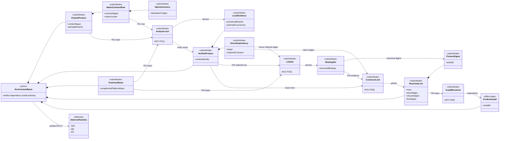
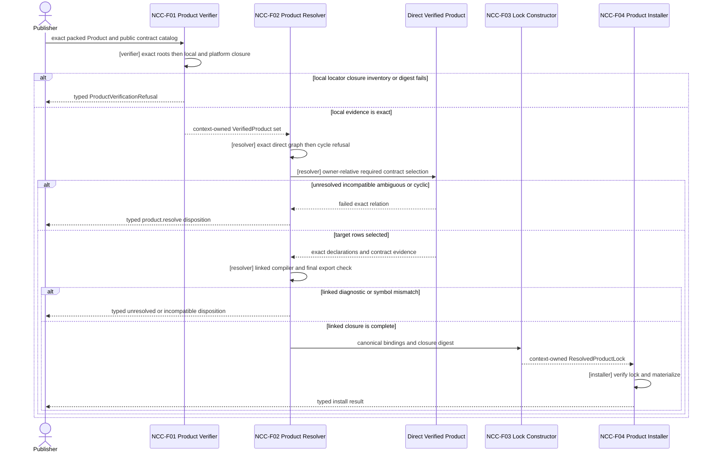
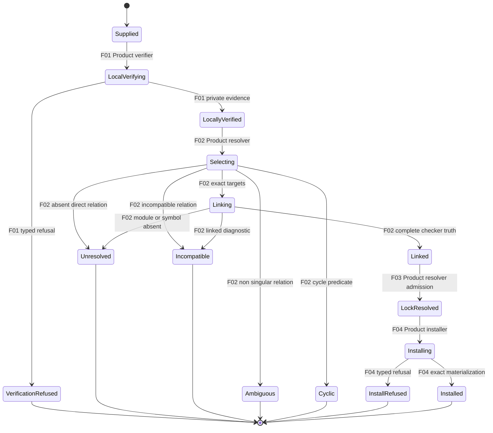

# M05 S06 Native Contract Closure Design

**Status**: Candidate design re-entry; realization held
**Date**: 2026-07-29
**Change class**: `design_reframe`
**Owner**: T-281 under T-270
**Ontology slice**: `NCC/1` (`candidate`)
**Method**: `.genesis/docs/standards/DESIGN_MODULE_METHOD.md`
**Parent design**:

- accepted M03 `EnvironmentBasis`;
- M04 public-contract publication;
- accepted S06 design at `6aaedf8d826f846a11291676413bd35f93df0ef4`;
- the four S06 recurrence contractions in T-281.

**Constitutional source**:

- `PRODUCT.md`: `A5-F01`, `A5-F05`, `A5-F06`, `A5-F13`, `ABG5-S06`;
- `REQ-P-PUBLIC-CONTRACTS-002A..005`;
- `REQ-P-CATALOG-010..014`;
- `REQ-P-INSTALL-043..058`;
- `REQ-P-POLICY-049..051`.

## 1. Boundary

Resolve one design question before S06 realization resumes:

> Derive exact native TypeScript public-contract meaning from immutable packed
> Product bytes, close external references through exact direct Product
> dependencies, and bind successful closure into the existing resolved lock.

| Global decision | Local projection | Falsified by |
|---|---|---|
| Package exports select roots. | One explicit export key has one explicit safe `types` target. | Source layout, glob, first file, or ambient package state selects a root. |
| Local contract identity covers its complete declaration closure. | `contractDigest` hashes the canonical sorted inventory required by `REQ-P-PUBLIC-CONTRACTS-002A`. | A reachable leaf changes without changing the digest. |
| Local verification does not claim external meaning. | `product.verify` closes local, self, and admitted platform declarations and records unresolved external occurrences privately. | An unresolved import or re-export becomes verified symbol truth. |
| Resolution owns final TypeScript meaning. | `product.resolve` runs one fully linked checker program over exact selected Product bytes. | A text parser, publisher roster, package label, or contract label substitutes for compiler truth. |
| Dependency authority is owner-relative. | Resolution uses the direct outgoing edges of the Product owning the containing declaration. | In `A -> B -> C`, A imports C without declaring C. |
| Imported symbols are contract-bound. | Every occurrence selects exactly one required native contract, package export, and checker-visible target symbol. | A package match, transitive contract, or nonexistent symbol passes. |
| Toolchain meaning is exact. | Compiler, standard-library, and admitted platform bytes come from the verifying ABIogenesis Product content identity. | Host TypeScript, `node_modules`, `tsconfig`, network, or path aliases affect the result. |
| Linked meaning enters lock identity. | The lock binds a canonical native-closure digest plus exact rows and direct edges. | Different source symbols, target contracts, target bytes, or link results share one lock identity. |
| Analysis evidence is subordinate. | Occurrences, bindings, diagnostics, and analyzer APIs remain Product-private. | A new Prime carrier, public analyzer, public evidence carrier, resolver service, or registry appears. |
| Installation follows closure. | `product.install` consumes the exact context-owned resolved result. | Unresolved meaning is installed, bound, admitted, or invoked. |

Included: native locators, declaration inventories, external linking, lock
identity, module placement, and proof. Excluded: new operations, catalogs,
runtime/event authority, GTL compilation or lowering, S04, M6, M7, and broad
recurrence cleanup. The JSON Pointer escape repair is an unchanged local
projection and has no Ontology or Prime delta.

## 2. Complete Function

Let `S` be one finite set of locally verified packed Products, `T_A` the exact
ABIogenesis compiler/platform basis, `E(P)` private local evidence for Product
`P`, and `B(S)` the canonical successful external-binding set.

```text
N(S) =
  sha256(canonical({
    toolchainProductContentDigest,
    bindings: B(S)
  }))

NCC-F01 AnalyzeLocalNativeContracts(P, T_A)
  -> E(P)
   | ProductVerificationRefusal

NCC-F02 LinkNativeContractSet({E(P)}, owner-indexed dependencies, T_A)
  -> B(S)
   | EnvironmentRefusal(
       unresolved_dependency
       | incompatible_dependency
       | ambiguous_dependency
       | cyclic_dependency
     )

NCC-F03 ConstructResolvedProductLock(rows(S), directEdges(S), N(S))
  -> ResolvedProductLock
   | EnvironmentRefusal

NCC-F04 InstallResolvedProduct(
  exact context-owned ResolvedProductLock,
  matching VerifiedProductArtifact
)
  -> ProductInstall
   | ProductInstallRefusal

CloseNativeContractMeaning(S) =
  AnalyzeLocalNativeContracts(each P in S)
  ; select and validate direct dependency graph
  ; reject cycles
  ; LinkNativeContractSet(S)
  ; ConstructResolvedProductLock(S)
```

`CloseNativeContractMeaning` is a higher-order composition over the accepted
`EnvironmentBasis`. It is not another Prime, operation, runtime, or catalog.

### 2.1 Local Analysis

For each native row:

1. `packageName` equals the packed package name.
2. `packageExportPath` selects one exact export entry with one explicit
   Product-relative `.d.ts`, `.d.mts`, or `.d.cts` `types` target.
3. The bundled compiler follows all package-owned relative, self-package,
   triple-slash, import-type, import-equals, and re-export edges.
4. Every reachable package-owned declaration appears once in the canonical
   inventory `(packageExportPath, declarationPath, declarationDigest)`.
5. Syntax, local, self-package, and platform diagnostics refuse. A diagnostic
   is deferrable only when tied to one recorded non-platform package
   occurrence.
6. The root, inventory, locally decidable exports, and native digest match the
   published row. Externally dependent exports remain provisional.

The admitted platform domain is the selected TypeScript libraries, `node:`
modules, `node` type directive, and their exact bundled declaration
dependencies. Every other bare package/type reference is external.

`E(P)` is deeply immutable Product-owned state under the exact successful
`product.verify` invocation in one opaque root-operation context.
`product.resolve` consumes invocation references; callers cannot submit or
rebuild `E(P)`.

### 2.2 External Occurrence And Link

The TypeScript parse/check relation emits each occurrence with:

```text
source Product content digest
+ source contract and package export
+ declaration path, digest, and source offsets
+ module specifier
+ selector: module | name(exportedName) | namespace | all
```

`default` is `name("default")`; local aliases do not change the target name.
An ambient `declare module "package"` may augment an exact resolved target but
does not mint ownership of that package coordinate.

For a declaration owned by Product `Q`:

```text
resolve(Q, specifier)
  -> local or self export of Q
   | admitted platform basis
   | exact target selected by one direct outgoing edge in D(Q)
   | refused
```

Each external occurrence requires one direct target Product, one
`requiredContractRef`, one complete native contract whose locator owns the
exact package export, and the requested checker-visible symbol where
applicable. The compiler host may follow B's direct B-to-C edge while checking
B, but that does not authorize an A-owned declaration to import C.

After binding all coordinates, the linked checker must have no unresolved or
semantic diagnostic. Its final sorted export roster must equal the published
derived roster and contain every native row's `namedSymbol`.

### 2.3 Lock Closure

Each private binding row contains exact source content/contract/declaration/
occurrence data, the canonical direct edge, and exact target
content/contract/export/symbol data. `B(S)` is the sorted complete set,
including the canonical empty set. The existing lock gains:

```text
nativeContractClosureDigest = N(S)
lockDigest = sha256(canonical({
  rows,
  dependencyEdges,
  nativeContractClosureDigest
}))
```

Raw bindings remain private. The digest alone authorizes nothing; only the
exact Product-resolver result held by its root-operation context is install
input. Source-blind verification can reproduce the digest from exact artifacts
and lock rows.

### 2.4 Total Failure Partition

| Failure relation | Owner | Existing typed result |
|---|---|---|
| unsafe, absent, or non-singular export root | `product.verify` | `unsafe_locator` or `catalog_mismatch` |
| malformed declaration or unresolved local/self relation | `product.verify` | `catalog_mismatch` |
| inventory, root, platform basis, or native digest mismatch | `product.verify` | `contract_asset_mismatch` |
| absent direct dependency, required contract, export, or symbol | `product.resolve` | `unresolved` from `unresolved_dependency` |
| multiple exact targets/contracts | `product.resolve` | `ambiguous` from `ambiguous_dependency` |
| incompatible target or linked semantic diagnostic | `product.resolve` | `incompatible` from `incompatible_dependency` |
| dependency cycle | `product.resolve` | `cyclic` from `cyclic_dependency` |
| artifact/lock/target mismatch during materialization | `product.install` | existing typed install refusal |

No verify/resolve refusal writes an install target, mutates workspace truth,
admits a catalog row, or emits an ABG runtime event.

## 3. Ontology

### 3.1 Entities And Relations

| ID | Entity/relation | Classification | Identity/authority/function |
|---|---|---|---|
| `NCC-E01` | `PackedProductArtifact` | authoritative `EnvironmentBasis` member | immutable artifact/content identity; publisher proposes, Product verifies |
| `NCC-E02` | `PublicContractCatalog` | authoritative subordinate payload | exact catalog identity/digest under owning Product |
| `NCC-E03` | `NativeTypedContractRow` | authoritative subordinate payload | exact contract/version/digest/owner/authority/capability/locator |
| `NCC-E04` | `NativeDeclarationInventory` | downstream subordinate payload | canonical native digest preimage derived from `NCC-F01` |
| `NCC-E05` | `LocalNativeContractEvidence` | private downstream payload | exact `NCC-F01` basis and unresolved external occurrences |
| `NCC-E06` | `VerifiedProductArtifact` | authoritative `EnvironmentBasis` member | immutable locally verified Product result |
| `NCC-E07` | `DeclaredDirectDependency` | authoritative subordinate payload | target Product, version/compatibility, required contracts/capabilities |
| `NCC-E08` | `ToolchainDeclarationBasis` | authoritative subordinate payload | compiler/platform bytes under ABIogenesis Product content identity |
| `NCC-E09` | `NativeContractBindingSet` | private downstream payload | complete `NCC-F02` source-to-target rows |
| `NCC-E10` | `NativeContractClosureDigest` | downstream lock payload | digest of toolchain identity plus `NCC-E09` |
| `NCC-E11` | `ResolvedProductLock` | authoritative `EnvironmentBasis` member | exact rows, direct edges, closure digest, and lock digest |
| `NCC-E12` | `ProductInstall` | authoritative effect-edge member | immutable materialization under exact `NCC-E11` |
| `NCC-R01` | local declaration closure | Product verification relation | `E01 + E02 + E03 + E08 -> E04 + E05 -> E06` |
| `NCC-R02` | owner-relative external closure | Product resolution relation | `E05 + E07 + target E06 + E08 -> E09 -> E10 -> E11` |

Cardinality and invariants:

- one native row selects one explicit package export root;
- one root has one non-empty canonical local inventory;
- each local evidence value belongs to one exact Product content identity;
- each external occurrence binds exactly once or all resolution refuses;
- authority uses the containing Product's direct edges and never transitive
  reachability;
- final checker exports, required contract, export coordinate, and requested
  symbol agree;
- one lock carries one closure digest over the complete binding set;
- changed bytes, toolchain, target, symbol, edge, or binding create a new
  contract/lock identity;
- verification and resolution are deterministic and effect-free;
- no ambient lookup or mutable current-lock relation exists.

### 3.2 Entity Lifecycle

| Entity | Identity | Authority owner | Create | Read/project | Update/transition | Retire |
|---|---|---|---|---|---|---|
| Packed Product | artifact/content digests | Product release | publisher creates archive | `F01` reads exact bytes | not_applicable: changed bytes create new identity | release retention; no S06 delete |
| Contract catalog/row/inventory | catalog/contract/digest basis | owning Product release | publication derives and embeds | `F01`, manifest, source-blind consumer | not_applicable: semantic change versions | inherits Product retirement |
| Local evidence | Product content plus verify invocation | Product verifier | `F01` derives | `F02` consumes privately | not_applicable: immutable | root-context close |
| Verified artifact | existing verified identity | Product verifier | `F01` completes `product.verify` | `F02` and public projection | not_applicable: immutable | operation/release retention |
| Toolchain basis | ABIogenesis content identity | ABIogenesis Product release | packaged and inventoried | `F01` and `F02` read | not_applicable: changed bytes create new Product | owning Product retirement |
| Binding set | resolution invocation plus exact rows | Product resolver | `F02` derives | `F03` hashes/consumes | not_applicable: immutable | root-context close |
| Resolved lock | lock ID/digest | Product resolver | `F03` constructs | install/binding/public projection | not_applicable: changed basis creates new lock | no mutable 5.0 delete |
| Product install | install ID and exact lock | Product installer | `F04` materializes | binding/install projection | not_applicable: different basis creates new install | outside S06 |

`NCC-E04`, `NCC-E07`, and `NCC-E10` inherit their owner lifecycle; no peer
ceremony or mutable transition is introduced.

### 3.3 Authority

| Function/transition | Proposer | Evaluator | Verifier | Admitter | Executor | Projector | Retirement owner |
|---|---|---|---|---|---|---|---|
| publish native contract | Product publisher | Product requirements | release/publication verifier | release cut, outside S06 | Product publication | manifest/catalog | Product release |
| `NCC-F01` local analysis | supplied Product | Product verifier | exact compiler over supplied bytes and `E08` | existing `product.verify` boundary | Product verifier | verify outcome/inventory | root context |
| `NCC-F02/F03` resolution | selected verified Products | Product resolver | owner-indexed checker, exact-match, compatibility, cycle, and digest predicates | existing `product.resolve` boundary | Product resolver | resolution outcome/lock | lock lifecycle |
| `NCC-F04` installation | exact context resolution | Product install policy | Product installer | existing install boundary | Product installer | install outcome | install lifecycle |

The compiler is deterministic verification machinery, not an authority actor.

## 4. Prime, IACS, And Module Design

### 4.1 Function Derivation

| Discovered functionality | Entity | Atomic function or template | Higher-order composition | Effect class | Required authority | Disposition |
|---|---|---|---|---|---|---|
| roots, local graph, inventory, provisional exports, occurrences | `E01..E06`, `R01` | parameterized `NCC-F01(P, row)` using `ResolveExactMatch` | `VerifyPayload ; VerifyManifest ; VerifyCatalog ; F01` | F_D | Product verifier | derived; helper detail subordinate |
| platform resolution | `E08`, `R01`, `R02` | closed branch of `NCC-F01/F02` over `E08` | local and linked compiler programs | F_D | Product verifier/resolver | derived |
| direct target/contract selection, linked program, final exports, bindings | `E05..E10`, `R02` | parameterized `NCC-F02(S)` | `SelectDirectGraph ; RejectCycle ; F02` | F_D | Product resolver | derived |
| cycle, closure digest, immutable lock | `E07`, `E09..E11`, `R02` | accepted cycle/digest predicates and `NCC-F03` | `F02 ; F03` | F_D | Product resolver | derived |
| install target write | `E11`, `E12` | existing `NCC-F04` | `F03 ; F04` | filesystem effect | Product installer | unchanged |
| public analyzer or occurrence/binding carrier | none | none | none | none | none | excluded: no irreducible public boundary |
| transitive/ambient dependency resolution | none | none | none | none | none | excluded by Product law |
| S04, M6, M7 | parent Ontology families | existing owners | none in this boundary | not in this boundary | existing owners | deferred until explicitly selected |

Ordered algebra:

```text
VerifyPayload ; VerifyManifest ; VerifyCatalog ; F01 = VerifyProductArtifact
SelectDirectGraph ; RejectCycle ; F02 ; F03 = ResolveProductLock
ResolveProductLock ; F04 = InstallProductUnderExactNativeMeaning
```

Laws: deterministic equality for exact inputs; total typed refusal; exact-one
cardinality; canonical-order independence; no effect before `F04`; no authority
widening; owner-relative directness; lock/root conservation. Associativity is
not asserted across refusal-owning stages. Private regrouping is equivalent
only when refusal precedence and complete output are unchanged. The ordered
stages are non-commutative.

### 4.2 Whole-Family Prime Contraction

| Candidate family | Contraction | Retained meaning | Authority before -> after | Accepted loss | Falsified by |
|---|---|---|---|---|---|
| local roots/walk/check/inventory/occurrences | `NCC-F01` inside Product verification | exact local meaning/refusal | candidate helpers -> one Product verifier | helper identity/public visibility | helper independently authorizes a row/symbol |
| target/specifier/symbol/link/binding | `NCC-F02` inside Product resolution | exact direct linked meaning/refusal | candidate resolvers -> one Product resolver | peer resolver/evidence APIs | linked closure differs from exact lock |
| rows/edges/cycle/closure digest | `NCC-F03` existing lock construction | one immutable complete lock | lock fragments -> one lock authority | mutable closure receipt | changed meaning retains lock identity |
| zero/one/many selection | accepted `ResolveExactMatch` | deterministic cardinality | caller meaning unchanged | first-match convenience | ambiguity selects a value |
| inventory/closure hashing | accepted canonical digest composition | exact contract/lock identity | existing owners unchanged | local hash policy | publication, verifier, resolver disagree |
| public analyzer | excluded | no required meaning | none -> none | convenience API | analyzer enters package/public operation exports |

```text
accepted IACS =
  GtlDeclarationFamily
  + ValidationFamily
  + EnvironmentBasis
  + InvocationBasis
  + TraversalAggregateFamily
  + LeafRealizationBoundary
  + RuntimeEventFamily
  + ReplayProjectionFamily

affected Prime = EnvironmentBasis only
Prime delta = none
IACS delta = none
public operation delta = none
runtime authority delta = none
```

Native closure does not add a Prime carrier. It is subordinate composition
inside the accepted `EnvironmentBasis`.

### 4.3 IACS, Promotion, And Interfaces

| Carrier | IACS role | Classification | Visibility/law |
|---|---|---|---|
| packed/verified Product, resolved lock, install | `EnvironmentBasis` | authoritative existing carriers | existing public operation/context boundaries |
| contract row and declared dependency | `EnvironmentBasis` payload | authoritative subordinate | published exact Product truth |
| native inventory | contract-row payload | downstream subordinate | published digest preimage |
| toolchain basis | ABIogenesis Product payload | authoritative subordinate | package-private exact bytes |
| local evidence and binding set | verify/resolve payload | downstream subordinate | module-private; context lifecycle |
| closure digest | resolved-lock payload | downstream subordinate | serialized in lock; no independent admission |

The inventory passes Promotion Test only as a required public digest preimage.
The closure digest passes only as one field of the existing lock. Analyzer,
occurrence, binding, diagnostic, graph, queue, and cache types fail Promotion
Test and remain private.

Public native locator:

```text
ProductNativeTypedLocator {
  packageName
  packageExportPath
  declarationPath          // derived exact types target
  namedSymbol
  exportedSymbols          // final linked checker roster
  declarationInventory[]   // NCC-F01 canonical tuples
}
```

External specifiers/occurrences are absent. Public authority is represented by
declared dependencies, required contracts, exact Product rows, and the lock's
closure digest.

| Semantic function | Authority | Abstract module/interface | Output |
|---|---|---|---|
| `F01` local analysis | Product verifier | private `Product.NativeContractAnalysis` used by `product.verify` | private `E(P)` plus existing verified result |
| inventory publication | Product publisher | owner-local build projection using the same private `F01` relation | locator inventory |
| `F02` linked closure | Product resolver | private linker in `Product.NativeContractAnalysis` | private `B(S)` and `N(S)` |
| `F03` lock construction | Product resolver | existing `Product.EnvironmentResolution` | existing lock with closure digest |
| `F04` install | Product installer | existing Product install interface | existing install |

Allowed direction is Public shell -> Product verify/resolve/install -> private
analysis/digest primitives. Forbidden dependencies are Product -> catalog
admission/HoG/ABG, analyzer -> public exports, resolver -> ambient paths, and a
global dependency map that ignores the containing Product.

## 5. Three Views

### 5.1 Domain



### 5.2 Sequence



### 5.3 Lifecycle



## 6. Cross-View Axioms

| Axiom | Ontology evidence | Authority | Domain | Sequence | State | Native enforcement | Admission/compiler enforcement | Verdict | Gap |
|---|---|---|---|---|---|---|---|---|---|
| every view derives from `NCC/1` | `E01..E12`, `F01..F04` | named owners | only declared carriers/functions | every message names function/role | every transition names owner | closed types | no unnamed service/state | pass | none |
| packed bytes select local meaning | `R01` | verifier | packed/catalog/toolchain carriers | F01 supplied bytes | local refusal/success | immutable digests | closed host | pass | none |
| exports select roots | `F01` | verifier | one row/root | F01 precedes evidence | bad root refuses | exact coordinate | zero/one/many plus safe path | pass | none |
| digest covers local closure | `E04`, `R01` | publication/verifier | complete inventory | F01 derives/compares | mismatch refuses | canonical tuple/digest | compiler closure | pass | none |
| final symbols require linked compiler | `E05`, `E09`, `R02` | resolver | provisional and final evidence distinct | F02 final checker | missing symbol unresolved | exact names/roster | TypeScript checker | pass | none |
| dependency authority is owner-relative | `E07`, `R02` | resolver | occurrence retains owner | target query uses owner | transitive bypass unresolved | exact edge | owner-indexed host | pass | none |
| linked meaning enters lock | `E09..E11`, `F03` | resolver | digest contained by lock | F02 to F03 | only Linked resolves | digest/lock types | canonical recomputation | pass | none |
| toolchain is exact Product content | `E08` | verifier/resolver | authoritative subordinate basis | F01/F02 use basis | absent basis refuses | Product content digest | path confinement | pass | none |
| no new Prime carrier/public analyzer | Prime/IACS | existing Product owners | all detail under EnvironmentBasis | existing operation functions only | no analyzer state | private types | export/roster proof | pass | none |
| no effect before install | algebra, `E12` | verify/resolve/install | install only effect edge | F04 first write | Installed only after lock | immutable results | no ABG/event dependency | pass | none |
| SDK/CLI contract unchanged | scope/IACS | Public/Product owners | no new public operation | existing verify/resolve/install | no adapter state | existing invocation/outcome | roster equality | pass | none |
| retry/continuation/probabilistic/runtime law | excluded scope | existing ABG/HoG owners | no carrier | no participant | no state | not_applicable: static F_D boundary | not_applicable: no runtime admission | not_applicable | none |
| JSON Pointer escape repair | accepted asset relation | verifier | no Ontology delta | existing verifier | existing refusal | canonical pointer | focused mutation | not_applicable: unchanged boundary | T-281 realization |
| S04/M6/M7 remain held | scope | existing owners | no carrier | no participant | no state | import boundary | scope check | pass | none |

## 7. Constructability, Lifecycle, And Proof

### 7.1 Native Constructability

The exact bundled TypeScript Compiler API supplies parser, Program, checker,
alias/export resolution, and diagnostics. The closed host exposes only selected
Product declarations and `NCC-E08`.

```text
module = NodeNext
moduleResolution = NodeNext
target = ES2022
strict = true
noEmit = true
skipLibCheck = false
typeRoots/types = exact bundled platform basis
baseUrl/paths/plugins/automatic type acquisition = absent
```

The exact compiler version owns remaining defaults. One explicit export
`types` target is admitted; nested or multiple type targets refuse rather than
selecting by condition order. Local closure is `O(V + E)` before compiler
checking; finite coordinate indexes are built once; canonical inventories and
bindings sort in `O(n log n)`. Traversal order cannot change identity.

No custom token recognizer may establish syntax, export, alias, or module
truth. The compiler emits no executable code, GTL Program, lowered plan,
route, event, or runtime decision.

### 7.2 Operational Lifecycle

| Phase | Answer | Owner/source truth |
|---|---|---|
| intent | source-independent exact public contracts | Product and S06 |
| requirement | locator/digest/dependency/install/public-operation law | cited requirement families |
| build | publisher emits declarations/inventory candidates | Product publication design |
| assurance | source-blind F01..F03 and module mutations reproduce closure | T-281 proof |
| release | exact catalog/declarations/toolchain/manifest and dependency basis | M7 release law, unchanged |
| deploy | verify and resolve supplied bytes before install | Product operations |
| live use | installed SDK/CLI/catalog consume exact contracts | S06 installed path |
| observe | typed Product outcomes/provenance only; no new telemetry | public outcomes/install provenance |
| retire | changed bytes/meaning/selection create new Product/lock | Product/install requirements |

### 7.3 Module-Owned Proof

| Law | Positive | Mutation |
|---|---|---|
| exports own roots | non-ABIogenesis declaration path verifies | hard-coded source-layout probe fails |
| inventory owns digest | multi-file re-export closure reproduces | reachable leaf change invalidates stale digest |
| compiler owns truth | valid const enum, type re-export, Unicode, semicolonless, external re-export resolve | invalid syntax, fake string export, nonexistent re-export/symbol, wrong `export =` refuse |
| dependency is owner-relative | A-to-B and B-to-C each resolve | A imports C through only A-to-B-to-C |
| required contract owns symbol | exact contract/export/symbol resolves | wrong contract/export/symbol or undeclared Product |
| linked meaning owns lock | exact closure/lock digest reproduces | source symbol, target bytes, binding, or toolchain changes under stale digest |
| analyzer is subordinate | publication/verifier/resolver share owner-local relation | Product package exports analyzer/evidence type |
| install follows resolve | exact lock installs/binds | unresolved Product creates no target |
| JSON Pointer remains canonical | object/array pointers resolve | malformed `~`, `~2`, or out-of-range pointer |
| accepted behavior conserved | S03, S05, S06, M4, external, package gates | retained S05 authority mutation stays sensitive |

Helper tests may supplement but not replace these module laws.

## 8. Realization Projection And Gate

| Design law | Projection surface | Required realization |
|---|---|---|
| native inventory | Product contract type, catalog schema, manifest generator | publish canonical inventory/root/roster only; no external occurrence field |
| private F01/F02 | Product-owned declaration analysis | one internal local/linked relation; no Product package export |
| opaque evidence | verifier and root-operation state | store immutable `E(P)` by verify invocation |
| owner-relative link | Product environment resolution | use containing Product edges and exact required contracts |
| lock closure | lock carrier/validator/digest/schema/public projection | add closure digest and include it in lock identity |
| exact install | existing installer | consume context-owned matching lock only |
| proof | S06 module/portability and retained regressions | implement Section 7.3, not helper-shape tests |

Affected realization is confined to Product contracts, private analysis,
verification, resolution, root-operation state, installation, publication
schema/generation, and S06 proof. Public operation identities, catalog, GTL,
validator, HoG, ABG, Codex shell, S03, S05, and S04 have no semantic delta.

If accepted, this file refines M04 native inventory and supersedes only the
native-contract part of M05 Section 14. It preserves the accepted four S06
recurrence contractions and forbids promoting native closure as a new Prime
carrier or public analyzer. The uncommitted implementation is a disposable
constructability probe; unmapped realization is removed rather than legalized.

**Ontology verdict**: `candidate`

**Design verdict**: `candidate`

**Implementation**: held

Independent review answers:

1. Is local versus linked TypeScript meaning complete and total?
2. Does owner-relative resolution prevent ambient and transitive authority?
3. Does every changed relation remain inside `EnvironmentBasis` without a new
   Prime carrier or public analyzer?
4. Do Ontology, lifecycle, authority, three views, IACS, interfaces, and proof
   project one meaning?
5. Does lock identity bind every change in source, target, symbol, edge,
   toolchain, and link result?
6. Can code still choose materially different authority, identity, lifecycle,
   failure, digest, dependency, or module topology?

No realization resumes until independent review and direct F_H acceptance make
both verdicts `accepted`.
