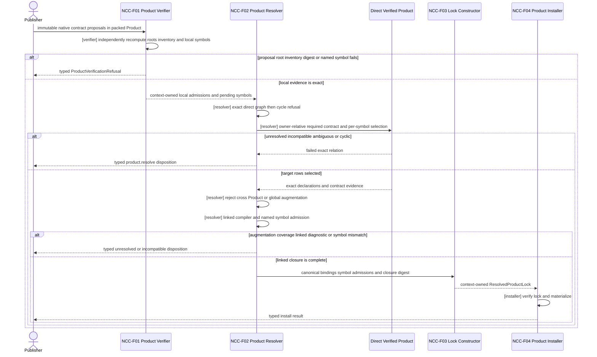
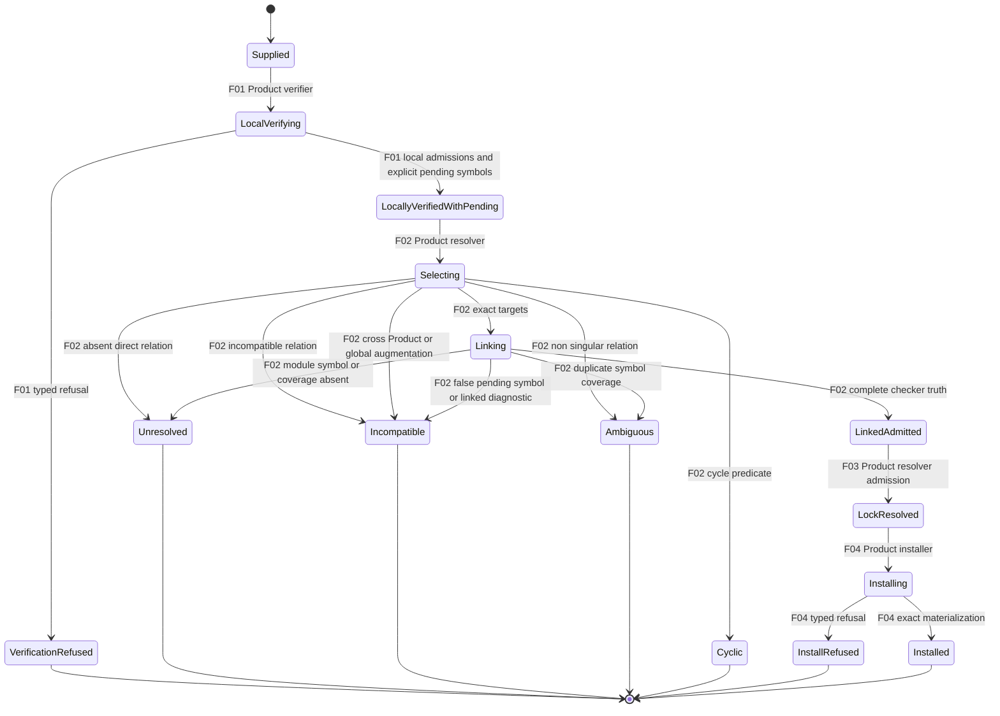

# M05 S06 Native Contract Closure Design

**Status**: Bounded replacement design candidate; realization held
**Date**: 2026-07-29
**Change class**: `design_reframe`
**Owner**: T-281 under T-270
**Ontology slice**: `NCC/1` (`candidate`)
**Method**: `.genesis/docs/standards/DESIGN_MODULE_METHOD.md`
**Returned review basis**:
`b645595c16d23e98c7f65b958fcdf3e206ad3893`
**Parent design**:

- accepted M03 `EnvironmentBasis`;
- M04 public-contract publication;
- accepted S06 design at `6aaedf8d826f846a11291676413bd35f93df0ef4`;
- the four S06 recurrence contractions in T-281.

**Constitutional source**:

- `PRODUCT.md`: `A5-F01`, `A5-F05`, `A5-F06`, `A5-F13`, `ABG5-S06`;
- `REQ-P-PUBLIC-CONTRACTS-002A..005`;
- `REQ-P-CATALOG-010..014`;
- `REQ-P-INSTALL-043..058`;
- `REQ-P-POLICY-049..051`.

## 1. Boundary

Resolve one design question before S06 realization resumes:

> Derive exact native TypeScript public-contract meaning from immutable packed
> Product bytes, close external references through exact direct Product
> dependencies, and bind successful closure into the existing resolved lock.

| Global decision | Local projection | Falsified by |
|---|---|---|
| Package exports select roots. | One explicit export key has one explicit safe `types` target. | Source layout, glob, first file, or ambient package state selects a root. |
| Publication proposes; it does not admit. | The packed catalog proposes each inventory and `namedSymbol`; `product.verify` independently admits local truth and `product.resolve` alone admits linked truth. | A publisher tool, generated roster, receipt, or self-asserted row becomes verified or resolved truth. |
| Local contract identity covers its complete declaration closure. | `contractDigest` hashes the canonical sorted inventory required by `REQ-P-PUBLIC-CONTRACTS-002A`. | A reachable leaf changes without changing the digest. |
| Local verification does not claim external meaning. | `product.verify` closes local, self, and admitted platform declarations and records unresolved external occurrences privately. | An unresolved import or re-export becomes verified symbol truth. |
| Resolution owns final TypeScript meaning. | `product.resolve` runs one fully linked checker program over exact selected Product bytes. | A text parser, publisher roster, package label, or contract label substitutes for compiler truth. |
| Dependency authority is owner-relative. | Resolution uses the direct outgoing edges of the Product owning the containing declaration. | In `A -> B -> C`, A imports C without declaring C. |
| One contract owns one symbol. | A native contract authorizes only its exact `namedSymbol` at its exact package export. | A contract authorizes the complete module roster or an unnamed symbol. |
| Namespace and star relations are covered per symbol. | The linked checker expands the relation and each crossing symbol has exactly one directly required contract whose `namedSymbol` matches. | Namespace or star import/re-export gains uncontracted or ambiguously contracted symbols. |
| Cross-Product augmentation is refused. | Product-owned global contributions and module augmentation cannot affect another Product; local/self augmentation stays within one inventoried Product. | A co-selected Product changes another Product's module or global symbol table. |
| Toolchain meaning is exact. | Compiler, standard-library, and admitted platform bytes come from the verifying ABIogenesis Product content identity. | Host TypeScript, `node_modules`, `tsconfig`, network, or path aliases affect the result. |
| Linked meaning enters lock identity. | The lock binds a canonical native-closure digest plus exact rows and direct edges. | Different source symbols, target contracts, target bytes, or link results share one lock identity. |
| Analysis evidence is subordinate. | Occurrences, bindings, diagnostics, and analyzer APIs remain Product-private. | A new Prime carrier, public analyzer, public evidence carrier, resolver service, or registry appears. |
| Installation follows closure. | `product.install` consumes the exact context-owned resolved result. | Unresolved meaning is installed, bound, admitted, or invoked. |

Included: native locators, declaration inventories, external linking, lock
identity, module placement, and proof. Excluded: new operations, catalogs,
runtime/event authority, GTL compilation or lowering, S04, M6, M7, and broad
recurrence cleanup. The JSON Pointer escape repair is an unchanged local
projection and has no Ontology or Prime delta.

## 2. Complete Function

Let `S` be one finite set of locally verified packed Products, `T_A` the exact
ABIogenesis compiler/platform basis, `P(P)` the immutable publisher proposal
inside Product `P`, `E(P)` private locally admitted evidence, and `B(S)` the
canonical successful external-binding and symbol-admission set.

```text
N(S) =
  sha256(canonical({
    toolchainProductContentDigest,
    bindings: B(S)
  }))

NCC-F01 AnalyzeLocalNativeContracts(P, P(P), T_A)
  -> E(P)
   | ProductVerificationRefusal

NCC-F02 LinkNativeContractSet({E(P)}, owner-indexed dependencies, T_A)
  -> B(S)
   | EnvironmentRefusal(
       unresolved_dependency
       | incompatible_dependency
       | ambiguous_dependency
       | cyclic_dependency
     )

NCC-F03 ConstructResolvedProductLock(rows(S), directEdges(S), N(S))
  -> ResolvedProductLock
   | EnvironmentRefusal

NCC-F04 InstallResolvedProduct(
  exact context-owned ResolvedProductLock,
  matching VerifiedProductArtifact
)
  -> ProductInstall
   | ProductInstallRefusal

CloseNativeContractMeaning(S) =
  AnalyzeLocalNativeContracts(each P in S)
  ; select and validate direct dependency graph
  ; reject cycles
  ; LinkNativeContractSet(S)
  ; ConstructResolvedProductLock(S)
```

`CloseNativeContractMeaning` is a higher-order composition over the accepted
`EnvironmentBasis`. It is not another Prime, operation, runtime, or catalog.

### 2.1 Local Analysis

The publisher supplies `packageName`, `packageExportPath`, `declarationPath`,
`namedSymbol`, `declarationInventory`, and the resulting `contractDigest`.
Those values are immutable Product-authored proposals. A publisher-side
compiler or generator may calculate them, but its process, receipt, export
roster, or analyzer state crosses no authority boundary and is not an input to
`product.verify`.

For each proposed native row, `NCC-F01` independently recomputes:

1. `packageName` equals the packed package name.
2. `packageExportPath` selects one exact export entry with one explicit
   Product-relative `.d.ts`, `.d.mts`, or `.d.cts` `types` target.
3. The bundled compiler follows all package-owned relative, self-package,
   triple-slash, import-type, import-equals, and re-export edges.
4. Every reachable package-owned declaration appears once in the canonical
   inventory `(packageExportPath, declarationPath, declarationDigest)`.
5. Syntax, local, self-package, and platform diagnostics refuse. A diagnostic
   is deferrable only when tied to one recorded non-platform package
   occurrence.
6. The root, inventory, and native digest match the proposal.
7. The proposed `namedSymbol` is checker-visible from the root. It is admitted
   locally only when its declaration and alias closure has no unresolved
   external occurrence; otherwise it is retained as
   `pending_external(namedSymbol, occurrenceRefs)`.

`namedSymbol` is the sole symbol authority proposed by one native row. The
catalog publishes no complete module export roster. An absent proposal,
invented symbol, or proposed symbol that is neither locally decidable nor tied
to exact pending occurrences refuses during `F01`.

The admitted platform domain is the selected TypeScript libraries, `node:`
modules, `node` type directive, and their exact bundled declaration
dependencies. Every other bare package/type reference is external.

`E(P)` is deeply immutable Product-owned state under the exact successful
`product.verify` invocation in one opaque root-operation context.
`product.resolve` consumes invocation references; callers cannot submit or
rebuild `E(P)`. `VerifiedProductArtifact` therefore means that all locally
decidable truth is admitted and all external meaning is explicitly pending; it
does not mean that pending symbols are resolved.

### 2.2 External Occurrence And Link

The TypeScript parse/check relation emits each occurrence with:

```text
source Product content digest
+ source contract and package export
+ declaration path, digest, and source offsets
+ module specifier
+ selector: module | name(exportedName) | namespace | all
```

`default` is `name("default")`; local aliases do not change the target name.
An external `module` selector, including a side-effect-only import, refuses in
5.0 because it can introduce meaning without symbol-bound contract coverage.

For a declaration owned by Product `Q`:

```text
resolve(Q, specifier)
  -> local or self export of Q
   | admitted platform basis
   | exact target selected by one direct outgoing edge in D(Q)
   | refused
```

For `name(s)`, the direct edge must name exactly one `requiredContractRef`
whose target native locator has the exact package export and
`namedSymbol = s`. The target checker must resolve that exact symbol.

For `namespace` and `all`, the bundled checker expands the exact symbols made
visible by that relation. Every crossing symbol must have exactly one matching
native contract among that direct edge's `requiredContractRefs`. Zero coverage
is `unresolved`; multiple coverage is `ambiguous`. `export *` and namespace
semantics use the exact bundled TypeScript checker; they do not inherit
authority from a complete module roster.

The compiler host may follow B's direct B-to-C edge while checking B, but that
does not authorize an A-owned declaration to import C.

Before linked checking, `F02` rejects:

- a Product-owned ambient module augmentation whose target package export is
  owned by another Product or the platform basis;
- a Product-owned global contribution, including script globals and
  `declare global`, when more than that Product participates in the linked
  closure; and
- an external side-effect-only module occurrence.

Local/self module augmentation remains lawful only when the base declaration,
augmentation, and every reachable file share one Product content identity and
all appear in its admitted inventory. After checking, no module or global
semantic symbol may contain declarations from more than one Product content
identity. The admitted platform basis is separate and cannot be augmented by a
Product.

After binding all coordinates, the linked checker must have no unresolved or
semantic diagnostic. It must contain every proposed native row's exact
`namedSymbol`; `F02` then admits that symbol as linked Product truth. No final
module roster is published or trusted.

### 2.3 Lock Closure

Each private binding row contains exact source content/contract/declaration/
occurrence data, the canonical direct edge, and exact target
content/contract/export/symbol data. `B(S)` is the sorted complete set,
including the canonical empty set. The existing lock gains:

```text
nativeContractClosureDigest = N(S)
lockDigest = sha256(canonical({
  rows,
  dependencyEdges,
  nativeContractClosureDigest
}))
```

Raw bindings remain private. The digest alone authorizes nothing; only the
exact Product-resolver result held by its root-operation context is install
input. Source-blind verification can reproduce the digest from exact artifacts
and lock rows.

### 2.4 Total Failure Partition

| Failure relation | Owner | Existing typed result |
|---|---|---|
| unsafe, absent, or non-singular export root | `product.verify` | `unsafe_locator` or `catalog_mismatch` |
| malformed declaration or unresolved local/self relation | `product.verify` | `catalog_mismatch` |
| proposed inventory, root, platform basis, named symbol, or native digest mismatch | `product.verify` | `contract_asset_mismatch` |
| absent direct dependency, required contract, export, named symbol, or namespace/star coverage | `product.resolve` | `unresolved` from `unresolved_dependency` |
| multiple exact targets, contracts, or per-symbol coverage rows | `product.resolve` | `ambiguous` from `ambiguous_dependency` |
| cross-Product/global augmentation, side-effect-only external relation, incompatible target, false pending symbol, or linked semantic diagnostic | `product.resolve` | `incompatible` from `incompatible_dependency` |
| dependency cycle | `product.resolve` | `cyclic` from `cyclic_dependency` |
| artifact/lock/target mismatch during materialization | `product.install` | existing typed install refusal |

No verify/resolve refusal writes an install target, mutates workspace truth,
admits a catalog row, or emits an ABG runtime event.

## 3. Ontology

### 3.1 Entities And Relations

| ID | Entity/relation | Classification | Identity/authority/function |
|---|---|---|---|
| `NCC-E01` | `PackedProductArtifact` | authoritative `EnvironmentBasis` member | immutable artifact/content identity; publisher proposes, Product verifies |
| `NCC-E02` | `NativeContractCatalogSlice` | publisher-authored subordinate proposal | exact immutable native-row slice under the public catalog identity/digest; proposal, not semantic admission |
| `NCC-E03` | `NativeTypedContractProposal` | publisher-authored subordinate payload | exact contract/version/digest/owner/authority/capability/locator and sole `namedSymbol` proposal |
| `NCC-E04` | `NativeDeclarationInventoryProposal` | publisher-authored subordinate payload | proposed canonical native digest preimage independently recomputed by `NCC-F01` |
| `NCC-E05` | `LocalNativeContractEvidence` | private downstream payload | exact `NCC-F01` local admissions, pending named symbols, and unresolved external occurrences |
| `NCC-E06` | `VerifiedProductArtifact` | authoritative `EnvironmentBasis` member | immutable locally verified Product result; carries pending cross-Product claims but admits none as truth |
| `NCC-E07` | `DeclaredDirectDependency` | authoritative subordinate payload | target Product, version/compatibility, required contracts/capabilities |
| `NCC-E08` | `ToolchainDeclarationBasis` | authoritative subordinate payload | compiler/platform bytes under ABIogenesis Product content identity |
| `NCC-E09` | `NativeContractBindingSet` | private downstream payload | complete `NCC-F02` source-to-target, per-symbol coverage, and linked symbol-admission rows |
| `NCC-E10` | `NativeContractClosureDigest` | downstream lock payload | digest of toolchain identity plus `NCC-E09` |
| `NCC-E11` | `ResolvedProductLock` | authoritative `EnvironmentBasis` member | exact rows, direct edges, closure digest, and lock digest |
| `NCC-E12` | `ProductInstall` | authoritative effect-edge member | immutable materialization under exact `NCC-E11` |
| `NCC-R01` | proposal-to-local closure | Product verification relation | `E01 + E02 + E03 + E04 + E08 -> E05 -> E06` |
| `NCC-R02` | owner-relative external closure | Product resolution relation | `E05 + E07 + target E06 + E08 -> E09 -> E10 -> E11` |

Cardinality and invariants:

- one native row selects one explicit package export root;
- one native row proposes and owns only one exact `namedSymbol`;
- within one Product, `(packageExportPath, namedSymbol)` has exactly one native
  contract proposal;
- one root has one non-empty canonical local inventory;
- the publisher's inventory and named symbol remain proposals until `F01`;
- each local evidence value belongs to one exact Product content identity;
- each pending named symbol points to one or more exact external occurrences;
- each external occurrence binds exactly once or all resolution refuses;
- each namespace/star crossing symbol has exactly one required-contract
  coverage row;
- authority uses the containing Product's direct edges and never transitive
  reachability;
- final checker symbol, required contract `namedSymbol`, export coordinate, and
  requested symbol agree;
- no admitted module/global symbol combines Product-owned declarations from
  different Product content identities;
- one lock carries one closure digest over the complete binding set;
- changed bytes, toolchain, target, symbol, edge, or binding create a new
  contract/lock identity;
- verification and resolution are deterministic and effect-free;
- no ambient lookup or mutable current-lock relation exists.

### 3.2 Entity Lifecycle

| Entity | Identity | Authority owner | Create | Read/project | Update/transition | Retire |
|---|---|---|---|---|---|---|
| Packed Product | artifact/content digests | Product release | publisher creates archive | `F01` reads exact bytes | not_applicable: changed bytes create new identity | release retention; no S06 delete |
| Catalog/contract/inventory proposal | catalog/contract/digest basis | owning Product publisher | publication proposes and embeds | `F01` independently recomputes; `F02` resolves pending meaning | not_applicable: semantic change versions | inherits Product retirement |
| Local evidence | Product content plus verify invocation | Product verifier | `F01` derives | `F02` consumes privately | not_applicable: immutable | root-context close |
| Verified artifact | existing verified identity | Product verifier | `F01` admits local truth and explicit pending symbols | `F02` and public projection | not_applicable: immutable | operation/release retention |
| Toolchain basis | ABIogenesis content identity | ABIogenesis Product release | packaged and inventoried | `F01` and `F02` read | not_applicable: changed bytes create new Product | owning Product retirement |
| Binding/symbol-admission set | resolution invocation plus exact rows | Product resolver | `F02` derives after coverage and augmentation checks | `F03` hashes/consumes | not_applicable: immutable | root-context close |
| Resolved lock | lock ID/digest | Product resolver | `F03` constructs | install/binding/public projection | not_applicable: changed basis creates new lock | no mutable 5.0 delete |
| Product install | install ID and exact lock | Product installer | `F04` materializes | binding/install projection | not_applicable: different basis creates new install | outside S06 |

`NCC-E04`, `NCC-E07`, and `NCC-E10` inherit their owner lifecycle; no peer
ceremony or mutable transition is introduced.

### 3.3 Authority

| Function/transition | Proposer | Evaluator | Verifier | Admitter | Executor | Projector | Retirement owner |
|---|---|---|---|---|---|---|---|
| publish native proposal | Product publisher | Product requirements | release/publication shape and digest checks | release cut admits immutable proposal bytes only | Product publication | manifest/catalog proposal | Product release |
| `NCC-F01` local analysis | supplied Product proposal | Product verifier | independent exact compiler over supplied bytes and `E08` | existing `product.verify` boundary admits local truth only | Product verifier | verify outcome and private local evidence | root context |
| `NCC-F02/F03` resolution | selected locally verified Products | Product resolver | owner-indexed checker, per-symbol coverage, augmentation, exact-match, compatibility, cycle, and digest predicates | existing `product.resolve` boundary alone admits linked truth | Product resolver | resolution outcome/lock | lock lifecycle |
| `NCC-F04` installation | exact context resolution | Product install policy | Product installer | existing install boundary | Product installer | install outcome | install lifecycle |

The compiler is deterministic verification machinery, not an authority actor.

## 4. Prime, IACS, And Module Design

### 4.1 Function Derivation

| Discovered functionality | Entity | Atomic function or template | Higher-order composition | Effect class | Required authority | Disposition |
|---|---|---|---|---|---|---|
| proposal, roots, local graph, inventory, local/pending named symbol, occurrences | `E01..E06`, `R01` | parameterized `NCC-F01(P, proposal)` using `ResolveExactMatch` | `VerifyPayload ; VerifyManifest ; VerifyCatalog ; F01` | F_D | Product verifier | derived; publisher output remains input proposal |
| platform resolution | `E08`, `R01`, `R02` | closed branch of `NCC-F01/F02` over `E08` | local and linked compiler programs | F_D | Product verifier/resolver | derived |
| direct target/contract/named-symbol selection, namespace/star expansion, augmentation refusal, linked program, bindings | `E05..E10`, `R02` | parameterized `NCC-F02(S)` | `SelectDirectGraph ; RejectCycle ; F02` | F_D | Product resolver | derived |
| cycle, closure digest, immutable lock | `E07`, `E09..E11`, `R02` | accepted cycle/digest predicates and `NCC-F03` | `F02 ; F03` | F_D | Product resolver | derived |
| install target write | `E11`, `E12` | existing `NCC-F04` | `F03 ; F04` | filesystem effect | Product installer | unchanged |
| public analyzer or occurrence/binding carrier | none | none | none | none | none | excluded: no irreducible public boundary |
| transitive/ambient dependency resolution | none | none | none | none | none | excluded by Product law |
| S04, M6, M7 | parent Ontology families | existing owners | none in this boundary | not in this boundary | existing owners | deferred until explicitly selected |

Ordered algebra:

```text
VerifyPayload ; VerifyManifest ; VerifyCatalog ; F01 = VerifyProductArtifact
SelectDirectGraph ; RejectCycle ; F02 ; F03 = ResolveProductLock
ResolveProductLock ; F04 = InstallProductUnderExactNativeMeaning
```

Laws: deterministic equality for exact inputs; total typed refusal; exact-one
cardinality; canonical-order independence; no effect before `F04`; no authority
widening; owner-relative directness; lock/root conservation. Associativity is
not asserted across refusal-owning stages. Private regrouping is equivalent
only when refusal precedence and complete output are unchanged. The ordered
stages are non-commutative.

### 4.2 Whole-Family Prime Contraction

| Candidate family | Contraction | Retained meaning | Authority before -> after | Accepted loss | Falsified by |
|---|---|---|---|---|---|
| proposal/local roots/walk/check/inventory/occurrences | `NCC-F01` inside Product verification | exact proposal-to-local meaning/refusal | candidate helpers -> one Product verifier | helper identity/public visibility | publisher or helper independently admits a row/symbol |
| target/specifier/per-symbol coverage/augmentation/link/binding | `NCC-F02` inside Product resolution | exact direct linked meaning/refusal | candidate resolvers -> one Product resolver | peer resolver/evidence APIs | linked closure differs from exact lock |
| rows/edges/cycle/closure digest | `NCC-F03` existing lock construction | one immutable complete lock | lock fragments -> one lock authority | mutable closure receipt | changed meaning retains lock identity |
| zero/one/many selection | accepted `ResolveExactMatch` | deterministic cardinality | caller meaning unchanged | first-match convenience | ambiguity selects a value |
| inventory/closure hashing | accepted canonical digest composition | exact contract/lock identity | existing owners unchanged | local hash policy | publication, verifier, resolver disagree |
| public analyzer | excluded | no required meaning | none -> none | convenience API | analyzer enters package/public operation exports |

```text
accepted IACS =
  GtlDeclarationFamily
  + ValidationFamily
  + EnvironmentBasis
  + InvocationBasis
  + TraversalAggregateFamily
  + LeafRealizationBoundary
  + RuntimeEventFamily
  + ReplayProjectionFamily

affected Prime = EnvironmentBasis only
Prime delta = none
IACS delta = none
public operation delta = none
runtime authority delta = none
```

Native closure does not add a Prime carrier. It is subordinate composition
inside the accepted `EnvironmentBasis`.

### 4.3 IACS, Promotion, And Interfaces

| Carrier | IACS role | Classification | Visibility/law |
|---|---|---|---|
| packed/verified Product, resolved lock, install | `EnvironmentBasis` | authoritative existing carriers | existing public operation/context boundaries |
| contract row and native locator | `EnvironmentBasis` payload | publisher-authored subordinate proposal | immutable claim; `F01/F02` own admission |
| native inventory | contract-row payload | publisher-authored subordinate proposal | public digest preimage independently recomputed by `F01` |
| declared dependency | `EnvironmentBasis` payload | authoritative subordinate | exact direct target plus required contracts/capabilities |
| toolchain basis | ABIogenesis Product payload | authoritative subordinate | package-private exact bytes |
| local evidence and binding/symbol-admission set | verify/resolve payload | downstream subordinate | module-private; context lifecycle |
| closure digest | resolved-lock payload | downstream subordinate | serialized in lock; no independent admission |

The inventory passes Promotion Test only as a required public digest preimage.
The closure digest passes only as one field of the existing lock. Analyzer,
occurrence, binding, diagnostic, graph, queue, and cache types fail Promotion
Test and remain private.

Public native locator:

```text
ProductNativeTypedLocator {
  packageName
  packageExportPath
  declarationPath          // publisher proposal; F01 recomputes exact target
  namedSymbol              // sole contract-owned symbol proposal
  declarationInventory[]   // publisher proposal; F01 recomputes exact tuples
}
```

There is no published complete module export roster. External specifiers,
occurrences, local/pending dispositions, symbol-coverage rows, augmentation
facts, and final checker evidence are absent. Public proposal identity is
represented by the exact Product row. Admitted linked authority is represented
only by declared direct dependencies, required contracts, and the resolved
lock's closure digest.

| Semantic function | Authority | Abstract module/interface | Output |
|---|---|---|---|
| proposal publication | Product publisher | publisher-owned build tooling with no verifier receipt or analyzer interface | native locator proposal only |
| `F01` local analysis | Product verifier | private `Product.NativeContractAnalysis` used independently by `product.verify` | private local admissions/pending evidence plus existing verified result |
| `F02` linked closure | Product resolver | private linker in `Product.NativeContractAnalysis` | private per-symbol `B(S)`, admitted linked symbols, and `N(S)` |
| `F03` lock construction | Product resolver | existing `Product.EnvironmentResolution` | existing lock with closure digest |
| `F04` install | Product installer | existing Product install interface | existing install |

Allowed direction is Public shell -> Product verify/resolve/install -> private
analysis/digest primitives. Forbidden dependencies are Product -> catalog
admission/HoG/ABG, publisher receipt/self-assertion -> verifier admission,
analyzer -> public exports, resolver -> ambient paths, cross-Product
augmentation, and a global dependency map that ignores the containing Product.

## 5. Three Views

### 5.1 Domain

```mermaid
classDiagram
  direction LR

  class EnvironmentBasis {
    <<prime>>
    <<authoritative>>
    +artifact dependency install authority
  }
  class PackedProduct {
    <<subordinate>>
    <<authoritative>>
    +contentDigest
    +packageExports
  }
  class NativeContractProposal {
    <<subordinate>>
    <<downstream>>
    +contractDigest
    +nativeLocator
    +namedSymbol
  }
  class NativeInventoryProposal {
    <<subordinate>>
    <<downstream>>
    +declarationTuples
  }
  class ToolchainBasis {
    <<subordinate>>
    <<authoritative>>
    -compilerAndPlatformBytes
  }
  class LocalEvidence {
    <<subordinate>>
    <<downstream>>
    -locallyAdmittedSymbols
    -pendingNamedSymbols
    -externalOccurrences
  }
  class VerifiedProduct {
    <<subordinate>>
    <<authoritative>>
    +contentIdentity
  }
  class DirectDependency {
    <<subordinate>>
    <<authoritative>>
    +target
    +requiredContracts
  }
  class BindingSet {
    <<subordinate>>
    <<downstream>>
    -canonicalBindings
    -perSymbolCoverage
    -linkedSymbolAdmissions
  }
  class ClosureDigest {
    <<subordinate>>
    <<downstream>>
    +sha256
  }
  class ResolvedLock {
    <<subordinate>>
    <<authoritative>>
    +rows
    +directEdges
    +closureDigest
    +lockDigest
  }
  class ProductInstall {
    <<effect-edge>>
    <<authoritative>>
    +installId
  }
  class AnalyzeLocal {
    <<subordinate>>
    -NCC-F01()
  }
  class LinkSet {
    <<subordinate>>
    -NCC-F02()
  }
  class ConstructLock {
    <<subordinate>>
    -NCC-F03()
  }
  class InstallResolved {
    <<subordinate>>
    -NCC-F04()
  }
  class DeferredFamilies {
    <<deferred>>
    -S04
    -M6
    -M7
  }

  EnvironmentBasis *-- PackedProduct
  EnvironmentBasis *-- VerifiedProduct
  EnvironmentBasis *-- ToolchainBasis
  EnvironmentBasis *-- ResolvedLock
  EnvironmentBasis *-- ProductInstall
  PackedProduct *-- NativeContractProposal
  NativeContractProposal *-- NativeInventoryProposal
  PackedProduct --> AnalyzeLocal : F01 input
  NativeContractProposal --> AnalyzeLocal : F01 proposal
  ToolchainBasis --> AnalyzeLocal : F01 basis
  AnalyzeLocal --> LocalEvidence : derives
  AnalyzeLocal --> VerifiedProduct : verify result
  VerifiedProduct *-- LocalEvidence
  VerifiedProduct *-- DirectDependency
  VerifiedProduct --> LinkSet : F02 selected set
  DirectDependency --> LinkSet : owner indexed edges
  ToolchainBasis --> LinkSet : F02 basis
  LinkSet --> BindingSet : derives
  BindingSet --> ClosureDigest : canonical digest
  BindingSet --> ConstructLock : F03 evidence
  VerifiedProduct --> ConstructLock : exact rows
  DirectDependency --> ConstructLock : direct edges
  ConstructLock --> ResolvedLock : admits
  ResolvedLock *-- ClosureDigest
  ResolvedLock --> InstallResolved : F04 input
  InstallResolved --> ProductInstall : materializes
  EnvironmentBasis --> DeferredFamilies : outside NCC/1
```



### 5.2 Sequence



### 5.3 Lifecycle



## 6. Cross-View Axioms

| Axiom | Ontology evidence | Authority | Domain | Sequence | State | Native enforcement | Admission/compiler enforcement | Verdict | Gap |
|---|---|---|---|---|---|---|---|---|---|
| every view derives from `NCC/1` | `E01..E12`, `F01..F04` | named owners | only declared carriers/functions | every message names function/role | every transition names owner | closed types | no unnamed service/state | pass | none |
| packed bytes select local meaning | `R01` | verifier | packed/catalog/toolchain carriers | F01 supplied bytes | local refusal/success | immutable digests | closed host | pass | none |
| publisher proposal is not admitted truth | `E02..E06`, `R01` | publisher proposes; verifier admits local truth | proposal and evidence are distinct | F01 independently recomputes | Supplied cannot skip LocalVerifying | proposal types carry no receipt | exact-byte compiler comparison | pass | none |
| exports select roots | `F01` | verifier | one row/root | F01 precedes evidence | bad root refuses | exact coordinate | zero/one/many plus safe path | pass | none |
| digest covers local closure | `E04`, `R01` | publisher proposes; verifier admits | complete inventory proposal | F01 derives/compares | mismatch refuses | canonical tuple/digest | compiler closure | pass | none |
| final symbols require linked compiler | `E05`, `E09`, `R02` | resolver | pending and admitted evidence distinct | F02 final checker | false pending symbol incompatible | exact named symbols | TypeScript checker | pass | none |
| contract authority is one named symbol | `E03`, `E07`, `E09` | Product resolver | row has sole named symbol | F02 exact contract/symbol selection | absent/duplicate coverage refuses | exact locator key | per-symbol checker binding | pass | none |
| namespace/star authority is complete | `E07`, `E09`, `R02` | Product resolver | coverage rows subordinate to binding set | F02 expands then covers each symbol | uncovered/duplicate symbol refuses | exact required-contract set | checker-enumerated relation | pass | none |
| dependency authority is owner-relative | `E07`, `R02` | resolver | occurrence retains owner | target query uses owner | transitive bypass unresolved | exact edge | owner-indexed host | pass | none |
| Product augmentation cannot widen authority | `E05`, `E09`, `R02` | resolver | declarations retain Product owner | F02 rejects before/after linked check | augmentation reaches Incompatible | owner-tagged declaration inventory | preflight plus checker owner assertion | pass | none |
| linked meaning enters lock | `E09..E11`, `F03` | resolver | digest contained by lock | F02 to F03 | only LinkedAdmitted resolves | digest/lock types | canonical recomputation | pass | none |
| toolchain is exact Product content | `E08` | verifier/resolver | authoritative subordinate basis | F01/F02 use basis | absent basis refuses | Product content digest | path confinement | pass | none |
| no new Prime carrier/public analyzer | Prime/IACS | existing Product owners | all detail under EnvironmentBasis | existing operation functions only | no analyzer state | private types | package-export boundary proof | pass | none |
| no effect before install | algebra, `E12` | verify/resolve/install | install only effect edge | F04 first write | Installed only after lock | immutable results | no ABG/event dependency | pass | none |
| SDK/CLI operation family is unchanged while Product schemas refine | scope/IACS | Public/Product owners | no new operation; locator/lock payloads change | existing verify/resolve/install operations carry refined payloads | no adapter state | existing invocation/outcome variants plus refined Product fields | operation roster equality and schema parity | pass | none |
| retry/continuation/probabilistic/runtime law | excluded scope | existing ABG/HoG owners | no carrier | no participant | no state | not_applicable: static F_D boundary | not_applicable: no runtime admission | not_applicable | none |
| JSON Pointer escape repair | accepted asset relation | verifier | no Ontology delta | existing verifier | existing refusal | canonical pointer | focused mutation | not_applicable: unchanged boundary | T-281 realization |
| S04/M6/M7 remain held | scope | existing owners | no carrier | no participant | no state | import boundary | scope check | pass | none |

## 7. Constructability, Lifecycle, And Proof

### 7.1 Native Constructability

The exact bundled TypeScript Compiler API supplies parser, Program, checker,
alias/export resolution, and diagnostics. The closed host exposes only selected
Product declarations and `NCC-E08`.

```text
module = NodeNext
moduleResolution = NodeNext
target = ES2022
strict = true
noEmit = true
skipLibCheck = false
typeRoots/types = exact bundled platform basis
baseUrl/paths/plugins/automatic type acquisition = absent
```

The exact compiler version owns remaining defaults. One explicit export
`types` target is admitted; nested or multiple type targets refuse rather than
selecting by condition order. Local closure is `O(V + E)` before compiler
checking; finite coordinate indexes are built once; canonical inventories and
bindings sort in `O(n log n)`. Traversal order cannot change identity.

Every Product-owned declaration source carries its exact Product content
identity inside the closed compiler host. Before the linked Program is
constructed, the analyzer rejects external side-effect imports,
cross-Product/module augmentation, and Product-owned global contributions in a
multi-Product closure. After checking, it confirms that no module/global
semantic symbol contains Product-owned declarations from more than one
identity. This preflight and post-check are two checks inside `F02`, not another
resolver.

No custom token recognizer may establish syntax, export, alias, or module
truth. The compiler emits no executable code, GTL Program, lowered plan,
route, event, or runtime decision.

### 7.2 Operational Lifecycle

| Phase | Answer | Owner/source truth |
|---|---|---|
| intent | source-independent exact public contracts | Product and S06 |
| requirement | locator/digest/dependency/install/public-operation law | cited requirement families |
| build | publisher emits declarations/inventory candidates | Product publication design |
| assurance | source-blind F01..F03 and module mutations reproduce closure | T-281 proof |
| release | exact catalog/declarations/toolchain/manifest and dependency basis | M7 release law, unchanged |
| deploy | verify and resolve supplied bytes before install | Product operations |
| live use | installed SDK/CLI/catalog consume exact contracts | S06 installed path |
| observe | typed Product outcomes/provenance only; no new telemetry | public outcomes/install provenance |
| retire | changed bytes/meaning/selection create new Product/lock | Product/install requirements |

### 7.3 Module-Owned Proof

| Law | Positive | Mutation |
|---|---|---|
| exports own roots | non-ABIogenesis declaration path verifies | hard-coded source-layout probe fails |
| inventory owns digest | multi-file re-export closure reproduces | reachable leaf change invalidates stale digest |
| proposal and admission are distinct | publisher inventory/named symbol are independently recomputed; an externally dependent symbol remains pending until F02 | altered proposal or publisher receipt cannot satisfy F01; false pending symbol cannot satisfy F02 |
| compiler owns truth | valid const enum, type re-export, Unicode, semicolonless, and exact external re-export resolve | invalid syntax, fake string export, nonexistent re-export/symbol, or wrong `export =` refuses |
| dependency is owner-relative | A-to-B and B-to-C each resolve | A imports C through only A-to-B-to-C |
| required contract owns only its named symbol | exact contract/export/named symbol resolves | module-roster, wrong contract/export/symbol, or undeclared Product authority refuses |
| namespace/star coverage is per symbol | every checker-expanded symbol has one directly required contract | remove one coverage contract or add duplicate coverage |
| augmentation remains owner-local | self augmentation within one inventoried Product resolves | unrelated co-selected Product augments target module or global scope |
| linked meaning owns lock | exact closure/lock digest reproduces | source symbol, target bytes, binding, or toolchain changes under stale digest |
| analyzer is subordinate | publisher proposes while verifier/resolver independently recompute through private machinery | Product package exports analyzer/evidence type or accepts a publisher receipt |
| install follows resolve | exact lock installs/binds | unresolved Product creates no target |
| JSON Pointer remains canonical | object/array pointers resolve | malformed `~`, `~2`, or out-of-range pointer |
| accepted behavior conserved | S03, S05, S06, M4, external, package gates | retained S05 authority mutation stays sensitive |

Helper tests may supplement but not replace these module laws.

## 8. Realization Projection And Gate

| Design law | Projection surface | Required realization |
|---|---|---|
| native proposal | Product locator type, catalog schema, manifest generator | publish root, sole `namedSymbol`, and inventory proposals only; remove complete export roster and external evidence |
| independent F01/F02 | Product-owned declaration analysis | verifier recomputes local truth; resolver alone admits linked truth; no Product package export or publisher receipt |
| opaque evidence | verifier and root-operation state | store immutable local/pending `E(P)` by verify invocation |
| owner-relative symbol link | Product environment resolution | use containing Product edges, exact required contracts, sole named-symbol ownership, and per-symbol namespace/star coverage |
| augmentation confinement | Product declaration analysis and resolution | permit same-Product inventoried module augmentation; reject cross-Product/module and multi-Product global contributions |
| lock closure | lock carrier/validator/digest/schema/public projection | add closure digest and include it in lock identity |
| exact install | existing installer | consume context-owned matching lock only |
| proof | S06 module/portability and retained regressions | implement Section 7.3, not helper-shape tests |

Affected realization is confined to Product contracts, private analysis,
verification, resolution, root-operation state, installation, publication
schema/generation, and S06 proof. Public operation identities, variants, and
dispatch semantics are unchanged. The native locator, public-contract catalog,
resolved-lock payload, and their serialized schemas do change and must retain
SDK/CLI parity. The catalog authority, GTL, validator, HoG, ABG, Codex shell,
S03, S05, and S04 have no semantic delta.

If accepted, this file refines M04 native inventory and supersedes only the
native-contract part of M05 Section 14. It preserves the accepted four S06
recurrence contractions and forbids promoting native closure as a new Prime
carrier or public analyzer. The uncommitted implementation is a disposable
constructability probe; unmapped realization is removed rather than legalized.

**Ontology verdict**: `candidate`

**Design verdict**: `candidate`

**Implementation**: held

Bounded independent review answers:

1. Are publisher proposal, local verification, linked resolution, and lock
   admission now acyclic and singular?
2. Does one contract authorize only its `namedSymbol`, with exact per-symbol
   coverage for namespace/star relations?
3. Do the preflight and post-check rules prevent unrelated Products from
   changing module or global meaning?
4. Do the affected Ontology, views, axioms, schema projection, and proof rows
   preserve those three decisions without reopening Prime/IACS?

No realization resumes until independent review and direct F_H acceptance make
both verdicts `accepted`.
