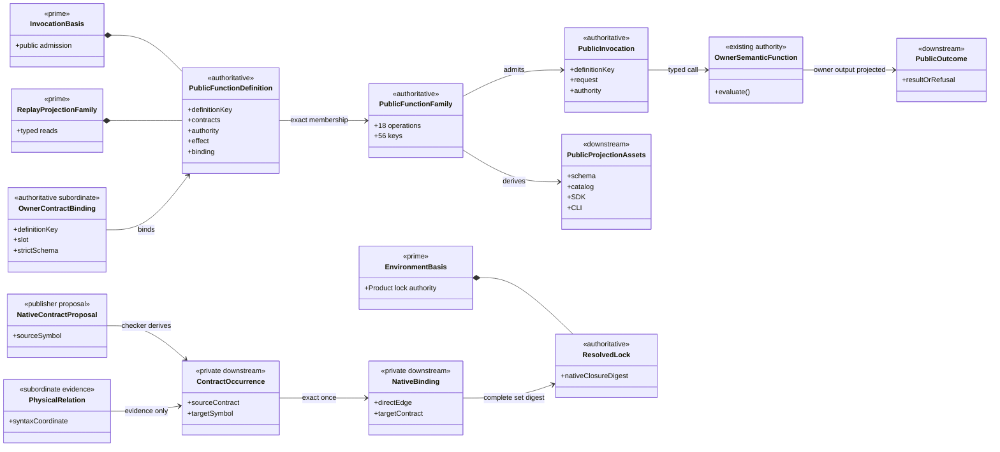
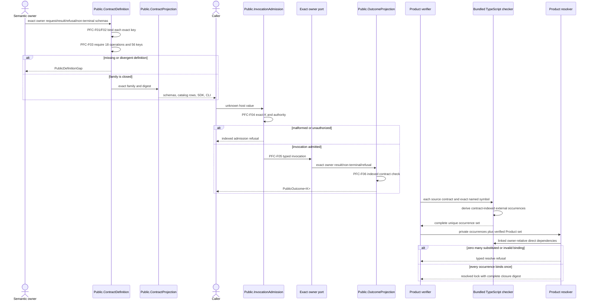
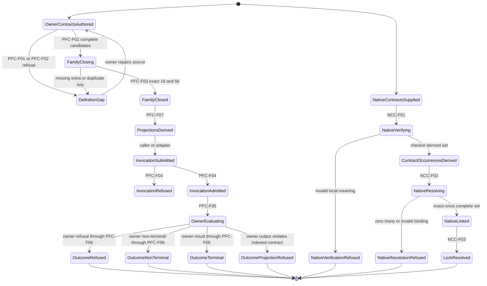

# M05 S06 Public Function And Native Occurrence Closure Design

**Status**: Bounded replacement design candidate; realization held
**Date**: 2026-07-29
**Change class**: `design_reframe`
**Owner**: T-281 under T-270
**Ontology slice**: `S06C/2` (`candidate`)
**Method**: `.genesis/docs/standards/DESIGN_MODULE_METHOD.md`
**Returned realization**:
`4953508de83ab6d6c65dbb81e5407ccb539e44e6`
**Accepted parent design**:
`M05_S06_NATIVE_CONTRACT_CLOSURE_DESIGN.md` at
`4f80f84a826de86b4cfb4d9fec3baff428dcb44a`

## 1. Authority And Supersession

This design re-enters two relations exposed by exact review of the returned
S06 realization:

1. the complete ABIogenesis 5.0 public-function algebra; and
2. the checker-derived, source-contract-indexed native occurrence relation.

It derives from:

- `PRODUCT.md`: `A5-F01`, `A5-F05`, `A5-F06`, `A5-F13`, `A5-F17`,
  `ABG5-S06`;
- `REQ-P-PUBLIC-CONTRACTS-005`, `-008..010`, `-013`;
- `REQ-P-POLICY-022..064`;
- `REQ-P-INSTALL-043..061`;
- `REQ-P-CATALOG-019..030`;
- `REQ-P-CONSENSUS-012..015`;
- `REQ-R-ABG3-PROJECTION-023`;
- `REQ-R-ABG3-SUPERVISOR-WITNESS-009`;
- accepted M03 `EnvironmentBasis`, `InvocationBasis`,
  `ReplayProjectionFamily`, and ABG runtime authority; and
- accepted S05 Consensus and S06 native-contract designs.

This file is the sole current design asset for the affected S06 delta. It:

- supersedes the public-operation-family part of
  `M04_PUBLIC_CONTRACT_PUBLICATION_BEHAVIOR_DESIGN.md`;
- re-derives useful contract evidence from
  `M04_PUBLIC_OPERATION_DEFINITION_FAMILY_BEHAVIOR_DESIGN.md`, whose prior
  19-operation authority was invalidated by T-283;
- removes the planned 5.1 tuning operation and observer/tuner read variants;
- refines only the occurrence and binding parts of the accepted
  `M05_S06_NATIVE_CONTRACT_CLOSURE_DESIGN.md`; and
- preserves the remaining accepted S06 native-closure decisions unchanged.

The old M04 files remain historical evidence. They do not co-govern this
boundary.

## 2. Boundary Decisions

| Global decision | Local projection | Falsified by |
|---|---|---|
| The 5.0 public family is complete before S06 promotion. | One exact family contains 18 operations and 56 operation-member keys. | An 11-operation portability subset is published as the release family or no later selected lane owns the missing functions. |
| Scenario scope and Product definition scope remain distinct. | S06 executes one representative installed invocation, while T-281 closes every 5.0 definition and projection. | Scenario success is used to infer absent definitions, handlers, contracts, or rows. |
| One definition binds one owning semantic function. | `PublicFunctionDefinition<K>` references exact owner request, result, refusal, non-terminal, authority, effect, capability, binding, and adapter contracts. | A metadata-only row, common handler, adapter, schema, or runtime branch authors missing meaning. |
| Owner contracts are singular. | One strict native schema is the source of the TypeScript type, raw parser, canonical JSON Schema, and closed domain for each slot. | A handwritten interface, parser, generated schema, or handler check independently narrows or widens the value domain. |
| Relational request laws are structural. | Exact sums encode all-or-none, exactly-one, conditional, and ref/digest laws in both native and serialized contracts. | Optional fields type-check while parser or handler later rejects their relation. |
| Outcomes are operation indexed. | `PublicOutcome<K>` contains only `ResultOf<K>`, `NonTerminalOf<K>`, or `RefusalOf<K>`. | `JsonValue`, `{}`, a generic result envelope, or handler-local check supplies operation meaning. |
| Adapters are projections. | SDK, CLI, and Codex coordinates derive from the exact family and transport the same invocation/outcome. | An adapter owns a variant roster, default, parser, result shape, exit map, or semantic branch. |
| Publication is a read model. | Native symbols, schemas, operation rows, capability rows, SDK members, CLI grammar, and docs derive from one family digest. | Aggregate schemas exist without addressable operation rows or parallel registers disagree. |
| Physical TypeScript syntax is not a semantic occurrence. | Parser/checker relations remain subordinate evidence. | One raw import/re-export identity becomes the unit of contract authority or binding cardinality. |
| Native occurrences are source-contract indexed. | The checker derives one occurrence per exact source contract and externally contributing target symbol. | An uncontracted subordinate root creates a false owner, or two source contracts share one occurrence identity. |
| TypeScript checker meaning is final. | Alias, namespace, star, type query, shadowing, and value/type use derive from checker symbols. | `SymbolFlags.Type`, text parsing, or relation-kind heuristics override a valid linked Program. |
| Every semantic occurrence binds exactly once. | `ContractExternalOccurrenceRef -> NativeContractBinding` is a total one-to-one relation. | Zero, duplicate, substituted, or cross-contract binding reaches a resolved lock. |
| Existing architecture remains singular. | Public closure stays under `InvocationBasis` and `ReplayProjectionFamily`; native closure stays under `EnvironmentBasis`. | A new Prime family, registry, analyzer API, runtime, event family, controller, or catalog appears. |
| Broader Prime compression remains held. | No GraphFunction identity, sequence, key-set, uniqueness, digest, reference, or record contraction enters this cut. | The selected post-S06 entropy work is implemented before S06 acceptance. |

Included:

- complete public-function definition and projection law;
- exact owner contract packets;
- common invocation/outcome admission;
- operation rows, SDK, CLI, Codex, and schema projection;
- source-contract-indexed native occurrences;
- exact-once native binding; and
- module-owned falsification.

Excluded:

- new Product meaning beyond active requirements;
- a schema service, code generator service, public analyzer, or generic
  controller;
- successful release publication before M7 authority exists;
- planned 5.1 observer/tuner operations;
- broader Prime entropy reduction;
- S04 realization, M6 qualification, and M7 release execution.

### 2.1 Requirement Traceability

| Constitutional source | Global decision | Local design projection | Falsification |
|---|---|---|---|
| `REQ-P-PUBLIC-CONTRACTS-005`, `-008` | complete public family | Section 4.1 exact 18-operation/56-key family | missing, extra, legacy, or 5.1 key |
| `REQ-P-PUBLIC-CONTRACTS-009..010`; `REQ-P-POLICY-062..064` | one indexed request/result/refusal/non-terminal authority | Sections 4.2, 4.4, and 4.5 | native/parser/schema/runtime disagreement or generic payload/outcome |
| `REQ-P-POLICY-022`, `-044..045` | SDK, CLI, and Codex are projections | PFC-F07 plus exact adapter exit maps | adapter-specific roster, validation, semantics, or outcome |
| `REQ-P-POLICY-023..040`, `-049..061` | every operation binds its owning complete semantic function | Section 4.4 owner packet | metadata, handler, or prose supplies an absent relation |
| `REQ-P-CATALOG-019..030`; `REQ-R-ABG3-PROJECTION-023` | project reads and catalog relations are closed and pure | Section 4.3 and catalog rows in Section 4.4 | free projection string, widened view, or read effect |
| `REQ-P-CONSENSUS-012..015` | Consensus uses ordinary start/respond/continue/read members | start, interaction, continuation, result/replay, and ticket-consensus definitions | Consensus-specific operation or missing public projection |
| `REQ-P-INSTALL-043..061` | verify, resolve, install, bind, create, and open remain distinct | operation packets and authority-slot matrix | resolve/install cycle, implicit binding, or hidden install |
| accepted `M05_S06_NATIVE_CONTRACT_CLOSURE_DESIGN.md` | compiler and direct Product dependencies own native closure | Sections 5.1..5.3 | text/flag heuristic, transitive authority, or ambient package meaning |
| `DESIGN_MODULE_METHOD.md` | Ontology precedes IACS and realization | Sections 6..12 | code must choose an entity, function, authority, lifecycle, or module relation |

## 3. Complete Function

Let `K` be one member of the closed 5.0 definition-key set, `Owner(K)` its
semantic owner, and `Contract(K, slot)` its exact owner-native contract.

```text
PFC-F01 AdmitOwnerContract(K, slot, owner schema and authority)
  -> OwnerContractBinding<K, slot>
   | PublicDefinitionGap

PFC-F02 ConstructPublicFunctionDefinition(
  K,
  request/result/refusal/non-terminal bindings,
  authority/effect/binding/capability/adapter metadata
)
  -> PublicFunctionDefinition<K>
   | PublicDefinitionGap

PFC-F03 ClosePublicFunctionFamily(
  exact definitions for all 56 K
)
  -> PublicFunctionDefinitionFamily
   | PublicDefinitionGap

PFC-F04 AdmitPublicInvocation<K>(
  family,
  unknown host value
)
  -> PublicInvocation<K>
   | AdmissionRefusalFor<K>

PFC-F05 InvokeOwningSemanticFunction<K>(
  admitted invocation,
  exact owner port
)
  -> OwnerResultOf<K>
   | OwnerNonTerminalOf<K>
   | OwnerRefusalOf<K>

PFC-F06 ProjectPublicOutcome<K>(
  admitted invocation,
  exact owner output
)
  -> PublicOutcome<K>
   | OutcomeProjectionRefusal

PFC-F07 DerivePublicProjections(
  closed family
)
  -> native exports
   + canonical schemas
   + public-contract and operation rows
   + SDK members
   + CLI grammar and exit maps
   + documentation inventory
```

The complete public composition is:

```text
owner semantic contracts
  -> PFC-F01 each exact slot
  -> PFC-F02 each exact K
  -> PFC-F03 exact family closure
  -> PFC-F07 immutable projections

unknown host value
  -> PFC-F04<K>
  -> PFC-F05<K>
  -> PFC-F06<K>
```

`PFC-F03` and `PFC-F07` are deterministic build compositions. They are not
runtime dispatch services. `PFC-F05` is a typed higher-order call to the
operation's existing owner; Public does not implement owner semantics.

The native closure composition is:

```text
NCC-F01 AnalyzeLocalNativeContracts(
  one Product,
  exact contract proposals,
  exact compiler basis
)
  -> locally admitted symbols
   + ContractExternalOccurrenceSet
   | ProductVerificationRefusal

NCC-F02 LinkNativeContractSet(
  locally verified Products,
  owner-indexed direct dependencies,
  exact compiler basis
)
  -> exact NativeContractBindingSet
   | unresolved | incompatible | ambiguous | cyclic

NCC-F03 ConstructResolvedProductLock(
  exact Product rows,
  direct edges,
  complete native binding set
)
  -> ResolvedProductLock
```

## 4. Public Function Definition Algebra

### 4.1 Closed Family

The exact 5.0 family has 18 operation identities and 56 definition keys. The
counts are derived no-silence checks, not Product scope.

| Operation | Exact member keys | Semantic owner | Workspace binding | Actor | Effect |
|---|---|---|---|---|---|
| `abg.operation.workspace.create` | `clean`, `imported` | Product workspace | forbidden | required | workspace filesystem |
| `abg.operation.workspace.open` | `open` | Product workspace | forbidden | forbidden | read/admission |
| `abg.operation.project.read` | 24 cases in Section 4.3 | owning projection family | per case | forbidden | pure read |
| `abg.operation.product.verify` | `verify` | Product verifier | forbidden | forbidden | deterministic attestation |
| `abg.operation.product.resolve` | `resolve` | Product resolver | forbidden | forbidden | deterministic evaluation |
| `abg.operation.product.install` | `install` | Product installer | forbidden | required | immutable filesystem |
| `abg.operation.workspace.bind` | `bind` | Product environment | forbidden | required | binding persistence |
| `abg.operation.catalog.admit` | `admit` | Product catalog admission | exactly one | required | catalog admission |
| `abg.operation.catalog.view` | `allowlist` | Product catalog projection | exactly one | required | deterministic narrowing |
| `abg.operation.catalog.apply` | `node_type`, `overlay` | Product application plus ABG admission | exactly one | required | non-runtime application admission |
| `abg.operation.run.invoke` | `invoke`, `start` | Product/GTL/HoG/ABG composition | exactly one | required | ABG traversal |
| `abg.operation.run.continue` | `current_intent`, `selected_action` | Product/ABG/HoG continuation | exactly one | required | ABG continuation |
| `abg.operation.interaction.respond` | `select`, `approve`, `reject`, `assess`, `answer_escalation` | Product F_H validation plus ABG admission | exactly one | required | F_H response event |
| `abg.operation.result.assess` | `assess` | Product result assessment plus ABG admission | exactly one | required | assessment event |
| `abg.operation.witness.admit` | `reprice`, `attest`, `hygiene-stamp`, `intake`, `run-resumed`, `run-stopped` | ABG witnessed-act admission | exactly one | required | witnessed event |
| `abg.operation.conformance.evaluate` | `gtl_program` | GTL validator/Product conformance | exactly one | required | deterministic assessment |
| `abg.operation.product.materialize` | `context_bootstrap`, `configuration` | Product materializer | exactly one | required | product filesystem |
| `abg.operation.release.snapshot` | `published_rc`, `tapped_release` | release authority/materializer | exactly one | required | immutable release publication |

Reserved 5.1 members are absent:

- `abg.operation.tuning.transition`;
- `project.read(observer_report)`;
- `project.read(observer_drafts)`; and
- `project.read(tuning_report)`.

Legacy identities and aliases are absent. In particular,
`run.invoke(direct)` is invalid; direct GraphFunction invocation is
`run.invoke(invoke)`.

### 4.2 Definition Shape

Each owner supplies strict native contracts:

```text
OwnerContractBinding<K, Slot, S> = {
  definitionKey: K
  slot: request | result | refusal | non_terminal
  ownerAuthorityRef
  ownerAuthorityDigest
  schema: strict NativeSchema<S>
  nativeLocator
  schemaCoordinate
  projectionWitness
}

RequestOf<K> = InferOutput<RequestSchemaOf<K>>
ResultOf<K> = InferOutput<ResultSchemaOf<K>>
RefusalOf<K> = InferOutput<RefusalSchemaOf<K>>
NonTerminalOf<K> =
  NonTerminalSchemaOf<K> is present
    ? InferOutput<NonTerminalSchemaOf<K>>
    : never

PublicFunctionDefinition<K> = {
  definitionKey: K
  version: "5.0.0"
  requestContract: OwnerContractBinding<K, request>
  resultContract: OwnerContractBinding<K, result>
  refusalContract: OwnerContractBinding<K, refusal>
  nonTerminalContract: OwnerContractBinding<K, non_terminal> | null
  semanticAuthorityRef
  semanticAuthorityDigest
  authorityClass: pure | read | write | attestation
  effectClass
  eventAdmission:
    none | owning_semantic_authority | immutable_artifact_boundary
  actorRequirement: forbidden | required
  workspaceBindingRequirement: forbidden | exactly_one
  authoritySlotRequirements
  capabilityRefs
  defaults
  closedDomains
  schemaCoordinates
  sdkCoordinate
  cliCoordinate
  adapterExitMap
  definitionDigest
}
```

The selected TypeScript strict lane uses one strict Valibot owner schema per
slot. Its inferred output type is the native type, its parse is raw admission,
and its canonical JSON Schema is generated from that same schema. Exact
dependency versions are immutable build inputs. Unsupported schema projection
constructs are design/build gaps and cannot fall back to `{}`, a handwritten
schema, or handler validation.

Conditional laws are owner-schema sums:

- all-or-none pairs are a union of complete-present and complete-absent
  objects;
- exactly-one groups are a union whose members each require one group and
  forbid the others;
- ref/digest values are one closed relational object;
- nullable paired fields are one present-or-null sum; and
- variant-specific values are discriminated by `K`.

The TypeScript type, parser, schema, and handler therefore admit the same
domain. Field metadata is explanatory projection only and cannot generate a
weaker native type.

Definition identity is canonical:

```text
DefinitionDigestProjection<K> = {
  definitionKey
  version
  request/result/refusal/non-terminal contract coordinates and witness digests
  semantic authority and digest
  authority/effect/event classes
  actor and authority-slot requirements
  capability refs
  defaults and closed domains
  schema/native/SDK/CLI coordinates
  adapter exit map
}

definitionDigest(K) =
  sha256(RFC8785(DefinitionDigestProjection<K>))

FamilyDigestProjection =
  exact operation-keyed and member-keyed map of definition digests

familyDigest =
  sha256(RFC8785(FamilyDigestProjection))
```

Neither projection includes its own digest, schema functions, object identity,
function source text, or loader order.

For operation suffix `S = operationId` without `abg.operation.`, dots become
path separators only in asset paths. The family derives:

- native unions `Pascal(S)Request`, `Pascal(S)Result`,
  `Pascal(S)Refusal`, and any `Pascal(S)NonTerminal`;
- schema IDs `abg.schema.operation.S.request`, `.result`, `.refusal`, and
  `.non-terminal` when applicable;
- paths `contracts/schemas/operations/<S path>/<slot>.schema.json`;
- one operation row keyed by the exact operation identity and containing its
  closed member definitions;
- SDK coordinate `sdk.S`; and
- the exact CLI coordinate in Section 4.6.

The common rows `abg.schema.public-operation-contract`,
`abg.schema.public-operation-invocation`, and
`abg.schema.public-operation-outcome` bind the same family version and digest.
Generated member definitions may be addressable JSON Schema `$defs`; they do
not become separately authored contracts.

### 4.3 Closed Project Read Relation

Every read request contains:

```text
ProjectReadRequest<C> = {
  caseKey: C
  source: {
    sourceKind: SourceKindOf<C>
    sourceRef
    sourceDigest
  }
  projectionBasis: {
    projectionBasisRef
    projectionBasisDigest
  }
  selector: SelectorOf<C>
}
```

Every result is `ProjectReadResult<C>` carrying the exact case, source,
projection basis, and `ProjectionOf<C>`. Reads admit no event and return no
non-terminal outcome.

| Case | Source | Result | Binding | Additional selector |
|---|---|---|---|---|
| `catalog_list` | Catalog | CatalogListProjection | exactly one | workspace catalog or exact session view |
| `catalog_describe` | Catalog | CatalogDescriptionProjection | exactly one | visibility basis plus canonical handle |
| `workspace_status` | WorkspaceBinding | WorkspaceStatusProjection | exactly one | empty |
| `run_status` | Run | RunStatusProjection | exactly one | empty |
| `graph_call_status` | GraphCall | GraphCallStatusProjection | exactly one | empty |
| `run_result` | Run | RunResultProjection | exactly one | empty |
| `graph_call_result` | GraphCall | GraphCallResultProjection | exactly one | empty |
| `run_evidence` | Run | EvidenceProjection<Run> | exactly one | empty |
| `graph_call_evidence` | GraphCall | EvidenceProjection<GraphCall> | exactly one | empty |
| `result_evidence` | RuntimeResult | EvidenceProjection<RuntimeResult> | exactly one | empty |
| `assessment_evidence` | ResultAssessment | EvidenceProjection<ResultAssessment> | exactly one | empty |
| `witness_evidence` | WitnessedAct | EvidenceProjection<WitnessedAct> | exactly one | empty |
| `install_evidence` | InstalledProduct | EvidenceProjection<InstalledProduct> | forbidden | exact InstallManifest |
| `release_evidence` | ReleaseCut | EvidenceProjection<ReleaseCut> | forbidden | exact ReleaseSnapshotManifest |
| `workspace_replay` | WorkspaceBinding | ReplayProjection<WorkspaceBinding> | exactly one | event log, `fromOrdinal`, `limit` |
| `run_replay` | Run | ReplayProjection<Run> | exactly one | `fromOrdinal`, `limit` |
| `graph_call_replay` | GraphCall | ReplayProjection<GraphCall> | exactly one | `fromOrdinal`, `limit` |
| `interaction_replay` | FhInteraction | ReplayProjection<FhInteraction> | exactly one | `fromOrdinal`, `limit` |
| `continuation_replay` | Continuation | ReplayProjection<Continuation> | exactly one | `fromOrdinal`, `limit` |
| `c_call_replay` | CProgramAtomReceipt | ReplayProjection<CProgramAtomReceipt> | exactly one | C-call ref/digest, `fromOrdinal`, `limit` |
| `workspace_gaps` | WorkspaceBinding | GapProjection<WorkspaceBinding> | exactly one | exact admitted gap basis |
| `run_gaps` | Run | GapProjection<Run> | exactly one | empty |
| `run_lawful_actions` | Run | LawfulActionProjection | exactly one | exact NextActionProjection |
| `ticket_consensus` | ConsensusResult | TicketConsensusProjection | exactly one | ticket, output authority, replay basis |

The read refusal family is:

```text
unknown_source
| source_kind_mismatch
| source_digest_mismatch
| projection_basis_mismatch
| projection_unsupported
| not_found
| not_ready
| catalog-only:
    unknown_handle | ambiguous_handle | hidden_by_view
    | incompatible | unbound | inadmissible
| replay-only:
    cursor_invalid | range_invalid
```

`fromOrdinal` is a safe non-negative integer and `limit` a safe positive
integer. No free source/projection string, broad subordinate source, ambient
cursor, or handler-selected read case is lawful.

### 4.4 Exact Owner Contract Packet

All request objects are closed. Every named ref paired with a digest is
verified before effect.

| Operation/member | Required request relation | Exact terminal result | Semantic refusal | Non-terminal |
|---|---|---|---|---|
| `workspace.create(clean)` | target root, literal clean policy, explicit scaffold policy | workspace identity, authority mode, scaffold/bootstrap state, creation manifest, provenance | invalid target, exists, identity conflict, invalid scaffold, filesystem failure | none |
| `workspace.create(imported)` | target root, imported authority ref/digest, preservation policy | imported workspace identity and preserved-state manifest | clean refusals plus invalid import authority or preservation failure | none |
| `workspace.open(open)` | target root and expected authority ref/digest | ready, unbound, stale, malformed, or incompatible WorkspaceOpenProjection | invalid target, missing workspace, authority mismatch | none |
| `product.verify(verify)` | exact `packed_artifact` or `installed_artifact` target sum; both carry artifact/content, descriptor, contribution manifest, expected contracts, and declared dependency/compatibility inputs; installed target alone carries its resolved lock and install coordinates | verified artifact, every checked identity, locally admitted native truth plus explicit pending external meaning, typed residuals, provenance | artifact/content/identity/descriptor/contribution mismatch, invalid declared dependency, unsupported contract; installed target also admits lock mismatch or stale installed state | none |
| `product.resolve(resolve)` | non-empty unique Product requirements and candidate coordinates | exact resolved lock and one selection per required Product | invalid, unresolved, incompatible, ambiguous, cyclic | none |
| `product.install(install)` | verified artifact, descriptor, contribution manifest, exact resolved lock, target, install policy | installed Product and install/installer manifests with provenance | verification, target, identity/content/descriptor/contribution/lock/contract/filesystem failure | none |
| `workspace.bind(bind)` | workspace authority, non-empty installed set, resolved lock, complete declared roots | immutable binding and manifest | workspace/product/lock/content/root/binding/incompatibility refusal | none |
| `catalog.admit(admit)` | exact binding, lock, descriptors, contribution manifests | catalog plus exactly one `admitted`, `rejected`, `incompatible`, `conflicting`, `unready`, or `unresolved` disposition row per submitted contribution row | malformed descriptor/contribution, binding or lock mismatch, or input/output conservation failure | none |
| `catalog.view(allowlist)` | catalog and unique narrowing handles | exact view identity, effective handles, residuals | unknown, duplicate, ambiguous, unauthorized, inadmissible, not ready | none |
| `catalog.apply(node_type|overlay)` | exact view row, validated value, target where node_type, Product validation receipt, contributor basis | application identity preserving row/value/target/membership/provenance | kind/view/readiness/target/application/callability refusal | none |
| `run.invoke(invoke)` | admitted Program and GraphFunction, input contract/value, view, binding, policy, grants, actor | Run and GraphCall with `completed`, `blocked`, or `runtime_failed` terminal truth, result/evidence/replay refs | invalid Program/function/input/view/intent/capability before Run admission | held, gap_stop |
| `run.invoke(start)` | admitted Program, scope, public target, until, root/F_H modes, input, view, binding, policy, grants, actor | Run and nullable GraphCall with `completed`, `blocked`, or `runtime_failed` terminal truth, result/evidence/replay refs | invoke refusals plus invalid target/mode/until before Run admission | held, gap_stop |
| `run.continue(current_intent)` | Run, continuation, current intent, admitted response/input, expected basis, actor/grant | continued Run with `completed`, `blocked`, or `runtime_failed` terminal truth, successor/evidence/replay refs | missing/resolved continuation or intent/response/replay/basis refusal before continuation admission | held, gap_stop |
| `run.continue(selected_action)` | Run, continuation, exact NextActionProjection, same-basis or covering-reprice relation, actor/grant | admitted construction intent then `completed`, `blocked`, or `runtime_failed` Run/GraphCall truth | stale/mismatched action or intent/reprice/basis refusal before continuation admission | held, gap_stop |
| `interaction.respond(*)` | interaction, response contract, exact variant value/choice, actor, capability, evidence, basis | response admission and current interaction projection | missing/resolved interaction, kind/contract/choice/value/capability/basis refusal | responded while Run remains held |
| `result.assess(assess)` | expected result, assessment contract/value, actor/capability, evidence, current basis | admitted or rejected assessment with closure eligibility | result/digest/contract/value/capability/evidence/basis refusal | retry, blocked |
| `witness.admit(*)` | actor, subject, exact act, typed reason/payload, applicable context, evidence, provenance | actor-attributed witnessed act and evidence | actor/subject/act/content/context/evidence/provenance/basis refusal | none |
| `conformance.evaluate(gtl_program)` | Program, conformance law, program-only or declared-inventory basis | passed/failed conformance result, diagnostics, violated laws, evidence, repairs | invalid Program, law/inventory mismatch, assessment blocked | none |
| `product.materialize(context_bootstrap)` | target workspace, exact binding, declared context inputs | content-addressed bootstrap asset and manifest with created/refreshed/preserved rows | workspace/binding/input/authority/filesystem refusal | none |
| `product.materialize(configuration)` | configuration contract, binding, typed inputs | configuration content and materialization manifest | contract/binding/input/mutable-default/filesystem refusal | none |
| `release.snapshot(published_rc)` | pre-RC basis, matching law/verdict, requested prospective RC identity | immutable RC cut, artifact and snapshot manifests, provenance | subject/basis/law/verdict/bypass/identity/bytes/publication refusal | none |
| `release.snapshot(tapped_release)` | final-tap basis/law/verdict, accepted RC, installed-RC qualification, FinalTapDelta | immutable 5.0 cut, artifact and snapshot manifests, provenance | RC/install/delta/gate refusals plus published-RC refusals | none |

Admission refusal is derived per `K`:

```text
unknown_definition
| unknown_variant
| invalid_request
| contract_catalog_mismatch
| authority_mismatch
| binding_missing | binding_forbidden | binding_mismatch when applicable
| actor_missing | capability_missing | catalog_scope_mismatch when applicable
```

Classification is total:

- malformed, unauthorized, mismatched, or otherwise non-admitted requests are
  `RefusalOf<K>`;
- after the owning effect is admitted, completed, blocked, failed, rejected,
  failed-conformance, stale-open, and per-row catalog dispositions are typed
  `ResultOf<K>` members rather than ingress refusals; and
- held, gap-stop, responded, retry, and assessment-blocked states declared by
  the matrix are `NonTerminalOf<K>`.

An owner cannot report the same disposition in two slots. The adapter exit map
classifies the public slot, not a free-form disposition string.

Successful release snapshot execution remains blocked until M7 supplies its
exact qualification authority. The function, contracts, handler binding, and
typed refusal exist before M5 freeze; a placeholder success or
`not_implemented` refusal is prohibited.

### 4.5 Common Invocation And Outcome

```text
PublicInvocation<K> = {
  kind: "public_invocation"
  schemaVersion: "5.0.0"
  definitionRef
  definitionDigest
  operationId: K.operationId
  memberKey: K.memberKey
  invocationRef
  correlationId
  eventTime
  invocationAuthority: InvocationAuthority<K>
  workspaceBinding:
    K requires one ? RefDigest<WorkspaceBinding> : forbidden
  request: RequestOf<K>
  expectedResultSchemaRef
  expectedRefusalSchemaRef
  expectedNonTerminalSchemaRef: Ref | null
}

PublicOutcome<K> =
  | {
      kind: "public_terminal_result"
      definitionKey: K
      invocationRef
      result: ResultOf<K>
      provenance
    }
  | {
      kind: "public_non_terminal_result"
      definitionKey: K
      invocationRef
      result: NonTerminalOf<K>
      provenance
    }
  | {
      kind: "public_refusal"
      definitionKey: K
      invocationRef
      refusal: AdmissionRefusalFor<K> | RefusalOf<K>
      provenance
    }
```

`InvocationAuthority<K>` is an exact conditional object. It requires or
forbids Product set, dependency lock, catalog scope, execution Program,
GraphFunction, input contract, session policy, capability grants, actor
attribution, and transport steering according to `K`. An absent required slot
and a present forbidden slot are unrepresentable natively and refuse raw
admission.

The authority-slot relation is:

| Definition keys | Product set | Dependency lock | Catalog scope | Execution Program/GraphFunction | Session policy/grants/steering |
|---|---|---|---|---|---|
| `workspace.create(*)`, `workspace.open(open)`, `product.resolve(resolve)` | forbidden | forbidden | forbidden | forbidden | forbidden |
| `product.verify(verify, packed_artifact)` | forbidden | forbidden | forbidden | forbidden | forbidden |
| `product.verify(verify, installed_artifact)` | forbidden | exactly one | forbidden | forbidden | forbidden |
| `product.install(install)` | forbidden | exactly one | forbidden | forbidden | forbidden |
| `workspace.bind(bind)` | exactly one | exactly one | forbidden | forbidden | forbidden |
| `project.read(install_evidence|release_evidence)` | forbidden | forbidden | forbidden | forbidden | forbidden |
| `project.read(catalog_list|catalog_describe)` | exactly one | exactly one | workspace catalog or exactly one matching session view, selected by the request | forbidden | forbidden |
| every other bound `project.read` case | exactly one | exactly one | forbidden | forbidden | forbidden |
| `catalog.admit(admit)` | exactly one | exactly one | forbidden because it creates catalog truth | forbidden | forbidden |
| `catalog.view(allowlist)` | exactly one | exactly one | forbidden because it creates the narrowed view; request carries the source catalog | forbidden | forbidden |
| `catalog.apply(node_type|overlay)` | exactly one | exactly one | exactly one | forbidden | forbidden |
| `run.invoke(*)`, `run.continue(*)` | exactly one | exactly one | exactly one | exactly one | exactly one |
| `interaction.respond(*)`, `result.assess(assess)`, `witness.admit(*)`, `conformance.evaluate(gtl_program)`, `product.materialize(*)`, `release.snapshot(*)` | exactly one | exactly one | forbidden | forbidden | forbidden |

`product.verify` uses one structural target sum inside the exact `verify`
member. The packed member is the pre-resolution path used by S06; it admits
local Product truth and explicit pending external occurrences. The installed
member checks an already resolved and installed subject and therefore requires
the exact lock. Neither member makes a lock optional, and neither permits
verification to construct one.

The owner semantic function constructs `ResultOf<K>`, `NonTerminalOf<K>`, or
`RefusalOf<K>`. Public verifies the indexed owner output and wraps it without
changing meaning. `operations.ts` or any successor ingress module cannot be a
second contract surface.

Adapter profiles are:

```text
terminal_only = {
  acceptedTerminal: 0
  refused: 1
  invalidInvocation: 2
  acceptedNonTerminal: not_applicable
  adapterFailure: 70
}

runtime_nonterminal = {
  acceptedTerminal: 0
  refused: 1
  invalidInvocation: 2
  acceptedNonTerminal: 3
  adapterFailure: 70
}
```

SDK, CLI, and Codex expose these exact outcomes. A thrown parse error, raw
stack, CLI-only status, or adapter-local result is not a public outcome.

### 4.6 Capability, Event, And Adapter Metadata

| Operation | Capability refs | Event/artifact admission | Adapter profile | CLI coordinate |
|---|---|---|---|---|
| `workspace.create` | `abg.capability.operator.public-contract@5` | immutable workspace artifact | terminal_only | `workspace create --policy <clean|imported>` |
| `workspace.open` | `abg.capability.operator.public-contract@5` | none | terminal_only | `workspace open` |
| `project.read` | case-indexed operator, runtime, result-admission, install, or release capability | none | terminal_only | `project read <case>` |
| `product.verify` | `abg.capability.install.bind-products@5` | verification attestation only | terminal_only | `product verify` |
| `product.resolve` | `abg.capability.install.bind-products@5` | resolved lock | terminal_only | `product resolve` |
| `product.install` | `abg.capability.install.bind-products@5` | immutable install artifacts | terminal_only | `product install` |
| `workspace.bind` | `abg.capability.install.bind-products@5` | immutable binding artifact | terminal_only | `workspace bind` |
| `catalog.admit` | `abg.capability.catalog.contribute@5` | catalog admission truth | terminal_only | `catalog admit` |
| `catalog.view` | `abg.capability.operator.public-contract@5` | none; deterministic view | terminal_only | `catalog view` |
| `catalog.apply` | variant selects `abg.capability.catalog.apply-node-type@5` or `abg.capability.catalog.apply-overlay@5` | context-scoped application admission; no runtime event | terminal_only | `catalog apply <node_type|overlay>` |
| `run.invoke` | `abg.capability.catalog.invoke-graph-function@5`, `abg.capability.runtime.execute-seven-term-c@5` | ABG runtime events | runtime_nonterminal | `run <invoke|start>` |
| `run.continue` | `abg.capability.runtime.replay-continuation@5` | ABG continuation/runtime events | runtime_nonterminal | `run continue --mode <current_intent|selected_action>` |
| `interaction.respond` | `abg.capability.operator.public-contract@5`, `abg.capability.runtime.replay-continuation@5` | F_H response event | runtime_nonterminal | `interaction respond <member>` |
| `result.assess` | `abg.capability.runtime.admit-fp-result@5` | result-assessment event | runtime_nonterminal | `result assess` |
| `witness.admit` | `abg.capability.operator.public-contract@5` | witnessed-act event | terminal_only | `witness admit <member>` |
| `conformance.evaluate` | `abg.capability.gtl.typecheck@5` | conformance assessment, no execution | terminal_only | `conformance evaluate gtl-program` |
| `product.materialize` | `abg.capability.install.bind-products@5` | immutable product artifact | terminal_only | `product materialize <context_bootstrap|configuration>` |
| `release.snapshot` | `abg.capability.operator.public-contract@5`, `abg.capability.qualification.self-conformance@5` | immutable release artifact | terminal_only | `release snapshot <published_rc|tapped_release>` |

Project-read capability selection is exact:

- catalog, workspace status, workspace gaps, witness evidence, release
  evidence, and ticket Consensus use
  `abg.capability.operator.public-contract@5`;
- Run, GraphCall, result, replay, run gaps, lawful actions, interaction,
  continuation, and C-call cases use
  `abg.capability.runtime.replay-continuation@5`;
- assessment evidence uses
  `abg.capability.runtime.admit-fp-result@5`; and
- install evidence uses `abg.capability.install.bind-products@5`.

## 5. Contract-Indexed Native Occurrence Algebra

### 5.1 Physical Relation Versus Semantic Occurrence

A physical declaration relation is subordinate checker evidence:

```text
PhysicalDeclarationRelation = {
  sourceProductContentDigest
  declarationPath
  declarationDigest
  sourceStart
  sourceEnd
  moduleSpecifier
  syntaxKind
}
```

It has no contract authority and is never a binding key.

For every admitted native contract `C`, the exact checker begins at C's
`(packageExportPath, namedSymbol)` and follows the declaration, alias, export,
type-query, namespace-member, and public type closure that contributes to that
symbol's meaning. Every crossing into an external Product symbol derives:

```text
ContractExternalOccurrence = {
  occurrenceRef
  sourceProductContentDigest
  sourceContractRef
  sourceContractDigest
  sourcePackageExportPath
  sourceNamedSymbol
  sourceDeclarationPath
  sourceDeclarationDigest
  physicalRelation: PhysicalDeclarationRelation
  targetModuleSpecifier
  targetPackageExportPath
  targetExportedSymbol
  checkerMeaning:
    named | namespace_member | star_member | type_query | import_equals
}

occurrenceRef = content-addressed identity of every field above except itself
```

The same physical import used by two public source contracts creates two
semantic occurrences because `sourceContractRef` differs. An external relation
inside a retained self-package root creates no occurrence merely because the
file exists; it creates occurrences only for exact source contracts whose
checker-derived public meaning reaches that relation.

### 5.2 Checker Rules

The bundled TypeScript Program and checker own:

- syntax and module-format validity;
- declaration and alias closure;
- local shadowing;
- named, namespace, star, and import-equals resolution;
- value symbols used in type queries;
- type-only visibility; and
- the exact exported symbol selected by each source contract.

No manual `SymbolFlags.Type` filter applies to exact named or namespace-member
occurrences. A valid:

```text
import type * as ns from "@dependency/export"
export type Local = typeof ns.value
```

derives a `type_query` occurrence targeting `value` when the checker accepts
it. A star relation emits only checker-visible symbols that contribute to the
source contract after shadowing and type-only semantics.

An external side-effect-only relation has no target symbol and refuses if it
is reachable from a source contract's declaration closure. Cross-Product
augmentation and multi-Product global contributions retain the accepted S06
refusal law.

### 5.3 Binding

For an occurrence owned by Product `A`:

```text
BindContractOccurrence(A, occurrence)
  -> exactly one {
       sourceOccurrenceRef
       directDependencyEdge
       targetProductContentDigest
       targetContractRef
       targetContractDigest
       targetPackageExportPath
       targetNamedSymbol
       checkerTargetIdentity
     }
   | unresolved
   | incompatible
   | ambiguous
```

The direct outgoing dependency edge of `A` must require the target contract.
The target contract's exact package export and `namedSymbol` must equal the
checker target. Transitive reachability authorizes nothing.

For the complete occurrence set `O` and binding set `B`:

```text
|O| = |B|
Unique(O.occurrenceRef)
Unique(B.sourceOccurrenceRef)
Set(O.occurrenceRef) = Set(B.sourceOccurrenceRef)
```

Zero-owner physical relations do not enter `O`. A semantic occurrence with
zero bindings is unresolved. More than one matching binding is ambiguous. A
binding for a non-member occurrence is surplus and refuses. The canonical
binding set and exact compiler basis enter the accepted native-closure digest
and resolved-lock identity.

## 6. Ontology

### 6.1 Entities And Relations

| ID | Entity or relation | Classification | Identity and authority |
|---|---|---|---|
| `S06C-E01` | `OwnerContractBinding<K,Slot>` | authoritative subordinate | owner requirement/design plus exact native schema and projection witness |
| `S06C-E02` | `PublicFunctionDefinition<K>` | authoritative `InvocationBasis` member | exact definition key, owner contracts, authority/effect/binding/capability/adapter law |
| `S06C-E03` | `PublicFunctionDefinitionFamily` | authoritative Product contract | exact 18-operation/56-key family and digest |
| `S06C-E04` | `PublicInvocation<K>` | authoritative `InvocationBasis` member | exact admitted host request under E02 |
| `S06C-E05` | `PublicOutcome<K>` | downstream public carrier | exact owner result, non-terminal, or refusal projected under E02 |
| `S06C-E06` | public schema/catalog/SDK/CLI assets | downstream projections | deterministic read models over E03 |
| `S06C-E07` | `PhysicalDeclarationRelation` | subordinate checker evidence | syntax coordinate only; no semantic authority |
| `S06C-E08` | `ContractExternalOccurrence` | private downstream evidence | source-contract-indexed semantic crossing |
| `S06C-E09` | `NativeContractBinding` | private downstream evidence | exact-one direct dependency and target contract relation |
| `S06C-E10` | `NativeContractBindingSet` | private downstream evidence | complete occurrence-to-binding conservation set |
| `S06C-E11` | `ResolvedProductLock` | authoritative `EnvironmentBasis` member | existing lock plus native closure digest |
| `S06C-R01` | owner-contract-to-definition | Product public-contract relation | E01 -> E02 |
| `S06C-R02` | definition-family closure | Product publication relation | exact E02 set -> E03 |
| `S06C-R03` | invocation admission | Public admission relation | E03 + unknown input -> E04 or refusal |
| `S06C-R04` | owner execution and outcome projection | owner then Public relation | E04 -> owner output -> E05 |
| `S06C-R05` | source-contract occurrence derivation | Product verifier relation | contract plus checker -> E08 |
| `S06C-R06` | occurrence binding | Product resolver relation | E08 plus direct dependencies -> E09/E10 -> E11 |

### 6.2 Cardinality

- E03 contains exactly 18 operation identities and 56 definition keys.
- Every E02 contains exactly one request, result, and refusal binding and zero
  or one non-terminal binding.
- Every E02 maps to exactly one semantic owner port.
- Every E04 and E05 carries the same exact definition key and invocation ref.
- Every E06 member derives from exactly one E02 or the exact E03 family.
- Every E08 has exactly one source contract and one checker target symbol.
- Every E08 has exactly one E09 in successful E10.
- One physical relation may support zero, one, or many E08 values.
- One E11 binds the complete E10 digest; changed occurrence or target meaning
  creates a new lock identity.

### 6.3 Authority

| Function | Proposer | Evaluator/verifier | Admitter | Executor | Projector |
|---|---|---|---|---|---|
| owner contract | semantic owner | owner schema plus public family join | Product publication | none | PFC-F07 |
| public definition/family | owner packets | Product public-contract closure | immutable Product publication | none | PFC-F07 |
| invocation | caller/adapter | PFC-F04 | Public operation admission | exact semantic owner | PFC-F06 |
| semantic result/refusal | semantic owner | owner contract | owning Product/ABG/artifact boundary | semantic owner | PFC-F06 |
| physical declaration relation | compiler | bundled TypeScript | none | none | private evidence only |
| contract occurrence | native contract proposal | Product verifier/checker | private verifier evidence | none | Product resolver only |
| native binding/lock | selected Product set | Product resolver/checker | product.resolve | none | lock/install projection |

Adapters, generated schemas, and tests have no semantic authority.

## 7. Prime, IACS, And Module Mapping

### 7.1 Whole-Family Prime Contraction

| Candidate family | Contraction | Retained meaning | Disposition |
|---|---|---|---|
| 56 operation-specific definition objects | parameterized `PFC-F02<K>` | exact owner contracts and metadata remain indexed by K | one atom applied 56 times |
| request parsing by SDK, CLI, handler | `PFC-F04<K>` | exact raw admission and authority relation | one admission atom |
| handler, SDK, and CLI outcome shaping | `PFC-F06<K>` | owner output remains exact and operation indexed | one projection atom |
| schema, catalog, SDK, CLI, docs rosters | `PFC-F07` | distinct addresses remain deterministic projections | subordinate composition |
| 18 semantic owner functions | no contraction | different Product/ABG meanings, effects, and authorities | preserve separately |
| physical syntax relation and semantic occurrence | no merge | syntax evidence and contract authority are different algebras | preserve separately |
| per-root occurrence collection | `NCC-F01` contract-indexed derivation | exact source contract and checker target | corrected subordinate relation |
| per-occurrence dependency linking | `NCC-F02` exact binding | owner-relative direct dependency and contract law | corrected subordinate relation |
| generic public handler/controller | none | no required meaning | excluded |

Prime is complete because removing:

- `PFC-F02` loses the singular operation-to-owner contract relation;
- `PFC-F04` loses host-input admission;
- `PFC-F06` lets adapters or handlers author outcome envelopes;
- source-contract occurrence identity loses exact native authority; or
- exact-once binding loses lock conservation.

Combining any pair merges different authority or lifecycle. Dividing them
creates a parallel contract, parser, projector, or linker.

### 7.2 IACS

```text
affected accepted IACS =
  InvocationBasis
  + ReplayProjectionFamily
  + EnvironmentBasis

new Prime family = none
new public operation family = none beyond the active required 18
new runtime/event authority = none
```

| Semantic function | Authority | Abstract module/interface | Output family |
|---|---|---|---|
| owner contract definition | each semantic owner | owner-local `OperationContractSource<K>` | strict request/result/refusal/non-terminal schemas |
| PFC-F02/F03 | Product public-contract authority | `Public.ContractDefinition` | definition and family |
| PFC-F04 | Public ingress | `Public.InvocationAdmission` | indexed invocation or refusal |
| PFC-F05 | operation semantic owner | existing Product, GTL validator, HoG/ABG, or release interface | indexed owner output |
| PFC-F06 | Public projection | `Public.OutcomeProjection` | indexed public outcome |
| PFC-F07 | Product publication | `Public.ContractProjection` | schemas, catalog rows, SDK, CLI, docs |
| NCC-F01 | Product verifier | private `Product.NativeContractAnalysis` | local truth and contract occurrences |
| NCC-F02/NCC-F03 | Product resolver | private analysis plus existing `Product.EnvironmentResolution` | binding set and resolved lock |

Allowed dependencies:

```text
owner contract sources
  -> Public.ContractDefinition
  -> Public.ContractProjection

adapter
  -> Public.InvocationAdmission
  -> typed owner port
  -> Public.OutcomeProjection

Product verifier
  -> private TypeScript checker analysis
  -> Product resolver
  -> existing lock/install
```

Forbidden:

- semantic owner -> Public adapter;
- Product verifier/resolver -> catalog admission, HoG, or ABG runtime;
- schema/CLI/handler -> definition authority;
- public analyzer or native binding export;
- broad string-indexed mega-handler;
- adapter-selected default or variant;
- ambient or transitive TypeScript resolution.

## 8. Three Views

### 8.1 Domain



### 8.2 Sequence



### 8.3 Lifecycle



## 9. Cross-View Axioms

| Axiom | Ontology evidence | Authority | Domain | Sequence | State | Native enforcement | Admission/compiler enforcement | Verdict | Gap |
|---|---|---|---|---|---|---|---|---|---|
| every element derives from S06C/2 | E01..E11, R01..R06 | named in Section 6.3 | every class maps one entity | every message maps one function | every transition names function | exact generic types | exact family/checker gates | pass | none |
| full 5.0 family is singular | E02/E03, R01/R02 | Product public-contract owner | 18 operations, 56 keys | F03 before projection | no projection before FamilyClosed | exact nested object, no string index | missing/extra/duplicate refusal | pass | none |
| S06 subset cannot become authority | E03/E06 | Product | scenario absent from definition identity | projection uses E03 only | scenario success changes no state | no fixture key | family census mutation | pass | none |
| owner meaning is not public metadata | E01/E02, R01 | semantic owner | owner schema distinct from definition binding | F01 precedes F02 | gap returns to owner source | inferred exact types | owner authority/digest check | pass | none |
| native/parser/schema domains agree | E01/E02/E06 | owner plus Product projector | one strict schema | one schema drives all projections | divergence cannot transition closed | inferred type plus parse | schema projection parity | pass | none |
| relational fields are structural | E01 | owner | exact sums | admission before owner call | invalid relation refused | discriminated unions | raw/schema mutation | pass | none |
| outcomes remain operation indexed | E02/E04/E05, R03/R04 | semantic owner then Public | no generic result carrier | same K through call | no cross-K transition | conditional exact type | result/refusal/non-terminal schema check | pass | none |
| adapters own no semantics | E06 | Public/Product | assets are downstream | adapter enters only F04 | no adapter state | generated coordinates | SDK/CLI/Codex equality | pass | none |
| project.read is pure and closed | E02 plus ReplayProjectionFamily | projection owners | 24 exact cases | no event participant | terminal projection only | indexed case types | source/basis/read mutation tests | pass | none |
| physical syntax is not semantic identity | E07/E08, R05 | Product verifier/checker | separate classes | checker derives E08 from contract | E07 never reaches lock | private distinct types | occurrence provenance check | pass | none |
| occurrences are contract indexed | E08 | Product verifier | source contract mandatory | each contract checked independently | derived before resolution | occurrence identity includes contract | two-contract shared-import mutation | pass | none |
| checker owns namespace/value meaning | E08/R05 | bundled TypeScript | checker target identity | no manual filter step | valid checker relation can proceed | no SymbolFlags policy branch | namespace type-query/star mutations | pass | none |
| every occurrence binds exactly once | E08..E10, R06 | Product resolver | complete equal-cardinality sets | binding follows derivation | zero/many refuses | structured exact refs | set conservation gate | pass | none |
| dependencies remain owner relative | E09/R06 | Product resolver | direct edge retained | target query uses source owner | transitive path refuses | owner-indexed map | A-to-B-to-C mutation | pass | none |
| lock identity covers semantic meaning | E10/E11 | Product resolver | complete set digest | F02 before F03 | only NativeLinked resolves | canonical projection | stale-lock mutation | pass | none |
| Prime/IACS remain stable | Section 7 | accepted module owners | three existing families | no new participant | no new lifecycle | package/export boundary | module census | pass | none |
| broader entropy work remains held | exclusion law | T-270/F_H | no carrier | no message | no state | no changed shared primitive | diff boundary | pass | none |

**Ontology verdict**: `candidate`

**Design verdict**: `candidate`

Both require independent acceptance before realization.

## 10. Operational Lifecycle And Constructability

| Phase | Public-function answer | Native-occurrence answer |
|---|---|---|
| intent | one source-independent SDK and thin CLI | exact source-independent Product contract linking |
| requirement | 18 operations and owner semantics | source-contract and direct-dependency authority |
| design | exact 56-key definition family | contract-indexed checker occurrence |
| build | owner schemas -> family -> projections | compiler derives private occurrence/binding sets |
| assurance | census, type/parser/schema/runtime parity, adapter equality | occurrence/binding conservation and adversarial TS programs |
| release | immutable family/catalog/schema digests | exact compiler/Product/lock digests |
| deploy | installed SDK/CLI/Codex use family | verify and resolve before install |
| live use | owner functions construct typed outcomes | resolved lock constrains installed Product meaning |
| observe | public outcomes and replay only | private evidence projects only closure digest |
| retire | semantic change versions definition/Product | changed bytes or symbols create new lock |

Algorithmic constraints:

- family closure is finite exact-key validation, `O(n log n)` only where
  canonical ordering is required;
- schema generation is total over the selected strict-schema subset or returns
  a build gap;
- public dispatch is exact definition-key lookup with zero/one cardinality;
- native occurrence derivation uses the TypeScript checker over the closed
  declaration Program;
- occurrence and binding conservation use structured keys, never delimiter
  joins;
- binding lookup uses owner-relative direct-edge indexes;
- canonical output ordering cannot affect identity;
- no network, ambient package, source tree, loader order, or host toolchain
  participates.

## 11. Realization Projection And Module Proof

### 11.1 Realization Boundary

After direct design acceptance, one implementation pass shall:

1. replace the partial public metadata object with the exact owner-schema-based
   18-operation/56-key family;
2. derive TypeScript types, parser, canonical schemas, operation rows, SDK
   members, CLI grammar, and exit maps from that family;
3. bind every key to one exact owner port without a generic semantic handler;
4. implement or bind the seven currently absent operation owners and all
   missing variants;
5. preserve release snapshot as a real authority-checking function whose
   success remains unavailable until M7 supplies the exact basis;
6. replace raw syntax occurrences as binding keys with contract-indexed
   checker occurrences;
7. bind every semantic occurrence exactly once before lock construction; and
8. remove the returned partial family and any parallel parser/schema/runtime
   meaning.

Affected abstract modules are only those in Section 7.2. No broader Prime
primitive is implemented.

### 11.2 Required Positive Proof

- exact family census: 18 operations, 56 keys, no 5.1 or legacy member;
- every definition resolves all owner contracts and metadata;
- native inference, raw parser, JSON Schema, SDK, CLI, and owner port admit the
  same generated corpus for every key;
- every operation has an addressable catalog row and request/result/refusal/
  non-terminal schema coordinates;
- all 24 read cases derive from admitted owner truth and append no event;
- native SDK, CLI, and Codex produce the same deterministic S06 outcome;
- retained S03/S05 invocation, continuation, Consensus, and reads remain
  indexed members of the family;
- self-package subordinate roots resolve without invented contracts;
- exact named, namespace, star, type-query, shadowing, and import-equals
  relations link under direct dependency authority; and
- every successful lock satisfies occurrence/binding set equality.

### 11.3 Required Falsification

- missing, extra, duplicate, 5.1, legacy, or `run.invoke(direct)` definition;
- absent request/result/refusal contract, generic `{}` result schema, or
  `JsonValue` outcome;
- TypeScript-only value accepted while parser/schema refuses, and every
  converse;
- all-or-none, exactly-one, ref/digest, binding, actor, capability, and
  workspace violations;
- handler accepts a value refused by the definition or adds a new constraint;
- SDK/CLI/Codex variant, default, outcome, or exit divergence;
- project read appends truth or accepts a free source/projection relation;
- uncontracted subordinate root manufactures an occurrence owner;
- one physical import used by two contracts collapses to one occurrence ref;
- namespace type query rejected by a manual type-space filter;
- star shadowing or type-only visibility differs from checker truth;
- zero, duplicate, surplus, substituted, cross-contract, transitive, or
  ambient native binding;
- stale native-closure digest under changed occurrence or target meaning; and
- any public analyzer, new Prime carrier, controller, catalog, runtime, or
  entropy-compression change.

## 12. Freeze And Review Gate

This design is complete only as one frozen exact subject. Mechanical worker
checks are:

- Markdown parsing;
- Mermaid parse/render for all three views;
- exact 18-operation and 56-key arithmetic;
- exact 24-case project-read arithmetic;
- requirement-to-decision traceability;
- no 5.1 operation in the active family;
- no realization file change; and
- `git diff --check`.

Independent review answers:

1. Does one complete, exact public-function algebra cover every active 5.0
   operation without importing 5.1?
2. Are request, result, refusal, non-terminal, authority, effect, binding,
   capability, adapter, and projection contracts singular and constructable?
3. Can native type, parser, schema, SDK, CLI, or owner runtime still lawfully
   disagree?
4. Is S06 representative proof clearly separated from full Product-definition
   closure?
5. Is every native semantic occurrence checker-derived and source-contract
   indexed?
6. Can one physical relation lawfully project zero, one, or many distinct
   semantic occurrences without losing exact-once binding?
7. Do Prime, IACS, module direction, lifecycle, and all three views agree?
8. Can realization proceed from Section 11 without choosing Product meaning?

No realization resumes until independent review and direct F_H acceptance make
both verdicts accepted.
