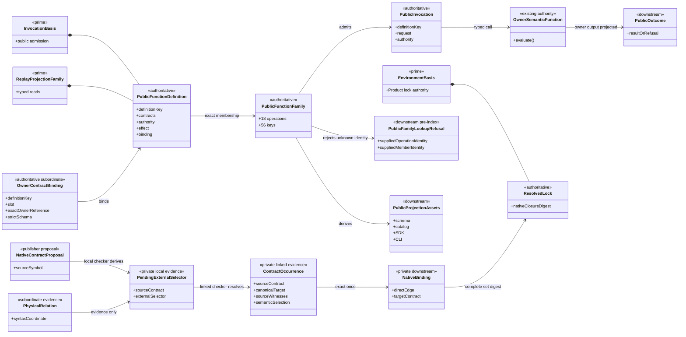
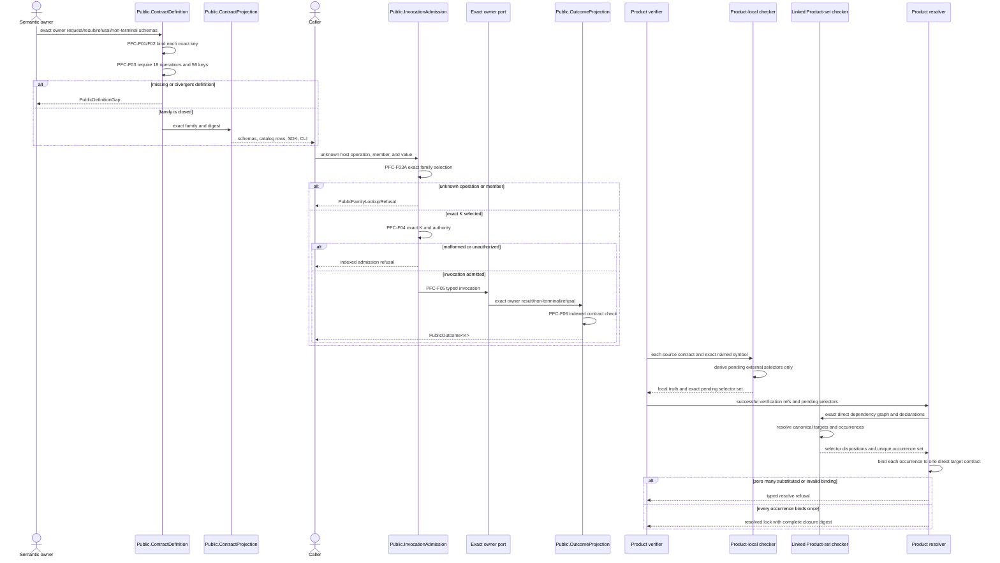
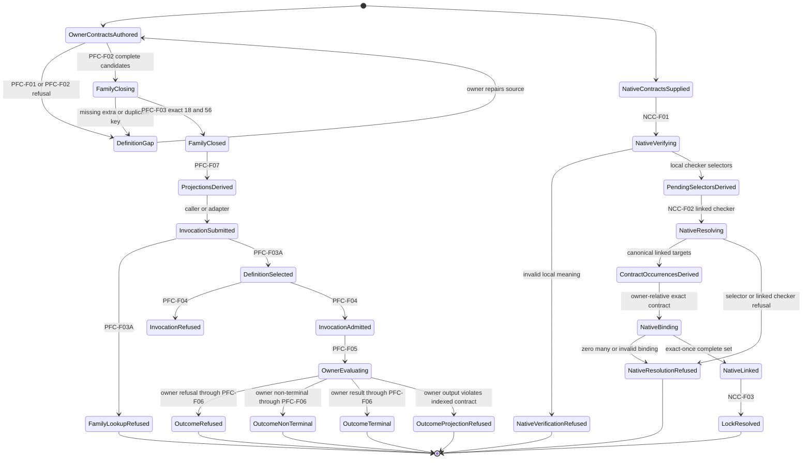

# M05 S06 Public Function And Native Occurrence Closure Design

**Status**: Bounded replacement design repair candidate; realization held
**Date**: 2026-07-30
**Change class**: `requirement_reprice` plus `design_reframe`
**Owner**: T-281 under T-270
**Ontology slice**: `S06C/4` (`candidate`)
**Method**: `.genesis/docs/standards/DESIGN_MODULE_METHOD.md`
**Returned realization**:
`4953508de83ab6d6c65dbb81e5407ccb539e44e6`
**Returned design**:
`8eb7564c04673cab26d938ad9bb2b026c1597d15`
**Accepted parent design**:
`M05_S06_NATIVE_CONTRACT_CLOSURE_DESIGN.md` at
`4f80f84a826de86b4cfb4d9fec3baff428dcb44a`

## 1. Authority And Supersession

This design re-enters two relations exposed by exact review of the returned
S06 realization:

1. the complete ABIogenesis 5.0 public-function algebra; and
2. the checker-derived, source-contract-indexed native occurrence relation.

It derives from:

- `PRODUCT.md`: `A5-F01`, `A5-F05`, `A5-F06`, `A5-F13`, `A5-F17`,
  `ABG5-S06`;
- `REQ-P-PUBLIC-CONTRACTS-005`, `-008..010`, `-013`;
- `REQ-P-POLICY-022..064`;
- `REQ-P-INSTALL-043..060`;
- `REQ-P-CATALOG-019..030`;
- `REQ-P-CONSENSUS-012..015`;
- `REQ-R-ABG3-PROJECTION-023`;
- `REQ-R-ABG3-WITNESS-009`;
- accepted M03 `EnvironmentBasis`, `InvocationBasis`,
  `ReplayProjectionFamily`, and ABG runtime authority; and
- accepted S05 Consensus and S06 native-contract designs.

This file is the sole current design asset for the affected S06 delta. It:

- supersedes the public-operation-family part of
  `M04_PUBLIC_CONTRACT_PUBLICATION_BEHAVIOR_DESIGN.md`;
- re-derives useful contract evidence from
  `M04_PUBLIC_OPERATION_DEFINITION_FAMILY_BEHAVIOR_DESIGN.md`, whose prior
  19-operation authority was invalidated by T-283;
- removes the planned 5.1 tuning operation and observer/tuner read variants;
- refines only the occurrence and binding parts of the accepted
  `M05_S06_NATIVE_CONTRACT_CLOSURE_DESIGN.md`; and
- preserves the remaining accepted S06 native-closure decisions unchanged.

The old M04 files remain historical evidence. They do not co-govern this
boundary.

## 2. Boundary Decisions

| Global decision | Local projection | Falsified by |
|---|---|---|
| The 5.0 public family is complete before S06 promotion. | One exact family contains 18 operations and 56 operation-member keys. | An 11-operation portability subset is published as the release family or no later selected lane owns the missing functions. |
| Scenario scope and Product definition scope remain distinct. | S06 executes one representative installed invocation, while T-281 closes every 5.0 definition and projection. | Scenario success is used to infer absent definitions, handlers, contracts, or rows. |
| One definition binds one owning semantic function. | `PublicFunctionDefinition<K>` references exact owner request, result, refusal, non-terminal, authority, effect, capability, binding, and adapter contracts. | A metadata-only row, common handler, adapter, schema, or runtime branch authors missing meaning. |
| Owner contracts are singular. | One strict native schema is the source of the TypeScript type, raw parser, canonical JSON Schema, and closed domain for each slot. | A handwritten interface, parser, generated schema, or handler check independently narrows or widens the value domain. |
| Every key has a constructable owner packet. | The closed source map fixes exact owner contract, metadata, authority, and port references; their admitted owner contracts supply fields, domains, and defaults. | The join copies 56 payload families, or an unresolved reference is completed by implementation convention. |
| Relational request laws are structural. | Exact sums encode all-or-none, exactly-one, conditional, and ref/digest laws in both native and serialized contracts. | Optional fields type-check while parser or handler later rejects their relation. |
| Outcomes are operation indexed. | `PublicOutcome<K>` contains only `ResultOf<K>`, `NonTerminalOf<K>`, `RefusalOf<K>`, or the common typed projection-refusal member. | `JsonValue`, `{}`, a generic result envelope, or handler-local check supplies operation meaning. |
| Adapters are projections. | SDK, CLI, and Codex coordinates derive from the exact family and transport the same invocation/outcome. | An adapter owns a variant roster, default, parser, result shape, exit map, or semantic branch. |
| Publication is a read model. | Native symbols, schemas, operation rows, capability rows, SDK members, CLI grammar, and docs derive from one family digest. | Aggregate schemas exist without addressable operation rows or parallel registers disagree. |
| Physical TypeScript syntax is not a semantic occurrence. | Parser/checker relations remain subordinate evidence. | One raw import/re-export identity becomes the unit of contract authority or binding cardinality. |
| Native phases are singular. | F01 derives source-contract pending selectors; F02's linked checker alone derives final occurrences and bindings. | Local verification assigns a final target, contract, occurrence, or lock identity. |
| Native occurrences are source-contract indexed. | The linked checker derives one occurrence per exact source contract and externally contributing target symbol. | An uncontracted subordinate root creates a false owner, or two source contracts share one occurrence identity. |
| Dependency authority re-anchors. | A binds B's exact admitted contract and stops; B evaluates B-to-C separately under B's direct edge. | A gains C through transitive traversal of B's contract meaning. |
| TypeScript checker meaning is final. | Alias, namespace, star, type query, shadowing, and value/type use derive from checker symbols. | `SymbolFlags.Type`, text parsing, or relation-kind heuristics override a valid linked Program. |
| Every semantic occurrence binds exactly once. | `ContractExternalOccurrenceRef -> NativeContractBinding` is a total one-to-one relation. | Zero, duplicate, substituted, or cross-contract binding reaches a resolved lock. |
| Existing architecture remains singular. | Public closure stays under `InvocationBasis` and `ReplayProjectionFamily`; native closure stays under `EnvironmentBasis`. | A new Prime family, registry, analyzer API, runtime, event family, controller, or catalog appears. |
| Broader Prime compression remains held. | No GraphFunction identity, sequence, key-set, uniqueness, digest, reference, or record contraction enters this cut. | The selected post-S06 entropy work is implemented before S06 acceptance. |

Included:

- complete public-function definition and projection law;
- exact owner contract packets;
- common invocation/outcome admission;
- operation rows, SDK, CLI, Codex, and schema projection;
- source-contract-indexed native occurrences;
- exact-once native binding; and
- module-owned falsification.

Excluded:

- new Product meaning beyond active requirements;
- a schema service, code generator service, public analyzer, or generic
  controller;
- successful release publication before M7 authority exists;
- planned 5.1 observer/tuner operations;
- broader Prime entropy reduction;
- S04 realization, M6 qualification, and M7 release execution.

### 2.1 Requirement Traceability

| Constitutional source | Global decision | Local design projection | Falsification |
|---|---|---|---|
| `REQ-P-PUBLIC-CONTRACTS-005`, `-008` | complete public family | Section 4.1 exact 18-operation/56-key family | missing, extra, legacy, or 5.1 key |
| `REQ-P-PUBLIC-CONTRACTS-009..010`; `REQ-P-POLICY-062..064` | one indexed request/result/refusal/non-terminal authority | Sections 4.2, 4.4, and 4.5 | native/parser/schema/runtime disagreement or generic payload/outcome |
| `REQ-P-POLICY-022`, `-044..045` | SDK, CLI, and Codex are projections | PFC-F07 plus exact adapter exit maps | adapter-specific roster, validation, semantics, or outcome |
| `REQ-P-POLICY-023..040`, `-049..061` | every operation binds its owning complete semantic function | Section 4.2.1 exact owner references plus Section 4.4 owner relations | copied payload, metadata, handler, or prose supplies an absent relation |
| clarified `REQ-P-POLICY-049..050` | packed verification precedes linked resolution; installed verification consumes an existing lock | `ProductVerifyPacket`, NCC-F01/F02, and authority-slot matrix | verify constructs a lock or F01 admits linked meaning |
| `REQ-P-CATALOG-019..030`; `REQ-R-ABG3-PROJECTION-023` | project reads and catalog relations are closed and pure | Section 4.3 and catalog rows in Section 4.4 | free projection string, widened view, or read effect |
| `REQ-P-CONSENSUS-012..015` | Consensus uses ordinary start/respond/continue/read members | start, interaction, continuation, result/replay, and ticket-consensus definitions | Consensus-specific operation or missing public projection |
| `REQ-P-INSTALL-043..060` | verify, resolve, install, bind, create, and open remain distinct | operation packets and authority-slot matrix | resolve/install cycle, implicit binding, or hidden install |
| accepted `M05_S06_NATIVE_CONTRACT_CLOSURE_DESIGN.md` | compiler and direct Product dependencies own native closure | Sections 5.1..5.3 | text/flag heuristic, transitive authority, or ambient package meaning |
| `DESIGN_MODULE_METHOD.md` | Ontology precedes IACS and realization | Sections 6..12 | code must choose an entity, function, authority, lifecycle, or module relation |

## 3. Complete Function

Let `K` be one member of the closed 5.0 definition-key set, `Owner(K)` its
semantic owner, and `Contract(K, slot)` its exact owner-native contract.

```text
PFC-F01 AdmitOwnerContract(K, slot, owner schema and authority)
  -> OwnerContractBinding<K, slot>
   | PublicDefinitionGap

PFC-F02 ConstructPublicFunctionDefinition(
  K,
  request/result/refusal/non-terminal bindings,
  exact owner port,
  authority/effect/binding/capability/adapter metadata
)
  -> PublicFunctionDefinition<K>
   | PublicDefinitionGap

PFC-F03 ClosePublicFunctionFamily(
  exact definitions for all 56 K
)
  -> PublicFunctionDefinitionFamily
   | PublicDefinitionGap

PFC-F03A SelectPublicFunctionDefinition(
  closed family,
  unknown host operation and member identities
)
  -> exists K. PublicFunctionSelection<K>
   | PublicFamilyLookupRefusal

PFC-F04 AdmitPublicInvocation<K>(
  exact PublicFunctionSelection<K>,
  unknown host value
)
  -> PublicInvocation<K>
   | AdmissionRefusalFor<K>

PFC-F05 InvokeOwningSemanticFunction<K>(
  admitted invocation,
  exact owner port
)
  -> OwnerResultOf<K>
   | OwnerNonTerminalOf<K>
   | OwnerRefusalOf<K>

PFC-F06 ProjectPublicOutcome<K>(
  admitted invocation,
  exact owner output
)
  -> PublicOutcome<K>

PFC-F07 DerivePublicProjections(
  closed family
)
  -> native exports
   + canonical schemas
   + public-contract and operation rows
   + SDK members
   + CLI grammar and exit maps
   + documentation inventory
```

The complete public composition is:

```text
owner semantic contracts
  -> PFC-F01 each exact slot
  -> PFC-F02 each exact K
  -> PFC-F03 exact family closure
  -> PFC-F07 immutable projections

unknown host value
  -> PFC-F03A
  -> PFC-F04<K>
  -> PFC-F05<K>
  -> PFC-F06<K>
```

`PFC-F03` and `PFC-F07` are deterministic build compositions. They are not
runtime dispatch services. `PFC-F03A` is exact zero/one family selection;
unknown operation or member identity fails before any `K` exists.
`PFC-F05` is a typed higher-order call to the operation's existing owner;
Public does not implement owner semantics.

The native closure composition is:

```text
NCC-F01 AnalyzeLocalNativeContracts(
  one Product,
  exact contract proposals,
  exact compiler basis
)
  -> locally admitted symbols
   + ContractIndexedPendingExternalSelectorSet
   | ProductVerificationRefusal

NCC-F02 LinkNativeContractSet(
  locally verified Products,
  exact pending external selectors,
  owner-indexed direct dependencies,
  exact compiler basis
)
  -> exact ContractExternalOccurrenceSet
   + exact NativeContractBindingSet
   | unresolved | incompatible | ambiguous | cyclic

NCC-F03 ConstructResolvedProductLock(
  exact Product rows,
  direct edges,
  complete native binding set
)
  -> ResolvedProductLock
```

## 4. Public Function Definition Algebra

### 4.1 Closed Family

The exact 5.0 family has 18 operation identities and 56 definition keys. The
counts are derived no-silence checks, not Product scope.

| Operation | Exact member keys | Semantic owner | Workspace binding | Actor | Effect |
|---|---|---|---|---|---|
| `abg.operation.workspace.create` | `clean`, `imported` | Product workspace | forbidden | required | workspace filesystem |
| `abg.operation.workspace.open` | `open` | Product workspace | forbidden | forbidden | read/admission |
| `abg.operation.project.read` | 24 cases in Section 4.3 | owning projection family | per case | forbidden | pure read |
| `abg.operation.product.verify` | `verify` | Product verifier | forbidden | forbidden | deterministic attestation |
| `abg.operation.product.resolve` | `resolve` | Product resolver | forbidden | forbidden | deterministic evaluation |
| `abg.operation.product.install` | `install` | Product installer | forbidden | required | immutable filesystem |
| `abg.operation.workspace.bind` | `bind` | Product environment | forbidden | required | binding persistence |
| `abg.operation.catalog.admit` | `admit` | Product catalog admission | exactly one | required | catalog admission |
| `abg.operation.catalog.view` | `allowlist` | Product catalog projection | exactly one | required | deterministic narrowing |
| `abg.operation.catalog.apply` | `node_type`, `overlay` | Product application plus ABG admission | exactly one | required | non-runtime application admission |
| `abg.operation.run.invoke` | `invoke`, `start` | Product/GTL/HoG/ABG composition | exactly one | required | ABG traversal |
| `abg.operation.run.continue` | `current_intent`, `selected_action` | Product/ABG/HoG continuation | exactly one | required | ABG continuation |
| `abg.operation.interaction.respond` | `select`, `approve`, `reject`, `assess`, `answer_escalation` | Product F_H validation plus ABG admission | exactly one | required | F_H response event |
| `abg.operation.result.assess` | `assess` | Product result assessment plus ABG admission | exactly one | required | assessment event |
| `abg.operation.witness.admit` | `reprice`, `attest`, `hygiene-stamp`, `intake`, `run-resumed`, `run-stopped` | ABG witnessed-act admission | exactly one | required | witnessed event |
| `abg.operation.conformance.evaluate` | `gtl_program` | GTL validator/Product conformance | exactly one | required | deterministic assessment |
| `abg.operation.product.materialize` | `context_bootstrap`, `configuration` | Product materializer | exactly one | required | product filesystem |
| `abg.operation.release.snapshot` | `published_rc`, `tapped_release` | release authority/materializer | exactly one | required | immutable release publication |

Reserved 5.1 members are absent:

- `abg.operation.tuning.transition`;
- `project.read(observer_report)`;
- `project.read(observer_drafts)`; and
- `project.read(tuning_report)`.

Legacy identities and aliases are absent. In particular,
`run.invoke(direct)` is invalid; direct GraphFunction invocation is
`run.invoke(invoke)`.

### 4.2 Definition Shape

Each owner supplies strict native contracts:

```text
OwnerContractBinding<K, Slot, S> = {
  definitionKey: K
  slot: request | result | refusal | non_terminal
  source: ExactOwnerMemberCoordinate
  ownerAuthorityRef
  ownerAuthorityDigest
  schema: strict NativeSchema<S>
  nativeLocator
  schemaCoordinate
  projectionWitnessDigest
}

RequestOf<K> = InferOutput<RequestSchemaOf<K>>
ResultOf<K> = InferOutput<ResultSchemaOf<K>>
RefusalOf<K> = InferOutput<RefusalSchemaOf<K>>
NonTerminalOf<K> =
  NonTerminalSchemaOf<K> is present
    ? InferOutput<NonTerminalSchemaOf<K>>
    : never

PublicFunctionDefinition<K> = {
  definitionKey: K
  version: "5.0.0"
  contractCatalog: PublicContractCatalogCoordinate
  requestContract: OwnerContractBinding<K, request>
  resultContract: OwnerContractBinding<K, result>
  refusalContract: OwnerContractBinding<K, refusal>
  nonTerminalContract: OwnerContractBinding<K, non_terminal> | null
  ownerPort: OwnerPortCoordinate<K>
  semanticAuthorityRef
  semanticAuthorityDigest
  authorityClass: pure | read | write | attestation
  effectClass
  eventAdmission:
    none | owning_semantic_authority | immutable_artifact_boundary
  actorRequirement: forbidden | required
  workspaceBindingRequirement: forbidden | exactly_one
  authoritySlotRequirements
  capabilityRefs
  defaults
  closedDomains
  schemaCoordinates
  sdkCoordinate
  cliCoordinate
  adapterExitMap
  definitionDigest
}

OwnerDefinitionMetadata<K> = {
  authorityClass: pure | read | write | attestation
  effectClass
  eventAdmission:
    none | owning_semantic_authority | immutable_artifact_boundary
  actorRequirement: forbidden | required
  workspaceBindingRequirement: forbidden | exactly_one
  capabilityRefs
  defaults
  closedDomains
  sdkCoordinate
  cliCoordinate
  adapterExitMap
}
```

Every field of `PublicFunctionDefinition<K>` is projected from the exact owner
packet below. This design references the owning contract; it does not reproduce
the 56 request, result, refusal, or non-terminal payload families.

The selected TypeScript strict lane uses one strict Valibot owner schema per
slot. Its inferred output type is the native type, its parse is raw admission,
and its canonical JSON Schema is generated from that same schema. Exact
dependency versions are immutable build inputs. Unsupported schema projection
constructs are design/build gaps and cannot fall back to `{}`, a handwritten
schema, or handler validation.

Conditional laws are owner-schema sums:

- all-or-none pairs are a union of complete-present and complete-absent
  objects;
- exactly-one groups are a union whose members each require one group and
  forbid the others;
- ref/digest values are one closed relational object;
- nullable paired fields are one present-or-null sum; and
- variant-specific values are discriminated by `K`.

The TypeScript type, parser, schema, and handler therefore admit the same
domain. Field metadata is explanatory projection only and cannot generate a
weaker native type.

#### 4.2.1 Exact Owner-Contract Source Map

There is one closed build-time source relation:

```text
ExactOwnerMemberCoordinate = {
  abstractModule
  exportName
  memberPath
  sourceModuleDigest
  memberDigest
}

ExactOwnerContractReference<K, Slot> = {
  definitionKey: K
  slot: request | result | refusal | non_terminal
  source: ExactOwnerMemberCoordinate
  ownerAuthorityRef
  ownerAuthorityDigest
  nativeLocator
  schemaCoordinate
  projectionWitnessDigest
}

ExactOwnerMetadataReference<K> = {
  definitionKey: K
  source: ExactOwnerMemberCoordinate
  metadataDigest
}

OwnerContractPacket<K> = {
  definitionKey: K
  requestContract: ExactOwnerContractReference<K, request>
  resultContract: ExactOwnerContractReference<K, result>
  refusalContract: ExactOwnerContractReference<K, refusal>
  nonTerminalContract: ExactOwnerContractReference<K, non_terminal> | null
  metadata: ExactOwnerMetadataReference<K>
  ownerPort: {
    source: ExactOwnerMemberCoordinate
    ownerPortDigest
  }
}

OWNER_CONTRACT_SOURCE_MAP = exact nested object below

packet(K) =
  OWNER_CONTRACT_SOURCE_MAP[K.operationId][K.memberKey]

RequestSchemaOf<K> =
  ResolveStrictNativeSchema(packet(K).requestContract)
ResultSchemaOf<K> =
  ResolveStrictNativeSchema(packet(K).resultContract)
RefusalSchemaOf<K> =
  ResolveStrictNativeSchema(packet(K).refusalContract)
NonTerminalSchemaOf<K> =
  packet(K).nonTerminalContract is null
    ? absent
    : ResolveStrictNativeSchema(packet(K).nonTerminalContract)
MetadataOf<K> =
  ResolveExactOwnerMember<OwnerDefinitionMetadata<K>>(packet(K).metadata)
OwnerPortOf<K> =
  ResolveExactOwnerPort(packet(K).ownerPort)
```

Each resolver checks the referenced module digest, member digest, exact
definition key, owner authority, and expected slot before returning a value.
An unresolved, duplicated, cross-key, stale, or wrong-authority reference is a
`PublicDefinitionGap`. The source coordinate names an abstract module interface
and exact exported symbol. File placement inside that module is a realization
choice. Export and member paths are not. The final public projection is always:

```text
package: "@abiogenesis/typescript-tenant"
packageExport: "./public"
definition export: "PUBLIC_FUNCTION_DEFINITION_FAMILY"
schema export: "PUBLIC_OPERATION_SCHEMAS"
member path: [K.operationId, K.memberKey, slot]
```

The closed source map is:

| Operation and exact members | Abstract owner module | Exact source export and member path | Exact owner port | Packet family |
|---|---|---|---|---|
| `abg.operation.workspace.create(clean|imported)` | `Product.WorkspaceOperations` | `WORKSPACE_OPERATION_CONTRACTS.create[member]` | `WorkspaceOperationPort.create` | `WorkspaceCreatePacket<member>` |
| `abg.operation.workspace.open(open)` | `Product.WorkspaceOperations` | `WORKSPACE_OPERATION_CONTRACTS.open.open` | `WorkspaceOperationPort.open` | `WorkspaceOpenPacket` |
| `abg.operation.project.read(C)` for every C in Section 4.3 | `Public.ProjectReadContracts` plus `OwnerOfRead<C>` | `PROJECT_READ_CONTRACTS[C]` | `PROJECT_READ_OWNER_PORTS[C].project` | `ProjectReadPacket<C>` |
| `abg.operation.product.verify(verify)` | `Product.Verification` | `PRODUCT_VERIFICATION_CONTRACTS.verify` | `ProductVerificationPort.verify` | `ProductVerifyPacket` |
| `abg.operation.product.resolve(resolve)` | `Product.EnvironmentResolution` | `PRODUCT_ENVIRONMENT_CONTRACTS.resolve` | `ProductEnvironmentPort.resolve` | `ProductResolvePacket` |
| `abg.operation.product.install(install)` | `Product.Installation` | `PRODUCT_INSTALL_CONTRACTS.install` | `ProductInstallPort.install` | `ProductInstallPacket` |
| `abg.operation.workspace.bind(bind)` | `Product.EnvironmentResolution` | `PRODUCT_ENVIRONMENT_CONTRACTS.bind` | `ProductEnvironmentPort.bindWorkspace` | `WorkspaceBindPacket` |
| `abg.operation.catalog.admit(admit)` | `Product.CatalogAdmission` | `CATALOG_OPERATION_CONTRACTS.admit` | `CatalogOperationPort.admit` | `CatalogAdmitPacket` |
| `abg.operation.catalog.view(allowlist)` | `Product.CatalogProjection` | `CATALOG_OPERATION_CONTRACTS.view.allowlist` | `CatalogOperationPort.constructView` | `CatalogViewPacket` |
| `abg.operation.catalog.apply(node_type|overlay)` | `Product.CatalogApplication` | `CATALOG_OPERATION_CONTRACTS.apply[member]` | `CatalogOperationPort.apply` | `CatalogApplyPacket<member>` |
| `abg.operation.run.invoke(invoke|start)` | `Product.RunInvocation` | `RUN_OPERATION_CONTRACTS.invoke[member]` | `RunInvocationPort[member]` | `RunInvokePacket<member>` |
| `abg.operation.run.continue(current_intent|selected_action)` | `Product.RunContinuation` | `RUN_OPERATION_CONTRACTS.continue[member]` | `RunContinuationPort[member]` | `RunContinuePacket<member>` |
| `abg.operation.interaction.respond(select|approve|reject|assess|answer_escalation)` | `Product.InteractionResponse` | `INTERACTION_OPERATION_CONTRACTS.respond[member]` | `InteractionResponsePort.respond` | `InteractionRespondPacket<member>` |
| `abg.operation.result.assess(assess)` | `Product.ResultAssessment` | `RESULT_OPERATION_CONTRACTS.assess` | `ResultAssessmentPort.assess` | `ResultAssessPacket` |
| `abg.operation.witness.admit(reprice|attest|hygiene-stamp|intake|run-resumed|run-stopped)` | `ABG.WitnessAdmission` | `WITNESS_OPERATION_CONTRACTS.admit[member]` | `WitnessAdmissionPort.admit` | `WitnessAdmitPacket<member>` |
| `abg.operation.conformance.evaluate(gtl_program)` | `Validator.Conformance` | `CONFORMANCE_OPERATION_CONTRACTS.evaluate.gtl_program` | `ConformancePort.evaluateGtlProgram` | `ConformanceEvaluatePacket` |
| `abg.operation.product.materialize(context_bootstrap|configuration)` | `Product.Materialization` | `MATERIALIZATION_OPERATION_CONTRACTS[member]` | `ProductMaterializationPort[member]` | `ProductMaterializePacket<member>` |
| `abg.operation.release.snapshot(published_rc|tapped_release)` | `Product.ReleaseSnapshot` | `RELEASE_OPERATION_CONTRACTS.snapshot[member]` | `ReleaseSnapshotPort[member]` | `ReleaseSnapshotPacket<member>` |

`member` and `C` are literal closed parameters, never runtime strings. The
table indexes 32 non-read packet references plus the 24 read packet references.
Exact-set admission requires one reference packet for every key and no extra
packet. The referenced owner contract remains authoritative for payload
structure; this join neither copies nor redefines it. An absent source export,
contract member, metadata member, or owner port is `PublicDefinitionGap`;
implementation cannot create its meaning at the join.

PFC-F01 resolves each `ExactOwnerContractReference` into the corresponding
`OwnerContractBinding`; PFC-F02 then projects:

```text
request/result/refusal/nonTerminal contracts = packet(K) contract references
ownerPort = OwnerPortOf<K>
semantic authority = exact authority shared by those references
authority/effect/admission/binding/capability/default/domain metadata =
  MetadataOf<K>
```

The four contract references, metadata reference, and owner-port reference must
agree on `K`, owner authority, version, and source module digest. No payload
field is authored by this join.

#### 4.2.2 Closed Packet Grammar

The notation below is normative:

```text
RD<T> = { ref: Ref<T>, digest: Sha256Digest }
RDSet<T> = NonEmptyUnique<RD<T>>
Residuals = NonEmptyUnique<TypedResidual>
NoResiduals = readonly []
CanonicalValue<C> = canonical I-JSON admitted by contract RD<C>
ContractBoundValue = {
  contract: RD<PublicContract>
  valueRef
  valueDigest
  value: CanonicalValue<PublicContract>
}

Packet<Req, Res, RefusalCode, NonTerminal, Defaults> = {
  request: StrictNativeSchema<Req>
  result: StrictNativeSchema<Res>
  refusal: StrictNativeSchema<{
    code: RefusalCode
    issuePaths: Unique<JsonPointer>
    evidenceRefs: Unique<Ref<Evidence>>
  }>
  nonTerminal:
    NonTerminal is never ? null : StrictNativeSchema<NonTerminal>
  defaults: Defaults
}
```

`StrictNativeSchema<never>` is the canonical false schema and admits no value.
It is used only where metadata declares no terminal result. A result or
non-terminal branch whose indexed type is `never` is absent from
`PublicOutcome<K>`.

The top-level field vectors in Section 4.4 are closed schema fields. A named
domain such as `ResolvedProductLock`, `CatalogAdmissionRow`, `RunProjection`,
or `ReleaseSnapshotManifest` denotes that already governed native domain
carrier, not a free record. Every ref/digest pair is one `RD<T>` field, not two
independently optional fields.

Three parameterized families that previously admitted implementation choice
are exact:

```text
RunStartRequest = {
  program: RD<GtlProgram>
  scope: "program"
  target: PublicTarget
  until: "converged"
  catalogView: RD<CatalogView>
  allowlist: Unique<CanonicalCatalogHandle>
  input: ContractBoundValue
  fhMode: "direct" | "human-proxy"
  rootMode: "direct" | "supervised"
  sourceBasis:
    | { kind: "none" }
    | { kind: "admitted_source_result",
        projectionAuthority: RD<ProjectionAuthority>,
        sourceResult: RD<RuntimeResult> }
}

RunStartDefaults = {
  fhMode: "direct"
  rootMode: "supervised"
}

InteractionRespondRequest<R> = {
  interaction: RD<FhInteraction>
  responseContract: RD<PublicContract>
  responseKind: R
  choice:
    R is "select" ? RD<DeclaredInteractionChoice> : null
  value: CanonicalValue<PublicContract>
  evidence: RDSet<Evidence>
  currentBasis: RD<ExecutionBasis>
}

InteractionRespondResult<R> = never

InteractionRespondNonTerminal<R> = {
  disposition: "responded"
  responseKind: R
  responseEvent: RD<ActorAttributedResponseEvent>
  interaction: InteractionProjection<"responded">
  run: RD<Run>
  continuation: RD<Continuation>
  evidence: RDSet<Evidence>
}

WitnessAdmitRequest<W> = {
  subjectKind: WitnessSubjectKindOf<W>
  subject: RD<WitnessSubject>
  act: W
  content: {
    kind: "typed_reason" | "typed_payload"
    contentContract: RD<PublicContract>
    value: CanonicalValue<PublicContract>
  }
  context: WitnessContextOf<W>
  evidence: RDSet<Evidence>
  provenance: RDSet<Provenance>
}

WitnessSubjectKindOf<W> =
  W is "reprice" ? "authority_basis"
  : W is "attest" ? "evidence_claim"
  : W is "hygiene-stamp" ? "workspace"
  : W is "intake" ? "intake_item"
  : "run"

WitnessContextOf<W> =
  W is "run-resumed" | "run-stopped"
    ? { kind: "run", run: RD<Run>, basis: RD<ExecutionBasis> }
    : W is "hygiene-stamp"
      ? { kind: "workspace", workspace: RD<WorkspaceBinding> }
      : W is "intake"
        ? { kind: "segment", run: RD<Run>, segment: RD<RunSegment> }
        : { kind: "basis", basis: RD<AuthorityBasis> }

WitnessAdmitResult<W> = {
  act: W
  witnessedAct: RD<WitnessedAct>
  admittedEvent: RD<ActorAttributedWitnessEvent>
  evidence: RDSet<Evidence>
}
```

`select` alone carries a non-null declared choice. The other four interaction
members require `choice: null`. All five require a contract-admitted value.
The six witness members use the exact context relation above; no optional
context bag is lawful. `run.invoke(invoke)` has no `fhMode`, `rootMode`,
`scope`, or `until` field. `run.invoke(start)` has exactly the modes and
defaults above.

The complete public request is `PublicInvocation<K>`. Actor, capability grant,
workspace binding, Product set, dependency lock, catalog scope, execution
Program, policy, and steering fields occur only in its
`InvocationAuthorityOf<K, RequestOf<K>>` slot as authority. `RequestOf<K>` contains
owner-semantic payload. Where the field grammar also carries a domain selector
such as a Program, lock, binding, or view, PFC-F04 requires it to equal the
corresponding authority slot; it contributes no independent authority.

Definition identity is canonical:

```text
DefinitionDigestProjection<K> = {
  definitionKey
  version
  contract catalog coordinate
  request/result/refusal/non-terminal contract coordinates and witness digests
  owner port coordinate and digest
  semantic authority and digest
  authority/effect/event classes
  actor and authority-slot requirements
  capability refs
  defaults and closed domains
  schema/native/SDK/CLI coordinates
  adapter exit map
}

definitionDigest(K) =
  sha256(RFC8785(DefinitionDigestProjection<K>))

FamilyDigestProjection =
  exact operation-keyed and member-keyed map of definition digests

familyDigest =
  sha256(RFC8785(FamilyDigestProjection))
```

Neither projection includes its own digest, schema functions, object identity,
function source text, or loader order.

For operation suffix `S = operationId` without `abg.operation.`, dots become
path separators only in asset paths. The family derives:

- native unions `Pascal(S)Request`, `Pascal(S)Result`,
  `Pascal(S)Refusal`, and any `Pascal(S)NonTerminal`;
- schema IDs `abg.schema.operation.S.request`, `.result`, `.refusal`, and
  `.non-terminal` when applicable;
- paths `contracts/schemas/operations/<S path>/<slot>.schema.json`;
- one operation row keyed by the exact operation identity and containing its
  closed member definitions;
- SDK coordinate `sdk.S`; and
- the exact CLI coordinate in Section 4.6.

The common rows `abg.schema.public-operation-contract`,
`abg.schema.public-operation-invocation`, and
`abg.schema.public-operation-outcome` bind the same family version and digest.
Generated member definitions may be addressable JSON Schema `$defs`; they do
not become separately authored contracts.

The exact catalog and operation-row carriers are:

```text
PublicContractCoordinate = {
  contractRef
  contractVersion: "5.0.0"
  contractDigest
  owningProduct: {
    productId
    productContentDigest
  }
  requirementAuthorityRefs: NonEmptyUnique<RequirementAuthorityRef>
  capabilityIdentities: Unique<CapabilityIdentity>
  nativeLocator: {
    packageName: "@abiogenesis/typescript-tenant"
    packageExport: "./public"
    exportName
    memberPath
  }
  schemaLocator: {
    schemaId
    assetPath
    definitionRef
    assetDigest
  }
}

PublicContractCatalogCoordinate = {
  catalogRef
  catalogVersion: "5.0.0"
  catalogDigest
  owningProduct: {
    productId
    productContentDigest
  }
  requirementAuthorityRefs: NonEmptyUnique<RequirementAuthorityRef>
  familyRef
  familyVersion: "5.0.0"
  familyDigest
}

ProjectionRefusalContractCoordinate = PublicContractCoordinate where {
  contractRef:
    "abg.schema.public-operation-outcome#/$defs/OutcomeProjectionRefusal"
  nativeLocator: {
    packageName: "@abiogenesis/typescript-tenant"
    packageExport: "./public"
    exportName: "PublicOutcome"
    memberPath: ["projection_refusal"]
  }
  schemaLocator: {
    schemaId: "abg.schema.public-operation-outcome"
    assetPath:
      "contracts/schemas/public-operation-outcome.schema.json"
    definitionRef: "#/$defs/OutcomeProjectionRefusal"
    assetDigest
  }
}

PublicOperationContractRow = {
  rowKind: "public_operation_contract"
  rowRef
  rowDigest
  owningProduct: {
    productId
    productContentDigest
  }
  requirementAuthorityRefs: NonEmptyUnique<RequirementAuthorityRef>
  operationId
  operationVersion: "5.0.0"
  contractCatalog: PublicContractCatalogCoordinate
  definitions: NonEmptyUnique<{
    definitionKey
    definitionRef
    definitionDigest
    requestContract: PublicContractCoordinate
    resultContract: PublicContractCoordinate
    refusalContract: PublicContractCoordinate
    nonTerminalContract: PublicContractCoordinate | null
    ownerPort: OwnerPortCoordinate
  }>
  invocationContract: PublicInvocationContractCoordinate
  outcomeContract: PublicOutcomeContractCoordinate
  projectionRefusalContract: PublicContractCoordinate
  authorityClassByDefinition
  effectClassByDefinition
  workspaceBindingRequirementByDefinition
  capabilityRefsByDefinition
  adapterCoordinateByDefinition
}
```

`definitions` is canonically ordered by structural definition key and is
exactly the operation's closed member set. `rowDigest` hashes the row with only
`rowRef` and `rowDigest` omitted; `rowRef` is content addressed from that
digest. The three common rows and all 18 operation rows bind the same
`PublicContractCatalogCoordinate`, owning Product, and applicable requirement
authority. A row that omits a member contract, native symbol, schema
definition, owner port, owner/version/authority coordinate, or metadata
reference cannot publish.

### 4.3 Closed Project Read Relation

Every read request contains:

```text
ProjectReadRequest<C> = {
  caseKey: C
  source: {
    sourceKind: SourceKindOf<C>
    sourceRef
    sourceDigest
  }
  projectionBasis: {
    projectionBasisRef
    projectionBasisDigest
  }
  selector: SelectorOf<C>
}
```

Every result is `ProjectReadResult<C>` carrying the exact case, source,
projection basis, and `ProjectionOf<C>`. Reads admit no event and return no
non-terminal outcome.

| Case | Source | Result | Binding | Additional selector |
|---|---|---|---|---|
| `catalog_list` | Catalog | CatalogListProjection | exactly one | workspace catalog or exact session view |
| `catalog_describe` | Catalog | CatalogDescriptionProjection | exactly one | visibility basis plus canonical handle |
| `workspace_status` | WorkspaceBinding | WorkspaceStatusProjection | exactly one | empty |
| `run_status` | Run | RunStatusProjection | exactly one | empty |
| `graph_call_status` | GraphCall | GraphCallStatusProjection | exactly one | empty |
| `run_result` | Run | RunResultProjection | exactly one | empty |
| `graph_call_result` | GraphCall | GraphCallResultProjection | exactly one | empty |
| `run_evidence` | Run | EvidenceProjection<Run> | exactly one | empty |
| `graph_call_evidence` | GraphCall | EvidenceProjection<GraphCall> | exactly one | empty |
| `result_evidence` | RuntimeResult | EvidenceProjection<RuntimeResult> | exactly one | empty |
| `assessment_evidence` | ResultAssessment | EvidenceProjection<ResultAssessment> | exactly one | empty |
| `witness_evidence` | WitnessedAct | EvidenceProjection<WitnessedAct> | exactly one | empty |
| `install_evidence` | InstalledProduct | EvidenceProjection<InstalledProduct> | forbidden | exact InstallManifest |
| `release_evidence` | ReleaseCut | EvidenceProjection<ReleaseCut> | forbidden | exact ReleaseSnapshotManifest |
| `workspace_replay` | WorkspaceBinding | ReplayProjection<WorkspaceBinding> | exactly one | event log, `fromOrdinal`, `limit` |
| `run_replay` | Run | ReplayProjection<Run> | exactly one | `fromOrdinal`, `limit` |
| `graph_call_replay` | GraphCall | ReplayProjection<GraphCall> | exactly one | `fromOrdinal`, `limit` |
| `interaction_replay` | FhInteraction | ReplayProjection<FhInteraction> | exactly one | `fromOrdinal`, `limit` |
| `continuation_replay` | Continuation | ReplayProjection<Continuation> | exactly one | `fromOrdinal`, `limit` |
| `c_call_replay` | CProgramAtomReceipt | ReplayProjection<CProgramAtomReceipt> | exactly one | C-call ref/digest, `fromOrdinal`, `limit` |
| `workspace_gaps` | WorkspaceBinding | GapProjection<WorkspaceBinding> | exactly one | exact admitted gap basis |
| `run_gaps` | Run | GapProjection<Run> | exactly one | empty |
| `run_lawful_actions` | Run | LawfulActionProjection | exactly one | exact NextActionProjection |
| `ticket_consensus` | ConsensusResult | TicketConsensusProjection | exactly one | ticket, output authority, replay basis |

`PROJECT_READ_OWNER_PORTS` is exact:

| Cases | Owner module and exact port |
|---|---|
| `catalog_list`, `catalog_describe` | `Product.CatalogProjectionPort.list`, `.describe` |
| `workspace_status` | `Product.WorkspaceProjectionPort.status` |
| `run_status`, `run_result`, `run_evidence`, `run_replay`, `run_gaps`, `run_lawful_actions` | `ABG.RunProjectionPort[caseKey]` |
| `graph_call_status`, `graph_call_result`, `graph_call_evidence`, `graph_call_replay` | `ABG.GraphCallProjectionPort[caseKey]` |
| `result_evidence` | `ABG.ResultProjectionPort.evidence` |
| `assessment_evidence` | `ABG.AssessmentProjectionPort.evidence` |
| `witness_evidence` | `ABG.WitnessProjectionPort.evidence` |
| `install_evidence` | `Product.InstallProjectionPort.evidence` |
| `release_evidence` | `Product.ReleaseProjectionPort.evidence` |
| `workspace_replay`, `workspace_gaps` | `ABG.WorkspaceProjectionPort[caseKey]` |
| `interaction_replay` | `ABG.InteractionProjectionPort.replay` |
| `continuation_replay` | `ABG.ContinuationProjectionPort.replay` |
| `c_call_replay` | `ABG.CCallProjectionPort.replay` |
| `ticket_consensus` | `Product.ConsensusProjectionPort.ticketConsensus` |

The result schema source for each case is exactly
`PROJECT_READ_CONTRACTS[C].resultSchema`; that member wraps the projection
schema and same-basis relation supplied by the port above. Request and refusal
schema sources are respectively `.requestSchema` and `.refusalSchema`.

Selectors are closed and have no adapter defaults:

```text
NoSelector = { kind: "none" }
ReplayPage = {
  kind: "ordinal_page"
  fromOrdinal: SafeNonNegativeInteger
  limit: SafePositiveInteger
}

SelectorOf<C> =
  C is "catalog_list"
    ? { kind: "catalog_list",
        visibility:
          | { kind: "workspace_catalog" }
          | { kind: "session_view", view: RD<CatalogView> } }
  : C is "catalog_describe"
    ? { kind: "catalog_describe",
        handle: CanonicalCatalogHandle,
        visibilityBasis: RD<CatalogVisibilityBasis> }
  : C is "install_evidence"
    ? { kind: "install_manifest", manifest: RD<InstallManifest> }
  : C is "release_evidence"
    ? { kind: "release_snapshot_manifest",
        manifest: RD<ReleaseSnapshotManifest> }
  : C is "workspace_replay" | "run_replay" | "graph_call_replay"
       | "interaction_replay" | "continuation_replay"
    ? ReplayPage
  : C is "c_call_replay"
    ? ReplayPage & { cCall: RD<CProgramAtomReceipt> }
  : C is "workspace_gaps"
    ? { kind: "workspace_gap_basis", gapBasis: RD<GapProjectionBasis> }
  : C is "run_lawful_actions"
    ? { kind: "next_action", projection: RD<NextActionProjection> }
  : C is "ticket_consensus"
    ? { kind: "ticket_consensus",
        ticket: RD<Ticket>,
        outputAuthority: RD<ConsensusOutputAuthority>,
        replayBasis: RD<ReplayProjectionBasis> }
  : NoSelector
```

The read refusal family is:

```text
unknown_source
| source_kind_mismatch
| source_digest_mismatch
| projection_basis_mismatch
| projection_unsupported
| not_found
| not_ready
| catalog-only:
    unknown_handle | ambiguous_handle | hidden_by_view
    | incompatible | unbound | inadmissible
| replay-only:
    cursor_invalid | range_invalid
```

`fromOrdinal` is a safe non-negative integer and `limit` a safe positive
integer. No free source/projection string, broad subordinate source, ambient
cursor, or handler-selected read case is lawful.

### 4.4 Exact Owner Contract Packet

All request objects are closed. Every named ref paired with a digest is
verified before effect.

The non-read request and result field grammar is exact:

```text
WorkspaceCreateRequest<P> =
  P is "clean"
    ? { targetRoot: AbsolutePath, createPolicy: "clean",
        scaffoldPolicy: ScaffoldPolicy }
    : { targetRoot: AbsolutePath, createPolicy: "imported",
        importAuthority: RD<WorkspaceAuthority>,
        preservationPolicy: ImportPreservationPolicy }
WorkspaceCreateResult<P> = {
  createPolicy: P
  workspace: RD<Workspace>
  authorityMode: "clean" | "imported"
  scaffoldState: WorkspaceScaffoldState
  creationManifest: RD<WorkspaceCreationManifest>
  provenance: RDSet<Provenance>
}

WorkspaceOpenRequest = {
  targetRoot: AbsolutePath
  expectedAuthority: RD<WorkspaceAuthority>
}
WorkspaceOpenResult = WorkspaceOpenProjection

ProductVerifyRequest =
  | {
      targetKind: "packed_artifact"
      artifact: RD<PackedProductArtifact>
      productContent: RD<ProductContent>
      descriptor: RD<ProductDescriptor>
      contributionManifest: RD<ContributionManifest>
      expectedContracts: Unique<PublicContractCoordinate>
      declaredDependencies: Unique<ProductDependencyRequirement>
      compatibilityInputs: Unique<ProductCompatibilityRequirement>
    }
  | {
      targetKind: "installed_artifact"
      artifact: RD<PackedProductArtifact>
      productContent: RD<ProductContent>
      descriptor: RD<ProductDescriptor>
      contributionManifest: RD<ContributionManifest>
      expectedContracts: Unique<PublicContractCoordinate>
      declaredDependencies: Unique<ProductDependencyRequirement>
      compatibilityInputs: Unique<ProductCompatibilityRequirement>
      resolvedLock: RD<ResolvedProductLock>
      installedProduct: RD<InstalledProduct>
      installManifest: RD<InstallManifest>
    }
ProductVerifyResult =
  | { targetKind: "packed_artifact", disposition: "locally_verified",
      verifiedArtifact: RD<VerifiedProductArtifact>,
      localNativeEvidence: RD<LocalNativeContractEvidence>,
      pendingExternalSelectors:
        Unique<ContractIndexedPendingExternalSelector>,
      residuals: Unique<TypedResidual>, provenance: RDSet<Provenance> }
  | { targetKind: "installed_artifact", disposition: "installed_verified",
      verifiedArtifact: RD<VerifiedProductArtifact>,
      resolvedLock: RD<ResolvedProductLock>,
      installedProduct: RD<InstalledProduct>,
      residuals: Unique<TypedResidual>, provenance: RDSet<Provenance> }

K_verify = ("abg.operation.product.verify", "verify")

SuccessfulPackedVerificationReference = {
  invocation: RD<PublicInvocation<K_verify>>
  outcome: RD<
    PublicOutcome<K_verify> where
      outcomeKind = "result"
      and value.targetKind = "packed_artifact"
      and value.disposition = "locally_verified"
  >
}

ProductResolveRequest = {
  requirements: NonEmptyUnique<ProductRequirement>
  verifiedCandidates: NonEmptyUnique<SuccessfulPackedVerificationReference>
}
ProductResolveResult = {
  resolvedLock: RD<ResolvedProductLock>
  selections: NonEmptyUnique<ResolvedProductSelection>
  dependencyEdges: Unique<ResolvedDependencyEdge>
  nativeBindings: Unique<NativeContractBinding>
  residuals: Unique<TypedResidual>
  provenance: RDSet<Provenance>
}

ProductInstallRequest = {
  verifiedArtifact: RD<VerifiedProductArtifact>
  descriptor: RD<ProductDescriptor>
  contributionManifest: RD<ContributionManifest>
  resolvedLock: RD<ResolvedProductLock>
  targetRoot: AbsolutePath
  installPolicy: InstallPolicy
}
ProductInstallResult = {
  disposition: "materialized" | "idempotent"
  installedProduct: RD<InstalledProduct>
  installManifest: RD<InstallManifest>
  installerManifest: RD<InstallerManifest>
  resolvedLock: RD<ResolvedProductLock>
  provenance: RDSet<Provenance>
}

WorkspaceBindRequest = {
  workspaceAuthority: RD<WorkspaceAuthority>
  installedSet: NonEmptyUnique<RD<InstalledProduct>>
  resolvedLock: RD<ResolvedProductLock>
  declaredRoots: NonEmptyUnique<DeclaredWorkspaceRoot>
}
WorkspaceBindResult = {
  binding: RD<WorkspaceBinding>
  bindingManifest: RD<WorkspaceBindingManifest>
  installedSet: NonEmptyUnique<RD<InstalledProduct>>
  resolvedLock: RD<ResolvedProductLock>
  declaredRoots: NonEmptyUnique<DeclaredWorkspaceRoot>
  provenance: RDSet<Provenance>
}

CatalogAdmitRequest = {
  workspaceBinding: RD<WorkspaceBinding>
  descriptors: NonEmptyUnique<RD<ProductDescriptor>>
  contributionManifests: NonEmptyUnique<RD<ContributionManifest>>
  resolvedLock: RD<ResolvedProductLock>
}
CatalogAdmitResult = {
  catalog: RD<ProductCatalog>
  rows: NonEmptyUnique<CatalogAdmissionRow>
  conservation: RD<CatalogAdmissionConservationWitness>
}

CatalogViewRequest = {
  catalog: RD<ProductCatalog>
  allowlist: Unique<CanonicalCatalogHandle>
}
CatalogViewResult = {
  view: RD<CatalogView>
  effectiveHandles: Unique<CanonicalCatalogHandle>
  residuals: Unique<TypedResidual>
}

CatalogApplyRequest<A> = {
  applicationKind: A
  catalogRow: RD<CatalogContributionRowOf<A>>
  catalogView: RD<CatalogView>
  declaration: RD<DeclarationOf<A>>
  target:
    A is "node_type" ? RD<NodeOrProgramTarget> : null
  applicationBasis: RD<CatalogApplicationBasis>
  validationReceipt: RD<ProductValidationReceipt>
  contributor: RD<ProductContributorProvenance>
}
CatalogApplyResult<A> = {
  applicationKind: A
  application: RD<CatalogApplication>
  target:
    A is "node_type" ? RD<NodeOrProgramTarget> : null
  evidence: RDSet<Evidence>
  provenance: RDSet<Provenance>
}

RunInvokeRequest<"invoke"> = {
  program: RD<GtlProgram>
  graphFunction: RD<GraphFunction>
  inputContract: RD<PublicContract>
  input: CanonicalValue<PublicContract>
  catalogView: RD<CatalogView>
  allowlist: Unique<CanonicalCatalogHandle>
  sourceBasis:
    | { kind: "none" }
    | { kind: "admitted_source_result",
        projectionAuthority: RD<ProjectionAuthority>,
        sourceResult: RD<RuntimeResult> }
}
RunInvokeRequest<"start"> = RunStartRequest
RunInvokeResult<M> = {
  invocationKind: M
  run: RD<Run>
  graphCall: M is "invoke" ? RD<GraphCall> : RD<GraphCall> | null
  disposition: "completed" | "blocked" | "runtime_failed"
  result: RD<RuntimeResult> | null
  stop: RD<RuntimeStop> | null
  gap: RD<RuntimeGap> | null
  interaction: RD<FhInteraction> | null
  evidence: RDSet<Evidence>
  replay: RD<ReplayProjection>
}
RunInvokeNonTerminal<M> = {
  invocationKind: M
  disposition: "held" | "gap_stop"
  run: RD<Run>
  graphCall: RD<GraphCall> | null
  interaction: RD<FhInteraction> | null
  gap: RD<RuntimeGap> | null
  evidence: RDSet<Evidence>
  replay: RD<ReplayProjection>
}

RunContinueRequest<"current_intent"> = {
  run: RD<Run>
  continuation: RD<Continuation>
  currentIntent: RD<ConstructionIntent>
  continuationInput: RD<AdmittedContinuationInput>
  expectedBasis: RD<ExecutionBasis>
}
RunContinueRequest<"selected_action"> = {
  run: RD<Run>
  continuation: RD<Continuation>
  selectedAction: RD<NextActionProjection>
  basisRelation:
    | { kind: "same_basis" }
    | { kind: "authority_changed",
        coveringReprice: RD<CoveringReprice> }
}
RunContinueResult<M> = {
  continuationKind: M
  run: RD<Run>
  graphCall: RD<GraphCall> | null
  admittedIntent:
    M is "selected_action" ? RD<ConstructionIntent> : null
  successor: RD<ContinuationReceipt>
  disposition: "completed" | "blocked" | "runtime_failed"
  evidence: RDSet<Evidence>
  replay: RD<ReplayProjection>
}
RunContinueNonTerminal<M> = {
  continuationKind: M
  disposition: "held" | "gap_stop"
  run: RD<Run>
  continuation: RD<Continuation>
  evidence: RDSet<Evidence>
  replay: RD<ReplayProjection>
}

ResultAssessRequest = {
  expectedResult: RD<RuntimeResult>
  assessmentContract: RD<PublicContract>
  assessment: CanonicalValue<PublicContract>
  evidence: RDSet<Evidence>
  currentBasis: RD<ExecutionBasis>
}
ResultAssessResult = {
  assessment: RD<ResultAssessment>
  disposition: "admitted" | "rejected"
  closureEligible: boolean
  residuals: Unique<TypedResidual>
  evidence: RDSet<Evidence>
}
ResultAssessNonTerminal = {
  assessment: RD<ResultAssessment>
  disposition: "retry" | "blocked"
  closureEligible: false
  residuals: Residuals
  evidence: RDSet<Evidence>
}

ConformanceEvaluateRequest = {
  program: RD<GtlProgram>
  conformanceLaw: RD<ConformanceLaw>
  inventoryBasis:
    | { kind: "program_only" }
    | { kind: "declared_inventory",
        inventory: NonEmptyUnique<RD<DeclarationInventory>> }
}
ConformanceEvaluateResult = {
  program: RD<GtlProgram>
  inventory: RD<DeclarationInventory> | null
  assessment: RD<ConformanceAssessment>
  disposition: "passed" | "failed"
  diagnostics: Unique<StableDiagnostic>
  violatedAuthorities: Unique<RD<Authority>>
  evidence: RDSet<Evidence>
  repairAffordances: Unique<RepairAffordance>
}

ProductMaterializeRequest<"context_bootstrap"> = {
  workspace: RD<Workspace>
  binding: RD<WorkspaceBinding>
  contextInputs: NonEmptyUnique<DeclaredContextInput>
}
ProductMaterializeRequest<"configuration"> = {
  configurationContract: RD<PublicContract>
  binding: RD<WorkspaceBinding>
  inputs: CanonicalValue<PublicContract>
}
ProductMaterializeResult<M> = {
  materializationKind: M
  subject: RD<MaterializedProductSubject>
  content: RD<MaterializedContent>
  manifest: RD<MaterializationManifest>
  rows: NonEmptyUnique<MaterializationRow>
  residuals: Unique<TypedResidual>
  provenance: RDSet<Provenance>
}

ReleaseSnapshotRequest<"published_rc"> = {
  qualificationBasis: RD<QualificationBasis>
  lawBasis: RD<QualificationLawBasis>
  verdict: RD<QualificationVerdict>
  requestedIdentity: ProspectiveRcIdentity
}
ReleaseSnapshotRequest<"tapped_release"> = {
  finalTapBasis: RD<FinalTapBasis>
  lawBasis: RD<QualificationLawBasis>
  verdict: RD<QualificationVerdict>
  requestedIdentity: StableReleaseIdentity
  acceptedRc: RD<ReleaseCut>
  installedRcQualification: RD<InstalledRcQualification>
  finalTapDelta: RD<FinalTapDelta>
}
ReleaseSnapshotResult<M> = {
  snapshotKind: M
  releaseCut: RD<ReleaseCut>
  artifacts: NonEmptyUnique<RD<ReleaseArtifact>>
  snapshotManifest: RD<ReleaseSnapshotManifest>
  qualificationDisposition: "green"
  residuals: NoResiduals
  provenance: RDSet<Provenance>
}
```

`product.resolve` derives candidate coordinates, locally admitted native
evidence, pending selectors, descriptors, contribution manifests, and
dependency declarations only from `verifiedCandidates`. Its invocation
authority carries the same canonical verification-reference set. The resolved
lock binds that set and cannot cite a bare or ambient Product coordinate.

`InteractionRespondRequest/Result/NonTerminal` and
`WitnessAdmitRequest/Result` are defined in Section 4.2.2. Every packet not
declaring defaults has `defaults: {}`. Refusal codes and exact terminal versus
non-terminal classification are the closed sets in the table below.

| Operation/member | Required request relation | Exact terminal result | Semantic refusal | Non-terminal |
|---|---|---|---|---|
| `workspace.create(clean)` | target root, literal clean policy, explicit scaffold policy | workspace identity, authority mode, scaffold/bootstrap state, creation manifest, provenance | invalid target, exists, identity conflict, invalid scaffold, filesystem failure | none |
| `workspace.create(imported)` | target root, imported authority ref/digest, preservation policy | imported workspace identity and preserved-state manifest | clean refusals plus invalid import authority or preservation failure | none |
| `workspace.open(open)` | target root and expected authority ref/digest | ready, unbound, stale, malformed, or incompatible WorkspaceOpenProjection | invalid target, missing workspace, authority mismatch | none |
| `product.verify(verify)` | exact `packed_artifact` or `installed_artifact` target sum; both carry artifact/content, descriptor, contribution manifest, expected contracts, and declared dependency/compatibility inputs; installed target alone carries its resolved lock and install coordinates | verified artifact, every checked identity, locally admitted native truth plus explicit pending external selectors, typed residuals, provenance | artifact/content/identity/descriptor/contribution mismatch, invalid declared dependency, unsupported contract; installed target also admits lock mismatch or stale installed state | none |
| `product.resolve(resolve)` | non-empty unique Product requirements and successful packed-verification invocation/outcome references | exact resolved lock and one selection per required Product, bound to the same verification set | invalid, unverified, unresolved, incompatible, ambiguous, cyclic | none |
| `product.install(install)` | verified artifact, descriptor, contribution manifest, exact resolved lock, target, install policy | installed Product and install/installer manifests with provenance | verification, target, identity/content/descriptor/contribution/lock/contract/filesystem failure | none |
| `workspace.bind(bind)` | workspace authority, non-empty installed set, resolved lock, complete declared roots | immutable binding and manifest | workspace/product/lock/content/root/binding/incompatibility refusal | none |
| `catalog.admit(admit)` | exact binding, lock, descriptors, contribution manifests | catalog plus exactly one `admitted`, `rejected`, `incompatible`, `conflicting`, `unready`, or `unresolved` disposition row per submitted contribution row | malformed descriptor/contribution, binding or lock mismatch, or input/output conservation failure | none |
| `catalog.view(allowlist)` | catalog and unique narrowing handles | exact view identity, effective handles, residuals | unknown, duplicate, ambiguous, unauthorized, inadmissible, not ready | none |
| `catalog.apply(node_type|overlay)` | exact view row, validated value, target where node_type, Product validation receipt, contributor basis | application identity preserving row/value/target/membership/provenance | kind/view/readiness/target/application/callability refusal | none |
| `run.invoke(invoke)` | admitted Program and GraphFunction, input contract/value, view, binding, policy, grants, actor | Run and GraphCall with `completed`, `blocked`, or `runtime_failed` terminal truth, result/evidence/replay refs | invalid Program/function/input/view/intent/capability before Run admission | held, gap_stop |
| `run.invoke(start)` | admitted Program, scope, public target, until, root/F_H modes, input, view, binding, policy, grants, actor | Run and nullable GraphCall with `completed`, `blocked`, or `runtime_failed` terminal truth, result/evidence/replay refs | invoke refusals plus invalid target/mode/until before Run admission | held, gap_stop |
| `run.continue(current_intent)` | Run, continuation, current intent, admitted response/input, expected basis, actor/grant | continued Run with `completed`, `blocked`, or `runtime_failed` terminal truth, successor/evidence/replay refs | missing/resolved continuation or intent/response/replay/basis refusal before continuation admission | held, gap_stop |
| `run.continue(selected_action)` | Run, continuation, exact NextActionProjection, same-basis or covering-reprice relation, actor/grant | admitted construction intent then `completed`, `blocked`, or `runtime_failed` Run/GraphCall truth | stale/mismatched action or intent/reprice/basis refusal before continuation admission | held, gap_stop |
| `interaction.respond(*)` | interaction, response contract, exact variant value/choice, actor, capability, evidence, basis | none; `ResultOf<K> = never` | missing/resolved interaction, kind/contract/choice/value/capability/basis refusal | responded-event, current interaction projection, and held Run/continuation |
| `result.assess(assess)` | expected result, assessment contract/value, actor/capability, evidence, current basis | admitted or rejected assessment with closure eligibility | result/digest/contract/value/capability/evidence/basis refusal | retry, blocked |
| `witness.admit(*)` | actor, subject, exact act, typed reason/payload, applicable context, evidence, provenance | actor-attributed witnessed act and evidence | actor/subject/act/content/context/evidence/provenance/basis refusal | none |
| `conformance.evaluate(gtl_program)` | Program, conformance law, program-only or declared-inventory basis | passed/failed conformance result, diagnostics, violated laws, evidence, repairs | invalid Program, law/inventory mismatch, assessment blocked | none |
| `product.materialize(context_bootstrap)` | target workspace, exact binding, declared context inputs | content-addressed bootstrap asset and manifest with created/refreshed/preserved rows | workspace/binding/input/authority/filesystem refusal | none |
| `product.materialize(configuration)` | configuration contract, binding, typed inputs | configuration content and materialization manifest | contract/binding/input/mutable-default/filesystem refusal | none |
| `release.snapshot(published_rc)` | pre-RC basis, matching law/verdict, requested prospective RC identity | immutable RC cut, artifact and snapshot manifests, provenance | subject/basis/law/verdict/bypass/identity/bytes/publication refusal | none |
| `release.snapshot(tapped_release)` | final-tap basis/law/verdict, accepted RC, installed-RC qualification, FinalTapDelta | immutable 5.0 cut, artifact and snapshot manifests, provenance | RC/install/delta/gate refusals plus published-RC refusals | none |

Admission refusal is derived per `K`:

```text
invalid_request
| contract_catalog_mismatch
| authority_mismatch
| binding_missing | binding_forbidden | binding_mismatch when applicable
| actor_missing | capability_missing | catalog_scope_mismatch when applicable
```

`unknown_definition` and `unknown_variant` are PFC-F03A
`PublicFamilyLookupRefusal` classes. They cannot enter the indexed set above
because no `K` exists.

Classification is total:

- malformed, unauthorized, mismatched, or otherwise non-admitted requests are
  `RefusalOf<K>`;
- after the owning effect is admitted, completed, blocked, failed, rejected,
  failed-conformance, stale-open, and per-row catalog dispositions are typed
  `ResultOf<K>` members rather than ingress refusals; and
- held, gap-stop, responded, retry, and assessment-blocked states declared by
  the matrix are `NonTerminalOf<K>`.

An owner cannot report the same disposition in two slots. The adapter exit map
classifies the public slot, not a free-form disposition string.

Successful release snapshot execution remains blocked until M7 supplies its
exact qualification authority. The function, contracts, handler binding, and
typed refusal exist before M5 freeze; a placeholder success or
`not_implemented` refusal is prohibited.

### 4.5 Common Invocation And Outcome

```text
PublicFunctionDefinitionVersion = "5.0.0"

PublicInvocationContractCoordinate =
  exact PublicContractCoordinate where
    contractRef = "abg.schema.public-operation-invocation"

PublicOutcomeContractCoordinate =
  exact PublicContractCoordinate where
    contractRef = "abg.schema.public-operation-outcome"

PublicFunctionSelection<K> = {
  familyRef
  familyDigest
  definitionKey: K
  definitionRef
  definitionVersion: PublicFunctionDefinitionVersion
  definitionDigest
}

PublicFamilyLookupRefusal = {
  kind: "public_family_lookup_refusal"
  schemaVersion: "5.0.0"
  invocationContract: PublicInvocationContractCoordinate
  failureClass: "unknown_definition" | "unknown_variant"
  suppliedOperationIdentity
  suppliedMemberIdentity
  familyRef
  familyDigest
  issuePaths: Unique<JsonPointer>
}

PublicInvocation<K> = {
  kind: "public_invocation"
  schemaVersion: "5.0.0"
  invocationContract: PublicInvocationContractCoordinate
  invocationRef
  invocationDigest
  definitionRef
  definitionVersion: PublicFunctionDefinitionVersion
  definitionDigest
  definitionKey: K
  contractCatalog: PublicContractCatalogCoordinate
  invocationAuthority: InvocationAuthorityOf<K, RequestOf<K>>
  requestContract: PublicContractCoordinate
  requestRef
  requestDigest
  request: RequestOf<K>
  expectedResultContract: PublicContractCoordinate
  expectedRefusalContract: PublicContractCoordinate
  expectedNonTerminalContract: PublicContractCoordinate | null
  correlationRef
  eventTime: RFC3339Instant
  provenanceRefs: Unique<Ref<Provenance>>
}

PublicOutcomeCommon<K> = {
  kind: "public_outcome"
  schemaVersion: "5.0.0"
  outcomeContract: PublicOutcomeContractCoordinate
  outcomeRef
  outcomeDigest
  invocationRef
  invocationDigest
  definitionKey: K
  definitionVersion: PublicFunctionDefinitionVersion
  definitionDigest
  contractCatalog: PublicContractCatalogCoordinate
  correlationRef
  provenanceRefs: Unique<Ref<Provenance>>
}

PublicOutcome<K> =
  | (ResultOf<K> is never ? never : {
      ...PublicOutcomeCommon<K>
      outcomeKind: "result"
      payloadContract: ResultContractOf<K>
      payloadRef
      payloadDigest
      value: ResultOf<K>
    })
  | (NonTerminalOf<K> is never ? never : {
      ...PublicOutcomeCommon<K>
      outcomeKind: "nonterminal"
      payloadContract: NonTerminalContractOf<K>
      payloadRef
      payloadDigest
      value: NonTerminalOf<K>
    })
  | {
      ...PublicOutcomeCommon<K>
      outcomeKind: "refusal"
      payloadContract: RefusalContractOf<K>
      payloadRef
      payloadDigest
      value: AdmissionRefusalFor<K> | RefusalOf<K>
    }
  | {
      ...PublicOutcomeCommon<K>
      outcomeKind: "projection_refusal"
      payloadContract: ProjectionRefusalContractCoordinate
      payloadRef
      payloadDigest
      value: {
        failureClass:
          "malformed_owner_output"
          | "cross_definition"
          | "wrong_contract"
          | "digest_mismatch"
          | "unexpected_nonterminal"
          | "relation_mismatch"
        issuePaths: Unique<JsonPointer>
        candidateDigest
        evidenceRefs: Unique<Ref<Evidence>>
      }
    }
```

`invocationDigest` hashes every admitted invocation field except
`invocationRef` and `invocationDigest`; `invocationRef` is content addressed
from that digest.
`requestDigest` hashes the canonical default-applied request. Every catalog,
definition, request, and expected-output coordinate must equal the selected
definition. `invocationContract` and `outcomeContract` equal the common
coordinates in the same catalog and owning Product as that definition.
`definitionKey` is the sole stored operation/member discriminator; operation
identity and member key are typed projections of it. `outcomeDigest` hashes
every outcome field except `outcomeRef` and `outcomeDigest`; `outcomeRef` is
content addressed from that digest.
`payloadDigest` hashes the contract-admitted payload.

`PublicFamilyLookupRefusal` is a family-level pre-index result of PFC-F03A. It
is not `PublicOutcome<K>` because no `K`, admitted invocation, or semantic owner
exists. SDK and CLI project it through the common invocation contract with
`invalidInvocation = 2`; an adapter cannot reinterpret it as an indexed owner
refusal. PFC-F03A runs after the common invocation envelope has admitted the
operation and member identities as strings; malformed envelopes remain common
parse failures rather than lookup results.

`OutcomeProjectionRefusal<K>` is the final member above. It carries no owner
result truth and cannot be reclassified as `RefusalOf<K>`. It is published in
the common outcome native symbol and schema, appears in every operation row,
and has adapter exit class `adapterFailure = 70`. Result, semantic/admission
refusal, and non-terminal exits remain `0`, `1`, and `3`; malformed host input
before invocation admission remains `2`.

Invocation authority is a dependent structural sum, not an optional bag:

```text
AuthoritySlot =
  workspace_binding | product_set | dependency_lock | catalog_scope
  | execution_program | graph_function | input_contract | session_policy
  | capability_grants | actor | transport_steering
  | verification_references | execution_basis

AuthorityValueOf<K, R, S> =
  S is workspace_binding ? RD<WorkspaceBinding>
  : S is product_set ? NonEmptyUnique<RD<InstalledProduct>>
  : S is dependency_lock ? RD<ResolvedProductLock>
  : S is catalog_scope
      ? RD<AdmittedCatalog>
        | { catalog: RD<AdmittedCatalog>, view: RD<CatalogView>,
            allowlist: Unique<CanonicalCatalogHandle> }
  : S is execution_program ? RD<GtlProgram>
  : S is graph_function
      ? { graphFunction: RD<GraphFunction>,
          membership: RD<ProgramGraphFunctionMembership> }
  : S is input_contract ? ContractBoundValue
  : S is session_policy ? RD<InvocationPolicy>
  : S is capability_grants
      ? { requiredCapabilityRefs: MetadataOf<K>.capabilityRefs,
          grants: NonEmptyUnique<RD<CapabilityGrant>> }
  : S is actor
      ? { actor: RD<Actor>, attribution: RD<ActorAttribution> }
  : S is transport_steering ? RD<TransportSteering>
  : S is verification_references
      ? NonEmptyUnique<SuccessfulPackedVerificationReference>
  : RD<ExecutionBasis>

AuthorityField<K, R, S> =
  AuthorityPolicy<K, R, S> is required
    ? AuthorityValueOf<K, R, S>
    : null

InvocationAuthorityOf<K, R> = {
  kind: "invocation_authority"
  definitionKey: K
  authorityDigest
  slots: { [S in AuthoritySlot]: AuthorityField<K, R, S> }
}

authorityDigest =
  sha256(RFC8785(InvocationAuthorityOf<K,R> without authorityDigest))
```

`capability_grants` is required for every definition and equals the selected
definition's exact capability set. Every slot not listed below is forbidden:

| Definition keys | Additional required authority slots |
|---|---|
| `workspace.create(*)` | `actor` |
| `workspace.open(open)` | none |
| `product.verify(verify)` with `R.targetKind = packed_artifact` | none |
| `product.verify(verify)` with `R.targetKind = installed_artifact` | `dependency_lock` |
| `product.resolve(resolve)` | `verification_references` |
| `product.install(install)` | `dependency_lock`, `verification_references`, `actor` |
| `workspace.bind(bind)` | `product_set`, `dependency_lock`, `actor` |
| `project.read(install_evidence|release_evidence)` | none |
| `project.read(catalog_list|catalog_describe)` | `workspace_binding`, `product_set`, `dependency_lock`, `catalog_scope` |
| every other `project.read` case | `workspace_binding`, `product_set`, `dependency_lock` |
| `catalog.admit(admit)`, `catalog.view(allowlist)` | `workspace_binding`, `product_set`, `dependency_lock`, `actor` |
| `catalog.apply(*)` | `workspace_binding`, `product_set`, `dependency_lock`, `catalog_scope`, `actor` |
| `run.invoke(invoke)` | `workspace_binding`, `product_set`, `dependency_lock`, `catalog_scope`, `execution_program`, `graph_function`, `input_contract`, `session_policy`, `actor`, `transport_steering` |
| `run.invoke(start)` | the `invoke` set, except `graph_function` is required exactly when `R.target.kind = graph_function` |
| `run.continue(*)` | the `invoke` set plus `execution_basis` |
| `interaction.respond(*)`, `result.assess(assess)` | `workspace_binding`, `product_set`, `dependency_lock`, `actor`, `execution_basis` |
| `witness.admit(*)` | `workspace_binding`, `product_set`, `dependency_lock`, `actor`; also `execution_basis` exactly for a `run` or `segment` context |
| `conformance.evaluate(gtl_program)`, `product.materialize(*)`, `release.snapshot(*)` | `workspace_binding`, `product_set`, `dependency_lock`, `actor` |

Request-carried Program, GraphFunction, input contract, workspace binding,
lock, catalog view, verification reference, actor, or execution basis must
equal its required authority slot. A required slot cannot be absent; a
forbidden slot cannot be present. Grants must cover exactly
`MetadataOf<K>.capabilityRefs` and carry the actor attribution when the actor
slot is required.

`product.verify` uses one structural target sum inside the exact `verify`
member. The packed member is the pre-resolution path used by S06; it admits
local Product truth and explicit pending external selectors. The installed
member checks an already resolved and installed subject and therefore requires
the exact lock. Neither member makes a lock optional, and neither permits
verification to construct one.

The owner semantic function constructs `ResultOf<K>`, `NonTerminalOf<K>`, or
`RefusalOf<K>`. Public verifies the indexed owner output and wraps it without
changing meaning. A contract-invalid owner output produces only the exact
`projection_refusal` member. `operations.ts` or any successor ingress module
cannot be a second contract surface.

Adapter profiles are:

```text
terminal_only = {
  acceptedTerminal: 0
  refused: 1
  invalidInvocation: 2
  acceptedNonTerminal: not_applicable
  adapterFailure: 70
}

runtime_nonterminal = {
  acceptedTerminal: 0
  refused: 1
  invalidInvocation: 2
  acceptedNonTerminal: 3
  adapterFailure: 70
}
```

SDK, CLI, and Codex expose these exact outcomes. A thrown parse error, raw
stack, CLI-only status, or adapter-local result is not a public outcome.

### 4.6 Capability, Event, And Adapter Metadata

| Operation | Capability refs | Event/artifact admission | Adapter profile | CLI coordinate |
|---|---|---|---|---|
| `workspace.create` | `abg.capability.operator.public-contract@5` | immutable workspace artifact | terminal_only | `workspace create --policy <clean|imported>` |
| `workspace.open` | `abg.capability.operator.public-contract@5` | none | terminal_only | `workspace open` |
| `project.read` | case-indexed operator, runtime, result-admission, install, or release capability | none | terminal_only | `project read <case>` |
| `product.verify` | `abg.capability.install.bind-products@5` | verification attestation only | terminal_only | `product verify` |
| `product.resolve` | `abg.capability.install.bind-products@5` | resolved lock | terminal_only | `product resolve` |
| `product.install` | `abg.capability.install.bind-products@5` | immutable install artifacts | terminal_only | `product install` |
| `workspace.bind` | `abg.capability.install.bind-products@5` | immutable binding artifact | terminal_only | `workspace bind` |
| `catalog.admit` | `abg.capability.catalog.contribute@5` | catalog admission truth | terminal_only | `catalog admit` |
| `catalog.view` | `abg.capability.operator.public-contract@5` | none; deterministic view | terminal_only | `catalog view` |
| `catalog.apply` | variant selects `abg.capability.catalog.apply-node-type@5` or `abg.capability.catalog.apply-overlay@5` | context-scoped application admission; no runtime event | terminal_only | `catalog apply <node_type|overlay>` |
| `run.invoke` | `abg.capability.catalog.invoke-graph-function@5`, `abg.capability.runtime.execute-seven-term-c@5` | ABG runtime events | runtime_nonterminal | `run <invoke|start>` |
| `run.continue` | `abg.capability.runtime.replay-continuation@5` | ABG continuation/runtime events | runtime_nonterminal | `run continue --mode <current_intent|selected_action>` |
| `interaction.respond` | `abg.capability.operator.public-contract@5`, `abg.capability.runtime.replay-continuation@5` | F_H response event | runtime_nonterminal | `interaction respond <member>` |
| `result.assess` | `abg.capability.runtime.admit-fp-result@5` | result-assessment event | runtime_nonterminal | `result assess` |
| `witness.admit` | `abg.capability.operator.public-contract@5` | witnessed-act event | terminal_only | `witness admit <member>` |
| `conformance.evaluate` | `abg.capability.gtl.typecheck@5` | conformance assessment, no execution | terminal_only | `conformance evaluate gtl-program` |
| `product.materialize` | `abg.capability.install.bind-products@5` | immutable product artifact | terminal_only | `product materialize <context_bootstrap|configuration>` |
| `release.snapshot` | `abg.capability.operator.public-contract@5`, `abg.capability.qualification.self-conformance@5` | immutable release artifact | terminal_only | `release snapshot <published_rc|tapped_release>` |

Project-read capability selection is exact:

- catalog, workspace status, workspace gaps, witness evidence, release
  evidence, and ticket Consensus use
  `abg.capability.operator.public-contract@5`;
- Run, GraphCall, result, replay, run gaps, lawful actions, interaction,
  continuation, and C-call cases use
  `abg.capability.runtime.replay-continuation@5`;
- assessment evidence uses
  `abg.capability.runtime.admit-fp-result@5`; and
- install evidence uses `abg.capability.install.bind-products@5`.

## 5. Contract-Indexed Native Occurrence Algebra

### 5.1 Physical Relation Versus Semantic Occurrence

A physical declaration relation is subordinate checker evidence:

```text
ExternalRelationOrigin =
  | { kind: "import_declaration",
      clause: "side_effect" | "default" | "named" | "namespace",
      declarationTypeOnly: boolean, specifierTypeOnly: boolean }
  | { kind: "export_declaration",
      clause: "named" | "star" | "namespace",
      declarationTypeOnly: boolean, specifierTypeOnly: boolean }
  | { kind: "import_type_expression", operator: "type" | "typeof" }
  | { kind: "import_equals_declaration" }
  | { kind: "type_reference_directive" }
  | { kind: "module_augmentation" }

ExternalSelection =
  | { kind: "module" }
  | { kind: "name",
      targetName: IdentifierText | "default",
      exposedName: IdentifierText | "default" }
  | { kind: "namespace", exposedName: IdentifierText }
  | { kind: "all" }

PhysicalDeclarationRelation = {
  physicalRelationRef
  physicalRelationDigest
  sourceProductContentDigest
  declarationPath
  declarationDigest
  sourceStart
  sourceEnd
  moduleSpecifier
  origin: ExternalRelationOrigin
  selection: ExternalSelection
}

physicalRelationDigest =
  sha256(RFC8785(PhysicalDeclarationRelation without
    physicalRelationRef and physicalRelationDigest))

physicalRelationRef =
  contentAddress("ts-relation", physicalRelationDigest)
```

It has no contract authority and is never a binding key. Parser normalization
is total over the accepted declaration forms:

| TypeScript form | Origin | Selection |
|---|---|---|
| `import "m"` | import side-effect | module |
| default or named import, including `import type` | matching import clause with exact type-only flags | exact target/exposed name |
| namespace import | import namespace | namespace alias |
| `import q = require("m")` | import equals | namespace alias |
| named/default re-export, including `export type` | export named with exact type-only flags | exact target/exposed name |
| `export *` or `export type *` | export star with exact type-only flag | all |
| `export * as ns`, including type-only | export namespace with exact type-only flag | namespace alias |
| `import("m").X` or `typeof import("m").X` | import-type expression with exact operator | exact name |
| unqualified `import("m")` or `typeof import("m")` | import-type expression with exact operator | module |
| `/// <reference types="m" />` | type-reference directive | module |
| external `declare module "m"` | module augmentation | module |

Aliases change only `exposedName`; they never change `targetName`. The literal
target `default` remains `"default"`. The linked checker, not this syntax
relation, determines which selected symbols contribute semantic meaning.

F01 uses one Product-local checker. For every proposed native contract `C`, it
begins at C's `(packageExportPath, namedSymbol)`, follows only the Product's
closed local declaration inventory, and derives:

```text
ContractIndexedPendingExternalSelector = {
  selectorRef
  sourceProductContentDigest
  sourceContractRef
  sourceContractDigest
  sourcePackageExportPath
  sourceNamedSymbol
  physicalRelationRef
  externalPackageName
  externalModuleSpecifier
  origin: ExternalRelationOrigin
  selection: ExternalSelection
  localAccessPath: NonEmptyReadonly<IdentifierText>
}

selectorRef =
  sha256(RFC8785(all fields above except selectorRef))
```

This value means only that an exact source contract's locally decidable public
closure reaches an external selector. It contains no final target Product,
target symbol, semantic use, target contract, occurrence ref, or binding.
External package resolution and linked symbol meaning are unavailable in F01.

F02 constructs one owner-indexed linked TypeScript Program from the exact
locally verified Product set and direct resolved dependency edges. Every
pending selector has exactly one disposition:

```text
PendingSelectorDisposition =
  | {
      kind: "semantic_occurrences"
      selectorRef
      occurrenceRefs: NonEmptyUnique<ContractExternalOccurrenceRef>
    }
  | {
      kind: "no_external_contribution"
      selectorRef
      reason: "locally_shadowed" | "not_in_source_contract_meaning"
      checkerWitnessDigest
    }
  | {
      kind: "resolution_refused"
      selectorRef
      reason:
        "external_side_effect"
        | "undeclared_direct_dependency"
        | "unresolved_module"
        | "unresolved_symbol"
        | "cross_product_augmentation"
        | "multi_product_global"
    }
```

Only the first member creates occurrences. A refused member refuses linked
resolution. A no-contribution member remains private checker evidence and
creates no lock authority.

The linked checker expands each admitted selector into exact semantic
selections:

```text
ResolvedSemanticSelection = {
  derivation:
    named | namespace_member | star_member
    | import_equals_member | import_type_member
  targetExportedSymbol: IdentifierText | "default"
  exposedMemberPath: NonEmptyReadonly<IdentifierText>
  semanticUse:
    type_reference | value_reference | type_query | namespace_reference
  requiredSymbolSpace: type | value | namespace
}
```

`derivation` records checker expansion, while `semanticUse` records how the
source contract consumes the resolved symbol. They are independent dimensions.
A namespace or star selector produces one selection per checker-visible
contributing member after shadowing and type-only visibility.

The linked checker derives a process-independent target identity:

```text
CanonicalCheckerTargetIdentity = {
  targetProductContentDigest
  targetPackageName
  targetPackageExportPath
  targetExportedSymbol
  requiredSymbolSpace: type | value | namespace
  boundaryDeclarationWitnesses: CanonicallyOrderedNonEmptyUnique<{
    declarationPath
    declarationDigest
    declarationKind
    exportedName
  }>
  targetIdentityDigest
}

targetIdentityDigest =
  sha256(RFC8785(all fields above except targetIdentityDigest))
```

This identity is anchored at the first external package boundary selected by
the source Product's direct dependency edge. The boundary witnesses are
declarations owned by that direct target Product which expose the selected
symbol. A checker alias may reach a declaration owned by a dependency of the
target Product, but that transitive declaration does not replace the boundary
Product, export, symbol, or contract in this identity. Its meaning is already
validated under the target Product's independently admitted contract and
dependency authority. The target contract is selected by the binding relation;
the whole-set native closure digest is constructed only after every occurrence
binds.

No TypeScript `Symbol`, object identity, compiler-internal ID, source pointer,
alias destination, or traversal order enters this identity.
`requiredSymbolSpace` is `value` for a `typeof` type query, even though the
resulting expression contributes type meaning.

For every exact externally contributing target, F02 derives:

```text
CanonicalSourceWitness = {
  witnessDigest
  selectorRef
  physicalRelationRef
  declarationPath
  declarationDigest
  sourceStart
  sourceEnd
  origin: ExternalRelationOrigin
  selection: ExternalSelection
}

witnessDigest =
  sha256(RFC8785(CanonicalSourceWitness without witnessDigest))

ContractExternalOccurrence = {
  occurrenceRef
  sourceProductContentDigest
  sourceContractRef
  sourceContractDigest
  sourcePackageExportPath
  sourceNamedSymbol
  sourceWitnesses:
    CanonicallyOrderedNonEmptyUnique<CanonicalSourceWitness>
  semanticSelection: ResolvedSemanticSelection
  checkerTarget: CanonicalCheckerTargetIdentity
}

occurrenceRef =
  sha256(RFC8785({
    sourceProductContentDigest,
    sourceContractRef,
    sourceContractDigest,
    sourcePackageExportPath,
    sourceNamedSymbol,
    sourceWitnesses,
    semanticSelection,
    checkerTarget
  }))
```

The same physical import used by two public source contracts creates two
semantic occurrences because `sourceContractRef` differs. An external relation
inside a retained self-package root creates no occurrence merely because the
file exists; it creates occurrences only for exact source contracts whose
linked checker-derived public meaning reaches that relation. Multiple physical
selectors may support one semantic occurrence. Their complete canonical
witness set enters occurrence identity, so an implementation cannot choose one
arbitrary declaration path or selector.

### 5.2 Checker Rules

The bundled linked TypeScript Program and checker in F02 own:

- syntax and module-format validity;
- declaration and alias closure;
- local shadowing;
- default, named, namespace, star, import-type, type-reference, and
  import-equals resolution;
- value symbols used in type queries;
- type-only visibility; and
- the exact exported symbol selected by each source contract.

No manual `SymbolFlags.Type` filter applies to exact named or namespace-member
occurrences. A valid:

```text
import type * as ns from "@dependency/export"
export type Local = typeof ns.value
```

derives `semanticSelection.derivation: namespace_member`,
`semanticSelection.semanticUse: type_query`, and target
`requiredSymbolSpace: value` when the checker accepts it. These dimensions are
orthogonal and closed. A star relation derives `star_member` selections only
for checker-visible symbols that contribute to the source contract after
shadowing and type-only semantics.

An external side-effect-only relation has no target symbol and refuses if it
is reachable from a source contract's declaration closure. Cross-Product
augmentation and multi-Product global contributions retain the accepted S06
refusal law.

### 5.3 Binding

For an occurrence owned by Product `A`:

```text
BindContractOccurrence(A, occurrence)
  -> exactly one {
       sourceOccurrenceRef
       directDependencyEdge
       targetProductContentDigest
       targetContractRef
       targetContractDigest
       targetPackageExportPath
       targetNamedSymbol
       checkerTarget: CanonicalCheckerTargetIdentity
     }
   | unresolved
   | incompatible
   | ambiguous
```

The direct outgoing dependency edge of `A` must require the target contract.
The target contract's exact package export and `namedSymbol` must equal the
checker boundary target, its content digest must equal the directly selected
Product, and its locally admitted declaration inventory must contain every
boundary declaration witness. The checker's transitive alias destination
cannot substitute for any of those coordinates. No per-contract closure digest
is invented. The accepted whole-set `nativeContractClosureDigest` is computed
only after the complete selector-disposition, occurrence, and binding sets
close. Transitive reachability authorizes nothing.

Dependency authority re-anchors at each admitted contract:

```text
A source contract
  -> F02 resolves B package export and symbol
  -> checker may follow B-owned contract meaning into C for validation only
  -> A's direct A-to-B edge requires B's exact admitted contract
  -> A occurrence binds B contract and stops

B source contract
  -> evaluated independently under B Product authority
  -> B's direct B-to-C edge may bind C's exact admitted contract
```

F02 must not continue A's authority through B's contract closure to manufacture
an A-to-C requirement. If B does not publish the exact contract selected by
A's linked checker, A is unresolved even when B depends on C or re-exports C.
B-to-C meaning enters only B's own occurrence and binding set.

For the complete occurrence set `O` and binding set `B`:

```text
every pending selector has exactly one PendingSelectorDisposition
|O| = |B|
Unique(O.occurrenceRef)
Unique(B.sourceOccurrenceRef)
Set(O.occurrenceRef) = Set(B.sourceOccurrenceRef)
```

Zero-owner physical relations do not enter `O`. A semantic occurrence with
zero bindings is unresolved. More than one matching binding is ambiguous. A
binding for a non-member occurrence is surplus and refuses. The canonical
selector dispositions, occurrence set, binding set, and exact compiler basis
enter the accepted native-closure digest and resolved-lock identity.

## 6. Ontology

### 6.1 Entities And Relations

| ID | Entity or relation | Classification | Identity and authority |
|---|---|---|---|
| `S06C-E01` | `OwnerContractBinding<K,Slot>` | authoritative subordinate | owner requirement/design plus exact native schema and projection witness |
| `S06C-E02` | `PublicFunctionDefinition<K>` | authoritative `InvocationBasis` member | exact definition key, owner contracts, authority/effect/binding/capability/adapter law |
| `S06C-E03` | `PublicFunctionDefinitionFamily` | authoritative Product contract | exact 18-operation/56-key family and digest |
| `S06C-E04` | `PublicInvocation<K>` | authoritative `InvocationBasis` member | exact admitted host request under E02 |
| `S06C-E05` | `PublicOutcome<K>` | downstream public carrier | exact owner result, non-terminal, or refusal projected under E02 |
| `S06C-E06` | public schema/catalog/SDK/CLI assets | downstream projections | deterministic read models over E03 |
| `S06C-E07` | `PhysicalDeclarationRelation` | subordinate checker evidence | syntax coordinate only; no semantic authority |
| `S06C-E08` | `ContractIndexedPendingExternalSelector` | private local-verifier evidence | source-contract-indexed external selector without linked meaning |
| `S06C-E09` | `ContractExternalOccurrence` | private linked-checker evidence | source-contract-indexed semantic crossing with canonical target identity |
| `S06C-E10` | `NativeContractBinding` | private resolver evidence | exact-one direct dependency and target contract relation |
| `S06C-E11` | `NativeContractBindingSet` | private resolver evidence | complete occurrence-to-binding conservation set |
| `S06C-E12` | `ResolvedProductLock` | authoritative `EnvironmentBasis` member | existing lock plus native closure digest |
| `S06C-E13` | `PublicFamilyLookupRefusal` | downstream pre-index carrier | exact closed family plus supplied operation/member identities; no `K` or owner authority |
| `S06C-R01` | owner-contract-to-definition | Product public-contract relation | E01 -> E02 |
| `S06C-R02` | definition-family closure | Product publication relation | exact E02 set -> E03 |
| `S06C-R03` | family selection and invocation admission | Public admission relation | E03 + unknown input -> E13 or exact K -> E04 or indexed refusal |
| `S06C-R04` | owner execution and outcome projection | owner then Public relation | E04 -> owner output -> E05 |
| `S06C-R05` | pending-selector derivation | Product verifier relation | source contract plus local checker -> E08 |
| `S06C-R06` | linked occurrence and binding | Product resolver relation | E08 plus linked checker/direct dependencies -> E09/E10/E11 -> E12 |

### 6.2 Cardinality

- E03 contains exactly 18 operation identities and 56 definition keys.
- Every E02 contains exactly one request, result, and refusal binding and zero
  or one non-terminal binding.
- Every E02 maps to exactly one semantic owner port.
- Every E04 and E05 carries the same exact definition key and invocation ref.
- E13 carries no definition key, invocation ref, or owner-semantic refusal.
- Every E06 member derives from exactly one E02 or the exact E03 family.
- Every E08 has exactly one source contract and no final checker target.
- Every E08 has exactly one linked selector disposition.
- Every E09 has exactly one source contract and one canonical checker target.
- Every E09 has exactly one E10 in successful E11.
- One physical relation may support zero, one, or many E08 and E09 values.
- One E12 binds the complete E08 disposition, E09, E10, and E11 digests;
  changed selector, occurrence, binding, or target meaning
  creates a new lock identity.

### 6.3 Authority

| Function | Proposer | Evaluator/verifier | Admitter | Executor | Projector |
|---|---|---|---|---|---|
| owner contract | semantic owner | owner schema plus public family join | Product publication | none | PFC-F07 |
| public definition/family | owner packets | Product public-contract closure | immutable Product publication | none | PFC-F07 |
| family selection | host operation/member identities | PFC-F03A exact family lookup | none | none | family lookup refusal or exact K |
| invocation | caller/adapter | PFC-F04 | Public operation admission | exact semantic owner | PFC-F06 |
| semantic result/refusal | semantic owner | owner contract | owning Product/ABG/artifact boundary | semantic owner | PFC-F06 |
| physical declaration relation | compiler | bundled TypeScript | none | none | private evidence only |
| pending selector | native contract proposal | Product-local checker | private verifier evidence | none | Product resolver only |
| contract occurrence | pending selector | linked Product-set checker | private resolver evidence | none | Product resolver only |
| native binding/lock | selected Product set | Product resolver/checker | product.resolve | none | lock/install projection |

Adapters, generated schemas, and tests have no semantic authority.

## 7. Prime, IACS, And Module Mapping

### 7.1 Whole-Family Prime Contraction

| Candidate family | Contraction | Retained meaning | Disposition |
|---|---|---|---|
| 56 operation-specific definition objects | parameterized `PFC-F02<K>` | exact owner contracts and metadata remain indexed by K | one atom applied 56 times |
| request parsing by SDK, CLI, handler | `PFC-F04<K>` | exact raw admission and authority relation | one admission atom |
| handler, SDK, and CLI outcome shaping | `PFC-F06<K>` | owner output remains exact and operation indexed | one projection atom |
| schema, catalog, SDK, CLI, docs rosters | `PFC-F07` | distinct addresses remain deterministic projections | subordinate composition |
| operation/member lookup | `PFC-F03A` exact family selection | unknown identities fail before indexed admission | subordinate composition |
| 18 semantic owner functions | no contraction | different Product/ABG meanings, effects, and authorities | preserve separately |
| physical syntax relation and semantic occurrence | no merge | syntax evidence and contract authority are different algebras | preserve separately |
| per-root external relation collection | `NCC-F01` contract-indexed pending-selector derivation | exact source contract and locally decidable selector only | corrected subordinate relation |
| linked target, occurrence, and binding derivation | `NCC-F02` linked checker plus exact binding | canonical target, separate syntax origin/selection and semantic-selection dimensions, owner-relative direct dependency, and re-anchoring law | corrected subordinate relation |
| generic public handler/controller | none | no required meaning | excluded |

Prime is complete because removing:

- `PFC-F02` loses the singular operation-to-owner contract relation;
- `PFC-F04` loses host-input admission;
- `PFC-F06` lets adapters or handlers author outcome envelopes;
- source-contract pending-selector and linked-occurrence identity loses exact
  native authority; or
- exact-once binding loses lock conservation.

Combining any pair merges different authority or lifecycle. Dividing them
creates a parallel contract, parser, projector, or linker.

### 7.2 IACS

```text
affected accepted IACS =
  InvocationBasis
  + ReplayProjectionFamily
  + EnvironmentBasis

new Prime family = none
new public operation family = none beyond the active required 18
new runtime/event authority = none
```

| Semantic function | Authority | Abstract module/interface | Output family |
|---|---|---|---|
| owner contract definition | each semantic owner | owner-local `OperationContractSource<K>` | strict request/result/refusal/non-terminal schemas |
| PFC-F02/F03 | Product public-contract authority | `Public.ContractDefinition` | definition and family |
| PFC-F03A | Public ingress | `Public.InvocationAdmission` | exact definition selection or family lookup refusal |
| PFC-F04 | Public ingress | `Public.InvocationAdmission` | indexed invocation or refusal |
| PFC-F05 | operation semantic owner | existing Product, GTL validator, HoG/ABG, or release interface | indexed owner output |
| PFC-F06 | Public projection | `Public.OutcomeProjection` | indexed public outcome |
| PFC-F07 | Product publication | `Public.ContractProjection` | schemas, catalog rows, SDK, CLI, docs |
| NCC-F01 | Product verifier | private `Product.NativeContractAnalysis` | local truth and contract-indexed pending selectors |
| NCC-F02/NCC-F03 | Product resolver | private linked analysis plus existing `Product.EnvironmentResolution` | selector dispositions, canonical occurrences, binding set, and resolved lock |

Allowed dependencies:

```text
owner contract sources
  -> Public.ContractDefinition
  -> Public.ContractProjection

adapter
  -> Public.InvocationAdmission
  -> typed owner port
  -> Public.OutcomeProjection

Product verifier
  -> private TypeScript checker analysis
  -> Product resolver
  -> existing lock/install
```

Forbidden:

- semantic owner -> Public adapter;
- Product verifier/resolver -> catalog admission, HoG, or ABG runtime;
- schema/CLI/handler -> definition authority;
- public analyzer or native binding export;
- broad string-indexed mega-handler;
- adapter-selected default or variant;
- ambient or transitive TypeScript resolution.

## 8. Three Views

### 8.1 Domain



### 8.2 Sequence



### 8.3 Lifecycle



## 9. Cross-View Axioms

| Axiom | Ontology evidence | Authority | Domain | Sequence | State | Native enforcement | Admission/compiler enforcement | Verdict | Gap |
|---|---|---|---|---|---|---|---|---|---|
| every element derives from S06C/4 | E01..E13, R01..R06 | named in Section 6.3 | every class maps one entity | every message maps one function | every transition names function | exact generic types | exact family/checker gates | pass | none |
| full 5.0 family is singular | E02/E03, R01/R02 | Product public-contract owner | 18 operations, 56 keys | F03 before projection | no projection before FamilyClosed | exact nested object, no string index | missing/extra/duplicate refusal | pass | none |
| S06 subset cannot become authority | E03/E06 | Product | scenario absent from definition identity | projection uses E03 only | scenario success changes no state | no fixture key | family census mutation | pass | none |
| owner meaning is not public metadata | E01/E02, R01 | semantic owner | owner schema distinct from definition binding | F01 precedes F02 | gap returns to owner source | inferred exact types | owner authority/digest check | pass | none |
| native/parser/schema domains agree | E01/E02/E06 | owner plus Product projector | one strict schema | one schema drives all projections | divergence cannot transition closed | inferred type plus parse | schema projection parity | pass | none |
| every definition resolves one exact source and port | E01/E02, R01 | semantic owner | closed 56-key source map | F01/F02 refuse any absent member | no FamilyClosed with a gap | exact nested source map | source/schema/port member-path census | pass | none |
| common invocation/outcome/row contracts are closed | E02..E06, R02..R04 | Product/Public | catalog coordinate, operation row, invocation and four-way outcome union | same catalog/key/digests cross every message | projection failure is explicit terminal public truth | strict indexed carriers | cross-catalog/key/contract/output mutations | pass | none |
| family lookup precedes indexed authority | E03/E04/E13, R03 | Public | E13 has no K; E04 has exact K | PFC-F03A precedes PFC-F04 | unknown identity terminates before invocation | disjoint carrier sum | unknown operation/member mutations | pass | none |
| invocation and resolve authority are constructable | E02/E04/E12, R03/R06 | Public then Product resolver | dependent authority slots and verification references | verification -> resolve -> lock | missing/extra/mismatched slot or reference refuses | mapped structural sum | capability/actor/verification mutations | pass | none |
| relational fields are structural | E01 | owner | exact sums | admission before owner call | invalid relation refused | discriminated unions | raw/schema mutation | pass | none |
| outcomes remain operation indexed | E02/E04/E05, R03/R04 | semantic owner then Public | no generic result carrier | same K through call | no cross-K transition | conditional exact type | result/refusal/non-terminal schema check | pass | none |
| adapters own no semantics | E06 | Public/Product | assets are downstream | adapter enters only F04 | no adapter state | generated coordinates | SDK/CLI/Codex equality | pass | none |
| project.read is pure and closed | E02 plus ReplayProjectionFamily | projection owners | 24 exact cases | no event participant | terminal projection only | indexed case types | source/basis/read mutation tests | pass | none |
| physical syntax is not semantic identity | E07..E09, R05/R06 | local and linked checkers | physical, pending, and semantic classes separate | local selector precedes linked occurrence | E07 never directly reaches lock | private distinct types | selector/occurrence provenance check | pass | none |
| occurrences are contract indexed in F02 | E08/E09, R05/R06 | Product resolver linked checker | source contract mandatory in selector and occurrence | F01 selector then F02 occurrence | no occurrence before linked resolution | occurrence identity includes source contract | two-contract shared-import mutation | pass | none |
| syntax origin/selection and semantic selection remain distinct | E07..E09/R05/R06 | bundled local and linked TypeScript | syntax evidence, checker derivation, semantic use, and target space are separate fields | F01 preserves syntax; F02 derives meaning | no syntax form selects semantic authority | closed sums | default/named/namespace/star/import-type mutations | pass | none |
| every occurrence binds exactly once | E09..E11, R06 | Product resolver | complete equal-cardinality sets | binding follows linked derivation | zero/many refuses | structured exact refs | set conservation gate | pass | none |
| dependencies remain owner relative and re-anchored | E09/E10/R06 | Product resolver | direct edge and target contract retained | A stops at B; B evaluates B-to-C separately | transitive path refuses | owner-indexed map | A-to-B-to-C mutation | pass | none |
| lock identity covers semantic meaning | E08..E12 | Product resolver | selector dispositions plus complete occurrence/binding digest | F02 before F03 | only NativeLinked resolves | canonical projection without compiler objects | stale-lock mutation | pass | none |
| Prime/IACS remain stable | Section 7 | accepted module owners | three existing families | no new participant | no new lifecycle | package/export boundary | module census | pass | none |
| broader entropy work remains held | exclusion law | T-270/F_H | no carrier | no message | no state | no changed shared primitive | diff boundary | pass | none |

**Ontology verdict**: `candidate`

**Design verdict**: `candidate`

Both require independent acceptance before realization.

## 10. Operational Lifecycle And Constructability

| Phase | Public-function answer | Native-occurrence answer |
|---|---|---|
| intent | one source-independent SDK and thin CLI | exact source-independent Product contract linking |
| requirement | 18 operations and owner semantics | source-contract and direct-dependency authority |
| design | exact 56-key source map, common carriers, and definition family | local pending selector then linked contract occurrence |
| build | exact owner source/port -> family -> projections | local checker selectors -> linked checker occurrences -> bindings |
| assurance | source/port census, type/parser/schema/runtime parity, adapter equality | selector disposition plus occurrence/binding conservation and adversarial TS programs |
| release | immutable family/catalog/schema digests | exact compiler/Product/lock digests |
| deploy | installed SDK/CLI/Codex use family | verify and resolve before install |
| live use | owner functions construct typed outcomes | resolved lock constrains installed Product meaning |
| observe | public outcomes and replay only | private evidence projects only closure digest |
| retire | semantic change versions definition/Product | changed bytes or symbols create new lock |

Algorithmic constraints:

- family closure is finite exact-key validation, `O(n log n)` only where
  canonical ordering is required;
- schema generation is total over the selected strict-schema subset or returns
  a build gap;
- public dispatch is exact definition-key lookup with zero/one cardinality;
- F01 local analysis emits no final occurrence or target identity;
- F02 occurrence derivation uses the linked TypeScript checker over the exact
  resolved Product declaration Program;
- canonical checker target identity serializes declaration witnesses and never
  compiler object identity;
- occurrence and binding conservation use structured keys, never delimiter
  joins;
- binding lookup uses owner-relative direct-edge indexes;
- canonical output ordering cannot affect identity;
- no network, ambient package, source tree, loader order, or host toolchain
  participates.

## 11. Realization Projection And Module Proof

### 11.1 Realization Boundary

After direct design acceptance, one implementation pass shall:

1. replace the partial public metadata object with the exact owner-schema-based
   18-operation/56-key reference family without copying owner payloads;
2. derive TypeScript types, parser, canonical schemas, operation rows, SDK
   members, CLI grammar, and exit maps from that family;
3. bind every key to one exact owner port and construct its dependent
   invocation authority without a generic semantic handler;
4. project every source-map member, owner/version/authority coordinate, and
   owner port named in Section 4.2.1;
   absence is a build gap and does not authorize implementation-defined
   semantics;
5. make `product.resolve` consume and bind exact successful packed-verification
   references rather than caller-authored Product coordinates;
6. preserve release snapshot as a real authority-checking function whose
   success remains unavailable until M7 supplies the exact basis;
7. make F01 preserve exact syntax origin and selection in contract-indexed
   pending external selectors;
8. make F02 derive semantic selections, canonical source-witness sets,
   canonical checker targets, direct target contracts, re-anchored dependency
   bindings, and exact selector dispositions without a per-contract closure
   digest;
9. bind every semantic occurrence exactly once before lock construction; and
10. remove the returned partial family and any parallel parser/schema/runtime
   meaning.

Affected abstract modules are only those in Section 7.2. No broader Prime
primitive is implemented.

### 11.2 Required Positive Proof

- exact family census: 18 operations, 56 keys, no 5.1 or legacy member;
- every definition resolves its exact source-map member, four contract slots,
  defaults, metadata, common catalog coordinate, and owner port;
- unknown operation/member identities refuse before indexed invocation
  admission;
- every admitted invocation carries the exact structural authority selected by
  its definition and request, including capability and actor provenance;
- `product.resolve` and its lock bind the exact successful packed-verification
  reference set;
- native inference, raw parser, JSON Schema, SDK, CLI, and owner port admit the
  same generated corpus for every key;
- every operation has an addressable catalog row and request/result/refusal/
  non-terminal schema coordinates plus the common projection-refusal contract;
- all 24 read cases derive from admitted owner truth and append no event;
- native SDK, CLI, and Codex produce the same deterministic S06 outcome;
- retained S03/S05 invocation, continuation, Consensus, and reads remain
  indexed members of the family;
- self-package subordinate roots resolve without invented contracts;
- exact default, named, namespace, star, import-type, type-query, shadowing,
  type-reference, and import-equals relations link under direct dependency
  authority;
- every occurrence carries its complete canonical source-witness set and no
  per-contract closure digest;
- every pending selector has exactly one linked disposition;
- every successful lock satisfies occurrence/binding set equality; and
- A-to-B binding stops at B's admitted contract while B-to-C is evaluated only
  under B's source contract and direct edge.

### 11.3 Required Falsification

- missing, extra, duplicate, 5.1, legacy, or `run.invoke(direct)` definition;
- absent request/result/refusal contract, generic `{}` result schema, or
  `JsonValue` outcome;
- missing owner-source member, owner port, catalog coordinate, operation-row
  locator, or projection-refusal carrier;
- copied owner payload meaning, stale owner member digest, missing common
  owner/version/authority coordinate, or unknown identity classified as an
  indexed owner refusal;
- missing, forbidden, extra, or request-divergent invocation-authority slot;
- bare, stale, or mismatched Product candidate supplied to `product.resolve`;
- TypeScript-only value accepted while parser/schema refuses, and every
  converse;
- all-or-none, exactly-one, ref/digest, binding, actor, capability, and
  workspace violations;
- handler accepts a value refused by the definition or adds a new constraint;
- SDK/CLI/Codex variant, default, outcome, or exit divergence;
- project read appends truth or accepts a free source/projection relation;
- uncontracted subordinate root manufactures an occurrence owner;
- F01 emits a final target, semantic occurrence, target contract, or binding;
- one physical import used by two contracts collapses to one occurrence ref;
- one of several source witnesses is arbitrarily selected as occurrence
  identity;
- namespace type query collapses syntax origin into semantic use or is rejected
  by a manual type-space filter;
- star shadowing or type-only visibility differs from checker truth;
- a process-local TypeScript Symbol or traversal order changes target identity;
- a per-contract or final lock closure digest is used while constructing target
  or occurrence identity;
- A obtains C authority through A-to-B-to-C without a direct A-to-C contract
  requirement;
- a checker alias destination in C replaces the direct B contract coordinate;
- zero, duplicate, surplus, substituted, cross-contract, transitive, or
  ambient native binding;
- stale native-closure digest under changed occurrence or target meaning; and
- any public analyzer, new Prime carrier, controller, catalog, runtime, or
  entropy-compression change.

## 12. Freeze And Review Gate

This design is complete only as one frozen exact subject. Mechanical worker
checks are:

- Markdown parsing;
- Mermaid parse/render for all three views;
- exact 18-operation and 56-key arithmetic;
- exact 24-case project-read arithmetic;
- requirement-to-decision traceability;
- no 5.1 operation in the active family;
- no realization file change; and
- `git diff --check`.

Independent review answers:

1. Does one complete, exact public-function algebra cover every active 5.0
   operation without importing 5.1?
2. Does the closed source map resolve every key's exact owner contracts,
   metadata, authority, and port without copying payload meaning?
3. Are family lookup, dependent invocation authority, common contract
   coordinates, operation rows, invocation, outcome, and projection refusal
   singular and constructable?
4. Does `product.resolve` consume the exact successful packed-verification
   references later bound by its resolved lock?
5. Can native type, parser, schema, SDK, CLI, or owner runtime still lawfully
   disagree?
6. Is S06 representative proof clearly separated from full Product-definition
   closure?
7. Does F01 stop at source-contract-indexed pending selectors and F02 alone
   derive canonical targets, semantic occurrences, target contracts, and
   bindings?
8. Are syntax origin/selection and linked semantic selection distinct, target
   identity stable, and A-to-B-to-C authority re-anchored at each admitted
   contract?
9. Can one physical relation lawfully project zero, one, or many distinct
   semantic occurrences without losing exact-once binding?
10. Do Prime, IACS, module direction, lifecycle, and all three views agree?
11. Can realization proceed from Section 11 without choosing Product meaning?

No realization resumes until independent review and direct F_H acceptance make
both verdicts accepted.
