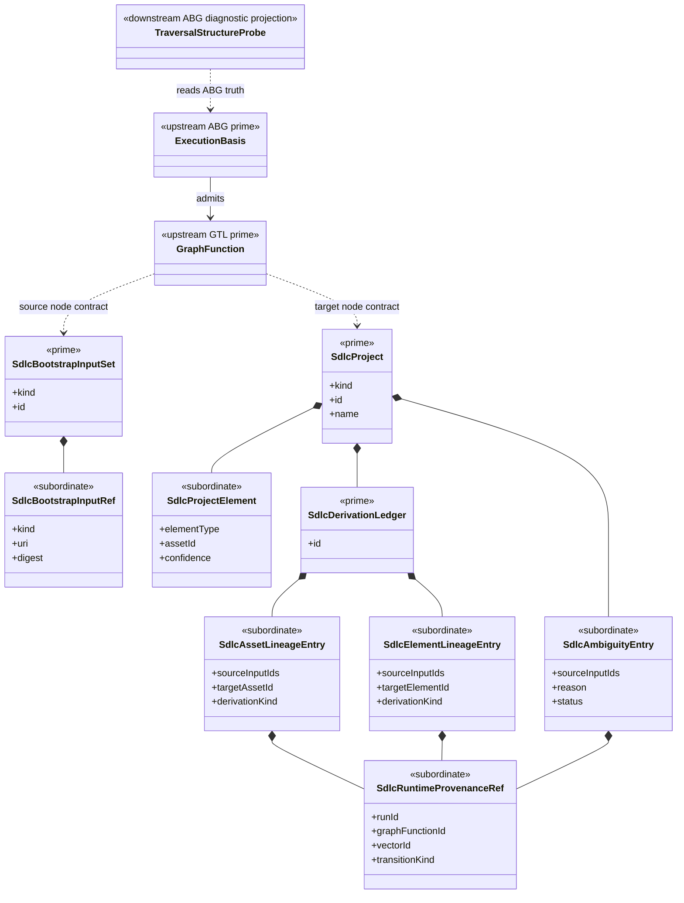

# M05 SDLC Bootstrap Lineage Structural Carrier Diagram

**Status**: Active
**Date**: 2026-04-26
**Derived from**: [M05_SDLC_BOOTSTRAP_LINEAGE_DERIVATION.md](./M05_SDLC_BOOTSTRAP_LINEAGE_DERIVATION.md), [M05_SDLC_BOOTSTRAP_LINEAGE_FIRST_SLICE_IACS.md](./M05_SDLC_BOOTSTRAP_LINEAGE_FIRST_SLICE_IACS.md), [T-063](../../.ai-workspace/tickets/completed/T-063-realize-typescript-m05-sdlc-bootstrap-lineage-poc-over-gtl-abg-provenance.md)

## Purpose

Render the `SDLC_BOOTSTRAP_LINEAGE_001` PoC as one carrier topology so the
bootstrap ingress, typed project result, semantic lineage, and ABG provenance
join are inspectable before implementation closure.

## Diagram

## Reading Rules

- `SdlcBootstrapInputSet`, `SdlcProject`, and `SdlcDerivationLedger` are the
  only prime carriers in this slice.
- Input refs, project elements, lineage rows, runtime provenance refs, and
  ambiguity entries stay subordinate.
- `GraphFunction`, `ExecutionBasis`, and `TraversalStructureProbe` remain
  upstream or downstream GTL/ABG truth. This slice consumes them; it does not
  redefine them.
- Runtime provenance and semantic derivation are joined but not collapsed.

## Sign-Off Claim

This diagram is lawful only if implementation:

- admits weak bootstrap input once,
- constructs `GF_BOOTSTRAP_PROJECT` as `BootstrapInputSet -> Project`,
- derives a typed `SdlcProject` without reading workspace files,
- carries lineage inside `SdlcDerivationLedger`,
- joins lineage to ABG provenance through subordinate refs, and
- keeps SDLC project semantics outside ABG runtime carriers.
