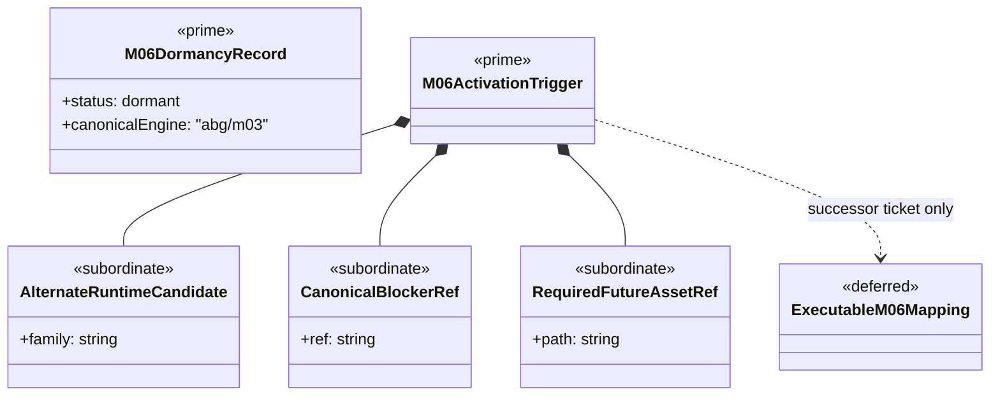

# M06 Mapping Deferred Structural Carrier Diagram

**Status**: Completed
**Date**: 2026-04-24
**Derived from**: [M06_MAPPING_DEFERRED_DERIVATION.md](./M06_MAPPING_DEFERRED_DERIVATION.md), [M06_MAPPING_DEFERRED_TRIGGER_IACS.md](./M06_MAPPING_DEFERRED_TRIGGER_IACS.md), [T-023](../../.ai-workspace/tickets/completed/T-023-adjudicate-typescript-m06-mapping-deferred-trigger-boundary-under-explicit-deferred-only-law.md)

## Purpose

Render the dormant `M06` boundary as one module-bounded Mermaid UML carrier
topology so the trigger law is inspectable before any alternate runtime
implementation starts.

## Diagram

## Reading Rules

- `M06DormancyRecord` and `M06ActivationTrigger` are the only prime carriers in
  the current deferred line.
- executable mapping carriers remain deferred.
- no code boundary exists until a successor ticket opens one.

## Sign-Off Claim

This deferred `M06` diagram is lawful only if the TypeScript tenant keeps
alternate-runtime mapping dormant until a future ticket explicitly supersedes
this trigger boundary.
