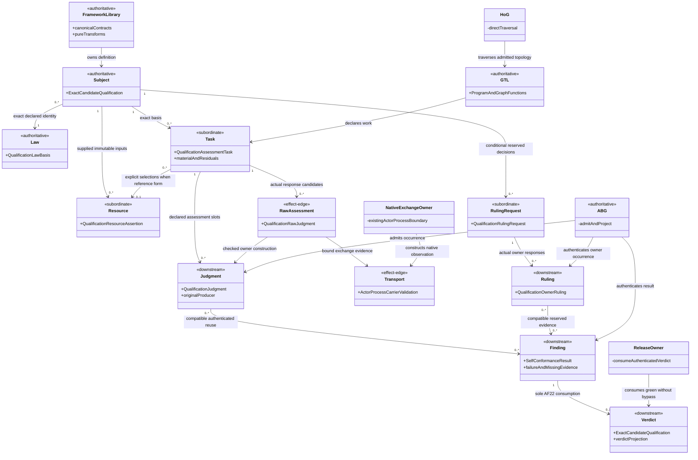
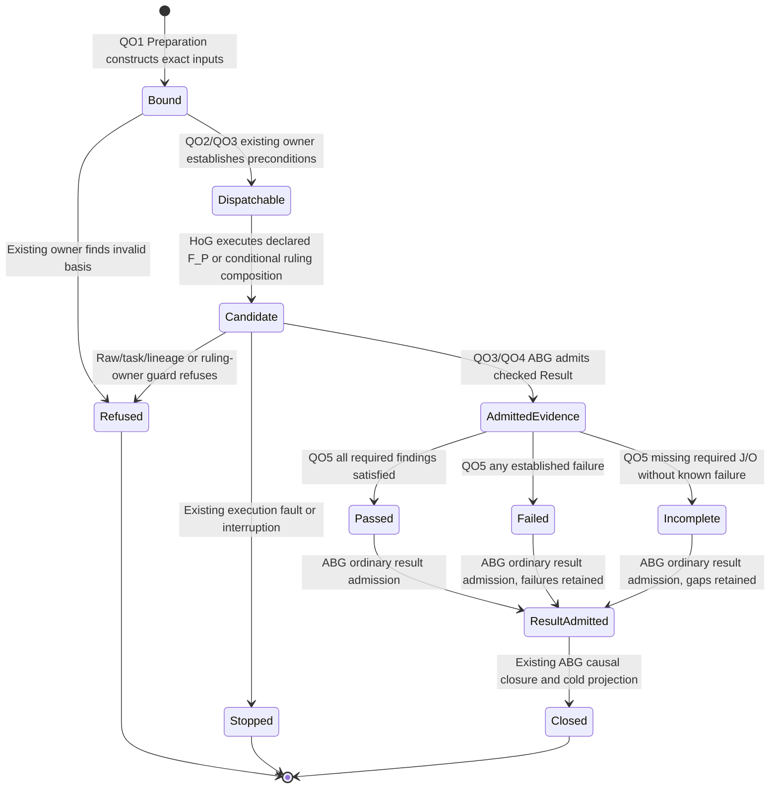

# T-287 F11: Reusable Qualification Library Target

**Status:** Accepted bounded target scaffold under STDO 2.5.1 RC2; implementation and qualification remain open.
**Boundary:** F11/F15, with the required F05 publication, F10 evidence and F16 release joins.
**Re-entry:** `design_reframe` for the consolidated target; each implementation gap has its own smaller re-entry.
**Ontology/design basis:** `T287-QO@1`, derived from the existing qualification domain below. Independent Design/library and implementation/Proof reviews are CLOSED GO; [Executive acceptance](../../../../.ai-workspace/comments/codex/20260928_FRAMED_GOVERNANCE/rc1-reusable-qualification-library-design-01/return.md#executive-acceptance-and-bounded-recording-activation) accepts the bounded scaffold and existing-substrate constructability.
**Current-to-target analysis:** [gap analysis](../../../../.ai-workspace/comments/codex/20260928_FRAMED_GOVERNANCE/rc1-reusable-qualification-library-design-01/gap-analysis.md).
**Exact inspected Source:** [31 body/mode pins](../../../../.ai-workspace/comments/codex/20260928_FRAMED_GOVERNANCE/rc1-reusable-qualification-library-design-01/subject-pins.json), `main@55a8a452` plus named dirty inputs. Revision 2 corrects bounded view-fidelity and evidence wording after independent review. This is not a released candidate.

## 1. Outcome and governing relations

One reusable framework library carries qualification information from an exact candidate and its law to sufficient independent assessment, an authenticated F11 finding, the sole AF22 verdict and the existing release owner. A caller supplies domain sources and criteria through declared extension points; it never reconstructs framework identity, lineage, admission or disposition.

Owning WHAT: [Product F05/F10/F11/F15/F16](../../../../specification/PRODUCT.md), [SELF-CONFORMANCE001–012](../../../../specification/requirements/product/REQ-P-SELF-CONFORMANCE.md), [QUAL057/064A–C](../../../../specification/requirements/product/REQ-P-QUAL.md), and [PUBLIC-CONTRACTS005/006A](../../../../specification/requirements/product/REQ-P-PUBLIC-CONTRACTS.md).
Owning HOW: [native qualification design](T287_D4_D5_NATIVE_QUALIFICATION_DESIGN.md), [carrier/resource design](T287_F11_CARRIER_RESOURCE_DESIGN.md), [realization constitution §§7/10/12](ABI5_REALIZATION_CONSTITUTION.md), and [end-to-end integration frame](ABI5_PROJECT_REFERENCE_FRAME_BASIS.md#f-end-to-end-interface-integration).
The sole method basis is the current [Definition](../../../../stdo_abiogenesis.json): `stdo://releases/v2.5.1-rc.2/`, verified manifest `3d860ff4c1746f06ac25295a9e205cffb8e7725869615ac77cf2304b70ff2782`. Its DESIGN_MODULE_METHOD §§4B/5E and computational realization projection govern this pack. Historical method literals in predecessor HOW retain their original evidence scope.

The [Python-to-TypeScript derivation](PYTHON_TO_TYPESCRIPT_DESIGN_DERIVATION.md) supplies the preserved M03/M05 authority split. This target projects the current TypeScript qualification domain, not the paused Python file layout.

## 2. Library boundary and contraction

**Library identity:** the existing `@abiogenesis/typescript-tenant` Product. Its required `qualification/m05` contract group is the qualification facade; it re-exports canonical definitions from their existing owners. Required `abg/m03` and transport groups supply their own runtime/transport contracts. Root aggregation is additional navigation, not replacement publication.

The facade introduces no peer schemas, duplicated interfaces, new public operation or universal envelope. Distinct source and destination contracts remain distinct. Pure implementation stays in its current owning modules; a worker may choose equivalent file placement inside an accepted operation grant.

| Canonical family / role | Owning library source | Consumers and permitted transformation |
|---|---|---|
| ExactCandidateQualification, law, inventory, scope, material, task/plan, J/O, verification and verdict contracts | `validator/qualification_contracts.ts` | Preparation, native owners, F11 and AF22 import the same definitions; generated assets project them. |
| F11 input, owner, finding and result | `validator/self_conformance_contracts.ts` | F11 and cold consumers preserve subject, rule/source/surface, citations and disposition. Result is explicitly not a qualification verdict. |
| Raw assessment and worker exchange | `validator/qualification_contracts.ts`, `implementation/contracts.ts`, `abg/actor_process.ts` | The leaf supplies ProbabilisticWorkerRequest; the existing native owner validates its ActorProcessRequest/ActorProcessCarrierValidation exchange. QualificationRawJudgment is parsed actor content, distinct from the native owner's ActorProcessObservation. Canonical construction preserves every lineage field under carrier HOW §5.1's discriminated mint/projection/callback contract. |
| Resource resolution and normalized partitions | `validator/qualification_resources.ts` | Resolve explicit immutable selections once; retain source meaning and ordered domain. No ambient lookup. |
| Request/J construction and sole verdict reduction | `validator/qualification.ts` | Render only the bound responsibility; attach actual lineage through its owner; reduce authenticated F11 without reinterpreting it. |
| Evidence authentication/currentness | `abg/qualification_proof.ts` and existing projector owners | Establish actual producer, task, attempt, GraphFunction, source cursor and Result once per valid basis; direct and parent paths resolve the original producer. |
| Whole F11 assessment | `validator/self_conformance.ts` | Consume complete inventory/C facts and authentic J/O; conserve known failures and unresolved obligations separately. |
| Declared computation and physical execution | `gtl/self_conformance.ts`, existing HoG and leaf implementations | GTL declares F_P/F_D work; HoG traverses; implementation performs only the declared leaf; ABG admits. |
| Publication and release | existing Product publication and release owners | Publish required contract content and consume sole authenticated AF22; no caller-issued green verdict. |

**Prime/IACS disposition:** consume the existing basis, task, judgment/ruling, F11 result and verdict families. Inventory/material/criterion rows remain subordinate data. Raw actor output and transport evidence are effect-edge inputs, not admitted findings. A resource assertion is supplied immutable input, not a new store. A qualification episode is an ordinary ABG Run, not another lifecycle entity.

Whole-family contraction keeps five distinct semantic relations: bound preparation; independent evaluation; native evidence authentication; F11 finding aggregation; sole qualification reduction. They cannot merge without conflating responsibility, source truth or qualification authority. The seven defect families parameterize these relations by source/rule/surface; they do not create seven handlers. No atom, identity, runtime transition or effect owner is added.

## 3. Compact ontology and authority scaffold

Stable relations: **QO1** exact subject/law; **QO2** complete required domain versus sufficient selected material; **QO3** actual producer-to-consumer lineage; **QO4** independent judgment and conditional owner ruling; **QO5** conserved finding and citation; **QO6** sole release verdict.
Their values derive from the owning requirements/HOW above. A changed governing source invalidates only its affected joins and proof.

| Identity-bearing family | Create / owner | Read or project | Change | Retire |
|---|---|---|---|---|
| Subject/law/catalog | Existing Product/qualification construction and publication | Exact pinned definition | New content identity; two subject kinds only | Supersede; retain old evidence |
| Task/resource/plan | Preparation under existing construction grant | Explicit source/entry selections | New identity on material delta | Retain archive; cease current use |
| J/O | Declared assessor or reserved owner proposes; ABG admits occurrence | Native owner authenticates original evidence | New assessment/ruling, never overwrite | Invalidate current use on declared invalidator |
| F11 result | Existing evaluator proposes; ABG admits ordinary result | Native F11 owner and fresh Public reads | New episode/result on changed inputs | Preserve prior findings |
| Verdict / release | Sole AF22 / existing release owner | Authenticated native verdict and release record | New verdict; Product changes require applicable higher RC | Preserve immutable cut; supersede selector lawfully |

| Function family / domain | Proposer / evaluator | Verifier / admitter | Executor / projector / retirement |
|---|---|---|---|
| Bound preparation: exact material and criterion selections | Authorized preparation actor; independent role judges sufficiency | Contract/source checks; preparation creates no runtime admission | Existing construction effects; pure request projection; owning work carrier |
| Assess: declared criterion domain | Independent native assessor; conditional ruling only at reserved owner | Existing raw/task/lineage guards; ABG admits | Declared F_P/F_H seam; native proof projection; exact invalidators |
| F11: complete applicable subject | Existing F_D evaluator consumes C/J/O | Conformance semantics and ABG owner | Existing leaf; fresh result/replay; new input replaces current use |
| Verdict/release: authenticated whole F11 plus required gates | Sole AF22 / actual release authority | Existing native authentication and release admission | Existing declared owners; immutable records; release supersession law |

**Transformation admission:** exact immutable definitions and original resources → current dispatch basis → declared task/CCall → raw candidate plus transport → canonical constructed J/O → owner checks → ABG Result admission → authenticated F11 → sole AF22 → release owner. Each consequential admission consumes its explicit predecessor and unique eligible producer. A body reference or parent wrapper aliases the original producer; it does not mint another judgment. Partial physical success or raw output cannot imply admission/closure. Semantic refusal and execution fault remain distinct.

## 4. UML views

These are projections of QO1–QO6. Names abbreviate existing carriers/owners; no classes, enums or runtime machinery are requested.



Sharing is permitted only for the same exact subject/law and supported scope, applicability, independence and currentness; each selection retains its unique original producer. A consumer does not mint another J/O. The mandatory law coordinate does not imply its body was supplied: unavailable law/material/resources remain incomplete, never synthesized. Embedded and reference input forms retain their existing distinct domains.

```mermaid
sequenceDiagram
  actor Preparation
  participant FrameworkLibrary
  participant GTL
  participant HoG
  participant NativeExchangeOwner
  actor NativeActor
  actor ReservedOwner
  participant ABG
  participant ReleaseOwner
  Preparation->>FrameworkLibrary: QO1/QO2 bind subject, law, task and explicit resources
  Preparation->>GTL: Invoke existing published GraphFunction with typed input
  GTL->>HoG: Declared assessment and evaluation computations
  HoG->>FrameworkLibrary: QO2/QO3 prepare owner request under current basis
  HoG->>NativeExchangeOwner: Declared F_P request and existing owner effect grant
  NativeExchangeOwner->>NativeActor: Bound prompt and response contract
  NativeActor-->>NativeExchangeOwner: Raw actor content only
  NativeExchangeOwner-->>HoG: Checked exchange with owner-observed Transport
  HoG->>FrameworkLibrary: QO3/QO4 check raw and construct canonical lineage-bound J
  HoG->>ABG: Existing owner admits Result or refuses
  ABG-->>HoG: Exact admitted producer and successor resource
  opt QO4 requires a reserved ruling and its existing native route is available
    Preparation->>GTL: Typed QualificationRulingRequest at existing ruling GraphFunction
    GTL->>HoG: Existing declared F_H and ruling-finalize F_D composition
    HoG->>ReservedOwner: Existing scoped qualification-ruling request
    ReservedOwner-->>HoG: QualificationOwnerRuling candidate or truthful insufficiency
    HoG->>FrameworkLibrary: Existing native ruling-owner checks and finalization
    HoG->>ABG: Admit original O Result or refuse at its owner
  end
  HoG->>FrameworkLibrary: QO5 evaluate whole F11 from authenticated C/J/O
  FrameworkLibrary-->>HoG: Conserved findings and citations; missing/insufficient required J/O stays explicit
  HoG->>ABG: Admit F11, then declared sole AF22 result
  Preparation->>ABG: Fresh supported result and replay reads
  alt authenticated green and all required gates
    ABG-->>ReleaseOwner: QO6 exact non-bypassed verdict
    ReleaseOwner->>ReleaseOwner: Existing immutable release operation
  else failed, incomplete or invalid basis
    ABG-->>Preparation: Truthful non-green result or refusal
  end
```



Passed/Failed/Incomplete describe F11 meaning, not new ABG Run states. Ordinary Run completion can carry a non-green result. J and O have separate canonical candidates and predicates; the shared candidate-state notation does not make them interchangeable. Required O uses only the existing qualification-ruling contract/producer. An unavailable response path withholds its dependent claim; this pack neither invents nor activates 5.1 human-response/resume. Authorized continuation or fresh invocation re-enters existing runtime contracts with a new current input; this diagram grants no broader recovery support or automatic repair/retry.

## 5. Information transformation and computation constraints

| Path / contract join | Established invariant and refusal | Owner / bounded discriminator |
|---|---|---|
| Inventory → selected task material | Inventory remains complete; bodies are sufficient for the selected responsibility, with justified omissions and explicit unprovided refs | Preparation + independent sufficiency J; render one genuinely bound request before expanding |
| Task → request → raw → J | Preserve exact input, actor, request/prompt, transport, producer and value identities through their canonical contracts | Native construction/admission owners; original field conservation and malformed/cross-basis refusal |
| Direct child / parent alias → J | Same original task, producer, GraphFunction, cursor and resource; unique current eligible evidence | ABG proof owner; real parent/direct positive and negatives that reach the intended predicate |
| Multiple judgments → F11 | Known falsification and its citations survive missing peers; remaining incompleteness stays explicit | Existing evaluator; mixed failed/missing-root counterexample and cold F11→AF22 consumption |
| Required Public content → claims | Published claims have owners and the mandatory corpus is complete; neither implies the other | Product publication owner + independent tenant/rule J; actual omitted mandatory contract |
| F11 → AF22 → release | Exact subject/law/coverage; no bypass; failed remains red, incomplete remains blocked | Sole AF22 and release owner; native/cold result conservation |

Typed transforms are independent of traversal policy. GTL carries ordering, recursion, grouping and F_P/F_D computations; HoG binds their implementation occurrences; ABG owns effects/admission/currentness/closure. Sharing transformation code does not move any of those responsibilities into the library facade, preparation script or proof consumer.

Composition laws: exact basis is conserved across sequential composition; group coverage is a complete declared partition, not a Cartesian expansion; known failure is absorbing for the affected finding and whole F11 result; unknown required support prevents pass; evidence sharing retains source identities and applicability; reuse requires unchanged support and currentness at its owner. There is no mandatory single-shot campaign.

## 6. Computational realization and foundation disposition

Generic capabilities are closed-value parsing, canonical identity, immutable construction, exact selection, partition correspondence and typed effect composition. The selected composition consumes existing Valibot `1.4.2`, Effect `3.22.1`, canonical JSON/digests, immutable carriers, exact-match and native projection owners. Semantic evidence selection, independence and qualification remain their existing owners' irreducible relations.

The bounded comparison is within the current Product's admitted foundations and preserved M03/M05 lineage. Existing composition retains those established ABI/effect semantics; a new package or local clone would add a contract/migration/proof surface without supplying missing authority, sufficient context or actual seed detection. No new generic mechanism or dependency is selected. External replacement survey is not applicable to this documentation-only consolidation; a material foundation replacement or new common algorithm re-enters constitution §10.1 before implementation.

Operational dimensions: inventory members, rule groups, application partitions, selected bodies/bytes, native occurrences and prefix length. Preserve interned partitions and explicit resources; do not multiply every rule by every member or send all domain bodies to every assessor. Native checks may still authenticate referenced history. Cache/reuse is permissible only under the existing validity relation; no new persistent cache, new performance threshold or semantic sampling waiver is authorized.

Record preparation, framework work, external computation and cold-read work separately. Material/context sufficiency is an independent judgment; low byte volume or successful rendering alone cannot establish it.

## 7. Seven-case proof and worker entry

The oracle tuple for every case is: exact baseline and law; exact mutant delta/new subject identity; owning rule and affected surfaces; expected stable diagnostic and disposition; authentic F11 and sole AF22; restored baseline identity. Exact byte deltas are selected against the final qualifying baseline in the existing proof record; this design does not invent unavailable candidate coordinates.

| Seed | Required source material / expected owning route |
|---|---|
| Missing authority | Exact required member and absence; authority diagnostic, non-green |
| Broken traceability | Actual requirement/design/code relation; source-linked falsified rule finding |
| Unowned Public contract | Actual publication/owner relation and required roster; ownership/completeness finding |
| Design/code drift | Contradictory actual HOW and realization bytes; source-linked falsified rule finding |
| Malformed proof claim | Actual claimed proof and authenticated scope/provenance; proof refusal or source-linked inadequacy finding at the intended boundary |
| Ticket/closure mismatch | Actual ticket obligation, closure and realized evidence; source-linked falsified rule finding |
| Release-identity mismatch | Exact prospective/installed release coordinates; owning identity diagnostic, non-green |

A malformed fixture refused before the intended boundary earns only that ingress claim. It cannot substitute for the corresponding semantic seed. A supplied falsified J proves propagation only. Assessor requests contain the original question and rubric, not the expected answer or seed name as an oracle. Genuine sufficient independent assessment must establish detection. Reuse unchanged baseline evidence; retain every separate mutant subject and restore the positive without editing any frozen cut.

Each worker grant names one row/path, canonical imports, exact candidate preimage, write territory, first-failure stop and observable exit proof. Integration failure returns QO1–QO6 and actual variables for Product/Design/integration/identity/effects/Proof triangulation before patch or retry.

## 8. Cross-view design gate and observable completion

| Applicable law | Ontology / authority / domain | Sequence / state | Native or admission enforcement | Target evaluation / current gap |
|---|---|---|---|---|
| WHAT traceability and exact basis | QO1; existing subject/law owners | Bound/current-basis checks; invalid input refuses | Canonical schemas + native owners | **pass** for the bounded target; actual candidate qualification open |
| IACS/Prime and one contract source | §2 canonical families; no promotions | Facade performs no lifecycle decision | Exact exports/catalog/source ownership | **pass** for the bounded target; required publication content incomplete |
| Complete domain / sufficient context | QO2; independent role | Bound request before dispatch; unknown cannot pass | Scope/material correspondence + J | **pass** for the bounded target; genuine context sufficiency unproved |
| Typed lineage and independence | QO3/QO4; native exchange owner; distinct raw/transport/J and request/O; ABG admission | Actor emits raw only; owner observes transport; conditional O has its own scoped branch | Task/raw/J/native-source and ruling-owner checks | **pass** for corrected target views; existing routes present; parent and genuine ruling proof retain their limits |
| Failure and citation conservation | QO5; F11 owner | Failed with missing support remains failed | Typed findings, whole-result fold, native AF22 | **pass** for target conservation; current early-return defect |
| Graph topology and effect separation | GTL/HoG/ABG role set | Declared computations; existing refusal/fault/closure | Existing GTL/HoG/Effect/ABG binding | **pass** for existing-mechanism reuse; no rival controller |
| Sole verdict / immutable release | QO6; AF22/release owner | Non-green prevents publication | Native whole F11/verdict/release joins | **pass** for the bounded target; green release proof absent |
| Actual seven seeds | §7 actual subjects and oracle | Real defect → J/finding → non-green → restore | Existing evaluator/native proof path | **pass** for target experiment; required campaign still open |

New human-response/resume, dedicated Consensus/observer and additional host parity are not applicable: current Product reserves them for 5.1. Conditional existing qualification owner rulings retain their current authority. New runtime states, generic auditors and scaffold schemas are excluded by this boundary.

Before implementation promotion, independent evaluation and Executive disposition must establish this candidate ontology/design's sufficiency and native constructability at the affected boundary. Code positions and method section names alone supply no acceptance. Completion metrics: canonical definition source count **one per logical contract**; conserved required lineage fields and known-failure citations **zero losses**; case bindings **seven complete of seven**; actual detection/restore proofs **seven sufficient of seven**; affected native/cold chain **complete**, with implementation and genuine semantic proof reported separately.
