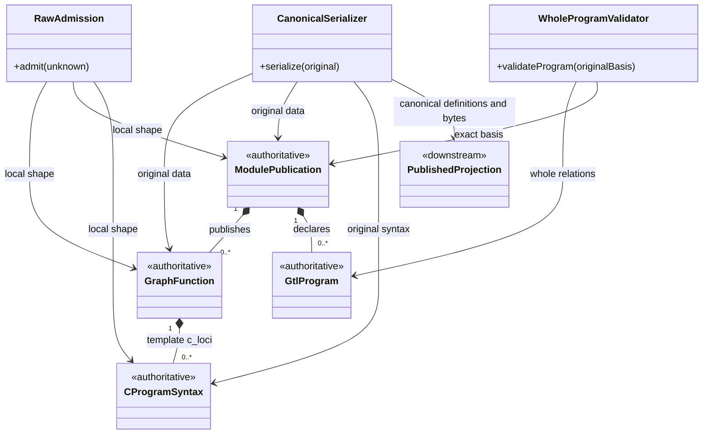
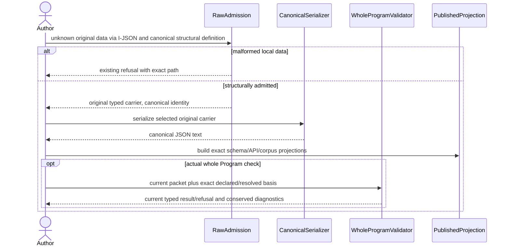
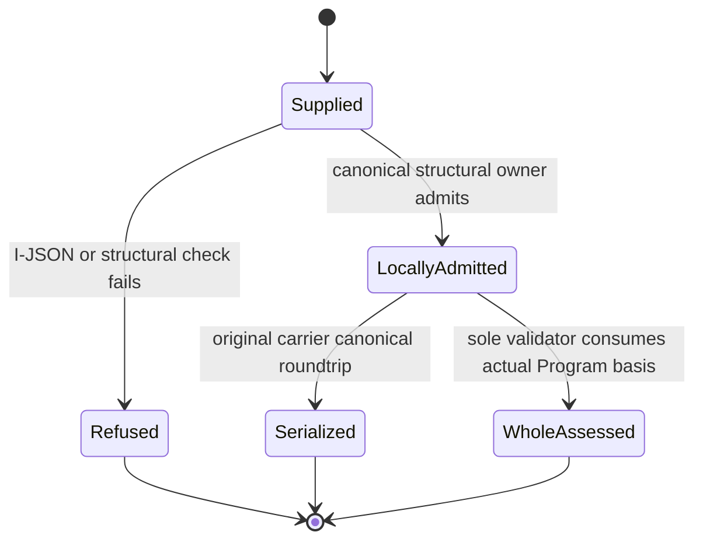

# T287 G2 Current GTL Serialization And Publication Design

Status: accepted for the bounded current GTL core by Root after independent `GO_CORE_DESIGN_ONLY`; constitutional adjunct and unresolved repair mappings remain open. Operation: `T287_G2_GTL_CURRENT_HOW_01`; re-entry: `design_reframe`.
Scope: current M01/M02 ingress and canonical serialization, M03 static conformance, and their Public projections. Existing ABG5 fifteen-family Product and runtime authorities are preserved. This document grants no implementation effect or qualification credit.

## 1. Authority And Exact Current Relation

The selected frame is [end-to-end interface integration](./ABI5_PROJECT_REFERENCE_FRAME_BASIS.md#f-end-to-end-interface-integration), conjoined with Language/Library/Proof. STDO2.5.1RC2 `DESIGN_MODULE_METHOD` §§4B/5E/Computational Realization Projection governs this affected design slice.
The parent [reusable-library target](./T287_F11_REUSABLE_QUALIFICATION_LIBRARY_TARGET_DESIGN.md) supplies the existing library/authority boundary; this proposal supplies its missing current GTL ingress/publication relation, not new qualification or runtime meaning.

| Owning WHAT | Required outcome | Current binding / proposed decision |
|---|---|---|
| PUBLIC-CONTRACTS005/006/006A/007/007A | Named native APIs, exact schemas/vocabularies and published corpus | Extend the current eight facades and manifest projections over their canonical owners; required identifiers are retained |
| GRAPHFUNCTION001–003/009; MODULE001–005 | Immutable inspectable original declarations | Use current `GraphFunction` and `ModulePublication` in `gtl/contracts.ts`; `admitModule` does not construct a historical alternate Module |
| C-ALGEBRA001–012; CONTRACT-LAW-API009–012 | Seven original terms, native-equivalent local admission, one whole-law validator, no lowering | Use current `CProgramNode`, preserve native C witnesses separately, and delegate whole checks to `validator/validation.ts` |
| LAWS019–023/026–028 | Stable diagnostics, canonical lossless data, corpus and witnessed drift | One owner register/projection; explicit current constitutional adjunct is separate from the ready core |

The relevant requirement files are `specification/requirements/product/REQ-P-PUBLIC-CONTRACTS.md` and `specification/requirements/gtl/REQ-L-GTL3-{GRAPHFUNCTION,MODULE,C-ALGEBRA,CONTRACT-LAW-API,LAWS}.md`.
Current `rawAdmitValue<S>` validates kind/canonical representability and casts `S`; that is not structural admission. Current `ConformanceEvaluatePacket` has exactly `kind`, `schemaVersion`, `memberKey`, `publication`, `program`; `ProgramValidationInput` is its owner-derived branded validation basis. Historical broader inventory HOW is not this carrier.

## 2. Owner And Carrier Scaffold

| Relation | Sole owner and admitted domain | Authority / reuse |
|---|---|---|
| SG1 structural declaration | GTL owner: current GraphFunction, ModulePublication, GtlProgram and recursive seven-term syntax plus their subordinate fields | One declarative structural definition; native types, admission and serialized schemas project it |
| SG2 local ingress / canonical form | Existing I-JSON, raw-admission, authored canonicalization, immutable and digest foundations | `unknown` becomes the original immutable typed value or an existing typed refusal; never a cast certificate |
| SG3 whole Program law | Existing conformance owner and `validateProgram(ProgramValidationInput)` | Consumes original publication/Program and the exact supplied/resolved declaration basis; structural admission alone does not establish membership, topology or binding law |
| SG4 diagnostic / repair projection | Existing validator plus ratified LAWS/version-basis HOW | Closed identity construction; repair data describes permitted edits and performs no repair |
| SG5 publication | Existing manifest generator, `resolveNativeDeclarationClosures`, `nativeTypedLocator` and Product catalog | Native/schema/vocabulary/corpus rows are downstream projections; packed consumers resolve actual bytes |

Prime disposition: SG2 local structural admission, canonical serialization, SG3 relational validation and SG5 physical publication have distinct domains/authority. They share definitions and foundations; they cannot substitute for one another. No new runtime carrier or universal schema is introduced.
IACS reuse: existing original GTL values, `RawAdmittedValue<T>`/`RawAdmissionRefusal`, `ProgramValidation`/`StaticValidationRefusal`, and the current conformance result/refusal family. Schemas, API aggregates, vocabularies and corpus are immutable downstream artifacts, not independent admission or closure authority.

## 3. Implementation-Ready Core

Use one owner-local declarative structural family with existing Valibot and `projectStrictJsonSchema`; native pure-data declarations derive from that family. Existing exported carrier names/fields remain compatible. There is no separately handwritten equivalent JSON schema or key-profile family. Recursive links and opaque declared records retain their actual current meaning; a worker does not broaden them to arbitrary objects to satisfy typing.
Object ingress first uses `admitIJsonValue`, then recursively checks required/optional keys, field kinds, literal tags, union variants and current local constructor constraints before canonicalization and branding. Unknown siblings, omitted required fields, malformed nested elements and non-I-JSON values refuse at their actual path. Dynamic declaration/policy records retain every admitted entry. Do not strip malformed data, default missing fields or manufacture a publication.
Duplicate decoded JSON property names require existing `admitIJsonText` before object ingress. An API receiving an already parsed object cannot attest its original text was duplicate-free. Preserve existing refusal envelopes and retain the exact failing JSON pointer in their diagnostic/message projection.

| Required API | Original carrier / result | Canonical owner relation |
|---|---|---|
| `admitGraphFunction(unknown)` / `serializeGraphFunction(value)` | `RawAdmissionResult<GraphFunction>` / canonical JSON text | Complete current GraphFunction and nested template/environment/C shape; serializer uses current authored normalization |
| `admitModule(unknown)` / `serializeModule(value)` | `RawAdmissionResult<ModulePublication>` / canonical JSON text | Complete current publication, including all present optional lifecycle/environment/handoff fields and subordinate declaration variants |
| `admitCProgramSyntax(unknown)` / `serializeCProgramCanonical(value)` | `RawAdmissionResult<CProgramNode>` / canonical JSON text | Exactly `c_of`, `c_identity`, `c_compose`, `c_edge`, `c_workflow`, `c_batch`, `c_retry`; recursive children, edge roles and leaf variants are checked |
| `GtlProgramConformanceInput` / `admitGtlProgramConformanceInput(unknown)` | Current five-field ConformanceEvaluatePacket shape / owner-admitted input | Canonical definition at current conformance owner; retain `ConformanceEvaluatePacket` as a compatibility projection, not a rival input |
| `typecheckGtlProgram(admittedInput, declarationBasis?)` | Current conformance result/refusal | Calls the actual current conformance owner, which builds the exact branded ProgramValidationInput and invokes the sole validator; preserve existing supplied/resolved closure matching |

All serializers validate their selected carrier before emitting RFC8785 canonical UTF-8 text. Only current authored inventory normalization is permitted; input/output positions, graph/C child order, seven-term nesting, refs, optional presence and declared opaque payloads survive. No flattened/compiled execution declaration is emitted.
Constructor-owned C proof metadata is not authored JSON. Its owner may erase only its own verified non-data witness during serialization; raw syntax admission does not recreate `CProgramTerm` brands, CCarrier witnesses or runtime authority. Unknown host metadata remains a refusal. Native generic input/output witnesses remain at native constructors.
The core routes its actual ingress and static diagnostic identities through one validator-owned register, preserving all fifteen current static spellings and actual current ingress codes. Native `GtlProgramDiagnosticId`, value arrays, schemas and constructor checks derive from the register; unknown identities fail closed. The five ratified drift identities remain required and their detector gap is explicit in §5.
No standalone GraphFunction or C ingress synthesizes a minimal Program or invokes whole validation as a structural surrogate. Whole-law failure/unavailable basis cannot become an admitted semantic pass. No API is satisfied by an always-refuse stub.

The state view describes pure transforms, not persisted runtime states. Every sequence participant is the same owner/external Author in the domain table; publication has build effects only. Shape/schema changes invalidate affected native declarations, serialization, catalog digests and packed proof; changed Program/basis invalidates whole assessment, not unrelated original evidence.

## 4. Required Publication And Proof

| Required row identity | Current native address / exact located meaning |
|---|---|
| `abg.schema.gtl-graph-function` | `./gtl/m01`: named admit/serialize exports plus immutable `GTL_GRAPH_FUNCTION_SERIALIZATION_API` aggregate |
| `abg.schema.gtl-module` | `./gtl/m02`: named admit/serialize exports plus `GTL_MODULE_SERIALIZATION_API` aggregate over ModulePublication |
| `abg.schema.gtl-c-program` | `./gtl/m01`: named admit/serialize exports plus `GTL_C_PROGRAM_SERIALIZATION_API` aggregate over original syntax |
| `abg.schema.gtl-program-conformance-input` | `./abg/m03`: named input/admitter plus `GTL_PROGRAM_CONFORMANCE_INPUT_API` aggregate |
| `abg.vocabulary.gtl-program-diagnostic-id` | Current validator register; `./abg/m03` named type/value roster; partial detector coverage is disclosed |
| `abg.vocabulary.gtl-program-repair-edit-class` | Existing ratified repair classes/default map; held from completeness acceptance until §5 mapping is grounded |
| `abg.asset.gtl.language-conformance-corpus` | One canonical versioned JSON asset with actual original Program/publication data, exact expected diagnostic IDs and vocabulary contract dependency |

All four schema rows locate the canonical schema document and their exact named definitions. Each immutable API aggregate binds its schema definition and both actual named functions; the conformance aggregate binds its named input type through its typed admitter. Existing single `nativeTypedLocator.namedSymbol` anchors that aggregate; complete native declaration closure must independently resolve all mandated names/signatures. One matching export name or broad group address is insufficient. No catalog shape or identity is added.
The exact canonical schema-definition family supplies serialized definitions, runtime admission and native declarations. Existing inventory/digest helpers supply catalog digests. Schema rows may share one document while preserving separate IDs; native closure, named definition and API-pair correspondence are mandatory. Preserve all existing catalog identities/generic addresses and extend `abg.contract.gtl.m01`, `abg.contract.gtl.m02`, `abg.contract.abg.m03` content at their owners.
The corpus is authored data with fixed expected IDs, not generated from observed checker outputs. Include a real valid original Program/publication baseline, legal seven-constructor coverage, schema-erased input negatives, meaningful whole-law mutations and original positive restoration. Standalone malformed-carrier tests supplement it; fabricated minimal Programs are not structural admission proof. The generator canonicalizes/publishes its bytes and schema; tests consume that same asset.
Focused proof: strict native consumer types; recursively malformed/unknown/missing-key and I-JSON negatives; all supported variant roundtrips and same-digest equality; native C witness versus admitted syntax distinction; actual sole-validator positive/mutation/restore; unknown diagnostic refusal; extracted package pair/type/schema/complete declaration closure and corpus/vocabulary hash joins. Test fixtures disclose supplied declaration-basis premises and establish no installed Runtime proof.

## 5. Explicit Constitutional Adjunct And Remaining Meaning

LAWS028 and [accepted version-basis HOW](./M03_CONSTITUTIONAL_VERSION_BASIS_BEHAVIOR_DESIGN.md#carrier-contract) own witnessed surfaces, independently authorized surface-to-subject bindings and live facts. A current extension may carry these as an explicit typed conformance adjunct under that owner, not native runtime proof, an inferred latest version, or a restored historical inventory. The ready core retains the five-field packet until that distinct extension is adopted.
That extension runs inside the sole validator: exactly one binding by bindingRef/surfaceRef, exactly one same-tagged-subject fact, then comparison; retain independent ticket and seam checks even when version basis fails. Preserve source project / published RC / release cut / Product / Install distinction and kind-specific ref coherence.
Required exact IDs are `version-basis-unresolved`, `version-line-drift`, `release-claim-cites-active-ticket`, `surface-digest-missing`, `seam-parity-drift`. The accepted HOW grounds only this internal-reason repair map: incoherent subject/ref → `correct_reference`; absent binding/fact → `add_missing_declaration`; duplicate binding/fact → `remove_duplicate_declaration`. Those are descriptive edit classes, not authorization to execute them.
Exact current public repair mappings for the remaining four drift IDs and the complete default-repair roster are not established by the selected current Source/HOW. Retain that uncertainty; owning validator/version-basis design re-entry must settle it before the drift Code sub-operation or complete repair-vocabulary claim. No new edit-class spelling, empty placeholder map or always-refuse drift detector closes this gap. Native runtime-event/installer/release schemas and other missing assets remain outside this slice.

## 6. Smallest Code Territory And Cost

Once adopted, core Source territory is existing `gtl/contracts.ts`, `gtl/c_algebra.ts`, `validator/raw_admission.ts`, `validator/validation.ts`, `validator/conformance_operation.ts`, `validator/conformance_operation_contracts.ts`, facades `gtl/m01.ts`, `gtl/m02.ts`, `abg/m03.ts`, and `scripts/generate-product-manifest.mjs`; new owner-local `gtl/serialization_contracts.ts`, `gtl/serialization.ts`, canonical corpus source and two focused serialization/corpus tests. Reuse existing package addresses and canonicalization/I-JSON foundations; no package export redesign or copied owner definitions. Worker selects local file/algorithm details inside the exact subsequent grant.
The constitutional adjunct/repair realization is a distinct bounded sub-operation at the current validator/conformance/schema owner after its remaining mapping is adopted. It cannot silently extend core packet fields or Public operation semantics.
Measure one isolated strict compile and the focused native/schema/roundtrip/corpus/packed consumer cone. Admission traverses the supplied tree once per applicable phase; canonical ordering follows existing inventory law. Recursive syntax growth, declaration counts, depth, canonicalization and packaged compiler/schema costs are disclosed; no arbitrary new Product limit is introduced. Constructor/transport/Runtime costs are outside this pure boundary.
Root accepts this bounded core under `T287_G2_CORE_ADOPTION_CODE_STORAGE_RECORD_01` and separately grants Code as `T287_G2_GTL_CORE_REALIZATION_01`. Passing component/schema tests cannot establish all required Public content, installed F11/AF22, genuine qualification, G5/G6 or RC1 completion.
