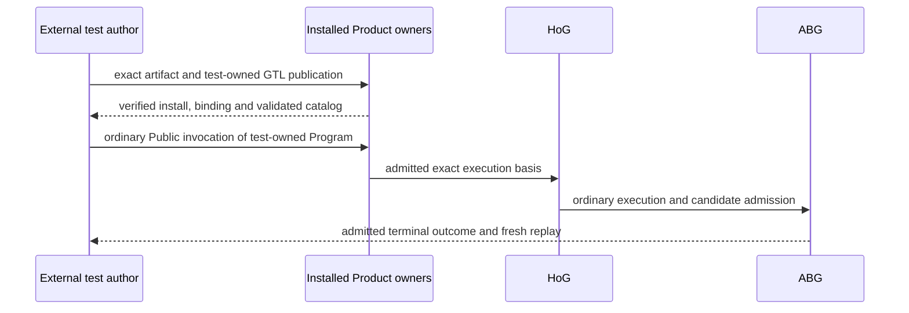

# T-287 S1 Source-Independent Artifact Proof

## Current Boundary

Owner correction, 2026-10-06: the production-owned fixed Hello root carrier is
withdrawn. `contracts/abi5-root-binding.json`, its Hello governor/module/program/
contract values, duplicated constants, manifest publication and callable-root
selection are not current implementation authority. Hello World is a minimal
language test, never an ABG Product or delivered feature. No renamed built-in
root or replacement test Product is authorized.

The generic artifact verification and source-independent package proof retain
their existing Product owners under `REQ-P-INSTALL` and `REQ-P-SCENARIOS-008`.
`ABI5-ROOT-001` remains the installed-path proof relation in Product; the external
test case owns its exact Program, GraphFunction, contracts, ordinary leaf binding,
input and oracle outside the ABG package. Those values are not authored into an
ABIogenesis production contract or used by a production-specific selector.

## Owner And Evidence Relations

| Subject | Owner | Evidence boundary |
|---|---|---|
| Exact Product artifact, manifest and content digest | Existing Product publication/verification | Immutable artifact identity; test declarations are excluded from ABG production payload. |
| Fresh extracted package observation | Existing package/proof host | Preparation and byte equality; not Product install admission or runtime truth. |
| External minimal test program | Consumer/test author | Ordinary GTL declaration, binding and independent oracle; not an ABG feature. |
| Product install and workspace binding | Existing Product owners and ABG admission | Exact installed Product and workspace; physical extraction alone is insufficient. |
| Catalog, validation and direct traversal | Existing Product/GTL validator and HoG | The ordinary supplied-publication path; no fixed test lookup. |
| Admitted result, closure and fresh reads | ABG and replay/Public projections | Actual causal episode; no fixture-authored admitted result. |

## Proof Scope

A mechanical artifact/extraction proof stops before runtime and cannot satisfy
R2-R10, any scenario or qualification. Installed invocation proof must exercise
the ordinary supported Public route and satisfy all R1-R10 on the exact
successor. Source/package absence checks exclude test-program-specific code,
contracts, publication, admission, validation, dispatch and proof branches.
No new artifact format, root selector, runtime governor, event, store or API is
authorized by this design.

The former v4/amendment acceptance identities remain immutable historical
records at `701f6c018257d271465860ecb097b44381d614d0`,
`bc3a9377b926`, `ece6597ed8846323ccab3d9a5736ecfa03f74bb3` and
`9bb230efaa5a1db06c7932a1204a5d477ead5e0f`. Their removed fixed-root carrier
cannot grant current implementation or qualification. A changed package needs
its affected installed proof; it receives no credit from an older package.
