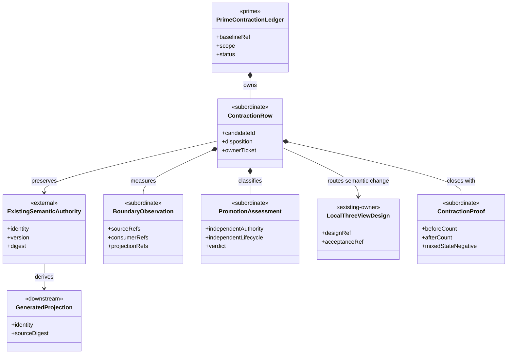
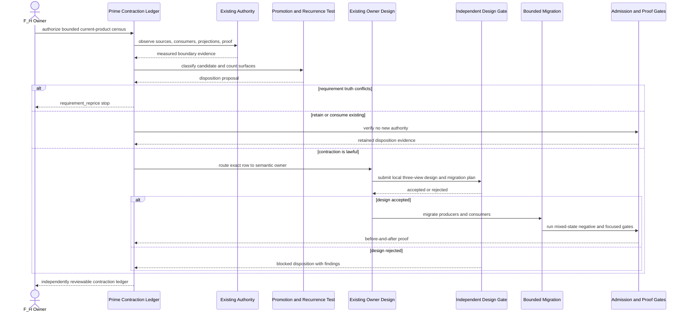
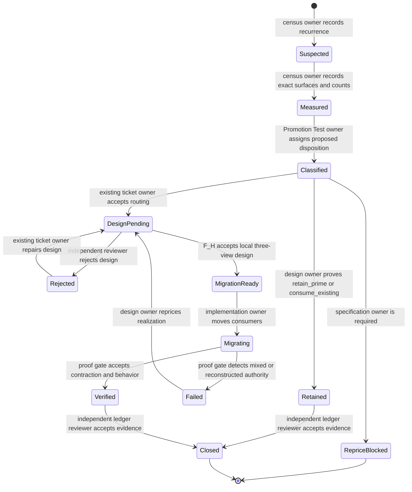

# ADR-044 - Prime contraction is a cross-boundary design gate

**Series**: abiogenesis / typescript build

**Status**: F_H-authorized for implementation; independent closure review pending

**Date**: 2026-07-14

**Owner**: T-277

**Implements**: `GOAL-035`, Design Module Method Prime Law, Irreducible
Architectural Carrier Set, Promotion Test, Recurrence Extraction, and
Post-Ticket Design Review

**Census**: [A5 Prime Contraction Census](../A5_PRIME_CONTRACTION_CENSUS.md)

## Context

The current TypeScript line applies Prime reasoning inside several individual
designs, but it does not apply that reasoning across processed boundaries.
The live completed-code register links 23 design or guardrail documents. At
the T-277 baseline, 14 mention an IACS, two mention a Promotion Test, none
records a recurrence/commonization review, and the standing automated gate
checks only registered Mermaid view shape and rendering.

That local-only application allowed distinct public identities to become
distinct authoring surfaces and allowed repeated identity, routing, schema,
capability, and proof projections to be rebuilt ticket by ticket. The defect
is not that the public contract surface is necessarily too large. The defect
is that independent public identity, authoritative truth, authorship, and
generated projection have not been counted separately.

T-277 applies already-ratified method law to the current ABIogenesis 5.0
product. It does not introduce new product requirements or shared method law.

## Decision

Every remaining 5.0 design and every current-product migration opened by
T-277 shall pass one cross-boundary Prime contraction gate before code.

The gate shall:

1. name the boundary's Irreducible Architectural Carrier Set
2. identify each authoritative source, independent public identity,
   subordinate payload, generated projection, admission boundary, and proof
   surface
3. apply the Promotion Test to every proposed top-level carrier
4. compare the boundary with already-processed boundaries for recurrence
5. record before-and-after truth and authoring-source counts
6. choose one closed contraction disposition
7. route semantic implementation to the existing owner
8. prove that migrated consumers cannot reconstruct retired truth
9. run a post-ticket recurrence review before closure

No implementation may claim Prime contraction merely because a diagram marks
a class `<<prime>>`.

## Counting Law

Four counts are distinct:

| Count | Meaning | Expected effect of contraction |
|---|---|---|
| Semantic identity | A contract, operation, capability, event, or carrier identity consumers address independently | Usually unchanged |
| Authority source | A surface permitted to decide or admit meaning | Must not increase; duplicate authority decreases |
| Authoring source | A maintained source from which equivalent declarations or projections are produced | Decreases when recurrence is real |
| Generated projection | A schema, catalog row, asset, read model, fixture, or report derived from authority | May remain numerous |

Generated multiplicity is not itself boundary inflation. Thirty-six generated
operation projections may be lawful when one definition register authors
them. One file is not Prime when it contains several rival or optionalized
truth models.

## Irreducible Architectural Carrier Set

The T-277 design boundary has one design-level Prime carrier:

- `PrimeContractionLedger`: the accepted row-by-row disposition and proof
  record for the current ABIogenesis 5.0 product

Its subordinate payloads are:

- `BoundaryObservation`: measured source, consumer, projection, and proof refs
- `PromotionAssessment`: the Promotion Test result
- `ContractionDisposition`: one closed disposition and owning ticket
- `MigrationMeasure`: before-and-after counts and mixed-state negative
- `PostTicketReview`: recurrence and closure result

These are design records, not product runtime types. They shall remain rows or
sections in the ledger unless an independent persisted or admitted boundary
later passes the Promotion Test.

Existing product authorities remain external to this design carrier. T-277
may reference them and migrate consumers, but it cannot replace them.

## Prime Contraction Review

```json prime-contraction
{
  "schemaVersion": 1,
  "iacs": [
    "PrimeContractionLedger"
  ],
  "authoritativeCarriers": [
    "PrimeContractionLedger"
  ],
  "subordinatePayloads": [
    "BoundaryObservation",
    "PromotionAssessment",
    "ContractionDisposition",
    "MigrationMeasure",
    "PostTicketReview"
  ],
  "promotionTests": [
    {
      "candidate": "PrimeContractionLedger",
      "verdict": "promote",
      "reason": "The ledger is the singular accepted cross-boundary disposition and proof record for T-277."
    }
  ],
  "recurrenceReview": {
    "status": "commonize_tenant",
    "ref": "build_tenants/abiogenesis/typescript/design/A5_PRIME_CONTRACTION_CENSUS.md#pc-011---prime-design-enforcement"
  },
  "authoritySourceCount": {
    "before": 0,
    "after": 1
  },
  "authoringSourceCount": {
    "before": 0,
    "after": 1
  },
  "disposition": "retain_prime",
  "ownerTicket": "T-277"
}
```

This block is the deterministic projection of the prose IACS and PC-011
decision. It does not replace the surrounding design or census.

## Promotion Test

A proposed top-level type, registry, schema family, module, helper, or proof
harness is promoted only when at least one condition is evidenced:

- it owns independent semantic authority
- it crosses an admission or effect boundary
- consumers address, version, persist, or pattern-match it independently
- it has an independent lifecycle or replay identity
- it is reused across semantic owners without transferring their authority

A candidate remains subordinate when it only groups fields, shortens a call
site, mirrors an existing carrier, supplies one branch of a closed family, or
repeats identity metadata already available from an admitted source.

## Disposition Algebra

Each census row has exactly one terminal design disposition:

- `retain_prime`
- `derive_projection`
- `commonize_tenant`
- `consume_existing`
- `retire_duplicate`
- `migrate_authority`
- `requirement_reprice`
- `not_a_candidate`

`requirement_reprice` is a stop. It does not authorize T-277 to edit WHAT.

## Domain View



## Execution View



## Lifecycle View



## Cross-View Invariants

| Invariant | Enforcement |
|---|---|
| The ledger is design authority only and never product runtime authority | No product import or runtime export may reference T-277 artifacts |
| Every migrated source names the preserved semantic authority | Census source refs plus local design |
| Every generated projection names one source digest or admitted basis | Projection parity and source-removal negative |
| Public identity count changes only through requirement reprice | Exact identity census |
| A retired path cannot reconstruct equivalent meaning | Mixed-state and source-removal negatives |
| One commonization surface cannot absorb unrelated semantic owners | Promotion Test and owner-specific adapters |
| Requirement conflict stops before implementation | `requirement_reprice` state has no migration transition |
| Acceptance is independent of the implementation author | Recorded review and F_H decision refs |

## Tenant Gate

After ADR acceptance, the ABIogenesis tenant shall add a deterministic gate for
designs and tickets opened or amended under T-277. The gate shall require:

- a named IACS
- authoritative and subordinate classification
- Promotion Test evidence
- a cross-ticket recurrence result
- before-and-after authority and authoring-source counts
- a ledger row and owner
- `library_usage`, `governing_library`, or a bounded rationale where ticket
  method requires it
- three ordered Mermaid views for code-bearing semantic boundaries

The gate shall include negative fixtures for a missing IACS, an annotation-only
Prime claim, an unowned recurrence, a duplicate authoring source, and an
unreviewed accepted verdict. It applies prospectively to T-277 rows and does
not rewrite historical tickets merely to make a count green.

## Stop Conditions

Stop and re-enter before implementation when a proposed contraction:

- changes required public identity, version, or semantic meaning
- combines distinct admission, effect, lifecycle, or replay authorities
- requires a permissive optional-field mega-schema
- introduces a central controller or registry that owns semantic behavior
- changes GTL or ABG runtime law
- crosses into `specification_methodology` shared law
- cannot migrate every current consumer before old-source retirement
- depends on hostile-desktop hardening outside the accepted trust boundary

## Consequences

Positive:

- later 5.0 features extend one operation, capability, Consensus, and proof
  authoring structure instead of rebuilding local rosters
- public identities remain explicit while maintenance surfaces contract
- recurrence review becomes executable rather than rhetorical
- refactoring occurs before the remaining 17 operations and nine capabilities
  multiply existing duplication

Negative:

- several current green paths must be migrated before feature delivery resumes
- exact source and consumer censuses add near-term work
- local designs must distinguish generated multiplicity from duplicate
  authority, which prevents simplistic file-count targets

## Acceptance Gate

The owner explicitly authorized implementation on 2026-07-15 after receiving
the candidate packet and its implementation block. Independent review has not
been fabricated and remains mandatory before T-277 closure. Any independent
finding may re-enter the counting law, IACS, disposition, owner routing, or
bounded implementation before closure.
