# ABG Design Document

**Version**: v1.1.0-dev.10
**Date**: 2026-03-24
**Purpose**: Human review document for the abiogenesis constitutional design
**Scope**: Requirements, accepted design implementations, domain models, engine sequencing, algorithmic choices

---

## 1. Design Thesis

ABG is an event-sourced convergence engine over a typed GTL graph. It drives candidates toward stability through three evaluator types (deterministic, agent, human), records all state transitions in an append-only event stream, and derives truth by projection — never by mutable state.

V2 extends V1 with:
- Routed work identity (work_key, run_id)
- Recursive compositional refinement (Fragment, zoom, spawn)
- Formal Event Calculus with two fluents
- Provenance-bound certification
- Explicit run governance with failure taxonomy
- Bounded subordinate leaf work

The kernel stays small. Complexity is pushed into lawful structure rather than ad hoc imperative exceptions.

---

## 2. Constitutional Chain

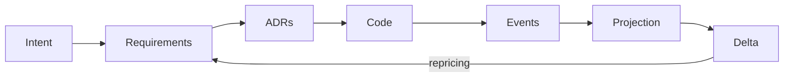
```mermaid
flowchart LR
    I[Intent] --> R[Requirements]
    R --> A[ADRs]
    A --> C[Code]
    C --> E[Events]
    E --> P[Projection]
    P --> D[Delta]
    D -->|repricing| R
```

Every link is load-bearing. A break at any link creates accidental law. See `specification/METHODOLOGY.md` for the full governance methodology.

### Constitutional Map

| Concern | Requirement families | Design owner |
|---|---|---|
| GTL package, graph, assets | GRAPH, BOOTDOC, parts of CORE | ADR-001, ADR-025, ADR-028 |
| Event calculus and convergence truth | EC, EVAL-004/005 | ADR-016 |
| Work identity and traversal | WK, TRAV, CMD-001/003/004, VIS | ADR-023, ADR-024, ADR-013 |
| Recursive composition and refinement | FRAG, COMP, REFINE | ADR-025 |
| Correction semantics | CORRECT | ADR-026 |
| Run governance and leaf tasks | RUN, LEAF | ADR-027 |
| Workflow provenance | PROV | ADR-029 |
| Bootstrap/install/runtime substrate | BOOT, PKG, WKSP, EVAL-001, CMD-002, CORE-006 | ADR-005, ADR-006, ADR-007, ADR-018 |
| Deterministic bind/manifest surfaces | BIND, CORE-004/005 | ADR-002, ADR-003 |
| Projection model | CORE-001/002/003 | ADR-005 |
| Snapshot-bound F_P and coverage evaluators | EVAL-002/003 | ADR-011, ADR-012 |

---

## 3. Domain Models

ABG has seven orthogonal but connected domain models.

### 3.1 GTL Topology Model

The constitutional graph language: typed assets connected by edges with evaluators, operators, and contexts. Fragments extend the base graph lawfully.

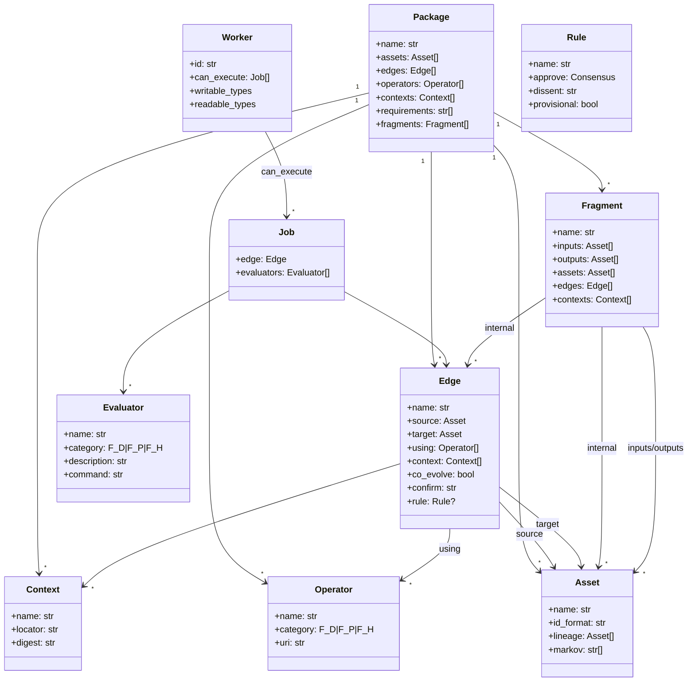
```mermaid
classDiagram
    class Package {
        +name: str
        +assets: Asset[]
        +edges: Edge[]
        +operators: Operator[]
        +contexts: Context[]
        +requirements: str[]
        +fragments: Fragment[]
    }
    class Asset {
        +name: str
        +id_format: str
        +lineage: Asset[]
        +markov: str[]
    }
    class Edge {
        +name: str
        +source: Asset
        +target: Asset
        +using: Operator[]
        +context: Context[]
        +co_evolve: bool
        +confirm: str
        +rule: Rule?
    }
    class Evaluator {
        +name: str
        +category: F_D|F_P|F_H
        +description: str
        +command: str
    }
    class Operator {
        +name: str
        +category: F_D|F_P|F_H
        +uri: str
    }
    class Context {
        +name: str
        +locator: str
        +digest: str
    }
    class Job {
        +edge: Edge
        +evaluators: Evaluator[]
    }
    class Worker {
        +id: str
        +can_execute: Job[]
        +writable_types
        +readable_types
    }
    class Fragment {
        +name: str
        +inputs: Asset[]
        +outputs: Asset[]
        +assets: Asset[]
        +edges: Edge[]
        +contexts: Context[]
    }
    class Rule {
        +name: str
        +approve: Consensus
        +dissent: str
        +provisional: bool
    }

    Package "1" --> "*" Asset
    Package "1" --> "*" Edge
    Package "1" --> "*" Operator
    Package "1" --> "*" Context
    Package "1" --> "*" Fragment
    Edge --> Asset : source
    Edge --> Asset : target
    Edge --> "*" Context
    Edge --> "*" Operator : using
    Job --> Edge
    Job --> "*" Evaluator
    Worker --> "*" Job : can_execute
    Fragment --> "*" Asset : internal
    Fragment --> "*" Edge : internal
    Fragment --> "*" Asset : inputs/outputs
```

**Key design choices:**
- `Package` is the bounded constitutional world — all topology within one Package
- `Job` is the typed transform unit: one edge + its evaluators
- `Fragment` is the reusable subgraph unit with typed input/output ports
- `Graph functions` are named, reusable, graph-valued functions that return Fragments
- The base authored graph is static; Fragments and zoom extend it lawfully without mutation
- `Evaluator.command` is validated at spec load — no re-entry into orchestration commands (REQ-F-EVAL-001)

### 3.2 Work Identity and Dispatch Model

The V2 routing layer above the GTL topology. WorkInstance is the real unit of traversal.

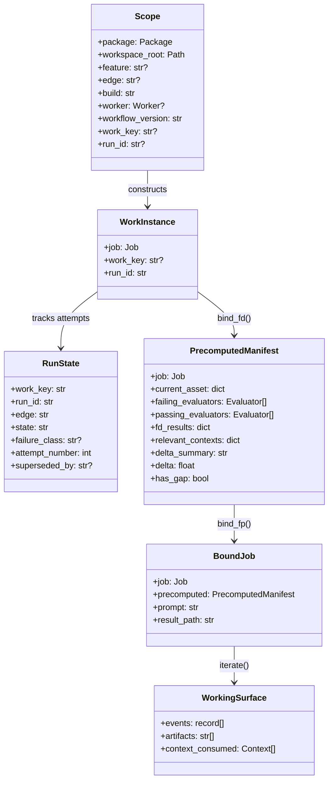
```mermaid
classDiagram
    class Scope {
        +package: Package
        +workspace_root: Path
        +feature: str?
        +edge: str?
        +build: str
        +worker: Worker?
        +workflow_version: str
        +work_key: str?
        +run_id: str?
    }
    class WorkInstance {
        +job: Job
        +work_key: str?
        +run_id: str
    }
    class RunState {
        +work_key: str
        +run_id: str
        +edge: str
        +state: str
        +failure_class: str?
        +attempt_number: int
        +superseded_by: str?
    }
    class PrecomputedManifest {
        +job: Job
        +current_asset: dict
        +failing_evaluators: Evaluator[]
        +passing_evaluators: Evaluator[]
        +fd_results: dict
        +relevant_contexts: dict
        +delta_summary: str
        +delta: float
        +has_gap: bool
    }
    class BoundJob {
        +job: Job
        +precomputed: PrecomputedManifest
        +prompt: str
        +result_path: str
    }
    class WorkingSurface {
        +events: record[]
        +artifacts: str[]
        +context_consumed: Context[]
    }

    Scope --> WorkInstance : constructs
    WorkInstance --> RunState : tracks attempts
    WorkInstance --> PrecomputedManifest : bind_fd()
    PrecomputedManifest --> BoundJob : bind_fp()
    BoundJob --> WorkingSurface : iterate()
```

**Key design choices:**
- `work_key` is immutable work identity — threads through the entire dispatch lifecycle
- `run_id` is attempt identity — each retry creates a new run_id on the same work_key
- `WorkInstance(job, work_key, run_id)` is the real unit of traversal — constructed upfront, not after convergence check
- `bind_fd()` computes all deterministic state before agent/human involvement; does NOT compute convergence delta — that is `schedule.delta()`
- `bind_fp()` assembles the F_P manifest — template assembly only, no LLM invocation
- **Degenerate case:** when work_keys are absent, each job is a single WorkInstance with `work_key=None`

### 3.3 Event Calculus and Convergence Model

The truth substrate. Five prime operators, two fluents, three convergence models, three event tiers.

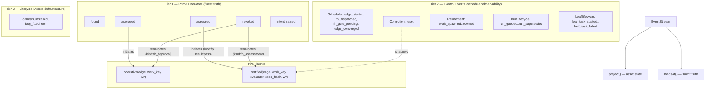
```mermaid
flowchart TD
    subgraph Tier1["Tier 1 — Prime Operators (fluent truth)"]
        F1[found]
        A1[approved]
        S1[assessed]
        R1[revoked]
        I1[intent_raised]
    end

    subgraph Tier2["Tier 2 — Control Events (scheduler/observability)"]
        direction LR
        C1["Scheduler: edge_started, fp_dispatched,\nfh_gate_pending, edge_converged"]
        C2["Correction: reset"]
        C3["Refinement: work_spawned, zoomed"]
        C4["Run lifecycle: run_queued..run_superseded"]
        C5["Leaf lifecycle: leaf_task_started..\nleaf_task_failed"]
    end

    subgraph Tier3["Tier 3 — Lifecycle Events (infrastructure)"]
        L1["genesis_installed, bug_fixed, etc."]
    end

    subgraph Fluents["Two Fluents"]
        OP["operative(edge, work_key, wv)"]
        CF["certified(edge, work_key, evaluator, spec_hash, wv)"]
    end

    A1 -->|initiates| OP
    S1 -->|"initiates (kind:fp, result:pass)"| CF
    R1 -->|"terminates (kind:fh_approval)"| OP
    R1 -->|"terminates (kind:fp_assessment)"| CF
    C2 -.->|shadows| CF

    ES[EventStream] --> PJ["project() — asset state"]
    ES --> HA["holdsAt() — fluent truth"]
```

**Three convergence models:**

| Evaluator | Model | Query |
|-----------|-------|-------|
| F_D | Live execution | `run_fd_evaluator(ev) → passes` — re-runs every iteration, stateless |
| F_H | Fluent projection | `holdsAt(operative(edge, work_key, wv), now)` |
| F_P | Fluent projection + reset boundary | `holdsAt(certified(edge, work_key, ev, spec_hash, wv), now)` — observes both `revoked` termination and `reset` boundary shadowing |

**Three-tier event taxonomy:**
- **Tier 1 (Primes):** Participate in EC fluent projection — five types only
- **Tier 2 (Control):** Scheduler bookkeeping, correction boundaries, observability — never initiate or terminate fluents. Illustrative registry, not exhaustive — new Tier 2 types may be added without changing the EC foundation
- **Tier 3 (Lifecycle):** Infrastructure events — genesis_installed, bug_fixed, etc.

**Key design choices:**
- The event stream is append-only — `emit()` is the only write path, `event_time` is system-assigned
- Only the five prime operators participate in fluent truth
- `reset` shadows F_P certification without terminating fluents — a temporal boundary, not a revocation
- Rejection (`assessed{fh_review, reject}`) is `happensAt` only — no fluent change
- Revocation (`revoked{fh_approval}`) terminates `operative` — different speech act, different EC consequence
- V1 compatibility survives only as explicit degenerate cases and legacy replay shims

### 3.4 Provenance Model

Version-binding layer over events and convergence.

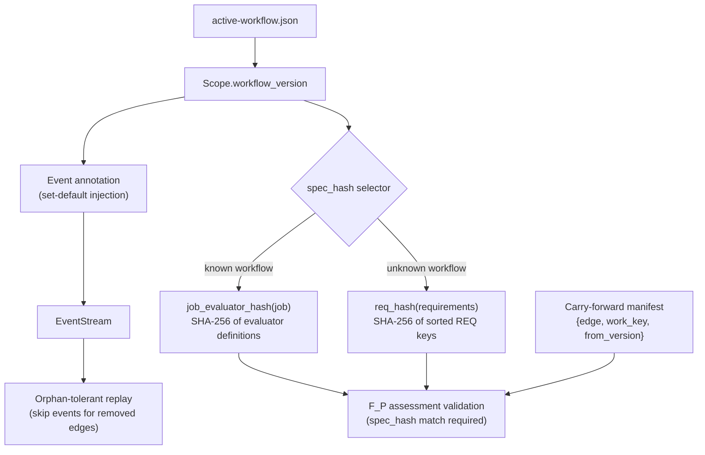
```mermaid
flowchart TD
    AW["active-workflow.json"] --> SC["Scope.workflow_version"]
    SC --> EA["Event annotation\n(set-default injection)"]
    SC --> SH{"spec_hash selector"}
    SH -->|"known workflow"| JH["job_evaluator_hash(job)\nSHA-256 of evaluator definitions"]
    SH -->|"unknown workflow"| RH["req_hash(requirements)\nSHA-256 of sorted REQ keys"]
    EA --> ES[EventStream]
    JH --> FP["F_P assessment validation\n(spec_hash match required)"]
    RH --> FP
    CF["Carry-forward manifest\n{edge, work_key, from_version}"] --> FP
    ES --> OT["Orphan-tolerant replay\n(skip events for removed edges)"]
```

**Key design choices:**
- `active-workflow.json` is the single source of workflow version truth — read at Scope construction, `"unknown"` on any failure
- `workflow_version` is auto-injected into events via set-default — never overwrites explicit values
- `job_evaluator_hash(job)` is the primary spec identity under provenance — changing any evaluator definition invalidates prior F_P assessments
- `req_hash(requirements)` is the degenerate fallback when `workflow_version == "unknown"`
- Carry-forward is explicit and manifest-driven — the workflow author decides what survives version transitions
- Orphan events (referencing removed edges) are silently ignored — graph evolution is non-destructive
- Revocations are scoped by workflow_version — a revocation from one version cannot cancel approvals from another

### 3.5 Recursive Composition and Refinement Model

V2 graph evolution: zoom replaces coarse edges with Fragments, spawn creates child work lineages.

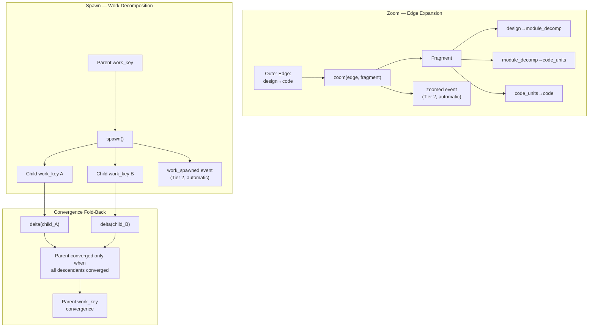
```mermaid
flowchart TD
    subgraph Zoom["Zoom — Edge Expansion"]
        E["Outer Edge:\ndesign→code"] --> Z["zoom(edge, fragment)"]
        Z --> F[Fragment]
        F --> IE1["design→module_decomp"]
        F --> IE2["module_decomp→code_units"]
        F --> IE3["code_units→code"]
        Z --> ZE["zoomed event\n(Tier 2, automatic)"]
    end

    subgraph Spawn["Spawn — Work Decomposition"]
        PW["Parent work_key"] --> SP["spawn()"]
        SP --> CW1["Child work_key A"]
        SP --> CW2["Child work_key B"]
        SP --> WS["work_spawned event\n(Tier 2, automatic)"]
    end

    subgraph Foldback["Convergence Fold-Back"]
        CW1 --> D1["delta(child_A)"]
        CW2 --> D2["delta(child_B)"]
        D1 --> AGG["Parent converged only when\nall descendants converged"]
        D2 --> AGG
        AGG --> PW2["Parent work_key\nconvergence"]
    end
```

**Zoom mechanics:**
- Fragment inputs must match edge source; outputs must match edge target
- While zoom is active, the outer edge's convergence is **replaced** by aggregation over fragment-internal edges — outer evaluators are suspended
- `delta(zoomed_edge)` = sum of `delta(internal_edge)` for all internal edges
- The graph topology at any point is reconstructable by replaying `zoomed` and `work_spawned` events

**Key design choices:**
- `zoom` expands one coarse edge into a Fragment while preserving the outer contract
- `work_spawned` captures child lineage in the event stream — children discovered from events, not hidden state
- Parent convergence is fold-back over descendants — recursive
- Refinement provenance is automatic (kernel responsibility) — missing provenance is a kernel violation
- **Degenerate case:** no Fragments = static authored graph, no zoom, no refinement

### 3.6 Run Governance and Leaf Task Model

Execution control for attempts and bounded sub-work.

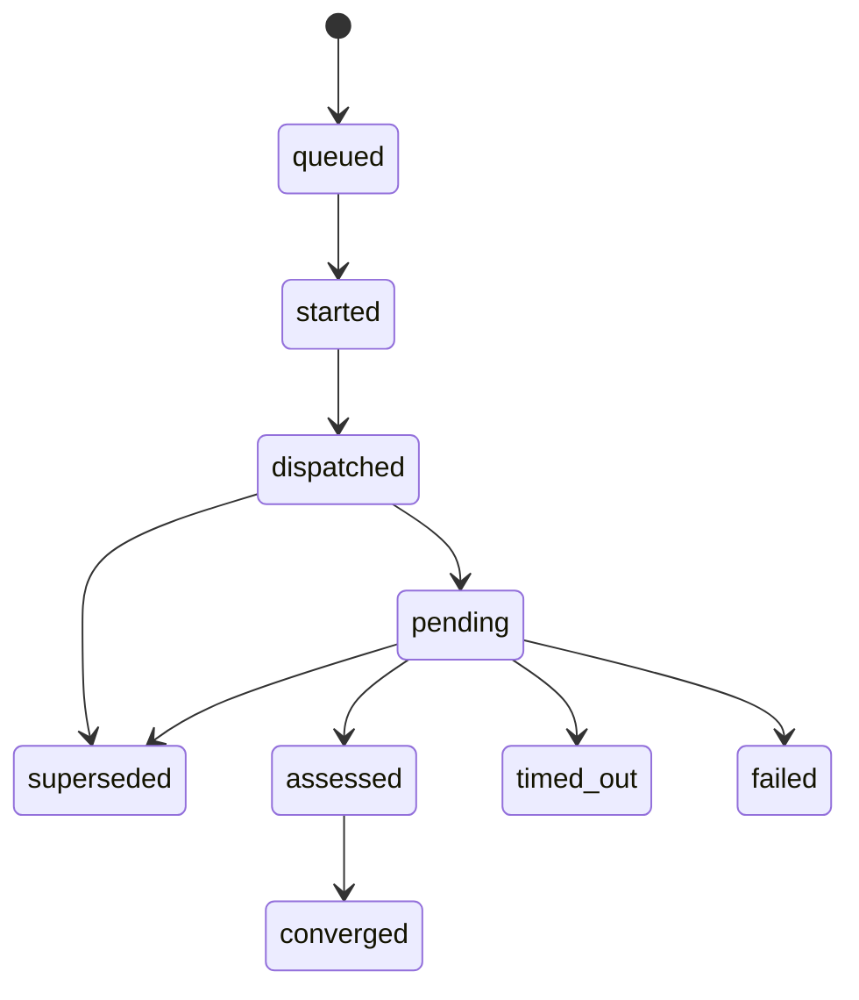
```mermaid
stateDiagram-v2
    [*] --> queued
    queued --> started
    started --> dispatched
    dispatched --> pending
    dispatched --> superseded
    pending --> assessed
    assessed --> converged
    pending --> timed_out
    pending --> failed
    pending --> superseded
```

**Failure taxonomy:**

| Classification | Meaning | Retry eligible |
|---|---|---|
| `transport_failure` | Actor unreachable, timeout, crash | Yes — automatic, bounded backoff |
| `no_output` | Actor returned empty/invalid response | Yes — with different parameters |
| `bad_output` | Structurally invalid assessment | No — requires diagnosis |
| `certification_failure` | Output exists but F_D still fails | No — construction quality problem (exit code 4) |

**Leaf task sub-dispatch:**

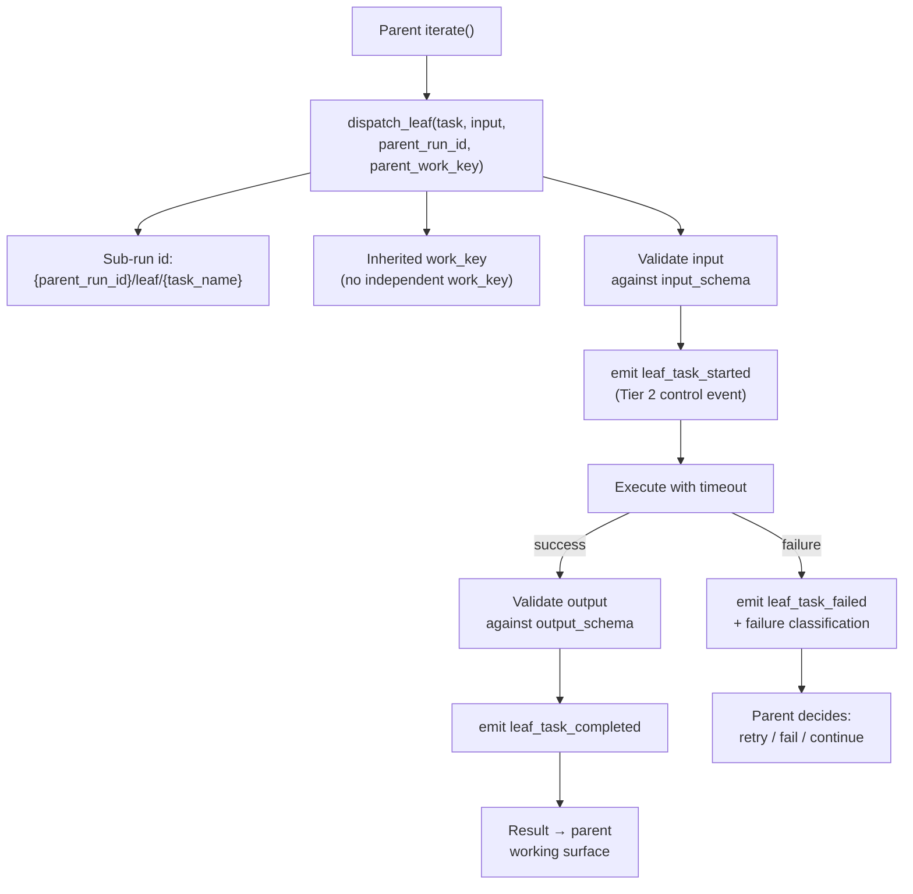
```mermaid
flowchart TD
    PR["Parent iterate()"] --> DL["dispatch_leaf(task, input,\nparent_run_id, parent_work_key)"]
    DL --> SR["Sub-run id:\n{parent_run_id}/leaf/{task_name}"]
    DL --> INH["Inherited work_key\n(no independent work_key)"]
    DL --> VAL["Validate input\nagainst input_schema"]
    VAL --> LS["emit leaf_task_started\n(Tier 2 control event)"]
    LS --> EX["Execute with timeout"]
    EX -->|"success"| VOUT["Validate output\nagainst output_schema"]
    VOUT --> LC["emit leaf_task_completed"]
    EX -->|"failure"| LF["emit leaf_task_failed\n+ failure classification"]
    LC --> PR2["Result → parent\nworking surface"]
    LF --> PR3["Parent decides:\nretry / fail / continue"]
```

**Key design choices:**
- One run = one attempt on one work_key; `run_id` is attempt identity, not ordering
- Run lifecycle is event-sourced — state derived entirely from events
- Supersession is explicit via `run_superseded` Tier 2 control event emitted at re-dispatch time — late results are recorded but not applied to convergence
- Leaf tasks are subordinate sub-work, not independent graph edges — they inherit work_key, carry sub-run identity, and integrate results into the parent's working surface
- Leaf tasks share the run failure taxonomy minus `certification_failure`
- **Degenerate case:** without run governance, F_P dispatch uses the existing two-state model (dispatched → assessed)

### 3.7 Correction Model

Two distinct corrective operations for different semantic needs.

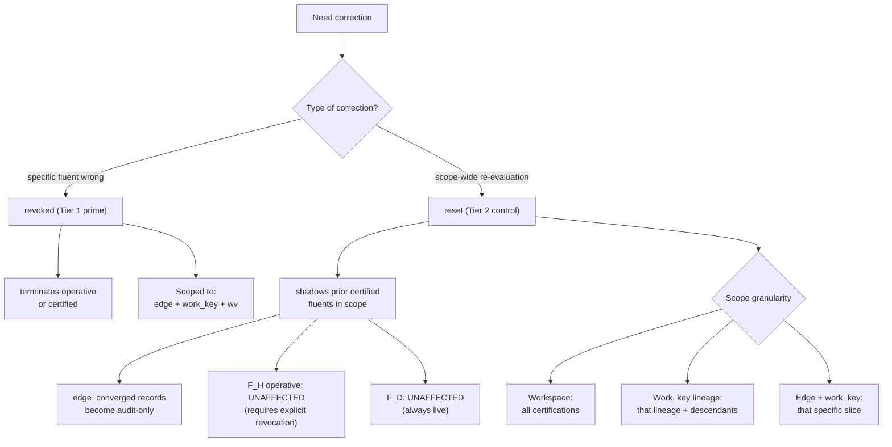
```mermaid
flowchart TD
    Q["Need correction"] --> T{"Type of correction?"}
    T -->|"specific fluent wrong"| RV["revoked (Tier 1 prime)"]
    T -->|"scope-wide re-evaluation"| RS["reset (Tier 2 control)"]

    RV --> OP["terminates operative\nor certified"]
    RV --> SC1["Scoped to:\nedge + work_key + wv"]

    RS --> SH["shadows prior certified\nfluents in scope"]
    RS --> SC2{"Scope granularity"}
    SC2 --> W["Workspace:\nall certifications"]
    SC2 --> WK["Work_key lineage:\nthat lineage + descendants"]
    SC2 --> EWK["Edge + work_key:\nthat specific slice"]

    SH --> EC["edge_converged records\nbecome audit-only"]
    SH --> FH["F_H operative: UNAFFECTED\n(requires explicit revocation)"]
    SH --> FD["F_D: UNAFFECTED\n(always live)"]
```

**Key design choices:**
- `revoked` is semantic compensation — targets a specific fluent instance within a work_key lineage
- `reset` is a certification boundary — temporal marker that forces re-certification after the boundary
- Both are append-only and replayable — no event history destroyed
- Reset does NOT terminate fluents, does NOT erase events, does NOT reopen F_H approval
- Scope containment: workspace resets contain everything; work_key resets contain that lineage and descendants; edge+work_key resets contain that slice only
- **Legacy replay shim:** wildcard `edge: "*"` from V1 → interpreted as workspace-scope reset. Not available for new work

### 3.8 Bootloader Artifact Model

ABG-local bootloader-as-asset convergence tracking.

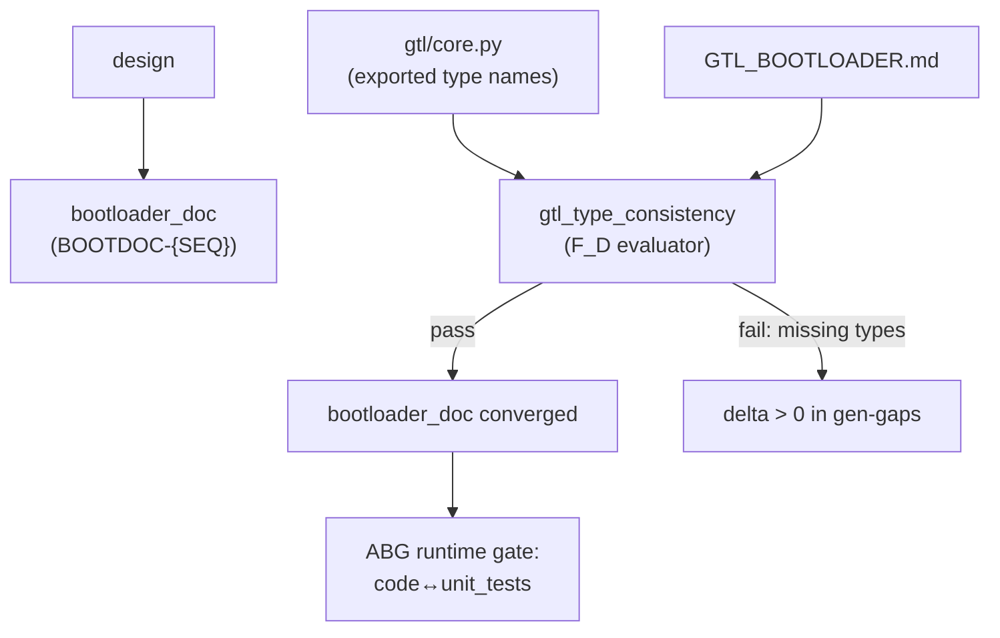
```mermaid
flowchart TD
    D["design"] --> B["bootloader_doc\n(BOOTDOC-{SEQ})"]
    GTL["gtl/core.py\n(exported type names)"] --> FD["gtl_type_consistency\n(F_D evaluator)"]
    BOOT["GTL_BOOTLOADER.md"] --> FD
    FD -->|"pass"| OK["bootloader_doc converged"]
    FD -->|"fail: missing types"| GAP["delta > 0 in gen-gaps"]
    OK --> GATE["ABG runtime gate:\ncode↔unit_tests"]
```

**Key design choices:**
- `bootloader_doc` is a graph asset with `lineage=[design]` — convergence-tracked, not hand-maintained
- `gtl_type_consistency` extracts type names from `gtl/core.py` and checks they appear in GTL_BOOTLOADER.md
- Bootloader consistency gates ABG's own `code↔unit_tests` edge
- Current reality is bootstrap/manual authoring; F_P synthesis is a future capability, not a current requirement
- **Downstream pattern:** domain packages (e.g. genesis_sdlc) replicate this structure for their own bootloader documents — that is a domain-package concern, not an ABG requirement

---

## 4. Main Engine Sequencing

### 4.1 gen_start — Entry Point and Auto-Loop

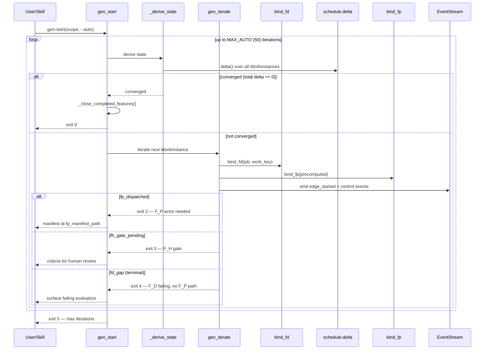
```mermaid
sequenceDiagram
    participant U as User/Skill
    participant GS as gen_start
    participant DS as _derive_state
    participant GI as gen_iterate
    participant BD as bind_fd
    participant SD as schedule.delta
    participant BF as bind_fp
    participant ES as EventStream

    U->>GS: gen-start(scope, --auto)
    loop up to MAX_AUTO (50) iterations
        GS->>DS: derive state
        DS->>SD: delta() over all WorkInstances
        alt converged (total delta == 0)
            DS-->>GS: converged
            GS->>GS: _close_completed_features()
            GS-->>U: exit 0
        else not converged
            GS->>GI: iterate next WorkInstance
            GI->>BD: bind_fd(job, work_key)
            GI->>BF: bind_fp(precomputed)
            GI->>ES: emit edge_started + control events
            alt fp_dispatched
                GI-->>GS: exit 2 — F_P actor needed
                GS-->>U: manifest at fp_manifest_path
            else fh_gate_pending
                GI-->>GS: exit 3 — F_H gate
                GS-->>U: criteria for human review
            else fd_gap (terminal)
                GI-->>GS: exit 4 — F_D failing, no F_P path
                GS-->>U: surface failing evaluators
            end
        end
    end
    GS-->>U: exit 5 — max iterations
```

### 4.2 F_P Dispatch and Result Ingestion

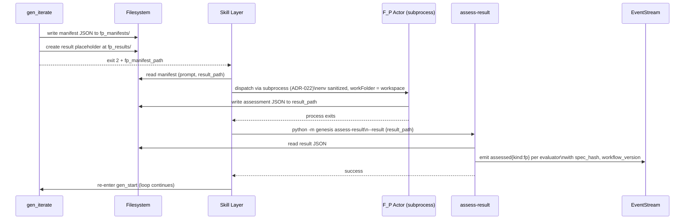
```mermaid
sequenceDiagram
    participant GI as gen_iterate
    participant FS as Filesystem
    participant SK as Skill Layer
    participant FP as F_P Actor (subprocess)
    participant AR as assess-result
    participant ES as EventStream

    GI->>FS: write manifest JSON to fp_manifests/
    GI->>FS: create result placeholder at fp_results/
    GI-->>SK: exit 2 + fp_manifest_path

    SK->>FS: read manifest (prompt, result_path)
    SK->>FP: dispatch via subprocess (ADR-022)\nenv sanitized, workFolder = workspace
    FP->>FS: write assessment JSON to result_path
    FP-->>SK: process exits

    SK->>AR: python -m genesis assess-result\n--result {result_path}
    AR->>FS: read result JSON
    AR->>ES: emit assessed{kind:fp} per evaluator\nwith spec_hash, workflow_version
    AR-->>SK: success

    SK->>GI: re-enter gen_start (loop continues)
```

### 4.3 Convergence and Escalation Flow

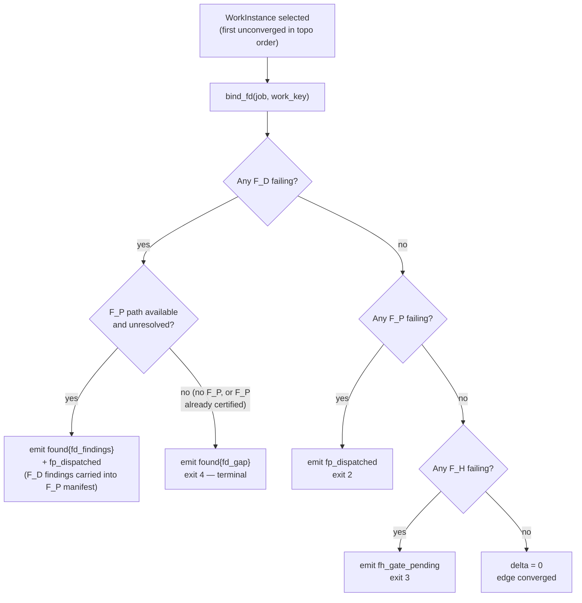
```mermaid
flowchart TD
    A["WorkInstance selected\n(first unconverged in topo order)"] --> B["bind_fd(job, work_key)"]
    B --> C{"Any F_D failing?"}
    C -->|yes| D{"F_P path available\nand unresolved?"}
    D -->|yes| E["emit found{fd_findings}\n+ fp_dispatched\n(F_D findings carried into F_P manifest)"]
    D -->|"no (no F_P, or F_P\nalready certified)"| F["emit found{fd_gap}\nexit 4 — terminal"]
    C -->|no| G{"Any F_P failing?"}
    G -->|yes| H["emit fp_dispatched\nexit 2"]
    G -->|no| I{"Any F_H failing?"}
    I -->|yes| J["emit fh_gate_pending\nexit 3"]
    I -->|no| K["delta = 0\nedge converged"]
```

**Why this ordering:**
- F_D is cheapest and most authoritative — deterministic, no LLM, no human
- F_P is construction under bounded ambiguity — agent produces candidate
- F_H is reserved for residual human judgment — most expensive, most authoritative
- Dispatching F_P against broken F_D wastes budget; requesting F_H review of unresolved F_P wastes attention

### 4.4 F_H Gate Evaluation Flow

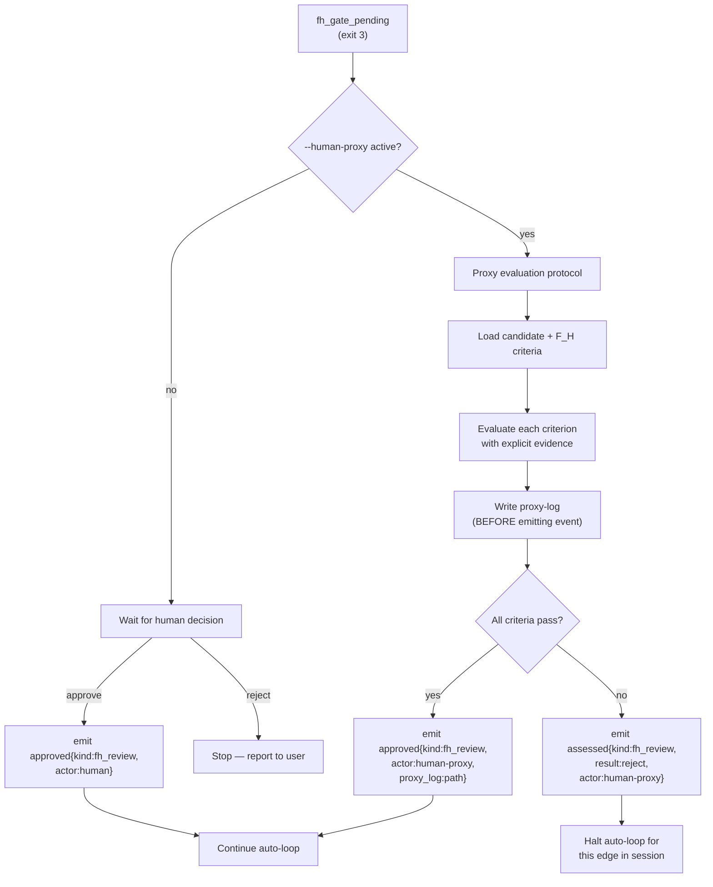
```mermaid
flowchart TD
    FH["fh_gate_pending\n(exit 3)"] --> HP{"--human-proxy active?"}
    HP -->|no| HW["Wait for human decision"]
    HW -->|approve| EA["emit approved{kind:fh_review,\nactor:human}"]
    HW -->|reject| STOP["Stop — report to user"]

    HP -->|yes| PE["Proxy evaluation protocol"]
    PE --> LC["Load candidate + F_H criteria"]
    LC --> EV["Evaluate each criterion\nwith explicit evidence"]
    EV --> PL["Write proxy-log\n(BEFORE emitting event)"]
    PL --> PD{"All criteria pass?"}
    PD -->|yes| PA["emit approved{kind:fh_review,\nactor:human-proxy,\nproxy_log:path}"]
    PD -->|no| PR["emit assessed{kind:fh_review,\nresult:reject,\nactor:human-proxy}"]
    PR --> HALT["Halt auto-loop for\nthis edge in session"]

    EA --> CONT["Continue auto-loop"]
    PA --> CONT
```

### 4.5 WorkInstance Scheduling Flow

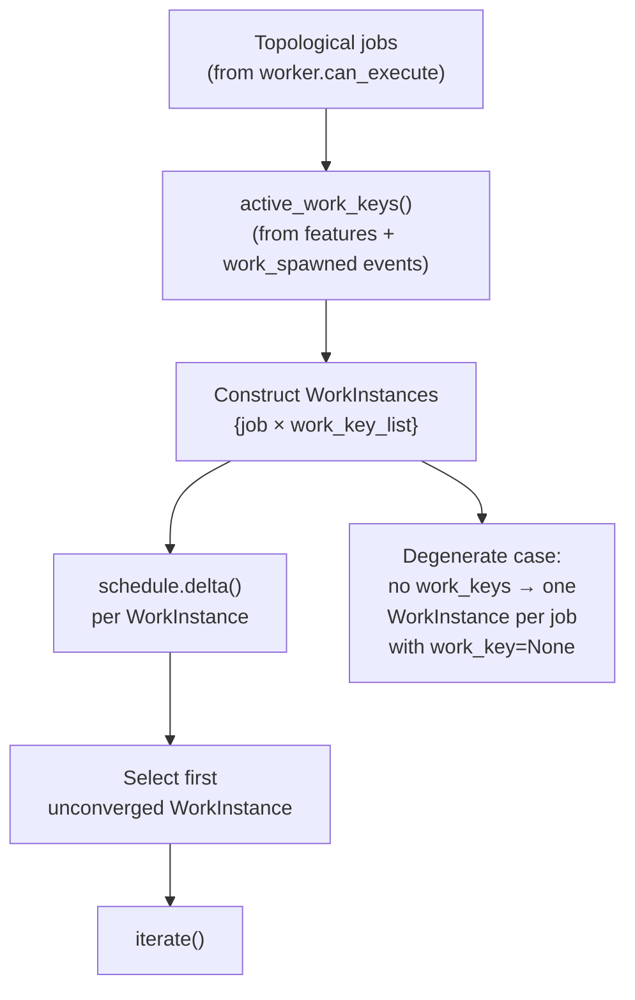
```mermaid
flowchart TD
    J["Topological jobs\n(from worker.can_execute)"] --> WK["active_work_keys()\n(from features + work_spawned events)"]
    WK --> WI["Construct WorkInstances\n{job × work_key_list}"]
    WI --> DL["schedule.delta()\nper WorkInstance"]
    DL --> SEL["Select first\nunconverged WorkInstance"]
    SEL --> IT["iterate()"]

    WI --> DG["Degenerate case:\nno work_keys → one\nWorkInstance per job\nwith work_key=None"]
```

**Scheduling rules:**
- Job order is topological (upstream before downstream)
- Within an edge, work keys are routed separately
- Child work may affect parent convergence via fold-back
- Worker batching (CORE-006: partitioning workers for concurrent safety) is separate from work-instance scheduling (TRAV-001: ordering which work to do next)

### 4.6 Feature Completion Flow

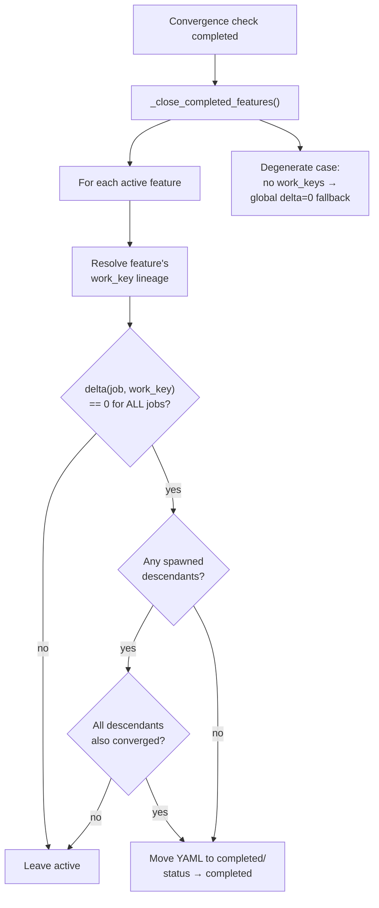
```mermaid
flowchart TD
    GC["Convergence check completed"] --> FC["_close_completed_features()"]
    FC --> FK["For each active feature"]
    FK --> RWK["Resolve feature's\nwork_key lineage"]
    RWK --> D0{"delta(job, work_key)\n== 0 for ALL jobs?"}
    D0 -->|no| NA["Leave active"]
    D0 -->|yes| CH{"Any spawned\ndescendants?"}
    CH -->|yes| FB{"All descendants\nalso converged?"}
    FB -->|no| NA
    FB -->|yes| MV["Move YAML to completed/\nstatus → completed"]
    CH -->|no| MV

    FC --> DG["Degenerate case:\nno work_keys →\nglobal delta=0 fallback"]
```

---

## 5. Important Subflows

### 5.1 Event Emission Governance

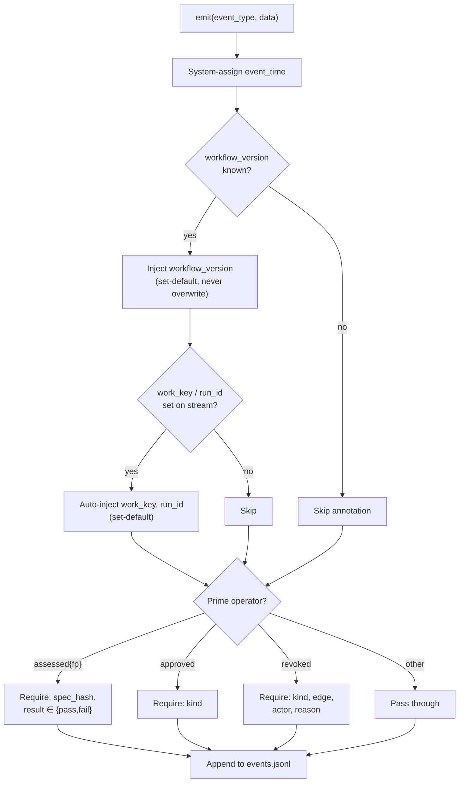
```mermaid
flowchart TD
    E["emit(event_type, data)"] --> TS["System-assign event_time"]
    TS --> WV{"workflow_version\nknown?"}
    WV -->|yes| AN["Inject workflow_version\n(set-default, never overwrite)"]
    WV -->|no| SK["Skip annotation"]
    AN --> WKI{"work_key / run_id\nset on stream?"}
    WKI -->|yes| INJ["Auto-inject work_key, run_id\n(set-default)"]
    WKI -->|no| SK2["Skip"]
    INJ --> VAL{"Prime operator?"}
    SK --> VAL
    SK2 --> VAL

    VAL -->|"assessed{fp}"| V1["Require: spec_hash,\nresult ∈ {pass,fail}"]
    VAL -->|"approved"| V2["Require: kind"]
    VAL -->|"revoked"| V3["Require: kind, edge,\nactor, reason"]
    VAL -->|"other"| OK["Pass through"]
    V1 --> AP["Append to events.jsonl"]
    V2 --> AP
    V3 --> AP
    OK --> AP
```

### 5.2 Context Resolution Flow

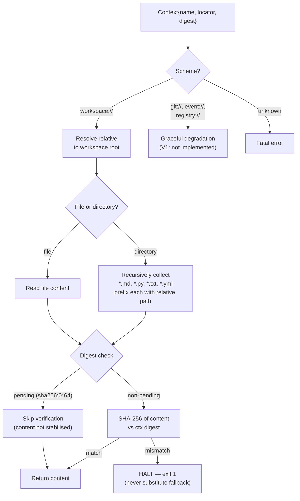
```mermaid
flowchart TD
    CTX["Context{name, locator, digest}"] --> SC{"Scheme?"}
    SC -->|"workspace://"| WS["Resolve relative\nto workspace root"]
    SC -->|"git://, event://,\nregistry://"| GD["Graceful degradation\n(V1: not implemented)"]
    SC -->|"unknown"| FE["Fatal error"]

    WS --> FT{"File or directory?"}
    FT -->|file| RF["Read file content"]
    FT -->|directory| RD["Recursively collect\n*.md, *.py, *.txt, *.yml\nprefix each with relative path"]

    RF --> DV{"Digest check"}
    RD --> DV
    DV -->|"pending (sha256:0*64)"| SKIP["Skip verification\n(content not stabilised)"]
    DV -->|"non-pending"| CMP["SHA-256 of content\nvs ctx.digest"]
    CMP -->|match| OK["Return content"]
    CMP -->|mismatch| HALT["HALT — exit 1\n(never substitute fallback)"]
    SKIP --> OK
```

### 5.3 Run Supersession

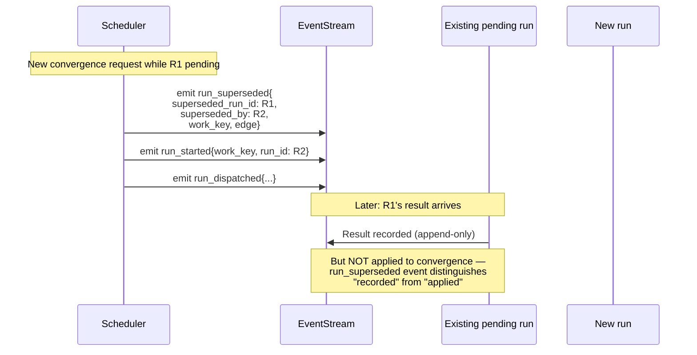
```mermaid
sequenceDiagram
    participant S as Scheduler
    participant ES as EventStream
    participant R1 as Existing pending run
    participant R2 as New run

    Note over S: New convergence request while R1 pending
    S->>ES: emit run_superseded{<br/>superseded_run_id: R1,<br/>superseded_by: R2,<br/>work_key, edge}
    S->>ES: emit run_started{work_key, run_id: R2}
    S->>ES: emit run_dispatched{...}

    Note over R1,ES: Later: R1's result arrives
    R1->>ES: Result recorded (append-only)
    Note over R1,ES: But NOT applied to convergence —<br/>run_superseded event distinguishes<br/>"recorded" from "applied"
```

### 5.4 Worker Batching

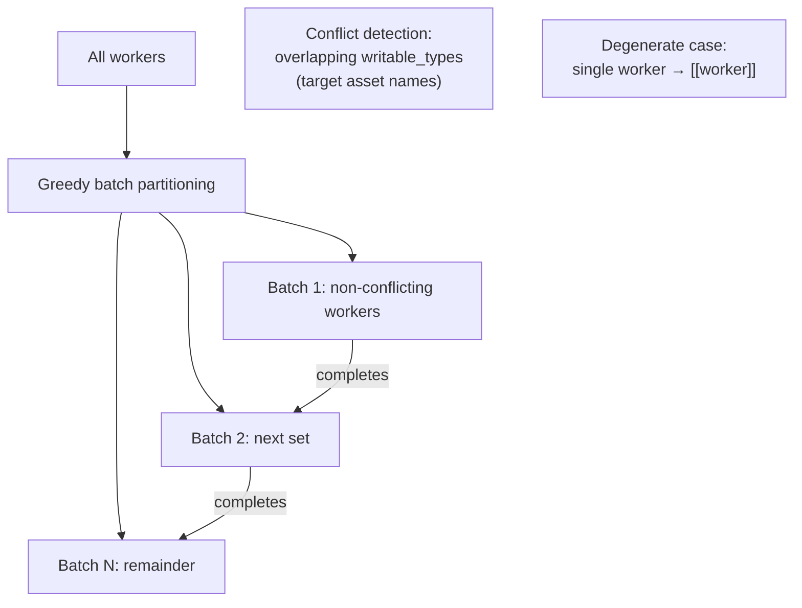
```mermaid
flowchart TD
    W["All workers"] --> GB["Greedy batch partitioning"]
    GB --> B1["Batch 1: non-conflicting workers"]
    GB --> B2["Batch 2: next set"]
    GB --> BN["Batch N: remainder"]

    B1 -->|"completes"| B2
    B2 -->|"completes"| BN

    CF["Conflict detection:\noverlapping writable_types\n(target asset names)"]

    DG["Degenerate case:\nsingle worker → [[worker]]"]
```

**Algorithm:** Greedy partitioning — while workers remain, start a new batch with the first unassigned worker, add each remaining worker if no writable_types overlap with any batch member, otherwise defer to the next batch. Batch i completes before batch i+1 starts.

### 5.5 Installer and Cascade Flow

```mermaid
flowchart TD
    GI["gen-install --target dir\n--project-slug slug"] --> CP["Copy engine modules\nto .genesis/genesis/"]
    CP --> YML["Write .genesis/genesis.yml\n(package + worker locators)"]
    YML --> SS{"Starter spec exists?"}
    SS -->|no| GEN["Generate starter Package\nunder .genesis/gtl_spec/"]
    SS -->|yes| SKIP["Preserve existing spec\n(never overwrite)"]
    GEN --> WB["workspace_bootstrap()\ncreates event stream path"]
    SKIP --> WB
    WB --> EI["emit genesis_installed"]
    EI --> AWM["Migrate active-workflow.json\nfrom .genesis/ → .ai-workspace/runtime/"]

    CASCADE["Cascade chain:\nABG → domain package → dependents\n(never ABG direct to dependents)"]
```

---

## 6. Algorithmic Choices

### 6.1 Delta — The Single Convergence Law

```
delta(job, stream, workspace_root, spec_hash, wv, carry_forward, *, work_key) → float

  if no evaluators: return 0.0

  # V2: fold-back — if work_key has spawned descendants, delegate
  if work_key and has_children(stream, work_key):
    return aggregate(delta(job, ..., work_key=child) for child in children)

  source_name = job.edge.source.name
  current = project(stream, source_name, "current", work_key=work_key)

  # Find latest applicable reset boundary for this scope
  latest_reset = find_latest_reset(stream, job.edge.name, work_key)

  failing = 0
  for ev in job.evaluators:
    if ev.category is F_D:
      passes = run_fd_evaluator(ev, current, workspace_root)
      if not passes: failing += 1

    elif ev.category is F_H:
      if not holdsAt(operative(job.edge, work_key, wv), now): failing += 1

    elif ev.category is F_P:
      if not holdsAt(certified(job.edge, work_key, ev, spec_hash, wv), now,
                     after=latest_reset): failing += 1

  return failing / len(job.evaluators)
```

**Range:** `[0.0, 1.0]` — 0.0 = converged, 1.0 = all failing.

`schedule.delta()` is the **single convergence function** — all command paths use it. `bind_fd()` provides evaluator-level detail for gap reporting but does not independently compute delta.

### 6.2 holdsAt — Fluent Projection

**operative (F_H):**
```
holdsAt(operative(edge, work_key, wv), now):
  Find latest approved{kind: fh_review|fh_intent} for (edge, work_key, wv)  → T_a
  Find any revoked{kind: fh_approval} at T_r > T_a for same scope           → terminates
  If T_a exists and no terminating revocation postdates it: HOLDS

  workflow_version matching:
    wv == "unknown"  → match by (edge, work_key) alone
    wv != "unknown"  → exact version match OR carry-forward match
```

**certified (F_P):**
```
holdsAt(certified(edge, work_key, ev, spec_hash, wv), now):
  Find latest assessed{kind: fp, result: pass, evaluator: ev} for scope     → T_a
  Require: event.spec_hash == spec_hash (or spec_hash is null)
  Require: T_a > latest applicable reset boundary (shadowing check)
  Find any revoked{kind: fp_assessment} at T_r > T_a for same scope         → terminates
  If T_a exists, spec matches, not shadowed, not terminated: HOLDS
```

### 6.3 Spec Hash

```
if workflow_version == "unknown":
    spec_hash = req_hash(requirements)       # SHA-256 of sorted REQ keys, first 16 hex
else:
    spec_hash = job_evaluator_hash(job)      # SHA-256 of sorted evaluator definitions, first 16 hex
```

`job_evaluator_hash` normalises whitespace in evaluator descriptions before hashing. Changing any evaluator field changes the hash, invalidating all prior F_P assessments for that job.

### 6.4 Reset Boundary

```
latest_applicable_reset(stream, edge, work_key):
  For each reset event in stream (reverse chronological):
    if reset.scope == "workspace": return reset                    # contains everything
    if reset.scope == "work_key" and work_key is descendant: return reset
    if reset.scope == "edge" and matches (edge, work_key): return reset
  return None

certified holds only if initiating assessed{pass} event_time > latest_applicable_reset
```

**What reset does NOT do:**
- Does not terminate fluents (no EC state change)
- Does not erase events (append-only preserved)
- Does not reopen F_H approval (human judgment is durable)
- Does not affect F_D (always live execution)

### 6.5 Fold-Back

```
parent converged only when all descendant work_keys are converged

Children discovered from work_spawned events in the stream — not from hidden scheduler state.
Recursive: if a child has spawned its own children, those must also converge.
```

### 6.6 Pending and Retry

```
At most one dispatched/pending run per (work_key, edge)
Transport failures → automatic retry with bounded backoff, max 3 attempts
Each retry creates new run_id on same work_key — attempt history preserved
After max retries → failed with summary of all attempt outcomes
Late superseded results → recorded but not applied to convergence
```

---

## 7. Territory Model

```mermaid
flowchart TD
    subgraph Installed["Installed Territories (read-only at runtime)"]
        GEN[".genesis/\nABG engine + config"]
        DOM["domain/release/\nDomain package"]
    end

    subgraph Authored["Authored Territories (editable)"]
        SPEC["specification/\nIntent, requirements, standards"]
        BUILDS["builds/\nImplementation, tests, design"]
    end

    subgraph Runtime["Runtime Territory"]
        AWS[".ai-workspace/\nEvents, features, reviews"]
    end

    ABG["ABG Installer"] --> GEN
    GSDLC["Domain Installer"] --> DOM
    HUMAN["Human / Agent"] --> SPEC
    HUMAN --> BUILDS
    ENGINE["Engine"] --> AWS
```

| Territory | Who writes | Rule |
|-----------|-----------|------|
| `.genesis/` | ABG installer only | Never edit directly — updated only by installer |
| `domain/release/` | Domain package installer only | Never edit directly |
| `specification/` | Human | Editable — intent, requirements, standards |
| `builds/` | Human + agents | Editable — implementation, tests, design |
| `.ai-workspace/` | Engine + agents via `emit()` | Events append-only; features/reviews territory-partitioned |

---

## 8. Review Focus

For human design review, the highest-value questions are:

1. **Is `WorkInstance` now truly the unit of traversal everywhere that matters?** — It should be constructed upfront, not reconstructed ad hoc from jobs × work_keys
2. **Does the event model cleanly separate prime truth from control/lifecycle bookkeeping?** — Only five primes participate in fluent projection; everything else is Tier 2/3
3. **Is `reset` semantically distinct from compensation in both spec and runtime?** — Compensation terminates fluents; reset creates boundaries. F_H survives reset.
4. **Is recursive refinement lawful and replayable?** — Topology reconstructable from zoomed + work_spawned events alone
5. **Does run governance stay subordinate to convergence truth?** — Run lifecycle is observational, never initiates or terminates fluents
6. **Is bootloader handling honestly scoped as ABG-local and bootstrap-realistic?** — Manual now, derivable later. Domain packages replicate independently.
7. **Is the provenance chain tight?** — Every event carries workflow_version when known; spec_hash invalidates stale assessments; carry-forward is explicit
