# ABG Design Document

**Version**: 2.0
**Date**: 2026-03-27
**Purpose**: Human review document for the abiogenesis V2 constitutional design
**Scope**: Requirements, accepted design implementations, domain models, engine sequencing, algorithmic choices

---

## 1. Design Thesis

ABG is an event-sourced convergence engine over a typed GTL graph. It drives candidates toward stability through three evaluator regimes (deterministic, agent, human), records all state transitions in an append-only event stream, and derives truth by projection -- never by mutable state.

V2 replaces the V1 type system entirely:

| V1 | V2 | Change |
|----|-----|--------|
| Package | Module | Publication boundary with explicit jobs, roles, metadata |
| Asset | Node | Typed local locus with markov conditions |
| Edge | GraphVector | Internal adjacency record carrying operators, evaluators, contexts |
| Fragment, zoom | GraphFunction, substitute() | Algebraic composition via graph algebra |
| Worker(can_execute) | Worker derived from Module | Worker resolved from Module.jobs + Module.roles |
| Job(edge=) | Job(contracts=(ContractRef,)) | Jobs reference vectors by opaque .id |
| Overlay | CandidateFamily + SelectionDecision | Explicit structural alternatives with explicit selection |
| consensus() | Rule(kind="consensus", config={"quorum": N}) | Declarative constraint type |

The kernel stays small. Complexity is pushed into lawful structure (GTL algebra) rather than ad hoc imperative exceptions.

---

## 2. Constitutional Chain

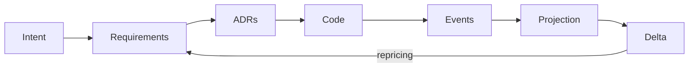
```mermaid
flowchart LR
    I[Intent] --> R[Requirements]
    R --> A[ADRs]
    A --> C[Code]
    C --> E[Events]
    E --> P[Projection]
    P --> D[Delta]
    D -->|repricing| R
```

Every link is load-bearing. A break at any link creates accidental law.

### Constitutional Map

| Concern | Requirement families | Design owner |
|---|---|---|
| GTL graph, nodes, module | GRAPH, BOOTDOC, CORE | ADR-001, ADR-025, ADR-028 |
| Event calculus and convergence | EC, EVAL | ADR-016 |
| Work identity and traversal | WK, TRAV, CMD, VIS | ADR-023, ADR-024, ADR-013 |
| Graph algebra and selection | COMPOSE, SELECTION-BOUNDARY, SYNTHESIS | ADR-025, ADR-030 |
| Correction semantics | CORRECT | ADR-026 |
| Run governance and leaf tasks | RUN, LEAF | ADR-027 |
| Workflow provenance | PROV | ADR-029 |
| Bootstrap/install substrate | BOOT, PKG, WKSP | ADR-005, ADR-006, ADR-007, ADR-018 |
| Binding and manifest surfaces | BIND, CORE-004/005 | ADR-002, ADR-003 |
| Projection model | CORE-001/002/003 | ADR-005 |
| Snapshot-bound F_P | EVAL-002/003 | ADR-011, ADR-012 |

---

## 3. Domain Models

ABG has seven orthogonal but connected domain models.

### 3.1 GTL Topology Model

The constitutional graph language. All types are frozen, immutable dataclasses with auto-minted opaque `.id` (UUID4, `compare=False`).

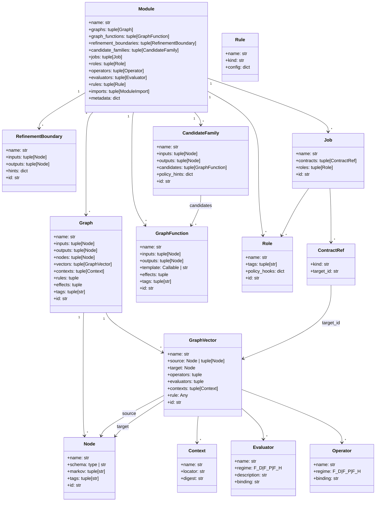
```mermaid
classDiagram
    class Module {
        +name: str
        +graphs: tuple[Graph]
        +graph_functions: tuple[GraphFunction]
        +refinement_boundaries: tuple[RefinementBoundary]
        +candidate_families: tuple[CandidateFamily]
        +jobs: tuple[Job]
        +roles: tuple[Role]
        +operators: tuple[Operator]
        +evaluators: tuple[Evaluator]
        +rules: tuple[Rule]
        +imports: tuple[ModuleImport]
        +metadata: dict
    }
    class Graph {
        +name: str
        +inputs: tuple[Node]
        +outputs: tuple[Node]
        +nodes: tuple[Node]
        +vectors: tuple[GraphVector]
        +contexts: tuple[Context]
        +rules: tuple
        +effects: tuple
        +tags: tuple[str]
        +id: str
    }
    class Node {
        +name: str
        +schema: type | str
        +markov: tuple[str]
        +tags: tuple[str]
        +id: str
    }
    class GraphVector {
        +name: str
        +source: Node | tuple[Node]
        +target: Node
        +operators: tuple
        +evaluators: tuple
        +contexts: tuple[Context]
        +rule: Any
        +id: str
    }
    class GraphFunction {
        +name: str
        +inputs: tuple[Node]
        +outputs: tuple[Node]
        +template: Callable | str
        +effects: tuple
        +tags: tuple[str]
        +id: str
    }
    class RefinementBoundary {
        +name: str
        +inputs: tuple[Node]
        +outputs: tuple[Node]
        +hints: dict
        +id: str
    }
    class CandidateFamily {
        +name: str
        +inputs: tuple[Node]
        +outputs: tuple[Node]
        +candidates: tuple[GraphFunction]
        +policy_hints: dict
        +id: str
    }
    class Evaluator {
        +name: str
        +regime: F_D|F_P|F_H
        +description: str
        +binding: str
    }
    class Operator {
        +name: str
        +regime: F_D|F_P|F_H
        +binding: str
    }
    class Rule {
        +name: str
        +kind: str
        +config: dict
    }
    class Context {
        +name: str
        +locator: str
        +digest: str
    }
    class Job {
        +name: str
        +contracts: tuple[ContractRef]
        +roles: tuple[Role]
        +id: str
    }
    class Role {
        +name: str
        +tags: tuple[str]
        +policy_hooks: dict
        +id: str
    }
    class ContractRef {
        +kind: str
        +target_id: str
    }

    Module "1" --> "*" Graph
    Module "1" --> "*" GraphFunction
    Module "1" --> "*" CandidateFamily
    Module "1" --> "*" RefinementBoundary
    Module "1" --> "*" Job
    Module "1" --> "*" Role
    Graph "1" --> "*" Node
    Graph "1" --> "*" GraphVector
    GraphVector --> Node : source
    GraphVector --> Node : target
    GraphVector --> "*" Context
    GraphVector --> "*" Evaluator
    GraphVector --> "*" Operator
    Job --> "*" ContractRef
    Job --> "*" Role
    ContractRef --> GraphVector : target_id
    CandidateFamily --> "*" GraphFunction : candidates
```

**Key design choices:**
- `Module` is the bounded constitutional world -- all topology within one Module
- `Job` binds to GraphVectors via `ContractRef(kind="graph_vector", target_id=vector.id)` -- indirection by opaque `.id`, not by name
- `GraphFunction` is the reusable graph-valued abstraction -- materializable template returning a `Graph`
- `CandidateFamily` declares named families of lawful structural alternatives; selection requires explicit `SelectionDecision` (no auto-selection)
- `RefinementBoundary` declares lawful synthesis/refinement points without embedding strategy
- `validate_module_traversal_surface()`: every live GraphVector must publish a RefinementBoundary or CandidateFamily
- `validate_module_selection_surface()`: GraphFunctions matching live vector contracts must be published via CandidateFamily
- Every first-class type has `.id` (UUID4, auto-minted, `compare=False`) distinct from `.name`

### 3.2 Work Identity and Dispatch Model

The routing layer above the GTL topology. WorkInstance is the dispatch unit; Traversal is the execution contract.

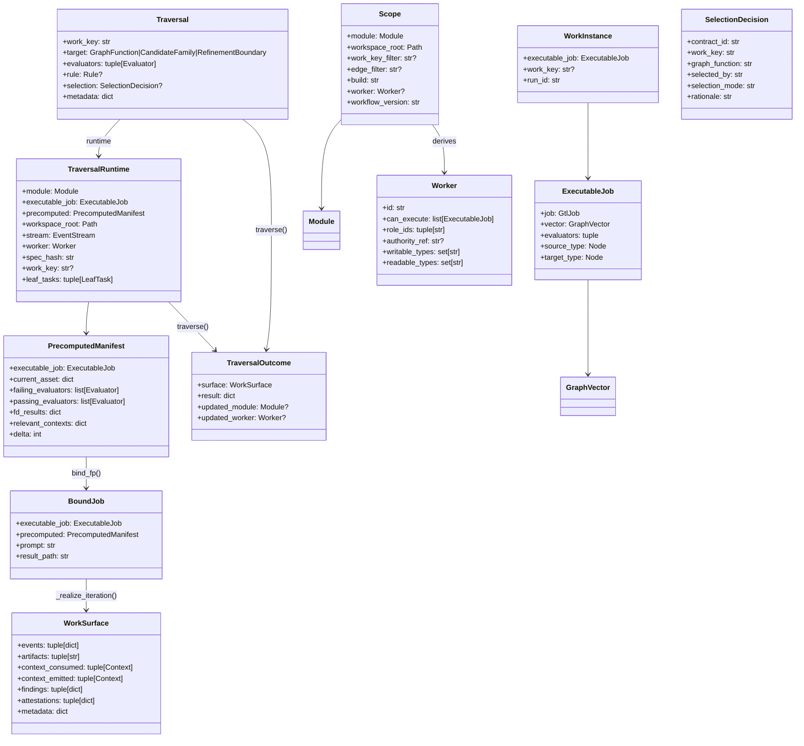
```mermaid
classDiagram
    class Scope {
        +module: Module
        +workspace_root: Path
        +work_key_filter: str?
        +edge_filter: str?
        +build: str
        +worker: Worker?
        +workflow_version: str
    }
    class WorkInstance {
        +executable_job: ExecutableJob
        +work_key: str?
        +run_id: str
    }
    class ExecutableJob {
        +job: GtlJob
        +vector: GraphVector
        +evaluators: tuple
        +source_type: Node
        +target_type: Node
    }
    class Worker {
        +id: str
        +can_execute: list[ExecutableJob]
        +role_ids: tuple[str]
        +authority_ref: str?
        +writable_types: set[str]
        +readable_types: set[str]
    }
    class Traversal {
        +work_key: str
        +target: GraphFunction|CandidateFamily|RefinementBoundary
        +evaluators: tuple[Evaluator]
        +rule: Rule?
        +selection: SelectionDecision?
        +metadata: dict
    }
    class TraversalRuntime {
        +module: Module
        +executable_job: ExecutableJob
        +precomputed: PrecomputedManifest
        +workspace_root: Path
        +stream: EventStream
        +worker: Worker
        +spec_hash: str
        +work_key: str?
        +leaf_tasks: tuple[LeafTask]
    }
    class PrecomputedManifest {
        +executable_job: ExecutableJob
        +current_asset: dict
        +failing_evaluators: list[Evaluator]
        +passing_evaluators: list[Evaluator]
        +fd_results: dict
        +relevant_contexts: dict
        +delta: int
    }
    class BoundJob {
        +executable_job: ExecutableJob
        +precomputed: PrecomputedManifest
        +prompt: str
        +result_path: str
    }
    class WorkSurface {
        +events: tuple[dict]
        +artifacts: tuple[str]
        +context_consumed: tuple[Context]
        +context_emitted: tuple[Context]
        +findings: tuple[dict]
        +attestations: tuple[dict]
        +metadata: dict
    }
    class TraversalOutcome {
        +surface: WorkSurface
        +result: dict
        +updated_module: Module?
        +updated_worker: Worker?
    }
    class SelectionDecision {
        +contract_id: str
        +work_key: str
        +graph_function: str
        +selected_by: str
        +selection_mode: str
        +rationale: str
    }

    Scope --> Module
    Scope --> Worker : derives
    WorkInstance --> ExecutableJob
    ExecutableJob --> GraphVector
    Traversal --> TraversalRuntime : runtime
    TraversalRuntime --> PrecomputedManifest
    PrecomputedManifest --> BoundJob : bind_fp()
    BoundJob --> WorkSurface : _realize_iteration()
    Traversal --> TraversalOutcome : traverse()
    TraversalRuntime --> TraversalOutcome : traverse()
```

**Key design choices:**
- `Scope` is first-class -- every command requires one. Ambiguous scope fails closed. Worker is derived from Module.jobs + Module.roles at Scope construction when `worker=None` (the default); an explicit Worker can be injected to override derivation.
- `module_to_executable_jobs(module)` resolves GTL Jobs to ExecutableJobs by resolving ContractRef.target_id to GraphVector.id -- no auto-derivation
- `Traversal` is a frozen contract: work_key + target + evaluators + optional selection. Metadata must not carry hidden strategy keys.
- `traverse()` dispatches based on target type: CandidateFamily -> selection outcome (substitute + spawn); RefinementBoundary or GraphFunction -> iteration outcome (bind_fd -> bind_fp -> realize)
- `work_key` is immutable work identity threading through the entire lifecycle; `run_id` is attempt identity
- `Worker.is_eligible(job)` is conjunctive: ExecutableJob in can_execute AND worker satisfies required roles

### 3.3 Event Calculus and Convergence Model

The truth substrate. Five prime operators, two fluents, three convergence models.

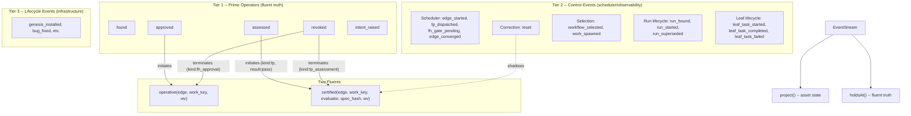
```mermaid
flowchart TD
    subgraph Tier1["Tier 1 -- Prime Operators (fluent truth)"]
        F1[found]
        A1[approved]
        S1[assessed]
        R1[revoked]
        I1[intent_raised]
    end

    subgraph Tier2["Tier 2 -- Control Events (scheduler/observability)"]
        direction LR
        C1["Scheduler: edge_started, fp_dispatched,\nfh_gate_pending, edge_converged"]
        C2["Correction: reset"]
        C3["Selection: workflow_selected, work_spawned"]
        C4["Run lifecycle: run_bound, run_started,\nrun_superseded"]
        C5["Leaf lifecycle: leaf_task_started,\nleaf_task_completed, leaf_task_failed"]
    end

    subgraph Tier3["Tier 3 -- Lifecycle Events (infrastructure)"]
        L1["genesis_installed, bug_fixed, etc."]
    end

    subgraph Fluents["Two Fluents"]
        OP["operative(edge, work_key, wv)"]
        CF["certified(edge, work_key, evaluator, spec_hash, wv)"]
    end

    A1 -->|initiates| OP
    S1 -->|"initiates (kind:fp, result:pass)"| CF
    R1 -->|"terminates (kind:fh_approval)"| OP
    R1 -->|"terminates (kind:fp_assessment)"| CF
    C2 -.->|shadows| CF

    ES[EventStream] --> PJ["project() -- asset state"]
    ES --> HA["holdsAt() -- fluent truth"]
```

**Three convergence models:**

| Evaluator | Model | Query |
|-----------|-------|-------|
| F_D | Live execution | `run_fd_evaluator(ev) -> passes` -- re-runs every iteration, stateless |
| F_H | Fluent projection | `holdsAt(operative(edge, work_key, wv), now)` -- via `bind_fh()` |
| F_P | Fluent projection + reset boundary | `holdsAt(certified(edge, work_key, ev, spec_hash, wv), now)` -- via `bind_fp_certified()` |

**V2 delta function:**

`delta()` in `genesis.convergence` aggregates typed `EvaluatorOutcome` values into a `ConvergenceResult`:

```python
@dataclass(frozen=True)
class EvaluatorOutcome:
    contract_id: str
    evaluator_name: str
    regime: type[Regime]          # F_D, F_P, or F_H
    status: Literal["pass", "fail", "open", "error"]
    round_index: int

@dataclass(frozen=True)
class ConvergenceResult:
    contract_id: str
    outcomes: tuple[EvaluatorOutcome, ...]
    aggregate_state: Literal["closed", "open", "error"]
    next_action: Literal["continue", "repeat_round", "escalate", "fail"]
    next_regime: type[Regime] | None
    round_index: int
```

**Key design choices:**
- The event stream is append-only -- `emit()` is the only write path, `event_time` is system-assigned
- Only the five prime operators participate in fluent truth
- `reset` shadows F_P certification without terminating fluents -- a temporal boundary, not a revocation
- Rejection (`assessed{fh_review, reject}`) is `happensAt` only -- no fluent change
- Revocation (`revoked{fh_approval}`) terminates `operative` -- different speech act, different EC consequence
- `delta()` uses declared `Rule.config` for quorum when present; defaults to all-pass when no explicit policy
- Escalation: F_D -> F_P -> F_H. `_REGIME_ESCALATION = {F_D: F_P, F_P: F_H}`

### 3.4 Provenance Model

Version-binding layer over events and convergence.

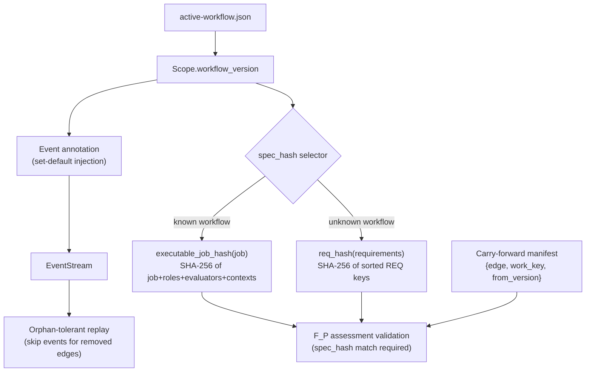
```mermaid
flowchart TD
    AW["active-workflow.json"] --> SC["Scope.workflow_version"]
    SC --> EA["Event annotation\n(set-default injection)"]
    SC --> SH{"spec_hash selector"}
    SH -->|"known workflow"| JH["executable_job_hash(job)\nSHA-256 of job+roles+evaluators+contexts"]
    SH -->|"unknown workflow"| RH["req_hash(requirements)\nSHA-256 of sorted REQ keys"]
    EA --> ES[EventStream]
    JH --> FP["F_P assessment validation\n(spec_hash match required)"]
    RH --> FP
    CF["Carry-forward manifest\n{edge, work_key, from_version}"] --> FP
    ES --> OT["Orphan-tolerant replay\n(skip events for removed edges)"]
```

**Key design choices:**
- `active-workflow.json` is the single source of workflow version truth -- read at Scope construction, `"unknown"` on any failure
- `workflow_version` is auto-injected into events via set-default -- never overwrites explicit values
- `executable_job_hash(job)` is the primary spec identity under provenance -- covers GTL job name, role names, evaluator definitions (binding+description+regime), and context digests. Changing any of these invalidates prior F_P assessments
- `req_hash(requirements)` is the degenerate fallback when `workflow_version == "unknown"`
- Carry-forward is explicit and manifest-driven -- the workflow author decides what survives version transitions
- Orphan events (referencing removed vectors) are silently ignored -- graph evolution is non-destructive

### 3.5 Graph Algebra and Selection Model

V2 graph evolution uses algebraic composition. `substitute()` replaces coarse vectors with interface-compatible inner graphs. `CandidateFamily` declares alternatives; `SelectionDecision` makes explicit choices.

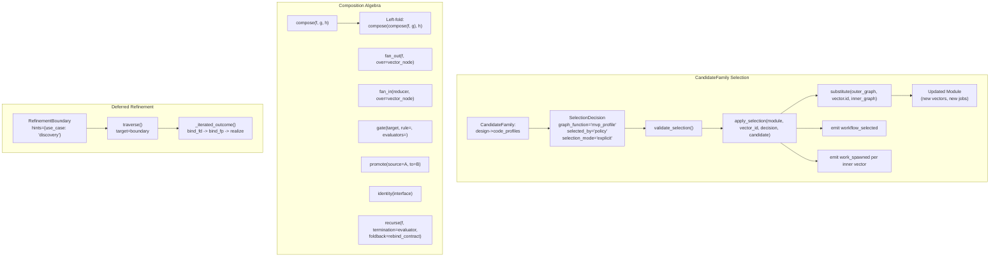
```mermaid
flowchart TD
    subgraph Selection["CandidateFamily Selection"]
        CF["CandidateFamily:\ndesign->code_profiles"] --> SD["SelectionDecision\ngraph_function='mvp_profile'\nselected_by='policy'\nselection_mode='explicit'"]
        SD --> VS["validate_selection()"]
        VS --> AS["apply_selection(module, vector_id, decision, candidate)"]
        AS --> SUB["substitute(outer_graph, vector.id, inner_graph)"]
        SUB --> UM["Updated Module\n(new vectors, new jobs)"]
        AS --> WS["emit workflow_selected"]
        AS --> SP["emit work_spawned per inner vector"]
    end

    subgraph Algebra["Composition Algebra"]
        CO["compose(f, g, h)"] --> LF["Left-fold:\ncompose(compose(f, g), h)"]
        FO["fan_out(f, over=vector_node)"]
        FI["fan_in(reducer, over=vector_node)"]
        GT["gate(target, rule=, evaluators=)"]
        PR["promote(source=A, to=B)"]
        ID["identity(interface)"]
        RC["recurse(f, termination=evaluator,\nfoldback=rebind_contract)"]
    end

    subgraph Refinement["Deferred Refinement"]
        RB["RefinementBoundary\nhints={use_case: 'discovery'}"] --> TR["traverse()\ntarget=boundary"]
        TR --> IT["_iterated_outcome()\nbind_fd -> bind_fp -> realize"]
    end
```

**Key design choices:**
- `substitute()` targets by vector `.id` (REQ-L-GTL2-IDENTITY-006) -- no name fallback
- `CandidateFamily.__post_init__` validates: non-empty candidates, all candidates share declared inputs/outputs contract
- `Traversal` over `CandidateFamily` requires explicit `SelectionDecision` -- the engine validates but does not decide
- `apply_selection()` owns event emission (`workflow_selected`, `work_spawned`) per GTL_2_MODULE_DESIGN SS4.4
- `selection.py` is a pure kernel module -- no side effects, no events, no I/O. Returns `SelectionDecision` values.
- After selection, the Module is rebuilt with updated graphs, surviving jobs, and newly created jobs for inner vectors
- `compose()` is variadic left-fold, associative: `compose(f, g, h) == compose(compose(f, g), h)`
- `fan_out`/`fan_in` require explicit `Vector[...]` schema on the `over` node -- no hidden inference

### 3.6 Run Governance and Leaf Task Model

Execution control for attempts and bounded sub-work.

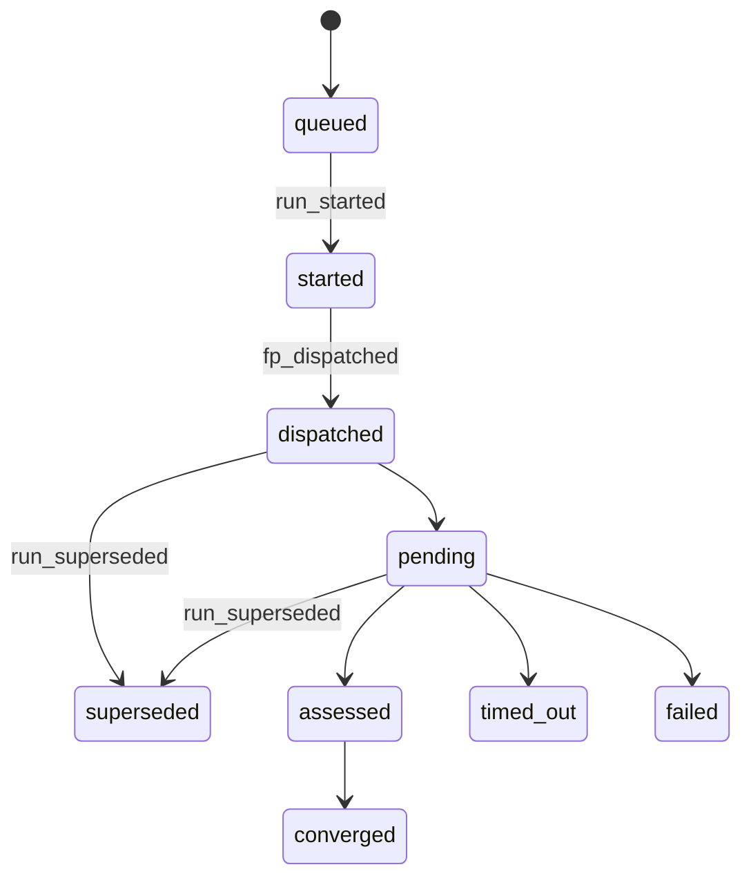
```mermaid
stateDiagram-v2
    [*] --> queued
    queued --> started : run_started
    started --> dispatched : fp_dispatched
    dispatched --> pending
    dispatched --> superseded : run_superseded
    pending --> assessed
    assessed --> converged
    pending --> timed_out
    pending --> failed
    pending --> superseded : run_superseded
```

**Run state is derived entirely from events:**

```python
@dataclass(frozen=True)
class RunState:
    work_key: str | None
    run_id: str
    edge: str
    state: str              # one of RUN_STATES
    vector_id: str | None   # operational handle (by .id)
    job_id: str | None      # GTL job identity (by .id)
    worker_id: str | None   # bound worker
    role_id: str | None     # bound role
    authority_ref: str | None
    failure_class: str | None
    attempt_number: int
    superseded_by: str | None
```

**Failure taxonomy:**

| Classification | Meaning | Retry eligible |
|---|---|---|
| `transport_failure` | Actor unreachable, timeout, crash | Yes -- automatic, bounded backoff |
| `no_output` | Actor returned empty/invalid response | Yes -- with different parameters |
| `bad_output` | Structurally invalid assessment | No -- requires diagnosis |
| `certification_failure` | Output exists but F_D still fails | No -- construction quality problem |

**Leaf task sub-dispatch:**

```python
@dataclass(frozen=True)
class LeafTask:
    name: str
    input_schema: dict
    output_schema: dict
    timeout_ms: int = 30_000
    tools_allowed: bool = False
```

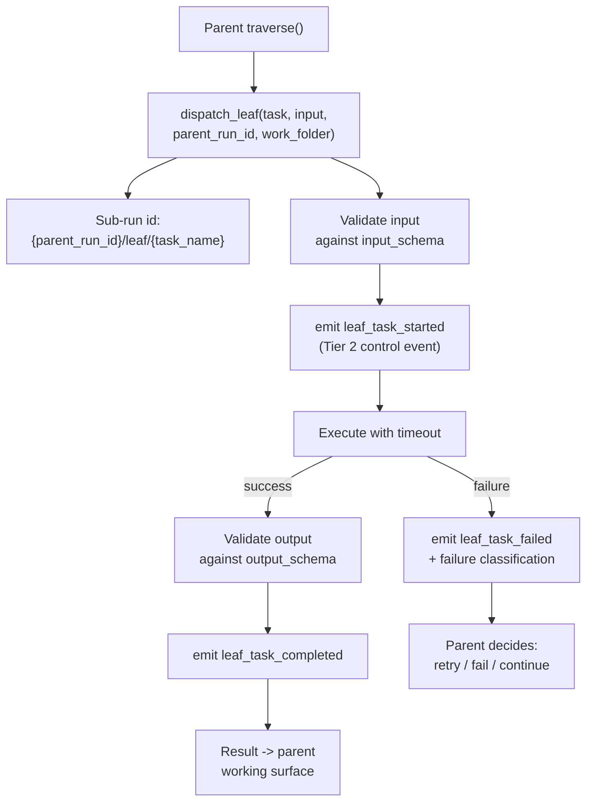
```mermaid
flowchart TD
    PR["Parent traverse()"] --> DL["dispatch_leaf(task, input,\nparent_run_id, work_folder)"]
    DL --> SR["Sub-run id:\n{parent_run_id}/leaf/{task_name}"]
    DL --> VAL["Validate input\nagainst input_schema"]
    VAL --> LS["emit leaf_task_started\n(Tier 2 control event)"]
    LS --> EX["Execute with timeout"]
    EX -->|"success"| VOUT["Validate output\nagainst output_schema"]
    VOUT --> LC["emit leaf_task_completed"]
    EX -->|"failure"| LF["emit leaf_task_failed\n+ failure classification"]
    LC --> PR2["Result -> parent\nworking surface"]
    LF --> PR3["Parent decides:\nretry / fail / continue"]
```

**Key design choices:**
- One run = one attempt on one work_key; `run_id` is attempt identity, not ordering
- `run_bound` is the authoritative binding event carrying full identity (vector_id, job_id, worker_id, role_id, authority_ref)
- Supersession is explicit via `run_superseded` -- late results are recorded but not applied to convergence
- `find_pending_run()` prevents duplicate dispatches: if a pending run exists for the same (edge, work_key), traversal returns `status: "pending"` instead of re-dispatching
- Leaf tasks are subordinate sub-work -- they inherit work_key, carry sub-run identity, and integrate results into the parent's working surface
- `dispatch_leaf()` is a pure kernel module: returns `(output, failure_class)`, event emission delegated to `interpret.py`

### 3.7 Correction Model

Two distinct corrective operations for different semantic needs.

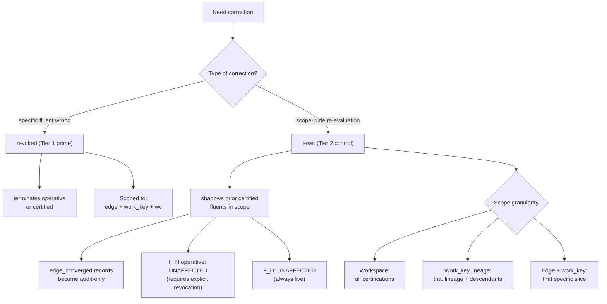
```mermaid
flowchart TD
    Q["Need correction"] --> T{"Type of correction?"}
    T -->|"specific fluent wrong"| RV["revoked (Tier 1 prime)"]
    T -->|"scope-wide re-evaluation"| RS["reset (Tier 2 control)"]

    RV --> OP["terminates operative\nor certified"]
    RV --> SC1["Scoped to:\nedge + work_key + wv"]

    RS --> SH["shadows prior certified\nfluents in scope"]
    RS --> SC2{"Scope granularity"}
    SC2 --> W["Workspace:\nall certifications"]
    SC2 --> WK["Work_key lineage:\nthat lineage + descendants"]
    SC2 --> EWK["Edge + work_key:\nthat specific slice"]

    SH --> EC["edge_converged records\nbecome audit-only"]
    SH --> FH["F_H operative: UNAFFECTED\n(requires explicit revocation)"]
    SH --> FD["F_D: UNAFFECTED\n(always live)"]
```

**Implementation in `correction.py`:**

```python
def find_latest_reset(all_events, edge=None, work_key=None) -> dict | None:
    # Workspace resets (scope="workspace") contain everything
    # Work_key resets (scope="work_key") contain that lineage and descendants
    # Edge+work_key resets (scope="edge") contain that specific slice only
```

**Key design choices:**
- `revoked` is semantic compensation -- targets a specific fluent instance
- `reset` is a certification boundary -- temporal marker forcing re-certification after the boundary
- Both are append-only and replayable -- no event history destroyed
- Reset does NOT terminate fluents, does NOT erase events, does NOT reopen F_H approval
- `bind_fp_certified()` checks: `event.spec_hash == spec_hash` AND event_time > latest applicable reset

### 3.8 Bootloader Artifact Model

ABG-local bootloader-as-asset convergence tracking.

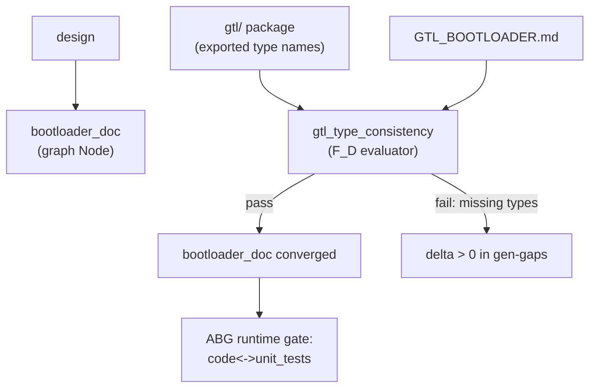
```mermaid
flowchart TD
    D["design"] --> B["bootloader_doc\n(graph Node)"]
    GTL["gtl/ package\n(exported type names)"] --> FD["gtl_type_consistency\n(F_D evaluator)"]
    BOOT["GTL_BOOTLOADER.md"] --> FD
    FD -->|"pass"| OK["bootloader_doc converged"]
    FD -->|"fail: missing types"| GAP["delta > 0 in gen-gaps"]
    OK --> GATE["ABG runtime gate:\ncode<->unit_tests"]
```

**Key design choices:**
- `bootloader_doc` is a graph Node with design lineage -- convergence-tracked, not hand-maintained
- `gtl_type_consistency` extracts type names from the gtl package and checks they appear in GTL_BOOTLOADER.md
- Bootloader consistency gates ABG's own `code<->unit_tests` vector
- Domain packages replicate this structure for their own bootloader documents -- that is a domain-package concern, not an ABG requirement

---

## 4. Main Engine Sequencing

### 4.1 gen_start -- Entry Point and Auto-Loop

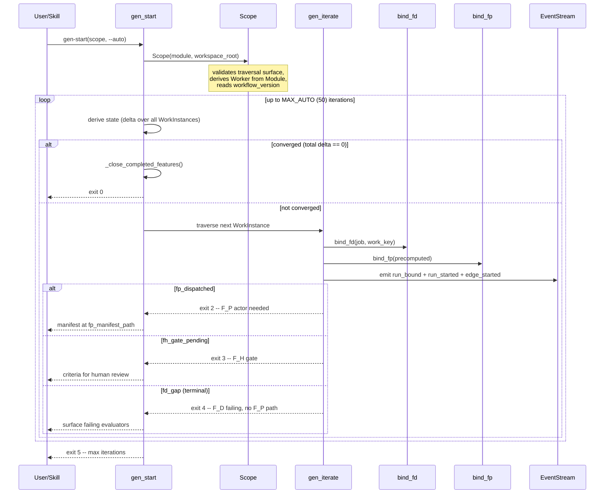
```mermaid
sequenceDiagram
    participant U as User/Skill
    participant GS as gen_start
    participant SC as Scope
    participant GI as gen_iterate
    participant BD as bind_fd
    participant BF as bind_fp
    participant ES as EventStream

    U->>GS: gen-start(scope, --auto)
    GS->>SC: Scope(module, workspace_root)
    Note over SC: validates traversal surface,<br/>derives Worker from Module,<br/>reads workflow_version
    loop up to MAX_AUTO (50) iterations
        GS->>GS: derive state (delta over all WorkInstances)
        alt converged (total delta == 0)
            GS->>GS: _close_completed_features()
            GS-->>U: exit 0
        else not converged
            GS->>GI: traverse next WorkInstance
            GI->>BD: bind_fd(job, work_key)
            GI->>BF: bind_fp(precomputed)
            GI->>ES: emit run_bound + run_started + edge_started
            alt fp_dispatched
                GI-->>GS: exit 2 -- F_P actor needed
                GS-->>U: manifest at fp_manifest_path
            else fh_gate_pending
                GI-->>GS: exit 3 -- F_H gate
                GS-->>U: criteria for human review
            else fd_gap (terminal)
                GI-->>GS: exit 4 -- F_D failing, no F_P path
                GS-->>U: surface failing evaluators
            end
        end
    end
    GS-->>U: exit 5 -- max iterations
```

### 4.2 F_P Dispatch and Result Ingestion

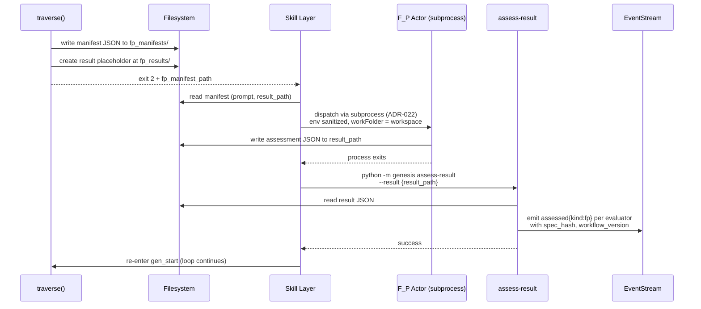
```mermaid
sequenceDiagram
    participant TR as traverse()
    participant FS as Filesystem
    participant SK as Skill Layer
    participant FP as F_P Actor (subprocess)
    participant AR as assess-result
    participant ES as EventStream

    TR->>FS: write manifest JSON to fp_manifests/
    TR->>FS: create result placeholder at fp_results/
    TR-->>SK: exit 2 + fp_manifest_path

    SK->>FS: read manifest (prompt, result_path)
    SK->>FP: dispatch via subprocess (ADR-022)<br/>env sanitized, workFolder = workspace
    FP->>FS: write assessment JSON to result_path
    FP-->>SK: process exits

    SK->>AR: python -m genesis assess-result<br/>--result {result_path}
    AR->>FS: read result JSON
    AR->>ES: emit assessed{kind:fp} per evaluator<br/>with spec_hash, workflow_version
    AR-->>SK: success

    SK->>TR: re-enter gen_start (loop continues)
```

**F_P manifest structure:**

```json
{
    "manifest_id": "design_code_20260327T120000",
    "edge": "design->code",
    "source_asset": "design",
    "target_asset": "code",
    "source_markov": {"design": ()},
    "target_markov": (),
    "failing_evaluators": [
        {"name": "code_complete", "regime": "F_P", "description": "..."}
    ],
    "fd_results": {},
    "delta": 1,
    "contexts": [{"name": "bootloader", "locator": "...", "digest": "...", "content": "..."}],
    "current_asset": {},
    "prompt": "...",
    "result_path": ".ai-workspace/fp_results/...",
    "spec_hash": "a1b2c3d4e5f6a7b8",
    "requirements": ["REQ-F-BOOT-001", ...],
    "run_id": "...",
    "work_key": "FEAT-001"
}
```

### 4.3 Convergence and Escalation Flow

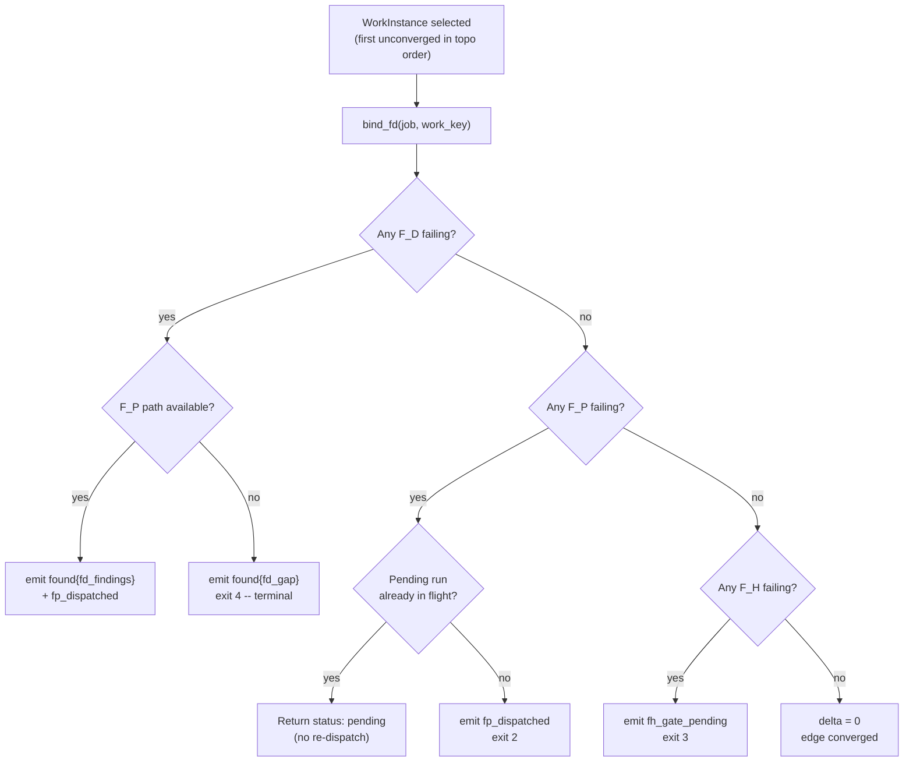
```mermaid
flowchart TD
    A["WorkInstance selected\n(first unconverged in topo order)"] --> B["bind_fd(job, work_key)"]
    B --> C{"Any F_D failing?"}
    C -->|yes| D{"F_P path available?"}
    D -->|yes| E["emit found{fd_findings}\n+ fp_dispatched"]
    D -->|no| F["emit found{fd_gap}\nexit 4 -- terminal"]
    C -->|no| G{"Any F_P failing?"}
    G -->|yes| P{"Pending run\nalready in flight?"}
    P -->|yes| PEND["Return status: pending\n(no re-dispatch)"]
    P -->|no| H["emit fp_dispatched\nexit 2"]
    G -->|no| I{"Any F_H failing?"}
    I -->|yes| J["emit fh_gate_pending\nexit 3"]
    I -->|no| K["delta = 0\nedge converged"]
```

**Why this ordering:**
- F_D is cheapest and most authoritative -- deterministic, no LLM, no human
- F_P is construction under bounded ambiguity -- agent produces candidate
- F_H is reserved for residual human judgment -- most expensive, most authoritative
- Dispatching F_P against broken F_D wastes budget; requesting F_H review of unresolved F_P wastes attention
- `find_pending_run()` prevents duplicate F_P dispatches for the same (edge, work_key)

### 4.4 Selection and Substitution Flow

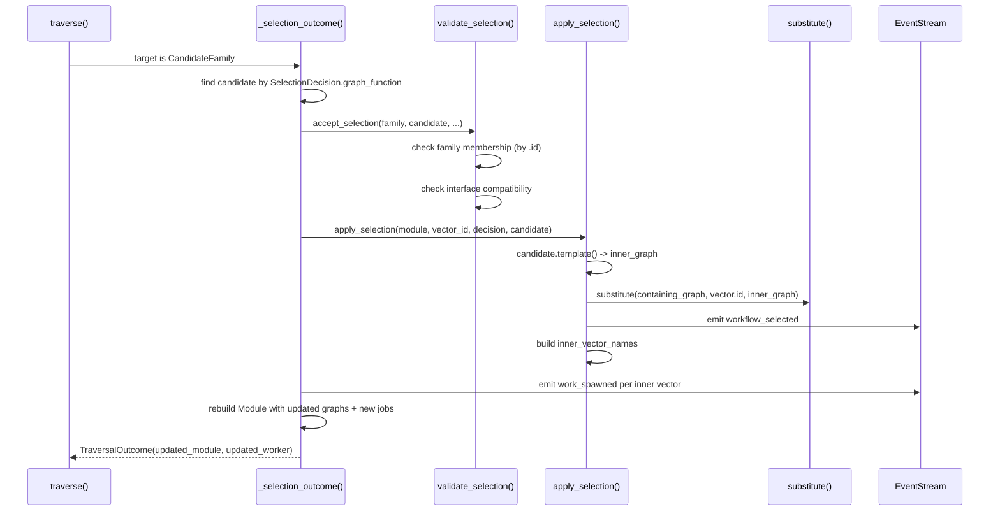
```mermaid
sequenceDiagram
    participant T as traverse()
    participant S as _selection_outcome()
    participant V as validate_selection()
    participant A as apply_selection()
    participant SUB as substitute()
    participant ES as EventStream

    T->>S: target is CandidateFamily
    S->>S: find candidate by SelectionDecision.graph_function
    S->>V: accept_selection(family, candidate, ...)
    V->>V: check family membership (by .id)
    V->>V: check interface compatibility
    S->>A: apply_selection(module, vector_id, decision, candidate)
    A->>A: candidate.template() -> inner_graph
    A->>SUB: substitute(containing_graph, vector.id, inner_graph)
    A->>ES: emit workflow_selected
    A->>A: build inner_vector_names
    S->>ES: emit work_spawned per inner vector
    S->>S: rebuild Module with updated graphs + new jobs
    S-->>T: TraversalOutcome(updated_module, updated_worker)
```

### 4.5 F_H Gate Evaluation Flow

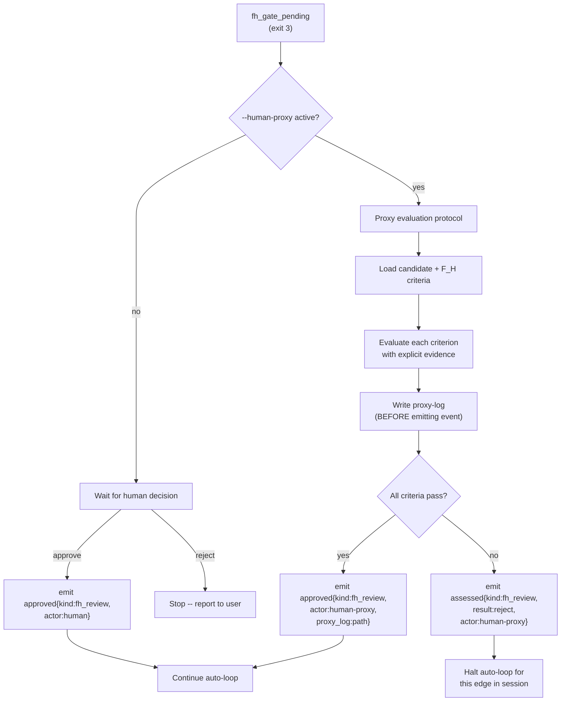
```mermaid
flowchart TD
    FH["fh_gate_pending\n(exit 3)"] --> HP{"--human-proxy active?"}
    HP -->|no| HW["Wait for human decision"]
    HW -->|approve| EA["emit approved{kind:fh_review,\nactor:human}"]
    HW -->|reject| STOP["Stop -- report to user"]

    HP -->|yes| PE["Proxy evaluation protocol"]
    PE --> LC["Load candidate + F_H criteria"]
    LC --> EV["Evaluate each criterion\nwith explicit evidence"]
    EV --> PL["Write proxy-log\n(BEFORE emitting event)"]
    PL --> PD{"All criteria pass?"}
    PD -->|yes| PA["emit approved{kind:fh_review,\nactor:human-proxy,\nproxy_log:path}"]
    PD -->|no| PR["emit assessed{kind:fh_review,\nresult:reject,\nactor:human-proxy}"]
    PR --> HALT["Halt auto-loop for\nthis edge in session"]

    EA --> CONT["Continue auto-loop"]
    PA --> CONT
```

### 4.6 WorkInstance Scheduling Flow

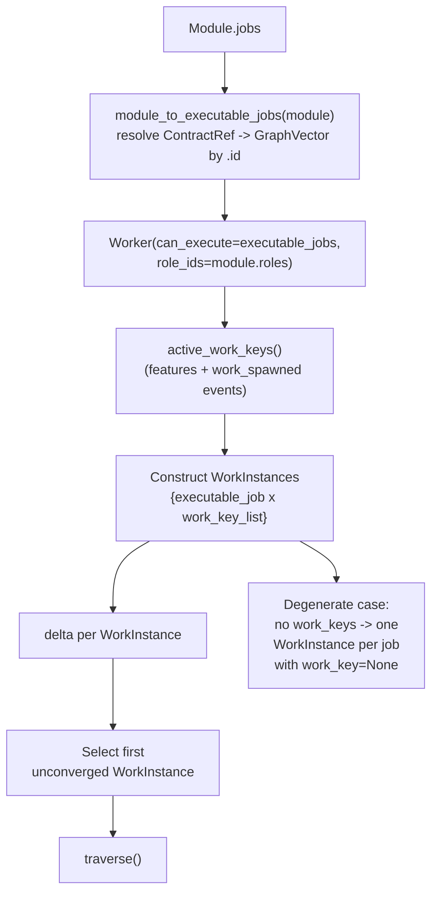
```mermaid
flowchart TD
    M["Module.jobs"] --> EJ["module_to_executable_jobs(module)\nresolve ContractRef -> GraphVector by .id"]
    EJ --> W["Worker(can_execute=executable_jobs,\nrole_ids=module.roles)"]
    W --> WK["active_work_keys()\n(features + work_spawned events)"]
    WK --> WI["Construct WorkInstances\n{executable_job x work_key_list}"]
    WI --> DL["delta per WorkInstance"]
    DL --> SEL["Select first\nunconverged WorkInstance"]
    SEL --> IT["traverse()"]

    WI --> DG["Degenerate case:\nno work_keys -> one\nWorkInstance per job\nwith work_key=None"]
```

**Scheduling rules:**
- Job order is topological (upstream before downstream)
- Within a vector, work keys are routed separately
- Child work may affect parent convergence via fold-back
- `Worker.is_eligible(job)` enforces conjunctive check: job in can_execute AND required roles satisfied
- Worker batching partitions by `writable_types` (target Node names) for concurrent safety

### 4.7 Feature Completion Flow

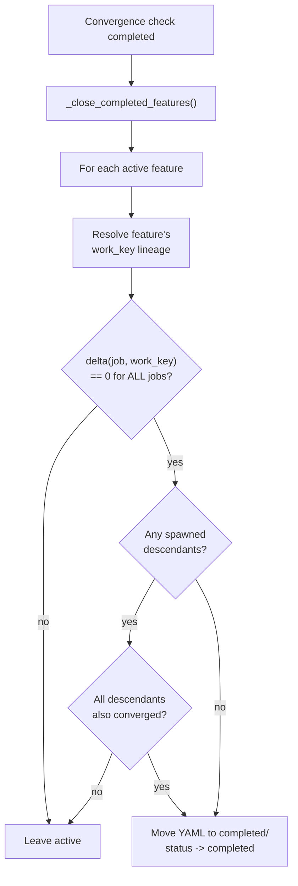
```mermaid
flowchart TD
    GC["Convergence check completed"] --> FC["_close_completed_features()"]
    FC --> FK["For each active feature"]
    FK --> RWK["Resolve feature's\nwork_key lineage"]
    RWK --> D0{"delta(job, work_key)\n== 0 for ALL jobs?"}
    D0 -->|no| NA["Leave active"]
    D0 -->|yes| CH{"Any spawned\ndescendants?"}
    CH -->|yes| FB{"All descendants\nalso converged?"}
    FB -->|no| NA
    FB -->|yes| MV["Move YAML to completed/\nstatus -> completed"]
    CH -->|no| MV
```

---

## 5. Important Subflows

### 5.1 Event Emission Governance

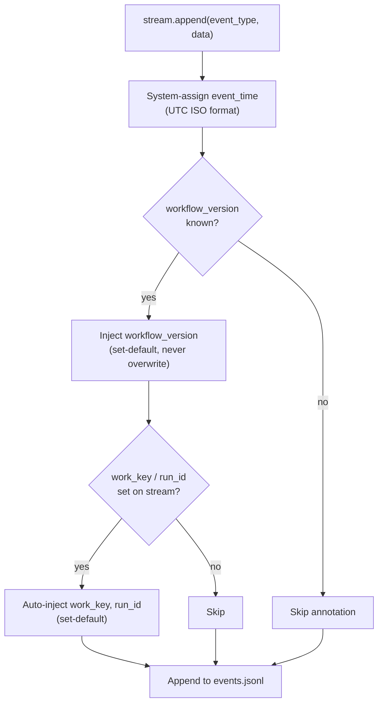
```mermaid
flowchart TD
    E["stream.append(event_type, data)"] --> TS["System-assign event_time\n(UTC ISO format)"]
    TS --> WV{"workflow_version\nknown?"}
    WV -->|yes| AN["Inject workflow_version\n(set-default, never overwrite)"]
    WV -->|no| SK["Skip annotation"]
    AN --> WKI{"work_key / run_id\nset on stream?"}
    WKI -->|yes| INJ["Auto-inject work_key, run_id\n(set-default)"]
    WKI -->|no| SK2["Skip"]
    INJ --> AP["Append to events.jsonl"]
    SK --> AP
    SK2 --> AP
```

**EventStream.append() contract:**
- `event_time` is always system-assigned (UTC ISO)
- `workflow_version`, `work_key`, `run_id` are injected via `setdefault()` when set on the stream object -- never overwrite explicit values
- Corrupted log lines fail visibly -- no silent skipping during replay

### 5.2 Context Resolution Flow

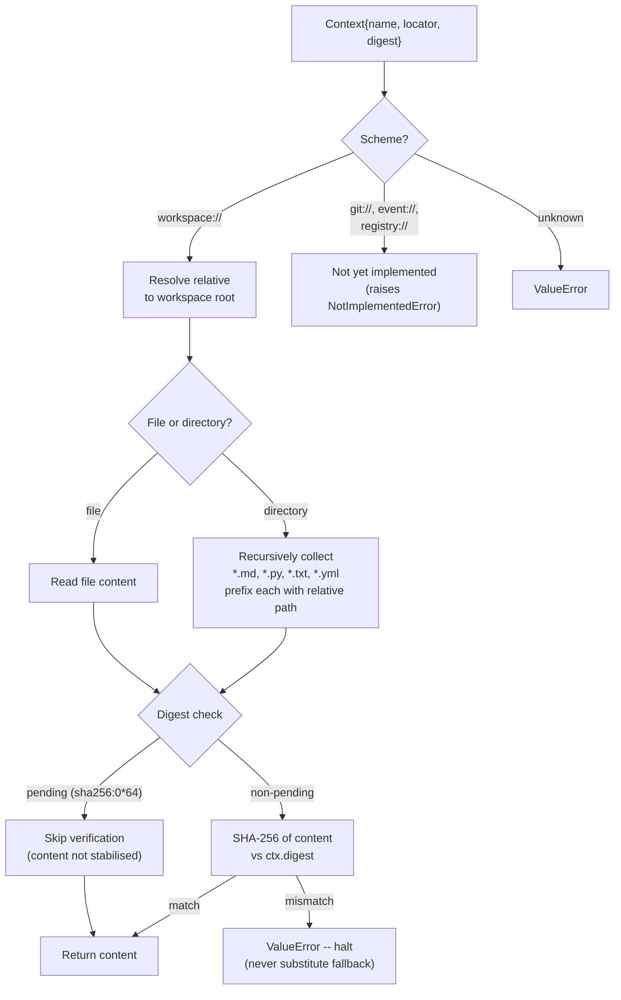
```mermaid
flowchart TD
    CTX["Context{name, locator, digest}"] --> SC{"Scheme?"}
    SC -->|"workspace://"| WS["Resolve relative\nto workspace root"]
    SC -->|"git://, event://,\nregistry://"| NI["Not yet implemented\n(raises NotImplementedError)"]
    SC -->|"unknown"| FE["ValueError"]

    WS --> FT{"File or directory?"}
    FT -->|file| RF["Read file content"]
    FT -->|directory| RD["Recursively collect\n*.md, *.py, *.txt, *.yml\nprefix each with relative path"]

    RF --> DV{"Digest check"}
    RD --> DV
    DV -->|"pending (sha256:0*64)"| SKIP["Skip verification\n(content not stabilised)"]
    DV -->|"non-pending"| CMP["SHA-256 of content\nvs ctx.digest"]
    CMP -->|match| OK["Return content"]
    CMP -->|mismatch| HALT["ValueError -- halt\n(never substitute fallback)"]
    SKIP --> OK
```

### 5.3 Run Supersession

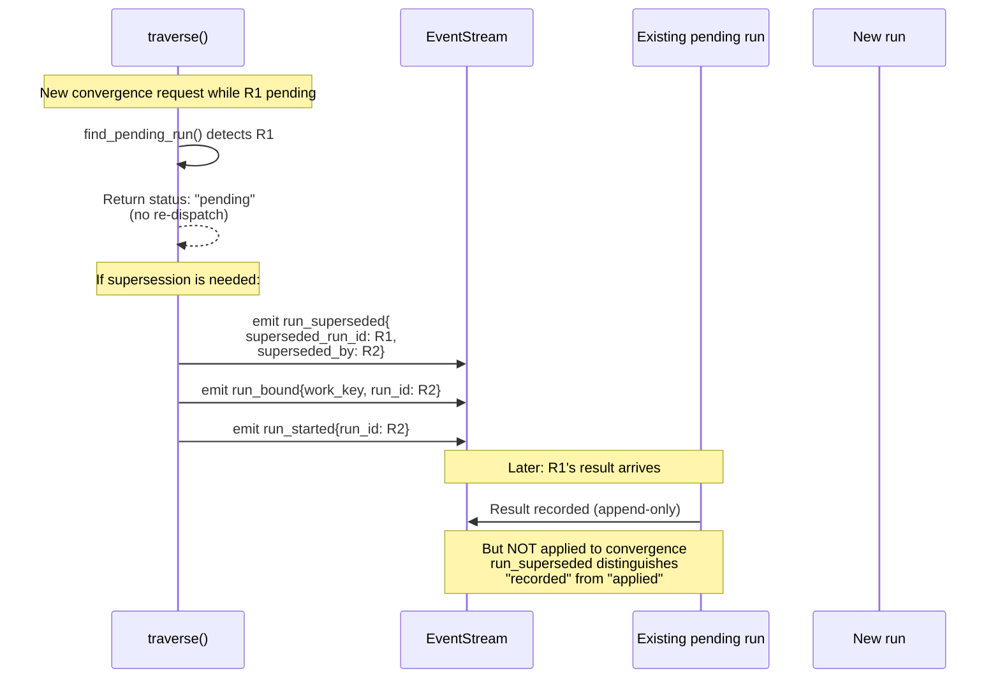
```mermaid
sequenceDiagram
    participant S as traverse()
    participant ES as EventStream
    participant R1 as Existing pending run
    participant R2 as New run

    Note over S: New convergence request while R1 pending
    S->>S: find_pending_run() detects R1
    S-->>S: Return status: "pending"<br/>(no re-dispatch)
    Note over S: If supersession is needed:
    S->>ES: emit run_superseded{<br/>superseded_run_id: R1,<br/>superseded_by: R2}
    S->>ES: emit run_bound{work_key, run_id: R2}
    S->>ES: emit run_started{run_id: R2}

    Note over R1,ES: Later: R1's result arrives
    R1->>ES: Result recorded (append-only)
    Note over R1,ES: But NOT applied to convergence<br/>run_superseded distinguishes<br/>"recorded" from "applied"
```

### 5.4 Worker Batching

```mermaid
flowchart TD
    W["All workers"] --> GB["Greedy batch partitioning"]
    GB --> B1["Batch 1: non-conflicting workers"]
    GB --> B2["Batch 2: next set"]
    GB --> BN["Batch N: remainder"]

    B1 -->|"completes"| B2
    B2 -->|"completes"| BN

    CF["Conflict detection:\noverlapping writable_types\n(target Node names)"]
```

**Algorithm (`schedule()` in `interpret.py`):** Greedy partitioning -- while workers remain, start a new batch with the first unassigned worker, add each remaining worker if `worker.conflicts_with(batch_member)` is False (no overlapping `writable_types`), otherwise defer to the next batch. Batch i completes before batch i+1 starts.

### 5.5 Installer and Cascade Flow

```mermaid
flowchart TD
    GI["gen-install --target dir"] --> CP["Copy engine modules\nto .genesis/genesis/"]
    CP --> GTL["Vendor GTL type system\nto .genesis/gtl/"]
    GTL --> YML{"genesis.yml exists?"}
    YML -->|no| SEED["Write minimal kernel default\n(no package/worker binding)"]
    YML -->|yes| SKIP["Preserve existing\n(domain installer owns binding)"]
    SEED --> RT["Ensure .ai-workspace/runtime/\nexists"]
    SKIP --> RT
    RT --> CMD["Append GTL bootloader\nto CLAUDE.md (idempotent)"]
    CMD --> EI["emit genesis_installed\n(directly to events.jsonl)"]

    CASCADE["Cascade chain:\nABG -> domain package -> dependents\n(never ABG direct to dependents)"]

    WB["workspace_bootstrap()\nis a SEPARATE function\n(genesis.install)\nScaffolds .ai-workspace/ dirs\nand returns bound EventStream"]
```

**What the kernel installer does NOT do:**
- Does not generate starter GTL modules or spec packages (domain installers own that)
- Does not call `workspace_bootstrap()` (that is a separate scaffolding function in `genesis.install`)
- Does not set package/worker bindings in genesis.yml (domain installers own those)
- On reinstall: replaces engine + GTL modules but preserves genesis.yml

---

## 6. Algorithmic Choices

### 6.1 V2 Delta -- Typed Convergence

The V2 delta function operates on typed `EvaluatorOutcome` values:

```python
def delta(
    contract_id: str,
    outcomes: tuple[EvaluatorOutcome, ...],
    *,
    rule: Rule | None = None,
) -> ConvergenceResult:
```

**Algorithm:**
1. Validate all outcomes share `contract_id`
2. Error propagation: any `status == "error"` -> `aggregate_state="error"`, `next_action="fail"`
3. Count passes vs total
4. Determine quorum: `rule.config["quorum"]` if declared, else `total` (all must pass)
5. If `passes >= quorum` -> `aggregate_state="closed"`, `next_action="continue"`
6. If open outcomes exist -> escalate to next regime
7. If quorum not met and rule declares quorum -> `next_action="repeat_round"`
8. If failing outcomes exist -> escalate to next regime
9. Default: `aggregate_state="open"`, `next_action="fail"`

**Escalation:** `{F_D: F_P, F_P: F_H}`. `F_H` is terminal -- no further escalation.

### 6.2 PrecomputedManifest -- The Residual Gap

`bind_fd()` computes all deterministic state before agent/human involvement:

```python
@dataclass
class PrecomputedManifest:
    executable_job: ExecutableJob
    current_asset: dict           # project(stream, source, "current")
    failing_evaluators: list[Evaluator]
    passing_evaluators: list[Evaluator]
    fd_results: dict[str, Any]
    relevant_contexts: dict[str, str]
    delta: int                    # len(failing_evaluators)
```

`bind_fd()` runs F_D evaluators via subprocess, checks F_H via `bind_fh()` (Event Calculus), checks F_P via `bind_fp_certified()` (spec_hash + reset boundary). It does NOT invoke LLMs or dispatch agents.

`bind_fp()` assembles the F_P dispatch manifest from the precomputed gap -- template assembly only, no LLM invocation.

### 6.3 holdsAt -- Fluent Projection

**operative (F_H) via `bind_fh()`:**
```
holdsAt(operative(edge, work_key, wv), now):
  Find latest approved{kind: fh_review|fh_intent} for (edge, work_key, wv)  -> T_a
  Find any revoked{kind: fh_approval} at T_r > T_a for same scope           -> terminates
  If T_a exists and no terminating revocation postdates it: HOLDS

  workflow_version matching:
    wv == "unknown"  -> match by (edge, work_key) alone
    wv != "unknown"  -> exact version match OR carry-forward match
```

**certified (F_P) via `bind_fp_certified()`:**
```
holdsAt(certified(edge, work_key, ev, spec_hash, wv), now):
  Find latest assessed{kind: fp, result: pass, evaluator: ev} for scope     -> T_a
  Require: event.spec_hash == spec_hash (or spec_hash is null)
  Require: T_a > latest applicable reset boundary (shadowing check)
  Find any revoked{kind: fp_assessment} at T_r > T_a for same scope         -> terminates
  If T_a exists, spec matches, not shadowed, not terminated: HOLDS
```

### 6.4 Spec Hash

```python
if workflow_version == "unknown":
    spec_hash = req_hash(requirements)        # SHA-256 of sorted REQ keys, first 16 hex
else:
    spec_hash = executable_job_hash(job)      # SHA-256 of job+roles+evaluators+contexts, first 16 hex
```

`executable_job_hash` covers: GTL job name, role names, evaluator name+regime+binding+description, context name+digest. Whitespace-normalized before hashing. Changing any evaluator field invalidates all prior F_P assessments for that job.

### 6.5 Reset Boundary

```python
def find_latest_reset(all_events, edge=None, work_key=None) -> dict | None:
    # scope="workspace": contains everything
    # scope="work_key": contains that lineage and descendants (startswith check)
    # scope="edge": contains that specific (edge, work_key) slice only
```

**What reset does NOT do:**
- Does not terminate fluents (no EC state change)
- Does not erase events (append-only preserved)
- Does not reopen F_H approval (human judgment is durable)
- Does not affect F_D (always live execution)

### 6.6 Fold-Back

```
parent_converged(parent_key, stream, jobs, workspace_root, spec_hash, ...):
    children = _discover_children(events, parent_key)
    if no children: check delta directly
    for each child: recurse (parent_converged)
    parent converged only when ALL descendants converged
```

Children discovered from `work_spawned` events in the stream -- not from hidden scheduler state.

### 6.7 Pending and Retry

```
find_pending_run(events, edge, work_key) -> RunState | None
    If a pending run exists for (edge, work_key), return it.
    traverse() checks this BEFORE dispatching -- returns status: "pending".

Transport failures -> automatic retry with bounded backoff, max 3 attempts
Each retry creates new run_id on same work_key -- attempt history preserved
After max retries -> failed with summary of all attempt outcomes
Late superseded results -> recorded but not applied to convergence
```

---

## 7. Territory Model

```mermaid
flowchart TD
    subgraph Installed["Installed Territories (read-only at runtime)"]
        GEN[".genesis/\nABG engine + config"]
        DOM["domain/release/\nDomain package"]
    end

    subgraph Authored["Authored Territories (editable)"]
        SPEC["specification/\nIntent, requirements, standards"]
        BUILDS["build_tenants/\nImplementation, tests, design"]
    end

    subgraph Runtime["Runtime Territory"]
        AWS[".ai-workspace/\nEvents, features, reviews"]
    end

    ABG["ABG Installer"] --> GEN
    GSDLC["Domain Installer"] --> DOM
    HUMAN["Human / Agent"] --> SPEC
    HUMAN --> BUILDS
    ENGINE["Engine"] --> AWS
```

| Territory | Who writes | Rule |
|-----------|-----------|------|
| `.genesis/` | ABG installer only | Never edit directly -- updated only by installer |
| `domain/release/` | Domain package installer only | Never edit directly |
| `specification/` | Human | Editable -- intent, requirements, standards |
| `build_tenants/` | Human + agents | Editable -- implementation, tests, design |
| `.ai-workspace/` | Engine + agents via `emit()` | Events append-only; features/reviews territory-partitioned |

---

## 8. Module Architecture

ABG engine modules and their responsibilities:

| Module | Responsibility | Depends on |
|--------|---------------|------------|
| `gtl.graph` | Node, GraphVector, Graph, Context | stdlib only |
| `gtl.function_model` | GraphFunction, RefinementBoundary, CandidateFamily | gtl.graph |
| `gtl.operator_model` | Regime, Operator, Evaluator, Rule | stdlib only |
| `gtl.work_model` | ContractRef, Role, Job | gtl.graph |
| `gtl.module_model` | Module, ModuleImport | all gtl.* |
| `gtl.algebra` | compose, substitute, identity, recurse, HOF, sugar | gtl.graph, gtl.function_model |
| `genesis.events` | EventStream, append-only log | stdlib only |
| `genesis.projection` | project() -- deterministic replay | genesis.events |
| `genesis.correction` | find_latest_reset() | stdlib only |
| `genesis.provenance` | req_hash, executable_job_hash, workflow_version | genesis.binding |
| `genesis.binding` | ExecutableJob, Worker, WorkSurface, ContextResolver, bind_fd/fp/fh | gtl.*, genesis.events/projection/correction |
| `genesis.convergence` | EvaluatorOutcome, ConvergenceResult, delta() | gtl.operator_model, genesis.binding |
| `genesis.selection` | SelectionDecision, validate/resolve/enumerate | gtl.*, no runtime deps |
| `genesis.interpret` | Traversal, TraversalRuntime, traverse(), apply_selection(), schedule() | all genesis.* |
| `genesis.lineage` | WorkInstance, spawn, discover_children, active_work_keys | genesis.binding, genesis.events |
| `genesis.run` | RunState, run_state, find_pending_run | stdlib only |
| `genesis.subwork` | LeafTask, dispatch_leaf, validate_leaf_schema | genesis.transport |
| `genesis.services` | Scope, gen_gaps, gen_iterate, gen_start | all genesis.* |

**Dependency rule:** GTL types have no runtime dependency. `genesis.selection` is a pure kernel module (no side effects, no events, no I/O). Event emission is concentrated in `genesis.interpret` (per GTL_2_MODULE_DESIGN SS4.4).

---

## 9. Review Focus

For human design review, the highest-value questions are:

1. **Is Module now truly the authoritative entry point?** -- Worker, ExecutableJobs, and validation surfaces all derive from Module at Scope construction
2. **Is the GTL/ABG boundary clean?** -- GTL types have no runtime dependency; algebra is pure; selection.py returns values, interpret.py emits events
3. **Does CandidateFamily + SelectionDecision eliminate hidden strategy?** -- No auto-selection, no implicit inference of alternatives. validate_module_selection_surface() fails closed on hidden contracts
4. **Does categorical identity (.id) prevent name collision?** -- substitute() and ContractRef operate by .id; composition creates fresh ids
5. **Is the event model cleanly three-tiered?** -- Only five primes participate in fluent projection; everything else is Tier 2/3
6. **Is reset semantically distinct from compensation?** -- Compensation terminates fluents; reset creates temporal boundaries. F_H survives reset.
7. **Does run governance stay subordinate to convergence truth?** -- find_pending_run() prevents duplicate dispatch; run lifecycle is observational, never initiates or terminates fluents
8. **Is the provenance chain tight?** -- Every event carries workflow_version when known; spec_hash covers evaluator definitions + context digests; carry-forward is explicit
9. **Is recursive composition lawful and replayable?** -- Topology reconstructable from workflow_selected + work_spawned events alone
