# ABIogenesis 5.0 GTL 3 / HoG / ABG Schematics

**Status**: Current diagrams of the frozen GTL language and authority boundary
**Projection basis**: Active ABIogenesis 5.0 Product and requirement law
accepted by T-283 `F_H` closure

These diagrams are explanatory read models. The constitutional source remains
`specification/`.

## Reading Key

| Shape | Owner class | Meaning |
|---|---|---|
| GTL declarations | Language definition | Program meaning before execution |
| Validator | Static judgment | Type, raw-carrier, and whole-Program validity |
| Product / Module / Catalog | Publication and readiness | Exact admitted availability and membership |
| HoG | Execution | Direct traversal of admitted GTL |
| Implementation owner | Leaf realization | Exact deterministic, probabilistic, or human seam |
| ABG | Runtime truth | Admission, events, replay, lineage, continuation, correction, closure |
| SDK / CLI / read model | Thin boundary or projection | Invocation and observation without controller authority |

## 1. Complete Authority Spine

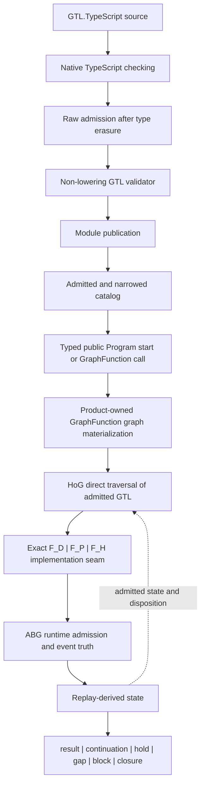

The dotted feedback is runtime state, not a second execution loop: HoG advances
declared topology using the admitted Program and ABG replay-derived state. ABG
admits what occurred and derives the lawful runtime disposition.

## 2. Publication And Program Structure

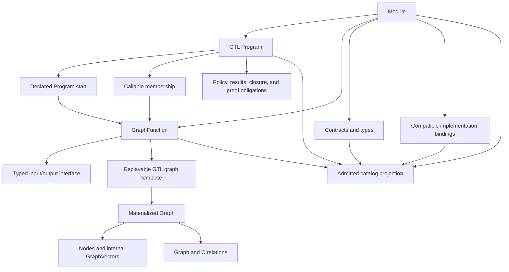

`Program`, `GraphFunction`, and `Graph` are distinct:

- the Program owns composition, starts, membership, policy, result, and proof
  law;
- GraphFunction is the sole named callable contract; and
- its template materializes graph structure for HoG traversal.

## 3. Program, Library, And Workspace

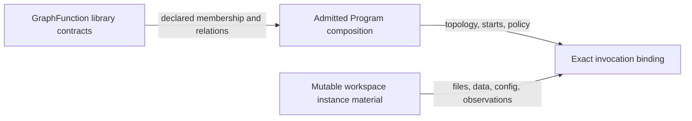

The workspace supplies material to an invocation. It does not become Program
meaning, callable selection, traversal state, or closure truth.

## 4. Validation Depths

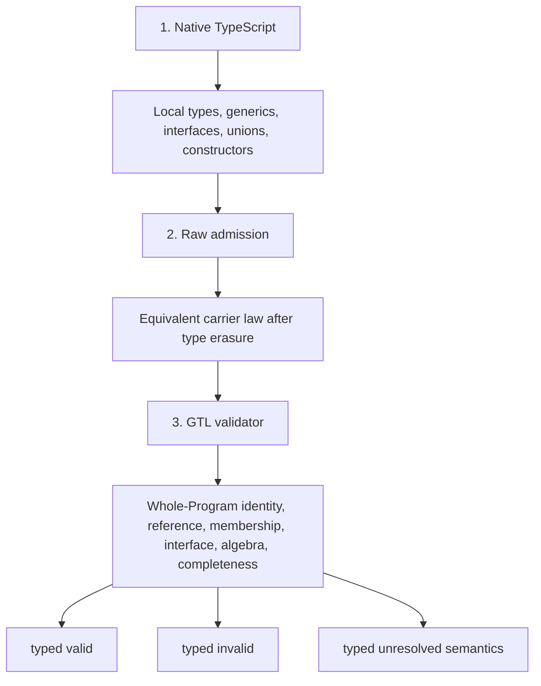

The validator may produce diagnostics, canonical serialization, and
subordinate indexes. None is an executable Program, runtime plan, or event.

## 5. Graph And Compute Algebra

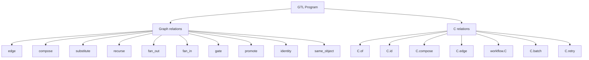

The graph relations and seven C constructors are language declarations. HoG
traverses them directly; no generated execution declaration sits between GTL
and HoG.

## 6. Compute Regimes

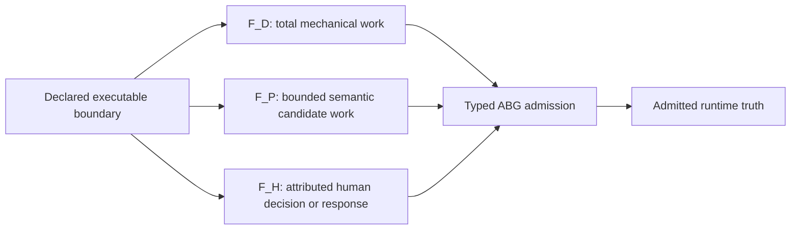

`F_P` and `F_H` output cannot certify deterministic closure. One regime may
consume another regime's admitted evidence but cannot inherit its authority.

## 7. Selected Composition And Stage Sets

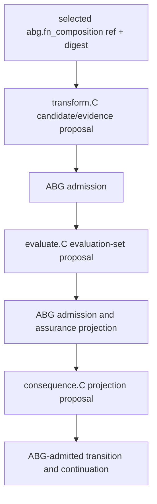

This is notation over existing carriers. `C`, a stage set, and
`TraversalUnit<A, B>` do not create new topology, public callables, plugins,
controllers, or runtimes.

## 8. One GraphFunction Call

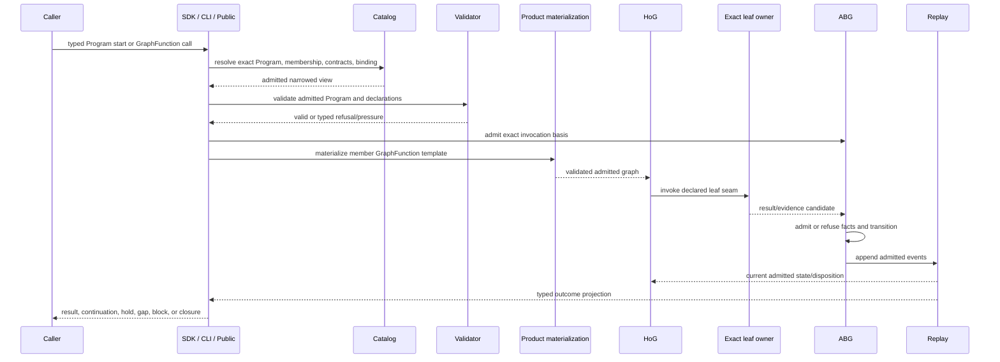

Public does not choose private topology. The implementation owner does not emit
runtime truth. ABG does not execute the graph.

## 9. Recursion And Foldback

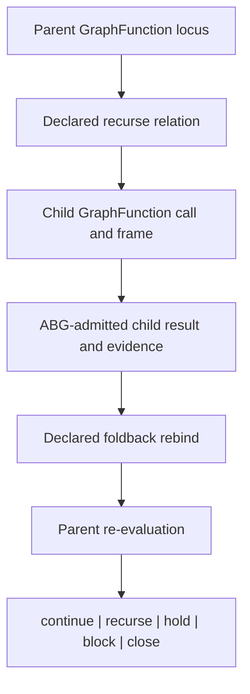

Child closure is not parent closure. Recursion requires explicit termination,
foldback, lineage, parent re-evaluation, and bounds.

## 10. Hello World Composition And Overlay

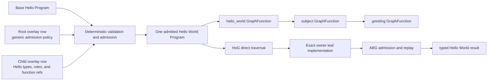

Root and child rows are declaration inputs to admission. They do not remain as
a controller beside HoG. The detailed
[Hello World examples](./GTL_HELLO_WORLD_EXAMPLES.md) distinguish the accepted
odd_glc single-GraphFunction publication from this illustrative composition
and overlay form.

## 11. Forbidden Rival Surfaces

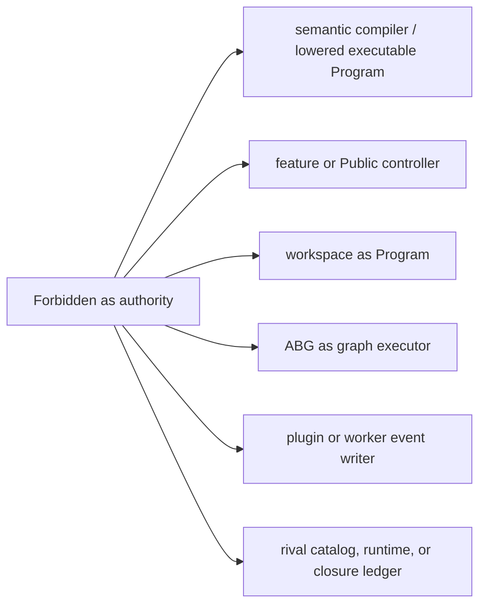

Any design that requires one of these surfaces has crossed the frozen language
boundary and must fail closed or return for constitutional re-entry.

## Source Map

- [Product](https://github.com/foolishimp/abiogenesis/blob/8d7f965a3fae7d1acea6a9db298798480fd4cc2f/specification/PRODUCT.md)
- [Intent](https://github.com/foolishimp/abiogenesis/blob/8d7f965a3fae7d1acea6a9db298798480fd4cc2f/specification/INTENT.md)
- [GTL contract-law reload](https://github.com/foolishimp/abiogenesis/blob/8d7f965a3fae7d1acea6a9db298798480fd4cc2f/specification/requirements/gtl/REQ-L-GTL3-CONTRACT-LAW-API.md)
- [GTL language capability model](https://github.com/foolishimp/abiogenesis/blob/8d7f965a3fae7d1acea6a9db298798480fd4cc2f/specification/requirements/gtl/REQ-L-GTL3-LANGUAGE-CAPABILITY-MODEL.md)
- [Program traversal mapping](https://github.com/foolishimp/abiogenesis/blob/8d7f965a3fae7d1acea6a9db298798480fd4cc2f/specification/requirements/mapping/REQ-M-GTL3-PROGRAM-TRAVERSAL.md)
- [HoG traversal and ABG admission](https://github.com/foolishimp/abiogenesis/blob/8d7f965a3fae7d1acea6a9db298798480fd4cc2f/specification/requirements/abg/REQ-R-ABG3-INTERPRET.md)
- [Accepted odd_glc Hello World publication](https://github.com/foolishimp/odd_glc/blob/dae8589b2784be4c101af70d891f85367fc13ebd/build_tenants/odd_glc/typescript/product/build/publication.json)
- [Hello World examples](./GTL_HELLO_WORLD_EXAMPLES.md)
- [Human guide](./USER_GUIDE.md)
- [LLM guide](./LLM_GTL_APP_BUILDER_GUIDE.md)
