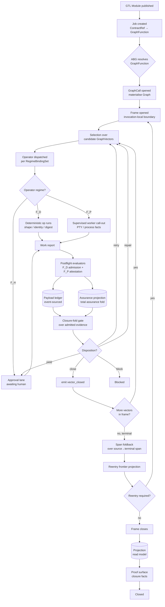
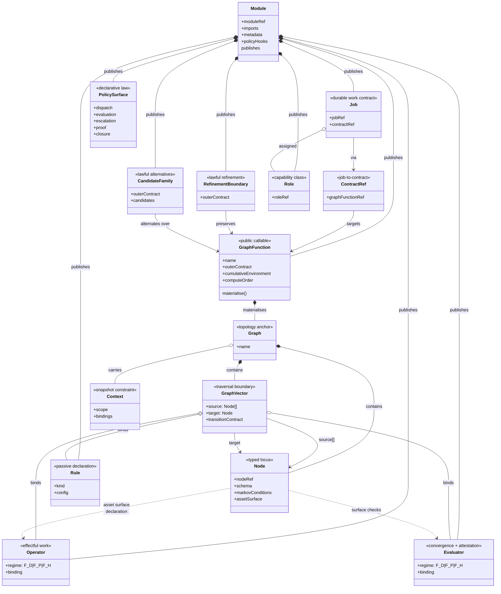

# ABG / GTL Schematics

**Position**: Companion to `LLM_GTL_APP_BUILDER_GUIDE.md`.

The guide gives the ontology and operating contract in prose. This file gives
the same substrate as schematics — the engine cross-section, its rotation
cycle, and the wiring/publication surface that connects GTL declarations into
the running engine.

For the current 4.1 line, read every requirements-route surface through that
same split: GTL publishes requirement declarations and lifecycle-composition
refs; ABG admits requirement events, binds evidence, projects folds and
residuals, emits lifecycle disposition, and exposes read-only
`abg.requirements` query facades for downstream consumers.

Read the guide for the law. Read this file when you need to see where the
plugs and connectors sit.

---

## Reading Order

| Schematic | Analogy | What it shows |
| --- | --- | --- |
| §1 State diagram | Rotation cycle / stroke | The macro-states ABG passes through over one frame's lifecycle, including retry, repair, yield, and span foldback as named transitions |
| §2 Flow chart | Cross-section of the motor | The per-vector data and control flow: declaration → dispatch → work → admission → closure → continuation, with the ledger plumbing made explicit |
| §3 Class diagram | Wiring schematic | The GTL publication surface: which types attach to which, what `Module` publishes, where `Job` plugs into `GraphFunction` via `ContractRef` |

These three views are intentionally redundant. The state diagram is **temporal**
(what happens next). The flow chart is **structural** (what flows where). The
class diagram is **typological** (what is declared and how it connects).

---

## §1 ABG Engine — State Diagram

The lifecycle of one `Frame`. The cycle is a loop, not a line: most edges
re-enter through retry / repair / yield, and recursion threads back through
span foldback into reentry.

```mermaid
stateDiagram-v2
    [*] --> Idle: ABG initialised
    Idle --> JobAdmitted: Job binds GraphFunction<br/>via ContractRef
    JobAdmitted --> GraphCallOpened: emit graph_call_opened
    GraphCallOpened --> FrameOpened: GraphFunction<br/>materialises Graph<br/>emit frame_opened
    FrameOpened --> VectorPlanned: selection over<br/>candidate vectors<br/>emit vector_traversal_planned

    VectorPlanned --> OperatorDispatched: ExecutionBasis +<br/>AdvancementTransition +<br/>RegimeBindingSet
    OperatorDispatched --> EvaluatorRan: postflight evaluators<br/>(F_D check; F_P attest;<br/>F_H optional)
    EvaluatorRan --> EvidenceAdmitted: payload ledger +<br/>assurance projection<br/>emit vector_evaluated

    EvidenceAdmitted --> ClosureDecided: closure-fold over<br/>admitted evidence

    ClosureDecided --> VectorClosed: close
    ClosureDecided --> VectorPlanned: retry<br/>(same vector, new attempt)
    ClosureDecided --> Repairing: repair
    ClosureDecided --> AwaitingHuman: yield (F_H)
    ClosureDecided --> Blocked: block

    Repairing --> VectorPlanned: corrected frontier
    AwaitingHuman --> ClosureDecided: F_H decision admitted

    VectorClosed --> ContinuationProjected: emit vector_closed
    ContinuationProjected --> VectorPlanned: more vectors<br/>in this frame
    ContinuationProjected --> FrameClosing: terminal vector<br/>of frame

    FrameClosing --> SpanFoldback: GraphSpanAssessment +<br/>FoldbackEvaluation
    SpanFoldback --> ReentryFrontier: GraphReentryFrontierProjection
    ReentryFrontier --> FrameOpened: GraphReentryPlan<br/>(constitutional reentry)
    ReentryFrontier --> Closed: no reentry required

    Closed --> [*]: closure law satisfied<br/>(F_P fulfillment +<br/>execution evidence +<br/>no residual pressure)
    Blocked --> [*]: terminal block
```

### Notes on the state diagram

- **Event emission points** are named on transitions, not on states. ABG's
  `emit()` is the write boundary. Every named emission corresponds to an
  append into the event stream.
- **Retry** loops back to `VectorPlanned`, not to the start of the cycle. The
  same vector is replanned with a fresh attempt identity; the prior attempt
  remains in the event log as superseded truth.
- **Repair** is distinct from retry. Retry is "same vector, try again";
  repair is "corrected frontier, advance from a different state". Both
  re-enter at `VectorPlanned`.
- **Yield** is the F_H lane. The engine does not block on human input
  synchronously; it emits the yield, awaits a decision, then resumes closure.
- **Span foldback** runs only at `FrameClosing` — closure of the terminal
  vector of the frame. Constitutional reentry routes back into a new frame
  open, not into a fresh job.

---

## §2 ABG Engine — Flow Chart

The cross-section. Follow one vector's traversal from declared GTL through to
admitted runtime fact. Boxes are operations; diamonds are decisions; cylinders
are durable ledgers / projections.

### Notes on the flow chart

- **Three regime branches** at operator dispatch (`F_D`, `F_P`, `F_H`)
  converge into one `Work report`. Downstream postflight treats them
  uniformly — the regime tag determines what attestation is admissible, not
  what the closure-fold gate evaluates.
- **Two ledger surfaces** (`Payload ledger`, `Assurance projection`) feed
  the closure-fold gate. Payload ledger holds admitted carrier data;
  assurance projection holds the total-assurance fold over carrier admission
  plus evaluator attestation.
- **Closure-fold gate** is the only place `Disposition` is decided. Retry /
  repair / block / yield / close are typed outcomes; none of them are
  inferred elsewhere.
- **Reentry** is the recursion hook. After frame closes, span foldback
  evaluates whether constitutional reentry is required (typed by
  `change_class`). If yes, a new frame opens at the implicated source
  vector. If no, projection updates and the proof surface determines closure
  facts.

---

## §3 GTL Domain Model — Class Diagram

The publication shape. `Module` is the only publication boundary in GTL.
Every other type either attaches to a topology anchor (`Graph`, `Node`,
`GraphVector`) or governs the public callable carrier (`GraphFunction`).

### Notes on the class diagram

- **`Module` is the only publication boundary**. Everything reachable from
  outside the module must be published through it. Hidden service methods,
  imperative executive loops, or product-local registries are not lawful
  publication surfaces.
- **`GraphFunction` is the public callable carrier**. `Job` references a
  graph function via `ContractRef`. Jobs do not target bare `GraphVector`
  instances. The `GraphVector` is realised structure, not an external entry
  point.
- **`Operator` and `Evaluator` both carry a regime** (`F_D | F_P | F_H`).
  Operators do effectful work; evaluators attest. The regime determines
  what kind of work and what kind of attestation, not where the type lives.
- **`Context` is a snapshot constraint** carried by graph structure. It is
  not a runtime fact ABG emits; it is declarative input to traversal.
- **`PolicySurface`** is the declarative law for dispatch, evaluation,
  escalation, proof, and closure. It belongs in the module publication, not
  in transport prose or `runtime_config`.

---

## What These Diagrams Deliberately Omit

These three schematics cover the engine's main rotation cycle and GTL's
publication shape. They omit several typed runtime surfaces that warrant their
own diagrams when needed:

| Omitted surface | What it is | When to draw it |
| --- | --- | --- |
| Asset surface lifecycle | `OutputInstanceAllocation`, `WorkspaceAssetBinding`, cross-workspace allocation, allowed write roots | When introducing the cross-workspace output story or the T-082 / T-104 allocation contracts |
| Zoom foldback | Per-edge `ZoomFrame`, `ScheduledSliceAssessment`, `ZoomFoldbackEvaluation`, obligation schedule | When explaining how a single edge admits many scheduled slices and folds them back |
| Construction priority lens | `ConstructionObservationSnapshot`, `ConstructionActionCatalogProjection`, `ObservationToActionBindingProjection`, `ConstructionPriorityProjection` | When explaining how the F_P construction evaluator ranks typed asset gaps |
| Plugin observer hookpoints | `dispatch`, `traversal_modulation`, `plugin_traversal_observer`, `gtl.target_carrier_contract`, `evaluation`, `escalation`, `proof`, `closure`, `assurance`, `payload ledger`, `role hooks`, `candidate-family hints` | When the consumer needs to know where to plug in policy or instrumentation |
| Event calculus runtime law | T-120 declared event calculus surfaces | When explaining the typed temporal algebra that governs event admissibility |
| Eval suite projection | `EvalSuiteSpec`, `EvalAggregateProjection` | When explaining how trial evidence aggregates into project-level eval truth |

Each of these is a one-page schematic in the same style. Add them as
sibling §-sections when the corresponding surface needs visual exposition.

---

## How To Use These Schematics When Building

1. **Designing a new graph function**: start with §3 to confirm where your
   declaration plugs in (you are publishing through `Module`, declaring a
   `GraphFunction`, materialising a `Graph`, defining `GraphVector` bindings
   to `Operator` / `Evaluator` / `Rule`).
2. **Tracing a runtime issue**: start with §1 to identify which state the
   engine is in (or got stuck in), then drop to §2 to see what should have
   flowed through the corresponding transition.
3. **Reviewing a closure decision**: §2's closure-fold gate is the only
   lawful place a disposition is decided. If a product appears to close
   from somewhere else (worker assertion, postflight pass alone,
   target-carrier admission alone), that is a closure-law violation.
4. **Adding a hookpoint**: if a hook plugs into a named transition in §1 or
   a named decision in §2, it is a lawful policy surface. If it plugs into
   a state, it is probably a hidden controller and warrants reprice.
</content>
</invoke>
