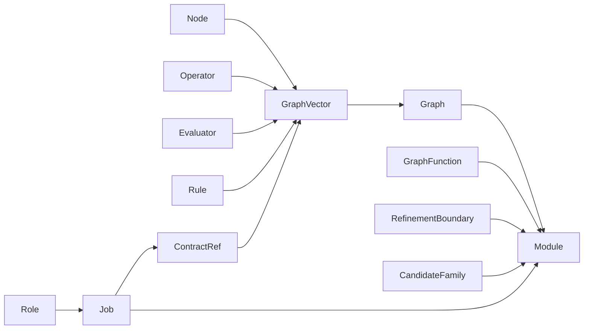
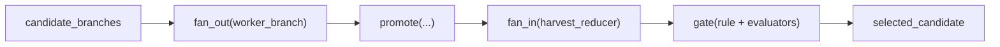
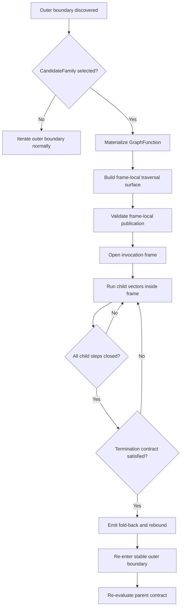

# GTL Technical Guide

**Version**: current recursive-frame model

---

## Introduction

GTL (**Genesis Topology Language**) is the declaration layer for governed work
graphs. ABG (**Abiogenesis**) is the runtime that interprets those declarations.

GTL is designed for a world where workers are not automatically trusted. That
matters most when the worker is an AI agent, but the language is broader than
"AI workflow." GTL makes the structure, contracts, alternatives, evaluation,
and governance of work explicit. ABG then executes that structure as
event-sourced runtime truth with replay, correction, lineage, and convergence.

The authored surface is Python. Modules are written with imports from the GTL
packages:

```python
from gtl.graph import Graph, Node, GraphVector, Context
from gtl.function_model import GraphFunction, RefinementBoundary, CandidateFamily
from gtl.operator_model import Operator, Evaluator, Rule, F_D, F_P, F_H
from gtl.work_model import Job, ContractRef, Role
from gtl.module_model import Module
```

The most important shift in the current model is this:

- `GraphFunction` is no longer best thought of as a graph-returning template
- it is a published reusable workflow program with an explicit outer contract
- recursive application is now understood as local frame execution over a
  stable outer boundary, not global macro expansion of inner vectors

## GTL In One Page

GTL models work as typed transitions between typed states inside a graph.

- A **Node** is a typed local locus such as `requirements`, `design`, `code`,
  or `unit_tests`.
- A **GraphVector** is one boundary from source state to target state. It may
  declare operators, evaluators, contexts, and an optional rule.
- A **Graph** is the one first-class structural type: typed states plus lawful
  boundaries between them.
- An **Operator** performs work.
- An **Evaluator** judges whether the target contract converged.
- A **GraphFunction** publishes a reusable workflow program with an outer
  interface.
- A **CandidateFamily** publishes multiple lawful graph-function alternatives
  over one outer contract.
- A **Module** publishes the complete declaration surface: graphs, functions,
  boundaries, families, jobs, roles, rules, and metadata.

The three regimes apply to both operators and evaluators:

- `F_D`: `Functor_Deterministic`
- `F_P`: `Functor_Probabilistic`
- `F_H`: `Functor_Human`

Those are not just labels. They define the ambiguity class of the work and the
intended escalation order:

`F_D -> F_P -> F_H`

If you need one sentence:

> GTL is a typed algebra for declaring workflow structure, structural
> alternatives, refinement, and recursion under explicit evaluation and
> governance.

## What Problem GTL Solves

Most workflow systems split the problem across too many surfaces:

- topology in diagrams or YAML
- execution logic in code
- acceptance criteria in prose
- approvals in process documents
- structural alternatives in tribal knowledge

GTL keeps those concerns in one typed model.

The deeper problem GTL addresses is trust.

Traditional workflow systems largely assume:

```text
task ran -> output exists -> proceed
```

That is acceptable when the worker is deterministic and trusted.

It breaks when the worker can be:

- probabilistic
- partially correct
- structurally creative
- plausible but wrong

So GTL starts from a different rule:

> work is not done because a worker ran  
> work is done because the declared contract converged

This makes the declaration reviewable before execution and the runtime auditable
during execution.

## Core Types

### Regimes: `F_D`, `F_P`, `F_H`

The three regimes classify the ambiguity class of work.

```python
class F_D(Regime):
    """Functor_Deterministic"""

class F_P(Regime):
    """Functor_Probabilistic"""

class F_H(Regime):
    """Functor_Human"""
```

In plain language:

- `F_D` is for deterministic execution or proof
- `F_P` is for bounded agentic or probabilistic work
- `F_H` is for irreducible human action or judgment

Examples:

- `F_D`: compiler, tests, schema validation, deterministic Spark transform
- `F_P`: generate a candidate design, assess a narrative, propose a mapping
- `F_H`: approval, adjudication, external business action

### `Context`

`Context` binds external information into the graph with a stable locator and
digest.

```python
bootloader = Context(
    name="bootloader",
    locator="workspace://build_tenants/abiogenesis/python/code/gtl_spec/GTL_BOOTLOADER.md",
    digest="sha256:" + "0" * 64,
)
```

Contexts are how declarations bind to external constraint surfaces without
turning the graph into opaque code.

### `Node`

`Node` is the typed local locus of workflow state.

```python
requirements = Node(
    name="requirements",
    schema="Requirements",
    markov=("complete", "traced"),
)
```

Important points:

- a node is not just a label
- it can declare a schema
- it can declare markov conditions that define reusable state assumptions

Examples of nodes:

- `intent`
- `requirements`
- `design`
- `code`
- `unit_tests`

### `GraphVector`

`GraphVector` is the internal adjacency record between nodes.

It carries:

- source node or source node tuple
- target node
- operators
- evaluators
- contexts
- optional rule

Example:

```python
v_design_code = GraphVector(
    name="design→code",
    source=design,
    target=code,
    operators=(claude_agent,),
    evaluators=(tests_pass, code_complete),
    contexts=(bootloader, design_adrs),
)
```

This is the main unit of workflow law.

### `Operator`

An operator performs effectful work.

Examples:

```python
spark_transform = Operator("spark_transform", F_D, "exec://spark-submit job.py")
claude_agent = Operator("claude_agent", F_P, "agent://claude/genesis")
human_gate = Operator("human_gate", F_H, "fh://single")
```

Operators are about transformation, not judgment.

### `Evaluator`

An evaluator decides whether the target contract converged.

Examples:

```python
tests_pass = Evaluator(
    "tests_pass",
    F_D,
    "pytest: zero failures, zero errors",
    binding="exec://python -m pytest -q",
)

code_complete = Evaluator(
    "code_complete",
    F_P,
    "Agent judges implementation completeness",
)

design_approved = Evaluator(
    "design_approved",
    F_H,
    "Human approves design before implementation",
)
```

Operators do work.
Evaluators judge work.

That separation is constitutional.

### `Rule`

A rule is a passive governance declaration attached to a boundary.

Examples:

```python
consensus_gate = Rule(
    name="consensus_gate",
    kind="consensus",
    config={"quorum": 3},
)
```

Rules define what must hold, not the runtime mechanism for making it hold.

### `Graph`

`Graph` is the one first-class structural type.

A graph contains:

- inputs
- outputs
- nodes
- vectors
- contexts
- rules
- effects
- tags

There is no separate "workflow" or "pipeline" type above graph.

### `GraphFunction`

`GraphFunction` is the main reusable compute abstraction in GTL.

The weak explanation is:

> reusable graph template

The stronger and current explanation is:

> reusable workflow program with an explicit outer contract and a lawful path
> to runtime realization

That is the important 1.1.1-era meaning.

### `RefinementBoundary`

`RefinementBoundary` publishes that a vector may be refined lawfully.

It says:

- this outer boundary exists
- there is a lawful refinement point here

### `CandidateFamily`

`CandidateFamily` publishes multiple lawful `GraphFunction` alternatives over
one outer contract.

Examples:

- fast profile
- careful profile
- tenant-specific profile
- jurisdiction-specific profile

The language publishes alternatives. It does not silently choose one.

### `Job`, `ContractRef`, and `Role`

These are the GTL work-declaration surfaces.

- `ContractRef` points a job at a semantic GTL contract
- `Job` declares durable semantic work
- `Role` declares the capability class needed to perform that work

These belong to GTL declaration, not ABG runtime implementation.

### `Module`

`Module` is the publication boundary.

It is the named container for:

- graphs
- graph functions
- refinement boundaries
- candidate families
- jobs
- roles
- metadata

If GTL is the language, `Module` is the published unit of that language.

### Domain model view



## Graph Algebra

GTL matters because workflow structure can be transformed lawfully.

The main algebraic operations are:

- `edge`
- `compose`
- `substitute`
- `recurse`
- `fan_out`
- `fan_in`
- `gate`
- `promote`

These are not convenience helpers. They are the legal ways to reuse, refine,
and lift workflow structure.

### `edge`

The primitive boundary constructor.

Think:

- create one lawful transformation boundary between two typed states

### `compose`

Sequential composition of graph functions.

```python
pipeline = compose(requirements_to_design, design_to_code)
```

This is only legal when:

- the output contract of the first satisfies the input contract of the second

`compose` preserves lawful chaining and outer interface coherence.

### `substitute`

Replace a coarse boundary with a finer graph while preserving the outer
contract.

Example:

```text
requirements -> production
```

can refine internally into:

```text
requirements -> design -> code -> tests -> production
```

without changing what the caller sees.

`substitute` is still a real GTL algebra operation.
What changed is the runtime interpretation of recursive application.

### `recurse`

Declare recursive or repeated graph-function application under:

- a declared termination contract
- a declared fold-back contract

The outer interface remains stable.
The recursion is explicit and bounded.

### `fan_out`

Apply a workflow program over a collection boundary.

Think:

- parallel lawful application over each element of a vectorized surface

### `fan_in`

Reduce a collection boundary back down.

Think:

- merge, reduce, rank, or select from a declared vector result

### `gate`

Attach explicit rule and evaluator obligations to a boundary.

Think:

- continuation is governed, not assumed

### `promote`

Lift one representational boundary into another.

Think:

- a declared representation change, not an implicit coercion

### Higher-order example



## ABG Engine Types

ABG is the runtime layer that interprets GTL declarations.

The main runtime shapes to understand are:

### `Scope`

The first-class command scope.

It binds:

- workspace
- module
- worker
- workflow identity
- filters such as work key or edge

### `Traversal`

One named traversal attempt over one GTL target boundary.

Its target may be:

- a `RefinementBoundary`
- a `CandidateFamily`
- a `GraphVector`

### `WorkSurface`

Immutable execution dossier carrying:

- events
- artifacts
- contexts
- findings
- attestations
- metadata

### `SelectionDecision`

Explicit, replayable candidate choice.

This is important because GTL publishes alternatives, but ABG must not invent
hidden strategy.

### `Worker`

Concrete runtime actor identity and capability binding.

### Recursive frame runtime

The current recursive model also uses invocation frames with:

- parent work identity
- frame-local vectors
- frame-local traversal surface
- child lineage keys
- fold-back and rebound events

This is the current lawful runtime interpretation of recursive graph execution.

## Event Stream

ABG is event-sourced.

That means runtime truth is derived from the event stream rather than from
hidden mutable orchestration state.

The event stream is the basis for:

- projection
- lineage
- convergence
- correction
- replay

Typical event families include:

- run lifecycle events
- workflow selection events
- frame events
- convergence events
- correction/reset events

For recursion specifically, the important events are:

- `workflow_selected`
- `frame_opened`
- `work_spawned`
- `frame_step_completed`
- `frame_foldback`
- `frame_rebound`
- `frame_closed`

This is what makes recursive execution inspectable and replayable.

### Recursive runtime flow



## Real Domain Example: SDLC

A familiar GTL domain is the software development lifecycle itself.

You might declare nodes such as:

- `intent`
- `requirements`
- `feature_decomp`
- `design`
- `code`
- `unit_tests`

and vectors such as:

- `intent→requirements`
- `requirements→feature_decomp`
- `feature_decomp→design`
- `design→code`
- `code↔unit_tests`

This is a good example because it shows:

- typed workflow states
- convergence conditions
- deterministic and probabilistic work mixed together
- structural refinement where needed

## Use Case Patterns

Several recurring patterns matter.

### Straight deterministic path

Use when:

- transformation logic is already known
- execution should be repeatable
- proof can be deterministic

### Probabilistic construction under deterministic evaluation

Use when:

- the worker constructs output probabilistically
- deterministic checks can still verify the result

This is common for code generation, mapping generation, and draft design work.

### Consensus or gated evaluation

Use when:

- several judgments must be aggregated
- policy requires quorum or consensus

This is where `gate(...)` and vectorized evaluation patterns matter.

### Recursive refinement

Use when:

- the outer contract is stable
- a chosen graph function needs internal decomposition
- inner workflow should remain local to that invocation

This is now the correct recursion pattern.

### Structural alternatives

Use when:

- the same outer contract has several lawful internal realizations

That is what `CandidateFamily` is for.

## GTL/ABG Boundary

The separation of concerns is strict.

| Responsibility | Owner |
|---|---|
| structure declaration | GTL |
| reusable workflow programs | GTL |
| lawful structural alternatives | GTL |
| operator/evaluator/rule declaration | GTL |
| semantic work declaration | GTL |
| event storage and replay | ABG |
| traversal execution | ABG |
| convergence protocol | ABG |
| correction/reset | ABG |
| provenance and runtime identity | ABG |

Important rule:

- GTL types have no runtime dependency
- ABG may import GTL declaration types
- GTL may not depend on ABG runtime types

## Validation Rules

The current model depends on fail-closed validation.

Important examples:

### Interface validity

Composition and refinement must respect declared input/output contracts.

### Published alternatives

If structural alternatives exist over a live boundary, they must be published
through `CandidateFamily`. Hidden alternatives are not lawful.

### Frame-local publication

Recursive frame-local alternatives must also fail closed.

The runtime now enforces this before frame opening.

### Traversal truth

Every live vector in a traversal surface must resolve to lawful published
traversal truth.

### Parent certification

Child closure alone must not certify the parent.

### Termination

Declared recursive termination must be satisfied before fold-back closure.

## Language Laws

The current GTL/ABG model depends on a small number of high-level laws.

### 1. Typed structure law

Work is declared as typed states and typed transitions.

### 2. Separation law

Operators perform work. Evaluators judge work.

### 3. Publication law

Structural alternatives must be published explicitly.

### 4. Outer-contract stability law

Refinement and recursion preserve the outer contract.

### 5. Local recursion law

Recursive application is invocation-local, not automatic module-global
topology mutation.

### 6. Parent re-evaluation law

Child closure does not certify the parent directly.

### 7. Engine-independence law

GTL declaration is pure and independent of runtime ownership.

## Runtime Boundary

The current runtime position is:

- the macro/globalization problems are resolved
- recursive locality is real
- frame-local publication fails closed
- declared recursion termination is operative
- open recursive frames block false convergence reporting

What is still future work:

- the final tail-loop recursive interpreter stack

The current runtime still uses the event-driven frame progression model rather
than the final tail-loop machine. That means the recursive semantics are now
correct for the current tranche, but the interpreter shape is not yet the final
one.

### Bottom line

If you need one technical summary:

> GTL declares typed workflow structure, reusable workflow programs, lawful
> alternatives, and recursive refinement. ABG interprets those declarations as
> event-sourced runtime truth. Recursive application now executes through local
> invocation frames over stable outer contracts rather than through global macro
> expansion.
