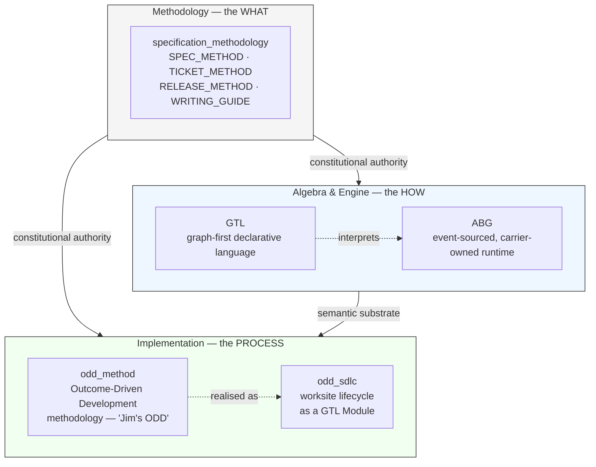
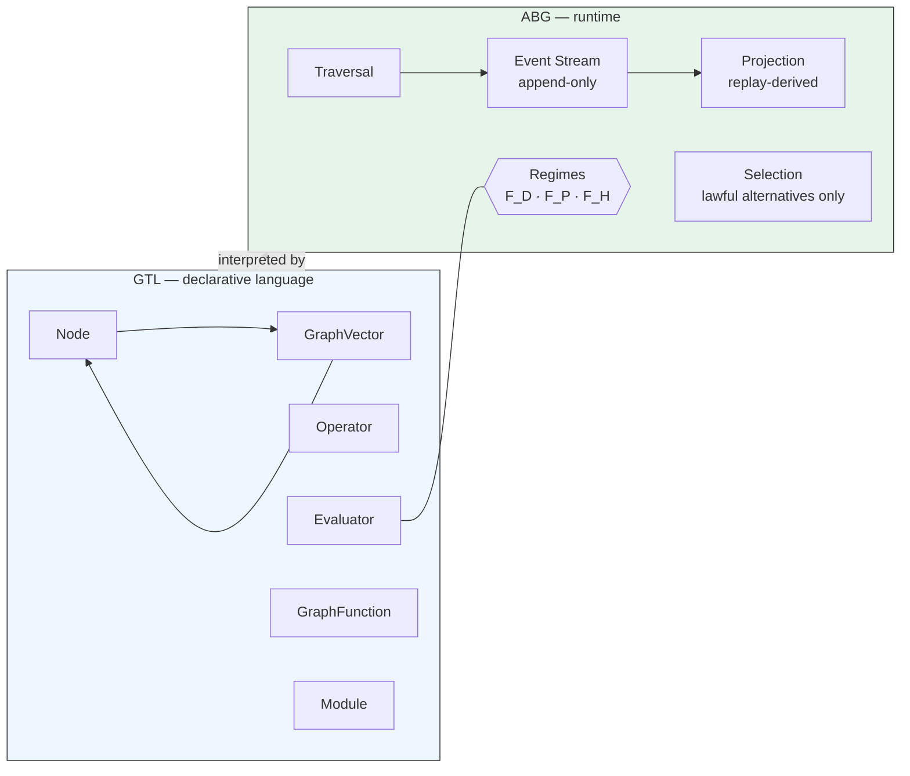
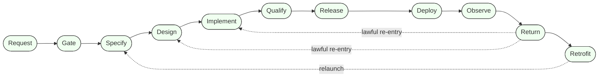

# The Genesis Vision

**Governing AI in Software Engineering: The Case for Spec-Driven Development**

*Dimitar Popov*

---

## 1. The Accountability Problem

Enterprise software rests on a working assumption: you can answer how a system arrived at its behaviour. Which requirement does this feature satisfy? Which control does this process enforce? When behaviour drifts, what specifically changed?

AI is now authoring significant portions of that software. The tooling has outpaced the governance. Systems reach production where the chain from business intent to delivered behaviour is undocumented, ambiguous, and unverifiable. Audit, incident response, regulatory review, and change management all depend on that chain being intact.

The problem is structural. A developer prompts a model; the model produces code; the developer reviews and accepts. The cycle runs faster than manual development, with the same informal handoffs as before. No mechanism verifies the chain survived, and no mechanism detects when it has broken.

Spec-Driven Development treats that gap as the thing to solve directly.

---

## 2. The Shadow IT Precedent

Enterprises already know this problem. Two decades of User Defined Applications — spreadsheets, Access databases, and the wider Shadow IT tail — embedded business-critical logic in artifacts outside any system of record. Pricing models, risk calculations, and compliance computations ended up on personal drives, in files with names like `FINAL_v3_REVISED.xlsx`, maintained by individuals who had since left the organisation. Auditors asked how a figure was arrived at; the answer took a forensic exercise.

The cleanup cost has been running for twenty years. Hundreds of millions spent retrofitting governance: frameworks applied after the fact, models migrated into controlled platforms, manual traceability reconstructed from email chains. The recurring pattern: artifacts produced outside governance accumulate faster than governance can catch up with them.

AI-generated code is the same pattern with no ceiling. A spreadsheet was bounded by what a spreadsheet could do. AI authors full systems — services, integrations, production logic. The developer using it can often no more account for what it produces than the spreadsheet owner could account for the fifth sheet of their model.

If AI-authored code reaches production through the same informal-handoff pattern that shadow IT did, every production system becomes shadow IT. The open question is whether it will be governed at construction or retrofitted at cost. The retrofit bill for the shadow IT era is already on the books. The retrofit bill for AI code, without structural governance, has no ceiling.

Spec-Driven Development is the mechanism for governing at construction.

---

## 3. The Central Claim

Specification is the governance mechanism, not a preface to it.

Each business requirement receives a stable identifier at the point of specification. That identifier appears in the feature that addresses it, the architectural decision that constrains it, the code that implements it, the test that validates it, and the production signal that monitors it. A coverage check confirms that every identifier is covered at every stage. Delivery does not advance while any identifier is unaccounted for.

Traceability becomes a property of the delivery record, not a document describing it. "Did we build everything we specified?" resolves to a pass/fail check rather than a status report. The mechanism replaces the work previously done by architects, analysts, tech leads, project managers, and testers acting as human enforcement of the same rule.

---

## 4. The Three Layers

This realisation of Spec-Driven Development is three independent bodies of work separated by design. Authority flows downward.

Each layer serves a distinct role. Each can be audited on its own terms. Each can evolve without destabilising the others. Replacing the implementation leaves the methodology intact. Replacing the engine invalidates the implementation while the methodology continues to stand. Replacing the methodology changes the meaning of "conforming" in the layers below.

The separation is load-bearing. A drift at one layer is recognisable as a drift at that layer. A language refinement does not retroactively invalidate past deliveries. A methodology clause is proved on the installed engine before it is accepted.

---

## 5. The Methodology Layer — `specification_methodology`

The methodology layer defines what Spec-Driven Development is before any software exists. Its central document, `SPEC_METHOD.md`, states the litmus tests every specification artifact must satisfy: live-surface immutability, trace closure, anti-drift, installed-dev proof.

Companion documents extend the constitution:

- `TICKET_METHOD.md` — how defects, regressions, and change proposals are recorded as first-class artifacts with admission criteria
- `RELEASE_METHOD.md` — how a set of artifacts becomes a release with stable identity and reproducible contents
- `WRITING_GUIDE.md` — how specification text is written so it remains usable to humans and machines across authorship changes

These documents describe what specifications must do to be trusted. They do not describe software. A project in Python, in Scala, or in a language that does not yet exist can be governed by the same methodology, because the methodology governs specifications, not code.

---

## 6. The Algebra and Engine — `abiogenesis`

Methodology states the rules. Something has to enforce them at runtime. That is `abiogenesis`, which ships two artifacts with deliberate separation.

### 6.1 GTL — the Graph Topology Language

GTL is the vocabulary in which specifications are written so a machine can interpret them. Its primitives are graph-first: `Graph`, `Node`, `GraphVector`, `Context`, `Operator`, `Evaluator`, `Rule`, `GraphFunction`, `RefinementBoundary`, `CandidateFamily`, `Job`, `Role`, `Module`.

Work is declared as a graph of lawful transitions between typed nodes. Convergence is declared as evaluators that attest whether a transition closes. Alternatives are declared as candidate families rather than hidden branches. The language is engine-agnostic; it specifies what a conforming interpreter must do without assuming which interpreter executes it.

### 6.2 ABG — the runtime

ABG is the canonical interpreter for GTL. Its runtime law is event-sourced and carrier-owned by construction:

- every state change is an append-only event
- runtime advancement is carried by typed data — `ExecutionBasis`, `AdvancementTransition`, `RegimeBindingSet` — rather than controller-local result dictionaries
- every artifact records what produced it and under what constraints
- the entire system state is derivable from the event stream
- the typed carrier is structurally required; if it is absent, the engine refuses to advance

Three evaluator regimes classify what counts as accepted work:

- `F_D` — deterministic checks (schemas, hashes, tests, coverage, and any program whose result is reproducible)
- `F_P` — probabilistic construction (the AI doing the work, under constraint)
- `F_H` — human approval (the judgment lane)

Three runtime rules keep the separation honest:

1. Deterministic truth closes first wherever it can.
2. AI-produced output is not constitutional truth. Acceptance requires deterministic evaluators to attest that it satisfies the specification.
3. Human approval does not override a deterministic failure. Deterministic observation may inform a probabilistic construction path without structurally blocking it.

A methodology statement like "every requirement must appear in a test before delivery advances" becomes, at runtime, an event the engine either emits or refuses to emit. The gate is a replayable fact in an append-only log, carried by typed data, attested by a named evaluator. The engine makes the methodology operational.

---

## 7. The ODD Layer — `odd_method` and `odd_sdlc`

The methodology and engine described in the previous sections are reusable across many delivery shapes. This project ships **Outcome-Driven Development** — within the project, "Jim's ODD" — as its domain methodology.

ODD has two parts at this layer. `odd_method` states the ODD constitution: the position that a project is an active worksite, not a one-shot pipeline that ends at release. `odd_sdlc` is the running implementation — a GTL Module that declares ODD's worksite lifecycle as graph functions executed by ABG. The method is the WHAT for this delivery line; the SDLC is the HOW, expressed in the same graph-first vocabulary the engine enforces.

A linear chain of stages (specify, design, build, test, ship) describes how work moves the first time. It does not describe how real systems are operated. Real systems return evidence after release, drift in production, surface gaps that were not visible until a user touched them, and require lawful re-entry rather than emergency patches. ODD treats the project as a worksite that cycles through request, gate, specify, design, implement, qualify, release, deploy, observe, return, retrofit, and relaunch. Any of those acts may legitimately re-open work upstream.

Four properties define what ODD delivers. Any AI-assisted delivery practice can be evaluated against them.

**Traceability.** Every requirement carries an identifier from the moment it is specified. The identifier is recorded in the design that addresses it, tagged in the code that implements it, tagged in the test that validates it, and bound to the production signal that monitors it. The chain from live behaviour to the requirement that authorised it can be read off the record — first delivery, fifth retrofit, audit two years later.

**Recoverability.** The worksite maintains a machine-readable closure register. Every live requirement is classified — realised, partially realised, planned, specified, missing — and the classification is rebuilt on every run from the event log. Unresolved requirements remain visible and binding across runs until they are realised, withdrawn, or superseded.

**Observability.** Disturbance is a first-class lawful act. When something the system was supposed to satisfy stops being satisfied — in development or production — the worksite emits an explicit observation, classifies it (defect, drift, ambiguity, missing capability), selects a re-entry layer, and resumes work from there. Observation, triage, route selection, and re-specification are distinct recorded acts.

**Governance over agents.** AI agents constructing, evaluating, and disambiguating work inside the worksite are constrained by the same rules as human contributors. They operate within declared graph functions, against declared evaluators, under the `F_D` / `F_P` / `F_H` regime contract. An agent does not choose what stage it is in, does not invent its own gate criteria, and does not override a deterministic failure. Every agent action is an event with provenance: which run, which call, which manifest, which evaluators it answered to.

"AI is doing the work" becomes a verifiable claim rather than a slogan. The agent's freedom is bounded by the graph it operates inside. The operator's freedom is bounded by the gates the methodology declares. The worksite's freedom is bounded by what the specification authorises. These boundaries are enforced by the engine's refusal to advance when they are violated.

`odd_sdlc` is therefore the implementation of `odd_method`, not a prescription baked into the engine. The lifecycle above is one decomposition of governed delivery — declared by `odd_method`, realised as a GTL Module on ABG. A change-management process, a regulatory-response workflow, or a research pipeline can be expressed as a different `*_method` and `*_sdlc` pair on the same engine and inherit the same four properties. Governance guarantees are carried by the layer below, not by stage names.

---

## 8. What This Changes for AI Risk

Consider a new graduate from a top institution. Raw intelligence is not knowledge of your organisation. Context, constraints, and defined expectations are what make their output useful. Their work is reviewed.

An LLM has read widely and knows many programming languages. It has no knowledge of any specific organisation's constraints, policies, or history. It produces confident output that looks correct even when it is wrong — because it has no way to distinguish its guesses from its knowledge.

Prompt-driven development is the equivalent of handing that graduate the keys and grading the output. What gets built depends on the developer's skill at articulating requirements to the model. That is a key-person dependency dressed up as productivity tooling.

Spec-Driven Development separates the specification (what the system must do) from the construction (how it is built). The specification is formal, versioned, and independent of any particular AI model or developer. The AI works against it and is accepted only when deterministic evaluators confirm its output satisfies the specification. When the model misunderstands, the model iterates; the specification does not change. The business requirement governs the AI; the AI does not govern the requirement.

### Automation that stays explainable

Spec-Driven Development refuses to let automation outrun the method. The graph-native constitution carries a **Manual Walkthrough Rule**: automation is lawful only when it preserves a walk a human could follow — identify the current state, the next lawful step, the authority surfaces in play, the produced artifact, and the gate that proves closure. If the team cannot describe the traversal manually, the automation is not yet method-safe.

This is a binding constitutional rule, not aspiration. It lives in `GRAPH_METHOD.md` and again as core law in `ODD_METHOD.md`. Its consequences are concrete: automation may render prompts, scaffold artifacts, select the next traversal step, run workers, collect evidence, and assess closure. It may not skip undeclared nodes, fabricate authority not present in the declared surfaces, collapse multiple constitutional transitions into one opaque step, or collapse the installed builder and the product under development into one authority surface during self-host work.

The effect is that AI construction remains auditable even when it is fast. "How did the system arrive at this behaviour?" is always answerable as a graph walk, because the rule forbids any other answer from closing lawfully.

---

## 9. What This Is and Is Not

Gates are automated where automation is sufficient and human where judgment is genuinely required. Review meetings and sign-off chains are not added for their own sake.

Skilled people remain central. The mechanism shifts what they do: specification and judgment rather than prompt iteration and rework.

AI construction runs at AI speed; the evaluators confirm. The delivery record is generated continuously during build, not produced afterward.

The outcome is a structural account of what AI is building, why it is building it, and whether the result matches what the organisation asked for.

---

## 10. What the Evidence Shows

The underlying pattern is not new. Decades of industry research already point in this direction.

The DORA research programme (*Accelerate*, Forsgren et al., 2018) tracked thousands of organisations over four years. Elite performers — fastest delivery, lowest failure rates — shared one characteristic: documented standards enforced by automated checks. Teams relying on human interpretation of informal standards did not appear in the elite category.

Google's internal engineering culture requires formal design documents before significant work. Internal analysis showed fewer post-deployment regressions on projects with upfront written specifications than on comparable projects without them.

ThoughtWorks has recommended Architectural Decision Records as a core practice since 2016, specifically because they address what happens when the people who made a decision leave. A written constraint applied uniformly outlasts any one person's memory.

The Specification by Example practice, documented by Gojko Adzic, showed that formalising requirements as testable examples reduced misunderstandings between business and development teams by measurable margins. Ambiguity in natural language disappears when the requirement must be stated precisely enough to be checked.

The pattern is consistent. Human consistency degrades with scale, time, and team turnover. Written constraints applied uniformly do not. A specification checked by a machine never has a bad day and never makes an exception because the deadline is close.

AI amplifies this dynamic. The case for formal specification was already strong when humans did the construction. When the constructor is an AI with no knowledge of the organisation, specification is the remaining mechanism that keeps construction accountable.

---

## 11. Competitive Position

AI removes scarcity in code construction. The bottleneck shifts to specification quality — the precision with which the business translates its requirements into something that can govern AI construction.

Teams with rigorous specification practice build faster, with fewer findings and cleaner audit trails, and run production systems that stay aligned with their specifications. They respond to change with lower operational risk and withstand audit examination without reconstruction effort.

Teams without that practice build faster than before, accumulate unverifiable behaviour faster than before, and carry a growing inventory of systems that cannot be fully accounted for.

The risk profile of the business becomes a structural question. A regulatory change or a new market opportunity both reduce to the same operation: update the specification. The AI rebuilds what needs rebuilding, the evaluators confirm conformance, the audit trail records exactly what changed and when. A single person with a clear specification and governed AI construction has the productive leverage that previously required a team.

The specification is the system. Change the specification, the system follows.

---

## 12. Current Status

This methodology is being developed using itself. One specification, multiple independent AI development agents working against it simultaneously, each producing a distinct implementation, each evaluated against the same formal criteria.

The process is the proof. A methodology that cannot govern its own construction is not a governance methodology.

---

## 13. Theoretical Foundations

This work is grounded in a sequence of formal papers.

**Constraint-Emergence Ontology: Reality as Self-Organising Constraint Network**
Popov, D. (2026). Zenodo. [https://zenodo.org/records/18682622](https://zenodo.org/records/18682622)

The foundational theory. Stable, governable structures — in physical systems, engineered systems, and organisations — emerge from constraint networks rather than top-down design. The pattern "encoded representation → constructor → constructed structure" recurs across substrates. Software development is one instance of this pattern. The specification is the encoded representation, the AI is the constructor, the delivered software is the constructed structure. Governance governs the constraint network, not the constructor.

**Emergent Reasoning in Large Language Models: Soft Unification, Constraint Mechanisms, and Computational Traversal**
Popov, D. (2026). Zenodo. [https://zenodo.org/records/18653552](https://zenodo.org/records/18653552)

The theoretical explanation for why AI models behave differently under formal constraints than under natural language prompts. LLMs perform reasoning by traversing a learned structure; hallucination — plausible but incorrect output — occurs when constraints are sparse or absent. This is the basis for the core claim of Spec-Driven Development: formal specification reduces the space within which the AI can produce non-conforming output.

**Programming LLM Reasoning: A Meta-Template for Constraint Specifications**
Popov, D. (2026). Zenodo. [https://zenodo.org/records/18653642](https://zenodo.org/records/18653642)

The applied companion. Describes the practical method for loading formal constraint specifications into an LLM such that it functions as an evaluator — testing whether outputs satisfy the specification — rather than as a generative system producing its best guess. The key distinction: *"The LLM does not execute the formal system — it predicts what execution would produce."* This is the direct theoretical basis for the evaluator framework used at every gate.

**The Political Operating System: Formal Constraint Specifications for Political Philosophy**
Popov, D. (2026). Zenodo. [https://zenodo.org/records/18661906](https://zenodo.org/records/18661906)

Evidence that the constraint-specification method generalises beyond software. The same technique — loading a formal specification into an LLM to produce governed, repeatable reasoning — has been applied to formalising political philosophy as an executable system. Software delivery governance is one domain of application of a broader approach.

---

## 14. What Changes at Each Delivery Stage

The table below shows what each stage of delivery looks like under three approaches: conventional development, AI prompt-driven development, and Spec-Driven Development. The question after each stage is the one an auditor, risk officer, or senior technical reviewer would ask.

### Requirements

| | Traditional | Prompt-Driven | Spec-Driven |
|---|---|---|---|
| **How it works** | Workshops, Word documents, Jira tickets, informal sign-off | Developer describes what they want in natural language; AI interprets | Every requirement has a unique identifier (`REQ-*`) defined once in a formal document, reviewed and baselined |
| **Who verifies completeness** | A human reviewer, informally | Nobody — the AI does not know what it does not know | An automated check confirms every requirement identifier is covered before delivery advances |
| **Audit answer: "What were you asked to build?"** | Find the right version of the right document | Reconstruct from conversation history | Read the baselined requirements file; every item has a unique key and a version |

### Feature Decomposition and Planning

| | Traditional | Prompt-Driven | Spec-Driven |
|---|---|---|---|
| **How it works** | Sprint planning, backlog grooming, estimation sessions | "Break this down into tasks" — AI suggests a plan | Requirements are formally decomposed into features; each feature declares which requirements it satisfies |
| **Completeness check** | Team judgment; gaps surface during build | No check — missing requirements are discovered late or not at all | Automated gate: every requirement identifier must be claimed by at least one feature. Delivery does not advance until the check passes |
| **Audit answer: "Did you plan for everything?"** | Difficult to prove without reconstructing meeting notes | Cannot prove | Show the coverage report: N requirements, all N covered, timestamp, approver |

The gate is enforced by the system. If any requirement is uncovered, the system reports the gap and does not advance. A human then either adds the missing feature or disputes the requirement. Either way, the decision is recorded.

### Architecture and Design

| | Traditional | Prompt-Driven | Spec-Driven |
|---|---|---|---|
| **How it works** | Architects document decisions in Confluence or Visio; developers interpret | "Design this system" — AI proposes an architecture with no knowledge of the organisation's constraints | Technology choices, integration patterns, and constraints are encoded as formal Architectural Decision Records (ADRs). Each ADR traces to the requirements it satisfies |
| **Technology constraints** | Documented in a wiki; may or may not be followed | The AI uses whatever it finds plausible | The constraint surface is loaded into every subsequent AI invocation as mandatory context. The AI cannot ignore it |
| **Audit answer: "Why was this architectural decision made?"** | Find the relevant Confluence page and hope it is current | Cannot answer | The ADR is numbered, dated, states the alternatives considered, the trade-offs, and the requirements it addresses |

This project carries over thirty architectural decision records, each governing a specific aspect of how the system behaves. That is the constraint surface — the formal definition of what conforming implementations must do.

### Development

| | Traditional | Prompt-Driven | Spec-Driven |
|---|---|---|---|
| **How it works** | Developers write code manually | AI generates code; developer reviews and iterates | AI generates code against the specification; automated and AI-assisted evaluators check conformance before the output is accepted |
| **Quality gate** | Code review, manual testing | Developer judgment | The work does not close until it passes a defined set of checks. A partial or non-conforming output does not advance |
| **Audit answer: "Which requirement does this code satisfy?"** | Read comments if they exist; ask the developer | Cannot reliably answer | Every code unit is tagged with the requirement identifier it implements. The tag is searchable and verifiable |

### Testing

| | Traditional | Prompt-Driven | Spec-Driven |
|---|---|---|---|
| **How it works** | QA team writes and runs test cases, often manually | "Did you test this?" — AI reports it tested; coverage is informal | Test cases are generated and tagged to the requirement they validate. Coverage is a measurable number, not an estimate |
| **Completeness** | Depends on QA team capacity and judgment | Unknown | Every requirement identifier must appear in at least one test. The same automated check that governs feature decomposition applies here |
| **Audit answer: "How do you know this requirement is validated?"** | Show the test case and hope the mapping is documented | Cannot answer | Show the test tagged `REQ-F-AUTH-001` and the record showing it passed |

### Deployment

| | Traditional | Prompt-Driven | Spec-Driven |
|---|---|---|---|
| **How it works** | Release process, change advisory board, manual verification | Build what the AI produced and deploy it | Every artifact deployed carries a fingerprint computed at the point it was accepted. The deployment record includes what was deployed, from which verified state, and which requirements it satisfies |
| **Change record** | Change management ticket, often completed after the fact | Informal | The delivery record is generated continuously during build. The deployment record is a projection of it, not a separate document |
| **Audit answer: "What exactly was deployed on this date?"** | Find the release notes and hope they are complete | Cannot answer | Read the delivery record: requirements satisfied, artifacts fingerprinted, evaluators that confirmed acceptance |

### Production Operations

| | Traditional | Prompt-Driven | Spec-Driven |
|---|---|---|---|
| **How it works** | Monitoring, alerting, incident response | Wait for something to break, then re-prompt a fix | The production system emits signals tagged to the same requirement identifiers used in development. Deviation from specified behaviour is detected automatically |
| **Drift detection** | Humans notice when something breaks | No mechanism | When a signal tagged `REQ-F-AUTH-001` shows anomalous behaviour, the system identifies which specified requirement is in drift and initiates a governed response |
| **Audit answer: "How do you know the live system still satisfies this requirement?"** | Manual review, penetration testing, periodic audit | Cannot answer | The production monitor is watching continuously, using the same requirement identifier that governed its construction |

---

## 15. What Requirements and ADRs Actually Look Like

A reasonable question from anyone familiar with AI tooling: how is a specification artifact different from sophisticated prompt engineering?

A prompt is a natural language instruction. The model interprets it under its own judgement of intent. Two similar prompts can produce meaningfully different output, and there is no formal definition of a correct response.

A constraint document specifies rules that must be satisfied, stated precisely enough that a system can check compliance automatically. The model works within a defined space and is evaluated against defined criteria.

The specification surface has two layers. **Requirements** (`REQ-*`) state what the system must make true: invariants, capabilities, guarantees, governance obligations. **Architectural Decision Records** (ADRs) state how a conforming implementation realises those truths: interfaces, boundaries, runtime mechanisms, transaction rules. Every ADR grounds itself in one or more requirements. Every code module grounds itself in one or more ADRs. The chain is traceable in both directions.

The fragments below are drawn from this project's active specification. Over thirty constraint documents govern specific aspects of how conforming implementations must behave.

---

### Fragment 1 — A Requirement (`REQ-R-ABG3-EVENTS`)

Requirements are the WHAT. They state invariants, capabilities, and governance obligations the system must satisfy. Each has a stable identifier, a category, and a status.

> **`REQ-R-ABG3-EVENTS` — Event Emission Contract**
>
> **Status:** Active · **Category:** Constraint / Guarantee
>
> `emit()` is the one lawful write boundary into runtime truth. Every runtime state change must be an append-only event. Projections are replay-derived. Correction shadows stale truth; it does not erase history.
>
> **Acceptance criteria:**
>
> - no production code path writes runtime state except via `emit()`
> - every event is recorded with full provenance — run, call, manifest, evaluator
> - the entire system state is reconstructable from the event stream alone

A requirement states the rule the implementation must satisfy. It does not prescribe the mechanism. Design chooses the mechanism; the next fragments show how.

---

### Fragment 2 — The Derivation Constraint (ADR-S-004)

This ADR governs how documents relate to each other in the specification hierarchy. When a design document conflicts with a requirement, this rule determines which is wrong.

> **A downstream document may not contradict an upstream document.**
>
> In any conflict, the upstream document is authoritative. The downstream document is wrong and must be fixed.
>
> Downstream documents may not:
>
> - Contradict an upstream statement
> - Relax an upstream constraint
> - Silently omit an upstream requirement (omission = violation)
> - Redefine upstream terminology with a different meaning

The rejected-alternatives section records why *"downstream can override with justification"* was excluded:

> *The downstream document will always have a rationale. "Justification" becomes a bypass.*

A governance rule that can be argued around is not a governance rule.

---

### Fragment 3 — The Completeness Gate (ADR-S-013)

This ADR governs what it means for the feature planning stage to be complete. The formal convergence rule is the condition that must be satisfied before delivery advances to architecture.

> **The feature decomposition stage converges when, and only when, two conditions are both true:**
>
> **Condition A — Coverage Check (automated):** Every requirement identifier defined in the requirements document must appear in at least one feature's declared scope. This is computed automatically. If any requirement is missing, the check fails. There is no partial credit.
>
> **Condition B — Human Approval:** A human reviewer must explicitly confirm that the feature list is the correct decomposition of the requirements — complete, correctly structured, correctly ordered, and correctly scoped to the agreed delivery boundary.
>
> *Coverage alone is not sufficient. A feature list can cover every requirement and still be the wrong plan — wrong granularity, wrong sequencing, wrong MVP boundary. The automated check gates the human review. The human review gates advancement.*

This rule applies uniformly. Every implementation, every team, every delivery. No version of this methodology permits a project to skip the coverage check because the team felt confident. The gate is the methodology.

---

### Fragment 4 — The Execution Contract (ADR-S-015)

This ADR governs how work is recorded at runtime. Every stage transition is treated as a transaction.

> **Every stage transition opens a transaction when it begins and closes it only when work is confirmed complete. The closing record is the commit point.**
>
> | Phase | What is recorded | Meaning |
> |---|---|---|
> | Begin | `START` — input artifacts fingerprinted | Work has commenced; prior state is on record |
> | Execute | Nothing | Work is in progress; no commitment yet |
> | Accept | `COMPLETE` — output artifacts fingerprinted | Work is confirmed; this is the point of record |
> | Reject | `FAIL` or `ABORT` | Prior state remains authoritative |
>
> *An artifact written to the system without a corresponding `COMPLETE` record is uncommitted work. On restart, the system detects the open transaction, compares the current state of every affected file against the fingerprints recorded at the start, and flags any file that was modified but never committed. This is how the system detects crashes, partial writes, and incomplete AI outputs.*

The fingerprint is a SHA-256 hash. Change a single character, the hash changes. Applying it to every artifact at every stage is what makes the audit trail mathematically verifiable rather than document-based.

---

### Fragment 5 — One Agent for All Stages (ADR-008)

This ADR governs how the AI construction mechanism is implemented. The methodology defines one operation applied at every stage. The implementation must reflect that.

> **The agent has no hard-coded knowledge of "stages". It reads:**
>
> - The edge type (which transition is being traversed)
> - The evaluator configuration (which checks constitute convergence)
> - The context (which constraints bound construction)
> - The asset type schema (what the output must satisfy)
>
> *Using multiple stage-specific agents would be the implementation contradicting its own theory.*

New stages require only a configuration file. No new code. No new agent. The methodology is extensible by design, not by accident.

---

### Fragment 6 — Design That Monitors Itself (ADR-016)

This ADR governs how architectural decisions are maintained over time. Every technology choice implies tolerances. Every tolerance is something the system can monitor.

> **When a tolerance is breached, the pipeline fires:**
>
> Tolerance breached → monitor detects → severity classified →
>
> - **Zero ambiguity:** log and auto-tune
> - **Bounded:** generate optimisation intent — "reduce overhead"
> - **Persistent:** propose rebinding — "replace this technology with X"
>
> *A persistent breach means the binding decision itself should be revisited. The ADR that made the choice becomes the target of a new design iteration. The methodology does not just maintain the system — it evolves the design.*

Systems stay aligned to their specifications without scheduled rewrites. Architectural fitness is monitored continuously and the binding decisions themselves are subject to the same governance as the code they authorise.

---

### Fragment 7 — Zoom as a Model Concept (ADR-S-017)

This ADR resolves what happens when the delivery unit changes scale — from a single AI invocation to a full feature, from a feature to a programme.

> **Spawn is zoom in. Fold-back is zoom out.**
>
> When a step discovers sub-structure requiring its own convergence loop, it spawns a child unit of work. The child is structurally identical to the parent — same format, same event schema, same artifact versioning — but at finer grain.
>
> The parent graph still sees the original transition as one step. The zoomed view sees the internal structure. Both are valid simultaneously.
>
> *Spawn and fold-back are not special mechanisms added to support recursion. They are the natural expression of zoom in/out in a model that is scale-invariant by construction.*

Scale-invariance means the same governance rules apply whether the unit of work is a single check or an entire programme. There is no "project-level process" that bypasses the methodology. The methodology is the process at every level.

---

### Fragment 8 — The Runtime Truth Rule (GTL Bootloader `3.2.0`)

This is the current runtime-law rule that constrains any agent operating inside the engine. It closes the chain: the requirement from Fragment 1 states the rule, the ADRs ratify the realization, and this bootloader clause is what the engine enforces at runtime.

> **Runtime advancement truth is carried by `ExecutionBasis` and `AdvancementTransition`, not by controller-local result shapes.**
>
> Regime truth is carried by `RegimeBindingSet`. `F_D`, `F_P`, and `F_H` consumers pattern-match the algebra instead of reinterpreting evaluator lists. `emit()` is the only lawful write path into runtime truth. Projection is replay-derived.

This is a structural constraint. The engine enforces it by refusing to advance when it is violated. Removing the typed carrier breaks the build. The chain is closed end-to-end: `REQ-R-ABG3-EVENTS` states the invariant, `ADR-034` and `ADR-036` ratify the realization, the runtime refuses to execute if the invariant is broken.

---

These eight fragments are drawn from over thirty constraint documents in the active specification. Each was written, reviewed, and recorded before the corresponding code was produced. Each traces explicitly — upward to the requirements it satisfies, downward to the code modules that realise it — through `Implements:` and `Derives from:` linkage in the document headers.

That is the difference between a prompt and a specification.
