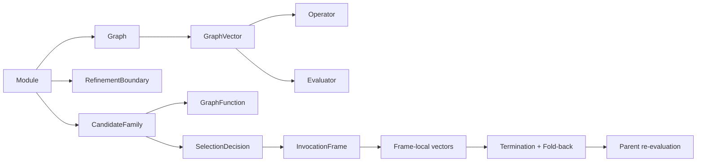
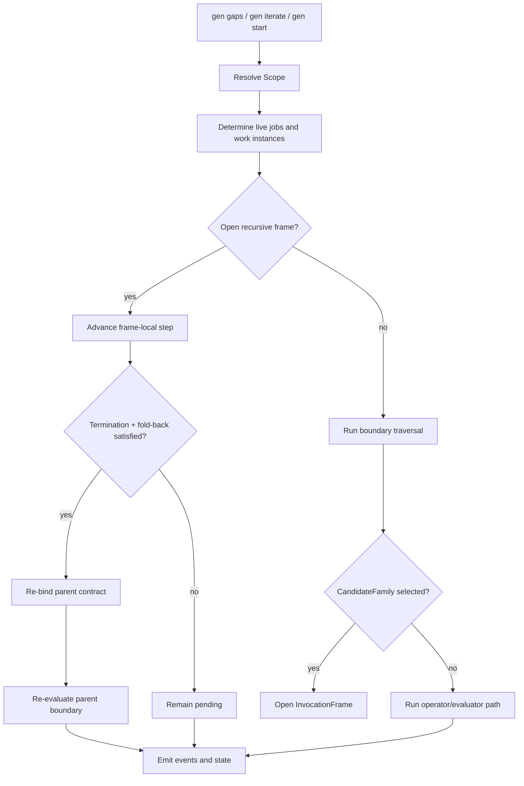

# Abiogenesis User Guide

**Status**: current recursive-frame model
**Audience**: users authoring or running GTL/ABG modules today
**Purpose**: explain how to use the current GTL 2.x / ABG 2.x surface without
carrying stale V1 terminology or deleted macro-style refinement behavior

---

## 1. What Abiogenesis Is

Abiogenesis is the **ABG** runtime for **GTL**.

- **GTL** means **Genesis Topology Language**
- **ABG** means **Abiogenesis**

GTL declares workflow law. ABG executes it.

The clean split is:

- **GTL** owns:
  - typed workflow state
  - typed transformation boundaries
  - evaluation contracts
  - structural alternatives
  - recursion declarations
  - publication surfaces
- **ABG** owns:
  - event-sourced execution
  - traversal
  - selection application
  - recursive frame progression
  - convergence
  - correction/reset
  - lineage and provenance

The current build is not the old "task ran, so proceed" model. It is built for
workflows where the worker may be deterministic, probabilistic, or human, and
where output existence alone is not enough to claim success.

The single most important rule is:

> work is not done because a worker ran  
> work is done because the declared contract converged

The current runtime also uses the corrected recursion model:

- `GraphFunction` selection does **not** rewrite the published module
- the outer contract stays stable
- ABG opens a local invocation frame
- child vectors stay frame-local
- termination and fold-back must be satisfied before the parent boundary closes

That is the big semantic difference from the earlier macro-style path.

---

## 2. Core Concepts

### GTL declaration types

The authored surface is Python:

```python
from gtl.graph import Graph, Node, GraphVector, Context
from gtl.function_model import GraphFunction, RefinementBoundary, CandidateFamily
from gtl.operator_model import Operator, Evaluator, Rule, F_D, F_P, F_H
from gtl.work_model import ContractRef, Job, Role
from gtl.module_model import Module
```

The main GTL concepts are:

- `Node`
  - a typed local locus such as `requirements`, `design`, `code`
- `GraphVector`
  - one typed transformation boundary between nodes
  - carries operators, evaluators, contexts, and optional rule
- `Graph`
  - the structural object built from nodes and vectors
- `GraphFunction`
  - a reusable workflow program with an explicit outer contract
- `RefinementBoundary`
  - a published declaration that a vector may be refined
- `CandidateFamily`
  - a published set of lawful `GraphFunction` alternatives over one outer contract
- `Module`
  - the publication boundary for graphs, graph functions, boundaries, families,
    jobs, roles, rules, and metadata

### ABG runtime types

The main runtime concepts are:

- `Scope`
  - the authoritative command scope
- `Traversal`
  - one named traversal attempt over one lawful target
- `WorkSurface`
  - the immutable execution dossier for a run
- `SelectionDecision`
  - the explicit, replayable choice of one `GraphFunction` from a `CandidateFamily`
- `InvocationFrame`
  - the local recursive execution frame opened by selection
- `EvaluatorOutcome`
  - one normalized evaluator result
- `ConvergenceResult`
  - the aggregate convergence truth for a boundary
- `Worker`
  - the concrete runtime actor identity

### The three regimes

Both operators and evaluators live in one of three regimes:

| Regime | Expansion | Typical role |
|---|---|---|
| `F_D` | `Functor_Deterministic` | deterministic transform or proof |
| `F_P` | `Functor_Probabilistic` | agentic or probabilistic work/judgment |
| `F_H` | `Functor_Human` | irreducible human action or approval |

Examples:

- `F_D`
  - compile
  - run tests
  - run a deterministic Spark transform
  - validate schema or trace tags
- `F_P`
  - generate a candidate design
  - propose a mapping
  - assess a narrative or artifact
- `F_H`
  - approve a decision
  - perform an external business action
  - sign off a control gate

The intended escalation order is:

`F_D -> F_P -> F_H`

That means:

1. prove what can be proved deterministically
2. use bounded probabilistic work where needed
3. involve a human where irreducible judgment remains

### Operators and evaluators

This distinction matters:

- **Operators** do work
- **Evaluators** judge whether the boundary converged

An operator may be `F_D`, `F_P`, or `F_H`.
An evaluator may also be `F_D`, `F_P`, or `F_H`.

They share the same regime lattice, but they do not play the same semantic role.

### Selection and recursion

If one outer boundary has multiple lawful internal realizations:

- publish a `CandidateFamily`
- choose one alternative through a `SelectionDecision`
- open an `InvocationFrame`
- execute the chosen inner graph locally
- satisfy termination and fold-back
- re-bind the result into the parent contract
- re-evaluate the parent boundary

The important point is:

- recursive execution is now **local**
- the published module surface remains stable
- child vectors do not become peer global vectors



---

## 3. Install and Run

There are two common ways to run ABG:

### Run from source

From the repo root, the portable source invocation is:

```bash
cd /path/to/abiogenesis
PYTHONPATH=build_tenants/abiogenesis/python/code python -m genesis --help
```

Examples:

```bash
PYTHONPATH=build_tenants/abiogenesis/python/code python -m genesis gaps --workspace .
PYTHONPATH=build_tenants/abiogenesis/python/code python -m genesis iterate --workspace .
PYTHONPATH=build_tenants/abiogenesis/python/code python -m genesis start --workspace . --auto
```

This is the best choice when developing ABG itself.

### Install the kernel into another workspace

Use the kernel installer:

```bash
python build_tenants/abiogenesis/python/code/gen-install.py --target /path/to/project
```

That produces a self-contained kernel under:

```text
/path/to/project/.genesis/
├── genesis/
├── gtl/
└── genesis.yml
```

Then run the installed kernel with:

```bash
cd /path/to/project
PYTHONPATH=.genesis python -m genesis gaps --workspace .
```

Some domains may also expose wrapper commands, but `python -m genesis` is the
portable form this guide assumes.

### CLI commands in the current build

The live CLI commands are:

- `start`
- `iterate`
- `gaps`
- `assess-result`
- `emit-event`
- `check-tags`
- `check-req-coverage`
- `check-impl-coverage`
- `check-validates-coverage`
- `check-bootloader-consistency`

High-level meanings:

- `gaps`
  - deterministic pre-bind over scoped jobs
  - no `F_P` dispatch
  - reports residual delta
- `iterate`
  - advances exactly one runtime step
  - may dispatch work, open a frame, or progress an existing frame
- `start --auto`
  - loops until convergence or a blocking condition is reached
- `assess-result`
  - ingests an `F_P` result JSON and emits evaluator-fact `assessed` events through the kernel emission boundary
- `emit-event`
  - appends one event to the event stream

### Exit codes for engine commands

`start` and `iterate` currently use:

- `0`
  - converged or nothing to do
- `2`
  - `fp_dispatch`
- `3`
  - `fh_gate_pending`
- `4`
  - `fd_gap`
- `5`
  - auto-loop hit max iterations

---

## 4. First Session

The shortest useful first session is:

```bash
# 1. inspect deterministic residual work
PYTHONPATH=build_tenants/abiogenesis/python/code python -m genesis gaps --workspace .

# 2. advance one step
PYTHONPATH=build_tenants/abiogenesis/python/code python -m genesis iterate --workspace .

# 3. or let the engine loop until blocked
PYTHONPATH=build_tenants/abiogenesis/python/code python -m genesis start --workspace . --auto
```

If the workspace is not yet installed but your module is importable, you can
override the module directly:

```bash
PYTHONPATH=build_tenants/abiogenesis/python/code python -m genesis gaps \
  --workspace . \
  --module my_domain.spec:module
```

### What the commands do

`gaps`

- resolves a `Scope`
- derives the live job set
- runs deterministic binding only
- returns delta summaries and failing evaluators
- emits `edge_converged` certificates when a scoped edge is freshly proven at delta 0

`iterate`

- resolves the first unconverged work instance in scope
- advances open recursive frames before selecting new work
- builds one `Traversal`
- runs `traverse()` exactly once

`start`

- repeatedly runs the single-step engine
- stops when:
  - converged
  - nothing to do
  - blocked on `F_P`
  - blocked on `F_H`
  - blocked on deterministic failure
  - max iterations reached

### What "blocked" means

Typical blocking reasons are:

- `fp_dispatch`
  - probabilistic work is required
  - inspect `.ai-workspace/fp_manifests/` and later ingest a result with `assess-result`
- `fh_gate`
  - human evaluation or approval is required
- `fd_gap`
  - deterministic truth is still failing

### What recursion looks like from the CLI

You do not manually "enter a frame" from the CLI.

If the runtime encounters a selected recursive alternative:

- ABG opens a frame
- the frame becomes part of live runtime truth
- frame-local work is advanced by later `iterate` / `start` calls
- the parent boundary stays open until termination and fold-back succeed

From the user side, that feels like the normal engine loop, but the important
semantic fact is that the parent module surface does not change.

---

## 5. Runtime Contract and Config Resolution

The runtime contract chain is how ABG knows what module and workflow to run.

### Resolution model

There are really two related resolutions:

1. **config discovery**
2. **module selection**

#### Config discovery

ABG always starts from:

```text
.genesis/genesis.yml
```

If that file contains:

```yaml
runtime_contract: path/to/domain/genesis.yml
```

then the referenced file becomes the authoritative domain runtime contract.

So config discovery is:

1. read `.genesis/genesis.yml`
2. if it contains `runtime_contract`, read that file instead
3. use the resolved config for `pythonpath`, `module`, `worker`, `active_workflow`, and `workflow_root`

#### Module selection

Module resolution is:

1. `--module MODULE:VAR` if supplied
2. otherwise `module:` from the resolved runtime contract
3. otherwise fail closed

So `--module` overrides only the module binding. The rest of the runtime
contract still matters.

### Important runtime-contract fields

The current CLI reads these fields when present:

- `module`
  - import reference to the GTL `Module`
- `pythonpath`
  - extra import roots inserted before module import
- `worker`
  - optional explicit `Worker`
- `active_workflow`
  - active workflow JSON used in workflow-version/provenance resolution
- `workflow_root`
  - base directory for workflow manifests
- `runtime_build`
- `runtime_backend`
- `runtime_authority_ref`

### Minimal kernel config

The kernel installer writes only a bootstrap file:

```yaml
# Genesis kernel default — written by gen-install.py
# runtime_contract: path/to/domain/genesis.yml
```

That is deliberate. The kernel does not know your domain module.

### Example domain runtime contract

```yaml
module: my_domain.spec:module
pythonpath:
  - build_tenants/my_domain/python/code
worker: my_domain.runtime:worker
active_workflow: .genesis/workflows/my_domain/default/v0_1_0/active-workflow.json
workflow_root: .genesis/workflows
runtime_build: codex
runtime_backend: codex_cli
runtime_authority_ref: runtime://role-dispatch
```

### Practical rule

If the engine cannot find a module, the fix is not inside GTL algebra. It is
usually one of:

- the runtime contract is missing
- `pythonpath` is wrong
- the `module:` import ref is wrong
- the workspace was only kernel-installed and not domain-installed

---

## 6. Writing a Minimal GTL Module

The authored unit is `Module`, not the older `Package`.

Here is a minimal current example:

```python
from gtl.graph import Graph, Node, GraphVector
from gtl.algebra import deferred_refinement
from gtl.module_model import Module
from gtl.operator_model import Operator, Evaluator, F_D, F_P
from gtl.work_model import ContractRef, Job, Role


requirements = Node(name="requirements")
design = Node(name="design")

agent = Operator(
    "claude_agent",
    F_P,
    "agent://claude/genesis",
)

shape_valid = Evaluator(
    "design_shape_valid",
    F_D,
    "design artifact matches the required structural standard",
    binding="exec://python checks/check_design.py",
)

quality_ok = Evaluator(
    "design_quality",
    F_P,
    "agent judges whether the design is coherent and complete",
)

vector = GraphVector(
    name="requirements→design",
    source=requirements,
    target=design,
    operators=(agent,),
    evaluators=(shape_valid, quality_ok),
)

graph = Graph(
    name="mini_flow",
    inputs=(requirements,),
    outputs=(design,),
    nodes=(requirements, design),
    vectors=(vector,),
)

designer = Role(name="designer")

job = Job(
    name="requirements→design",
    contracts=(ContractRef(kind="graph_vector", target_id=vector.id),),
    roles=(designer,),
)

boundary = deferred_refinement(
    "requirements→design",
    inputs=(requirements,),
    outputs=(design,),
)

module = Module(
    name="mini_domain",
    graphs=(graph,),
    refinement_boundaries=(boundary,),
    jobs=(job,),
    roles=(designer,),
)
```

### Rules that matter in the current runtime

- every live `GraphVector` must have a lawful traversal witness
  - `RefinementBoundary` or `CandidateFamily`
- `Module` is a declaration container
  - runtime validation happens in ABG, not by magic inside `Module`
- `Operator` and `Evaluator` are different things
  - do not use evaluators as disguised operators
- if you want structural alternatives, publish a `CandidateFamily`
- if you want recursion, use `recurse(...)` with both:
  - a termination evaluator
  - a declared fold-back rule

### A note on recursion

At the GTL layer, recursion is declared, not hand-coded in an outer loop.

Conceptually:

```python
recursive = recurse(
    my_graph_function,
    termination=done_evaluator,
    foldback={"binding": "foldback://parent"},
)
```

At runtime, ABG interprets that by opening a frame and advancing the child work
locally until termination and fold-back allow the parent boundary to be
re-evaluated.

---

## 7. Installing Into Another Project

Use the kernel installer when you want a self-contained ABG runtime under a
target workspace.

```bash
python build_tenants/abiogenesis/python/code/gen-install.py --target /path/to/project
```

### What the current installer does

It installs the kernel only:

1. copies engine modules into `<target>/.genesis/genesis/`
2. copies GTL modules into `<target>/.genesis/gtl/`
3. writes `<target>/.genesis/genesis.yml` if it does not already exist
4. ensures `<target>/.ai-workspace/runtime/` exists
5. injects the GTL bootloader block into `<target>/CLAUDE.md`
6. emits `genesis_installed` into `<target>/.ai-workspace/events/events.jsonl`

### What it does not do

The kernel installer does **not**:

- create your domain module
- bind your domain `module:` automatically
- scaffold your domain package layout
- install your domain worker
- decide your workflow root

Those are domain-installer responsibilities.

### Verify an install

```bash
python build_tenants/abiogenesis/python/code/gen-install.py \
  --target /path/to/project \
  --verify
```

### How to invoke the installed kernel

```bash
cd /path/to/project
PYTHONPATH=.genesis python -m genesis gaps --workspace .
```

That is the invocation form the kernel installer is designed around.

---

## 8. Workspace Layout

ABG uses `.ai-workspace/` as runtime evidence and coordination territory.

Typical layout:

```text
.ai-workspace/
├── events/
│   └── events.jsonl
├── fp_manifests/
├── fp_results/
├── features/
│   ├── active/
│   └── completed/
├── reviews/
│   ├── pending/
│   └── proxy-log/
├── comments/
├── agents/
└── runtime/
```

### The important distinction

- `genesis_installed`
  - emitted by the installer
- `workspace_bootstrap()`
  - ensures runtime directories exist and binds the event stream

The event log is the authoritative runtime record:

```text
.ai-workspace/events/events.jsonl
```

Do not edit it manually.

### Typical event families

- installer/runtime
  - `genesis_installed`
  - `run_bound`
  - `run_started`
  - `edge_started`
- convergence
  - `found`
  - `fp_dispatched`
  - `assessed`
  - `edge_converged`
  - `fh_gate_pending`
- selection/recursion
  - `workflow_selected`
  - `frame_opened`
  - `frame_step_started`
  - `frame_foldback`
  - `frame_rebound`
  - `frame_closed`
- correction
  - `reset`

`assessed` is an evaluator fact event, not the successful terminal run-state
name. In the cutover model, successful terminal run truth projects to
`assessed_pass`, while failed F_P assessment projects to failed run truth with
`failure_class=certification_failure`.

### What recursion means for workspace truth

Recursive execution does not create a rewritten global module on disk.

Instead:

- the published module stays stable
- frame-local traversal state is carried in runtime truth
- progression is visible through events and projections

That is why the event log matters so much in the current architecture.

---

## 9. The Working Loop

The normal operator loop is:

```bash
# 1. inspect residual deterministic truth
PYTHONPATH=build_tenants/abiogenesis/python/code python -m genesis gaps --workspace .

# 2. advance one runtime step
PYTHONPATH=build_tenants/abiogenesis/python/code python -m genesis iterate --workspace .

# 3. or keep going until blocked
PYTHONPATH=build_tenants/abiogenesis/python/code python -m genesis start --workspace . --auto

# 4. inspect evidence
tail -20 .ai-workspace/events/events.jsonl
```

### What happens inside that loop



### The practical meanings

`gaps`

- deterministic view of residual work
- no `F_P` dispatch
- no hidden progression

`iterate`

- one runtime step only
- may:
  - traverse a normal boundary
  - dispatch `F_P`
  - surface an `F_H` gate
  - open a recursive frame
  - advance an existing frame

`start --auto`

- repeats the single-step engine
- stops when it reaches a stable blocked or converged state

### Blocking reasons

The common ones are:

- `fp_dispatch`
  - an `F_P` actor is required
- `fh_gate`
  - an `F_H` evaluator must act
- `fd_gap`
  - deterministic truth is still failing

### Convergence and open frames

One important current rule:

- open recursive frames block final convergence

So a workspace is not really converged just because every visible outer edge
looks satisfied if there is still open frame-local work.

---

## 10. Traceability and Checks

The current build includes traceability utilities:

```bash
PYTHONPATH=build_tenants/abiogenesis/python/code python -m genesis check-tags \
  --type implements \
  --path build_tenants/abiogenesis/python/code

PYTHONPATH=build_tenants/abiogenesis/python/code python -m genesis check-tags \
  --type validates \
  --path build_tenants/abiogenesis/python/test_env/tests

PYTHONPATH=build_tenants/abiogenesis/python/code python -m genesis check-req-coverage \
  --package gtl_spec.packages.abiogenesis:module \
  --features .ai-workspace/features

PYTHONPATH=build_tenants/abiogenesis/python/code python -m genesis check-impl-coverage \
  --package gtl_spec.packages.abiogenesis:module \
  --path build_tenants/abiogenesis/python/code

PYTHONPATH=build_tenants/abiogenesis/python/code python -m genesis check-validates-coverage \
  --package gtl_spec.packages.abiogenesis:module \
  --path build_tenants/abiogenesis/python/test_env/tests
```

Use these to verify:

- `Implements:` tags exist in code
- `Validates:` tags exist in tests
- published requirements are covered by feature vectors
- implementation and validation surfaces match the declared requirement set

The event log and these checks together are what make the runtime auditable.

---

## 11. Shipped Examples

Useful examples in this repo:

- current main GTL module:
  - `/Users/jim/src/apps/abiogenesis/build_tenants/abiogenesis/python/code/gtl_spec/packages/abiogenesis.py`
- smaller project-style module:
  - `/Users/jim/src/apps/abiogenesis/build_tenants/abiogenesis/python/code/gtl_spec/packages/project_package.py`
- GTL bootloader:
  - `/Users/jim/src/apps/abiogenesis/build_tenants/abiogenesis/python/code/gtl_spec/GTL_BOOTLOADER.md`
- interface/design surfaces:
  - `/Users/jim/src/apps/abiogenesis/build_tenants/abiogenesis/python/design/GTL_2_INTERFACE_CONTRACTS.md`
  - `/Users/jim/src/apps/abiogenesis/build_tenants/abiogenesis/python/design/GTL_2_MODULE_DESIGN.md`

The most useful tests for understanding the current model are:

- GTL algebra and composition:
  - `/Users/jim/src/apps/abiogenesis/build_tenants/abiogenesis/python/test_env/tests/test_m01_gtl_core_integration.py`
- recursive runtime semantics:
  - `/Users/jim/src/apps/abiogenesis/build_tenants/abiogenesis/python/test_env/tests/test_m03_engine_kernel_integration.py`
- broader usecase flows:
  - `/Users/jim/src/apps/abiogenesis/build_tenants/abiogenesis/python/test_env/tests/test_v2_usecases_u1_u4.py`

If you want a realistic current module, start with `abiogenesis.py`, not older
V1-era surfaces.

---

## 12. Current Limitations

- The current runtime has corrected recursive locality and removed the old
  macro-style global rewrite behavior, but the final tail-loop recursive
  interpreter is still future work.
- `F_H` is supported, but the heaviest qualification work still sits around
  `F_D` and `F_P`.
- The kernel installer is intentionally minimal.
  - domain installers still own domain runtime contracts and domain package layout
- The portable invocation is still source-first or installed-kernel-first.
  - this guide assumes `python -m genesis`, not a universal packaged `gen` binary
- Older prose may still mention `Asset`, `Edge`, `Package`, or hidden zoom-style
  refinement.
  - prefer current code, current tests, and the current docs over older V1 text

When in doubt, trust this order:

1. current requirements
2. current accepted design
3. current code
4. current tests
5. older prose
