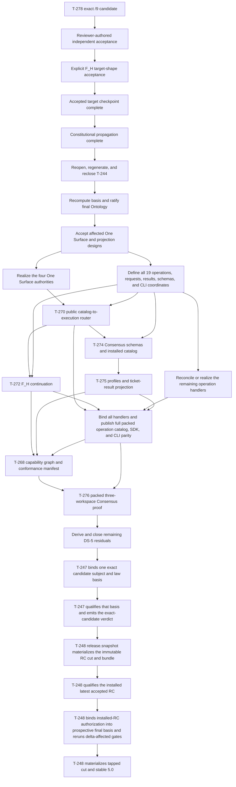

# ABIogenesis Goals

## Position

`GOALS.md` names the bounded current work wave. It does not replace INTENT,
PRODUCT, requirements, design, tickets, or release evidence.

## Current Wave: ABIogenesis 5.0 Full-Product Delivery

`GOAL-035` is the current goal.

Deliver one exact source-independent, SPEC_METHOD-compliant ABIogenesis 5.0
stable product for a trusted developer desktop through the complete accepted
product contract:

- immutable product/catalog resolution, verification, installation, binding,
  admission, inspection, allowlisting, and GraphFunction invocation;
- the complete seven-term typed C runtime and declared worker-result path;
- one versioned public SDK and thin `abg.cli` graph shell covering the complete
  current operator contract and interactive loop;
- the ABG SYSTEM-owned Consensus GraphFunction, invoked through the existing
  catalog invocation, result, and replay contract;
- ABIogenesis self-conformance and current observer/tuner proof;
- native operation plus one bounded Codex compatibility projection; and
- exact immutable candidate qualification, RC evaluation, and stable release.

GOALS, INTENT, PRODUCT, and requirements are the constitutional scope authority
for this wave. The 17 feature families below are the no-silence scope taxonomy.
T-244 is their sole derived feature traceability and closure projection, not an
independent scope authority. T-278's accepted target has propagated through
INTENT, PRODUCT, and requirements. T-244 has been regenerated and reclosed over
the derived 19-operation projection; its earlier exact-36 snapshot no longer
authorizes implementation. Delivery neither narrows a retained constitutional
claim by silence nor adds a capability outside the lawful scope. A new product
capability re-enters through the smallest lawful goal, intent, product, or
requirement reprice.

ABIogenesis 5.0 does not claim self-hosting or depend on GLC or odd_glc to
build, qualify, or release it. Recursive dogfooding begins only after stable
5.0 is released. odd_glc remains an independently released downstream catalog
product and may then mature to 1.0 over exact installed 5.0. Installed 5.0 plus
odd_glc 1.0 may subsequently act together as the development product for the
5.0.1 source project. Neither odd_glc maturation nor that successor proof is a
5.0 release gate.

## Managed Plan State

The current delivery position is the DS-2/DS-4 public-contract prerequisite
wave. The stable-first full-product scope remains current. F_H accepted the
exact `/9-candidate` target at checkpoint `83c87dec`; constitutional
propagation, T-244 regeneration, basis recomputation, and final Ontology review
are complete. Bounded realization now proceeds through the accepted owners.

| Plan fact | Current truth |
|---|---|
| Current phase | `DS-2/DS-4` realize the One Surface authorities and the private 19-operation definition family before reconciling public invocation and continuation |
| Current decision | Ontology `/9` is ratified: admitted GTL composition is the program; GraphFunction is its public callable library function/work contract; One Surface preserves four distinct authorities without four public verbs; one exact-candidate qualification family and the 27/7 Prime boundary remain; the external projection is 19 operations with a hard break. |
| Feature scope | 17 retained feature families; no feature removed by the reprice |
| Derived register | T-244 is regenerated and reclosed as the sole current 17-feature closure projection |
| Runtime work | The dirty T-270/T-272 integration remains provisional and frozen until T-280, T-281 P1, and the neutral M04-admission-to-M03-runtime boundary close on one basis |
| Next executable owner | Independently close T-280 and T-281 Phase A, complete T-281 P1, then reconcile T-270/T-272 without an M03 dependency on M04 public carriers. |
| Source line | `codex/t266-stage` is the sole 5.0 integration line; accepted authority/design and reviewed runtime slices checkpoint and push separately |
| Detailed current read model | This file and the active owner tickets; commentary remains non-authoritative review evidence. |

F_H acceptance of the goal plan did not silently accept T-278's four target
claims. The separate explicit target ruling, constitutional propagation, two
final current-basis reviews, and ratification decision completed Ontology `/9`.
Runtime authority still belongs to each affected accepted design and closure
gate; Ontology ratification does not close an implementation leaf.

## Retained Feature Families

These feature identities are stable across the T-278 reprice. Their precise
authority, implementation status, remaining work, and release evidence are
projected by the regenerated T-244 register.

| ID | Retained ABIogenesis 5.0 feature | Primary delivery phase |
|---|---|---|
| `A5-F01` | Exact product, install, workspace, lock, binding, and ABG-owned catalog | DS-5, then DS-6 installed proof |
| `A5-F02` | GTL declaration, serialization, raw admission, typecheck, and GraphFunction publication | DS-1 complete foundation; DS-5 publication closure |
| `A5-F03` | Seven-term C algebra, HOF, retry, recurse, complete interpreter, and runtime joins | DS-3 core complete; DS-2 public integration closure |
| `A5-F04` | Declared instructions and malformed F_P result admission before write or closure | DS-2 integration; DS-6 installed negative proof |
| `A5-F05` | Public contracts, schemas, vocabularies, operation identities, capabilities, and generated parity | DS-2/DS-4 full-operation prerequisite, then DS-6 proof |
| `A5-F06` | Versioned public SDK and thin `abg.cli` graph shell | DS-2/DS-4 full 19-operation projection before T-268 |
| `A5-F07` | Complete interactive start, truthful stop or gap, lawful-action, typed F_H, and continuation loop | DS-2, then DS-6 scenario proof |
| `A5-F08` | SYSTEM-owned bounded Consensus GraphFunction as a public-atom free construction | DS-4 |
| `A5-F09` | Public list, describe, and apply semantics for graph functions, node types, and overlays, with only GraphFunction callable | DS-2/DS-4 public-operation completion |
| `A5-F10` | Event, replay, lineage, provenance, correction, continuation, consequence, and typed failure truth | DS-2/DS-3 integration and DS-6 proof |
| `A5-F11` | ABIogenesis self-conformance without product exemption | DS-6, T-247 |
| `A5-F12` | Replay-grounded observer and tuner with draft-only mutation | DS-5 completion and DS-6 proof |
| `A5-F13` | Native operation plus one bounded Codex projection over the same public contract | DS-5 and DS-6 |
| `A5-F14` | Packed install, Hello World, and bounded live F_P proof | DS-6 |
| `A5-F15` | Exact-candidate subject/law basis and verdict, basis-bound prospective RC identity, qualification enforcement, installed-RC authorization lineage, and one bounded self-certifying release read model | DS-6, T-247 and T-248 |
| `A5-F16` | Immutable RC window and stable `5.0.0` release | DS-7, T-248 |
| `A5-F17` | Generic downstream catalog compatibility sufficient for odd_glc without making odd_glc a release dependency | DS-5/DS-6 bounded fixture |

The reprice contracts architectural duplication; it does not contract this
feature list. Consensus, the interactive operator loop, self-conformance,
observer/tuner, and the public SDK/CLI remain definition-bearing 5.0 scope.

## Operating Boundary

The supported environment is one trusted developer desktop. Native in-process
code, the local filesystem, and repository/Git transport are trusted.

The delivery wave defends:

1. malformed authored or serialized GTL through native types, raw admission,
   lint, and semantic compilation;
2. malformed, incomplete, or contradictory F_P output through declared
   response admission before materialization or closure;
3. exact product identity, dependency lock, catalog membership, allowlist,
   capability, replay, continuation, and closure truth; and
4. exact candidate/release coherence and source independence.

It does not add hostile-workstation tamper resistance, signing, hosted
marketplaces, multi-user administration, external scheduling, automatic wake,
or a portfolio of host adapters.

## Dependent Delivery Sequence

```text
DS-0 -> DS-1 -> DS-2 -> DS-3 -> DS-4 -> DS-5 -> DS-6 -> DS-7
```

| Phase | Authority/design owner | Realization/proof owner | Exit dependency |
|---|---|---|---|
| `DS-0` authority and design disposition | GOAL-035 and constitutional requirements, traced by T-244 | Independent three-view design review and F_H disposition | Constitutional surfaces agree on stable-first 5.0; every implementation boundary has an accepted design or remains blocked. |
| `DS-1` executable Consensus design probe and admission foundation | GTL, GraphFunction combinator applications, native Node/interface witnesses, C-algebra, M02 raw admission, conformance, and public-contract law | Close canonical `recurse`/`fan_in`/`gate` application declarations and compiler-derived lineage plus native Node-backed type inference, then run one admitted Consensus GTL body through the ABG semantic compiler, followed by strict raw-module admission and proportional conformance-inventory closure | Combinator operands and semantics have one canonical declaration authority; native Node-backed C/HOF relations reject caller phantoms; the exact typed gap census is retained; malformed serialized GTL refuses rather than strips; conformance reports only structurally applicable inventory; no plugin, service, shell, or script supplies a missing construct. |
| `DS-2` public invocation spine | Accepted execution-basis, instruction, F_P admission, and F_H designs | Focused runtime and public-contract slices | Compiled program identity reaches the execution basis; protocol truth is declared; malformed F_P output fails closed; typed F_H act and resume are public. |
| `DS-3` complete generic C, HOF, and recurse runtime | Accepted `workflow.C`, typed `fan_out`/`fan_in` plus ordered `C.batch`, `C.retry`, and typed `recurse` designs | Singular generic atom realizations | The same Consensus body recompiles after each atom; each atom also proves a non-Consensus consumer family. |
| `DS-4` full public operation and bounded Consensus product | Accepted public Ontology, Consensus requirements, and accepted GTL design | Complete 19-operation definition/binding/catalog/SDK/CLI parity plus published graph body, schemas, profiles, result projection, capability manifest, and installed scenarios | The exact mandatory capability manifest resolves the complete public operation surface; a caller invokes Consensus through `abg.cli` on existing, alternate, and caller-created temporary workspaces; converge, recurse, and F_H escalation outcomes are replay-citable. |
| `DS-5` complete retained non-operation 5.0 surface | Constitutional requirements and accepted designs, traced by regenerated T-244 | Singular realization and proof leaves not already closed as DS-4 prerequisites | Observer/tuner, host projection, downstream compatibility, publication, and other genuine non-operation residuals close at their row-specific gates; no public operation work remains deferred behind its capability manifest. |
| `DS-6` self-conformance and qualification | SPEC_METHOD, product requirements, and RELEASE_METHOD | Frozen-candidate conformance, malformed-boundary negatives, installed scenarios, and release qualification | ABIogenesis passes its own applicable method and product law; every retained release claim has exact evidence. |
| `DS-7` stable release | RELEASE_METHOD | RC publication, clean install, qualification, and final tap | One immutable source-independent ABIogenesis 5.0 product installs and operates without rebuild; Git ref, tarball, manifest, checksums, and evidence identify the same bytes. |

### Current Critical Path



The four One Surface authorities receive explicit realization owners after
their accepted designs; T-270 consumes them and cannot manufacture them inside
the router. The full 19-operation public surface has two milestones. Its
authoritative operation/request/result/schema/CLI-coordinate definition family
precedes T-270/T-272. Handler binding and packed catalog/SDK/CLI parity follows
the required semantic owners, including T-275's pure `ticket_consensus`
projection contribution, and precedes T-268/T-276. T-275 depends on the private P1 definition milestone,
not completed P2 publication. T-268 cannot publish the
mandatory public-contract capability against a partial operation catalog. This
avoids schema-after-handler drift, publication claims over unrealized behavior,
and a false complete capability manifest.

T-270 closes on focused public-router and runtime-authority proof. It does not
depend on T-268's final packed aggregation. T-272 and T-274 may proceed in
parallel after T-270 and the public projection inputs they consume. T-275
follows T-274. T-268 follows T-270, T-272, T-274, T-275, and full public
operation parity. T-276 alone owns the installed existing, alternate, and
temporary workspace aggregation proof. Only non-operation DS-5 residuals
follow T-276. This ordering removes the former T-270/T-268 closure cycle and
the former DS-4/public-surface inversion.

`codex/t266-stage` remains the singular 5.0 integration line. Do not merge or
rebase the large dirty runtime wave merely to absorb commentary-only commits
from `main`. At the T-278 decision boundary, checkpoint and push the accepted
plan/authority/design slice without staging provisional runtime files. After
runtime reconciliation and full gates, checkpoint and push that runtime slice
separately. The sibling `abiogenesis` worktree's untracked manuscript numbered
T-267 is not part of this line and must become T-279 before any future
adoption; obsolete self-build and T-252 planning artifacts from that sibling
worktree do not enter this stable-first plan.

Before DS-6, T-247 and T-248 are rebound from completed T-249 and the stale
T-244 projection to closed T-278, the ratified final Ontology, and regenerated
T-244. After all DS-5 product changes close, T-247 binds content-addressed
pre-RC candidate truth as one `ExactCandidateQualification<basis>` containing
the prospective published-RC identity/version and exact artifact bytes, with
one exact method/rule/source `QualificationLawBasis`, and qualifies those exact
bytes. The basis is neither a `ReleaseCut` nor a `ReleaseSnapshotManifest`.
Owning gates keep their semantic authority; one complete ordered same-basis
`QualificationGateResultVector<K>` conserves their admitted result citations
for one exactly-one `C.of(AF-22)` verdict reduction. The vector, AF-22 argument,
and verdict preserve that same law basis. T-248 consumes the same-subject-and-
law-basis green verdict to materialize the immutable RC cut and bundle,
qualifies the installed latest accepted RC, then binds that installed-RC basis
and green non-bypassed verdict, the prospective final bytes, and permitted
final-only delta as a new basis and reruns every affected gate before the final
tap. It cannot select unrelated candidate bytes, infer installed-RC acceptance
from the earlier cut, or defer final-delta qualification until after
publication.

A realization leaf is non-admissible until its named requirement and accepted
three-view design are current. Compiler gaps re-enter the affected design and
do not authorize an imperative workaround.

## Current Goal

| Goal ID | Goal | Success signal | Proving surface | Status |
|---|---|---|---|---|
| `GOAL-035` | Deliver the complete accepted ABIogenesis 5.0 stable product before recursive dogfooding begins. | Every retained feature-register row closes at its own requirement and design gate; the complete operator workflow and bounded Consensus function operate through the public contract; self-conformance and qualification pass; one exact packed release installs and verifies without rebuild; no admitted product claim is deferred or supplied by a second controller. | Accepted three-view designs, compiler gap census, leaf closure records, published contracts and schemas, exact installed archives, Hello World and Consensus scenarios, interactive operator proof, self-conformance result, RC and final remote refs/tags/checksums. | Active - `DS-2/DS-4` public-contract prerequisite realization |

## Plan Management

This file owns the current wave, retained feature taxonomy, phase status, and
critical dependency order. T-244 projects row-level closure over the accepted
constitutional sources. Tickets own singular delivery boundaries. Commentary
may explain or review the plan but does not create another active plan.

Update this file when F_H changes target scope, a phase changes state, a
dependency changes, or an accepted compiler/design finding changes the
delivery topology. Do not rewrite completed evidence as if it were current
authority. Preserve history in ticket closure records and comments while this
surface remains present tense.

At every phase transition, reconcile:

1. the current phase and next executable owner in `Managed Plan State`;
2. affected feature rows and dependencies;
3. T-244's derived closure projection;
4. ticket state and accepted design references; and
5. the detailed commentary read model when it materially improves handoff.

Plan management must reduce restart ambiguity, not create planning work in
place of implementation. A new ticket is required only for a singular change
boundary that cannot be owned lawfully by an existing carrier.

## Invalidation Law

Qualification input becomes immutable by exact content identity at DS-6 while
the RC correction window remains bounded and mutable. Any product-significant
change creates a new `ExactCandidateQualification<basis>` and invalidates its
dependent verdict, RC, and final evidence. Qualification and release may
consume or reject exact bytes; they may not patch a bound basis or substitute
unrelated candidate bytes.

Each phase ends with an authority-first self-review against PRODUCT, its owning
requirements/design, the phase ticket, the trusted-desktop boundary, and the
next phase's input contract. A review finding blocks only when it is reachable
on a supported path, corrupts truth, violates authority, or falsifies closure.
Other findings return to triage and do not create an unbounded reviewer gate.

## Deferred Product Decisions

The following are not hidden 5.0 dependencies:

- generic Review or homeostatic intent-refinement products beyond the bounded
  Consensus GraphFunction and the current observer/tuner contract;
- ABG-owned watchers, schedulers, recurrence, or automatic wake;
- update, disable, unbind, uninstall, retirement, revocation, or supersession;
- hosted registry/storefront, ranking, billing, signing, license, or RBAC services;
- multiple host adapters or generic pass@k/harness products;
- hostile local-object, filesystem, or cryptographic tamper defense;
- universal proof-carry-through witness migration for every legacy edge while
  PRODUCT makes no universal coverage-gated-closure claim;
- Python tenant reactivation or retired odd_sdlc/odd_chat products; and
- 5.0.1 dogfood execution or an odd_glc release as a condition of the 5.0
  stable tap.

They re-enter only through the smallest lawful constitutional change class.
